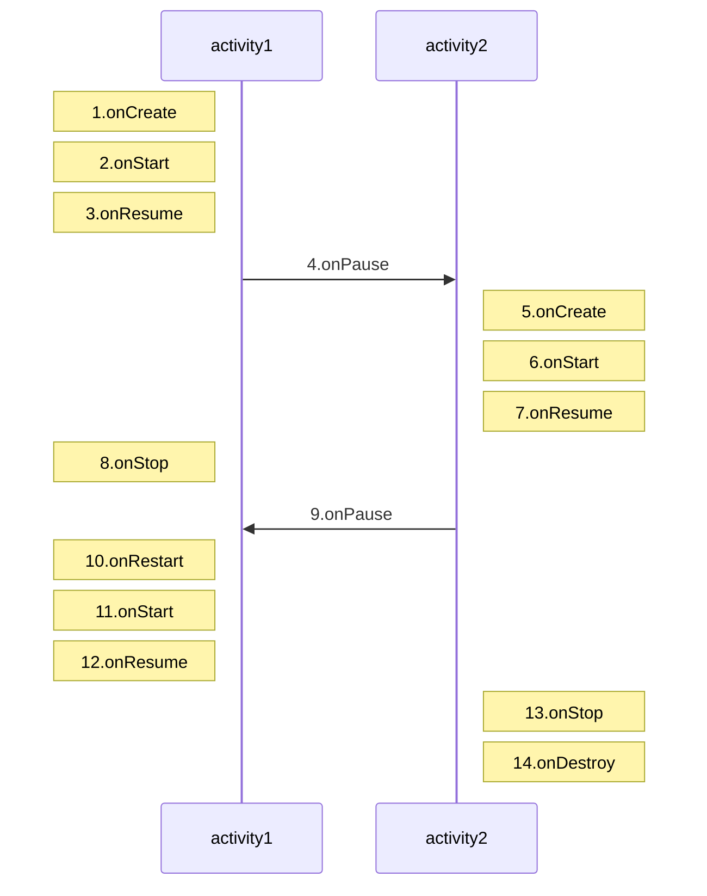
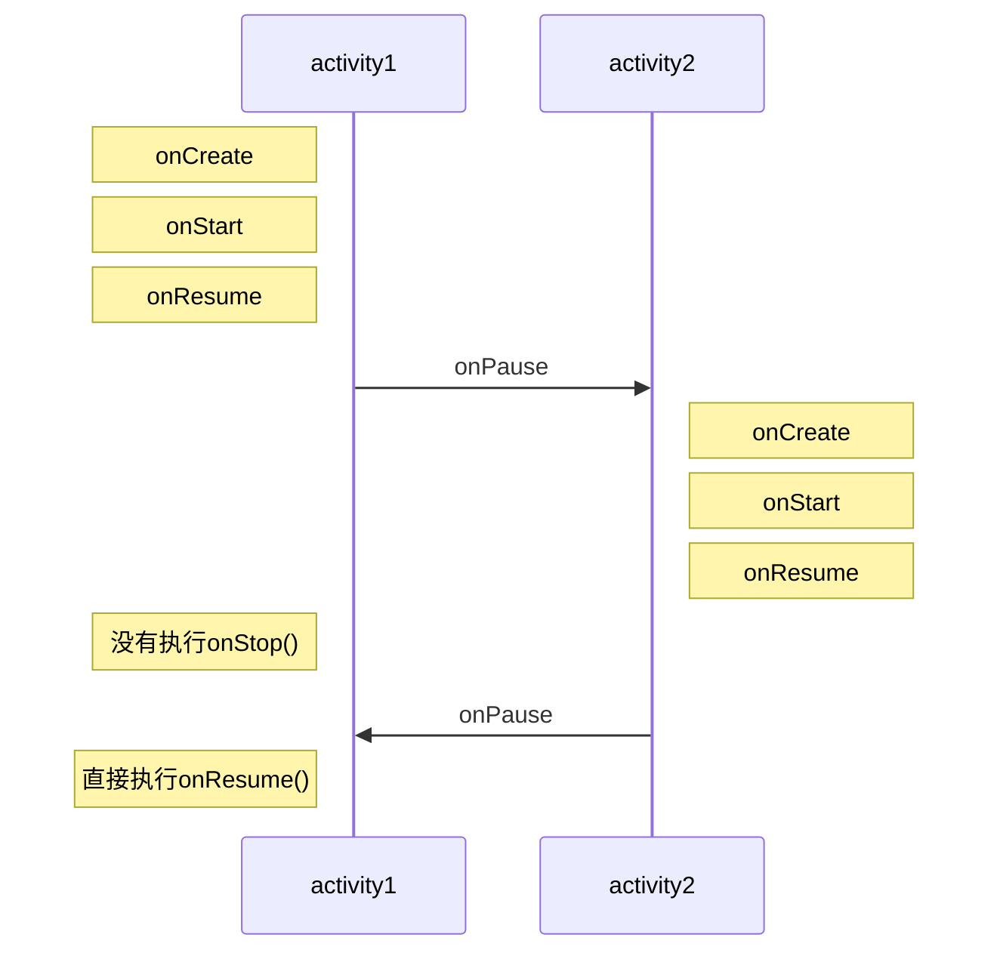

转载请注明链接：http://blog.csdn.net/feather_wch/article/details/79279307

# Activity的生命周期和启动模式

版本:2019/3/26-1(11:30)

---

[toc]
## 四种状态(2)

1、Activity的四种状态
|形态|介绍|
|---|---|
|`active`/`running`|`Activity`处于`栈顶`, `可见`, 与用户交互|
|`pasued`|另一个全新`Activity`置于栈顶(该新Activity`非全屏`或者`透明`), `可见`, `不可交互`——内存不足时可以被释放|
|`stopped`|被另一个`Activity`完全覆盖, `不可见`, 保持状态信息和成员变量|
|`killed`|被`System`回收|

2、Activity的四种状态是如何切换的?
> * Activity的生命周期，本质就是四种状态的来回切换
> 1. onStart()/onResume，会将状态切换到`active/running状态`
> 1. onPause()，会将状态从`active/running状态`切换到`pause状态`
> 1. onStop(), 会将状态从`pause状态`切换到`stop状态`
> 1. onPause()/onStop()->onStart()/onResume, 会将状态从`pause/stop状态`切换到`active/running状态`

## 生命周期(20)

1、为什么要有生命周期?
> 1. 能在Activity处于不同状态时，做最合适的工作。
> 1. 没有生命周期，就如同`浮游`，非生即死的状态，做不了任何有价值的事情。
> 1. 有生命周期，就如同`人`的`婴儿、青年、壮年、老年`在不同的时期做对应的事情，人生才有价值。

2、Activity生命周期

|生命周期|说明|是否可杀死|源码位置|
|---|---|---|---|
|onCreate| 初始化工作, setContentView|不可以|ActivityThread.handleLauchActivity()->performLauchActivity()->mInstrumentation.callActivityOnCreate()|
|onStart| 可见, 不可交互|不可以|ActivityThread.handleLauchActivity()->performLauchActivity()->activity.performStart()->mInstrumentation.callActivityOnStart()|
|onResume| 可见，可交互|不可以|ActivityThread.handleResumeActvity()->performResumeActivity()|
|onPause| 可见, 不可交互，可以存储数据、停止动画，但不能耗时-会影响到新Activity的显示(新ActivityonResume在旧ActivityonPause后才执行)|可以|
|onStop| 不可见, 可以进行轻量级的回收工作—不能耗时|可以|
|onRestart| 回到Activity时调用|不可以|ActivityThread.performRestartActivity()->mInstrumentation.callActivityOnRestart()|
|onDestory| Activity即将被销毁，需要进行回收工作和资源释放|可以|

3、什么情况下会执行：onPause()->onResume()
> 1. 在当前Activity上面有个Dialog，并且退出Dialog
> 1. Activity先执行`onPause()`处于可见、不可交互，然后回到`onResume()`进入可交互状态。

4、什么情况下会执行：onStop()->onRestart()->onStart()
> 1. 从新的Activity返回到当前Activity时
> 1. 切换到桌面，又切换回当前Activity。

5、什么情况下执行: onPause()->onCreate() 或者 onStop()->onCreate()
> 1. 系统内存不足，导致Activity在对应周期被杀死。然后重建该Activity


6、打开新Activity的流程图


7、打开Dialog、窗口Activity或者透明主题的新Activity的流程图
> 窗口Activity：Activity布局中加上属性

```xml
Android:theme="@android:style/Theme.Dialog"
```




8、Activity生命周期的要点
>1. `onCreate`和`onDestory`配对，只执行一次，表示创建和销毁
>2. `onStart`和`onStop`配对，决定是否可见，伴随`用户操作`或者`设备屏幕的点亮和熄灭`，会执行多次
>3. `onResume`和`onPause`配对，决定是否可交互，伴随`用户操作`或者`设备屏幕的点亮和熄灭`，会执行多次

9、onCreate和onStart的区别
>1. 执行1次/执行多次
>2. onCreate能做的, onStart都能做, 除非只适合执行一次的逻辑
>3. onCreate处于不可见，onStart可见但不可交互

10、onStart和onResume的区别
>1. 均可见，前者不可交互，后者可交互
>2. 官方建议`onResume`中可以做【开启动画】和独占设备的操作

11、onPause和onStop的区别
>1. 前者可见，后者不可见
>2. 内存不足时一定会执行`onPause`,`onStop`不一定执行
>3. 保存数据最好在`onPause`中，但不能太耗时
>4. 尽量将重量级操作放在`onStop`中能够提高打开新Activity的速度(onPause会影响新Activity的创健)

12、onStop和onDestory的区别
>1. `onStop`时，`Activity`依旧在内存中，可以切换回该`Activity`。
>2. `onDestory`时，已经被系统释放了。

13、onPause中可否进行耗时操作?(打开第二个Activity慢是什么原因?)
> 1. onPause中进行耗时操作，会导致打开第二个Activity较慢
> 1. 【结合项目经验】遇到一个Activity启动就是很慢，后面定位到是前一个Activity的onPause()有耗时操作

14、“onStart是可见不可交互、onResume是可见可交互”的说法是否正确?
> 1. 不准确
> 1. onStart()之后会立即调用onResume()
> 1. onResume()调用之后，调用了`addView()并且serVisibile()`，此时Activity才真正可见。
> 1. 因此`onStart()、onResume()`回调时，都处于不可见状态。

15、onStart和onStop决定了是否可见?
> NO，不准确

16、onPause和onResume决定了是否可交互?
> NO，不准确

17、内存不足Activity被释放，onPause和onStop都一定会执行?onDstory不一定执行?
> 1. onPause一定执行
> 1. onStop不一定
> 1. onDestory一定不执行

### 源码分析

18、Activity和AMS之间关于生命周期的机制
>1. 启动`Activity`的请求会由`Instrumentation`处理，会通过`Binder`向`AMS`发送请求
> 2. `AMS`内部维护着一个`ActivityStack`并负责栈内的`Activity`的状态同步
> 3. `AMS`通过`ActivityThread`去同步`Activity`的状态从而完成`生命周期`方法的调用。

19、ActivityStack的resumeTopActivityInnerLocked()
```java
    //ActivityStack.java
    private boolean resumeTopActivityInnerLocked(ActivityRecord prev, ActivityOptions options) {
        ......
        //1. 栈顶的Activity先onPause后
        boolean pausing = mStackSupervisor.pauseBackStacks(userLeaving, next, false);
        if (mResumedActivity != null) {
            //2. 新Activity才会启动
            pausing |= startPausingLocked(userLeaving, false, next, false);
        }
        ......
    }
```

20、启动新Activity的大致流程
> 1. `ActivityStack`会先执行栈顶Activity的`onPause`，之后才会执行启动新Activity
> 2. 在`ActivityStackSupervisor`的`realStartActivityLocked()`会调用`app.thread.scheduleLauchActivity()`进行新Activity的启动
> 3. 最终会调用`ActivityThread`中的`handleLauchActivity()`
> 4. `handleLauchActivity`中执行`performLauchActivity()`调用`onCreate`和`onStart`方法
> 5. 之后`handleLauchActivity`中执行`handleResumeActivity()`调用`onResume`方法
> * 生命周期调用顺序：旧onPause->新onCreate->新onStart->新onResume->旧onStop

## 异常生命周期(24)

1、Activity异常生命周期
>是指`Activity`被系统回收或者由于当前设备的`Configuration(方向)`发生改变从而导致`Activity`被销毁重建

2、为什么Activity会重建?
> 1. Activity被销毁后，需要在用户回到该页面时，能正常看到该页面
> 1. 就需要进行`Activity的重建`

2、是否可以禁止因为config改变导致的重建?
> 1. 按照`configChanges`的属性，可以依次禁止，但是可能会导致问题
> 1. 禁止`语言切换`，虽然不会Activity重建，但是会导致`多语言同时出现的异常问题`

3、因为config改变导致的重建，会调用哪些生命周期?
> 1. onPause
> 1. onStop
> 1. onDestory


4、异常生命周期涉及到哪些重要方法?
|生命周期|说明|源码位置|
|---|---|---|
|☆onSaveInstanceState(Bundle outState)|Activity被动销毁时调用，保存重要信息，用于恢复||
|☆onRestoreInstanceState(Bundle savedInstanceState|重建时调用，会将Bundle传递到onCreate()中|ActivityThread.handleLauchActivity()->performLauchActivity()->mInstrumentation.callActivityOnRestoreInstanceState()【activity.performStart()之后调用】|
> 1. 用户主动销毁Activity不会触发`onSaveInstanceState()`如finish()、按下回退键退出Activity
> 1. 按下HOME键、按下电源键、启动其他Activity、横竖屏切换: 如果导致了Activity的重建，会触发onSaveInstanceState()

5、什么情况下可能会导致Activity的重建?
> 1. 按下HOME键
> 1. 按下电源键
> 1. 启动其他Activity
> 1. 横竖屏切换

6、如果Activity被意外关闭，如何判断Activity是否被重建？
> 1. 通过onRestoreInstanceState()和onCreate方法来判断。
> 1. onRestoreInstanceStae()被调用，或者onCreate()的参数Bundle不为null。都表明Activity被重建
> 1. 因为Activity被异常关闭后，那么系统会调用onSaveInstanceState保存当前Activity的状态。


7、资源相关的系统配置改变导致Activity的杀死并重建,涉及到的生命周期流程?
>场景： Activity的横竖屏切换
> 1. 系统配置改变后，`Activity`会被销毁，其`onPause`、`onStop`、`onDestory`均会被调用
> 2. 系统会额外调用`onSaveInstanceState`来保存当前`Activity`的状态, 调用时机在`onPause`前后(onStop之前)
> 3. `Activity`重新创建后，会调用`onRestoreInstanceState()`并且把`onSaveInstanceState`保存的`Bundle`对象作为参数同时传递给`onRestoreInstanceState()和onCreate()`, 其调用时机在`onStart`之后
> 4. 系统会默认保存当前Activity的视图结构并且恢复一定数据。根据每个View的`onSaveInstanceState()`和`onRestoreInstanceState()`可以知道系统能自动恢复哪些数据。

8、系统保存和恢复View层次结构的工作流程
>1. `Activity`被意外终止时，会调用`onSaveInstanceState()`去保存数据
> 2. `Activity`去委托`Window`保存数据
> 3. `Window`再委托顶层容器去保存数据(ViewGroup：一般是DecorView)
> 4. `顶层容器`最后一一通知其子元素保存数据

9、onRestoreInstanceState的调用时机?
> 1. onStart之后
> 1. `ActivityThread.handleLauchActivity()->performLauchActivity()->activity.performStart()->mInstrumentation.callActivityOnRestoreInstanceState()`

10、状态恢复还会涉及到View的状态恢复
> 【自定义View】需要处理状态恢复相关的内容

11、onRestoreInstanceState()和onCreate()哪个最适合恢复数据?
> 1. onRestoreInstanceState()适合，不需要额外判断
> 1. onCreate()需要额外判断bundle是否为null

### View的保存和恢复

12、TextView的onSaveInstanceState()
```java
@Override
public Parcelable onSaveInstanceState() {
    Parcelable superState = super.onSaveInstanceState();
    ...
    //1. 保存了选中状态
    if (save) {
        SavedState ss = new SavedState(superState);
        ss.selStart = start;
        ss.selEnd = end;
        //2. 保存文本
        if (mText instanceof Spanned) {
            ......
            ss.text = sp;
        } else {
            ss.text = mText.toString();
        }
        if (isFocused() && start >= 0 && end >= 0) {
            ss.frozenWithFocus = true;
        }
        //3. 保存错误信息
        ss.error = getError();
        //4. 保存编辑器状态
        if (mEditor != null) {
            ss.editorState = mEditor.saveInstanceState();
        }
        return ss;
    }
    return superState;
}
```

13、TextView的onRestoreInstanceState()
```java
    @Override
    public void onRestoreInstanceState(Parcelable state) {
        if (!(state instanceof SavedState)) {
            super.onRestoreInstanceState(state);
            return;
        }
        SavedState ss = (SavedState)state;
        super.onRestoreInstanceState(ss.getSuperState());
        //1. 读取保存的文本
        if (ss.text != null) {
            setText(ss.text);
        }
        //2. 读取保存的状态
        if (ss.selStart >= 0 && ss.selEnd >= 0) {
            ......
        }
        //3. 保存的错误信息
        if (ss.error != null) {
            ......
        }
        //4. 读取保存的编辑状态
        if (ss.editorState != null) {
            createEditorIfNeeded();
            mEditor.restoreInstanceState(ss.editorState);
        }
    }
```

### Activity的保存和恢复

14、onSaveInstanceState、onRestoreInstanceState、onCreate的数据存储与恢复
```java
    //存储数据：
    @Override
    protected void onSaveInstanceState(Bundle outState) {
        super.onSaveInstanceState(outState);
        outState.putString("saved_data", "保存的数据");
    }

    //恢复数据：
    @Override
    protected void onRestoreInstanceState(Bundle savedInstanceState) {
        super.onRestoreInstanceState(savedInstanceState);
        String data = savedInstanceState.getString("saved_data");
    }

    //恢复数据：有额外判断
    @Override
    protected void onCreate(@Nullable Bundle savedInstanceState) {
        super.onCreate(savedInstanceState);
        setContentView(R.layout.activity_main);
        //onCreate中需要判断是`正常启动` 还是 `异常恢复`
        if(savedInstanceState != null){
            String data = savedInstanceState.getString("saved_data");
        }
    }
```
> 因为`onCreate`中恢复数据需要额外判断，官方建议在`onRestoreInstanceState`中恢复数据。

#### onSaveInstanceState()源码流程

15、onSaveInstanceState()源码分析
```java
    // Activity.java-保存状态
    protected void onSaveInstanceState(Bundle outState) {
        // 1、保存Window的层次状态。
        outState.putBundle(WINDOW_HIERARCHY_TAG, mWindow.saveHierarchyState());
        outState.putInt(LAST_AUTOFILL_ID, mLastAutofillId);
        // 2、保存所有Fragment的状态
        Parcelable p = mFragments.saveAllState();
        outState.putParcelable(FRAGMENTS_TAG, p);
        if (mAutoFillResetNeeded) {
            outState.putBoolean(AUTOFILL_RESET_NEEDED, true);
            // 3、自动填充功能，保存状态信息
            getAutofillManager().onSaveInstanceState(outState);
        }
        // 4、Application执行dispatchActivitySaveInstanceState(), 内部调用ActivityLifecycleCallbacks.onActivitySaveInstanceState()
        getApplication().dispatchActivitySaveInstanceState(this, outState);
    }

    // PhoneWindow.java-保存层次状态
    public Bundle saveHierarchyState() {
        Bundle outState = new Bundle();
        // DecorView
        if (mContentParent == null) {
            return outState;
        }
        // 1、DecorView保存层次状态
        SparseArray<Parcelable> states = new SparseArray<Parcelable>();
        mContentParent.saveHierarchyState(states);
        outState.putSparseParcelableArray(VIEWS_TAG, states);
        // 2、保存具有焦点的View的ID
        final View focusedView = mContentParent.findFocus();
        if (focusedView != null && focusedView.getId() != View.NO_ID) {
            outState.putInt(FOCUSED_ID_TAG, focusedView.getId());
        }
        // 3、保存Panel的状态(Menu中面板)。比如自定义Menu的样式，需要在AppCompatActivity的onPrepareOptionsPanel()中利用反射，才能在Menu中显示出图标。
        SparseArray<Parcelable> panelStates = new SparseArray<Parcelable>();
        savePanelState(panelStates);
        if (panelStates.size() > 0) {
            outState.putSparseParcelableArray(PANELS_TAG, panelStates);
        }
        // 4、保存Toolbar的层次状态
        if (mDecorContentParent != null) {
            SparseArray<Parcelable> actionBarStates = new SparseArray<Parcelable>();
            mDecorContentParent.saveToolbarHierarchyState(actionBarStates);
            outState.putSparseParcelableArray(ACTION_BAR_TAG, actionBarStates);
        }
        return outState;
    }

    // View.java-DecorView会执行dispatchSaveInstanceState，分发层层保存状态
    public void saveHierarchyState(SparseArray<Parcelable> container) {
        dispatchSaveInstanceState(container);
    }

    // ViewGroup.java-DecorView(ViewGroup)重写了该方法并且遍历子View
    @Override
    protected void dispatchSaveInstanceState(SparseArray<Parcelable> container) {
        // xxx省略xxx
        final View[] children = mChildren;
        for (int i = 0; i < mChildrenCount; i++) {
            View c = children[i];
            // 遍历view并且执行dispatchSaveInstanceState()
            c.dispatchSaveInstanceState(container);
        }
    }

    // View.java-执行onSaveInstanceState()保存View的状态
    protected void dispatchSaveInstanceState(SparseArray<Parcelable> container) {
        // 1、执行onSaveInstanceState(), 保存View的状态。(自定义View时，可以重写该方法来保存View中需要恢复的数据)
        Parcelable state = onSaveInstanceState();
        if (state != null) {
            // 2、将以mID作为key, 保存到SparseArray中。外部最终将SparseArray保存到PhoneWindow中的Bundle中，
            container.put(mID, state);
        }
    }
```

16、请简述下关于保存和恢复Activity的状态信息，内部的工作流程是怎么样的？
> 1. Activity: 执行onSaveInstanceState()
>       1. 保存Window的层次状态
>       1. 保存所有Fragment的状态
>       1. 保存自动填充功能的状态信息(Android8.0推出):[Android 8.0上的自动填充功能](https://www.jianshu.com/p/531ce99bd961)
>       1. Application.dispatchActivitySaveInstanceState()-涉及到LifeCycle这个谷歌新推出的内容。
> 1. Window: saveHierarchyState()保存状态信息。
>       1. mContentParent.saveHierarchyState(states): 交给DecorView层层保存View的信息
>       1. 保存具有焦点的View的ID
>       1. 保存Panel的状态(Panel属于菜单Menu中的内容):
>       1. 保存Toolbar的状态
> 1. DecorView(ViewGroup): 层层保存所有View的信息
>       1. saveHierarchyState()->dispatchSaveInstanceState()

17、DecorView保存View的信息具体是指做什么?
> 1. 遍历所有View树上的子View，执行其`onSaveInstanceState()`

18、DecorView如何建立的和Window的关系?(何时DecorView作为成员变量保存到Window内部的?)

19、保存Window的状态主要保存哪些信息?
> 1. 触发DecorView进行状态保存
> 1. 保存拥有焦点的View ID
> 1. 保存菜单、Toolbar的状态

20、Activity的onSaveInstanceState()会进行Fragment状态的保存，这个保存Fragment状态具体做了什么?
> 源码: FragmentManager.java
```java
protected void onSaveInstanceState(Bundle outState) {
    // 1、Fragment的状态，序列化后，将其存储到Bundle中。
    Parcelable p = mFragments.saveAllState();
    if (p != null) {
        outState.putParcelable(FRAGMENTS_TAG, p);
    }
    // xxx
}
// FragmentManager.java - 保存三种状态
Parcelable saveAllState() {
    int N = mActive.size();
    // 1. 将FragmentManager中所有活跃的Fragment的状态，保存到FragmentManagerSate中
    FragmentState[] active = new FragmentState[N];
    for (int i=0; i<N; i++) {
        Fragment f = mActive.get(i);
        if (f != null) {
            FragmentState fs = new FragmentState(f);
            active[i] = fs;
        }
    }

    // 2. 将FragmentManager中所有已经add的Fragment的index索引值，保存到FragmentManagerSate中
    int[] added = null;
    if (mAdded != null) {
        N = mAdded.size();
        if (N > 0) {
            added = new int[N];
            for (int i=0; i<N; i++) {
                added[i] = mAdded.get(i).mIndex;
            }
        }
    }

    // 3. 将【回退栈状态】，保存到FragmentManagerSate中
    BackStackState[] backStack = null;
    if (mBackStack != null) {
        N = mBackStack.size();
        if (N > 0) {
            backStack = new BackStackState[N];
            for (int i=0; i<N; i++) {
                backStack[i] = new BackStackState(mBackStack.get(i));
            }
        }
    }

    // 4. 保存以上三种状态和信息
    FragmentManagerState fms = new FragmentManagerState();
    fms.mActive = active;
    fms.mAdded = added;
    fms.mBackStack = backStack;
    return fms;
}


// Fragment.java - Fragment保存了哪些状态
public FragmentState(Fragment frag) {
// 1. fragment id
    mFragmentId = frag.mFragmentId;
// 2. 容器的id
    mContainerId = frag.mContainerId;
// 3. Tag
    mTag = frag.mTag;
// 4. retaininstance
    mRetainInstance = frag.mRetainInstance;
// 5. 参数
    mArguments = frag.mArguments;
// 6. 是否detached
    mDetached = frag.mDetached;

// classname
    mClassName = frag.getClass().getName();
    mIndex = frag.mIndex;
    mFromLayout = frag.mFromLayout;
}

```
> 1. 保存回退栈状态
> 1. 保存所有已经add的fragment的index索引值
> 1. 保存所有处于活跃状态的Fragment的信息
>      1. arguments
>      1. tag
>      1. mRetainInstance
>      1. fragmentid、容器id
>      1. 是否detached

21、Fragment的状态保存做了哪些事情?
> 1. 保存回退栈状态
> 1. 保存所有已经add的fragment的index索引值
> 1. 保存所有处于活跃状态的Fragment的信息

22、在Activity中调用onRestoreInstanceState()恢复数据和在onCreate中恢复数据区别是？
> 1. onRestoreInstanceState一旦被调用，那么其参数Bundle saveInstanceState一定是有值的，不需要而外判断是否为空；
> 1. onCreate需要额外判断`Bundle saveInstanceState`是否为null。
> 1. 官方建议采用OnRestoreInstanceState恢复数据。

23、如何利用onCreate()的参数savedInstanceState解决因为Activity的重建导致Fragment的重叠问题?
> 1. Activity的onCreate()需要在`savedInstanceState==null`时才添加Fragment
> 2. 否则会出现因为重建导致多次添加Fragment，从而导致重叠。

24、onSaveInstanceState、ViewModel(Fragment.setRetainInstance)、本地存储(Room、sp)三种方式保存的数据存活时间和适用场景
||onSaveInstanceState|ViewModel(Fragment.setRetainInstance)|本地存储|
|---|---|---|---|
|存活时间|直到Activity被真正finish|直到Activity被真正finish|本地持久化|
|缺点1|只适合少量可序列化的数据，不适合Bitmap等数据|Activity彻底销毁后，数据丢失|数据库、sp中读取肯定要慢|
|缺点2|数据的保存/恢复和Activity代码耦合|||
|优点||数据和UI代码分离|数据持久|

## 进程优先级(5)

1、为什么Android中进程要分优先级?
> 在系统资源不足时，根据优先级进行合理的资源调度，释放优先级低的进程

2、资源内存不足导致低优先级的Activity被杀死
>场景：系统内存不足时，会按照优先级去杀死目标Activity所在的进程
>Activity优先级-从高到低：
>1. 前台Activity——正在和用户交互的Activity
>2. 可见但非前台Activity——比如对话框弹出导致Activity可见但不可交互
>3. 后台Activity——已经被暂停的Activity，已经执行了`onStop`，优先级最低

3、Android进程分类(优先级-从高到低)
> 1. 前台: 正在交互的Activity，或者和前台Activity交互的Service
> 1. 可见: 可见，但是不可以交互的Activity
> 1. 服务：Service
> 1. 后台：处于后台，不可见，不可交互的Activity。
> 1. 空：没有任何活动组件，用于提高组件的响应速度。随时可以被销毁。

4、用户在操作一个Activity，该Activity进程正在和另一个进程的Service交互，这个Service所属的进程是属于哪个级别的?
> 处于前台进程

5、Activity的前台还是后台如何区分?
> 1. Activity本身没有前台/后台相关的状态
> 1. Activity所处的任务栈是前台的，Activity就是前台的

## Configuration Changes(8)

1、AndroidManifest中configChanges包含的系统配置
|条目|含义|
|---|---|
|orientation|屏幕方向改变, 如横竖屏切换|
|screenSize|屏幕的尺寸信息改变, 旋转屏幕时, 屏幕尺寸会发生变化(`API 13新增`)——因此13以及以上该选项都会导致`Activity`重启|
|locale|一般指切换了系统语言|
|keyboard|键盘类型改变, 如使用了外插键盘|
|keyboardHidden|键盘可访问性改变, 如用户调出键盘|
|fontScale|系统字体缩放比例改变, 如选择新字号|
|uiMode|用户界面模式改变, 如开启夜间模式(`API 8新增`)|
|smalletScreenSize|设备物理屏幕尺寸改变, 如用户切换到外部的显示设备(`API 13新增`)|
|mcc|SIM卡唯一标识IMSI(国际移动用户标识码)中的`国家代码`, 三位, `中国为460`|
|mnc|SIM卡唯一标识IMSI(国际移动用户标识码)中的`运营商代码`, 两位, `中国移动为00`, `中国联通为01`, `中国电信为03`|
|【不重要】layoutDirection|布局方向改变, 正常情况下无需修改布局的`layoutDirection`属性(`API 17`新增)|
|【不重要】touchscreen|触摸屏发生改变, 正常情况下不会发生|
|【不重要】navigation|系统导航方式发生改变, 比如采用轨迹球导航|

### 横竖屏切换

2、前台Activity的横竖屏旋转时，Android为什么要将其销毁+重建，这个设计的意图是什么？考虑了什么?
>

2、如何在Activity禁止横竖屏切换?
>1. 在`AndroidManifest`中给相应的`Activity`添加上属性`android:screenOrientation="portrait"`
>2.  `portrait`为竖屏
>3. `landscape`为横屏
>4. 或者可以在`onCreate`中添加代码`setRequestedOrientation(ActivityInfo.SCREEN_ORIENTATION_PORTRAIT/LANDSCAPE);`
>5. 最终会禁止横竖屏切换，也不会触发`保存数据/恢复数据`的回调

3、如何实现Activity在横竖屏切换时，禁止Activity的重建?(通过configChanges实现)
>1. 给`Activity`添加属性：`android:configChanges="orientation|screenSize"`
>2. `Activity`不会再销毁和重建，只会调用`onConfigurationChanged()`方法，可以进行特殊处理。

4、禁止了Activity的横竖屏切换(重建)后, 什么回调方法会在横竖屏切换时被调用?
> onConfigurationChanged()

5、通过禁止了横竖屏从而禁止了Activity的重建，既然Activity不再会重建，也就不需要再去处理数据的保存和恢复?
> 错误！
> 1. 内存不足时，依旧可能会出现Activity被杀死并且重建的情况。

### 语言切换

6、如何避免语言切换后，Activity的重建?
```xml
android:configChanges="locale|layoutDirection|keyboard"  //缺一不可
```

7、禁止多语言切换后，Activity的重建会导致什么问题?
> 1. Activity的确不会重建了
> 1. 会出现`多语言词条`同时展示的问题

8、语言切换时必须要Activity销毁重建，为什么?
> 保证词条资源的正确加载

## 启动模式(38)

1、任务栈是什么?
> 1. Android采用任务栈来管理`Activity`
> 1. 任务栈---具有先进后出原则
> 1. 一个App可以有多个任务栈。

2、为什么要有启动模式？
>1. 默认情况下，多次启动同一个`Activity`的时候，系统会创建多个实例并且全部放入`任务栈`中
>2. 系统提供`启动模式`就是用于修改系统的`默认行为`

3、启动模式分类
|启动模式|作用|补充|
|---|---|---|
|standard(默认)|不会复用任务栈中的Activity，而是新建Activity实例添加到栈顶。`新Activity`位于启动者的任务栈中||
|singleTop|栈顶复用模式——解决`栈顶`多个重复`Activity`的问题。|启动时，会判断`栈顶是否是该`Activity`，如果是就不会重新创建，同时会回调`Activity`的`onNewIntent()`方法，此`Activity`的`onCreate`和`onStart`不会被系统调用。例如任务栈中`A-B-C-D(栈顶)`, 此时启动`D`不会出现`ABCDD`的情况。但是如果是启动`B`, 则任务栈中为`ABCDB`(创建了B)|
|singleTask|栈内复用模式——在`任务栈`中寻找该`Activity`, 不存在则新建Activity, 如果请求的是`新栈`就创建`新栈`并放入`新栈`中, 如果请求的是`原栈`, 就将其放入原栈中; 存在则将该`Activity`之上的所有Activity出栈，最终该`Activity`处于栈顶, 并调用其`onNewIntent()`方法|通过该方法重复创建，生命周期顺序`onPause()->onNewIntent()->onResume()`|
|singleInstance|单实例模式——拥有`singleTask`的所有特性，额外增加的是该`Activity`只能单独位于一个`任务栈`中，后续的请求均不会再创建`新的Activity`||

4、默认启动的Activity具有什么特点?(stardard启动模式有什么特点?)
> 1. `不复用`
> 1. 每次启动都新建一个Actvity实例
> 1. 新Activity和`启动者`在`同一个任务栈中`

5、standardTop模式启动有什么特点?
> 1. `复用栈顶`
> 1. 栈顶存在目标Activity就复用，不存在就新建
> 1. 无论是`复用还是新建`，`目标Activity和启动者`都在`同一个任务栈`
> 1. `复用`,调用生命周期`onNewIntent()`, 生命周期流程`onPause()->onNewIntent()->onResume()`


6、singleTask模式启动有什么特点?
> 1. `栈内复用`
> 1. 栈中存在就复用，不存在新建
> 1. `新建`，根据选项，选择是`新栈`还是`旧栈`存放该Activity
> 1. `复用`，将之上的所有Activity出栈
> 1. `复用`,调用生命周期`onNewIntent()`, 生命周期流程`onPause()->onNewIntent()->onResume()`

7、singleInstance模式启动有什么特点?
> 1. `单例模式`
> 1. 独自霸占一个`任务栈`
> 1. 存在就复用，不存在新建
> 1. `复用`,调用生命周期`onNewIntent()`, 生命周期流程`onPause()->onNewIntent()->onResume()`

8、onNewIntent()生命周期出现在哪些场景？
> 1. singleTop模式：栈顶找到了该Activity，只回调onNewIntent()方法
> 1. singleTask模式：找到任务栈中的该Activity，调用其onNewIntent()
> 1. singleInstance模式：复用时，调用其onNewIntent

9、可以通过Application的Context去启动standard模式的Activity吗？可以用Service的Context去启动Activity吗？
> 不可以！会报错
> 1. 因为`非Activity`的`Context`并没有`任务栈`
> 1. 所以需要给`新Activity`指定`FLAG_ACTIVITY_NEW_TASK`标记位，用于启动时创建新的任务栈。
> 1. 【错误说法！】: 这也就是singleTask模式。 `FLAG_ACTIVITY_NEW_TASK + FLAG_ACTIVITY_CLEAR_TOP`才是`SingleTask的效果`

### 两种方式指定启动模式

10、Activity的启动模式如何指定?
> 1. 一种是静态设置，在`AndroidManifest`中设置`android:lauchMode`属性
> 1. 一种是动态设置，通过调用`intent.addFlags()`来设置Flags

11、静态设置和动态设置的区别
||静态设置|动态设置|
|---|---|---|
|方式|AndroidManifest中设置`android:lauchMode`属性|调用`intent.addFlags()`来设置Flags|
|优先级|低|高|
|局限性|无法为Activity设定`FLAG_ACTIVITY_CLEAR_TOP`---非上面四种启动模式|无法为Activity指定`singleInstance`模式|

12、`FLAG_ACTIVITY_CLEAR_TOP`的作用?
> 1. 在具有此标记Activity的任务栈中，所有位于它上面的Activity都要出栈

13、`FLAG_ACTIVITY_NEW_TASK`的作用?
> 1. singleTask

### 任务栈的管理

14、任务栈的管理
> 1. xml中Activity存在如下管理任务的属性
>      1. taskAffinity
>      1. launchMode
>      1. allowTaskReparenting
>      1. clearTaskOnLaunch
>      1. alwaysRetainTaskState
>      1. finishOnTaskLaunch
> 1. Intent中包含下面几种Flag来管理任务
>      1. FLAG_ACTIVITY_NEW_TASK
>      1. FLAG_ACTIVITY_SINGLE_TOP - `singleTop`
>      1. FLAG_ACTIVITY_CLEAR_TOP-

15、任务栈相关API
> 1-获取到App任务栈
```java
ActivityManager activityManager = (ActivityManager) getSystemService(Context.ACTIVITY_SERVICE);
List<ActivityManager.AppTask> appTasks = activityManager.getAppTasks();
for (ActivityManager.AppTask task : appTasks) {
    Log.d(MainActivity.class.getName(), task.getTaskInfo().topActivity.getClassName()+"");
}
```
> 2-获取到任务栈ID
```java
getTaskId();
```

16、使用singleTask会导致最近任务列表中有多个app?
> 1. 一个任务栈可以判定为一个app

17、前台任务栈和后台任务栈
> 1. 任务栈分为`前台任务栈`和`后台任务栈`
> 1. 后台任务栈中的`Activity`属于`暂停状态`,
> 1. 用户可以通过切换将`后台任务栈`再次调到`前台`，利用`taskAffinity`

#### 返回栈的清理

18、回退栈是什么?
> 1. 记录用户在多个任务栈中进行Activity跳转的任务栈的顺序
> 1. 用户返回时，反向按照这个顺序，将经过的每一个栈回退
> 1. `回退栈`就是`任务栈的栈`
```
例如有三个栈S1、S2、S3, 经过跳转顺序是S2-S1-S3，就依次回退三个栈里面的内容
```

19、Activity的回退栈是怎么一回事?
> 1. 如果Activity跳转过程中，经历过多个Activity栈
> 1. 会逆向按顺序回退每一个栈中的每一个Activity，直至所有栈都清除完毕，最终回到根Activity

20、为什么要有回退栈这个东西?
> 用于用户操作后，能按照用户操作的相反顺序，进行返回

21、返回栈的清理工作
> 1. 如果用户长时间离开App，则系统会清除所有回退栈中的Activity，根 Activity除外。
> 1. 当用户再次返回到App时，仅恢复根Activity。
> 1. 系统这样做的原因是，经过很长一段时间后，用户可能已经放弃之前执行的操作，并且开始执行新的操作。

22、为什么系统要清理返回栈?
> 1. 经过很长一段时间后，用户可能已经放弃之前执行的操作，并且开始执行新的操作。

23、singleTask的特殊实例
>1. 存在两个任务栈：栈1-AB，栈2-CD(singleTask)。如果请求启动D，整个后台CD的任务栈会切换到前台，形成回退栈AB、CD，之后的`back`会按照D-C-B-A
>2. 如果是请求启动C，那么栈会变成ABC, 出栈顺序C-B-A
```
// 情况1:
回退栈: 存放的是 栈1-AB、栈2-CD，按照栈2、栈1依次回退Activity
结果是: D-C-B-A

// 情况2:
回退栈: 存放的是 栈1-ABC，按照栈1依次回退，就是C-B-A
```

24、如何修改系统清理返回栈的默认行为?
> 可以使用下列几个 Activity 属性修改此行为:
> 1. alwaysRetainTaskState
如果在根 Activity 中将此属性设置为 "true"。即使在很长一段时间后，仍将所有 Activity 保留在其任务栈中。
> 1. clearTaskOnLaunch
如果在根 Activity 中将此属性设置为 "true"。只要用户离开app，会立即清除所有任务栈中的Activity，仅仅保留根Activity。与 alwaysRetainTaskState 正好相反。
> 1. finishOnTaskLaunch
仅对单个 Activity 起作用。 设置为“true”时，只要离开了App，就会立即清除该Activity。


### taskAffinity属性

25、android:taskAffinity是什么?
> 1. 任务相关性
> 1. 用于标识一个Activity所需的任务栈名字
> 1. 默认时为应用的`包名`

26、Activity不指定任务栈名，默认位于哪个任务栈中?
> 任务栈名为`应用的包名`

#### allowTaskReparenting="true"+launchMode="singleTask"


27、allowTaskReparenting的作用?
> 1. 为true时，Activity就拥有了更改所在任务栈的能力。
> 1. allowTaskReparenting默认是继承至application中的allowTaskReparenting=false。
```xml
<activity
    android:taskAffinity="com.example.包名或者任何String"
    android:allowTaskReparenting="true"
    android:launchMode="singleTask">
</activity>
```

28、 taskAffinity和allowTaskReparenting配合使用
> 1. 作用：根据`taskAffinity`重新为`Activity`选择宿主。
> 1. 一个Activity处于某个Task中，本身具有和另一个Task相同的`taskAffinity`，启动时该Activity会切换到目标Task(任务栈)中，
> 1. `应用A`启动了`应用B`的一个`Activity C`(allowTaskReparenting属性为true), 此时去打开应用B，会发现出现的是`Activity C`，因为`Activity C`从`A的任务栈`过渡到了`B的任务栈`中

29、taskAffinity配合singleTask使用
> 1. 作用：启动的`Activity`会运行在该指定的`任务栈`中
> 1. taskAffinity中的内容是`任务栈`名字。
> 1. 会先查找目标Activity的`taskAffinity`和当前`Task`的`taskAffinity`是否一致，一致就加入到当前`Task任务栈`中
> 1. 如果不同会去查找是否存在着`taskAffinity`相同的Task
>       1. 存在就将其`切换到前台`，并将Activity加入其中。
>       1. 不存在，会创建一个新的`Task任务栈`，并将Activity加入其中。

30、具体分析allowTaskReparenting+launchMode如何实现任务栈的过渡
> 1. 通过分享链接微信打开了支付宝的某Activity页面，此时回到首页，从支付宝图标进入，发现支付宝就处于该Activity页面
> 1. 因为`支付宝Activity是singleTask且allowTaskReparenting=true`，因此微信打开`支付宝Activity`后，该`Activity`直接从`微信任务栈`过渡到了`支付宝的任务栈中`---该支付宝任务栈由`taskAffinity`知名

31、allowTaskReparenting只在singleTask时有用

#### 对launchMode的影响

32、android:launchMode="standard"
> 1. ActivityA和ActivityB的taskAffinity不相同。
> 1. A启动B。
> 1. 结果：A和B都加入到同一个任务栈中，taskAffinity无效。

33、android:launchMode="singleTop"
> 1. ActivityA和ActivityB的taskAffinity不相同。
> 1. 结果：和standrad一样，A和B都加入到同一个任务栈中，taskAffinity无效。

34、android:launchMode="singleInstance"
> 1. singleInstance会导致创建新Task(任务栈)，并且该栈中只有一个Activity实例。且该Activity也是唯一实例。
> 1. 结果：B会创建新栈，并且加入其中。

### Flags标志位

35、标志位有什么用？
>1. 可以指定`Activity的启动模式`：`FLAG_ACTIVITY_NEW_TASK`和`FLAG_ACTIVITY_SINGLE_TOP`
> 2. 可以影响`Activity的运行状态`:`FLAG_ACTIVITY_CLEAR_TOP`和`FLAG_ACTIVITY_EXCLUDE_FROM_RECENTS`、`FLAG_ACTIVITY_NO_HISTORY`
> 注意：一般不需要我们指定标志位，有些标志位用于系统内部-我们不要使用。

36、如何影响Activity的运行状态?
> 1. 利用标志位`intent.setFlags()`-`FLAG_ACTIVITY_CLEAR_TOP`和`FLAG_ACTIVITY_EXCLUDE_FROM_RECENTS`


37、主要标志位含义
| 标志位 | 作用 |
| ------------- | ---------------------------- |
| FLAG_ACTIVITY_NEW_TASK   | 为`Activity`指定`singleTask`启动模式, 效果和在`XML`中指定该启动模式相同 |
| FLAG_ACTIVITY_SINGLE_TOP | 指定Activity为`singleTop`模式 |
| FLAG_ACTIVITY_CLEAR_TOP  | 启动时，清除所有该`Activity`之上的`Activity`。如果是`singleTask`模式，则会调用该`Acitivity`的`onNewIntent()`; 如果是`standard`模式，则连同该`Activity`以及之上的所有`Activity`全部出栈，并创建新的该`Activity`入栈 |
| FLAG_ACTIVITY_EXCLUDE_FROM_RECENTS|该`Acitivity`不会出现在历史`Activity`的列表中，等同于在XML指定属性`android:excludeFromRecents="true"`|
| FLAG_ACTIVITY_NO_HISTORY| 当该`Activity`启动其他`Activity`后, 该`Activity`就会消失了|


38、Activity属性中的标志
|Activity属性|作用|
|---|---|
|android:clearTaskOnLaunch="true"| 每次返回该`Activity`都会清除之上所有`Activity`|
|android:finishOnTaskLaunch="true"| 作用于本身，返回时，该`Activity`会被`finish`|
|android:alwaysRetainTaskState="true"| 免死金牌，不会被清理|

## 知识扩展

### 实例场景分析

1、有三个Activity：OneActivity、TwoActivity、ThreeActivity。OneActivity为Standard启动模式，TwoActivity和ThreeActivity均为SingleTask启动模式（OneActivity的`android:taskAffinity=".task1"`, TwoActivity和ThreeActivity的`android:taskAffinity=".task2"`-相同），这个时候先在OneActivity启动TwoActivity,然后在TwoActivity中启动ThreeActivity，接着在ThreeActivity中启动OneActivity，最后在OneActivity中启动TwoActivity，接着按下返回键，请问最后是什么情况？
> 1. 第一次返回键：返回OneActivity(task1)
> 1. 第二次返回键：返回桌面

2、如果上题中OneActivity、TwoActivity、ThreeActivity的TaskAffinity均不相同(`.task1 .task2 .task3`)，按照题目中流程，最后点击返回键有什么效果?
> 1. 第一次返回键：返回OneActivity(task3)
> 1. 第二次返回键：返回ThreeActivity(task3)
> 1. 第三次返回键: 返回OneActivity(task1)
> 1. 第四次返回键：返回桌面

3、为什么在后续的Activity中点击Home回到桌面，然后点击图标重新进入app会发现一直处于OneActivity?
> 1. 因为系统默认认为用户放弃了所有操作，自动将根Activity以外的Activity全部清除
> 1. 根Activity使用`android:alwaysRetainTaskState="true"`属性，系统就不再会清除栈中的Activity，这种解决方法错误！！！效果依旧。

## 参考资料
1. [Android的taskAffinity对四种launchMode的影响](https://www.cnblogs.com/yyz666/p/4674173.html)
1. [Android任务栈的完全解析](https://blog.csdn.net/qq_31860607/article/details/51956239)
1. [android 获取栈顶activty的方法总结（兼容API 5.0）](https://blog.csdn.net/djy1992/article/details/51728301)
1. [Android 8.0上的自动填充功能](https://www.jianshu.com/p/531ce99bd961)
1. [Panel: Android更改默认menu界面颜色及显示图标](https://www.jianshu.com/p/ca6fb42062f1)


## Learn More

