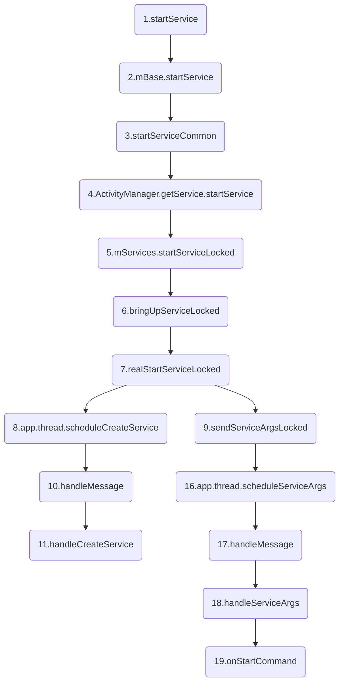
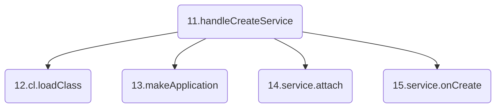
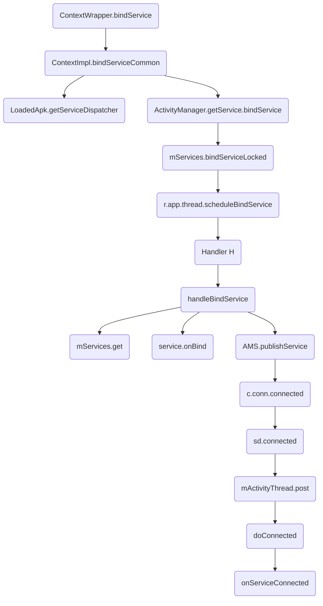

转载请注明链接: https://blog.csdn.net/feather_wch/article/details/50300853

详解Service的原理有帮助，请点个赞！

# Service原理详解

版本：2018/9/1-1(18:00)

---

[TOC]

## 基础(6)

1、Service是什么?
>1. 一种`服务型组件`，用于在后台执行一系列计算任务(处理网络事务、播放音乐、文件读写、或者与ContentProvider交互)。
>1. 没有界面的组件。
>1. Service具有两种状态：`启动状态`和`绑定状态`
>1. 本地Service运行在主线程(UI线程)中，因此不能进行耗时操作，需要创建子线程才可以。(BoradcastReceiver也是如此)

2、Service的两种状态
>1. 启动状态: 进行后台任务，`Service`本身运行在`主线程`，因此耗时操作需要在`新线程`中处理
>1. 绑定状态: 内部同样可以进行后台运算，但是此时`外界`可以很方便与`Service`通信

3、Service如何停止？
> 1. 如果是`启动状态`：stopService()或者Service的stopSelf()来停止。
> 1. 如果是`绑定状态`: unBindService()后，Service停止
> 1. 如果是`启动&绑定状态`：需要执行unBindeService()和stopService()或者Service的stopSelf()，才能真正停止。

4、Service的分类
>1. 本地服务：一般的Service
>2. 远程服务: 通过`android:process`属性，运行在独立进程中。

5、本地服务是什么？
>1. 该类服务依赖在主进程上而不是独立的进程，一定程度上节约资源。
>2. 本地服务因为在同一进程内，不需要IPC和AIDL进行交互。`bindService`也方便很多。
>3. 缺点：限制性大，`主进程`被杀死后，`服务便会终止`。
>4. 应用场景：需要依附某个进程的服务，比如音乐播放。

6、远程服务是什么？
>1. 该服务是`独立的进程`，进程名为`所在包名 + android:process指定的字符串`。
>2. 定义方式：用`android:process=".service"`
>3. 特点: 主进程被杀死后，该服务依然存在，不受其他进城影响，能为多个进程提供服务，具有灵活性。
>4. 会消耗更多资源，并且使用AIDL进行IPC比较麻烦，一般用于系统Service。
>5. 从Android 5.0开始，APP结束后会关闭相关进程树，因此相关的服务也会被杀死。

## 生命周期(4)

1、Service的生命周期

>1. 仅仅是`startService`：onCreate()->onStartCommand()->onDestory()
>2. 仅仅是`bindService`：onCreate()->onBind()->onUnbind（）->onDestory()
>3. 同时使用`startService`开启服务与`bindService`绑定服务：onCreate()->onStartCommand()->onBind()->onUnbind（）->onDestory()

2、Service生命周期的

|生命周期|解释|注意点|
|----|----|----|
|onCreate()|第一次启动时调用|适合只执行一次的操作|
|onStartCommand()|执行startService会调用|可能会多次调用，bindService不会调用|
|onBind()|执行bindSevice时调用|多次bindService不会导致调用多次|
|onUnbind()|执行unBindService()时调用|返回值会决定，再次bindService()会执行onBind()还是onRebind()|
|onDestory()|销毁|做一些清理工作|


3、onStartCommand()的返回值有什么用？
> 1. 返回`START_STICKY`时，如果Service因为内存不足，被系统杀掉后。如果有了多余内存，会尝试重新创建这个Service。
> 1. 并且会调用`onStartCommand()`，其中的Intent将会为null。为了那些循环的音乐播放器，天气预报之类的服务。
```java
// Service.java
public @StartResult int onStartCommand(Intent intent, @StartArgFlags int flags, int startId) {
    onStart(intent, startId);
    return mStartCompatibility ? START_STICKY_COMPATIBILITY : START_STICKY;
}
```

4、Service的unbindService生命周期

> 1. 客户端执行`unBindService()`后，回调`onUnBind()`方法，如果返回true，Service销毁。
> 1. onUnBind()如果返回false，判断是否调用了`stopSelf或者stopService`，调用则继续消息Service
> 1. 没有调用，则不会销毁。客户端再次调用`bindService()`, 会执行`onRebind()`
> 1. 销毁后，调用`bindService()`会执行`onBind()`进行绑定。

## 通信(4)

1、Activity与Service间的通信方式
>1. Activity调用Service的方法：Activity通过调用bindService，在ServiceConnection的onServiceConnected可以获取到Service的对象实例，然后就可以访问`Service`中的方法.
>1. Service去主动通知Activity的方法：可以通过`回调`来实现---在Activity的ServicConnection的onServiceConnected中去给Service设置实现的接口，该接口会在Service中被调用。
>2. 通过`广播`
>3. 通过`EventBus`

2、onBind()和onServiceConnected()实现通信
> 1-自定义Service，onBind()返回自定义的Binder
```java
class MyService extends Service {
    public IBinder onBind(Intent intent) {
        return new MyBinder();
    }
    class MyBinder extends Binder{
        MyService getService() {
            return MyService.this;
        }
    }
    public void method(){}
}
```
> 2-onServiceConnected()去接收Service
```java
class MyServiceConnection implements ServiceConnection {
    public void onServiceConnected(ComponentName name, IBinder service) {
        // 1、获取Sevice
        MyService myService = ((MyService.MyBinder)service).getService();
        // 2、调用其方法
        myService.method();
    }
    public void onServiceDisconnected(ComponentName name) {
    }
}
```

3、ServiceConnection的onServiceDisconnected什么时候会被调用？
> 1. 和Service连接意外中断。
> 1. 如因为内存不足，Service被意外释放掉。


4、用户解绑和终止Service会调用onServiceDisconnected吗？
> 不会


## 启动模式(21)

1、Service的启动方式有什么区别
>1. `startService`：Service与组件的生命周期无关，即使组件退出，Service依然存在。耗电，占内存。
>2. `bindService`：调用者退出后，Service也会退出。

2、startService
>1. Service无论调用多少次`startService`，`onCreate`只会调用一次，`onStartCommand`会调用相应次数。
>2. Service无论调用多少次`startService`，只存在`一个Service实例`
>3. 结束Service只需要调用一次`stopService或者stopSelf`
>4. Activity的退出并不会导致Service的退出---除非在onDestory里面调用stopService，但是`退出APP会导致Service的退出！`
>5. 系统资源不足的时候，服务可能会被`Kill`

3、bindService
>1. Service通过`bindService`启动，无论调用多少次，`onCreate`只会调用一次，且`onStartCommand`不会被调用。
>2. 如果调用`Service`的组件退出，如Activity，Service就会被停止。
>3. `bindService`开启的Service的通信比较方便，本地服务不需要AIDL和IPC，但是远程服务是需要AIDL和IPC的。

4、startService且同时bindService
>1. `onCreate`之调用一次。
>1. `startService`调用几次，`onStartCommand`会调用相同次数。
>1. `bindService`不会调用`onStartCommand`
>1. 调用`unBindService`不会停止`Service`，必须调用`stopService`和Service自身的`stopSelf`来停止。
>1. 如果想停止这种Service，`unBindeService`和`stopService`都需要调用，缺一不可。

5、同时开启和绑定有什么作用？
>1. 能让`Service`一直处于后台运行的状态，即使组件已经退出。
>2. 同时通过`bindService`能方便地与`Service`通信
>3. 相比于`广播`的方式，性能更高。

6、Service的注意点
>1. 手机发生旋转时，Activity的重新创建，会导致之前`bindService`建立的连接断开，`Service`会因为COntext的销毁而自动停止。

### startService流程

7、Service的启动方法
```java
Intent intent = new Intent(this, MyService.class);
startService(intent);
```
>1. Service有`启动状态`和`绑定状态`
>2. `两个状态可以共存`，Service可以既处于启动状态又处于绑定状态

8、Service的startService过程流程图和要点？

>1. startService(`ContextWrapper.java`):Activity层层继承自`ContextWrapper`;内部交由`ContextImpl`的`startService()`;典型的桥接模式
>2. mBase.startService(`ContextImpl.java`): 交给ContextImpl执行。
>3. startServiceCommon(`ContextImpl.java`): 通过`ActivityManagerService`启动服务;IPC
>4. startService(`ActivityManagerService.java`):通过`ActiveServices`进行后续工作---调用`mServices.startServiceLocked`。
>5. startServiceLocked(`ActiveServices.java`):  bringUpServiceLocked
>6. bringUpServiceLocked(`ActiveServices.java`)： realStartServiceLocked
>7. realStartServiceLocked(`ActiveServices.java`): 1、app.thread.scheduleCreateService 2、sendServiceArgsLocked
>8. app.thread.scheduleCreateService(`ActivityThread.java`):1. 创建Service 2. 发送消息`CREATE_SERVICE`给Handler H
>9. sendServiceArgsLocked(): 用Service的其他方法(如onStartCommand)-IPC通信
>10. handleMessage(`ActivityThread.java`): 处理消息
>11. handleCreateService(`ActivityThread.java`): 处理`第12、13、14、15 四步的工作`, 进行Service的创建工作
>16. 16.app.thread.scheduleServiceArgs: IPC让ActivityThread只去执行其他的生命周期回调。发送消息给Handler H
>17. 17.handleMessage: 调用`handleServiceArgs`
>18. 18.handleServiceArgs: 执行其他的生命周期，如`onStartCommand`
>19. 19.onStartCommand: Service的回调方法


>11. handleCreateService(`ActivityThread.java`): 处理`第12、13、14、15 四步的工作`
>12. cl.loadClass().newInstance(): 类加载器创建Service实例。
>13. packageInfo.makeApplication: 用`LoadedApk`创建`Application实例`
>14. service.attach： 创建ContextImpl建立Context和Service的联系。
>15. service.onCreate()： Service的onCreate(), 并且将Service对象存储到ActivityThread中的一个列表中

9、ActiveServices是什么？
>1. 辅助ActivityManagerService进行Service管理
>2. 包括：启动、绑定、停止等

10、ServiceRecord是什么？
>1. 描述一个Service记录，贯穿整个启动过程

11、ContextWrapper是什么？
>1. ContextWrapper是Context实现类ContextImpl的包装类
>2. Activity、Service等都是直接或者间接继承自`ContextWrapper`

12、ContextWrapper为什么是典型桥接模式？
> 见下面的`知识扩展部分`

13、桥接模式和代理模式的区别？
> 见下面的`知识扩展部分`

#### 源码解析

14、Service的启动过程源码详细分析
```java
   /**
     * ======================================
     * 1. Activty层层继承自ContextWrapper
     * 2. Activty的startService()方法来自于ContextWrapper
     * 3. ContextWrapper最终由mBase(ContextImpl)完成-典型桥接
     * ======================================
     */
    //ContextWrapper.java
    public ComponentName startService(Intent service) {
        //1. mBase就是Context的实现ContextImpl对象(也就是Activity创建时关联的对象)
        return mBase.startService(service);
    }

    //ContextImpl.java：直接调用startServiceCommon
    public ComponentName startService(Intent service) {
        warnIfCallingFromSystemProcess();
        return startServiceCommon(service, false, mUser);
    }

    //ContextImpl.java
    private ComponentName startServiceCommon(Intent service, boolean requireForeground, UserHandle user) {
        ......
        //1. 让`ActivityManagerService`启动一个Service服务
        ComponentName cn = ActivityManager.getService().startService(
                mMainThread.getApplicationThread(), service, ...省略...);
        ......
    }

    //ActivityManagerService.java
    public ComponentName startService(IApplicationThread caller, Intent service, ...) {
        /**====================================
         * 1. 通过mService(ActiveServices)完成后续过程
         * 2. ActiveServices是辅助AMS进行Service管理的类
         *     -包括：启动、绑定、停止
         * 3. `startServiceLocked`方法尾部会调用`startServiceInnerLocked`
         *=====================================*/
        res = mServices.startServiceLocked(caller, service, ...,userId);
    }

    //ActiveServices.java
    ComponentName startServiceInnerLocked(...,ServiceRecord r) {
        ......
        /**=========================================
         * ServiceRecord描述的是一个Service记录(贯穿整个启动过程)
         * 1. startServiceInnerLocked并没有完成具体启动工作，而是把后续任务交给了bringUpServiceLocked
         * 2. bringUpServiceLocked内部调用`realStartServiceLocked`
         * 3. realStartServiceLocked真正启动了Service
         *==========================================*/
        String error = bringUpServiceLocked(r, service.getFlags(), callerFg, false, false);
        ......
        return r.name;
    }

    //ActiveServices.java
    private final void realStartServiceLocked(ServiceRecord r, ProcessRecord app, boolean execInFg) {
        ......
        /**========================================================
         * 创建了Service对象，并且调用了onCreate()方法-IPC通信
         * 1. app.thread对象是IApplicationThread类型(Binder)
         * 2. 具体实现是ActivityThread(继承了ApplicationThreadNative)
         *========================================================*/
        app.thread.scheduleCreateService(r, r.serviceInfo, ......);
        ......
        //2. 用于调用Service的其他方法(如onStartCommand)-IPC通信
        sendServiceArgsLocked(r, execInFg, true);
        ......
    }

    //ActivityThread.java的内部类：ApplicationThread
    public final void scheduleCreateService(IBinder token, ...,int processState) {
        updateProcessState(processState, false);
        CreateServiceData s = new CreateServiceData();
        s.token = token;
        s.info = info;
        s.compatInfo = compatInfo;
        /**========================================
         *  1. 发送消息给Handler H处理
         *  2. H会接受消息，并且调用ActivityThread的handleCreateService
         *========================================*/
        sendMessage(H.CREATE_SERVICE, s);
    }

    /**====================================
     * 完成Service最终启动工作
     * //ActivityThread.java
     *=====================================*/
    private void handleCreateService(CreateServiceData data) {
        //1. 通过类加载器创建Service实例
        Service service = null;
        java.lang.ClassLoader cl = packageInfo.getClassLoader();
        service = (Service) cl.loadClass(data.info.name).newInstance();
        //2. 创建Application对象并调用其onCreate方法(Application是唯一的不会重复创建)
        Application app = packageInfo.makeApplication(false, mInstrumentation);
        //3. 创建ContextImpl对象并通过Service的attach方法建立两者关系(类似Activity的过程)
        ContextImpl context = ContextImpl.createAppContext(this, packageInfo);
        context.setOuterContext(service);
        service.attach(context, this, data.info.name, data.token, app, ActivityManager.getService());
        //4. 调用service的onCreate方法，并且将Service对象存储到ActivityThread中的一个列表中
        service.onCreate();
        mServices.put(data.token, service);
        ......
    }

    /**=============================================================
     * ActivityThread中还会通过handleServiceArgs方法调用Service的onStartCommand
     *=============================================================*/
    private void handleServiceArgs(ServiceArgsData data) {
        Service s = mServices.get(data.token);
        ......
        //1. Service的onStartCommand方法
        res = s.onStartCommand(data.args, data.flags, data.startId);
        ......
    }
```

### bindService流程

15、Service绑定流程图分析

>1. bindService(): 调用了ContextWrapper的该方法。
>2. bindServiceCommon(): ContextImpl的该方法，执行了`第3,4两步的工作`
>3. getServiceDispatcher(): 将客户端的ServiceConnection对象转换为`ServiceDispatcher内部类InnerConnection对象`，需要借助Binder才能让远程服务端调用自己的方法。
>4. ActivityManager.getService().bindService: 通过`AMS`执行bindService方法。
>5. mServices.bindServiceLocked(): 调用到`ActiveServices`的该方法。
>6. r.app.thread.scheduleBindService: 通过IPC去调用`ActivityThread内部类Application`的该方法。
>7. 本质都是通过Handler H的handleMessage()去进行处理
>8. handleBindService: 进行`第9、10、11 三步的任务`1.根据token取出Service 2.调用Service的onBind方法 3.通过IPC去告知客户端已经连接成功，并且执行onServiceConnected
>9. Service s = mServices.get(data.token): 利用token取出Service
>10. IBinder binder = s.onBind(data.intent): 知性Service的onBind方法
>11. ActivityManager.getService().publishService: Service在执行`onBind`后已经处于绑定状态，但是此时客户端并不知道，需要通过Binder去执行`ServiceConnection的onServiceConnected`方法。
>12. c.conn.connected: 调用`ServiceDispatcher.InnerConnection`的`connected()`【IPC】
>13. sd.connected： 调用LoadedApk.java的内部类ServiceDispatcher的方法
>14. mActivityThread.post: mActivityThread就是Handler H
>15. doConnected: 最终调用ServiceConnection的onServiceConnected方法

16、何时Service处于绑定状态(何时执行的onBind方法)？
>1. 执行到`ActivityThread`的`handlerBindService()`里，会获取到Service并且执行Service的onBind方法，此时就处于了绑定状态。

17、Service在ActivityThread中的存储？
>1. 服务端的ActivityThread通过ArrayMap存储了IBinder和Service的映射关系。
>2. key = IBinder, value = Service
>3. 在handleCreateService中创建好Service后，会将IBinder-Service的映射关系保存到Map中。
>4. AMS通过Binder去执行Service的任务比如执行Service的onBind方法，需要知道IBinder对应的是哪个Service，就利用到了ArrayMap存储的映射关系。

#### ServiceDispatcher

18、如何让远程服务端调用客户端的ServiceConnection中的方法？
>1. 无法直接让远程服务端使用
>2. 需要借助Binder才能让远程服务端毁掉自己的方法
>3. ServiceDispatcher的内部类InnerConnection就起到了Binder的作用
>4. ServiceDispatcher起到连接ServiceConnection和InnerConnection的作用

19、getServiceDispatcher的原理
>1. 使用ArrayMap来:存储应用当前活动的ServiceConnection和ServiceDispatcher的映射关系
>2. key = ServiceConnection, value = ServiceDispatcher
>3. 根据ServiceConnection去查询是否有对应的ServiceDispatcher，存在就直接返回ServiceDispatcher的InnerConnection。
>4. 不存在，就新建ServiceDispatcher，并将映射关系存放到Map中。

20、何时执行的ServiceConnection的onServiceConnected方法？
>1. AMS的publishService： 需要在Service进入绑定状态后，告知客户端已经完成连接。
>2. 【IPC】LoadedApk的ServiceDispatcher的connected方法
>3. 通过Handler H，最终在`ActivityThread`内部执行了onServiceConnected方法。

#### 源码解析

21、Service的绑定过程源码
```java
/**
 * ==============================================
 * 1. bindService最终也是调用的ContextWrapper的方法
 * 2. 与启动过程类似, mBase是ContextImpl最终会调用自身的bindServiceCommon方法
 * //ContextWrapper.java
 * =============================================
 */
public boolean bindService(Intent service, ServiceConnection conn, int flags) {
    return mBase.bindService(service, conn, flags);
}

//ContextImpl.java
private boolean bindServiceCommon(Intent service, ServiceConnection conn, int flags, Handler
        handler, UserHandle user) {
    /**======================================================================
     * 1. 将客户端的ServiceConnection对象转化为`ServiceDispatcher.InnerConnection`对象
     *  -ServiceConnection必须借助于Binder才能让远程服务端回调自己的方法
     *  -ServiceDispatcher的内部类InnerConnection就起到了Binder的作用
     *  -ServiceDispatcher起到连接ServiceConnection和InnerConnection的作用
     *======================================================================*/
    IServiceConnection sd;
    sd = mPackageInfo.getServiceDispatcher(conn, getOuterContext(), handler, flags);
    //2. 通过ActivityManagerService完成Service的绑定过程
    int res = ActivityManager.getService().bindService(... , service,...);
    ......
}

//LoadedApk.java
public final IServiceConnection getServiceDispatcher(ServiceConnection c, Context context, Handler handler, int flags) {
    /**================================
     * 1.mServices是ArrayMap:存储应用当前活动的ServiceConnection
     *    和ServiceDispatcher的映射关系
     *================================*/
    synchronized (mServices) {
        LoadedApk.ServiceDispatcher sd = null;
        //2. 获取`映射关系`的map
        ArrayMap<ServiceConnection, LoadedApk.ServiceDispatcher> map = mServices.get(context);
        if (map != null) {
            //3. 通过ServiceConnection去查询是否有ServiceDispatcher
            sd = map.get(c);
        }
        //4. 不存在ServiceDispatcher,新建ServiceDispatcher对象,
        if (sd == null) {
            sd = new ServiceDispatcher(c, context, handler, flags);
            if (map == null) {
                map = new ArrayMap<>();
                //6. 将该`映射关系`与Context放置到ArrayMap中
                mServices.put(context, map);
            }
            //5. key=ServiceConnection,value=ServiceDispatcher,建立映射关系
            map.put(c, sd);
        }
        //7. 返回ServiceDispatcher内部保存的InnerConnection
        return sd.getIServiceConnection();
    }
}

//ActivityManagerService.java
public int bindService(IApplicationThread caller, IBinder token, Intent service,...) {
    ......
    /**=========================
     * ActiveServices的方法：
     *  1. bindServiceLocked
     *  2. bringUpServiceLocked
     *  3. realStartServiceLocked
     *  4. 最后都是通过ActivityThread来完成Service实例的创建
     *      并且执行Services的onCreate方法
     *  * Service绑定与启动的不同在于会调用app.thread的scheduleBindService方法
     *      (在ActiveServices的requestServiceBindingLocked中调用)
     *============================*/
    return mServices.bindServiceLocked(caller, token, service,...);
}

//ActiveServices.java
private final boolean requestServiceBindingLocked(ServiceRecord r, IntentBindRecord i,...) {
    ......
    //ActivityThread内部类：`ApplicationThread`——中一系列`schedule`方法之一,最终通过Handler H进行中转，最终交给handleBindServices
    r.app.thread.scheduleBindService(r, i.intent.getIntent(), rebind, r.app.repProcState);
    ......
}

//ActivityThread
private void handleBindService(BindServiceData data) {
    //1. 根据token取出Service
    Service s = mServices.get(data.token);
    if (s != null) {
        if (!data.rebind) {
            /**================================
             * 2. 调用Service的onBind方法
             *  -此时Service就已经处于绑定状态，但此时客户端并不知道连接成功
             *  -因此必须调用客户端ServiceConnection中的onServiceConnected
             *=================================*/
            IBinder binder = s.onBind(data.intent);
            /**=======================================
             * 3. ActivityManagerService的publishService
             *  -1.会执行客户端ServiceConnection中的onServiceConnected
             *  -2.保证Service的onBind方法之调用一次(多次绑定同一个Service)
             *  -3.最终将具体任务交给ActiveServices的publishServiceLocked方法
             *========================================*/
            ActivityManager.getService().publishService(data.token, data.intent, binder);
        }
    }
    ......
}

//ActiveServices.java
void publishServiceLocked(ServiceRecord r, Intent intent, IBinder service) {
    ......
    /**===================================
     * 1. c是ConnectionRecord
     * 2. c.conn是ServiceDispatcher.InnerConnection
     * 3. service就是Service的onBind方法返回的Binder对象
     *==================================*/
    c.conn.connected(r.name, service, false);
    ......
}

//LoadedApk.java的内部类ServiceDispatcher的内部类InnerConnection
private static class InnerConnection extends IServiceConnection.Stub {
    ......

    public void connected(ComponentName name, IBinder service, boolean dead) {
        LoadedApk.ServiceDispatcher sd = mDispatcher.get();
        if (sd != null) {
            //1. 调用ServiceDispatcher的方法
            sd.connected(name, service, dead);
        }
    }
}

//LoadedApk.java的内部类: ServiceDispatcher
public void connected(ComponentName name, IBinder service, boolean dead) {
    /**=========================================================
     *1. mActivityThread是一个Handler，其实就是ActivityThread中的H
     *2. 最终RunConnection通过H的post方法从而运行在主线程中
     *3. 因此客户端ServiceConnection就是在主线程被回调
     *========================================================*/
    mActivityThread.post(new RunConnection(name, service, 0, dead));
}

//LoadedApk.java内部类ServiceDispatcher的内部类: RunConnection
private final class RunConnection implements Runnable {
    ......
    /**
     * =========================================================
     * 1. 本质调用ServiceDispatcher的doConnected
     * 2. ServiceDispatcher内部拥有客户端的ServiceConnection
     * ========================================================
     */
    public void run() {
        if (mCommand == 0) {
            doConnected(mName, mService, mDead);
        } else if (mCommand == 1) {
            doDeath(mName, mService);
        }
    }
}

//LoadedApk.java内部类: ServiceDispatcher
public void doConnected(ComponentName name, IBinder service, boolean dead) {
    ....
    if (service != null) {
        //1. 可以通过客户端的ServiceConnection调用onServiceConnected
        mConnection.onServiceConnected(name, service);
    }
}
```

## 知识扩展-Context中的桥接模式(7)

1、Context是典型的桥接模式

> 1. ContextImpl和ContextWrapper都是继承自`Context`，分别代表一个维度。
> 1. 第一个维度：ContextImpl是implementor，是具体实现的抽象接口。具体实现的是ActivityContext，ServiceContext。因为startActivity、sendBroadcast、startService这些方法有着各自不同的效果。
> 1. 第二维度：ContextWrapper就是Abstraction：持有一个`ContextImpl`的引用。其子类是Activity、Service，这个维度，是用于继承并且扩展和各自业务相关的方法。

2、为什么是桥接模式而不是代理模式？
> 1. 代理模式：一个类代表另一个类的功能。定义是为其他对象提供一种代理以控制对这个对象的访问。
> 1. 代理的优点：职责清晰，扩展性高。
> 1. 桥接模式：将抽象部分与实现部分分离，使它们都可以独立的变化。
> 1. Context中，ContextImpl可以独立变换，ContextWrapper(具体类Activity、Service)也都可以独立变换。

3、ContextImpl的具体实现
> 1. 通过ContextImpl的构造方法，构造不同的Context
> 1. 例如Application、Activity的Context
```java
// app Context
static ContextImpl createAppContext(ActivityThread mainThread, LoadedApk packageInfo) {
    ContextImpl context = new ContextImpl(null, mainThread, packageInfo, null, null, null, 0,
            null);
    return context;
}
// activity Context
static ContextImpl createActivityContext(ActivityThread mainThread,xxx) {
    ContextImpl context = new ContextImpl(null, mainThread, packageInfo, activityInfo.splitName,
            activityToken, null, 0, classLoader);
    return context;
}
// application Context
public Context createApplicationContext(ApplicationInfo application, int flags){
    // 常见ApplicationContext
    ContextImpl c = new ContextImpl(this, mMainThread, pi, null, mActivityToken,
                new UserHandle(UserHandle.getUserId(application.uid)), flags, null);
}
// package Context
public Context createPackageContext(String packageName, int flags){
    return createPackageContextAsUser(packageName, flags,
            mUser != null ? mUser : Process.myUserHandle());
}
public Context createPackageContextAsUser(String packageName, int flags, UserHandle user){
    ContextImpl c = new ContextImpl(this, mMainThread, pi, null, mActivityToken, user,
                flags, null);
}
// System Context
static ContextImpl createSystemContext(ActivityThread mainThread) {
    ContextImpl context = new ContextImpl(null, mainThread, packageInfo, null, null, null, 0,
            null);
    return context;
}
```

4、ActivityThread中如何创建Context的？
> 1-在startActivity的流程中，会在performLaunchActivity, 中创建Context。

```java
// ActivityThread.java
private Activity performLaunchActivity(ActivityClientRecord r, Intent customIntent) {
    // xxx
    ContextImpl appContext = createBaseContextForActivity(r);
}
private ContextImpl createBaseContextForActivity(ActivityClientRecord r) {

    ContextImpl appContext = ContextImpl.createActivityContext(
            this, r.packageInfo, r.activityInfo, r.token, displayId, r.overrideConfig);
    // xxx
    return appContext;
}
```
> 2-Application调用attach()中会创建Application的Context

```java
// ActivityThread.java
private void attach(boolean system) {
    ContextImpl context = ContextImpl.createAppContext(this, getSystemContext().mPackageInfo);
    // xxx
}
```
> 3- 其余还有一些Context会创建

```java
// ActivityThread.java
// 1、创建SystemContext
public ContextImpl getSystemContext() {
    synchronized (this) {
        if (mSystemContext == null) {
            mSystemContext = ContextImpl.createSystemContext(this);
        }
        return mSystemContext;
    }
}
// 2、创建SystemUiContext
public ContextImpl getSystemUiContext() {
    synchronized (this) {
        if (mSystemUiContext == null) {
            mSystemUiContext = ContextImpl.createSystemUiContext(getSystemContext());
        }
        return mSystemUiContext;
    }
}
```

5、ContextWrapper这个维度的作用？
> 1. Context分两个维度，第一个维度有多种ContextImpl实现，会去实现Actvity、Service、Application情况下的Context。
> 1. 第二维度：ContextWrapper，适用于让Activity、Service继承，去扩展各自其他方面的功能。

### 装饰者模式

6、ContextWrapper是装饰者模式？
> 1. 并不是，只是通过继承的方式扩充了一个方法。
> 1. 用于Activity、Service去和Context建立联系。
```java
public class ContextWrapper extends Context {
    Context mBase;

    public ContextWrapper(Context base) {
        mBase = base;
    }

    protected void attachBaseContext(Context base) {
        if (mBase != null) {
            throw new IllegalStateException("Base context already set");
        }
        mBase = base;
    }
}
```

### 组合模式

7、ContextImpl的不同种类的构造是组合模式吗?
> 1. 不是！
> 1. 只是通过“组合”这种技巧来实现比继承更好的实现方法。
> 1. 通过构造方法，组合不同的东西进去，就创建出ActivityContext、ApplicationContext

## 序列图: 启动流程(2)
1、Service的startService()
`AT: ActivityThread`
```sequence
AT[Service进程]->AT[Service进程]:null
Activity[客户端]->Activity[客户端]: 1.启动
Activity[客户端]->Activity[客户端]: 2.startService()\n-ContextWrapper
Activity[客户端]->Activity[客户端]: 3.mBase.startService()\n-ContextImpl
Activity[客户端]->ActivityManagerService: 【IPC】\n4.ActivityManager.getService()
ActivityManagerService->ActivityManagerService: 5.startService()
ActivityManagerService->ActiveServices: 6.mService.\nstartServiceLocked()
ActiveServices->ActiveServices: 7.bringUpServiceLocked()
ActiveServices->ActiveServices: 8.realStartServiceLocked()
ActiveServices->AT[Service进程]: 【IPC】9.app.thread.scheduleCreateService()-ApplicationThread的方法
AT[Service进程]->AT[Service进程]: 10.sendMessage\n(H.CREATE_SERVICE)
AT[Service进程]->AT[Service进程]: 11.handleCreateService()
AT[Service进程]->AT[Service进程]: 12.类加载器创建Service对象
AT[Service进程]->AT[Service进程]: 13.makeApplication
AT[Service进程]->AT[Service进程]: 14.service.attach(context...)
AT[Service进程]->AT[Service进程]: 15.service.onCreate();\nmServices.put()
ActiveServices->AT[Service进程]: 【IPC】16.sendServiceArgsLocked()
AT[Service进程]->AT[Service进程]: 17.handleServiceArgs()
AT[Service进程]->AT[Service进程]: 18.s.onStartCommand
```
>11.Handler H接受并且处理消息，最终调用handleCreateService()
>13.makeApplication(创建Application对象并调用onCreate()-若已经存在则不创建)
>14.创建ContextImpl并调用attach方法-建立ContextImpl和Service的联系
>15.service.onCreate()，并将Service添加到ActivityThread内部的Service列表中
>16.sendServiceArgsLocked()-内部最终调用Service的其他方法(onStartCommand等)

2、Service的bindService()
```sequence
ActivityThread[客户端]->Activity: 1.启动Activity
Activity->ContextImpl: 2.bindService()
ContextImpl->ContextImpl: 3.bindServiceCommon()
ContextImpl->ContextImpl: 4.mPackageInfo.\ngetServiceDispatcher
ContextImpl->AMS: 【IPC】5.ActivityManager.\ngetService()
AMS->AMS: 6.bindService()
AMS->ActiveServices: 7.mService.\nbindServiceLocked()
ActiveServices->ActiveServices: 8.requestServiceBindingLocked()
ActiveServices->ActiveServices: 9.realStartServiceLocked()
ActiveServices->ActivityThread[Service端]: 【IPC】10.app.thread.scheduleBindService()
ActivityThread[Service端]->ActivityThread[Service端]: 11.handleBindService()
ActivityThread[Service端]->ActivityThread[Service端]: 12.s.onBind(data.intent)
ActivityThread[Service端]->AMS: 【IPC】13.ActivityManager.\ngetService()
AMS->ActiveServices: 14.publishService()
ActiveServices->ActiveServices: 15.publishServiceLocked()
ActiveServices->ActivityThread[客户端]: 【IPC】16.c.conn.connected()
ActivityThread[客户端]->ActivityThread[客户端]: 17.mActivityThread.\npost()
ActivityThread[客户端]->ActivityThread[客户端]: 18.doConnected()
ActivityThread[客户端]->ActivityThread[客户端]: 19.mConnection.\nonServiceConnected
```
>2 最终是会调用ContextImpl的bindServiceCommon方法
>4.ServiceConnection需要借助binder才能让远程服务回调自己的方法(借助于ServiceDispatcher.InnerConnection)
>10.scheduleBindService会发送消息，最终由handleBindService处理
>12.调用Service的onBind方法-绑定成功
>13.绑定成功后需要通知客户端：最终调用客户端ServiceConnection中的onServiceConnected
>16.c.conn是ServiceDispatcher.InnerConnection(ServiceConnection的Binder中转对象)，最终调用ServiceDispatcher的connected
>17.mActivityThread就是ActivityThread的Hanlder H
>18.通过post最终运行在主线程
>19.调用客户端的onServiceConnected方法


## 面试题(8)

1、对一个Service多次调用startService会怎样?
> 1. onCreate()只会调用一次
> 1. onStartCommand()会调用多次(次数一致)
> 1. 只会有一个Service实例
> 1. 结束只需要调用一次`stopService或者stopSelf`

2、对一个Service多次调用bindService会怎样?
> 1. onCreate()只会调用一次.
> 1. onStartCommand不会被调用

3、Service中可以直接进行耗时操作?
> 1. 本地服务不可以！依附于当前主线程，会导致ANR。
> 1. 远程服务可以。因为处于不同进程。

4、使用startService()开启服务的流程?
> 1. 定义一个类继承自Service
> 1. AndroidManifest中配置该Service
> 1. 调用Context.startService(intent)启动该Service
> 1. 不使用时，调用stopService()或者Service自身的stopSelf()来停止

5、多个Activity可以绑定同一个Service
> 1. 如果所有的Activity都进行解绑，该Service会自动终止
> 1. 不需要去掉用stopService来停止。

6、onStartCommand的返回值有什么用?
> 返回的`START_STICKY`会在Service因为内存不足被杀死后，一旦有内存就会去重新创建。

7、使用bindService()去绑定Service的操作步骤。
> 1. 服务端，继承自Service，在onBind()中返回实现IBinder接口的实例对象，并提供公共方法。
> 1. 客户端，bindService()去绑定Service，并在ServiceConnection的onServiceConnected()的方法中接收该IBinder对象。

8、onStartCommand()什么时候不会被调用？
> 如果服务端Service没有返回`Binder`对象，就不会触发该方法。

9、如何实现一个应用没有界面和图标只有后台Service的需求？
> 1. 启动一个没有启动页面和图标的Activity然后去开启Service
> 2. AndroidManifest中有属性能设置。

10、如何在Service中启动一个Activity
> 1-需要添加Flag:`FLAG_ACTIVITY_NEW_TASK`---荣耀Play没有崩溃、红米Note3崩溃
```
android.util.AndroidRuntimeException: Calling startActivity() from outside of an Activity  context requires the FLAG_ACTIVITY_NEW_TASK flag. Is this really what you want?
```
> 2-给Activity设置:`android:excludeFromRecents=“true”`---在特定机型会出现最近任务列表有两个app的情况。也可以用于从最近任务列表中隐藏。

11、为什么在Service中启动Activity(不设置Flag)会崩溃？
> 1. 执行顺序：service.startActivity()->ContextWrapper.startActivity()->ContextImpl.startActivity()
> 2. 在ContextImpl.startActivity()中会对`FLAG_ACTIVITY_NEW_TASK`进行检查。
> 3. Activity不会出现该原因，是因为对startActivity进行了重写。

## 参考资料
1. [桥接模式](https://www.jianshu.com/p/af6b1b27f638)
1. [Service 启动和绑定解析](https://www.jianshu.com/p/5d73389f3ab2)
1. [Service](https://www.jianshu.com/p/e04c4239b07e)
1. [桥接模式和代理模式的区别](https://blog.csdn.net/see__you__again/article/details/51996797)
1. [代理模式与桥接模式 备忘](https://blog.csdn.net/agezhc/article/details/38735985)
1. [无界面Activity或者APP的实现](https://blog.csdn.net/cqx13763055264/article/details/80037162)
1. [Android 在Service中启动Activity的崩溃问题详解](https://blog.csdn.net/fang323619/article/details/74388804)
