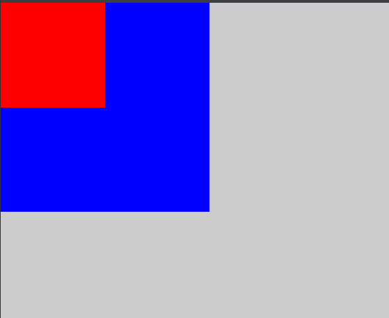
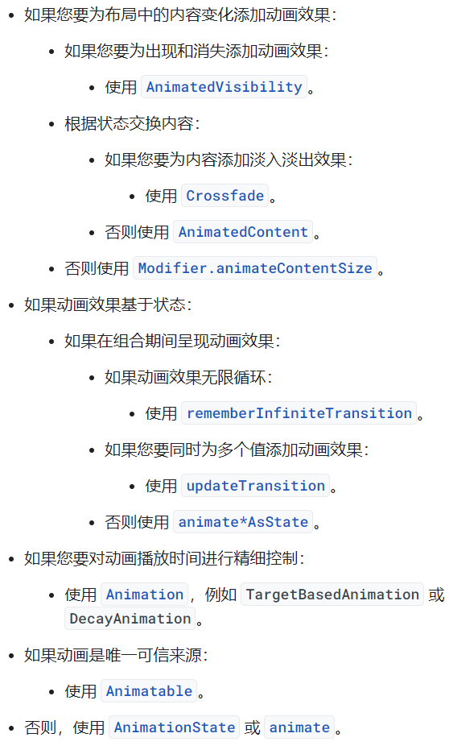

# Compose基础入门

本文链接：https://blog.csdn.net/feather_wch/article/details/132139415

14/29

## Compose项目配置开关

[TOC]

app的build.gradle

```java
android {

    buildFeatures {
        compose true // compose
    }
    composeOptions {
        kotlinCompilerExtensionVersion '1.3.2' //编译时注解
    }
}

dependencies {

// Compose相关
    implementation 'androidx.activity:activity-compose:1.5.1'
    implementation platform('androidx.compose:compose-bom:2022.10.00')
    implementation 'androidx.compose.ui:ui'
    implementation 'androidx.compose.ui:ui-graphics'
    implementation 'androidx.compose.ui:ui-tooling-preview'
    implementation 'androidx.compose.material3:material3'
    implementation 'androidx.compose.material3:material3'

    androidTestImplementation platform('androidx.compose:compose-bom:2022.10.00')
    androidTestImplementation 'androidx.compose.ui:ui-test-junit4'
    debugImplementation 'androidx.compose.ui:ui-tooling'
    debugImplementation 'androidx.compose.ui:ui-test-manifest'
}

```

ComponentActivity中通过setContent方法达到以前setContentView的效果

```java
class MainActivity : ComponentActivity() {
    override fun onCreate(savedInstanceState: Bundle?) {
        super.onCreate(savedInstanceState)

        setContent {
            // xxx
        }
    }
}
// 
androidx.activity:activity-compose:1.5.1@aar
--ComponentActivity.kt
    ->ComponentActivity.setContent
```

## Compose是什么？

1、为什么要用Compose？

1.  声明式的UI框架
2.  组合替换继承

2、为什么使用组合？

1.  组合获得布局能力
2.  粒度更细，更灵活
3.  可以解决Java中单个父类的限制

3、Compose和View、ViewGroup的区别：

1.  Compose不存在多层绘制问题

4、Compose是如何实现的？

1.  会形成ComposeUiNode和LayoutNode等各种节点
2.  text等微件对应于LayoutNode和Node组成树形结构

5、还需要Fragment吗？

> 不需要了，单个Activity可以搞定一切

6、微件相对无状态，不再提供getter和setter方法

### State状态管理

1、remember和mutableStateOf
1.  数据驱动ui
2.  数据就需要有状态 => MutableStateOf

2、为什么需要remember+mutableStateOf("") 才会改变输入框的数据？
1. 一起管理状态
1. `mutableStateOf` 是 Compose 中的一个函数，用于创建可变的状态。它接受一个初始值，并返回一个包装了该值的 `MutableState` 对象。`MutableState` 对象可以在 Composable 函数中读取和更改，而且当其值发生变化时，Compose 会自动进行重新绘制。
1. `remember` 是 Compose 中的一个函数，用于在 Composable 函数中记住一个值。它类似于常规 Android 中的 `savedInstanceState`，但它是为 Compose 中的状态管理而设计的。

3、写一个复选框

```java
    @Composable
    fun MyCheckBox(){
        var checked by remember{
            mutableStateOf(false)
        }
        Checkbox(checked = checked, onCheckedChange = {
            checked = it
        })
    }
```

3、remember内部是cache，get/put，相当于hashmap


### 实时预览 动画执行

Preview预览：

```java
@Preview(showBackground = true, showSystemUi = true)
```

### Compose和View/ViewGroup的关联😁

setContentView的原理是什么？

1.  从DecorView中获取到ContentView，并设置进去
2.  DecorView由ContentView和TitleView组成

Compose中的contentview

1.  contentview就是ComposeView，内部会加载我们实现的部分AndoridComposeView(多套了一层壳)
2.  根节点是layoutnode，其他微件都是该树的节点
3.  compose是国中国，有自己的绘制流程

**LazyColumn和RecyclerView区别**

1.  RV从缓存拿数据可以不create view，直接bind view

2.  LazyColumn：状态管理，每次都会新建，走一遍流程。会根据当前状态去描绘UI

3.  不再需要适配器：LazyColumn

改属性，改xx

compose搭建app就一个activity结构最好。androudcomposeview就一个。

Box 帧布局 FrameLayout

## 内置函数

### remmember

```kotlin

```

## 属性

所有属性都会转为xxxModify

### Modify

```java
// SizeModifier = Modifier.size(10.dp, 10.dp)
// 每个Text、Image都会转为 一个LayoutNode
// 链式加入到
SizeModifier = Modifier.size(10.dp, 10.dp)
SizeModifier ：不是单纯的属性，会定义测量方法
MeasureScope.measure 有一个测量方法，原来部分功能转到了属性上
BackgroundModifier::ContentDrawScope.draw() // UI绘制操作

Modifier.size(100.dp, 100.dp)
		.background(Blue)
		.size(10.dp, 10.dp)
		.background(Color.Magenta)
// size第一个才会生效
// color按顺序生效
// padding按顺序生效

Modifier.clip 在原有Shape上剪切
```

GraphicLayerModifier

圆形

```java
Modifier.size(100.dp, 100.dp)
	.clip(CircleShape)
	.background(Color.Magenta)
// 需要先圆形，再赋值背景色，才能看出圆形背景
```

Border怎么生效？默认矩形，clip之后怎么办？

```java
border(2.dp, RED, CircleShape)要加上Shape
Outline.Rectangle
Outline.Rounded
Outline.Generic(path)
```

## Scaffold 脚手架

topBar

bottomBar

floatingActionButton

drawerContent

content：Scaffold是一个Material，包裹在content之上的

# Compose控件大全

在Android Jetpack Compose中，有许多不同的控件可以用于构建用户界面。下面列举了一些常用的Compose控件：

1.  Text：用于显示文本内容。
2.  Button：用于创建按钮。
3.  TextField：用于接收用户的文本输入。
4.  Image：用于显示图像。
5.  Checkbox：用于创建复选框。
6.  RadioGroup：用于创建单选按钮组。
7.  Switch：用于创建开关。
8.  Slider：用于创建滑块。
9.  ProgressBar：用于显示进度条。
10. FloatingActionButton：用于创建浮动操作按钮。
11. Card：用于创建卡片式布局。
12. Row：用于水平排列子组件。
13. Column：用于垂直排列子组件。
14. Box：用于自定义布局和定位子组件。
15. Spacer：用于创建空白间隔。
16. Divider：用于创建分割线。
17. Scaffold：用于创建基本的应用程序布局。
18. TopAppBar：用于创建应用栏。
19. BottomAppBar：用于创建底部应用栏。
20. Drawer：用于创建侧边栏。

**不常见的控件**

当谈到不常用的控件时，以下是一些在Android Jetpack Compose中可能不太常见的控件，但它们在特定的应用场景中可能会派上用场：

1.  FloatingActionButtonExtended：一个扩展版浮动操作按钮，可以显示扩展的标签和图标。
2.  DropdownMenu：用于创建下拉菜单，可选择从中选择项目。
3.  AutocompleteTextField：用于显示自动完成建议的文本字段。
4.  TimePicker：用于选择时间的时间选择器。
5.  DatePicker：用于选择日期的日期选择器。
6.  TabRow：用于创建选项卡式布局的组件。
7.  SliderValueRange：一个范围滑块，用于选择两个值之间的范围。
8.  CircularProgressIndicator：用于显示环形进度条。
9.  LinearProgressIndicator：用于显示线性进度条。
10. Snackbar：用于在应用程序底部显示短时间消息的组件。
11. Tooltip：用于提供关于视图的简短描述的工具提示。

请注意，这些控件可能在不同版本的Compose中进行了更新或更改，具体的功能和用法可能会有所不同。我建议查阅Compose的官方文档以获取最新的信息和示例代码。

## MaterialTheme

### shapes
```kotlin
    MaterialTheme.shapes.small
    MaterialTheme.shapes.medium
    MaterialTheme.shapes.large
```

### typography

typography：排版、字体排印
caption: 标题、说明或字幕
overline: 排版术语，指的是在文字的顶部画出一条横线
```kotlin
// 标题
        Text(text = "h1"
            , modifier = Modifier.padding(bottom = 10.dp)
            , style = MaterialTheme.typography.h1)
// 副标题
        Text(text = "MaterialTheme.typography.subtitle1"
            , modifier = Modifier.padding(bottom = 10.dp)
            , style = MaterialTheme.typography.subtitle1)
// 文本
        Text(text = "MaterialTheme.typography.body1"
            , modifier = Modifier.padding(bottom = 10.dp)
            , style = MaterialTheme.typography.body1)
// bUtton
MaterialTheme.typography.button
//
MaterialTheme.typography.caption
// 
MaterialTheme.typography.overline
```

## OutlinedTextField：外边框文本输入框
1.  OutlinedTextField用于显示一个带有外边框的文本输入框。
```kotlin
@OptIn(ExperimentalMaterial3Api::class)
@Composable
@Preview
fun EditTextView(){
    val textState = remember { mutableStateOf("") }
    Column(modifier = Modifier.padding(16.dp)) {
        Text(text = "test"
            , modifier = Modifier.padding(bottom = 10.dp)
            , style = MaterialTheme.typography.headlineLarge)
        OutlinedTextField(value = textState.value,
            onValueChange = {textState.value=it}, label = {
            Text(text = "Enter Your Name")
        })
    }
}
```

## Text

使用了 Text 组件的所有属性的例子：
```kotlin
Text(
    text = "Jetpack Compose",//用于指定要显示的文本内容。
    style = TextStyle( //用于指定文本的样式，可以是默认样式或自定义样式。
        color = Color.Red, //用于指定文本的颜色。
        fontSize = 18.sp, //用于指定文本的字体大小。
        fontWeight = FontWeight.Bold, //用于指定文本的字重（粗细）。
        fontFamily = FontFamily.Monospace, //用于指定文本的字体系列。
        letterSpacing = 0.5.sp, //用于指定文本的字符间距
        lineHeight = 24.sp, //用于指定文本的行高。
        textDecoration = TextDecoration.LineThrough //用于指定文本的装饰效果，例如下划线、删除线等。
    ),
    textAlign = TextAlign.Center, //用于指定文本的对齐方式，例如居中、居左、居右等。
    softWrap = true, //用于指定文本是否自动换行。
    maxLines = 2, //用于指定文本的最大行数。
    overflow = TextOverflow.Ellipsis, //用于指定文本超出屏幕时的处理方式，例如裁剪、省略号等。
    modifier = Modifier.padding(16.dp) //用于应用其他修饰符或自定义样式。
)
```

## Surface

Surface是一个用于绘制矩形的组件，可以用来创建卡片、容器等。

Surface可以用来为其他组件提供背景和边框，可以应用阴影效果，并可以通过modifier来调整其外观。

1、要使用Surface，首先在build.gradle文件中添加Compose的依赖：
```kotlin
implementation 'androidx.compose.material:material:1.0.2'
```
2、然后，在Compose的代码中使用Surface组件：

```kotlin
@Composable
fun MyScreen() {
    Surface(
        modifier = Modifier.padding(16.dp),
        elevation = 4.dp
    ) {
        // 在这里添加你的组件
    }
}
```

创建了一个名为`MyScreen`的Compose函数，并在其中使用了Surface组件。我们通过`modifier`属性为Surface添加了16dp的内边距，通过`elevation`属性设置了Surface的阴影效果。

你可以在Surface组件内部添加其他组件，例如文本、图片等。它们将以Surface作为容器显示。

除了padding和elevation外，Surface还可以使用其他modifier来调整其外观，例如背景颜色、形状等。你可以根据自己的需求进行进一步的自定义。

## Box

1. 类似Framelayout, 用于对其子组件进行布局和定位。
2. 导入Compose库中的依赖：
```kotlin
implementation 'androidx.compose.foundation:foundation:1.0.2'
```
3. 使用Box组件：
```kotlin
@Composable
fun MyScreen() {
    Box(
        modifier = Modifier
            .fillMaxSize()
            .background(Color.LightGray)
    ) {
        Box(
            modifier = Modifier
                .size(200.dp)
                .background(Color.Blue)
        )

        Box(
            modifier = Modifier
                .size(100.dp)
                .background(Color.Red)
        )
    }
}
```
  

## Row

1. 水平排列子组件的容器组件
2. 要使用Row，需要首先导入Compose库中的依赖：
```kotlin
implementation 'androidx.compose.foundation:foundation:1.0.2'
```
3. Compose的代码中使用Row组件：
```kotlin
@Composable
fun MyScreen() {
    Row(
        modifier = Modifier
            .fillMaxWidth()
            .padding(16.dp)
    ) {
        Box(
            modifier = Modifier
                .width(50.dp)
                .height(50.dp)
                .background(Color.Blue)
        )

        Box(
            modifier = Modifier
                .width(100.dp)
                .height(50.dp)
                .background(Color.Red)
        )
    }
}
```

## Spacer

## lazyColumn

### LazyColumn + AutoService
不仅仅项目可以模块化，列表也可以模块化 ===> OOP ===> ARouter
只需要增加View加上AutoService：AutoService编译时就指定全类名，性能也好  ===> ARouter
META-INF生成IComposableService服务：
```
里面写明了所有实现了该接口的类名
```
注意点：反射创建，不能有实例
AutoService：
1. 减少了findClass的时间
2. 直接反射创建。


## ClickableText

1. 用于在文本中创建可点击的部分，并对点击事件进行处理。
1. 使用ClickableText，你可以在文本中标识出特定的部分，用户点击这些部分时可以执行自定义的操作。
1. 使用ClickableText的代码片段：
```kotlin
@Composable
@Preview
fun ClickableTextDemo() {
    val text = buildAnnotatedString {
        withStyle(style =   (color = MaterialTheme.colors.primary)) {
            append("Click ")
            pushStringAnnotation(tag = "URL", annotation = "https://www.example.com")
            withStyle(style = SpanStyle(textDecoration = TextDecoration.Underline)) {
                append("here")
            }// SpanStyle跨度样式
            append(" to visit our website.")
        }
    }

    ClickableText(
        text = text,
        onClick = { offset ->
            // 1、从指定范围获取到字符串注释，注释的标签“URL”，start\end是点击位置的偏移量
            text.getStringAnnotations(tag = "URL", start = offset, end = offset)
                // 2、获得符合条件的第一个参数
                .firstOrNull()?.let { annotation ->
                    // 3、执行相应的操作，比如打开一个链接 这里只是打印 URL
                    println("Clicked URL: ${annotation.item}")
                }
        }
    )
}

```

### buildAnnotatedString
```kotlin
    val text = buildAnnotatedString {
        withStyle(style = SpanStyle(color = MaterialTheme.colors.primary)) {
            append("Click ") // click
            pushStringAnnotation(tag = "URL", annotation = "https://www.example.com") // 看不见的URL
            withStyle(style = SpanStyle(textDecoration = TextDecoration.Underline)) {
                append("here") // here可以点击
            }
            append(" to visit our website.") // 后面文本
        }
    }
```
  


## BasicTextField

1. 文本输入框组件，用于接收用户输入的文本。它是一个简单的文本输入框，提供了基本的文本输入功能。
```kotlin
@Composable
fun MyTextField() {
    val textState = remember { mutableStateOf("") }

    BasicTextField(
        value = textState.value,
        onValueChange = { newValue ->
            textState.value = newValue
        },
        textStyle = TextStyle(color = Color.Black),
        modifier = Modifier
            .fillMaxWidth()
            .padding(16.dp)
    )
}
```

2、例子二
```kotlin
@Composable
@Preview
fun BasicTextFieldDemo() {
    var text by remember {
        mutableStateOf("普通文本")
    }
    BasicTextField(
        value = text, onValueChange = {
            text = it
        }, textStyle = TextStyle(MaterialTheme.colors.error),
        // 定义键盘的类型
        keyboardOptions = KeyboardOptions(keyboardType = KeyboardType.Password)
    )
}
```

### KeyboardOptions

1、用于配置文本字段的键盘选项。
```kotlin
@Composable
fun MyTextField() {
    BasicTextField(
        value = "Hello",
        onValueChange = { /* 在这里更新文本字段的值 */ },
        keyboardOptions = KeyboardOptions(
            imeAction = ImeAction.Done, // 定义输入法软键盘上的动作按钮的行为
            keyboardType = KeyboardType.Text, //定义键盘的类型，例如文本、数字、电话号码、电子邮件等。
            autoCorrect = true // 自动纠正
        ),
        textStyle = MaterialTheme.typography.body1
    )
}
```
> 在上面的示例中设置了动作按钮为`ImeAction.Done`，键盘类型为文本，启用了自动纠正功能。

### keyboardActions

1、可以定义当用户按下键盘上的特定按钮时所触发的回调函数。
2、常用的键盘动作包括“完成”、“搜索”、“发送”等。当用户按下这些按钮时，你可以执行自定义的操作，例如提交表单、搜索内容、发送消息等。

以下是一个示例代码，展示了如何配置`keyboardActions`：

```kotlin
import androidx.compose.foundation.text.BasicTextField
import androidx.compose.material.MaterialTheme
import androidx.compose.runtime.Composable
import androidx.compose.ui.text.input.ImeAction
import androidx.compose.ui.text.input.KeyboardActions
import androidx.compose.ui.text.input.KeyboardType

@Composable
fun MyTextField() {
    BasicTextField(
        value = "Hello",
        onValueChange = { /* 在这里更新文本字段的值 */ },
        keyboardOptions = KeyboardOptions(
            imeAction = ImeAction.Done,
            keyboardType = KeyboardType.Text
        ),
        keyboardActions = KeyboardActions(
            onDone = { /* 在这里处理“完成”按钮的操作 */ },
            onSearch = { /* 在这里处理“搜索”按钮的操作 */ },
            onSend = { /* 在这里处理“发送”按钮的操作 */ }
        ),
        textStyle = MaterialTheme.typography.body1
    )
}
```

在上面的示例中，`keyboardActions`被传递给`BasicTextField`的`keyboardActions`参数，以配置键盘动作。这里设置了三个动作回调函数：`onDone`、`onSearch`和`onSend`。你可以在每个回调函数中编写相应的操作逻辑。

根据实际需求，你可以根据用户交互和业务逻辑来定义不同的键盘动作，并在相应的回调函数中执行相关操作。

## 其他

### stringResources

stringResource是一个用于获取字符串资源的函数。它允许你通过资源ID来访问字符串资源，并在Compose中使用这些字符串。

要使用stringResource函数，首先确保在你的Compose工程中正确设置了资源文件。然后，可以在Compose代码中使用stringResource函数来获取字符串资源。

需要注意的是，在使用stringResource函数之前，确保你的Compose代码位于与字符串资源相关联的Context中，例如Activity或Fragment中。这样Compose才能正确获取到字符串资源。

示例代码如下：

```kotlin
@Composable
fun MyScreen() {
    val appName = stringResource(id = R.string.app_name)
    
    Text(text = "Welcome to $appName")
}
```

在这个例子中，我们在Compose函数`MyScreen`中使用了stringResource函数来获取一个字符串资源。我们传递了资源的ID（例如`R.string.app_name`）给`stringResource`函数，然后将返回的字符串赋值给变量`appName`。最后，我们在Text组件中使用`$appName`将这个字符串插入到其他文本中。

这样，你就可以在Compose中方便地使用字符串资源了。

### &#x20;buildAnnotatedString

`buildAnnotatedString`是一个用于构建带有样式和标记的字符串的函数。它是在Android Jetpack Compose中的`core`包中提供的，用于创建富文本字符串。

`buildAnnotatedString`函数接受一个Lambda表达式作为参数，Lambda表达式的上下文是`AnnotatedString.Builder`对象。通过在Lambda表达式中调用`addString`方法，您可以将文本添加到`AnnotatedString.Builder`中，并为每个文本段设置不同的样式。

除了文本段的样式之外，`buildAnnotatedString`还允许您为某些文本段添加标记。标记是一个键值对，您可以用来标识和区分文本段。标记可以与文本段的样式一起使用，以便根据需要对文本进行进一步处理。

以下是一个示例，展示了如何使用`buildAnnotatedString`函数创建一个带有不同样式和标记的富文本字符串：

```kotlin
@Composable
fun MyAnnotatedText() {
    val annotatedText = buildAnnotatedString {
        withStyle(style = SpanStyle(color = Color.Red)) {
            append("红色文本")
        }
        append("普通文本")
        withStyle(style = SpanStyle(fontWeight = FontWeight.Bold)) {
            append("加粗文本")
        }
        append("普通文本")
        addStringAnnotation(tag = "Tag1", start = 0, end = 5, annotation = "标记1")
        addStringAnnotation(tag = "Tag2", start = 10, end = 15, annotation = "标记2")
    }

    Text(text = annotatedText)
}
```

在上面的示例中，我们使用`withStyle`函数为一部分文本设置了不同的颜色和字体样式。我们还使用`addStringAnnotation`方法为一部分文本添加了标记。

使用`buildAnnotatedString`函数，您可以轻松地创建具有自定义样式和标记的富文本字符串，以实现更丰富和有趣的文本展示效果。

除了`buildAnnotatedString`函数，Android Jetpack Compose还提供了一些与构建带有样式和标记的字符串相关的函数。以下是一些常用的函数：

1.  `withStyle`：该函数用于在`AnnotatedString.Builder`中设置文本段的样式。它接受一个`SpanStyle`对象作为参数，用于定义文本段的样式，例如颜色、字体大小、字体样式等。

2.  `addStringAnnotation`：该函数用于为文本段添加标记。它接受一个标记名称（可以是任意字符串）、文本段的起始索引、结束索引和标记对象作为参数。标记对象可以是任意类型的数据，用于标识和区分文本段。

3.  `merge`：该函数用于合并多个`AnnotatedString`对象。当您想要将多个带有样式和标记的字符串合并为一个字符串时，可以使用`merge`函数。

4.  `AnnotatedString`：`AnnotatedString`类是`buildAnnotatedString`函数的返回类型。它表示一个带有样式和标记的字符串，并提供一些方法用于操作和处理这些文本段。

这些函数一起提供了一种方便的方式来创建和处理带有样式和标记的富文本字符串。您可以根据需要选择适合您的用例的函数来构建和操作富文本字符串。

# Theme主题

## MaterialTheme

在Android Jetpack Compose中，`MaterialTheme`是一个用于定义应用程序主题的组件。`typography`是`MaterialTheme`的一个属性，用于定义应用程序中文本元素的字体样式。

`typography`属性是一个`Typography`对象，它包含了不同文本元素（例如标题、副标题、正文等）的字体样式设置。通过在`MaterialTheme`中设置`typography`属性，您可以全局设置应用程序的字体样式。

`typography`属性提供了一些预定义的字体样式，比如`h1`、`h2`、`body1`等。您还可以通过自定义`Typography`对象来定义自己的字体样式。例如，以下代码将应用程序的标题文本元素的字体样式设置为大写、加粗和红色：

```kotlin
@Composable
fun MyApp() {
    MaterialTheme(typography = Typography(h1 = TextStyle(textTransform = TextTransform.Uppercase, fontWeight = FontWeight.Bold, color = Color.Red))) {
        Text("Hello, World!")
    }
}
```

使用`typography`属性，您可以轻松地在应用程序中应用一致的字体样式，以确保应用程序的视觉一致性。


# 动画

[官方指南](https://developer.android.com/jetpack/compose/animation?hl=zh-cn#overview)

  


动画库：
```groovy
animSizeDemo
```


`The label parameter should be set so this animate*AsState can be better inspected in the Animation Preview. `

## = remember 和 by remember的区别

1. `remember` 是一个函数，用于在 Composable 函数内部创建可记忆的对象，
1. `by remember` 是一个属性委托，用于在 Composable 函数的参数列表中声明一个可记忆的属性。

示例：

```kotlin
val count = remember { mutableStateOf(0) }
```

示例：

```kotlin
val count by remember { mutableStateOf(0) }
```
1. 使用方式上略有不同
1. 实现相同的目的：在 Composable 函数的生命周期中保存和管理对象的状态。

## 低级动画

### animate*AsState：动画效果基于状态

#### animateSizeAsState：大小变化
1. 动画效果基于状态

```kotlin
@Composable
@Preview
fun animSizeDemo() {
    val enable = remember {
        mutableStateOf(true)
    }
    val size =
        animateSizeAsState(targetValue = if (enable.value) Size(200f, 200f) else Size(400f, 400f),
            label = "inspection label"
        )

    Column(
        modifier = Modifier.fillMaxSize(),
        horizontalAlignment = Alignment.CenterHorizontally,
        verticalArrangement = Arrangement.Center
    ) {
        Image(
            modifier = Modifier
                .size(size.value.width.dp, size.value.height.dp)
                .clickable {
                    enable.value = !enable.value
                },
            painter = painterResource(id = R.drawable.student),
            contentDescription = ""
        )

    }
}
```


####  animateColorAsState：颜色变化

```kotlin
@Composable
@Preview
fun animColorDemo() {
    val enable = remember {
        mutableStateOf(true)
    }
    val color =
        animateColorAsState(targetValue = if (enable.value)  Color.Blue else Color.Yellow,
            label = "inspection label"
        )

    Column(
        modifier = Modifier.fillMaxSize(),
        horizontalAlignment = Alignment.CenterHorizontally,
        verticalArrangement = Arrangement.Center
    ) {

        Box(
            modifier = Modifier
                .size(400.dp)
                .background(
                    color = color.value,
                    shape = if (enable.value) CircleShape else RectangleShape
                )
                .clickable {
                    enable.value = !enable.value
                })

    }
}
```
#### animateIntAsState + AnimationSpec = 弹性动画
```kotlin
@Composable
@Preview
fun SpringDemo() {
    val state = remember {
        mutableStateOf(true)
    }

    val value = animateIntAsState(
        targetValue = if (state.value) 300 else 100,//会根据 state.value 的值从当前值（可能是 300）动画地过渡到目标值（可能是 100）
        animationSpec = spring( // 用于指定动画的特定效果和属性，例如弹性、阻尼比、刚度等
            dampingRatio = Spring.DampingRatioHighBouncy, // 阻尼比:高反弹阻尼比
            stiffness = Spring.StiffnessVeryLow // 刚度:非常低的刚度
        ), label = ""
    )

    Box(
        modifier = Modifier
            .height(value.value.dp)
            .width(80.dp)
            .background(color = Color.Blue)
            .clickable {
                state.value = !state.value
            }
    )
}
```

#### animateFloatAsState：控件平滑的显示和隐藏

```kotlin
@Composable
@Preview
fun TweenShowHideDemo() {
    var isVisible by remember { mutableStateOf(true) }

    val size by animateFloatAsState(
        targetValue = if (isVisible) 200f else 0f,
        animationSpec = tween(durationMillis = 500), label = ""
    )

    Column(
        modifier = Modifier.fillMaxSize(),
        verticalArrangement = Arrangement.Center,
        horizontalAlignment = Alignment.CenterHorizontally
    ) {
        Box(
            modifier = Modifier
                .size(size.dp)
                .background(color = Color.Blue)
        )

        Spacer(modifier = Modifier.height(16.dp))

        Button(onClick = { isVisible = !isVisible }) {
            Text(text = if (isVisible) "Hide" else "Show")
        }
    }
}
```


### updateTransition：颜色、大小同时改变

```kotlin
@Composable
@Preview
fun BoxStateChange() {
    var state by remember{
        mutableStateOf(BoxState.Collapes)
    }
    val updateTransition = updateTransition(targetState = state, label = "")  // label区分动画
    val size = updateTransition.animateDp(label = "") {
        when(it){
            BoxState.Collapes -> 100.dp
            BoxState.Expanded -> 200.dp
        }
    }

    val color = updateTransition.animateColor(label = "") {
        when(it){
            BoxState.Collapes -> Color.Red
            BoxState.Expanded -> Color.Blue
        }
    }

    Column(
        modifier = Modifier.fillMaxSize(),
        horizontalAlignment = Alignment.CenterHorizontally,
        verticalArrangement = Arrangement.Center
    ) {
        Box(
            modifier = Modifier
                .size(size.value)
                .background(
                    color = color.value
                )
                .clickable {
                    if(state == BoxState.Expanded) state = BoxState.Collapes
                    else state = BoxState.Expanded
                })

    }
}
```

### rememberInfiniteTransition 动画效果无限循环

```kotlin
@Composable
@Preview
fun InfiniteDemo() {
    val infiniteTransition = rememberInfiniteTransition()

//    fun rememberInfiniteTransition(): InfiniteTransition {
//        val infiniteTransition = remember { InfiniteTransition() }
//        infiniteTransition.run() // 里面是协程 // 处于调度前，里面协程代码在调度后才执行
//        return infiniteTransition
//    }

    // 用协程，while(true)一直去循环
    val color by infiniteTransition.animateColor(
        initialValue = Color.Red,
        targetValue = Color.Green,
        animationSpec = infiniteRepeatable(
            // "tween" 一种通过插值计算在起始和结束状态之间平滑过渡的动画效果。
            animation = tween(1000, easing = LinearEasing),
            repeatMode = RepeatMode.Reverse
        )
    )

    Column(
        modifier = Modifier.fillMaxSize(),
        horizontalAlignment = Alignment.CenterHorizontally,
        verticalArrangement = Arrangement.Center
    ) {
        Box(
            modifier = Modifier
                .size(300.dp)
                .background(
                    color = color
                )
        )
    }
}
```

AnimationSpec<T>: 处理动画的效果，相当于估值器

### Animation：对动画播放时间进行精细控制
#### TargetBasedAnimation：起始值到目标值
1. 是一种基于目标值的动画类型。
1. 允许您指定动画的起始值和目标值，并使用动画规格（如 `tween`、`keyframes` 等）来定义动画的持续时间、缓动函数和其他属性。
1. `TargetBasedAnimation` 的动画将逐渐从起始值过渡到目标值。

#### DecayAnimation：起始速度，按照衰减系数，到阈值


1. 是一种基于衰减的动画类型。它模拟了物理世界中的衰减运动效果，例如物体在施加力后逐渐减速直到停止。
1. 允许您指定动画的起始速度、衰减系数和阈值，其中阈值指定动画停止的阈值。当动画的速度小于阈值时，动画将停止。

### Animatable：颜色线性转变

实现颜色转变动画：从初始值到目标值。
```kotlin
@Composable
@Preview
fun animColorDemo() {

    val enable = remember {
        mutableStateOf(true)
    }
    val color = remember{
        Animatable(Color.Gray)
    }
    LaunchedEffect(enable.value){
        color.animateTo(if(enable.value) Color.Green else Color.Red)
    }

    Box(
        modifier = Modifier.size(400.dp)
            .background(
                color = color.value
            )
            .clickable {
                enable.value = !enable.value
            })
}
```

## 高级动画（布局）
### AnimatedVisibility:布局淡入淡出

```
@Composable
@Preview
fun AnimatedVisibilityDemo() {
    var editable by remember {
        mutableStateOf(true)
    }

    Column {
        Box(modifier = Modifier.height(100.dp).width(80.dp).background(color = Color.Blue)
                .clickable { editable = !editable })

        AnimatedVisibility(visible = editable,
            enter = fadeIn(),
            exit = fadeOut()
        ) {
            Column(modifier = Modifier
                .fillMaxWidth()
                .fillMaxHeight()
                .background(Color.Yellow),
                horizontalAlignment = Alignment.CenterHorizontally,
                verticalArrangement = Arrangement.Center){
                Text(text = "Edit",
                    Modifier
                        .size(100.dp)
                        .background(Color.Blue))

            }
        }
    }
}
```

### Crossfade：布局转换，A->B

### AnimatedContent: 内容淡入淡出

```kotlin
@OptIn(ExperimentalAnimationApi::class)
@Composable
@Preview
fun AnimatedContentDemo() {
    val items = remember { mutableStateListOf("Item 1", "Item 2", "Item 3") }
    var currentIndex by remember { mutableStateOf(0) }

    Column {
        Row(
            modifier = Modifier.padding(16.dp),
            horizontalArrangement = Arrangement.SpaceAround
        ) {
            Button(onClick = { currentIndex = 0 }) {
                Text("Item 1")
            }
            Button(onClick = { currentIndex = 1 }) {
                Text("Item 2")
            }
            Button(onClick = { currentIndex = 2 }) {
                Text("Item 3")
            }
        }

        AnimatedContent(
            targetState = currentIndex,
            transitionSpec = {
                fadeIn(animationSpec = tween(220, delayMillis = 90)) + scaleIn(initialScale = 0.92f, animationSpec = tween(220, delayMillis = 90)) with fadeOut(animationSpec = tween(90))
            }
        ) { index ->
            Text(
                text = items[index],
                modifier = Modifier.padding(16.dp).size(100.dp).background(Color.Magenta)
            )
        }
    }
}

```

#### AnimatedContent和AnimatedVisibility区别

AnimatedContent：主要用于在 UI 内容之间创建平滑的过渡效果。它可以在内容更改时自动应用动画，以提供更流畅的用户体验。例如，在列表中添加或删除Item时，可以使用 `AnimatedContent` 来实现Item的渐变出现或消失的动画效果。

AnimatedVisibility：则用于控制单个 UI 元素的可见性动画。它可以根据一些条件值（如布尔值）来控制元素是否可见，并在可见性发生变化时应用动画效果。例如，可以使用 `AnimatedVisibility` 来实现一个元素的淡入淡出动画效果。

#### transitionSpec
```kotlin

transitionSpec = {
    fadeIn(animationSpec = tween(220, delayMillis = 90)) + scaleIn(initialScale = 0.92f, animationSpec = tween(220, delayMillis = 90)) with fadeOut(animationSpec = tween(90))
}
// 进入的效果
fadeIn(animationSpec = tween(220, delayMillis = 90)) + scaleIn(initialScale = 0.92f, animationSpec = tween(220, delayMillis = 90))
// with 推出的效果
xxx with fadeOut(animationSpec = tween(90))
```

### Modifier.animateContentSize:折叠效果
* 注意：animateContentSize 在修饰符链中的位置顺序很重要。为了确保流畅的动画，请务必将其放置在任何大小修饰符（如 size 或 defaultMinSize）前面，以确保 animateContentSize 会将带动画效果的值的变化报告给布局。
```kotlin
@Composable
@Preview
fun animateContentSizeDemo() {
    var expand by remember {
        mutableStateOf(true)
    }

    Column {
        Box(modifier = Modifier
        // 第一个效率最高
            .animateContentSize { initialValue, targetValue -> print("initialValue:$initialValue targetValue:$targetValue") }
            .fillMaxWidth()
            .width(80.dp)
            .background(color = Color.Blue)
            .clickable { expand = !expand }
            ) {

            Text(text = "Jetpack Compose 提供了一些功能强大且可扩展的 API，可用于在应用界面中轻松实现各种动画效果。本文档将介绍如何使用这些 API，以及根据您的动画场景应使用哪种 API。",
                maxLines = if(expand) 100 else 1,
                lineHeight = 20.sp,
                fontSize = 15.sp,
                overflow = TextOverflow.Ellipsis)
        }
    }
}
```

## 自定义动画

### AnimationSpec:插值器、估值器

#### keyframes: 关键帧

```kotlin
@Composable
@Preview
fun SpringDemo() {
    val state = remember {
        mutableStateOf(true)
    }

    val value = animateIntAsState(
        // 目标值
        targetValue = if (state.value) 300 else 100,
        // 关键帧的时候，数值为多少
        animationSpec = keyframes {
            durationMillis = 2100
            delayMillis = 200
            // 700ms时候将属性过渡到0
            0 at 700 with LinearOutSlowInEasing
            // 1400ms的时候将属性过渡到300
            200 at 1400 with FastOutSlowInEasing
        }, label = ""
    )
    // 总结：目标值300，第700ms时=0，第1400ms时=200,2100ms时=300

    Box(
        modifier = Modifier
            .height(value.value.dp)
            .width(80.dp)
            .background(color = Color.Blue)
            .clickable {
                state.value = !state.value
            }
    )
}
```

### Easing

### AnimaitonVector

## 高级-手势和动画

# 开源库

## Lottie => Compose形式
AE导出JSON，用API即可。