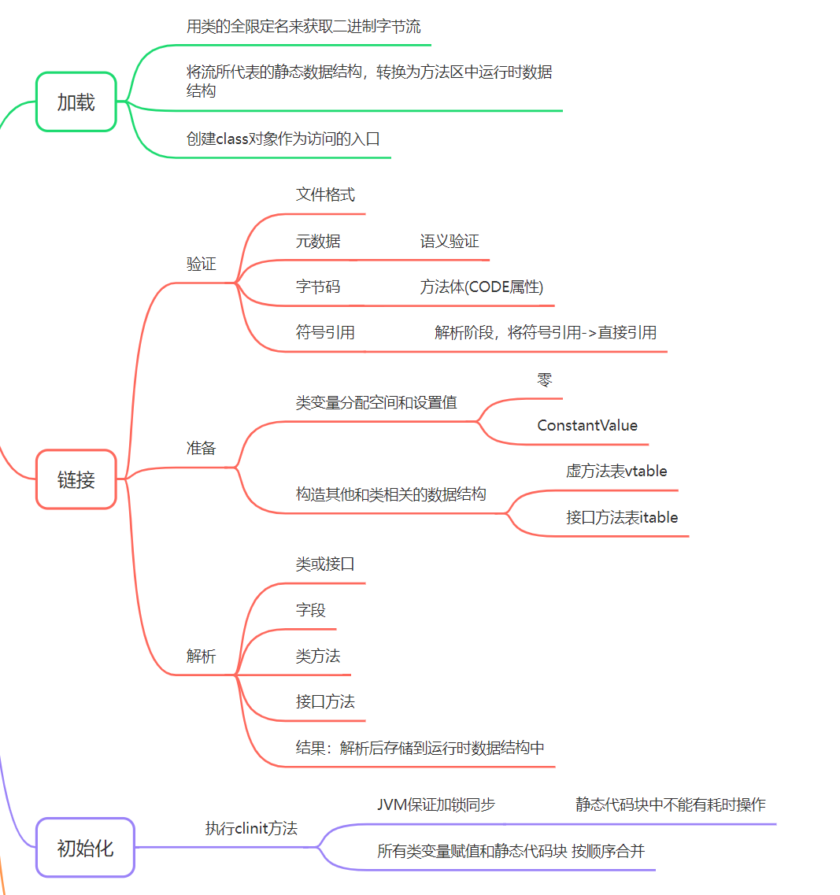

# 类加载机制

[TOC]

有道云链接：https://note.youdao.com/s/8B1KiRzM

  

  

1、类加载机制是什么？
1. 将二进制字节流从文件、网络、磁盘中读取出来，通过加载、链接、初始化，形成在JVM方法区的动态数据结构。也就是Class对象。
2. JVM可以直接使用Class对象，创建对象。

2、Java的动态扩展依赖于什么？
1. 依赖动态加载和动态链接
2. 动态加载：运行时指定实现类，用预置或者自定义类加载器从网络等地方加载二进制流，作为程序的一部分
3. 如：Applet(废弃)、JSP、OSGI(OSGi是一种Java的动态模块化系统框架)

3、类加载有哪些阶段？
1. 加载
2. 链接：验证、准备、解析
3. 初始化

4、类对象的生命周期
1. 加载、链接、初始化
2. 使用
3. 卸载

5、注意：类加载的顺序，都是指开始顺序，具体内部工作是交叉混合进行的。

## 前言：立即初始化/触发类加载
1、必须理解类加载的五种情况（主动引用）
1. new关键字实例化对象   ===================================>对象初始化本身不属于创建对象的流程，是new指令后面携带了invokeSpeical指令。
2. 子类的类加载，如果父类没有类加载，触发父类的类加载（接口只会对真正用到的父接口进行类加载）
3. 引用类的静态字段（final字段除外）
4. 调用类的静态方法
5. 反射调用

2、被动引用不会触发类加载
1. 通过子类引用父类的静态字段：只会触发父类，不会触发子类
2. 数组定义引用的类 Person[]
3. 引用类的final修饰的静态字段(常量)
> 常量会被编译时写入到Class文件的字段表集合中属性表集合里面的ConstantValue属性

## 加载
1、加载做了什么？三件事
1. 用类的全限定名来获取定义此类的二进制字节流 =================================> 类加载器，BootClassloader,PathClassLoader,DexClassLoader。PathClassLoader在ZygoteInit源码中，可以发现反射调用App的ActivityThread的main方法时传入了PathClassLoader
2. 将流所代表的静态存储结构，转换为，方法区中运行时数据结构
3. 在Heap中生成Class对象，作为访问入口，通过该对象 ，可以访问该类在方法区内的运行时数据结构、

2、类加载阶段，开发者可以通过自定义类加载器局部参与，整体都是JVM主导

## 链接

### 验证

1、验证阶段的作用是什么？
> 确保Class文件的字节流符合规范（避免恶意代码）

2、验证分为四阶段
1. 文件格式：魔数和版本号，通过验证后，才允许二进制字节流存储在JVM内存的方法区中，后续操作都是直接操作方法区的运行时数据结构。
2. 元数据：对类的元数据信息，进行语义验证（如继承关系是否正确）
3. 字节码：对类的方法体进行验证 ========================> Class文件中的Code属性
4. 符号引用：1. 对各类信息进行匹配性校验，如符号引用能付找到对应类 （确保解析阶段没问题）2.发生在解析阶段(将符号引用->直接引用) =========================> NoClassDefFoundError

### 准备

1、准备阶段做了什么？
1. 为类的static变量，分配内存，并且设置为零值。（因此类变量不需要一定设置初始值）
2. static final 常量，会通过ConstantValue属性 设置数值。
> static 变量，设置初始值，在类初始化阶段，调用clinit
3. 构造其他和类相关的数据结构：虚方法表vtable、接口方法表itable

2、类变量分配的内存在哪儿？
1. 类变量在方法区只是逻辑概念
2. 实际上可以在方法区也可以在Heap

### 解析

1、解析阶段是干什么的？（静态解析）
1. 将常量池的符号引用替换为直接引用

2、解析的四个阶段
1. 类和接口解析：符号引用，转换为。直接引用
2. 字段解析：1.先解析其所属类或者接口的符号引用 2.按照规则寻找简单名称和字段描述符都匹配的字段，返回直接引用。
3. 方法解析：1.先解析其所属类的符号引用 2.按照规则寻找简单名称和方法描述符都匹配的字段，返回直接引用。
4. 接口方法解析：1.先解析其所属接口的符号引用 2.按照规则寻找简单名称和方法描述符都匹配的字段，返回直接引用。

3、解析出来的直接引用存放到方法区的运行时数据结构中。

4、什么是直接引用？
1. 直接指向目标的指针
2. 偏移量
3. 能间接定位到目标的句柄

5、解析可以在之后完成：动态绑定

6、JVM只规定了在执行前解析即可

## 初始化

1、初始化阶段的作用是什么？
1. 执行clinit方法
1. JVM会保证加锁同步
1. 类变量赋值和静态代码块，按顺序合并
1. 注意：static代码块不要有耗时操作

2、静态语句块中只能访问到定义在静态语句块之前的变量，之后的变量只可以赋值，不可以访问

3、clinit和实例构造器<init>()方法不同，不用显式调用父类的clinit方法
1. JMV会保证父类的clinit被执行

4、JVM必须保证类的clinit在多线程中正确的加锁同步
1. 多线程同时初始化一个类，只有一个线程执行，其他线程阻塞
1. 不要在static代码块中有耗时操作，会导致多线程阻塞

## 类加载器

### Android

1. ClassLoader
1. 通过类的全限定名找到定义该类的二进制字节流
1. 这一过程的程序被称为ClassLoader

2、ClassLoader的作用
1. 类层次划分
1. 代码加密
1. 热部署
1. 任何类由类加载器和类本身共同确定其唯一性

3、双亲委派是通过组合实现的
1. 而不是通过继承实现的
1. 从父到子：BootClassLoader、PathClassLoader or DexClassLoader
1. P和D共同父类：BaseDexClassLoader，抽象类，实现了类加载的主要功能

### Java

1、JDK 8 以前三层类加载器
1. 启动类加载器 Bottstrap ClassLoader C++实现，JVM一部分
1. 扩展类加载器 Java实现
1. 应用程序类加载器 Java实现，getSystemClassLoader可以获得的返回值，又称为系统类加载器

2、JDK 9开始
1. Bootstrap ClassLoader加载少量的类
1. 平台类加载器加载所有模块