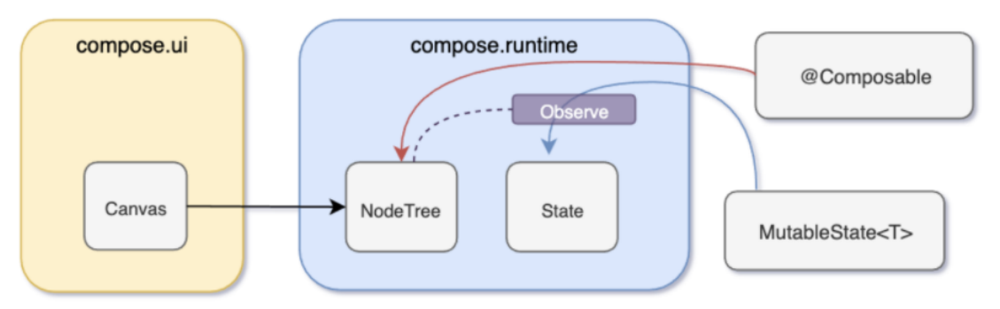

# Compose

本文链接：

精品文章：
[Under the hood of Jetpack Compose — part 1 of 2](https://medium.com/androiddevelopers/understanding-jetpack-compose-part-1-of-2-ca316fe39050)
[Under the hood of Jetpack Compose — part 2 of 2](https://medium.com/androiddevelopers/under-the-hood-of-jetpack-compose-part-2-of-2-37b2c20c6cdd)
[Scoped recomposition in Jetpack Compose — what happens when state changes?](https://dev.to/zachklipp/scoped-recomposition-jetpack-compose-what-happens-when-state-changes-l78?utm_source=dormosheio&utm_campaign=dormosheio)

Compose核心点：

1. 重组
2. remember
3. LaunchedEffect

1、Compose重组是什么？
1. 数据变化 => 视图的数据或者结构 改变
2. 编译器会给Composable函数，添加参数（最起码增加两三个参数）
3. 重组的时候不会重新调用整个Composable函数，而是调用部分代码

2、remember{}作用是避免loadMore状态，由于重组发生改变

## Compose结构

compose.ui在各平台上实现UI渲染
compose.runtime提供NodeTree管理和State管理

1. @Composable构建出NodeTree
2. MutableState提供State管理
3. NodeTree注册监听State

  


## remmember

1、remmember是什么
1. remember是一个函数，用于在组件中存储和记住一个可变的值。
2. 类似于旧版Android中的savedInstanceState   ===> savedInstanceState
3. 会创建一个类似于ViewModel的实例，用于存储和管理组件的状态。 ===> ViewModel
4. 每当组件重新构建时，它都会使用上一次保存的状态来恢复数据。这使得在屏幕方向变化、组件重建等情况下，数据仍然保持一致。
5. 每当组件重建时，remember都会返回上一次保存的值，而不是使用新的初始化值。
```kotlin
    val state = remember{
        mutableStateListOf("")
    }
```

2、remember源码解析
```kotlin
@Composable
inline fun <T> remember(crossinline calculation: @DisallowComposableCalls () -> T): T =
    currentComposer.cache(false, calculation)

val currentComposer: Composer
    @ReadOnlyComposable
    @Composable get() { throw NotImplementedError("Implemented as an intrinsic") }
```
1. calculation不允许有return，避免直接调用return
1. currentComposer.cache：remember类似缓存 ===> HashMap

3、remember缓存深入解析
```kotlin
@ComposeCompilerApi
inline fun <T> Composer.cache(invalid: Boolean, block: @DisallowComposableCalls () -> T): T {
    return rememberedValue().let {
        if (invalid || it === Composer.Empty) {
            val value = block()
            updateRememberedValue(value)
            value
        } else it
    } as T
}
```

### Composer


## LaunchedEffect ==> 最有价值的部分
1、示例代码：
```kotlin
            // 加载更多的状态变量
            var loadMore = remember{
                derivedStateOf {
                }
            }
            LaunchedEffect(loadMore) {
                snapshotFlow { loadMore.value }
                    .distinctUntilChanged()
                    .collect{
                        onLoadMore() // 回调
                    }
            }
```
2、LaunchedEffect是什么？
1. 数据驱动
2. Composable
3. 可以用来做“加载更多” - 耗时操作 - 协程(异步线程) - 组合项的作用域内 运行挂起函数
4. 不要更新UI（异步）
3、LaunchedEffect源码
```kotlin
@Composable // 
@NonRestartableComposable
fun LaunchedEffect(
    key1: Any?,
    block: suspend CoroutineScope.() -> Unit // 挂起函数
) {
    val applyContext = currentComposer.applyCoroutineContext
    remember(key1) { LaunchedEffectImpl(applyContext, block) }
}
```
4、Composable一定是UI组件吗？
5、组件化 => 模块 / Compose = lazyColumn
6、ComposableManager
7、SPI（service provider interface）
app初始化
所有Composable去实现ItemComposable接口（lazyColumn）
ServiceLoader，自动找出所有实现者，找到对应的composable ===》 面向服务编程
item as？ T 是什么？

## mutableStateOf

```kotlin
fun <T> mutableStateOf(
    value: T,
    policy: SnapshotMutationPolicy<T> = structuralEqualityPolicy()
): MutableState<T> = createSnapshotMutableState(value, policy)

internal actual fun <T> createSnapshotMutableState(
    value: T,
    policy: SnapshotMutationPolicy<T>
): SnapshotMutableState<T> = SnapshotMutableStateImpl(value, policy)

internal open class SnapshotMutableStateImpl<T>(
    value: T,
    override val policy: SnapshotMutationPolicy<T>
) : StateObject, SnapshotMutableState<T>

interface SnapshotMutableState<T> : MutableState<T> {
    val policy: SnapshotMutationPolicy<T>
}

interface MutableState<T> : State<T> {
    override var value: T
    operator fun component1(): T
    operator fun component2(): (T) -> Unit
}

@Stable
interface State<out T> {
    val value: T
}
```
