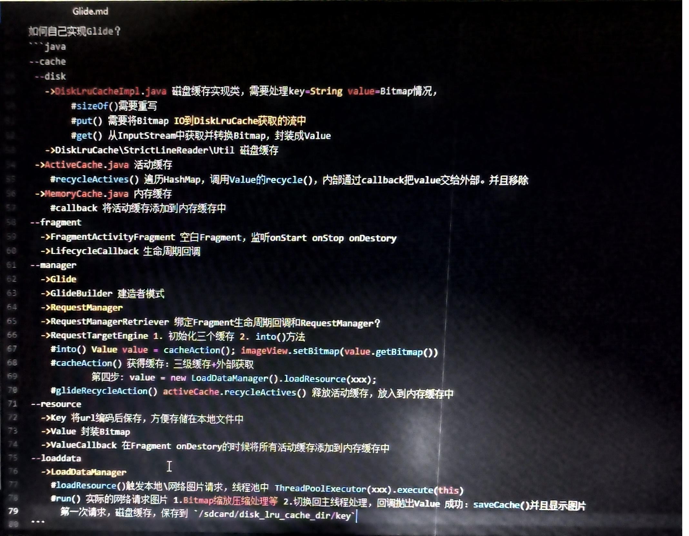

[toc]

两种注册方式
1. RequestManager.onStart中去回调
2. 加入到xxxlifecycle addlistenner自己根据生命周期去回调。不需要处理很多周期。属于模板方法


## Glide相关知识点
2. 引用计数


  

如何自己实现Glide？
1、分目录
1. cache:三级缓存
2. fragment：空白Fragment和生命周期回调
3. manager：管理
4. resource：资源
5. loaddata：触发实际请求，在目标线程池中处理，切换回主线程回调接口


2、三级缓存
1. DisLruCache\StrictLineReader\Util
1. disk目录：
1. DiskLruCacheImpk.java 磁盘缓存实现类，需要处理key=String，value=Bitmap情况
```
sizeof() 需要重写
put() 需要将Bitmap IO 到 DiskLruCache获取的流中
get() 从InputStream中获取并且转换Bitmap
```
1. ActiveCache：活动缓存
1. #recycleActives() 遍历HashMap，调用value的recycle()，内部通过callback把value交给外部，并且移除。
1. MemoryCache.java 内存缓存
> #callback 将活动缓存添加到内存缓存中

3、resource
1. Key 将url编码后保存，方便存储在本地文件中
1. value 封装Bitmap
1. ValueCallback 在Fragment oNDestory的时候将所有活动缓存添加到内存缓存中

4、loadData LoadDataManager
1. #loadResource 触发本地网络请求，线程池中 ThreadPoolExecutor(xxx).execute(this)
1. #run() 实际的网络请求图片 1.Bitmap缩放压缩处理等，切换回主线程处理，回调抛出Value 成功：


  

  


1. 网络请求时：存到磁盘缓存和活动缓存
1. 空白Fragment释放时，onDESTORY会触发release，将活动缓存提那家到内存缓存中。callback
1. Activity退出时空白Fragment会通知到所有的类，不要再干活了
1. 空白Fragment：内存紧张是会释放 

磁盘缓存大小
2、空白Fragment添加后的双重保障：集合+空白Handler发送消息。，后续版本中该空白Msg和另一个消息合并

commit并不是立即生效的，findFragmentByTag也可能获取不到。导致重复添加。

3、BitMap复用是什么？？？


# Glide

Profile：
研究过Glide内部生命周期机制、三级缓存设计思想

## 收获

1、Glide采用的设计模式
1. 观察者模式
2. 单例模式：多线程构造具有Application作用域的，主线程用Map确保单例，提高性能📈
3. 模板方法模式：Glide自己实现的Lifecycle接口
4. 状态模式：
5. 建造者模式：Glide的使用本身就是建造者模式
6. 工厂模式：
   1. 构造出App作用域和Fragment、Activity作用域的RequestManager
   2. 构造出ConnectionMonitor工厂，构造不同ConnectionMonitor。工厂提供了API可以自由替换。
   3. EngineJob工厂构造
   4. DecodeJob工厂构造
7. 原型设计模式：requestOptions.clone()
8. 享元设计模式：Request obtainRequest()


2、网络监听的巧妙之处
1. 网络监听配合Lifecycle，该页面已经Stop，不再监听和通知
2. 页面在前台时，网络状态改变会触发重新请求

3、Glide可能导致内存泄露的地方？
1. 使用了Application的作用域
2. 子线程或者非Fragment、Activity的地方构造Glide，如Service的Context等等

4、Request等等接口，思想都是：面向抽象，不面向具体

5、Glide的组件注册机（ComponentRegistry）
1. Glide的组件注册机是一个用于管理和注册各种组件的机制。
2. 组件指的是一些可插拔的模块，如解码、缓存、转换等。
3. 通过组件注册机，Glide可以动态地注册和管理这些组件，以完成图片加载的各个阶段。
4. 组件注册机的好处包括：
> 1. 灵活性：组件注册机提供了一种可插拔的机制，使得用户可以根据自己的需求和特定场景，自定义和扩展Glide的功能。用户可以注册自定义的组件，替换默认实现，或引入第三方库的组件。
> 2. 可配置性：通过组件注册机，用户可以根据需求配置Glide的行为。用户可以注册和配置不同的组件，以满足特定的功能和性能需求。
> 3. 可维护性：组件注册机可以管理和维护各个组件的生命周期和依赖关系，使得组件之间的协作和交互更加有序和可控。这有助于提高代码的可维护性和可扩展性。


## Glide的使用

1、集成
```groovy
dependencies {
  implementation 'com.github.bumptech.glide:glide:4.16.0'
}
```

2、简单使用
```java
Glide.with(this).load(url).into(imageView);


// with
RequestManager rm = Glide.with(this);

// load
RequestBuilder rb = rm.load(url);

// into
rb.into(imageView);
```

3、Glide分为三个阶段
1. with：生命周期管理（空白的Fragment）
1. load：构建出RequetsBuilder对象
1. into：
    1. 运行队列、等待队列 
    1. 活动缓存、内存缓存
    1. 网络模型

## with：生命周期机制

1、如何去监听Activity、Fragment的生命周期？
1. 附加一个空白的Fragment

2、设计的意图？
1. Glide所有类都和生命周期挂钩

3、生命周期作用域

4、注意点：Glide可能导致内存泄漏，什么原因？
1. with时不要传入Application，会导致拥有Applicaiton作用域：
> 会使用整个App的生命周期，不会和空白Fragment生命周期挂钩，导致不回收。

5、为什么系统Lifecycle已经有状态机的状态同步功能，Glide的LifecycleLifecycle的addListenner还需要手动做状态同步？
1. 自己在构造时，作为LifecycleObserver把自己addObserver添加到系统Lifecycle中
2. 后续调用addListenner等方法并没有真正作为LifecycleObserver注册，只是添加到了内部维护的Set集合中
3. 需要手动做状态同步
4. 后续状态下发，遍历Set集合，下发即可。

💯思路总结：
```
1️⃣ 将Context输入，通过RequestManagerRetriver，获取到RequestManager
2️⃣ 如果是主线程，并且是Activity、Fragment，RequestManagerRetriver内部会通过LifecycleRequestManagerRetriever，构造内含Activity\Fragment 对应Lifecycle的RequestManager
  ↘️构造LifecycleLifecycle类，该类是系统LifeycycleObserver的实现类。会将自身作为Observer添加到系统中。
    ↘️ 实现了Glide自定义接口Lifecycle，增加两个方法addListener和removeListener，内部维护了一个Set集合。
  ↘️构造了RequestManager实例
    🌎添加网络监听器，会在网络恢复连接后，重新开始请求
    👷添加自己，作为Listener，等待被LifecycleLifecycle回调onStart、onStop、onDestory，刚添加时会自己根据系统状态选择是否直接调用onStart，还是等待调用，还是调用onDestory。❓❓❓为什么呢？👉这种监听器只是Set集合维护的，并没有真正绑定到系统Lifecycle上，当系统Lifecycle回调时LifecycleLifecycle时，很多Listenner还没有添加呢。
  ↘️添加一个Listener用于在onDestory时移除，对RequestManager的缓存（缓存是保证同时只有一个RequestManager）
3️⃣ 如果是子线程，无论哪种方式，用双重检查加锁方式，构造出具有ApplicationLifecycle的RequestManager🚨此处并不是添加了系统App级别Lifecycle的观察者。
  ↘️直接实现Glide自己Lifecycle接口里面的addListener和removeListenner，addListenner直接调用onStart()其他啥也不做，removeListenner()啥也不做
```

💕Glide如何在构造时保证单例模式？
1. 检查是主线程，用Map缓存，保证单例模式
2. 检查是子线程，用双重检查加锁保证，实例化一个

### with源码

Context➡️with（RequestManagerRetriever）➡️RequestManager

```java
// Glide.java with 入口处

  public static RequestManager with(@NonNull Context context) {
    return getRetriever(context).get(context);
  }
  public static RequestManager with(@NonNull FragmentActivity activity) {
    return getRetriever(activity).get(activity);
  }
  public static RequestManager with(@NonNull Fragment fragment) {
    return getRetriever(fragment.getContext()).get(fragment);
  }
  public static RequestManager with(@NonNull View view) {
    return getRetriever(view.getContext()).get(view);
  }

// Glide.java
  private static RequestManagerRetriever getRetriever(@Nullable Context context) {
    return Glide.get(context).getRequestManagerRetriever();
  }
  @NonNull
  public RequestManagerRetriever getRequestManagerRetriever() {
    return requestManagerRetriever;
  }
// RequestManagerRetriver.java
  public RequestManager get(@NonNull Context context) {
    if (context == null) {
      throw new IllegalArgumentException("You cannot start a load on a null Context");
    } else if (Util.isOnMainThread() && !(context instanceof Application)) {
      if (context instanceof FragmentActivity) {
        return get((FragmentActivity) context); // 使用Activity的作用域
      } else if (context instanceof ContextWrapper
          && ((ContextWrapper) context).getBaseContext().getApplicationContext() != null) {
        return get(((ContextWrapper) context).getBaseContext());
      }
    }
    // 👿会使用Application的作用域
    return getApplicationManager(context);
  }
// 用Application的Lifecycle构造
// 😈😈😈😈😈😈😈😈😈😈😈😈😈😈😈😈😈😈😈😈😈😈😈😈😈😈😈😈😈😈😈😈
  private RequestManager getApplicationManager(@NonNull Context context) {
    // Either an application context or we're on a background thread.
    if (applicationManager == null) {
      synchronized (this) { // 双重检查加锁，保证多线程的安全问题 =========================================> 双重检查加锁
        if (applicationManager == null) {
          Glide glide = Glide.get(context.getApplicationContext());
          applicationManager =
              factory.build(
                  glide,
                  new ApplicationLifecycle(), // 😈Applicaiton作用域
                  new EmptyRequestManagerTreeNode(),
                  context.getApplicationContext());
        }
      }
    }

    return applicationManager;
  }

// 用Activity的Lifecycle构造出RequestManager返回
// 👟👟👟👟👟👟👟👟👟👟👟👟👟👟👟👟👟👟👟👟👟👟👟👟👟👟👟👟👟👟👟
  public RequestManager get(@NonNull FragmentActivity activity) {
    if (Util.isOnBackgroundThread()) { // 不在主线程，直接使用🥶ApplicationContext，切换作用域
      return get(activity.getApplicationContext());
    }
    assertNotDestroyed(activity);
    frameWaiter.registerSelf(activity);
    boolean isActivityVisible = isActivityVisible(activity);
    Glide glide = Glide.get(activity.getApplicationContext());
    // ❌老版本是添加空白Fragment
    // ✔️新版本和Lifecycle联动（底层是空白Fragment）
    return lifecycleRequestManagerRetriever.getOrCreate(
        activity,
        glide,
        activity.getLifecycle(), // 🔴注意：获取了ComponentActivity实现的LifecycleOwner接口，提供了LifecycleRegistery（提供了处理五大状态的功能）
        activity.getSupportFragmentManager(),
        isActivityVisible);
  }
// 用Fragment作用域
// 📇📇📇📇📇📇📇📇📇📇📇📇📇📇📇📇📇📇📇📇📇📇📇📇📇📇📇📇📇📇
  public RequestManager get(@NonNull Fragment fragment) {
    Preconditions.checkNotNull(
        fragment.getContext(),
        "You cannot start a load on a fragment before it is attached or after it is destroyed");
    if (Util.isOnBackgroundThread()) {
      return get(fragment.getContext().getApplicationContext()); //😈子线程使用ApplicationLifecycle
    }
    if (fragment.getActivity() != null) {
      frameWaiter.registerSelf(fragment.getActivity());
    }
    FragmentManager fm = fragment.getChildFragmentManager();
    Context context = fragment.getContext();
    Glide glide = Glide.get(context.getApplicationContext());
    // 🐮使用了Fragment的lifecycle
    return lifecycleRequestManagerRetriever.getOrCreate(
        context, glide, fragment.getLifecycle(), fm, fragment.isVisible());
  }
```

#### 线程

作用域：
1. 子线程：内部会切换到Application作用域
2. 主线程：传入ApplicationContext才会使用Application作用域，传入Activity、Fragment会使用Activity作用域

#### LifecycleRequestManagerRetriever

getOrCreate：构造LifecycleLifecycle，注册系统Lifecycle的监听器
```java
  RequestManager getOrCreate(
      Context context,
      Glide glide,
      final Lifecycle lifecycle,
      FragmentManager childFragmentManager,
      boolean isParentVisible) {
    Util.assertMainThread();
    RequestManager result = getOnly(lifecycle); // 获取缓存，避免实例化多个，注册多个重复接口。
    if (result == null) {
      // 内部调用Lifecycle的addObserver()设置监听为this，本身实现了相关接口。
      // final class LifecycleLifecycle implements Lifecycle, LifecycleObserver
      LifecycleLifecycle glideLifecycle = new LifecycleLifecycle(lifecycle);
      result =
          factory.build(
              glide,
              glideLifecycle,
              new SupportRequestManagerTreeNode(childFragmentManager),
              context);
      lifecycleToRequestManager.put(lifecycle, result);
      glideLifecycle.addListener( // 添加监听
          new LifecycleListener() {
            @Override
            public void onStart() {}

            @Override
            public void onStop() {}

            @Override
            public void onDestroy() {
              // 移除缓存保证同时只有一个RequestManager
              lifecycleToRequestManager.remove(lifecycle);
            }
          });
    }
    return result;
  }
```
🐦调用
```java
// RequestManager构造自己时，需要将一切掌控到生命周期上。
  RequestManager(
      Glide glide,
      Lifecycle lifecycle,
      RequestManagerTreeNode treeNode,
      RequestTracker requestTracker,
      ConnectivityMonitorFactory factory,
      Context context) {
    this.glide = glide;
    this.lifecycle = lifecycle;
    this.treeNode = treeNode;
    this.requestTracker = requestTracker;
    this.context = context;

    connectivityMonitor =
        factory.build(
            context.getApplicationContext(),
            new RequestManagerConnectivityListener(requestTracker));

    glide.registerRequestManager(this);

    if (Util.isOnBackgroundThread()) {
      Util.postOnUiThread(addSelfToLifecycle); // 子线程是需要投递到主线程，注册监听自己
    } else {
      // 主线程，自己作为监听器注册到Lifecycle中
      lifecycle.addListener(this); //
    }
    // 注册网络状态监听器
    lifecycle.addListener(connectivityMonitor);

    defaultRequestListeners =
        new CopyOnWriteArrayList<>(glide.getGlideContext().getDefaultRequestListeners());
    setRequestOptions(glide.getGlideContext().getDefaultRequestOptions());
  }
// 子线程是需要投递到主线程，注册监听自己
  private final Runnable addSelfToLifecycle =
      new Runnable() {
        @Override
        public void run() {
          lifecycle.addListener(RequestManager.this);
        }
      };

// RequestManager根据生命周期状态：可以选择暂停请求、停止请求等
  private final TargetTracker targetTracker = new TargetTracker();
  public synchronized void onStart() {
    resumeRequests();
    targetTracker.onStart();
  }
  @Override
  public synchronized void onStop() {
    targetTracker.onStop();
    if (clearOnStop) {
      clearRequests(); // 清除请求
    } else {
      pauseRequests(); // 暂停请求
    }
  }

  @Override
  public synchronized void onDestroy() {
    targetTracker.onDestroy();
    clearRequests();
    requestTracker.clearRequests();//取消请求
    lifecycle.removeListener(this);//移除对RequestManager自身的监听
    lifecycle.removeListener(connectivityMonitor);//移除网络监听
    Util.removeCallbacksOnUiThread(addSelfToLifecycle);//取消Runnable接口，避免还没投递到MQ后Message还没处理，就已经被销毁了（会闪退）
    glide.unregisterRequestManager(this);// 解除RequestManager注册❓
  }
```

#### ActivityFragmentLifecycle👉LifecycleLifecycle

```java
final class LifecycleLifecycle implements Lifecycle, LifecycleObserver {
  @NonNull
  private final Set<LifecycleListener> lifecycleListeners = new HashSet<LifecycleListener>();

  @NonNull private final androidx.lifecycle.Lifecycle lifecycle;

  // 1️⃣1、构造时就把自己注册到Lifecycle中
  // 💯 只注册了一个到系统中，剩下触发都是观察者模式通知Listener
  LifecycleLifecycle(androidx.lifecycle.Lifecycle lifecycle) {
    this.lifecycle = lifecycle;
    lifecycle.addObserver(this);
  }

  // 2️⃣2、以下都是监听Lifecycle生命周期的回调事件
  @OnLifecycleEvent(Event.ON_START)
  public void onStart(@NonNull LifecycleOwner owner) {
    for (LifecycleListener lifecycleListener : Util.getSnapshot(lifecycleListeners)) {
      lifecycleListener.onStart();
    }
  }

  @OnLifecycleEvent(Event.ON_STOP)
  public void onStop(@NonNull LifecycleOwner owner) {
    for (LifecycleListener lifecycleListener : Util.getSnapshot(lifecycleListeners)) {
      lifecycleListener.onStop();
    }
  }

  @OnLifecycleEvent(Event.ON_DESTROY)
  public void onDestroy(@NonNull LifecycleOwner owner) {
    for (LifecycleListener lifecycleListener : Util.getSnapshot(lifecycleListeners)) {
      lifecycleListener.onDestroy();
    }
    owner.getLifecycle().removeObserver(this);
  }

  // 3️⃣3、维护内部的Set集合，来通知Glide的哥哥组件
  @Override
  public void addListener(@NonNull LifecycleListener listener) {
    lifecycleListeners.add(listener);
    if (lifecycle.getCurrentState() == State.DESTROYED) {
      // 当前为DESTRPYES 销毁
      listener.onDestroy();
    } else if (lifecycle.getCurrentState().isAtLeast(State.STARTED)) {
      // 开始
      listener.onStart();
    } else {
      listener.onStop();
    }
  }

  @Override
  public void removeListener(@NonNull LifecycleListener listener) {
    lifecycleListeners.remove(listener);
  }
}
```

#### ConnectivityMonitor：网络连接监听器的工厂模式

```java

// Glide.java
public GlideBuilder setConnectivityMonitorFactory(@Nullable ConnectivityMonitorFactory factory) {
  this.connectivityMonitorFactory = factory;
  return this;
}

// ConnectivityMonitorFactory.java
public interface ConnectivityMonitorFactory {
  // 个人理解是抽象工厂模式
  // 根据不同需求选择不同工厂
  // 工厂内部根据不同部分的组合，产生不同的产品。
  @NonNull
  ConnectivityMonitor build(
      @NonNull Context context, @NonNull ConnectivityMonitor.ConnectivityListener listener);
}
// 工厂的实现一:
public class DefaultConnectivityMonitorFactory implements ConnectivityMonitorFactory {
  private static final String TAG = "ConnectivityMonitor";
  private static final String NETWORK_PERMISSION = "android.permission.ACCESS_NETWORK_STATE";

  @NonNull
  @Override
  public ConnectivityMonitor build(
      @NonNull Context context, @NonNull ConnectivityMonitor.ConnectivityListener listener) {
    // 检查网络权限
    int permissionResult = ContextCompat.checkSelfPermission(context, NETWORK_PERMISSION);
    boolean hasPermission = permissionResult == PackageManager.PERMISSION_GRANTED;
    if (Log.isLoggable(TAG, Log.DEBUG)) {
      Log.d(
          TAG,
          hasPermission
              ? "ACCESS_NETWORK_STATE permission granted, registering connectivity monitor"
              : "ACCESS_NETWORK_STATE permission missing, cannot register connectivity monitor");
    }
    // 根据是否有网络权限：提供不同的Monitor（网络连接监控器）👉如果在无网络权限情况下，也没必要注册ConnectivityMonitor来恢复图片的网络请求
    return hasPermission
        ? new DefaultConnectivityMonitor(context, listener) // 默认
        : new NullConnectivityMonitor(); // 无效的
  }
}
```
```java
//默认工厂：产品🅰️无效网络监听器💥
class NullConnectivityMonitor implements ConnectivityMonitor {

  @Override
  public void onStart() {
    // Do nothing.
  }

  @Override
  public void onStop() {
    // Do nothing.
  }

  @Override
  public void onDestroy() {
    // Do nothing.
  }
}
// 默认工厂：产品🅱️默认网络监听器
final class DefaultConnectivityMonitor implements ConnectivityMonitor {
  private final Context context;

  final ConnectivityListener listener;

  DefaultConnectivityMonitor(@NonNull Context context, @NonNull ConnectivityListener listener) {
    this.context = context.getApplicationContext();
    this.listener = listener;
  }

  private void register() {
    // 底层是将Listenner列表包装成android.net.ConnectivityManager.NetworkCallback，注册到 connectivityManager中
    SingletonConnectivityReceiver.get(context).register(listener);
    // connectivityManager.get().registerDefaultNetworkCallback(networkCallback);
  }

  private void unregister() {
    SingletonConnectivityReceiver.get(context).unregister(listener);
  }

  @Override
  public void onStart() {
    register(); // 注册网络监听
  }

  @Override
  public void onStop() {
    unregister(); // 取消网络监听
  }

  @Override
  public void onDestroy() {
    // Do nothing.
  }
}

// API24之前：注册广播
//           context.registerReceiver(connectivityReceiver,new IntentFilter(ConnectivityManager.CONNECTIVITY_ACTION));
// API24之后：ConnectivityManager
//           connectivityManager.get().registerDefaultNetworkCallback(networkCallback);
final class SingletonConnectivityReceiver {
    frameworkConnectivityMonitor =
        Build.VERSION.SDK_INT >= Build.VERSION_CODES.N
        // >= 24
            ? new FrameworkConnectivityMonitorPostApi24(connectivityManager, connectivityListener)
            // <24
            : new FrameworkConnectivityMonitorPreApi24(
                context, connectivityManager, connectivityListener);
}
```
### TargetTracker

```java
public final class TargetTracker implements LifecycleListener {
  // Target目标会有很多
  private final Set<Target<?>> targets =
      Collections.newSetFromMap(new WeakHashMap<Target<?>, Boolean>());

  // track加入列表
  public void track(@NonNull Target<?> target) {
    targets.add(target);
  }

  public void untrack(@NonNull Target<?> target) {
    targets.remove(target);
  }

  // 通知所有目标的三个事件
  @Override
  public void onStart() {
    for (Target<?> target : Util.getSnapshot(targets)) {
      target.onStart();
    }
  }

  @Override
  public void onStop() {
    for (Target<?> target : Util.getSnapshot(targets)) {
      target.onStop();
    }
  }

  @Override
  public void onDestroy() {
    for (Target<?> target : Util.getSnapshot(targets)) {
      target.onDestroy();
    }
  }

  public void clear() {
    targets.clear();
  }
}
```

#### Target

```java
// 监听Fragment和Activity的Lifecycle事件
// 如：
//  1、RequestManager
//  2、Target
public interface LifecycleListener { // 顶层抽象接口
  void onStart();
  void onStop();
  void onDestroy();
}
// 提供了加载和请求相关的API
public interface Target<R> extends LifecycleListener {
}
// 增加Request
public abstract class BaseTarget<Z> implements Target<Z> {
  private Request request; // 增加了属性
  @Override
  public void setRequest(@Nullable Request request) {
    this.request = request;
  }
}
// 增加View和相关操作
public abstract class ViewTarget<T extends View, Z> extends BaseTarget<Z> {
  protected final T view;
}

// 
public abstract class ImageViewTarget<Z> extends ViewTarget<ImageView, Z> implements Transition.ViewAdapter {
  @Override
  public void onStart() { // 实现onStart
    if (animatable != null) {
      animatable.start();
    }
  }

  @Override
  public void onStop() { // 实现onStop，不需要实现onDestory，这是抽象类的好处
    if (animatable != null) {
      animatable.stop();
    }
  }
}
```

RequestManager通过TargetTracker通知到Target
```java
  public synchronized void onStart() {
    resumeRequests();
    targetTracker.onStart(); //通知到所有目标
  }
  @Override
  public synchronized void onStop() {
    targetTracker.onStop(); //通知到所有目标
  }

  /**
   * Lifecycle callback that cancels all in progress requests and clears and recycles resources for
   * all completed requests.
   */
  @Override
  public synchronized void onDestroy() {
    targetTracker.onDestroy(); //通知到所有目标
  }
```

## load

### RequestBuilder

1、构造出
```java
//RequestManager.java
  // 实现ModelType结构
  public RequestBuilder<Drawable> load(@Nullable String string) {
    return asDrawable().load(string);
  }
  public RequestBuilder<Drawable> asDrawable() {
    return as(Drawable.class); // 构造出RequestBuilder
  }
//RequestBuilder.java
  public RequestBuilder<TranscodeType> load(@Nullable String string) {
    return loadGeneric(string);
  }
  @Nullable private Object model; // 参数。如String
  private RequestBuilder<TranscodeType> loadGeneric(@Nullable Object model) {
    if (isAutoCloneEnabled()) {
      return clone().loadGeneric(model);
    }
    this.model = model; // 可以是String、Bitmap等等
    isModelSet = true;
    return selfOrThrowIfLocked();//👈
  }
  protected final T selfOrThrowIfLocked() {
    if (isLocked) {
      throw new IllegalStateException("You cannot modify locked T, consider clone()");
    }
    return self();//👈
  }
  private T self() {
    return (T) this;
  }
```

## into

into会构造出Request、构造出target并且添加到TargetTracker之中

```java
// RequestBuilder.java
  // 针对ImageView的ScaleType做特殊处理。构造RequestOptions
  public ViewTarget<ImageView, TranscodeType> into(@NonNull ImageView view) {
    Util.assertMainThread();
    BaseRequestOptions<?> requestOptions = this;
      switch (view.getScaleType()) {
        case CENTER_CROP:
          requestOptions = requestOptions.clone().optionalCenterCrop();
          break;
        case CENTER_INSIDE:
          requestOptions = requestOptions.clone().optionalCenterInside(); // =============> 原型设计模式
          break;
        case FIT_CENTER:
        case FIT_START:
        case FIT_END:
          requestOptions = requestOptions.clone().optionalFitCenter();
          break;
        case FIT_XY:
          requestOptions = requestOptions.clone().optionalCenterInside();
          break;
        case CENTER:
        case MATRIX:
        default:
          // Do nothing.
      }

    return into(
        glideContext.buildImageViewTarget(view, transcodeClass),// 👈工厂构造ImageViewTarget🏗️
        /* targetListener= */ null,
        requestOptions,
        Executors.mainThreadExecutor()); //👈👈👈👈👈👈
  }
//👉工厂构造ImageViewTarget🏗️>>>>>>>>>>>>>>>>>>>>>>>>>>>>>>>>>>>
  public <X> ViewTarget<ImageView, X> buildImageViewTarget(
      @NonNull ImageView imageView, @NonNull Class<X> transcodeClass) {
    return imageViewTargetFactory.buildTarget(imageView, transcodeClass);
  }
// ImageViewTargetFactory.java
public class ImageViewTargetFactory {
  public <Z> ViewTarget<ImageView, Z> buildTarget(ImageView view, Class<Z> clazz) {
    if (Bitmap.class.equals(clazz)) {
      return (ViewTarget<ImageView, Z>) new BitmapImageViewTarget(view);
    } else if (Drawable.class.isAssignableFrom(clazz)) {
      return (ViewTarget<ImageView, Z>) new DrawableImageViewTarget(view);
    } else {
      throw new IllegalArgumentException(
          "Unhandled class: " + clazz + ", try .as*(Class).transcode(ResourceTranscoder)");
    }
  }
}
//<<<<<<<<<<<<<<<<<<<<<<<<<<<<<<<<<<<👈工厂构造ImageViewTarget🏗️
// RequestBuilder.java
  private <Y extends Target<TranscodeType>> Y into(
      Y target,
      null,
      BaseRequestOptions<?> options,
      Executor callbackExecutor) {
    // 1️⃣ 构造请求
    Request request = buildRequest(target, targetListener, options, callbackExecutor);
    // 2️⃣ target目标
    requestManager.clear(target);
    target.setRequest(request);
    // 3️⃣ Target<?> target添加到targetTracker
    requestManager.track(target, request);

    return target;
  }
// 1️⃣ 构造请求 RequestBuilder.java: 享元模式
  private Request buildRequest(xxx) {
    return buildRequestRecursive(xxx);
  }
  private Request buildRequestRecursive(xxx) {
    Request mainRequest = buildThumbnailRequestRecursive(xxx);
  }
  private Request buildThumbnailRequestRecursive(xxx) {
      Request fullRequest = obtainRequest(xxx);
      Request thumbRequest = thumbnailBuilder.buildRequestRecursive(xxx);//🔁循环
      coordinator.setRequests(fullRequest, thumbRequest);
      return coordinator;
  }
  private Request obtainRequest(xxx) {
    return SingleRequest.obtain(xxx);
  }
  public static <R> SingleRequest<R> obtain(xxx) {
    return new SingleRequest<>(xxx);
  }

// 3️⃣ RequestManager.java
  synchronized void track(@NonNull Target<?> target, @NonNull Request request) {
    targetTracker.track(target); // Target添加
    requestTracker.runRequest(request); // 添加Request并且执行
  }
  // requestTracker是在构造RequestManager时，传入赋值：new RequestTracker()
// RequestTracker.java
  public void runRequest(@NonNull Request request) {
    requests.add(request); // 执行队列
    if (!isPaused) {
      request.begin(); // 执行命令
    } else {
      request.clear();
      pendingRequests.add(request); // 等待队列
    }
  }

// SingleRequest.java begin

  public void begin() {
    synchronized (requestLock) {
      // 核心👈
      if (Util.isValidDimensions(overrideWidth, overrideHeight)) {
        onSizeReady(overrideWidth, overrideHeight);// 核心👈
      } else {
        target.getSize(this); // 用户没有设置，再次测量
      }
    }
  }

  public void onSizeReady(int width, int height) {
    synchronized (requestLock) {
      tatus = engine.load(xxx);// 核心👈
    }
  }
// Engine.java // 先查找活动缓存（运行时缓存），再查找内存缓存（运行时）
  public <R> LoadStatus load(x) {
    EngineKey key =
        keyFactory.buildKey( // 构造出EngineKey保证唯一性
            model,
            signature, // 签名
            width, // 宽高
            height,
            transformations,
            resourceClass,
            transcodeClass,
            options);

    EngineResource<?> memoryResource;
    synchronized (this) {
      // 1、查找内存缓存
      memoryResource = loadFromMemory(key, isMemoryCacheable, startTime);

      if (memoryResource == null) {
        return waitForExistingOrStartNewJob(xxx); // 2、发起网络请求
      }
    }

// 2、命中缓存直接使用
    cb.onResourceReady(memoryResource, DataSource.MEMORY_CACHE, /* isLoadedFromAlternateCacheKey= */ false);
    return null;
  }
  // 查找内存缓存
  private EngineResource<?> loadFromMemory(EngineKey key, boolean isMemoryCacheable, long startTime) {
    // 1、先找活动·
    EngineResource<?> active = loadFromActiveResources(key);
    // 2、再找内存
    EngineResource<?> cached = loadFromCache(key);
  }
////////////////////////////////////////// loadFromMemory end

  // 
  private <R> LoadStatus waitForExistingOrStartNewJob(xxx) {
    EngineJob<?> current = jobs.get(key, onlyRetrieveFromCache); // 检测任务是否在运行，在运行的就不要再发起请求了。
    if (current != null) {
      current.addCallback(cb, callbackExecutor);
      return new LoadStatus(cb, current);
    }

    EngineJob<R> engineJob = engineJobFactory.build(xxx); // 线程池大管家
    DecodeJob<R> decodeJob = decodeJobFactory.build(xxx, engineJob); // 需要投递到EngineJob中执行
    
    jobs.put(key, engineJob);

    engineJob.addCallback(cb, callbackExecutor); // addCallback 🚀🚀🚀 和线程池提供的接口深度相关，为了解决什么问题来着❓❓❓❓❓❓❓❓❓❓❓❓❓❓❓❓❓❓❓❓❓❓❓❓❓❓
    engineJob.start(decodeJob); // 开始Job 🎃🎃🎃🎃🎃

    return new LoadStatus(cb, engineJob);
  }

```

### Engine

1、Engine是核心
1. 查找图片顺序：活动缓存（运行时缓存）-> 内存缓存（运行时缓存）-> 磁盘缓存
1. 关键点是Key：宽高参数组成签名，确保唯一

2、loadFromMemory 活动缓存、内存缓存LRU -> 直接返回去显示 onResourceReady

3、内存缓存LRU
1. 3 maxSize
2. 正在使用的图片直接移除会有问题！因此正在显示的图片放入活动缓存。

4、内存缓存LRU管理

5、EngineJob是什么?
1. EngineJob jobs.get 查找有没有正在运行的JOB
: 线程池大管家，DecodeJob（任务）提交到EnginJob中执行
```java
    EngineJob<?> current = jobs.get(key, onlyRetrieveFromCache); // 检测任务是否在运行，在运行的就不要再发起请求了。
    if (current != null) {
      current.addCallback(cb, callbackExecutor);
      return new LoadStatus(cb, current);
    }

    engineJob.start(decodeJob); // 开始Job 🎃🎃🎃🎃🎃
```
👉DecodeJob
```java
//DecodeJob.java
  @Override
  public void run() {
    DataFetcher<?> localFetcher = currentFetcher;

    runWrapped(); //👈
  }
  private void runWrapped() {
    switch (runReason) {
      case INITIALIZE:
        stage = getNextStage(Stage.INITIALIZE);
        currentGenerator = getNextGenerator(); //👈
        runGenerators();// 2
        break;
      case SWITCH_TO_SOURCE_SERVICE:
        runGenerators();
        break;
      case DECODE_DATA:
        decodeFromRetrievedData();
        break;
    }
  }
  private DataFetcherGenerator getNextGenerator() {
    switch (stage) {
      case RESOURCE_CACHE:
        return new ResourceCacheGenerator(decodeHelper, this);
      case DATA_CACHE:
        return new DataCacheGenerator(decodeHelper, this);
      case SOURCE:
        return new SourceGenerator(decodeHelper, this);//👈
    }
  }
  private void runGenerators() {
    currentThread = Thread.currentThread();
    startFetchTime = LogTime.getLogTime();
    boolean isStarted = false;
    while (!isCancelled
        && currentGenerator != null
        && !(isStarted = currentGenerator.startNext())) {//👈 SourceGenerator.startNext()
      stage = getNextStage(stage);
      currentGenerator = getNextGenerator();

      if (stage == Stage.SOURCE) {
        reschedule(RunReason.SWITCH_TO_SOURCE_SERVICE);
        return;
      }
    }
  }
// SourceGenerator.java
  public boolean startNext() {
    loadData = null;
    boolean started = false;
    while (!started && hasNextModelLoader()) {
      // 💢注册机，会提前被加载，在helper的loadData列表中可以找到我们需要的，LoadData
      loadData = helper.getLoadData().get(loadDataListIndex++); //👈 LoadData = HttpGlideUrlLoader
      if (loadData != null
          && (helper.getDiskCacheStrategy().isDataCacheable(loadData.fetcher.getDataSource())
              || helper.hasLoadPath(loadData.fetcher.getDataClass()))) {
        started = true;
        startNextLoad(loadData);//👈 HttpUrlFetcher.loadData
      }
    }
    return started;
  }
  private void startNextLoad(final LoadData<?> toStart) {
    loadData.fetcher.loadData(//👈 HttpUrlFetcher.loadData
        helper.getPriority(),
        new DataCallback<Object>() {
          @Override
          public void onDataReady(@Nullable Object data) { //🔁🔁🔁 获取到InputStream后返回这里。
            if (isCurrentRequest(toStart)) {
              onDataReadyInternal(toStart, data);//👈 
            }
          }

          @Override
          public void onLoadFailed(@NonNull Exception e) {
            if (isCurrentRequest(toStart)) {
              onLoadFailedInternal(toStart, e);
            }
          }
        });
  }

// HttpGlideUrlLoader.java 构造出 HttpUrlFetcher
  @Override
  public LoadData<InputStream> buildLoadData(
      @NonNull GlideUrl model, int width, int height, @NonNull Options options) {
    GlideUrl url = model;
    if (modelCache != null) {
      url = modelCache.get(model, 0, 0);
      if (url == null) {
        modelCache.put(model, 0, 0, model);
        url = model;
      }
    }
    int timeout = options.get(TIMEOUT);
    return new LoadData<>(url, new HttpUrlFetcher(url, timeout));//👈 构造
  }
// HttpUrlFetcher
  public void loadData(xxx) {
    InputStream result = loadDataWithRedirects(glideUrl.toURL(), 0, null, glideUrl.getHeaders());
    callback.onDataReady(result);
  }

// HttpUrlFetcher. java连接目标，发起请求，获得InputStream
private InputStream loadDataWithRedirects(URL url, int redirects, URL lastUrl, Map<String, String> headers) throws HttpException {

    urlConnection = buildAndConfigureConnection(url, headers);
    urlConnection.connect();
    return getStreamForSuccessfulRequest(urlConnection); // 获取InputStream
  }


// 🔁🔁🔁🔁🔁🔁🔁🔁 获取到InputStream后返回这里 🔁🔁🔁🔁🔁🔁🔁🔁🔁🔁🔁🔁🔁🔁🔁🔁
  void onDataReadyInternal(LoadData<?> loadData, Object data) {
    // 磁盘缓存
    DiskCacheStrategy diskCacheStrategy = helper.getDiskCacheStrategy();
    if (data != null && diskCacheStrategy.isDataCacheable(loadData.fetcher.getDataSource())) {
      dataToCache = data;
      cb.reschedule();
    } else {
      cb.onDataFetcherReady( // 接口由DecodeJob实现 👈 
          loadData.sourceKey,
          data,
          loadData.fetcher,
          loadData.fetcher.getDataSource(),
          originalKey);
    }
  }
  private final FetcherReadyCallback cb;
// DecodeJob.java 接口由DecodeJob实现
  public void onDataFetcherReady(xxx) {
    decodeFromRetrievedData();
  }
  private void decodeFromRetrievedData() {
    Resource<R> resource = null;
    
    resource = decodeFromData(currentFetcher, currentData, currentDataSource);// 👈 

    if (resource != null) {
      notifyEncodeAndRelease(resource, currentDataSource, isLoadingFromAlternateCacheKey);
    } else {
      runGenerators(); // 下一阶段，注册机，层层走
    }
  }
  private <Data> Resource<R> decodeFromData(xxx) throws GlideException {
    Resource<R> result = decodeFromFetcher(data, dataSource);
    return result;
  }
  private <Data> Resource<R> decodeFromFetcher(Data data, DataSource dataSource) {
    LoadPath<Data, ?, R> path = decodeHelper.getLoadPath((Class<Data>) data.getClass());
    return runLoadPath(data, dataSource, path); // 👈 
  }
  private <Data, ResourceType> Resource<R> runLoadPath(LoadPath<Data, ResourceType, R> path){
    return path.load(xxx);
  }
// LoadPath
  public Resource<Transcode> load(xxx){
    return loadWithExceptionList(rewinder, options, width, height, decodeCallback, throwables);
  }
  private Resource<Transcode> loadWithExceptionList(xxx)
      throws GlideException {
    Resource<Transcode> result = null;
    result = path.decode(rewinder, width, height, options, decodeCallback);// 👈 InputStream变成Bitmap
    return result;
  }
// DecodePath.java
  public Resource<Transcode> decode(
      DataRewinder<DataType> rewinder,
      int width,
      int height,
      @NonNull Options options,
      DecodeCallback<ResourceType> callback){
    // 1️⃣StreamBitmapDecode.decode 👉 DownSampler.decode(采样压缩) 👉 返回Bitmap
    // Resource<Bitmap>
    Resource<ResourceType> decoded = decodeResource(rewinder, width, height, options);
    // 2️⃣还给DecodeJob
    Resource<ResourceType> transformed = callback.onResourceDecoded(decoded);
    return transcoder.transcode(transformed, options);
  }

```

### Loadata和注册机

Glide的初始化中使用了工厂模式构造Glide，里面使用了注册机
```java
//Glide.java
  Glide(xxx) {
    this.engine = engine;
    this.bitmapPool = bitmapPool;
    this.arrayPool = arrayPool;
    this.memoryCache = memoryCache;
    this.requestManagerRetriever = requestManagerRetriever;
    this.connectivityMonitorFactory = connectivityMonitorFactory;
    this.defaultRequestOptionsFactory = defaultRequestOptionsFactory;

    GlideSupplier<Registry> registry =
        RegistryFactory.lazilyCreateAndInitializeRegistry(
            this, manifestModules, annotationGeneratedModule); //工厂+内部注册机

    ImageViewTargetFactory imageViewTargetFactory = new ImageViewTargetFactory();
    glideContext =
        new GlideContext(
            context,
            arrayPool,
            registry, //👈 
            imageViewTargetFactory,
            defaultRequestOptionsFactory,
            defaultTransitionOptions,
            defaultRequestListeners,
            engine,
            experiments,
            logLevel);
  }
// RegistryFactory.java
  static GlideSupplier<Registry> lazilyCreateAndInitializeRegistry(
      final Glide glide,
      final List<GlideModule> manifestModules,
      @Nullable final AppGlideModule annotationGeneratedModule) {
    return new GlideSupplier<Registry>() {
      private boolean isInitializing;

      @Override
      public Registry get() {
        return createAndInitRegistry(glide, manifestModules, annotationGeneratedModule); //👈 
      }
    };
  }
// RegistryFactory.java
  static Registry createAndInitRegistry(xxx) {

    BitmapPool bitmapPool = glide.getBitmapPool();
    ArrayPool arrayPool = glide.getArrayPool();
    Context context = glide.getGlideContext().getApplicationContext();

    GlideExperiments experiments = glide.getGlideContext().getExperiments();

    Registry registry = new Registry();
    initializeDefaults(context, registry, bitmapPool, arrayPool, experiments); //👈 
    initializeModules(context, glide, registry, manifestModules, annotationGeneratedModule);
    return registry;
  }

  private static void initializeDefaults(xxx) {
    registry
        .append(Uri.class, InputStream.class, new UrlUriLoader.StreamFactory())
        .append(URL.class, InputStream.class, new UrlLoader.StreamFactory())
        .append(Uri.class, File.class, new MediaStoreFileLoader.Factory(context))
        .append(GlideUrl.class, InputStream.class, new HttpGlideUrlLoader.Factory()) //👈 HttpGlideUrlLoader 加载URL
        .append(byte[].class, ByteBuffer.class, new ByteArrayLoader.ByteBufferFactory())
        .append(byte[].class, InputStream.class, new ByteArrayLoader.StreamFactory())
        .append(Uri.class, Uri.class, UnitModelLoader.Factory.<Uri>getInstance())
        .append(Drawable.class, Drawable.class, UnitModelLoader.Factory.<Drawable>getInstance())
        .append(Drawable.class, Drawable.class, new UnitDrawableDecoder())
  }

```

* String对应new HttpGlideUrlLoader.Factory()
* Drawable对应 UnitModelLoader.Factory.<Drawable>getInstance()


面试题：Glide为什么要加入网络权限？

活动缓存：没有上限，为了解决内存缓存有上限的问题。

4.11后都是工厂设计模式
1. SourceGenerator
2. LoadData<Data> Glide构造时有【注册机】，注册很多类，GlideUrl注册机的好处？
3. HttpGlideUrlLoader.buildLoadData 内部是HttpUrlFetcher装饰 = String URL
4.  Listanbul<LoadData>
HttpUrlFetcher去执行HttpUrlConnection，返回inputstream

callback把stream交给上层->SourceGenerator
LoadPath.load 将数据变成Bitmap
DecodePath decodeResource

result = decoder.decode data with height options
String URL ---> StringBitmapDecode
InputStream ---> Bitmap 操作都是作者直接使用网上的 69

## 


