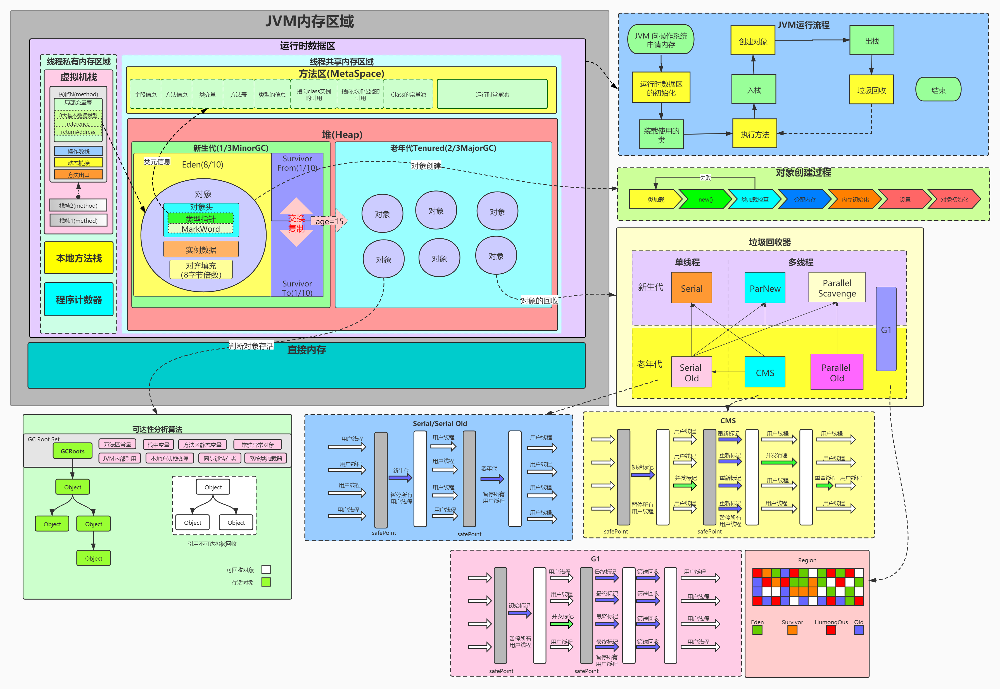
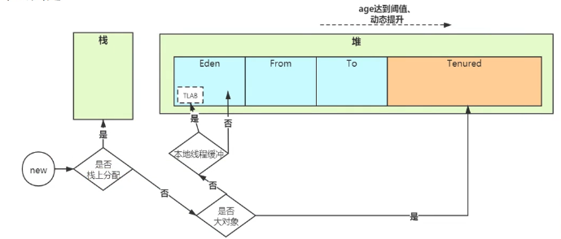
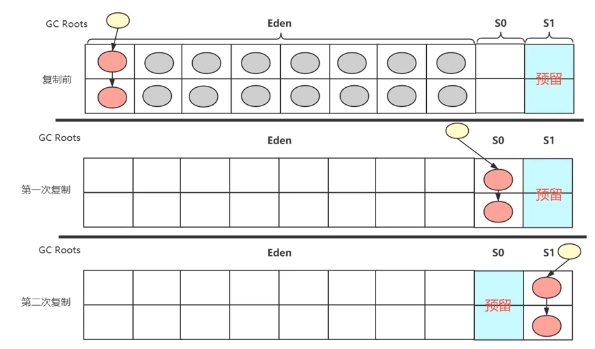
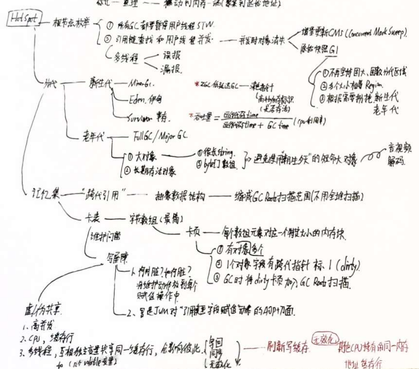

# 自动内存管理

[toc]

## 内存区域

### 方法区
1、方法区
1. 线程共享
2. 存放JVM已经加载的：类型信息、静态变量、常量、JIT编译后的代码缓存
3. 回收：常量池回收、对类型卸载

2、运行时常量池
1. 类加载后会将class文件中常量池的内容放入
2. 三类数据：字面量、符号引用、直接引用

3、符号引用有哪些？
1. 类和接口的名称
2. 字段名称和描述符
3. 方法名称和描述符
4. 方法句柄和方法类型
5. 动态调用点和动态常量

3、具有动态性：String的intern方法
1. 返回常量池中对应的引用，不存在就新建放入常量池，再返回

### 堆
2、堆
1. 最大区域
2. 存放：对象实例、数组、字符串常量池
3. OOM：堆无法扩展时      ======================> 多进程

2、为什么要年龄划分？
1. 为了更好的分配和回收
1. 新生代、老年代、Eden空间、永久代知识GC技术的具体实现    =====> CMS

3、堆的GC涉及到新生代（Eden、Surviovr）和老年代

### 虚拟机栈
1、虚拟机栈是什么？
1. 线程私有，和线程生命周期同步
2. 具有OOM和StackOverflow异常
3. 描述的是Java方法执行的线程内存模型，每个方法执行，代表栈帧入栈和出栈的过程

2、栈帧StackFrame里面是什么？
1. 局部变量表
2. 操作数栈
3. 动态链接 => 1.静态解析（符号-直接） 2.动态链接 3.静态分派
4. 方法出口

3、局部变量表存放的是什么？
1. 基本数据类型-存储单位是slot
2. 对象引用
3. returnAddress 废弃，异常表处理替代跳转指令

4、压缩指针是什么？
1. 64位指针压缩为32位，占据4byte，节省4byte

### 本地方法栈
1. 面向Natiev方法
2. 会OOM和StackOverflow
3. HotSpot将两个栈合二为一

### PC寄存器
1、PC
1. 当前字节码指令的行号指示器 => 所有流程控制（操作）都依赖PC
2. 字节码解释器通过改变PC值，来获取下一个指令
3. 线程私有
4. 较小内存空间，是JVM中唯一没有OOM的区域
5. 线程执行 Java方法时：PC值为JMV字节码指令的地址。
6. 线程执行 Native方法时：为空

### 直接内存

1、直接内存是什么？
1. 不是JVM规范中的一部分，也不是运行时数据区的一部分
2. JDK 1.4引入NIO，引入了基于Channel和缓冲区的IO方式
3. 可以通过unsafe相关API直接分配堆外内存，通过Java堆的DirectByteBuffer对这块内存进行操作
4. 性能：一定场景，可以避免Native堆和Java堆来回复制数据
5. 不受JVM大小限制，收到物理内存大小限制

## 对象

1、对象内存布局
1. 对象头：Markword、类型指针、数组元素长度
2. 实例数据：各种类型字段的数据
3. 对齐填充：占位符，对象起始地址需要是8byte的整数倍（大量实验和理论结果）

2、Markword
1. 8byte
2. 包含：hashcode、分代年龄、偏向线程ID、偏向锁、锁状态

3、类型指针：指向类型元数据（方法区）

### 创建

#### 五种方式

1、Java创建对象的五种方式
1. new
1. 反射
1. 反序列化
1. 深拷贝
1. Object.allocate 不会调用构造方法

2、什么场景下会有new指令
1. new关键字创建对象
2. 对象克隆
3. 对象序列化

#### 流程

1、对象创建流程
1. 类加载检查：
    > new指令，先检查其参数，是否可以在常量池中定位到一个类的符号引用，并检查符号引用对应的类是否已经被加载、链接、初始化。如果没有走类加载流程
2. 分配内存空间：
    > 1.大小在类加载阶段确定
    >2.堆空间分配需要同步，避免剐蹭
    >3.方法有：TLAB或者指针碰撞用CAS+失败重试机制
3. 初始化零值：内存空间都设置为0，等效于成员变量都设置为零值
4. 设置对象头：将信息放入对象头。类构造方法clinit是在类加载流程的初始化阶段完成的
    > Markwork、类型引用、对齐 ===> 对象头
5. init实例初始化 ===> invokespecial
    > 1.创建后，执行class文件的init方法。（由new指令后是否有invokespecial指令决定，程序中new关键字会同时生成该两条指令）
6. 引用赋值

2、对象创建流程中，new指令对应于1，2，3，4

3、volatile，在对象创建流程中，123456步骤上下会插入monitorEnter和monitorExit？

##### 检查加载

常量池：符号引用 sun.misc.B
A引用了B，B还没有加载，就用符号引用去代表B。
使用时：符号引用 -> 直接引用

##### 分配内存

1、分配内存的方法：
指针碰撞：根据需要大小，指针往后移动。要求堆中空间规整。
空闲列表：堆中有碎片，用列表去记录。会需要查表。

2、并发安全问题：
CAS + 失败重试：无锁化、乐观锁。
【单核】CPU指令具有原子性。
【多核】加lock指令保证原子性。 
【默认】TLAB：线程本地分配缓存
在Eden分配1%区域给每个线程TLAB，空间换时间。

3、父类的private字段，以及父类被隐藏的实例字段，都会分配内存

### 内存布局（对象头、实例数据、对齐）

1、对象的内部结构
1. 对象头 8+8=16byte
2. 实例数据(Data1、Data2)
3. Padding

2、压缩指针：12byte

#### 对象头
1、对象头组成部分 8+8=16byte
1. MarkWord 8
2. 类型元数据指针 8
3. 数组对象长度

2、对象头的MarkWord包含哪些数据？
1. 偏向锁、偏向线程ID、锁状态、 ====> 锁升级
2. hashcode
3. 分代年龄 ===> GC

3、Markword在不同锁状态下的内容
||||||
|---|---|---|---|---|
|无锁|hashcode|对象分代年龄|0|01|
|偏向锁|thread id|对象分代年龄|1|01|
|轻量级锁|指向栈中LockRecord的指针|||00|
|重量级锁|指向重量级锁的指针|||10|
|GC||||11|

4、为什么起始地址需要是8字节的整数倍？
1. 实验出的寻址最优解（硬件级别大量实验）

5、如何打印对象的内部组成？
> ClassLayout.parseInstance(user).toPrintable()

6、字节序
1. 大端字节序：高位字节在低地址，方便人类阅读，网络传输 ==================>
2. 小端字节序：低位字节在低地址，计算机效率高 ====> MMKV

===> HashMap浪费空间

### 内存对齐
1. 对象：偶地址CPU取数据只需要一次
2. 字段：
   1. 字段只在CPU同一缓存行，不然可能1个字段跨缓存行
   2. 字段读取需要替换两个缓存行
   3. 字段存储需要脏两个缓存行
@contented 不虚共享，但会影响字段重排序

### 访问（句柄访问、直接访问）

#### 句柄访问

1. Java本地变量表有reference引用指向句柄池。

2. Java堆中有句柄池，有两种指针，指向对象实例和方法区的类型元数据
多一次间接访问的开销。

3. Java堆中句柄池，2个指针指向实例和方法区中类型数据。
好处：替换对象实例。对GC也有好处（不需要更新线程里面的东西，只需要更新句柄池）
坏处：二次转换。

#### 直接访问
1. refrence指向堆中对象，对象有类型指针，指向方法区。
2. HotSpot：栈帧->java堆->方法区类型数据

## GC/垃圾回收

1、传统c、c++的垃圾回收
1. C malloc free
2. C++ new delete

2、多线程有各种问题：多回收

### 基本概念

#### 引用计数法

1、引用计数法有什么问题？
1. 循环引用

2、Python中使用。遇到循环引用怎么处理？额外启动一个线程来处理。

#### 可达性分析

1、Roots = RootSet 集合 Set
GC Roots GC根集合

2、GC Root有哪些？
1. 方法区中静态变量
    > static final Looper sMainLooper;
1. 方法区中常量
1. 线程栈帧中局部变量
1. JNI，native方法中的变量
1. 内部引用：class对象、异常对象、类加载器
1. 同步锁持有者
1. 临时对象：跨代引用
1. *内部对象：JMXBean（Android不用）、本地缓存之类的

#### class对象回收

1、class对象如何被回收？
1. class new出的所有对象都被回收
1. 对应类加载器被回收
1. 类，Java.lang.class对象，任何地方没有被引用
1. 无法通过反射调用这个类的方法

2、参数控制：禁用类的垃圾回收，需要关闭

3、类型卸载在什么场景下需要考虑？
1. 反射
1. 动态代理等频繁自定义类加载器的场景中，需要考虑

#### finalizer

1、finalizer是什么？
1. 链路断了用于拯救对象
1. 优先级低
1. 第二次GC，不执行了（没办法拯救了）

2、Finalize有对应对象，放入栈中，额外开一个线程去处理。因此优先级低。

#### 引用

1、引用有哪些？
强：= new

软：内存不足时回收，实际上有根据剩余堆内存计算一个延迟，时间到了后会回收。
> 用于图片缓存。

弱：下一次GC处理。
>Handler等内存泄漏场景。
 
虚：随时被回收。无法直接引用，有一个对象队列，就是用于处理虚引用无法访问对象的工作。

2、虚引用有什么用？
1. 用于判断垃圾回收器是否正常，GC作为一个线程，也可能阻塞出错。如果虚引用可以回收JVM可以判断出还在正常工作。
1. ByteBuffer申请DirectByteBuffer，里面也会创建Cleaner用于清理，Cleaner本身extends 虚引用（自己直接unsafe去申请，可能会内存泄漏）

3、分代回收理论
1. 新生代和老年代组成了堆。新生代1/3，老年代(Tenured)2/3
1. 新生代：Eden、from(S1)、to(S2) = 8:1:1
1. Full GC包含Minor GC + Major GC + 方法区GC

#### 对象的分配策略

1、对象的分配策略
1. 优先Eden分配
1. 空间分配担保
1. 大对象直接进入老年代
1. 长期存活对象进入老年代
1. 动态对象年龄判断

2、对象创建分配空间的流程
1. 判断是否栈上分配
1. 判断是否是大对象：大对象直接在老年代。
1. 否：判断是否是TLAB
1. 否：Eden分配，是：TLAB分配

  

3、大对象如何进入老年代
1. 大于参数指定大小
1. 垃圾回收期需要指定是Seral和Parnew才生效

##### 动态年龄判断

1、年龄判断阈值是15, 并不是严格遵守
1. From区域达到10MB大小的时候
1. 所有年龄按照从小到大排到1/2时，就会晋级老年代，不严格遵守阈值

##### 空间分配担保

1、Minjor/Young GC时，老年代放不下怎么办？
1. 需要Major/Old GC后确保有空间，再进行Minor GC

2、空间分配担保
1. 是指只要不超过一个限定值，尽量往老年代里面去放，超过了就先FULL GC
1. 会根据历次统计的老年代回收释放的空间（比如平均10MB），只要放的东西不超过10MB也不会触发Full GC

### 垃圾回收算法

#### 标记-复制

1、是什么：
1. 预留一半空间，存活对象复制到to空间，将from空间整个格式化
1. 交换from和to
1. 适合新生代：存活的对象少，copy数量少。将from survivor和eden区域中对象copy到to survivor区域中。

2、优点：
1. 实现简单，高效，符合二八原则，80%的对象朝生夕死。
1. 没有碎片，分配可以用指针碰撞

##### Appel式回收（加强版本）

1. 空间利用率高90%
1. 交换区to survivor中的对象，来源于从Eden区域复制而来的，也可以来源于从上次交换的from Survivor区域来的。

  

#### 标记-清除

1、标记-清除算法
1. 会有碎片
1. 可以不暂停

2、为什么可以不暂停？
1. 存活的对象，位置没有改变，引用没有改变，可以继续使用这些对象

#### 标记-整理

1、标记整理
1. 用于老年代的回收
1. 前提：对象存活多
1. 方法：阶段一，从GC ROOT标记哪些对象是被对象引用的；阶段二，将所有存活的对象压缩移动到内存的另一端。阶段三，清除所有边界以外的空间。
1. 没有碎片
1. 指针需要移动（需要STW）

2、可以理解为：标记-整理-清除算法
1. 整体性进行清除，效率更高

#### 三色标记算法

1、三色标记原理
1. 所有对象标记为白色
1. 将GC Root可以直接访问到的对象，标记为灰色。
1. 遍历灰色节点可以直接访问的节点，都标记为灰色，自身标记为黑色
1. 层层遍历，就像广度遍历算法一样。最终剩下黑色（存活）、白色（需要释放）

### GC和并发

  

1、GC在多线程中会有问题
1. 误报
1. 漏报

2、并发时对象消失问题，解决办法
1. 增量更新 CMS （Concurrent Mark Sweep）
1. Android就是用 CMS

3、分代
1. 新生代（Eden、Survivor）
1. 老年代（Tenured）

4、老年代
1. 大对象：很长String、byte[]数组， 避免使用招生熄灭的短命大对象
1. 长期存活对象

#### 记忆集

1、记忆集是什么？
1. 用于解决“跨代引用”问题的抽象数据结构，缩短GC扫描范围（不用全堆扫描）

2、卡表是什么？
1. 是记忆集的实现方式
1. 可以用byte数组实现（最简单）
1. 每个数组元素，对应于一个卡页（卡页是一个特定大小的内存块）

3、卡页是什么？
1. 可以有多个对象
1. 一个对象字段有跨代指针，在卡表中标记为1时，代表dirty
1. GC时将dirty卡页，加入到GC Roots扫描

##### 写屏障

1、卡表的维护涉及到并发问题
1. 何时变脏？如何变脏？
1. 将维护动作放到每个赋值操作中

##### 伪共享/虚共享

1. 高并发场景下
1. CPU具有缓存行
1. 多线程，互相独立变量，共享同一个缓存行

1. 会影响彼此的：写回、同步、无效化

1. 刷新写缓存，会导致，无效化其他CPU持有的同一内存地址的缓存行  

### 安全点

1、安全点是什么？
1. 为了让程序到一个稳定的状态，并不一定是停止执行
1. 如果堆栈不再会发生改变，就可以认为是一个安全点

2、安全点的检测（ART）
1. 编译器：每个字节码指令间
1. JIT：方法调用、方法返回、循环跳转（非计数回边处）
1. 异常处理：前后
1. 线程：创建和销毁处

3、循环（HotSpot）
1. int，可数循环，无安全点，单次耗时影响GC
1. long，不可数循环，有安全点

=============================> 性能优化：int循环，做计算等耗时操作，不能有方法调用。

程序的总体时间Time：类加载T1 + 用户程序T2 + JIT T3 + GC T4
1. T1 T2启动时
2. T4 长期

### 垃圾回收器

1、Serial是最悠久、最基础的收集器。1个线程，新生代 复制，老年代 整理。

2、Parallel，多线程，用户线程停顿时间在持续缩短，不能消除。
1. 控制在10~100ms

3、CMS：第一个真正支持并发的
1. Concurrent Mark Sweep(标记-清除)

4、G1
1. 不再坚持固定大小和固定数量的分代区域划分
1. 把连续Java堆划分为多个大小相等的独立区域Region => 堆内存布局
1. 每个区域根据需要扮演新生代、老年代

5、ZGC
1. 低延迟垃圾收集器
1. 采用染色指针
1. 指针中高四位存储四个标识信息

