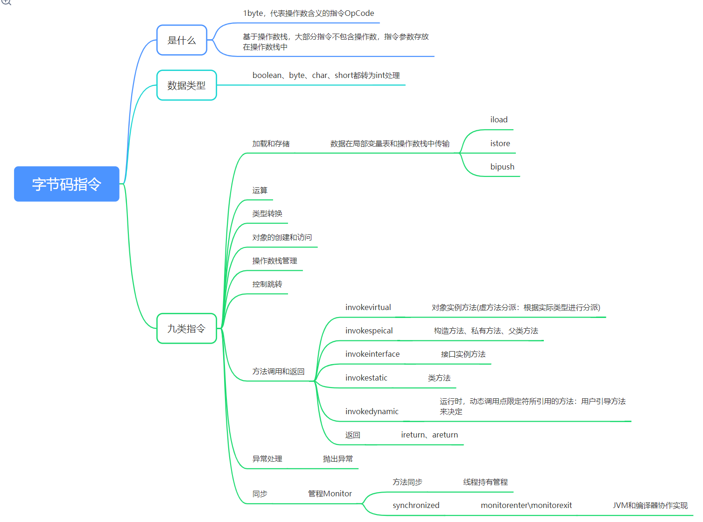

# 字节码指令
  

有道云笔记链接：https://note.youdao.com/s/3V3P2jf1

1、字节码指令是什么？
1. 代表操作数含义的指令
1. OpCode
1. 1byte

2、字节码指令和相应的结构
1. 一般基于操作数栈
1. 指令不懈怠操作数
1. 操作数在操作数栈中

3、字节码指令中基本数据类型
1. boolean、byte、char、short都会转为int

4、九大类指令
1. 加载和存储（数据在操作数栈和局部变量表传输）
1. 类型转换
1. 对象创建和访问
1. 操作数栈管理
1. 运算
1. 方法调用和返回（invokeVirtual、invokeSpecial、invokeInterface、invokeStatic、invokedaynamic）
1. 异常处理
1. 控制跳转
1. 同步（JVM和编译器共同实现）

5、invokevirtual：对象方法（虚方法分派：根据实际类型进行分派）
6、invokeSpecial：构造方法、私有方法、父类方法
7、invokeinterface：接口实例方法
8、invokeStatic：类方法
9、invokedynamic：运行时动态调用点限定符所引用的方法