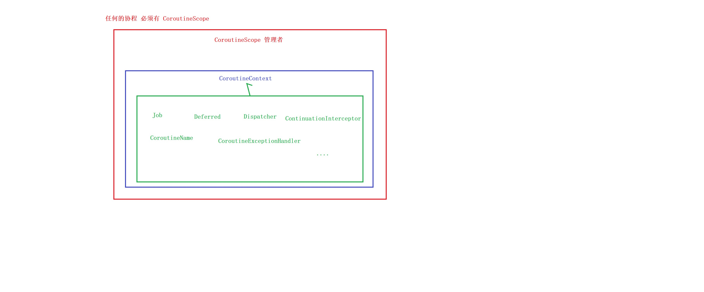
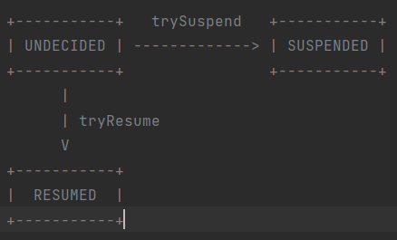
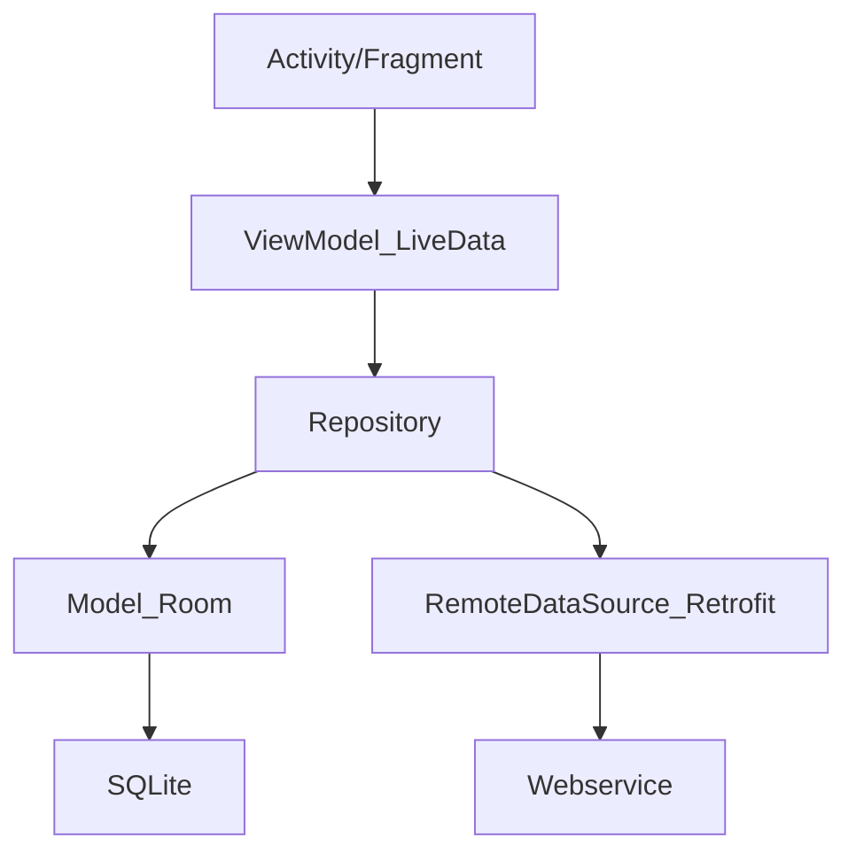

[TOC]

# Kotlin协程

本文链接：https://blog.csdn.net/feather_wch/article/details/132200864

[toc]

----
总结：启动、流程、现成选择、启动模式、并发
、原理、结构化并发、调度中心协程作用域、上下文、异常、Flow（背压）、热流

## 协程：基本概念

### 线程和协程

1、线程和协程的区别关系
1. 线程是操作系统调度的，涉及上下文切换
1. 协程是语言层面的，可以在线程间自由切换
1. 线程：资源有限，数量有限，线程池~200个线程，上下文切换损耗大
1. 协程：一个几百byte到几KB，可以存在数十万个协程，切换损耗小。

2、kotlin在不同语言中的区别
1. 有的语言协程可以脱离线程执行
1. Kotlin中不可以脱离线程，可以在线程间自由切换

3、协程真正的优点：(只是高效，轻量为什么不用Rxjava)？
1. 最大程度简化异步并发任务，用同步的代码写出异步的效果
1. 网络请求谁都能做

### 传统异步任务和协程对比

1、网络请求返回数据，为什么多1个包装类（中间层）?
1. 测试环境 登录返回{data:{}}，正式服务器返回了{data\:null}就会crash
1. 任何疑难杂症都可以用中间层

#### 传统细节

2、传统异步任务的执行流程
1.  thread->Retrofit->请求->返回值->Handler去处理
2.  弊端：代码很乱违背了人类的串行思维

#### Kotlin协程

```kotlin
    /***
     * 委托给CoroutineScope，但是没有实现，交给MainScpoe去实现。就拥有this
     */
    class MainActivity6 : AppCompatActivity() , CoroutineScope by MainScope()

    	launch(){} // 直接调用

        override fun onDestroy() {
            super.onDestroy()
            cancel() // 手动取消
        }

```


```kotlin
// 挂起函数，retrofit高级版本自动加判断会切线程。2.7+
suspend fun loginActionCoroutine()

```

1、kotlin协程的特点
1. 异步线程切换主线程不需要自己管了，挂起会去执行异步操作，操作完成后恢复主线程。

2、Retrofit关于协程的特殊处理
1. 是Retrofit看到suspend会切换到IO异步线程去处理，操作完成后恢复到原线程（原来是UI线程就是UI线程）


### Retrofit和协程

1. rxjava2.6遇到suspend关键字会自动切换到io线程（默认）
1. 主动在主线程，做耗时操作。也没事


### 挂起和恢复

协程：可以做到一行代码，两次线程切换。代码块线程到异步线程，异步线程到代码块线程。

挂起：暂停，挂起当前线程。保存当前协程局部信息。用于恢复
恢复：从协程挂起点恢复。

阻塞和挂起的区别
1. 阻塞后整个线程就进入了timed waiting状态
1. 阻塞再次点击会导致anr
2. 挂起的时候，线程还可以做其他事情。
2. 挂起不会导致anr


阻塞：类似安检的时候睡觉
挂起：类似安检的时候站到一边去

### 协程的层级：语言基础层，官方框架层
1. 语言基础：kotlin包，提供最基础api
2. 框架层：kotlinx，协程框架


#### 官方框架层

官方框架层 写需求：
```kotlin
GlobalScope.launch{
    
}
```

#### 语言基础层
语言基础层 写需求：
```kotlin
        // 1、协程体
        val suspendFun: suspend ()-> Float = suspend{
            delay(10000)
            123.456f
        }

        // 2、协程体执行结果交给Continuation
        //    最底层还是回调
        val continuation = suspendFun.createCoroutine(object: Continuation<Float>{
            override val context: CoroutineContext
                get() = Dispatchers.Main // 恢复后的线程

            override fun resumeWith(result: Result<Float>) {
                println(result) // 回调后执行 //操作result，可以打印
            }

        })

        // 3、协程体的管理者，激活，协程体的执行
        continuation.resume(Unit)
        // 底层
        // continuation.resumeWith(Result.success(value))
```

2、回调的Continuation和返回的Continuation的区别
1. 前者：协程体完成的回调，根据CoroutineContext选择恢复后执行的线程，执行resume()
1. 后者：协程体的管理者，管理者不resume不会激活，协程体的执行。
1. z协程体管理者触发协程体执行，协程体执行的结果会交给Continuation。


3、回调的Continuation内部实现
1. 用SafeContinuation =====> 包装模式

### 解决传统开发痛点

#### 多层回调

银行APP痛点，为了安全，一个账号登录需要顺序查询五六个接口。

Retrofit可以线程切换，就是发现suspend关键字后，会调用
```kotlin
    withContext(Dispatchers.IO) {
    }
```

进行线程切换

如果有多个请求的结果需要合并怎么办？

> 1. Select选择器
> 1. async()+await()

### 打印协程名称
VMOptions：
```
-Dkotlinx.coroutines.debug=on
```
```kotlin
println("${Thread.currentThread().name}")
```
```
main的第一行代码 main @coroutine#1
launch main @coroutine#2
async main @coroutine#3
launch2 main @coroutine#2
async2 main @coroutine#3
获取到网络数据JSON
main的第二行代码 main @coroutine#1
```

### 再次！深入探究

1、协程和协程框架的区别
1. 协程：async、launch...创建的协程概念，使用的API
1. 协程框架：基于协程的概念，研发的框架，kotlinx.coroutines(github十万行源码)
1. 平台层：js、jvm、native，平台层用不同方式支持协程

2、kotlinx.coroutines.android支持Android相关的操作

3、协程，在JVM层面，是线程的封装框架。
1. 广义上的协程，不依赖线程。
1. kotlin的是依赖的

4、协程没有Dispatchers的时候，默认使用当前线程。

5、使用EmptyCoroutineContext，使用当前的线程的调度器`context: CoroutineContext = EmptyCoroutineContext`

## 协程：启动

### launch
```kotlin
  // Job
  var job = launch {
    println("launch")
    delay(2000)
  }
  job.join() // 会等待launch执行完成
```

* launch返回的是Job
```kotlin
public interface Job : CoroutineContext.Element
public interface Element : CoroutineContext
```


### async
获取到返回值
```kotlin
  // Deferred<T>
  var deferred = async {
    println("async")
    delay(5000)
    "获取到网络数据JSON"
  }
  println(deferred.await())
```

3、launch和async都会立即调度
1. await只是拿返回值


* aysnc返回的是Deferred
```kotlin
public interface Deferred<out T> : Job
```

### withContext

### Thread.sleep

1. 会阻塞整个线程，使用launch也没用。
1. 协程不要用Thread.sleep


2、执行顺序
1. GlobalScope.launch默认是Dispachers.DEFAULT 另一个线程
1. Thread.sleep只能阻塞所属线程
```kotlin
fun main() = runBlocking <Unit> {
    println("main 111") // 1     【执行顺序1】

    // GlobalScope.launch默认是Dispachers.DEFAULT 另一个线程
    val job = GlobalScope.launch {     // 协程体被创建【执行顺序2】
        println("launch 1 start") // 3  【执行顺序5】
        delay(1000L)   // 【执行顺序6】
        println("launch 1 end")
    }

    println("main 222") // 2   【执行顺序3】
    Thread.sleep(500L) // 阻塞当前runBlocking作用域所属的线程   【执行顺序4】
}
输出：
main 111
main 222
launch 1 start
```

### delay

1. 会挂起，不会阻塞外面的代码
1. 并行执行的协程，打印的顺序无法决定执行的顺序，日志同时打印，也还是会按顺序打印的（随机，可前可后）


## 协程：流程控制
### join
1. join会挂起当前协程体，并等待目标协程体执行完成
2. join必须在协程体内使用
3. 非阻塞
```kotlin
  var job1 = launch {
    requestUserName()
  }
  job1.join() // 挂起当前协程体，非阻塞
  var job2 = launch {
    requestUserInfo()
  }
  job2.join()
  println("查询结束")
```
====> 线程的join
1、线程的join会阻塞当前线程
2、join会不会释放锁？
1. 会释放线程锁(thread对象)，不会释放对象锁 
2. 底层是wait实现的
```java
synchronized(obj){
  thread.join(); //join不释放锁
}
synchronized(thread){
  thread.join(); //join释放锁
}
```
3、yield()让出cpu执行权，不会释放锁
4、park()会释放锁，并等待唤醒
5、sleep()阻塞，不会释放锁
#### 控制顺序
任务按顺序执行：
```kotlin
协程体1
协程体1.join()
协程体2
协程体2.join()
协程体3
协程体3.join()
```
任务并发执行：
```
协程体1
协程体2
协程体3
协程体1.join()
协程体2.join()
协程体3.join()
```
### await
挂起等待协程体的返回值：
```kotlin
  var deferred = async {
    println("async")
    requestUserName()
  }
  println(deferred.await())
```
### measureTimeMillis：执行时间 
1. 获取到总共的执行时间
2. 时间是并发执行的时间（500ms），不是顺序执行（500+500）
```kotlin
  var deferred1 = async {
    println("async")
    requestUserName()
  }
  var deferred2 = async {
    println("async")
    requestUserName()
  }
  val time = measureTimeMillis {
    deferred1.await()
    deferred2.await()
  }
  println(time)
```
```kotlin
public inline fun measureTimeMillis(block: () -> Unit): Long {
  val start = System.currentTimeMillis()
  block() // 执行前后计算时间点
  return System.currentTimeMillis() - start
}
```

### yield

1、yield让出执行权
```kotlin
    // 子协程
    val result = supervisorScope {
        launch {
            println("launch1 start ...")
            delay(1000)
            throw KotlinNullPointerException("协程1 一秒后 抛出异常")
        }
        println("supervisorScope run ")
        yield()
        delay(500) // or delay(1500)
        println("supervisorScope run end")
    }
```
1. 即使让出执行权，谁delay的时间最短，谁就会先恢复执行
1. 时间都相等时，让执行权的协程，后执行
```kotlin
    // 子协程
    val result = supervisorScope {
        launch {
            println("执行顺序2")
            delay(1000)
            println("执行顺序3")
        }
        println("执行顺序1")
        yield()
        delay(1000)
        println("执行顺序4")
    }
```


## 协程：线程选择


GlobalScope.launch()采用默认default异步线程。

Dispatcher.Main：是安卓调度器 UI交互的轻量级任务，更新livedata
Default：适合cpu密集型（计算等）核心线程数+1（防止页缺失）数组排序，json大量解析等等
IO：为磁盘和网络IO处理。核心线程数x2


## 协程：启动模式

### 调度中心


1、调度前
1. 在遇到挂起方法前的代码都属于调度前
2. 调度前代码一定在协程体内代码执行前执行


### 启动模式

1、协程有哪些启动模式？
1. CoroutineStart.DEFAULT
1. CoroutineStart.ATOMIC
1. CoroutineStart.UNDISPATCHED
1. CoroutineStart.LAZY

2、默认有启动模式：DEFAULT
```kotlin
launch(/*start = CoroutineStart.DEFAULT*/) {  // 默认参数
  delay(200)
}
// 调度时
DEFAULT -> block.startCoroutineCancellable(completion)
```

3、执行顺序(1)
```kotlin
    println("main start thread:${Thread.currentThread().name}")

    // TODO 画图 让大家理解 调度中心 的 图概念 脑海里面有自己图
    launch /*(start = CoroutineStart.DEFAULT)*/ { // 子协程
        println("launch start thread:${Thread.currentThread().name}")
        withContext(Dispatchers.Default) {
            println("withContext start thread:${Thread.currentThread().name}")
            delay(10000)
        }
        println("launch end thread:${Thread.currentThread().name}")
    }

```
```
main start thread:main
launch start thread:main
withContext start thread:DefaultDispatcher-worker-1
======等待10000ms=========
launch end thread:main
```

**下面关于原理的讨论源于：context: CoroutineContext = EmptyCoroutineContext**

* Dispatchers.IO、DEFAULT等异步情况下，不适用

#### 默认模式和取消协程

1、执行顺序(2)
1. 调度前取消：进入“协程取消响应状态”，协程不会再调度执行
1. 调度后取消：进入“协程取消响应状态”，在下个挂起点，结束协程（不到一定不结束）
```kotlin
    // TODO Default启动模式：协程体被创建后，协程立即开始调度，在调度前 协程被取消，协程会进入"协程取消响应状态" 然后才会取消协程
    val job = launch (start = CoroutineStart.DEFAULT) {
        // 再调度后（协程执行阶段）
        println("launch 再调度后（协程执行阶段）>>>1") // 后输出
        println("launch 再调度后（协程执行阶段）>>>2")
        println("launch 再调度后（协程执行阶段）>>>3")
        println("launch 再调度后（协程执行阶段）>>>4")
        println("launch 再调度后（协程执行阶段）>>>5")

        delay(1000 * 10)
        println("launch 再调度后（协程执行阶段）全部结束<<<<")
    }

    // 调度前（先有调度的准备阶段）
    println("协程立即开始调度中.") // 先输出
    println("协程立即开始调度中..")
    println("协程立即开始调度中...")
    println("协程立即开始调度中....")
    println("协程立即开始调度中.....")
    // println("协程立即开始调度中...... 取消协程:${job.cancel()}")
    delay(0) // 调度前结束，1调度后结束
    println("协程立即开始调度中...... 取消协程:${job.cancel()}")
```

#### ATOMIC


1、执行顺序
1. 调度前被取消，在协程第一个挂起点才会取消
1. 适合做必须做的工作，比如网络埋点、业务埋点
```kotlin
    // TODO ATOMIC启动模式：协程体被创建后，协程立即开始调度，在调度前 协程被取消， 协程体里面会不响应取消的状态(不理你) 直到第一个挂起点（才理你）才能取消
    val job = launch (start = CoroutineStart.ATOMIC) {
        // 再调度后（协程执行阶段）
        println("launch 再调度后（协程执行阶段）>>>1") // 后输出
        println("launch 再调度后（协程执行阶段）>>>2")
        println("launch 再调度后（协程执行阶段）>>>3")
        println("launch 再调度后（协程执行阶段）>>>4")
        println("launch 再调度后（协程执行阶段）>>>5")
        println("launch 再调度后（协程执行阶段）>>>6")
        println("launch 再调度后（协程执行阶段）>>>7")
        println("launch 再调度后（协程执行阶段）>>>8")
        println("launch 再调度后（协程执行阶段）>>>9")
        println("网络请求 必须做的工作，哪怕是被取消cancel，也要做的工作，请求的网络埋点，笔记埋点请求的信息 上报给服务器 ...")
        // ... 不管你 cancel 不 cancel，这个工作一定会执行

        // 打个比方：下面代码是 网络请求 耗时
        delay(1000 * 10) // 第一个挂起点，才是取消状态响应中，然后取消，所以下面不会输出
        println("launch 再调度后（协程执行阶段）全部结束<<<<")
    }

    // 调度前（先有调度的准备阶段）
    println("协程立即开始调度中.") // 先输出
    println("协程立即开始调度中..")
    println("协程立即开始调度中...")
    println("协程立即开始调度中....")
    println("协程立即开始调度中.....")
    println("协程立即开始调度中...... 取消协程:${job.cancel()}")
```

#### Lazy

1. LAZY需要手动调度：job.start()-非挂起，手动调度
1. job.join()-会挂起，手动调度
1. async的用await-会挂起，手动调度
```kotlin
    // TODO LAZY启动模式：协程体被创建后，不会调度，会一直等 我们来手动调度（start非挂起，join挂起，await挂起），才开始调度，
    //  在调度前 协程被取消，协程会进入"协程取消响应状态" 然后才会取消协程 == Default模式
    val job = launch (start = CoroutineStart.LAZY) {
        // 再调度后（协程执行阶段）
        println("launch 再调度后（协程执行阶段）>>>1") // 后输出
        println("launch 再调度后（协程执行阶段）>>>2")
        println("launch 再调度后（协程执行阶段）>>>3")
        println("launch 再调度后（协程执行阶段）>>>4")
        println("launch 再调度后（协程执行阶段）>>>5")
        println("launch 再调度后（协程执行阶段）>>>6")
        println("launch 再调度后（协程执行阶段）>>>7")
        println("launch 再调度后（协程执行阶段）>>>8")
        println("launch 再调度后（协程执行阶段）>>>9")

        delay(1000 * 10)
        println("launch 再调度后（协程执行阶段）全部结束<<<<")
    }

    job.start()    // 最常用的 （非挂起）  【手动调度】
    // job.join() // 【手动调度】
    // async{}.await // 【手动调度】

    // 调度前（先有调度的准备阶段）
    println("协程立即开始调度中.") // 先输出
    println("协程立即开始调度中..")
    println("协程立即开始调度中...")
    println("协程立即开始调度中....")
    println("协程立即开始调度中.....")
    delay(0)
    println("协程立即开始调度中...... 取消协程:${job.cancel()}")
```

#### UNDISPATCHED

1、执行流程
1. 立即执行，没有调度，也就没有调度前
1. job.cancel(): 可以取消delay
```kotlin
    // TODO UNDISPATCHED启动模式：协程体被创建后，（立即 在当前调用栈线程中 执行），没有调度，  协程体里面{一直执行到  第一个挂起点， 然后再执行 父协程的代码}
    // 此模式，协程体被创建后，立即执行，没有调度，既然这么快，请问这个协程是依附在哪个线程呢？
    val job = launch (context = Dispatchers.IO, start = CoroutineStart.UNDISPATCHED) {
        println("launch UNDISPATCHED 立即执行，没有调度 （协程执行阶段）>>>1") // 后输出
        println("launch UNDISPATCHED 立即执行，没有调度（协程执行阶段）>>>2 thread:${Thread.currentThread().name}")
        println("launch UNDISPATCHED 立即执行，没有调度（协程执行阶段）>>>3")
        println("launch UNDISPATCHED 立即执行，没有调度（协程执行阶段）>>>4")
        println("launch UNDISPATCHED 立即执行，没有调度（协程执行阶段）>>>5")
        println("launch UNDISPATCHED 立即执行，没有调度（协程执行阶段）>>>6")
        println("launch UNDISPATCHED 立即执行，没有调度（协程执行阶段）>>>7")
        println("launch UNDISPATCHED 立即执行，没有调度（协程执行阶段）>>>8")
        println("launch UNDISPATCHED 立即执行，没有调度（协程执行阶段）>>>9")

        // 这个就是第一个挂起点
        delay(1000 * 10)
        println("launch 再调度后（协程执行阶段）全部结束<<<<")
    }

    // UNDISPATCHED 没有调度前
    println("UNDISPATCHED 没有调度前.") // 先输出
    println("UNDISPATCHED 没有调度前..")
    println("UNDISPATCHED 没有调度前...")
    println("UNDISPATCHED 没有调度前....")
    println("UNDISPATCHED 没有调度前.....")
    println("UNDISPATCHED 没有调度前...... 取消协程:${job.cancel()}") // 只能取消 delay(1000 * 10)

```

## 协程：结构化并发

### CoroutineScope

1、协程会面临的问题：
1. 某个协程任务出现了丢失和无法管理，会浪费内存。


2、协程任务的不可控 出现了【结构化并发】-CoroutineScope
1. 可取消协程，比线程好
2. 任务状态可以追踪
3. 出现了异常，可以发送信息

3、所有协程体都有CoroutineScope有什么用？
1. 会追踪所有协程
2. 可以取消所有管理的协程


4、launch最后一次参数给CoroutineScope增加了匿名扩展函数

5、withContext也有sc才能管理

CoroutineScope常见子类：
1. GlobalScope: 全局\顶级\进程作用域，绑定App进程。 测试中用。
2. MainScope: Activity。onDestory可以取消协程
3. viewModelScope: 继承ViewModel自动拥有，和ViewModel生命周期自动绑定，不需关心要取消
4. lifecycleScope: 绑定Activity或者Fragment生命周期 // 用得最多

CoroutineScope内部转交给CoroutineContext

大写的方法名是什么设计模式？
1. 可以算作简单的工厂设计模式

#### 委托
```kotlin
class MainActivity: CoroutineScope by MainScope(){} // =====> 类委托
内部拥有this：可以省略
```
##### 类委托
一个类将接口的实现委托给另一个对象
MainActivity将接口CoroutineScope的实现委托给MainScope()
### CoroutineStart: 启动模式
```kotlin
public enum class CoroutineStart {
  DEFAULT,
  LAZY,
  ATOMIC,
  UNDISPATCHED;
  public operator fun <T> invoke(block: suspend () -> T, completion: Continuation<T>): Unit =
    when (this) {
      DEFAULT -> block.startCoroutineCancellable(completion)
      ATOMIC -> block.startCoroutine(completion)
      UNDISPATCHED -> block.startCoroutineUndispatched(completion)
      LAZY -> Unit // will start lazily
    }
  public operator fun <R, T> invoke(block: suspend R.() -> T, receiver: R, completion: Continuation<T>): Unit =
    when (this) {
      DEFAULT -> block.startCoroutineCancellable(receiver, completion)
      ATOMIC -> block.startCoroutine(receiver, completion)
      UNDISPATCHED -> block.startCoroutineUndispatched(receiver, completion)
      LAZY -> Unit // will start lazily
    }
  public val isLazy: Boolean get() = this === LAZY
}
```


### Job


#### 生命周期
1、Job六大生命周期
```kotlin
New:     协程体被创建
Active:   存活状态、活跃中
Canceling:  取消响应状态 => job.cancel()
->Cancelled:   已取消
Completing: 完成中
Completed:  已完成
```

2、查看job状态
```kotlin
  val job = launch {
    delay(1000)
  }
  // true false false // Active
  println("${job.isActive} ${job.isCancelled} ${job.isCompleted}")
  delay(1)
  job.cancel()
  // false true false // Cancelled
  println("${job.isActive} ${job.isCancelled} ${job.isCompleted}")
  delay(1)
  // false true true // Completed
  println("${job.isActive} ${job.isCancelled} ${job.isCompleted}")
```
* 如果没有cancel，最后完成后的状态应该是 false false true

3、job生命周期有什么用呢？
1. 结构化并发

4、传入一个已经取消的Job到协程中，会导致协程不再执行

#### invokeOnCompletion

执行完成时回调，比在join下面打印信息更专业
```kotlin
    val job = launch {
        delay(1000)
        println("Hello")
    }
    job.invokeOnCompletion {
        println("job 执行 完成")
    }
```

#### 子Job children

1、父协程Job的子协程Job列表
```kotlin
job.children
```

2、父协程会等待所有子协程执行完成

### 取消

#### cancelAndJoin

```kotlin
//取消和挂起join合并

```

#### CPU密集型运算

##### isActive

1. CPU密集型运算，遇到调度后取消，需要用isActive进行判断
1. 因为没有delay等挂起操作，不会响应Cancel事件
1. 即使调度前取消，CPU运算还是会进行一部分。
```kotlin
    var item = 0

    // Default == 每循环一次计算一次 = CPU密集型运算 = 很密集的运算工作
    val job1 = launch (context = Dispatchers.Default) {
        val start = System.currentTimeMillis()
        while (item <= Int.MAX_VALUE && isActive) {
            if (System.currentTimeMillis() > start) {
                println("while item:${item++}")
            }
        }
    }

    // 调度前 - 协程体 准备工作期
    // job1.cancel()

    // 调度后 - 协程体 执行期
    delay(50)
    job1.cancel()
```

##### ensureActive

* 对isActive()进行了封装
```kotlin
fun main() = runBlocking <Unit> {
    var item = 0

    // Default == 每循环一次计算一次 = CPU密集型运算 = 很密集的运算工作
    val job1 = launch (context = Dispatchers.Default) {
        val start = System.currentTimeMillis()
        while (item <= Int.MAX_VALUE) {
            ensureActive()
            if (System.currentTimeMillis() > start) {
                println("while item:${item++}")
            }
        }
    }

    // 调度前 - 协程体 准备工作期
    // job1.cancel()

    // 调度后 - 协程体 执行期
    delay(50)
    /*job1.cancel()
    job1.join()*/
    job1.cancelAndJoin()

    println("最后的值 最后打印是 多少呢:$item")
}
```
```kotlin
public fun Job.ensureActive(): Unit {
    if (!isActive) throw getCancellationException()
}
```

##### yield

1、yield  =================> Java yield
1. 让出CPU资源，本质核心和Java Yield不同
    1. 先ensureActive() 检查是否已经取消了，会抛出异常`CancellactionException`
    1. 让其他协程有调度机会
1. 协程 yield，是挂起函数。 ======> 状态机，给调度的机会
```kotlin
fun main() = runBlocking <Unit> {
    var item = 0

    // Default == 每循环一次计算一次 = CPU密集型运算 = 很密集的运算工作
    val job1 = launch (context = Dispatchers.Default) {
        val start = System.currentTimeMillis()
        while (item <= Int.MAX_VALUE) {
            yield() ///// 让出资源
            if (System.currentTimeMillis() > start) {
                println("while item:${item++}")
            }
        }
    }

    delay(50)
    // job1.cancelAndJoin()
    job1.cancel()

    println("最后的值 最后打印是 多少呢:$item")
}
```

#### 资源泄露

##### 命令式
1、文件、数据库等操作的时候，直接cancel会导致，资源没办法正确关闭
> try-catch-finally中捕获

##### use

作用：出现异常时，关闭资源
```kotlin
    val job = launch {
        BufferedReader(FileReader("D:\\Derry.txt"))
            .use {
                var lineContent: String?
                while (true) {
                    delay(1000)
                    lineContent = it.readLine()
                    lineContent ?: break // 如果读取的内容是空的，就跳出循环循环
                    println(lineContent)
                }
            }
    }
    // 调度后
    delay(2000)
    job.cancel()
```
源码分析：
1. 对T扩展
1. T : Closeable?
1. 调用Close方法
```kotlin
public inline fun <T : Closeable?, R> T.use(block: (T) -> R): R {
    // 省略
    try {
        return block(this)
    } catch (e: Throwable) {
        throw e
    } finally {
        // 省略
        close()
    }
}
```

#### 无法取消

##### finally ===> Java

1、finally中的代码一定执行吗？
1. finallt中代码也会被取消 // 需要有delay()等挂起操作, 不然一直执行
```kotlin
// 需要有delay()等挂起操作
finally {
    for (i in 1..Int.MAX_VALUE) {
        println("finally i:$i")
        delay(1000L)
    }
}
```

##### NonCancellable

1. 任何不取消的代码都可以用withContext(NonCancellable)
```kotlin
// finnally中
    try {
        //
    } finally {
        withContext(NonCancellable) {
            for (i in 1..Int.MAX_VALUE) {
                println("finally i:$i")
                delay(1000L)
            }
        }
    }

// 其他地方
    val job = launch {
        withContext(NonCancellable) {
            for (i in 1..Int.MAX_VALUE) {
                println("item i:$i")
                delay(1000L)
            }
        }
    }
```

#### 超时取消

##### withTimeout
```kotlin
withTimeout(1000){
    // 超时抛出异常
}
```

##### withTimeoutOrNull
1. 超时返回最后一行String或者Null
```kotlin
    val r = withTimeoutOrNull(6000) {
        for (i in 1 .. 6) {
            println("for i:$i")
            delay(500)
        }
        "执行完成"
    }
    println("成果是: ${r ?: "执行出现问题"}")
```

## 协程：协程作用域

1. 子协程会用父协程的作用域
2. 父协程中cancel会取消所有子协程，并且抛出JobCancellationException

### 作用域构建器
结构化并发的实战：作用域构建器
#### runBlocking
1、runBlocking
```kotlin
// 线程变协程
fun main() = runBlocking<Unit> {
  // this持有了CoroutineScope
  // 就可以执行launch和aysnc
}
```
1. runBlocking不是挂起函数，为什么有协程效果？
2. lambda是挂起函数
```kotlin
@Throws(InterruptedException::class)
public fun <T> runBlocking(context: CoroutineContext = EmptyCoroutineContext, block: suspend CoroutineScope.() -> T): T {
  val currentThread = Thread.currentThread()
  val contextInterceptor = context[ContinuationInterceptor]
  val eventLoop: EventLoop?
  val newContext: CoroutineContext
  if (contextInterceptor == null) {
    eventLoop = ThreadLocalEventLoop.eventLoop
    newContext = GlobalScope.newCoroutineContext(context + eventLoop)
  } else {
    eventLoop = (contextInterceptor as? EventLoop)?.takeIf { it.shouldBeProcessedFromContext() }?: ThreadLocalEventLoop.currentOrNull()
    newContext = GlobalScope.newCoroutineContext(context)
  }
  val coroutine = BlockingCoroutine<T>(newContext, currentThread, eventLoop)
  coroutine.start(CoroutineStart.DEFAULT, coroutine, block)
  return coroutine.joinBlocking()
}
```

2、runBlocking是阻塞的，协程是非阻塞的不冲突吗？
1. runBlocking阻塞的是主线程：需要等待所有子协程完成后，才会继续
2. 协程是非阻塞的

3、结构化并发好处=>解决协程不可控
1. 可以取消
2. 可以监控追踪

#### coroutineScope()函数：一个失败全部失败
1、coroutineScope和runBlocking区别
```kotlin
fun main() = runBlocking<Unit> {
  coroutineScope { 
    
  }
}
```
1. 相同：都会等待协程体内任务全部执行完，才会结束
2. runBlocking：阻塞主线程来等待
3. coroutineScope：挂起函数
2、coroutineScope：一个失败全部失败
```kotlin
fun main() = runBlocking<Unit> {
  coroutineScope {
    launch {}
    launch {}
    launch {
      throw KotlinNullPointerException()
    }
    // 一个失败，全部失败
  }
}
```
#### supervisorScope：一个失败不会影响其他 ===> SupervisorJob

1、supervisorScope是什么？
1. 挂起函数
1. 子协程出现异常，不会影响其他子协程
1. 但是本身作用域出现异常，所有子协程都不会执行

2、返回值
1. 最后一行‘男’为返回值，result
```kotlin
    val result = supervisorScope {
        launch {
            println("launch1 start ...")
            delay(1000)
            throw KotlinNullPointerException("协程1 一秒后 抛出异常")
        }

        launch {
            println("launch5 start ...")
            delay(2300)
            println("launch5 end ...")
        }

        '男'
    }
```

3、作用域出现异常，所有子协程都不会执行
```kotlin
    // 子协程
    val result = supervisorScope {
        launch {}
        launch {}
        launch {}
        launch {}

        // 你敢在 supervisorScope {} 里面抛出异常，这个作用域里面所有的协程都会被取消
        throw KotlinNullPointerException("supervisorScope {} 里面抛出异常")
        '男'
    }
```


### CoroutineScope()函数

1、CoroutineScope()和coroutineScope()区别
1. 前者：返回CoroutineScope，大写函数名首字母：简单的工厂设计模式
2. 前者：提供了可控的结构化并发
3. 后者suspend函数：返回Unit

2、CoroutineScope构造作用域
1. 第二行日志不会打印，两个协程作用域互相独立，不会等待
2. 父协程，只会等待子协程
```kotlin
fun main() = runBlocking<Unit> {
  val scope = CoroutineScope(context = Dispatchers.Default)
  scope.launch {
    println("scope.launch")
    delay(1000)
    println("scope.launch2") // 这一行不会打印
  }
}
```

3、CoroutineScope的作用是什么？为什么所有协程体，必须有CoroutineScope?
1. 为了统一管理，可控性，结构化并发管理
```kotlin
    val derryScope = CoroutineScope(context = mDerryThread)

    derryScope.launch {
        println("launch 1 start")
        delay(1000L)
        println("launch 1 end")
    }
    derryScope.launch {
        println("launch 2 start")
        delay(1000L)
        println("launch 2 end")
    }
    derryScope.cancel() //取消
```

  


#### 统一取消协程

3、CoroutineScope构造作用域和cancel的执行顺序：cancel统一管理，统一退出
```kotlin
fun main() = runBlocking<Unit> {
  val scope = CoroutineScope(context = Dispatchers.Default)
  // 调度前
  scope.launch {
    println("scope.launch") // 调度后, 一定会执行
    delay(1000)
    println("scope.launch2") // 这一行不会打印
  }
  scope.cancel() // 调度后执行cancel
}
```
#### 取消兄弟协程
```kotlin
  // 调度前
  val loginJob = scope.launch {
    // 登录请求
  }
  loginJob.cancel()
```

### SequenceScope

1、SequenceScope是一个接口，它定义了创建序列的生成器函数（sequence builder function）的作用域。

2、SequcenceScope包含以下方法：用于添加到生成的序列中
1. `yield(value: T)`
1. `yieldAll(elements: Sequence<T>)`
1. `yieldAll(elements: Iterable<T>)`：将一个可迭代对象中的所有元素添加到生成的序列中。
1. `yieldAll(elements: Iterator<T>)`：将一个迭代器中的所有元素添加到生成的序列中。
1. `yieldAll(elements: Array<T>)`：将一个数组中的所有元素添加到生成的序列中。

#### Sequence

1、Sequence是什么？
1. 惰性计算的方式
1. 需要时才会计算下一个数据元素，而不是一次性加载所有元素
1. Sequence提供了一种惰性计算和转换数据流的方式

2、Sequence应用场景
1. 假设有一个非常大的文件，其中包含许多URL地址。想要筛选出以特定域名开头的URL，并计算其长度。如果一次性读取整个文件并加载到内存中，可能会导致内存不足或性能问题。
1. 使用Sequence并使用filter和map操作逐行处理文件，只计算满足条件的URL的长度，我们就可以节省内存，并且是以惰性计算的方式进行处理。

3、过滤和映射数据：
```kotlin
val numbers = sequenceOf(1, 2, 3, 4, 5)

val filteredAndMapped = numbers
    .filter { it % 2 == 0 } // 过滤出偶数
    .map { it * it } // 将每个数平方

for (result in filteredAndMapped) {
    println(result) // 输出结果为：4 16
}
```

4、惰性计算：
```kotlin
val infiniteSequence = generateSequence(0) { it + 1 } // 生成一个无限递增的序列 generateSequence是官方API 参数0是种子

val firstTen = infiniteSequence
    .take(10) // 只取序列的前十个元素

for (number in firstTen) {
    println(number) // 输出结果为：0 1 2 3 4 5 6 7 8 9
}
```

4、链式操作：
```kotlin
val numbers = sequenceOf(1, 2, 3, 4, 5)

val result = numbers
    .filter { it % 2 == 0 } // 过滤出偶数
    .map { it * it } // 将每个数平方
    .reduce { acc, value -> acc + value } // 求和

println(result) // 输出结果为：20
```


#### sequence

1、SequenceScope
1. 是一个协程的上下文接口
1. 允许您在sequence构建器中使用协程。
1. 通过使用yield函数，可以从SequenceScope中产生下一个数据元素。这使得在sequence中执行中间计算结果、暂停和恢复工作成为可能。

3、sequence是什么？作用是什么？
1. 可以利用协程和yield创建复杂灵活的Sequence序列
1. 可以使用`yield`和`yieldAll`方法逐步生成序列的元素。
1. 协程允许在集合处理期间：暂停、恢复、异步操作
1. 可以提高性能和减少内存使用，尤其处理大量数据时非常有用

```kotlin
fun fibonacciSequence(): Sequence<Int> = sequence {
    var current = 0
    var next = 1
    while (true) {
        yield(current)
        val sum = current + next
        current = next
        next = sum
    }
}

fun main() {
    val fibonacci = fibonacciSequence()
    val firstTen = fibonacci.take(10).toList()
    println(firstTen) // 输出：[0, 1, 1, 2, 3, 5, 8, 13, 21, 34]
}

```

4、不允许自己调用挂起函数，只允许yield等内置方法具有挂起能力
```kotlin
    fun getSequcence() = sequence{
        for(item in 100..110){
            // 不允许使用 delay
            yield(item)
        }
    }
// 源码：
@RestrictsSuspension
@SinceKotlin("1.3")
public abstract class SequenceScope<in T> internal constructor() {
    public abstract suspend fun yield(value: T)
    // ...
}
```
1. @RestrictsSuspension编译器会处理
1. suspend fun yield()可以挂起

## 协程：上下文

### CoroutineContext

**CoroutineContext的内部元素**

Job: 控制协程的生命周期  协程协程行为的元素
CoroutineDispatcher:向合适的线程分发协程任务
CoroutineName:协程的名称，测试调试的时候，非常有用
CoroutineExceptionHandler:处理未被捕捉的异常


- CoroutineScope靠的是内部的CoroutineContext
- CoroutineContext本身功能很少，只是作为容器去保存和传递
- CoroutineContetx的强大功能源于各种子类

### 组合构建CoroutineContext
```kotlin
    val job = launch(context = Dispatchers.Default + CoroutineName("我是Derry协程") + CoroutineExceptionHandler{
        coroutineContext, throwable ->
            println("CoroutineContext:$coroutineContext Throwable:$throwable")
    } + Job()) {
        println("launch this thread:${Thread.currentThread().name}")
    }
// CoroutineContext = CoroutineDispatcher+CoroutineName+CoroutineExceptionHandler+Job
```

### 继承

1、协程CoroutineContext的继承
1. 子协程会用父类Dispatcher、CoroutineName、ExceptionHandler
1. 子协程的Job自己的实例

2、CoroutineContext的子类有哪些
1. Job
1. CoroutineDispathcer
1. CoroutineName
1. CoroutineExceptionHandler


3、下面代码中子协程所在的线程池是什么？
```kotlin
    val coroutineScope = CoroutineScope(Job() + exception + Dispatchers.Main + CoroutineName("coroutineD"))

    coroutineScope.launch(Dispatchers.Default) {

        launch {
            println("launch1 从上下文获取协程:${coroutineContext[Job]} --- 当前线程与协程:${Thread.currentThread().name}")
        }

        launch {
            println("launch2 从上下文获取协程:${coroutineContext[Job]} --- 当前线程与协程:${Thread.currentThread().name}")
        }
    }
```
> 协程Default
```kotlin
coroutineScope.launch(Dispatchers.IO) {xxx}
```
> 协程Default：为什么改成IO还是Default？因为Default线程池很大，IO会复用Default可用的线程池。


### EmptyCoroutineContext

作用是什么？
> 默认是 EmptyCoroutineContext

### coroutineContext

1、coroutineContext的作用
1. 返回当前协程的上下文

2、通过coroutineContext拿到上下文
```kotlin
// 1、suspend编译之后 剔除suspend 用 Continuation来代替
// 2、Continuation包含了coroutineContext，所以可以拿到上下文
suspend fun  requestAction() : CoroutineContext = coroutineContext

fun main() {
    GlobalScope.launch {
        println(requestAction()) // [StandaloneCoroutine{Active}@21ccc917, Dispatchers.Default]
    }
    Thread.sleep(1000L)
}
```

#### Continuation

1、Continuation包含了coroutineContext

### asCoroutineDispatcher ==> 线程池 ==> newSingleThreadExecutor

#### Java ExecutorService

1、ExecutorService
1. 是Java中的一个接口
1. 是线程池的高级抽象。
1. 定义了一组用于管理线程池的方法，包括提交任务、关闭线程池等。它提供了更高层次的抽象，可以方便地管理多个线程。

2、ExecutorService接口的常见实现类
1. ThreadPoolExecutor：创建普通线程池
1. ScheduledThreadPoolExecutor：创建定时任务线程池。

#### 线程池调度器

1、自定义线程池，将线程池转为调度器
```kotlin
val mDerryThread = Executors.newSingleThreadExecutor {
    Thread(it, "DerryCustomThread") // 自定义
    .apply { isDaemon = true } // 守护线程
}.asCoroutineDispatcher()
// 构造出ExecutorCoroutineDispatcher
    GlobalScope.launch(context = mDerryThread) { //默认DEFAULT线程池，这里设置了新的Dispatchers
        println("父协程 ${Thread.currentThread().name}")
        launch {
            println("子协程 1 ${Thread.currentThread().name}")
        }

        launch {
            println("子协程 2 ${Thread.currentThread().name}")
        }
    }

// FixedThreadPool
val mDerryThread = Executors.newFixedThreadPool(32).asCoroutineDispatcher()
```

## 协程：异常

### 异常捕获
1、launch和async异常捕获
```kotlin
    launch {
        try {
            throw KotlinNullPointerException("is null")
        } catch (e:Exception) {
            println("launch catch exception:$e")
        }
    }

    async {
        try {
            throw KotlinNullPointerException("is null")
        } catch (e:Exception) {
            println("async catch exception:$e")
        }
    }
```

### 自动传播异常
```kotlin
    val d = async {
        throw KotlinNullPointerException("is null")
    }

    // 协程自动传播异常 TODO >>>>>>>>>>>>>>>>>>>>>>>
```
捕获到了异常，但还是会直接退出，抛出异常
```
async 返回值 catch exception:kotlin.KotlinNullPointerException: is null // 捕获到了
Exception in thread "main" kotlin.KotlinNullPointerException: is null
```

为什么会出错？
1. 子协程还会抛给父协程
1. 父协程会异退

#### await

1、异常返回可以捕获
1. 在同一作用域会导致直接异常，不会执行到await
1. 采用其他作用域（如全局），可以执行到await
```kotlin
    // 全局作用域就可以用了，不是子协程
    val d = GlobalScope.async {
        throw KotlinNullPointerException("is null")
    }

    // 协程自动传播异常 TODO >>>>>>>>>>>>>>>>>>>>>>>
    try {
        d.await()
    }catch (e : Exception) {
        println("async 返回值 catch exception:$e")
    }
```

#### launch和async捕获异常区别

TIPS:最顶层记得用async

**在拥有ExceptionHandler的前提下**
```kotlin
    val exception = CoroutineExceptionHandler { _, e ->
        println("你的协程发生了异常 e:$e")
    }
```

1、launch的异常，调用join不会导致异退
```kotlin
    val job1 = GlobalScope.launch(exception) {
        launch {
            launch {
                launch {
                    launch {
                        launch {
                            launch {
                                throw KotlinNullPointerException("launch 我错了")
                            }
                        }
                    }
                }
            }
        }
    }
    // 注意这里JOIN
    job1.join()
    // 还是
    try {
        job1.join()
    }catch (e: Exception) {
        println(e)
    }
```
2、外部是launch，内部async同理
1. 最外层launch的join不会导致异退
```kotlin
    val job2 = GlobalScope.launch(exception) {
        async {
            async {
                async {
                    async {
                        async {
                            async { // async协程体被创建后，立即开始调度 执行
                                throw KotlinNullPointerException("async1 我错了")
                            }
                        }
                    }
                }
            }
        }
    }
    job2.join()
```

3、最外层async，调用await不捕获会导致异退
```kotlin
    val d = GlobalScope.async (exception) {
        async {
            async {
                async {
                    async {
                        async {
                            async { // async协程体被创建后，立即开始调度 执行
                                throw KotlinNullPointerException("async2 我错了")
                            }
                        }
                    }
                }
            }
        }
    }

    // async 的 await 才能 得到返回值 与 异常处理
    d.await()
```

4、为什么会有这个差别？
1. launch返回job
1. async返回的是：`Deferred<Defferred<Deferred<Nothing>>>`

5、如果没有ExceptionHandler，launch的join是否捕获都没用，都会崩溃
```
```

### 非根协程异常传播

1. 异常会层层上交给父协程
1. 没有捕获异常时会异退：
    1. async需要调用await才会闪退  ===>async
    1. launch直接回闪退 ===>launch
```kotlin
    val job = GlobalScope.async {
        launch {
            launch {
                launch {
                    throw KotlinNullPointerException("我错了")
                }
            }
        }
    }

    // 开始捕获顶级协程的  GlobalScope.async
    try {
        job.await()
    } catch (e: Exception) {
        println("e:$e")
    }
```

### SupervisorJob

1. 协程抛出异常，不会影响兄弟协程
```kotlin
    val scope = CoroutineScope(SupervisorJob())

    val j1 = scope.launch {
        println("launch1 start ...")
        delay(1000)
        throw KotlinNullPointerException("is null")
    }

    val j2 = scope.launch {
        println("launch2 start ...")
        delay(1300)
        println("launch2 end ...")
    }

    // joinAll(j1, j2) // 协程1抛出异常、协程2执行完成

    // 2秒后的协程必须全部取消
    delay(2000)
    scope.cancel()
    // 灵活搭配
```

1、应用场景
1. 多个网络请求，一个网络请求失败不会影响兄弟协程

### CoroutineExceptionHandler

1、顶级协程设置CoroutineExceptionHandler，才有能力处理好异常的捕获
```kotlin
// 正常捕获异常版本
    val job1 = GlobalScope.launch(exception) {
        launch {
            launch {
                launch {
                    launch {
                        launch {
                            launch {
                                throw KotlinNullPointerException("launch 我错了")
                            }
                        }
                    }
                }
            }
        }
    }

    job1.join()
// 一定会闪退版本
// 需要调用join()，不调用不会闪退
    val job1 = GlobalScope.launch{
        launch {
            launch {
                launch {
                    launch(exception)  {
                        launch {
                            launch {
                                throw KotlinNullPointerException("launch 我错了")
                            }
                        }
                    }
                }
            }
        }
    }

    job1.join()
```

### 全局异常

1、全局异常捕获  =====> APM 协程 Crash
1. java同级目录创建`resources`目录
1. 创建目录`META-INT`,再创建目录`services`
1. 在目录下创建文件`kotlinx.coroutines.CoroutineExceptionHandler`
1. 文件中协商自定义的类`com.personal.tax.study.AllCoroutineExceptionHandler`(包名+类名)
1. 自定义全局ExceptionHandler
```kotlin
class AllCoroutineExceptionHandler : CoroutineExceptionHandler{
    override val key: CoroutineContext.Key<*>
        get() = CoroutineExceptionHandler

    override fun handleException(context: CoroutineContext, exception: Throwable) {
        // 上报异常给服务器
        Log.d("Derry", "全局异常捕获 handleException e:$exception")
    }

}
```

2、全局异常捕获有什么用？
1. 还是会崩溃
1. 用于捕获上报异常

### 取消异常：JobCancellationException

1、取消异常不捕获会静默处理
```kotlin
fun main() = runBlocking<Unit> {
  val loginJob = GlobalScope.launch {
        try {
        delay(2000)// 捕获异常 CancellationException
        } catch (e: CancellationException) {
            println("协程被取消了 异常是:$e")
        }
  }
  loginJob.cancel() // 会抛出异常
  // 不捕获异常，会静默处理
  loginJob.join() // 等待结果
}
```
1. 取消子协程，会有取消异常，但是该异常不会crash父协程（静默处理）

2、取消异常有什么用？后续要暴露问题，进行处理。

3、子协程非JobCancellationException会影响兄弟协程吗？
1. 异常会上报给父协程，层层到顶级协程
1. 顶级协程处理前会取消所有子协程，再取消自己
1. 顶级协程最后处理异常（若没有处理，崩溃）

### 异常的聚合

1、如何处理多个异常
1. e.suppressed.contentToString(): 显示被压制的异常
1. cancel会导致所有的delay都抛出cancel异常
1. launch3用自己的CoroutineContext：Job()，打乱了结构化并发。异常也不会上报给顶级协程
```kotlin
    val exception = CoroutineExceptionHandler { _, e ->
        println("你错了:$e  多个异常:${e.suppressed.contentToString()}")
    }

    // 顶级协程
    val job = GlobalScope.launch(exception) {

        launch {
            delay(3000)
            throw KotlinNullPointerException("launch1 异常")
        }

        launch {
            try {
                delay(20000000)
            } finally {
                throw KotlinNullPointerException("launch2 异常")
            }
        }

        // 不属于 子协程
        // 父子协程的 结构化并发被你打乱了
        launch(Job()) {
            try {
                delay(20000000)
            } finally {
                throw KotlinNullPointerException("launch3 异常")
            }
        }

        launch {
            try {
                delay(20000000)
            } finally {
                throw KotlinNullPointerException("launch4 异常")
            }
        }

        launch {
            try {
                delay(20000000)
            } finally {
                throw KotlinNullPointerException("launch5 异常")
            }
        }

        launch {
            try {
                delay(20000000)
            } finally {
                throw KotlinNullPointerException("launch6 异常")
            }
        }
    }

    job.join()
```

## 协程：Flow

1、Flow是什么？
1. 处理异步事件流
1. 可取消：通过取消协程取消Flow
1. 组合操作符：复杂逻辑处理
1. 缓冲和背压：发送和接收时用不同速度处理，实现流量控制、避免数据丢失

2、传统事件处理方案：同步、sequence、异步delay
```kotlin
    // 1、同步:
    fun getList() = listOf(100, 200, 300, 400, 500, 600)
    val job = GlobalScope.launch {
        getList().forEach{println(it)}
    }
    job.join()

    // 2、异步: 在SequenceScope中，禁止自己调用挂起，除了库内部的函数yield可以挂起
    fun getSequcence() = sequence{
        for(item in 0..1000){
            // 不允许使用 delay
            yield(item) // 可以做到协程间切换
        }
    }
    val job2 = GlobalScope.launch {
        getSequcence().forEach {
            println(it)
        }
    }
    job2.join()

    // 3、异步: 挂起，但没有协作
    suspend fun getSuspendSequcence(): List<Int> {
        delay(1000)
        return listOf(100, 200, 300, 400, 500, 600)
    }
    val job3 = GlobalScope.launch {
        getSuspendSequcence().forEach {
            println(it)
        }
    }
    job3.join()
```

### flow

1、flow的作用
1. RxJava和Flow完全一样
2. 替代LiveData
```kotlin


    // 1、类似Observable
    suspend fun getFlow() = flow{
        for(item in 1..8){
            // 发射
            emit(item)
        }
    }
    val job = GlobalScope.launch {
        // 2、类似RxJava消费，subscribe === Observer消费
        getFlow().collect{
            println(it)
        }
    }
    job.join()
```

2、getFlow()可以不用suspend修饰，更自由
```kotlin
    fun getFlow() = flow{
        for(item in 1..8){
            // 发射
            emit(item)
        }
    }
```

#### 替换LiveData 

1、Flow可以完全替换LiveData ===> LiveData
```kotlin
// Step 1 : 网络请求
fun fetchData() = flow{
    for(item in 1..100){
        emit("get Json String = $item")
    }
}
// Step 2 ： ViewModel抛弃LiveData使用flow
class MyViewModel: ViewModel(){
    val dataFlow: Flow<String> = fetchData()
}

// Step 3 ： 订阅，并且collect返回数据
class MyFragment: Fragment(){

    val viewModel: MyViewModel by viewModels()

    override fun onViewCreated(view: View, savedInstanceState: Bundle?) {
        super.onViewCreated(view, savedInstanceState)

        lifecycleScope.launch {
            viewModel.dataFlow.collect{
                // 在Lifecycle的CoroutineScope中，订阅冷流
                println(it)
            }
        }
    }
}
```

### flowOn 

1、Kotlin的flowOn替代了subscribeOn, 对上游进行了切换 ====> RxJava
1. 不再需要observeOn，在需要的线程collect即可
```kotlin
fun main() = runBlocking<Unit> { // 顶级协程
    launch(Dispatchers.Default) {
        NetworkRequest.uploadRequestAction()
            .flowOn(Dispatchers.IO) // flow运行在IO线程池，默认是main。替换了subscribeOn
//            .observeOn(Dispatchers.Default) // 不再需要observeOn，在需要的线程collect即可
            .collect {
                println("$it%") // 显示下载进度
            }
    }
    // flowOn是给上游还是下游切换？
    // 都是给上游
}


object NetworkRequest {
    fun uploadRequestAction() = flow {
        println("uploadRequestAction thread:${Thread.currentThread().name}")
        for (item in 1..100) {
            delay(100)
            emit(item) // 反馈文件上传进度
        }
    }
}
```

### 冷流

1、flow和RxJava都是冷流

### 发射源简化

1、简化发射源 ===> 高阶函数
1. 一切对象、函数都可以`toFlow`转换为flow
```kotlin
// 1、无参非挂起函数 toFlow
private fun<T> (()->T).toFlow() = flow{
    emit(invoke())
}
    // 使用：
    val r: () -> String = ::getFlowValue
    r.toFlow().collect { println(it) }

// 2、String toFlow
//private fun String.toFlow() = flow{
//    emit(this@toFlow) // this@toFlow有markdown错误
//}
    // 使用：
    "String".toFlow().collect { println(it) }

// 3、无参挂起函数
private fun <OUTPUT> (suspend () -> OUTPUT).toFlow() = flow {
    emit(invoke())
}
    // 使用：
    ::getFlowValueSuspend.toFlow().collect { println(it) }

// 4、所有集合toFlow
private fun <E> Iterable<E>.toFlow() = flow {
    this@toFlow.forEach { emit(it) }
}
    // 使用：
    listOf(1, 2, 3, 4, 5, 6).toFlow().collect { println(it) }
    setOf(100, 200, 300, 400, 500, 600).toFlow().collect { println(it) }

// 5、sequence的toFlow
private fun <T> Sequence<T>.toFlow() = flow {
    this@toFlow.forEach { emit(it) }
}
    // 使用
    sequence {
        yield("Derry1")
        yield("Derry2")
        yield("Derry3")
    }.toFlow().collect { println(it) }

// 6、Array系列处理
//private fun <T> Array<T>.toFlow() = flow {
//    // this@toFlow.forEach { emit(it) }
//    repeat(this@toFlow.size) {
//        emit(this@toFlow[it])
//    }
//}
//
//private fun IntArray.toFlow() = flow {
//    for (i in this@toFlow) {
//        emit(i)
//    }
//}
//
//private fun LongArray.toFlow() = flow {
//    for (i in this@toFlow) {
//        emit(i)
//    }
//}

// 7、Range
// 注意第4步，就已经覆盖Range的情况
private fun IntRange.toFlow() = flow {
    this@toFlow.forEach { emit(it) }
}

private fun LongRange.toFlow() = flow {
    this@toFlow.forEach { emit(it) }
}
```

#### vararg和flowOf

1、可变参数实现单个数据或者多个数据都可以转为flow
```kotlin
private fun <T> flows(vararg value: T) = flow{
    value.forEach {
        emit(it)
    }
}
```
使用
```kotlin
    flows("Hello").collect{ println(it) }
    flows(1,2,3,4,5).collect{ println(it) }
```

2、使用官方的flowOf
```kotlin
    flowOf("Hello").collect{ println(it) }
    flowOf(1,2,3,4,5).collect{ println(it) }
```

### withContext

1、协程中上游不可以使用withContext，只能使用flowOn
1. 上下文保存机制
1. 使用withContext会报错

### launchIn

1、launchIn的作用
1. 发射区域flowOn
1. 收集区域launchIn：选择下游协程，需要用onEach打印数据
```kotlin
// 发射源区域
fun getFlowValue() =
    listOf(100, 200, 300, 400, 500, 600)
        .asFlow()
        .onEach { delay(2000) }
        .flowOn(Dispatchers.Default)
// 收集消费区域
    val job = getFlowValue()
        .onEach { println("thread:${Thread.currentThread().name}   $it")  }
        .launchIn(CoroutineScope(Dispatchers.IO + CoroutineName("自定义协程"))) // 打开水龙头
    job.join() // 需要等待执行完成，不然外面main执行结束了。
```
输出结果
```kotlin
thread:DefaultDispatcher-worker-3 @自定义协程#2   100
thread:DefaultDispatcher-worker-1 @自定义协程#2   200
thread:DefaultDispatcher-worker-1 @自定义协程#2   300
thread:DefaultDispatcher-worker-1 @自定义协程#2   400
thread:DefaultDispatcher-worker-1 @自定义协程#2   500
thread:DefaultDispatcher-worker-1 @自定义协程#2   600
```

### cancellable

1、协程取消，会导致Flow管道流也会取消。每次都delay 1000，可以正确检测异常
```kotlin
fun getFlow() = flow {
    (1..10).forEach { emit(it) }
}.onEach { delay(1000) }
```
```kotlin
    getFlow().collect {
        println(it)
        if (it == 5) cancel()
    }
```
输出结果
```
1
2
3
4
5
Exception in thread "main" kotlinx.coroutines.JobCancellationException
```

#### 检测
2、cancellable：取消不及时，速度太快了，增加监测机制
```kotlin
    (1..10).asFlow().collect {
        println(it)
        if (it == 5) cancel()
    }// 会输出1~10，才抛出异常

    (1..10).asFlow().cancellable().collect {
        println(it)
        if (it == 5) cancel()
    }// 可以正确捕获到
```

### 背压

#### buffer

1、背压是什么？
1. 数据产生速度 >>> 数据消费速度，消耗过多时间
1. 可能OOM
```kotlin
// 数据过多，会导致消费不来
fun getFlow() = flow {
    (1..10).forEach {
        delay(500L)
        emit(it) // 一秒钟发射一个 一秒钟发射一个 ....
        println("生成了:$it thread:${Thread.currentThread().name}")
    }
}

// 消费慢
    val t = measureTimeMillis {
        getFlow().collect {
            delay(1000L)
            println("消费了:$it thread:${Thread.currentThread().name}")
        }
    }
    println("上游 下游 共 消耗:$t 时间")


// 共消耗15495ms
// 都在一个线程处理，按顺序，放一个取一个
```

2、buffer：设立缓冲区，减少背压的数量【解决办法一】
```kotlin
fun getFlow() = flow {
    (1..10).forEach {
        delay(500L)
        emit(it) // 一秒钟发射一个 一秒钟发射一个 ....
        println("生成了:$it thread:${Thread.currentThread().name}")
    }
}
    .buffer(100) // 设置缓冲区，减少 背压

// 共消耗11272ms
```

3、flowOn(Dispatchers.IO)：另一个线程处理【解决办法二】
1. 可以和buffer一起使用
```kotlin
fun getFlow() = flow {
    (1..10).forEach {
        delay(500L)
        emit(it) // 一秒钟发射一个 一秒钟发射一个 ....
        println("生成了:$it thread:${Thread.currentThread().name}")
    }
}
    .buffer(100) // 设置缓冲区，减少 背压
    .flowOn(Dispatchers.IO)
// 共消耗11001ms
```

#### conflate

1、conflate作用：只消费当前认为最新的值，会丢失部分信息
```kotlin
    val t = measureTimeMillis {
        getFlow().conflate().collect{
            delay(1000L)
            println("消费了:$it thread:${Thread.currentThread().name}")
        }
    }
    println("上游 下游 共 消耗:$t 时间")
// 共消耗7303ms
```

#### collectLatest

1、collectLatest：只收集最新值，速度大幅度提升
```kotlin
    val t = measureTimeMillis {
        getFlow().collectLatest {
            delay(1000L)
            println("消费了:$it thread:${Thread.currentThread().name}")
        }
    }
    println("上游 下游 共 消耗:$t 时间")
// 共消耗6869ms
```

#### transform

1、transform将上游数据转换后交给下游 ====> LiveData
```kotlin
    listOf(100, 200, 300, 400, 500, 600)
        .asFlow()
        .transform {
            this.emit("你好啊数字$it")
        }.collect { println(it) }
```

#### take

1、take限制发送的长度，只要前面几个
```kotlin
    listOf(100, 200, 300, 400, 500, 600)
        .asFlow()
        .take(4)
        .collect { println(it) }
```
2、自定义take
1. 对Flow扩展，调用collect收集结果
1. 用结果构造出flow
```kotlin
fun <INPUT> Flow<INPUT>.myTake(number:Int):Flow<INPUT>{
    require(number > 0){"Request element count 0 show be positive"}
    return flow {
        var i = 0
        collect{// collect收集的n个数据，构造了flow{}
            if(i++ < number){
                return@collect emit(it)
            }
        }
    }
}
```


### reduce

末端操作符：适合累加
1. reduce参数p1 = 上一次运算返回的最后一行
1. 下面代码实现：1+2+3+4+...+100 = 5050
```kotlin
    val r = (1..100)
        .asFlow()
        .reduce { p1, p2 ->
            val result = p1 + p2
            result
        }
    println(r)
```

### fliter：过滤
```kotlin
    (100..200).toFlow().filter { it % 50 == 0 }.map { "map result:$it" }.collect{ println(it) }
```

### zip

1、zip合并Flow
```kotlin
fun getNames() = listOf("杜子腾", "史珍香", "刘奋").asFlow().onEach { delay(1000) }
fun getAges() = arrayOf(30, 40, 50).asFlow().onEach { delay(2000) }

    // 合并 组合 操作符 zip
    getNames().zip(getAges()) { p1, p2 ->
        "name:$p1, age:$p2"
    }.collect {
        println(it)
    }

输出：
name:杜子腾, age:30
name:史珍香, age:40
name:刘奋, age:50 
```

2、zip合并的两个Flow数据长度不一样会怎么办？
```kotlin
fun getNames() = listOf("杜子腾", "史珍香", "刘奋").asFlow().onEach { delay(1000) }
fun getAges() = arrayOf(30, 40, 50, 60, 70).asFlow().onEach { delay(2000) }

zip之后输出结果：会抛弃不匹配的信息60、70
name:杜子腾, age:30
name:史珍香, age:40
name:刘奋, age:50 
```

### map

转换

### flatmap

1、flatMapxxx作用是展平
1. 不展平相当于 Flow嵌套，如：`Flow<Flow<String>> `
1. 需要两次收集：`collect { it.collect { a -> println(a)} }`手动展平
```kotlin
// 不展平相当于 Flow嵌套，如：Flow<Flow<String>> 
// 这里发送两次事件，属于Flow
fun runWork(inputValue:Int) = flow {
    emit("$inputValue 号员工开始工作了")
    delay(1000L)
    emit("$inputValue 号员工结束工作了")
}
    (1..6).asFlow()
        .onEach { delay(1000L)}
        .map { runWork(it) } // Flow<Flow<String>> // Flow嵌套
        .collect { it.collect { a -> println(a)} }
```
```kotlin
    // 展平 操作符 flatMap
    getNumbers()
        .onEach { delay(1000L)}
//        .flatMap {  } // 已经废弃
        .flatMapConcat { runWork(it) }
        // .flatMapMerge { runWork(it) }
        // .flatMapLatest { runWork(it) }
        .collect { println(it) }
```

2、flatMapConcat：拼接，常用
3、flatMapMerge
4、flatMapLatest

### merge

1、flow合并，执行，并且获得结果
1. 数据请求函数
```kotlin
data class Home(val info1: String, val info2: String)

data class HomeRequestResponseResultData(val code: Int, val msg: String, val home: Home)

// 请求本地加载首页数据
fun CoroutineScope.getHomeLocalData(userName: String) = async (Dispatchers.IO) {
    delay(3000)
    Home("数据1...", "数据1...")
}

// 请求网络服务器加载首页数据
fun CoroutineScope.getHomeRemoteData(userName: String) = async (Dispatchers.IO) {
    delay(6000)
    Home("数据3...", "数据4...")
}
```
2. map + merge，合并Flow，collect触发冷流
```kotlin
// 流程
    // 1.把多个函数 拿过来
    // 2.组装成协程
    // 3.包装成FLow
    // 4.Flow合并 得到 结果
    coroutineScope {
        val r = listOf(::getHomeLocalData, ::getHomeRemoteData) // 1.把多个函数 拿过来
            .map {
                it("Derry用户") //it.call("Derry用户") 需要引入Kotlin反射 2.组装成协程,调用
            }.map {
                flow { emit(it.await()) }// 3.包装成FLow
            }
        val r2 = r.merge() // 4.Flow合并 得到 结果
        r2.collect { println(it) }
    }
```

### 异常

#### catch

捕获上游的异常
1. 用声明式
```kotlin
    flow {
        listOf(100).forEach { value ->
            emit(value)
            throw KotlinNullPointerException("上游抛出了异常")
        }
    }
        .catch {
             println("e:$it")
             emit(200)
        }
        .onEach { delay(1000L) }
        .collect { println(it) }
```

2. Flow是流式的，catch不能捕获下游的异常

#### onCompletion

1、Flow正常结束，声明式
```kotlin
getNumbers().onCompletion { println("协程Flow结束了") }.collect{println(it)}
```

2、onCompletion来捕获异常结束:上游和下游都可以
```kotlin
// 上游
    getNumbers2().onCompletion {
            if (it != null) { // 非正常结束  是异常结束
                println("上游 发生了异常 $it")
            }
        }
        .catch { println("被catch到了 上游 发生了异常 $it") }  // .catch是能 捕获到 上游 抛出的异常， 异常的传递过程
        .collect { println(it) }
```

3、异常总结
1. 上游的异常抛出，可以使用 声明式
1. 下游的异常抛出，可以使用 命令式
1. onCompletion（声明式） 上游 与 下游 的异常信息，都能够知道 能够得到
1. onCompletion（声明式） 正常的结束 还是 异常的结束，都能知道
1. finally 能够知道正常的结束（命令式）

## 协程：Channel 热流

1、Channel是什么？
1. 生产者：多个协程
1. 消费者：多个协程
1. 中间：Channel 管道 并发安全队列
1. 发送send
1. 接收recv

### 协程间通信

1、Channel可以用于协程间通信
```kotlin
    // 通道Channel
    val channel = Channel<Int>()

    // 生产者
    launch{
        (1..6).forEach {
            delay(1000L)
            println("我生产了一个:$it")
            channel.send(it)
        }
    }

    // 消费者
    launch{
        (1..6).forEach {
            val r=  channel.receive()
            println("消费了一个:$r")
        }
    }
```

### capacity

1、生产速度>消费速度
1. 如果缓冲区满了，send会挂起，消费完后再生产
2. capacity，默认容量，0

### UNLIMITED：send不再挂起
1. 容量接近于无限
1. 容量不满就不会挂起
```kotlin
    // 通道Channel
    val channel = Channel<Int>(Channel.UNLIMITED)
```

### 消费方式

```kotlin
        // 第一种发方式 消费
        (1..8).forEach {
            delay(2000L)
            val r=  channel.receive()
            println("消费了一个:$r")
        }
```

#### iterator
```kotlin
        // 第二种发方式 消费
        val it = channel.iterator()
        while (it.hasNext()) {
            val item = it.next()
            delay(2000L)
            println("消费了一个:$item")
        }
```

#### item in channel
```kotlin
        // 第三种发方式 消费
        for (item in channel) {
            delay(2000L)
            println("消费了一个:$item")
        }
```

### 快捷方式

#### produce和ReceiveChannel

1. produce快速构建消费者
```kotlin
// 生产者的快捷方式
    val produce = produce {
        (1..20).forEach { delay(2000L) ; send(it) }
    }

    // 普通的消费
    launch {
        for (item in produce) {
            println("消费了一个:$item")
        }
    }

    // receive()接收数据，有数据没有消费，send会一直阻塞
    launch {
        println("消费了一个:${produce.receive()}")
        delay(2000)
        println("消费了一个:${produce.receive()}")
        println("消费了一个:${produce.receive()}")
        println("消费了一个:${produce.receive()}")
        println("消费了一个:${produce.receive()}")
        println("消费了一个:${produce.receive()}")
    }
```
> produce(capacity = 100)，会增加缓冲区，只要没有放满send不会再阻塞。

#### actor和SendChannel

1. actor快速构建消费者
```kotlin
    // 消费者的快捷方式
    val consumer = actor<Int> {
        (1..20).forEach {
            println("消费了一个:${receive()}")
        }
    }

    // 普通的生成
    launch {
        (1..20).forEach { delay(2000L) ; consumer.send(it) }
    }
```

### close

1、channel.close
1. 关闭
1. 一般是生产者去close

#### isClosedForSend

channel.close() 之前 isClosedForSend == false
channel.close() 之后 isClosedForSend == true
```kotlin
    // 生产者
    launch {
        (1..6).forEach {
            if (!channel.isClosedForSend) {
                channel.send(it)
                println("我生产了一个$it")

                // if (it == 3) channel.close() // 大部分情况下，是生产者 去close
            }
        }
        println("close前 isClosedForSend:${channel.isClosedForSend} " +
                " isClosedForReceive:${channel.isClosedForReceive}")
        channel.close()
        println("close后 isClosedForSend:${channel.isClosedForSend} " +
                " isClosedForReceive:${channel.isClosedForReceive}")
    }
```

#### isClosedForReceive

如果消费完了 isClosedForReceive == true，   否则就是false
如果缓冲区里面还有内容，没有消费完 也是 false
```kotlin
    // 消费者
    launch {
        try {
            for (i in channel) {
                delay(2000L)
                println("我消费了一个:$i")
            }
        }finally {
            println("finally isClosedForSend:${channel.isClosedForSend} " +
                    " isClosedForReceive:${channel.isClosedForReceive}")
        }
    }
```


### BroadcastChannel

1、广播给所有消费者，多个地方可以接收到
1. 创建
```kotlin
    val channel = Channel<Int>()
    val broadcastChannel = channel.broadcast(Channel.BUFFERED)
```
2. 生产
```kotlin
    // 生产者
    launch {
        repeat(8) {
            delay(1000L)
            broadcastChannel.send(it + 100001) // 发送
        }
        broadcastChannel.close() // 关闭
    }
```

#### openSubscription
3. 消费
```kotlin
    repeat(8) {
        // 消费者
        launch {
            val r = broadcastChannel.openSubscription()
            for (i in r) {
                println("协程$it ---- 消费者 ${i}")
            }
        }
    }
```

### select

1、select: 择优选择数据，谁先返回用谁的
1. 加载首页数据，可以作缓存
1. 缓存有用缓存，缓存不存在去请求
1. "慢的不会再执行"会被cancel

2、select 是一个用于多路选择的结构，可以同时等待多个挂起函数或通道的操作完成。它类似于 switch 或 if-else 的多路分支语句，但是它是用于协程的异步操作。
```kotlin
suspend fun selectExample() {
    select<Unit> {
        someChannel.onReceive { value ->
            // 处理从通道接收到的值
        }
        someDeferred.onAwait { result ->
            // 处理异步操作完成后的返回值
        }
        onTimeout(1000) {
            // 在指定时间内没有任何操作完成时执行
        }
    }
}

```

3、select可以用于上游，也可以用于下游

#### onAwait

1. async有onAwait
```kotlin
data class Home(val info1: String, val info2: String)

data class HomeRequestResponseResultData(val code: Int, val msg: String, val home: Home)

// 请求本地加载首页数据
fun CoroutineScope.getHomeLocalData() = async (Dispatchers.IO) {
    delay(3000)
    Home("数据1...", "数据1...")
}

// 请求网络服务器加载首页数据
fun CoroutineScope.getHomeRemoteData() = async (Dispatchers.IO) {
    delay(6000)
    Home("数据3...", "数据4...")
}
```
```kotlin
    launch {
        val localRequestAction = getHomeLocalData()
        val remoteRequestAction = getHomeRemoteData()

        val resultResponse = select<HomeRequestResponseResultData> {
            localRequestAction.onAwait {
                // 做校验 工作
                // ...
                // 省略1000行代码
                HomeRequestResponseResultData(200, "恭喜你，请求成功", it) // 最后一行作为返回值
            }

            remoteRequestAction.onAwait {
                // 做校验 工作
                // ...
                // 省略1000行代码
                HomeRequestResponseResultData(200, "恭喜你，请求成功", it) // 最后一行作为返回值
            }
        }
        println("resultResponse:$resultResponse")
    }
```

2、async需要在调用的CoroutineScope中执行
```kotlin
fun CoroutineScope.getHomeLocalData() = async (Dispatchers.IO) {
    delay(3000)
    Home("数据1...", "数据1...")
}
// 对CoroutineScope扩展
```

#### channel数组

1. 哪个更快选择哪个Channel

##### onReceive

1. onReceive: 接收数据后的回调
```kotlin
    val channels = arrayOf(Channel<String?>(), Channel<String?>())

    launch {
        delay(6000)
        channels[0].send("login successful")
    }

    launch {
        delay(8000)
        channels[1].send("register successful")
    }

    val receiveResult = select<String ?> {
        for (channel in channels) {
            channel.onReceive {
                // 做校验 工作
                // ...
                // 省略1000行代码
                "[$it]" // 最后一行作为返回值
            }
        }
    }
    println(receiveResult)
```

#### onJoin

launch无返回值，但想看谁执行的最快
```kotlin
    val job1 = launch {println("launch1 run")} // 无返回值
    val job2 = launch {println("launch2 run")} // 无返回值
    select<Unit> {
        job1.onJoin { println("launch1 执行完成了 很快") }
        job2.onJoin { println("launch2 执行完成了 很快") }
    }
```

#### onSend

发送数据，并且显示回调的内容（上游）
```kotlin
    // 准备Channel数组
    val channels = arrayOf(Channel<Char>(), Channel<Char>())

    // 协程一：Channel 的 发射源
    launch(Dispatchers.Default) {
        select<Unit> {
            // 并行干活，send
            launch {
                channels[0].onSend('女') {
                    println("channels[0].onSend('女') { $it }")
                }
            }
            // 并行干活，send
            launch {
                channels[1].onSend('男') {
                    println("channels[1].onSend('男') { $it }")
                }
            }
        }
    }
    // 协程二：下游 接收阶段
    launch { println("channel1 下游接收 ${channels[0].receive()}") }
    launch { println("channel2 下游接收 ${channels[1].receive()}") }

输出：
channel1 下游接收 女
channels[0].onSend('女') { RendezvousChannel@34206005{EmptyQueue} }
// 1. onSend先发送消息
// 2. 下游接收到
// 3. onSend回调打印消息
```

## 协程：操作符


### repeat
it <= 0 <= times，回调action
```kotlin
public inline fun repeat(times: Int, action: (Int) -> Unit) {
    contract { callsInPlace(action) }

    for (index in 0 until times) {
        action(index)
    }
}
```
## 协程：并发

多个协程并发操作一个变量会出现安全问题
```kotlin
    var i = 0
    List(10000) {
        GlobalScope.launch {
            i ++
        }
    }
    println(i)
```

### JUC原子类

```kotlin
    // TODO 解决方案一：Java的API来解决
    var i = AtomicInteger(0)
    List(10000) {
        GlobalScope.launch {
            i.incrementAndGet()
        }
    }.joinAll()
    println(i.get())
```

### KT: Channel

Channel是并发安全队列

### KT: Mutex ==> JUC Lock
```kotlin
    val m = Mutex()
    var i = 0
    List(10000) {
        GlobalScope.launch {
            m.withLock { // withLock会自己在finally里解锁
                i++
            }
        }
    }.joinAll()
    println(i)
```

#### withLock
加锁，并解锁
```kotlin
public suspend inline fun <T> Mutex.withLock(owner: Any? = null, action: () -> T): T {
    lock(owner) // lock
    try {
        return action()
    } finally { // unlock
        unlock(owner)
    }
}
```

### Semaphore

信号量:
1. Semaphore(1) 等价于 Mutex
1. Semaphore(0) 等价于 关闭
```kotlin
    // TODO 解决方案四：KT的API来解决 信号量控制
    val s = Semaphore(1) //  Semaphore(1) 等价于 Mutex
    var i = 0
    List(10000) {
        GlobalScope.launch {
            s.withPermit { // acquire + release
                i++
            }
        }
    }.joinAll()
    println(i)
```
#### withPermit
```kotlin
public suspend inline fun <T> Semaphore.withPermit(action: () -> T): T {
    acquire()
    try {
        return action()
    } finally {
        release()
    }
}
```

### 不变性

不出现并发安全问题才是最好的
1. 下面都是协程并发进行，将可变的部分放到协程外部
1. 内部10000个协程获取到1，转为Int List，sum求和
```kotlin
    //  不变性
    var i = 0
    val r = i + List(10000) {// List<Deffered>
        GlobalScope.async {
            delay(1000) // 每个操作耗时1000ms
            1
        }
    }
        .map { it.await() }// 转为List<Int>
        .sum()
    println(r) // 总共1000ms后，获取所有的综合结果。并发安全的
```


如何知道协程执行结束1-2-3
invokeOnCompletion

## 协程：协作概念


1、任务同时进行，协作
1. sequence序列的next，会驱动SequenceScope域中执行到yield()
1. 顺序，一个一个驱动
```kotlin
// 生产手机
fun createPhones() = sequence <String> {
    println("开始生产 华为P10")
    GlobalScope.launch { delay(2000000) } //这个阻塞，是另一个作用域，不影响。
    yield("华为P10")

    println("开始生产 华为P20")
    GlobalScope.launch { delay(2000000) }
    yield("华为P20")
}

// 消费手机
fun getPhones(sequence : Sequence<String>)  {
    val phones = sequence.iterator()

    var r = phones.next()
    println("消费了一台 $r")

    r = phones.next()
    println("消费了一台 $r")
}

// 开始协作
getPhones(createPhones())
```

## 协程：原理


### 挂起函数

1、挂起函数的类型和普通函数的类型，完全是两个完全不同的
```
(Double)->String
suspend (Double)->String
```

2、suspend关键字会被kotlin处理成Continuation， Continuation == Callback，里面都是成功和失败的回调
```kotlin
//编译前
suspend fun query(id:Int):String{
    withContext(Dispatchers.IO){
        delay(1000)
    }
    return id.toString()
}
```
> Java调用上面的挂起代码：并不会执行挂起逻辑，只会输出基本的状态
```java
        Object result = MyKtKt.query(1314, new Continuation<String>() {
            @NonNull
            @Override
            public CoroutineContext getContext() {
                return EmptyCoroutineContext.INSTANCE;
            }

            @Override
            public void resumeWith(@NonNull Object o) {
                System.out.println("resumeWith:" + o);
            }
        });
        System.out.println("result:" + result);
输出：
result:COROUTINE_SUSPENDED
```

3、Continuation：保证后续代码的恢复功能

4、协程为什么不会阻塞任何线程？
> 代码和变量会拷贝出去，然后原有地方remove掉。方便恢复

5、为什么suspend方法外面需要suspend代码块包裹？
*  suspend方法参数有隐藏的continuation
*  suspend代码块等于构建了一个隐藏的continuation对象

6、为什么非挂起函数不能调用挂起函数？
1. 非挂起函数没有continuation对象

#### 挂起函数和Callback回调版本

1. 所有的挂起函数的同步效果，底层都被转为了回调方式
2. 协程请求并更新UI
```kotlin
        GlobalScope.launch(context = Dispatchers.Main) { // 默认是Default异步线程
            // TODO >>>>>>>>>>>>>>>>>>>>>>>>  t85：协程背后状态机原理 ① >>>>>>>>>>>>>>>>>>>>>>>>
            // TODO 先执行 异步请求1
            var serverResponseInfo = requestLoadUser()
            tv?.text = serverResponseInfo // 更新UI
            tv?.setTextColor(Color.GREEN) // 更新UI

            // TODO 更新UI完成后，再去执行 异步请求2
            serverResponseInfo = requestLoadUserAssets()
            tv?.text = serverResponseInfo // 更新UI
            tv?.setTextColor(Color.BLUE) // 更新UI

            // TODO 更新UI完成后，再去执行 异步请求3
            serverResponseInfo = requestLoadUserAssetsDetails()
            tv?.text = serverResponseInfo // 更新UI
            mProgressDialog?.dismiss() // 更新UI
            tv?.setTextColor(Color.RED) // 更新UI
        }
```
3. 转为的代码：
> 1. 用自己实现的拦截功能的Continuation，传入用于切换线程的Dispatcher
> 2. 异步请求1，resumeWith回调返回结果+更新UI。构造协程并启动startCoroutine
> 3. 异步请求2，resumeWith回调返回结果+更新UI。构造协程并执行
> 4. 异步请求3，resumeWith回调返回结果+更新UI。
```kotlin
        // TODO >>>>>>>>>>>>>>>>>>>>>>>>  t85：协程背后状态机原理 ② >>>>>>>>>>>>>>>>>>>>>>>>
        requestLoadUser(DispatchedContinuation(object : Continuation<String> {
            override val context: CoroutineContext
                get() = EmptyCoroutineContext // 在这里我们破坏了协程的规则，所以这句话不生效

            override fun resumeWith(result: Result<String>) {
                var serverResponseInfo = result.getOrThrow()
                tv?.text = serverResponseInfo // 更新UI
                tv?.setTextColor(Color.GREEN) // 更新UI

                suspend {
                    // TODO 更新UI完成后，再去执行 异步请求2
                    requestLoadUserAssets()
                }.startCoroutine(object : Continuation<String> {
                    override val context: CoroutineContext
                        get() = Dispatchers.Main // 生效的  因为拦截器intercepted 会调用  Dispatchers.Main 切换到Main

                    override fun resumeWith(result: Result<String>) {
                        var serverResponseInfo = result.getOrThrow()
                        tv?.text = serverResponseInfo // 更新UI
                        tv?.setTextColor(Color.BLUE) // 更新UI

                        suspend {
                            // TODO 更新UI完成后，再去执行 异步请求3
                            requestLoadUserAssetsDetails() // 最后一行Lambda返回
                        }.createCoroutine(object: Continuation<String> {
                            override val context: CoroutineContext
                                get() = Dispatchers.Main // 生效的  因为拦截器intercepted 会调用  Dispatchers.Main 切换到Main

                            override fun resumeWith(result: Result<String>) {
                                var serverResponseInfo = result.getOrThrow()
                                tv?.text = serverResponseInfo // 更新UI
                                mProgressDialog?.dismiss() // 更新UI
                                tv?.setTextColor(Color.RED) // 更新UI
                            }
                        }).resumeWith(Result.success(Unit))
                    }
                })
            }
        }, HandlerDispatcher))
```

### 状态机

#### 生成源码剖析

1、下面是kotlin挂起和恢复代码，后面是反编译Java层面代码
```kotlin
fun main() = runBlocking{
    val r1 = query(123)
    println(r1) // 更新UI代码1
    val r2 = query(456)
    println(r2) // 更新UI代码2
    val r3 = query(789)
    println(r3) // 更新UI代码3

}

suspend fun query(id:Int):String{
    delay(1000)
    return id.toString()
}
```
```java
// 简化
public final class MyKtKt {

   //1、调用main方法
   public static void main(String[] var0) {
      main();
   }

   // 2、main，在runBlockinng包裹中运行
   public static final void main() {
      BuildersKt.runBlocking$default((CoroutineContext)null, (Function2)(new Function2((Continuation)null) {
        // 3、invoke会被调用
         public final Object invoke(Object var1, Object var2) {
            return ((<undefinedtype>)this.create(var1, (Continuation)var2)).invokeSuspend(Unit.INSTANCE);
         }
         // 构造Function2：runBlocing相关的
         public final Continuation create(@Nullable Object value, @NotNull Continuation completion) {
            Intrinsics.checkNotNullParameter(completion, "completion");
            Function2 var3 = new <anonymous constructor>(completion);
            return var3;
         }

        // 4、invokeSuspend触发状态机：
        // label：状态
        // =====================================
        // 【非挂起流程】：
        // 调用query(123,this), 执行println(r1) // 更新UI代码1
        // 调用query(456,this), 执行println(r2) // 更新UI代码2
        // 调用query(789,this), 执行println(r3) // 更新UI代码3
        //=====================================
        // 【挂起流程】：
        // 第一轮：状态 = 0，调用query(123, this), 返回COROUTINE_SUSPENDED结果（因为query也是挂起函数）。调度一段时间后，通过continuation resume进入第二轮。
        // 第二轮：状态 = 1，执行更新UI代码1，调用query(456, this), 同上
        // 第三轮：状态 = 2，执行更新UI代码2，调用query(789, this), 同上
        // 第四轮: 状态 = 3，执行更新UI代码3 => 结束
        //=====================================
         int label;
         @Nullable
         public final Object invokeSuspend(@NotNull Object $result) {
            Object result;
            label26: {
               label25: {
                  switch (this.label) {
                     case 0: // 第一轮
                        ResultKt.throwOnFailure($result);
                        this.label = 1;
                        result = MyKtKt.query(123, this); // query
                        if (result == COROUTINE_SUSPENDED) {
                           return COROUTINE_SUSPENDED; // COROUTINE_SUSPENDED 挂起标志
                        }
                        break;
                     case 1: // 第二轮
                        ResultKt.throwOnFailure($result);
                        result = $result;
                        break; // 恢复执行第一个挂起方法后面的代码
                     case 2: // 第三轮
                        ResultKt.throwOnFailure($result);
                        result = $result;
                        break label25; // 恢复执行第二个挂起方法后面的代码
                     case 3:
                        ResultKt.throwOnFailure($result);
                        result = $result;
                        break label26; // 恢复执行第三个挂起方法后面的代码
                     default:
                        throw new IllegalStateException("call to 'resume' before 'invoke' with coroutine");
                  }

                  String r1 = (String)result;
                  System.out.println(r1); // 恢复执行
                  this.label = 2;
                  result = MyKtKt.query(456, this); // 第三轮入口
                  if (result ==  COROUTINE_SUSPENDED) {
                     return  COROUTINE_SUSPENDED;
                  }
               } // label = 2时，跳转到这里

               String r2 = (String)result;
               System.out.println(r2); // 恢复
               this.label = 3;
               result = MyKtKt.query(789, this); // 第四轮入口
               if (result ==  COROUTINE_SUSPENDED) {
                  return  COROUTINE_SUSPENDED;
               }
            }

            String r3 = (String)result; // 恢复
            System.out.println(r3);
            return Unit.INSTANCE;
         }

      }), 1, (Object)null);
   }
        // =====================================
        // 5、query挂起函数解析
        // 内部调用delay挂起函数。
        // 1. 挂起函数外部为第一轮
        // 2. delay为第二轮
        //
        // 流程：
        // 1. 第一轮：进入初始化，并且执行挂起方法，传入continuation
        // 2. 恢复：continuation恢复调用invokeSuspend，进入第二轮
        // 3. 第二轮：执行业务逻辑，返回结果给上层
        //=====================================
   @Nullable
   public static final Object query(int id, Continuation continutation) {// id = 入参123、456、789
      Object $continuation;
      label20: { // STEP 1: 第一轮：初始化
         if (continutation instanceof <undefinedtype>) { // <undefinedtype> 内部包含label
            $continuation = (<undefinedtype>)continutation;
            if ((((<undefinedtype>)$continuation).label & Integer.MIN_VALUE) != 0) { // 0：初始化完成
               ((<undefinedtype>)$continuation).label -= Integer.MIN_VALUE; // label = 0
               break label20;
            }
         }

         $continuation = new ContinuationImpl(var1) {  // ContinuationImpl 会持有之前协程的执行结果和当前协程的执行结果。
            Object result;
            int label;
            int I$0;

            @Nullable
            public final Object invokeSuspend(@NotNull Object $result) {
               this.result = $result;
               this.label |= Integer.MIN_VALUE;
               return MyKtKt.query(0, this); // 第二轮进入
            }
         };
      }

      Object $result = ((<undefinedtype>)$continuation).result;
      switch (((<undefinedtype>)$continuation).label) {
         case 0: // STEP 2: 第一轮，
            ResultKt.throwOnFailure($result);
            ((<undefinedtype>)$continuation).I$0 = id; // id = 入参123、456、789
            ((<undefinedtype>)$continuation).label = 1;
            // 延迟1000ms，返回COROUTINE_SUSPENDED标记
            if (DelayKt.delay(1000L, (Continuation)$continuation) == COROUTINE_SUSPENDED) {
               return COROUTINE_SUSPENDED;
            }
            break;
         case 1:
            // STEP 3:第二轮进入，Continuaiton resume后，获取结果，并且返回
            id = ((<undefinedtype>)$continuation).I$0;
            ResultKt.throwOnFailure($result);
            break;
         default:
            throw new IllegalStateException("call to 'resume' before 'invoke' with coroutine");
      }

      return String.valueOf(id);
   }
}

```

#### 剖析

1、核心：
协程本质 = continuation + 状态机

2、Kotlin协程是如何实现挂起和恢复的？底层思想是什么？ ====> 状态
1. 使用Continuaiton底层实现Callback回调
1. 状态模式解决回调地狱
1. 生成invokeSuspend(): invokeSuspend循环一次代表一次回调地狱

3、源码实现核心机制：
1. invokeSuspend循环一次代表一次回调地狱
1. 外层方法f0，内部三个suspend f1 f2 f3
1. f0是状态机第一轮，后续反复三次进入invokeSuspend
1. 每次进入switch跳转到不同分支，执行不同方法（第一轮到第四轮）

4、为什么不会阻塞主线程？
1. 挂起方法下面的代码，可以理解为被移除了，调用异步任务后立即返回。
1. 在异步做完任务之后，会回调Continuation
1. Continuation的resume方法中会执行剩下的代码。

5、Continuation的三个状态
1. suspend
1. resumed
1. undecided

6、挂起函数和非挂起函数在状态机里面的流程
1. 主线程发现是挂起函数直接return，子线程定时后重新执行相关方法。
1. 状态机里面，根据状态，对应流程会执行
1. 每次执行状态都会更新
1. **非挂起函数**直接用break走遍状态机

##### 状态扭转  =====> Lifecycle


invokeSuspendd的状态扭转是什么意思？
1. 状态扭转是指从一个状态转变为另一个状态的过程。
1. 状态扭转通常用于描述有限状态机（Finite State Machine）或状态模式（State Pattern）等概念。
1. 状态之间的转换是通过满足特定条件来触发的。当满足转换条件时，来自外部的事件或操作可以引发状态扭转，使系统从一个状态转变为另一个状态。
1. 状态扭转的过程可以是有限的，也可以是无限的，取决于系统的设计和需求。状态扭转可以用于描述各种系统，例如计算机程序、网络协议、自动控制系统等。
1. 通过使用状态扭转的模型和技术，可以更好地理解和管理系统的不同状态，以及它们之间的转换规则和行为。这有助于设计和实现可靠、可扩展的系统，并提供更好的用户体验。

#### Kotlin核心源码剖析模拟

##### ContinuationImpl

KT内部不让外部使用:
```kotlin
/** TODO >>>>>>>>>>>>>>>>>>>>>>>>  协程背后状态机原理  >>>>>>>>>>>>>>>>>>>>>>>>
 * Kotlin 源码中的 ContinuationImpl 无法直接访问，
 * 为防止报错，将 ContinuationImpl 拷贝了部分代码出来
 */
abstract class ContinuationImpl(
    completion: Continuation<Any?>?,
    private val _context: CoroutineContext?
) : Continuation<Any?> {

    constructor(completion: Continuation<Any?>?) : this(completion, completion?.context)

    public override val context: CoroutineContext
        get() = _context!!

    @Transient
    private var intercepted: Continuation<Any?>? = null

    public fun intercepted(): Continuation<Any?> = intercepted ?: (context[ContinuationInterceptor]?.interceptContinuation(this) ?: this).also { intercepted = it }

    public final override fun resumeWith(result: Result<Any?>) { }

    abstract fun invokeSuspend(result: Result<Any?>): Any? // 抽象方法定义

}
```
枚举类：
```kotlin
// 枚举类定义
enum class CoroutineSingletons { COROUTINE_SUSPENDED, UNDECIDED, RESUMED }
```

##### 自定义方法中填充状态机

showCoroutine是我们写的同名方法，增加了Continuaiton参数
1. 实现了ContinuationImpl接口，在invokeSuspend的实现中，定义了对showCoroutine的调用
```kotlin
fun showCoroutine(continuation: Continuation<Any?>): Any? {

    class ShowContinuation(continuation: Continuation<Any?>) : ContinuationImpl(continuation) {
        // 表示协程状态机当前的状态
        var label = 0
        // 协程返回结果
        var result: Any? = null
        // 用于保存之前协程的计算结果
        var user: Any? = null
        var userAssets: Any? = null
        // invokeSuspend 是协程的关键
        // 它最终会调用 showCoroutine(this) 开启协程状态机
        // 状态机相关代码就是后面的 when 语句
        // 协程的本质，可以说就是 Continuation + 状态机 完成的
        override fun invokeSuspend(_result: Result<Any?>): Any? {
            result = _result
            label = label or Int.Companion.MAX_VALUE
            return showCoroutine(this)
        }
    }

    val continuationState: ShowContinuation = if (continuation is ShowContinuation) {
        continuation
    } else {
        ShowContinuation(continuation) // 如果是初次运行，会把continuation: Continuation<Any?>作为参数传递进去
    }
    // 三个变量，对应原函数的三个变量
    lateinit var user: String
    lateinit var userAssets: String
    lateinit var userAssetsDetails: String
    // result 接收协程的运行结果
    var result = continuationState.result
    // suspendReturn 接收挂起函数的返回值
    var suspendReturn: Any? = null
    // CoroutineSingletons 是个枚举类
    // COROUTINE_SUSPENDED 代表当前函数被挂起了
    val sFlag = CoroutineSingletons.COROUTINE_SUSPENDED

    var loop = true
    while (loop) {

        // 协程状态机核心代码
        when (continuationState.label) {
            0 -> {
                // 检测异常
                throwOnFailure(result)
                println("开始执行了哦")
                // 将 label 置为 1，准备进入下一次状态
                continuationState.label = 1
                // 执行 requestLoadUser
                suspendReturn = requestLoadUser(continuation) // withContent(IO)执行耗时任务
                // 判断是否挂起
                if (suspendReturn == sFlag) {
                    return suspendReturn // suspend挂起了，执行耗时任务完成后，返回suspendReturn == 加载到[用户数据]信息集
                } else {
                    result = suspendReturn // 未挂起，result 接收协程的运行结果
                    // 马上进入下一个专题
                }
            }

            1 -> {
                // 检测异常
                throwOnFailure(result)
                // 获取 user 值
                user = result as String
                toast("更新UI:$user")
                // 将协程结果存到 continuation 里
                continuationState.user = user
                // 准备进入下一个状态
                continuationState.label = 2
                // 执行 requestLoadUserAssets
                suspendReturn = requestLoadUserAssets(continuation) // withContent(IO)执行耗时任务
                // 判断是否挂起
                if (suspendReturn == sFlag) {
                    return suspendReturn // suspend挂起了，执行耗时任务完成后，返回suspendReturn == 加载到[用户资产数据]信息集
                } else {
                    result = suspendReturn // 未挂起，result 接收协程的运行结果
                    // 马上进入下一个专题
                }

            }

            2 -> {
                throwOnFailure(result)
                user = continuationState.user as String
                // 获取 friendList userAssets 的值
                userAssets = result as String
                toast("更新UI:$userAssets")
                // 将协程结果存到 continuation 里
                continuationState.user = user
                continuationState.userAssets = userAssets
                // 准备进入下一个状态
                continuationState.label = 3
                // 执行 requestLoadUserAssetsDetails
                suspendReturn = requestLoadUserAssetsDetails(continuation) // withContent(IO)执行耗时任务
                // 判断是否挂起
                if (suspendReturn == sFlag) {
                    return suspendReturn // suspend挂起了，执行耗时任务完成后，返回suspendReturn == 加载到[用户资产详情数据]信息集
                } else {
                    result = suspendReturn // 未挂起，result 接收协程的运行结果
                    // 马上进入下一个专题
                }
            }

            3 -> {
                throwOnFailure(result)

                user = continuationState.user as String
                userAssets = continuationState.userAssets as String
                userAssetsDetails = continuationState.result as String
                toast("更新UI:$userAssetsDetails")
                loop = false
            }
        }
    }

    return Unit
}
```

##### 异步挂起函数

```kotlin
private fun requestLoadUser(completion: Continuation<String>): Any? {
    // no implement
    // 调用 invokeSuspend
    thread {
        try {
            Thread.sleep(3000L) // 这里的睡眠，模拟了请求网络时的耗时操作中...
            if (completion is ContinuationImpl) {
                completion.invokeSuspend(Result.success("加载到[用户数据]信息集")) // 状态流转
            }
        } catch (e: Exception) {
            e.printStackTrace()
            completion.resumeWithException(Throwable("加载[用户数据],加载失败,服务器宕机了 e:$e"))
        }
    }
    return CoroutineSingletons.COROUTINE_SUSPENDED // 代表requestLoadUser是真正的挂起了 挂起函数
}

private fun requestLoadUserAssets(completion: Continuation<String>): Any? {
    // no implement
    // 调用 invokeSuspend
    thread {
        try {
            Thread.sleep(4000L) // 这里的睡眠，模拟了请求网络时的耗时操作中...
            if (completion is ContinuationImpl) {
                completion.invokeSuspend(Result.success("加载到[用户资产数据]信息集"))
            }
        } catch (e: Exception) {
            e.printStackTrace()
            completion.resumeWithException(Throwable("加载[用户资产数据],加载失败,服务器宕机了 e:$e"))
        }
    }
    return CoroutineSingletons.COROUTINE_SUSPENDED // 代表requestLoadUserAssets是真正的挂起了 挂起函数
}

private fun requestLoadUserAssetsDetails(completion: Continuation<String>): Any? {
    // no implement
    // 调用 invokeSuspend
    thread {
        try {
            Thread.sleep(5000L) // 这里的睡眠，模拟了请求网络时的耗时操作中...
            if (completion is ContinuationImpl) {
                completion.invokeSuspend(Result.success("加载到[用户资产详情数据]信息集"))
            }
        } catch (e: Exception) {
            e.printStackTrace()
            completion.resumeWithException(Throwable("加载[用户资产详情数据],加载失败,服务器宕机了 e:$e"))
        }
    }
    return CoroutineSingletons.COROUTINE_SUSPENDED // 代表requestLoadUserAssets是真正的挂起了 挂起函数
}
```

### 拦截器

1、协程拦截器是什么？
1. 拦截切换到Dispatchers.IO、Main、Default等线程执行
1. 实现方式：拦截器包裹Continuation返回Continuation =====> OkHttp拦截器
```kotlin
public fun <T> interceptContinuation(continuation: Continuation<T>): Continuation<T>
```

#### 自己实现拦截器

2、自定义实现和理解拦截器
> 使用DispatcherContinuation作为Continuation就能拦截，并且切换线程，执行恢复后的代码。
```kotlin
// 拦截器接口
public interface Dispatcher{
    fun dispatch(run : ()->Unit)
}
// Andorid Handler
object HandlerDispatcher : Dispatcher{
    var handler = Handler(Looper.getMainLooper()!!)
    override fun dispatch(run: () -> Unit) {
        handler.post(run)
    }
}

// 拦截器中转站(等价于createCoroutineUnintercepted(completion).intercepted())
class DispatcherContinuation<T>(val continuation:Continuation<T>, val dispatcher: Dispatcher):Continuation<T>{
    override val context: CoroutineContext
        get() = continuation.context

    override fun resumeWith(result: Result<T>) {
        dispatcher.dispatch {
            continuation.resumeWith(result)
        }
    }

}
```
> 使用处：
```kotlin
    query(123, DispatcherContinuation(object : Continuation<String> {
        override val context: CoroutineContext
            get() = EmptyCoroutineContext // 本来可以用来切换线程，模拟场景下报废了。

        override fun resumeWith(result: Result<String>) {
            println(result.getOrNull()) // 回调结果输出
        }

    }, HandlerDispatcher))
```
> 自己模拟实现的挂起函数：
```kotlin
// 子线程sleep 1000ms后，回调结果
fun query(id: Int, continuation: Continuation<String>): Unit {
    thread {
        Thread.sleep(1000)
        val result = id.toString()
        continuation.resumeWith(Result.success(result))
    }.start()
}
```

#### 拦截器源码解析


**探究后流程总结**
1. 具有拦截器的，会构造出DispatchedContinuation, 执行resumeWith，就会调用Dispatchers如IO DefaultIoScheduler的dispatch()【step 3】
1. 调用LimitedDispatcher的dispatch，将block作为任务加到内部队列，dispatch向上调用到DefaultScheduler.dispatchWithContext【step 7】队列一，用于执行invokeSuspend
1. 交到CoroutineScheduler的disptach，内部创建Worker线程，并且执行Thread的run，里面while(xxx)取任务执行。 ====> LockSupport.parkNanos(idleWorkerKeepAliveNs)
1. 将dispatch任务放到Worker内部队列中，Worker的while中取出来执行（run） >>>>>> 等于交任务投递到了目标线程中执行。 // 队列二，Worker任务线程执行任务用的。
1. 执行上层DispatchedContinuation的父类DispatchedTask的run()，执行上层的resume()->resumeWith()


1、Dispatchers.IO
```kotlin
// 1、默认IO调度器
public val IO: CoroutineDispatcher = DefaultIoScheduler
// 2、实现抽象类：ExecutorCoroutineDispatcher
internal object DefaultIoScheduler : ExecutorCoroutineDispatcher(), Executor
// 3、继承自抽象类：CoroutineDispatcher
public abstract class ExecutorCoroutineDispatcher: CoroutineDispatcher(), Closeable
// 4、继承接口：ContinuationInterceptor
public abstract class CoroutineDispatcher :
    AbstractCoroutineContextElement(ContinuationInterceptor), ContinuationInterceptor

// 5、ContinuationInterceptor定义的接口：核心interceptContinuation
public interface ContinuationInterceptor : CoroutineContext.Element {
    companion object Key : CoroutineContext.Key<ContinuationInterceptor>
    public fun <T> interceptContinuation(continuation: Continuation<T>): Continuation<T>
}
```
2、CoroutineDispatcher：定义dispatch，实现interceptContinuation，构造DispatchedContinuation
```kotlin
    public abstract fun dispatch(context: CoroutineContext, block: Runnable)

    public final override fun <T> interceptContinuation(continuation: Continuation<T>): Continuation<T> =
        DispatchedContinuation(this, continuation) // 构造DispatchedContinuation
```
3、interceptContinuation的作用是什么？
```kotlin
// 1、intercepted()内部
createCoroutineUnintercepted(completion).intercepted()
// 2、扩展Continuaiton：intercepted()方法，调用ContinuationImpl定义并实现的intercepted()
public actual fun <T> Continuation<T>.intercepted(): Continuation<T> = (this as? ContinuationImpl)?.intercepted() ?: this

// 3、ContinuationImpl.kt的intercepted()会调用CoroutineDispatcher实现的interceptContinuation()
public fun intercepted(): Continuation<Any?> =
        intercepted ?: (context[ContinuationInterceptor]?.interceptContinuation(this) ?: this).also { intercepted = it }
```
4、DispatchedContinuation
```kotlin
// 1. 参数一：dispatcher分发器
// 2. 参数二：原Continuation，用于包裹
internal class DispatchedContinuation<in T>(
    val dispatcher: CoroutineDispatcher,
    val continuation: Continuation<T>
) : DispatchedTask<T>(MODE_UNINITIALIZED), CoroutineStackFrame, Continuation<T> by continuation {

    override fun resumeWith(result: Result<T>) {
        val context = continuation.context
        // 用分发器，dispatch// 比如获取到Dispatchers.IO
        dispatcher.dispatch(context, this) //【step 2】 // 这里的this指的是Runnable，为什么有Runnable？实现的抽象类DispatchedTask，最顶层是Runnable
    }
}
// IO为例>>>>>>>>>>>>>>>>注意下面流程都是IO线程池的样例
public val IO: CoroutineDispatcher = DefaultIoScheduler
object DefaultIoScheduler : ExecutorCoroutineDispatcher(), Executor {
    override fun dispatch(context: CoroutineContext, block: Runnable) {
        default.dispatch(context, block) // default分发 //【step 3】
    }
}
private val default = UnlimitedIoScheduler.limitedParallelism(xxx) // 单例类UnlimitedIoScheduler的方法
// UnlimitedIoScheduler
private object UnlimitedIoScheduler : CoroutineDispatcher() {
    override fun dispatch(context: CoroutineContext, block: Runnable) {
        // 用 DefaultScheduler，分派
        DefaultScheduler.dispatchWithContext(block, BlockingContext, false) // 【step 7】
    }
}
// CoroutineDispatcher实现的
public open fun limitedParallelism(parallelism: Int): CoroutineDispatcher {
    return LimitedDispatcher(this, parallelism)
}
// LimitedDispatcher：实现了Runnable可以理解为...
class LimitedDispatcher(
    val dispatcher: CoroutineDispatcher,
    val parallelism: Int
) : CoroutineDispatcher(), Runnable, Delay by (dispatcher as? Delay ?: DefaultDelay){
    override fun dispatch(context: CoroutineContext, block: Runnable) { 
        dispatchInternal(block) { //【step 4】
            dispatcher.dispatch(this, this)//【step 6】
        }
    }
    private inline fun dispatchInternal(block: Runnable, dispatch: () -> Unit) {
        /**===添加到queue中==========================
         *private fun addAndTryDispatching(block: Runnable): Boolean {
         *        queue.addLast(block)
         *        return runningWorkers >= parallelism
         *}
         *========================================*/
        if (addAndTryDispatching(block)) return //【step 5】
        if (!tryAllocateWorker()) return
        dispatch() // 一层层调到DefaultScheduler : SchedulerCoroutineDispatcher的dispatchWithContext，再到CoroutineScheduler的dispatch加入到队列中。
    }

    override fun run() {
        while (true) { // while()真正实现了状态机的多次调用
            val task = queue.removeFirstOrNull()  // ====从queue中取出====
            task.run() // task封装的block:Runnable是上层的DispatchedTask，run()会调用resumeWith
        }
    }
}
```

DefaultScheduler源码：
```kotlin
// 1、继承自SchedulerCoroutineDispatcher
object DefaultScheduler : SchedulerCoroutineDispatcher
// 2、定义了线程池的参数
internal open class SchedulerCoroutineDispatcher(
    private val corePoolSize: Int = CORE_POOL_SIZE,
    private val maxPoolSize: Int = MAX_POOL_SIZE,
    private val idleWorkerKeepAliveNs: Long = IDLE_WORKER_KEEP_ALIVE_NS,
    private val schedulerName: String = "CoroutineScheduler",
) : ExecutorCoroutineDispatcher() {

    override val executor: Executor
        get() = coroutineScheduler
    private var coroutineScheduler = createScheduler() 
    private fun createScheduler() = //【step 1】
        CoroutineScheduler(corePoolSize, maxPoolSize, idleWorkerKeepAliveNs, schedulerName)
        // 构建CoroutineScheduler
// 3、交给coroutineScheduler分发，是构建的CoroutineScheduler
    override fun dispatch(context: CoroutineContext, block: Runnable): Unit = coroutineScheduler.dispatch(block)
    // coroutineScheduler的dispatch分发

    internal fun dispatchWithContext(block: Runnable, context: TaskContext, tailDispatch: Boolean) {
        coroutineScheduler.dispatch(block, context, tailDispatch) // 【step 8】
    }
}
```
```kotlin
internal class CoroutineScheduler(
    @JvmField val corePoolSize: Int,
    @JvmField val maxPoolSize: Int,
    @JvmField val idleWorkerKeepAliveNs: Long = IDLE_WORKER_KEEP_ALIVE_NS,
    @JvmField val schedulerName: String = DEFAULT_SCHEDULER_NAME
) : Executor, Closeable {

    internal inner class Worker private constructor() : Thread() {
        override fun run() = runWorker()
        private fun runWorker() {
            while(xxx){
                val task = findTask(mayHaveLocalTasks) // 队列取出任务，开始执行
                executeTask(task) // task.run() // 
                tryPark() // 等待唤醒
            }
        }
    }


    fun dispatch(block: Runnable, taskContext: TaskContext = NonBlockingContext, tailDispatch: Boolean = false) {
        val task = createTask(block, taskContext)
        val currentWorker = currentWorker()
        // 投递到Worker内部
        // localQueue.add(task, fair = tailDispatch)
        val notAdded = currentWorker.submitToLocalQueue(task, tailDispatch)

        // 内部 tryUnpark()，会唤醒runWorker中等待唤醒的任务
        signalBlockingWork(skipUnpark = skipUnpark)
    }

    private fun signalBlockingWork(skipUnpark: Boolean) {
        if (tryCreateWorker(stateSnapshot)) return
        tryUnpark() // Try unpark again in case there was race between permit release and parking
    }

    private fun tryCreateWorker(state: Long = controlState.value): Boolean {
        // 比较核心线程数，决定是否创建新线程
        if (cpuWorkers < corePoolSize) {
            val newCpuWorkers = createNewWorker()
        }
        return false
    }
    private fun createNewWorker(): Int {
        synchronized(workers) {
            // 创建Worker，执行线程
            val worker = Worker(newIndex)
            worker.start() // start会调用run，run会调用runWorker()
            return cpuWorkers + 1
        }
    }
}
```

DispatchedTask源码：
```kotlin
internal abstract class DispatchedTask<in T>(public var resumeMode: Int) : SchedulerTask() {xxx}
internal actual typealias SchedulerTask = Task
// 核心在于类型是Runnable，就必然有run
internal abstract class Task(var submissionTime: Long,var taskContext: TaskContext) : Runnable {xxx}

// 探究DispatchedTask的run
    public final override fun run() {
        val taskContext = this.taskContext
            val delegate = delegate as DispatchedContinuation<T> // delegate交给子类DispatchedContinuation去实现了，返回的结果是this
            val continuation = delegate.continuation // DispatchedContinuation的参数二：continuation
            withContinuationContext(continuation, delegate.countOrElement) {
                //........................................................
                continuation.resume(getSuccessfulResult(state)) // 执行上层的resume
            }
        
    }

```

## 协程：底层操作

### 挂起函数


#### createCoroutine

会返回一个Continuation，并且创建协程与之关联，调用resume进行恢复

1、自己实现挂起函数：
```kotlin
    /**=====================================
     * 底层原理剖析
     *=====================================*/
    // 手动创建suspend 方法
    val suspendLambda : suspend ()->String = suspend {
        "User Information"
    }
    // 2、获取结果的回调
    val reusltContinuation = object:Continuation<String>{
        override val context: CoroutineContext
            get() = Dispatchers.IO // 会使用，suspendCoroutine的continuaiton，不会破坏结构，可以使用Dispatchers
        // 会有内置拦截器：SafeContinuation(createCoroutineUnintercepted(completion).intercepted(), COROUTINE_SUSPENDED)
        // 拦截器会正确使用CoroutineContext，并且使用Dispatchers

        override fun resumeWith(result: Result<String>) {
            println("get result = ${result.getOrNull()}")
        }

    }
    // 3、创建协程本体，但还未执行
    val continuation : Continuation<Unit> = suspendLambda.createCoroutine(reusltContinuation)
    // 4、启动协程
    continuation.resumeWith(Result.success(Unit))
```

2、suspend + Continuation + createCoroutine + resume 链式实现
```kotlin
        suspend {
            getUserInfo("wch")
        }.createCoroutine(object : Continuation<String>{
            override val context: CoroutineContext
                get() = EmptyCoroutineContext 
                // 空的上下文
                // 协程会在调用它的线程上执行

            override fun resumeWith(result: Result<String>) {
                println("Thread:${Thread.currentThread().name}")
                // 输出结果
                println("get result = ${result.getOrNull()}")
            }

        }).resume(Unit)
```

3、createCoroutine源码
```kotlin
public fun <T> (suspend () -> T).createCoroutine(completion: Continuation<T>): Continuation<Unit> =
    SafeContinuation(createCoroutineUnintercepted(completion).intercepted(), COROUTINE_SUSPENDED)
```
1. 会使用拦截器`intercepted()`

4、探究createCoroutine和协程执行逻辑
```kotlin

// 1、suspend{}内部是协程需要执行的lambda代码块，如下的block
// public inline fun <R> suspend(noinline block: suspend () -> R): suspend () -> R = block
    val continuationBenti : Continuation<Unit> = suspend {
        println("suspend{} thread:${Thread.currentThread().name}")
        delay(2000L)
        // 假设这里做了很多工作
        // ...
        // 1000000
        requestAction()
    }
// 2、Continuation的实现，上面block()返回结果要通过 context切换线程，resumeWith回调上抛
// 3、createCoroutine构造出【协程本体】
    .createCoroutine(object: Continuation<Int> {
        override val context: CoroutineContext
            get() = Dispatchers.Default

        override fun resumeWith(result: Result<Int>) {
            println("resumeWith result:${result} thread:${Thread.currentThread().name}")
        }
    })
// 4、【协程本体】真正执行
    continuationBenti.resume(Unit)
```
1. 我们写的所谓协程的代码块，都只是，协程会去执行的lambda代码块
1. 外面包裹的是suspendCoroutine
1. createCoroutine去构造协程本体
1. resume触发协程本体的执行

#### startCoroutine

1、startCoroutine相比于createCoroutine会调用resume

2、startCoroutine不需要safeContinuation包裹，为什么？
> 已经明确了resume只会执行一次

#### suspendCancellableCoroutine

用suspendCancellableCoroutine实现suspend挂起函数
1. 不使用withContext等操作，自己在异步获取数据后，交给Continuaiton回调结果给上层
1. 需要考虑的注意点：
> 1. suspendCancellableCoroutine 获得可以取消的CoroutineContext
> 1. resume:上传成功或者失败的业务数据
> 1. resumeWithException：出现异常时
> 1. invokeOnCancellation：可以在协程执行完毕后调用
```kotlin
open class ResponseBean
data class Successful(val code: Int, val msg: String, val data: String) : ResponseBean()
data class Error(val code: Int, val msg: String, val data: String) : ResponseBean()

suspend fun requestLogin(userName: String , userPwd: String) : ResponseBean
    = suspendCancellableCoroutine { continuation: CancellableContinuation<ResponseBean> ->

    continuation.invokeOnCancellation {
        println("本次协程执行完毕，做清理回收工作 ... $it")
        /*xxx.close()
        xxx.release()
        xxx.清理工作*/
        // ...
    }

    try {
        if ("Derry" == userName && "123456" == userPwd) {
            continuation.resume(Successful(200, "恭喜，请求登录成功", "data{success}"))
        } else {
            continuation.resume(Error(404, "不恭喜，登录失败了", "data{error}"))
        }
    } catch (e:Exception) {
        continuation.resumeWithException(Throwable("请求发送了异常:$e"))
    } finally {
        continuation.cancel(Throwable("cancel"))
    }
}
```
调用方法
```kotlin
fun main() = runBlocking <Unit> {
    GlobalScope.launch {
        val result = requestLogin("Derry", "123456")
        println("请求结果是:${result}")
    }.join()
}
```

#### suspendCoroutine

手写挂起函数：获得Continuation
```kotlin
suspend fun getName(id:Int):String = suspendCoroutine<String> {
    thread(start = true){
        println("正在做耗时操作...")
        it.resume("$id:feather")
    } // 用参数start来启动，不要自己start
    println("真正读取中...")
}

// 下面：是收起来的方式，上面：展开的方式。没有区别
suspend fun getName2(id: Int) : String  {
    withContext(Dispatchers.IO) {
        delay((5000L..20000L).random())
    }
    return "$id:feather"  // 调用Continuation回调 最终的成果长度 给 用户
}
```

##### 回调形式
startCoroutine创建协程体，启动协程:底层真正的样子，回调形式。
```kotlin
    suspend{
        getName(10)
    }.startCoroutine(object: Continuation<String> {
        override val context: CoroutineContext
            get() = EmptyCoroutineContext // 空上下文，会用上面suspend{}包裹产生的Context

        override fun resumeWith(result: Result<String>) {
            println("接收到返回数据:${result.getOrNull()}") // 执行完suspend方法后回调结果
        }

    })
```

##### 同步形式
回调形式直接变成同步形式：底层状态机在发力
```kotlin
// 等价于GlobalScope.launch
    GlobalScope.launch {
        val result = getName(123) // Kotlin编译器 做了海量的处理，看不到
        println(" 案例一 读完完成 长度是:${result}")
    }
```

#### 类型判断

1、挂起函数类型
```kotlin
suspend fun getLength(str:String):Int{
  delay(1000)
  return str.length
}
// 1、常规类型
var funType1:suspend (String)->Int = ::getLength
// 2、编译后的类型，写代码不支持（suspend处理为Continuation）
//var funType2: (String, Continuation<Int>)->Any? = ::getLength
println(funType1.invoke("feather"))

// 3、可以编译过的形式
var funType3: (String, Continuation<Int>)->Any? = ::getLength as (String, Continuation<Int>)->Any?
```


2、type3为什么返回的结果是Any？而不是Int？
1. 挂起函数编译后的方法，会返回挂起标志：COROUTINE_SUSPENDED
1. 用Any？合理
```kotlin
val result = funType3.invoke(xxx)
println(result)
输出结果: COROUTINE_SUSPENDED
```

##### suspendCoroutine

1、将suspend函数用as关键字转换为编译后类型，照样调用
```kotlin
suspend fun getLength(str:String):Int = suspendCoroutine<Int>{
  object :Thread(){
    override fun run() {
      super.run()
      it.resume(str.length)
    }
  }.start()
}
fun main() {

    // 3、使用编译后类型，运行OK，证明无问题
    var funType3: (String, Continuation<Int>)->Any? = ::getLength as (String, Continuation<Int>)->Any?
    funType3.invoke("feather", object:Continuation<Int>{
        override fun resumeWith(result: Result<Int>) {
            println(result.getOrNull())
        }
        override val context: CoroutineContext
            get() = EmptyCoroutineContext
    })

}
```

2、suspendCoroutine是什么？
1. 会挂起当前协程，并且将Continuaiton对象传给lambda表达式
1. 可以在异步任务完成后，通过Continuaiton的resume或者resumeWith


### 自己实现Continuation

1、为什么系统Continuation需要有context和resumeWith？作用是什么？
```kotlin
public interface Continuation<in T> {
    public val context: CoroutineContext
    public fun resumeWith(result: Result<T>)
}
```
> context: 当前场景主要是CoroutineDispatcher，用于线程切换

2、自己实现IContinuation
```kotlin
interface IContinuation<T>{
    val context:Dispatcher // Dispatcher是自定义的分发器，类似CoroutineDispatchers
    fun resume(result:T)
}
```
3、自己函数使用自定义Continuation和系统版本
```kotlin
fun getLength(str: String, iContinuation: IContinuation<Int>) {
    thread {// 网络请求的时候，切换到 异步线程
        // ...耗时操作
        // ...分发结果
        iContinuation.context.dispatch { // 切换回主线程main
            iContinuation.resume(str.length) // 调用Continuation回调 最终的成果长度 给 用户
        }
    }
    println("真正读取中...")
}

// 使用官方的Continuation
suspend fun getLength(str: String)  = suspendCoroutine<Int>{
    thread { // 网络请求的时候，切换到 异步线程
        // ...耗时操作
        // ...分发结果
        it.resume(str.length) // 返回结果
    }
    println("真正读取中...")
}
```
4、使用两个版本的挂起函数
```kotlin
// 自定义Continuation
    getLength("Derry",object : IContinuation<Int> {
        override val context: Dispatcher
            get() = HandlerDispatcher

        override fun resume(result: Int) {
            // 输出最终结果
        }
    })
// 官方框架层 API
    suspend { getLength("Derry2") }.startCoroutine(object : Continuation<Int> {
        override val context: CoroutineContext
            get() = Dispatchers.Main

        override fun resumeWith(result: Result<Int>) {
            // 输出结果
        }
    })
```

#### 探究官方resume和startCoroutine ===> 接口和抽象类

1、startCoroutine
```kotlin
// 1、本质构造出ContinuationImpl
// 2、再调用intercepted()，获得拦截器包裹Continuation
// 3、resume，内部是resumeWith
public fun <T> (suspend () -> T).startCoroutine(
    completion: Continuation<T>
) {
    // 很明显调用了intercepted()
    createCoroutineUnintercepted(completion).intercepted().resume(Unit)
}

```

2、createCoroutineFromSuspendFunction: 实现invokeSuspend
```kotlin
// createCoroutineUnintercepted的内部实现在IntrinsicsJvm.kt
createCoroutineFromSuspendFunction(probeCompletion) {
    // this是外面调用startCoroutine的Function1 var1
    (this as Function2<R, Continuation<T>, Any?>).invoke(receiver, it)
}
// 底层是：createCoroutineFromSuspendFunction(continuation)
private inline fun <T> createCoroutineFromSuspendFunction(
    completion: Continuation<T>,
    crossinline block: (Continuation<T>) -> Any?
): Continuation<Unit> {
    // 拿到上层suspend状态机部分的context（决定协程在哪儿执行）
    val context = completion.context
    return object : ContinuationImpl(completion, context) {
            private var label = 0

// 内部实现invokeSuspend方法，状态机，调用block(this)，也是上层suspend{}包裹生成的代码
            override fun invokeSuspend(result: Result<Any?>): Any? =
                when (label) {
                    0 -> {
                        label = 1
                        block(this) 
                    }
                    1 -> {
                        label = 2
                    }
                    else -> error("This coroutine had already completed")
                }
        }
}
```
3、ContinuationImpl：实现intercepted()，构建拦截器
```kotlin
// 底层是ContinuationImpl
abstract class ContinuationImpl(xxx) : BaseContinuationImpl(completion){
    public fun intercepted(): Continuation<Any?> =
        intercepted
            ?: (context[ContinuationInterceptor]?.interceptContinuation(this) ?: this)
                .also { intercepted = it }
}
```

4、ContinuationImpl继承自BaseContinuationImpl：实现了resumeWith，会调用invokeSuspend
```kotlin
internal abstract class BaseContinuationImpl(val completion: Continuation<Any?>?) : Continuation<Any?>, CoroutineStackFrame, Serializable {

    public final override fun resumeWith(result: Result<Any?>) {
        // while无限循环，不停的调用
        while (true) {
            // 1、调用实现的invokeSuspend
                val outcome = invokeSuspend(param)
                // 2、挂起函数直接retuern
                if (outcome === COROUTINE_SUSPENDED) return

                completion.resumeWith(outcome)
            }
        }

    }
    // 定义：是invokeSuspend的开端
    protected abstract fun invokeSuspend(result: Result<Any?>): Any?
}
// 层层找到实现了Continuation接口
public interface Continuation<in T> {
    public val context: CoroutineContext
    public fun resumeWith(result: Result<T>)
}
```


##### intercepted
intercepted()直接获取到Dispatchers
```kotlin
        override val context: CoroutineContext
            get() = Dispatchers.Main // 这里的部分
// 
val Main: MainCoroutineDispatcher get() = MainDispatcherLoader.dispatcher
// 继承自CoroutineDispatcher
MainCoroutineDispatcher : CoroutineDispatcher()

// CoroutineDispatcher有抽象接口
public abstract fun dispatch(context: CoroutineContext, block: Runnable)
```

#### 线程切换

1、线程切换的原理
1. 构造出拦截器Cotninuation
1. 挂起恢复的时候，需要通过Continuaiton的resumeWith回调结果。
1. 拦截器作为Continuation先调用resumeWith
```kotlin
    override fun resumeWith(result: Result<T>) {
        dispatcher.dispatch {
            continuation.resumeWith(result)
        }
    }
```
1. disptach会在目标线程中执行block()代码块中的真正Continuaiton
```kotlin
    override fun dispatch(run: () -> Unit) {
        handler.post(run) // 内部执行的是continuation.resumeWith
    }
```

### 挂起探究

#### suspendCancellableCoroutine
```kotlin
suspend fun request1() = suspendCoroutine<Int> {

}
// suspendCancellableCoroutine相比于suspendCoroutine：
// 多了invokeOnCancellation 取消时回调
suspend fun request2() = suspendCancellableCoroutine<Int> {
    it.invokeOnCancellation {

    }
}
```

##### suspendCoroutineUninterceptedOrReturn
底层核心都是:**suspendCoroutineUninterceptedOrReturn**
```kotlin
// 编译器生成代码的 // 内建生成
public suspend inline fun <T> suspendCoroutineUninterceptedOrReturn(crossinline block: (Continuation<T>) -> Any?): T {
    throw NotImplementedError("Implementation of suspendCoroutineUninterceptedOrReturn is intrinsic")
}
```


**suspendCoroutineUninterceptedOrReturn生成的代码是什么？**
> 就是对使用协程的代码进行反编译后，生成的代码如：(伪代码)
```kotlin
suspend inline fun <T> suspendCoroutineUninterceptedOrReturn(crossinline block: (Continuation<T>) -> Any?): T {
    // 创建一个 Continuation 对象
    val completion = object : Continuation<T> {
        override val context: CoroutineContext = EmptyCoroutineContext

        override fun resumeWith(result: Result<T>) {
            // 处理协程恢复的逻辑
            // ...
        }
    }

    // 调用传入的 lambda，传递 Continuation 对象
    val value = block(completion)

    // 根据 lambda 的返回值类型进行处理，返回结果或抛出异常
    if (value != COROUTINE_SUSPENDED) {
        @Suppress("UNCHECKED_CAST")
        value as T
    } else {
        COROUTINE_SUSPENDED
    }
}

```

##### SafeContinuation ===> CAS

```kotlin
public suspend inline fun <T> suspendCoroutine(crossinline block: (Continuation<T>) -> Unit): T {
    return suspendCoroutineUninterceptedOrReturn { c: Continuation<T> ->
        val safe = SafeContinuation(c.intercepted()) // 包裹 ====> 包装者模式
        block(safe) // 一样用
        safe.getOrThrow() // 获取结果作为返回值
    }
}
```

1、作用
1. 作用是为了避免多次调用：resume
1. 

* SafeContinuation是expect修饰，代表不同平台不同实现类，JVM的实现
```kotlin
// actual关键字
internal actual class SafeContinuation<in T>
```

* kotlin底层协程有三种状态
```kotlin
internal enum class CoroutineSingletons { COROUTINE_SUSPENDED, UNDECIDED, RESUMED }
```

  


#### 挂起和非挂起？  =====> OkHttp

**如何决定是挂起还是非挂起？**

根据挂起函数返回的结果Any?是不是`CoroutineSingletons.COROUTINE_SUSPENDED`
1. 是：才会认为是真正挂起
```kotlin
var funType3: (String, Continuation<Int>)->Any? = ::getLength as (String, Continuation<Int>)->Any?
```

挂起函数：返回挂起标记
非挂起函数：返回值

====> OkHttp
也分同步还是异步，调用enqueue和execute。
execute是直接获取到结果，返回。

### resume：手工构造协程本体全流程解析

#### 源代码
```kotlin
fun main() {
    val continuationBenti: Continuation<Unit> = suspend {
        delay(2000L)
        1000000
    }.createCoroutine(object : Continuation<Int> {
        override val context: CoroutineContext
            get() = Dispatchers.Default

        override fun resumeWith(result: Result<Int>) {
            println("resumeWith result:${result} thread:${Thread.currentThread().name}")
        }
    })
    continuationBenti.resume(Unit)
}
```

#### Kotlin编译器构造
kotlin构造出的代码分为三大部分
```kotlin
// STEP 1: 构造出suspend对应部分（状态机部分代码）
Function1 var1 = new Function1((Continuation)null) {xxx};
// STEP 2: 构造Continuation，在后面获得结果的时候切换到Dispatchers的指定线程，执行resumeWith
Continuation continuationBenti = createCoroutine(var1, new Continuation() {xxx});
// STEP 3: 驱动协程执行
continuationBenti.resumeWith(xxx);
```

Function1代码
```java
      Function1 var1 = (Function1)(new Function1((Continuation)null) {
         int label;

         public final Object invokeSuspend(@NotNull Object $result) {
            Object var2 = IntrinsicsKt.getCOROUTINE_SUSPENDED();
            switch (this.label) {
               case 0:
                  ResultKt.throwOnFailure($result);
                  this.label = 1;
                  if (DelayKt.delay(2000L, this) == var2) {
                     return var2;
                  }
                  break;
               case 1:
                  ResultKt.throwOnFailure($result);
                  break;
            }

            return Boxing.boxInt(1000000);
         }

         @NotNull
         public final Continuation create(@NotNull Continuation completion) {
            Intrinsics.checkNotNullParameter(completion, "completion");
            Function1 var2 = new <anonymous constructor>(completion);
            return var2;
         }
// invoke会调用自己的invokeSuspend
         public final Object invoke(Object var1) {
            return ((<undefinedtype>)this.create((Continuation)var1)).invokeSuspend(Unit.INSTANCE);
         }
      });
```


#### 流程总结

请参考《拦截器源码分析》的代码关于拦截器流程

```c
// >>>>>>>>>>>> 【第一轮】 >>>>>>>>>>>>>>>>>>>>>>>>>>
// >>>>>>>>>>>> 跳转到目标线程执行业务的流程 >>>>>>>>>>>>>>>>>>>>>>>
1. resumeWith会调用拦截器DispatchedContinuation的resumeWith
2. 会执行dispatcher分发器的dispatch系列任务
3. 创建Worker线程，启动，while循环中从任务队列取任务，无任务就park
4. 将dispatch任务，投递到Worker线程的任务队列，并且unpark
// >>>>>>>>>>>> Runnable的run，到上层Kotlin编译器实现的，invoke、invokeSuspend >>>>>>>>>>>>>>>>>>
1. Worker执行的是DispatchedContinuation的父类DispatchedTask的run()，执行上层的resume()->resumeWith()
2. resumeWith由BaseContinuationImpl实现，内部调用invokeSuspend
3. invokeSuspend由ContinuationImpl的匿名内部类实现，会调用生成的FunctionX的invoke，invoke会调用上层kotlin为协程代码块生成的invoke，内部是上层invokeSuspend
4. kotlin用状态机实现invokeSuspend，进入第一轮，发现是挂起函数直接返回COROUTINE_SUSPENDED
// >>>>>>>>>>>> 运行结果给上层，切换到目标协程执行 >>>>>>>>>>>>>>>>>>>>>>>>>>>>>>>>
1. 获取到原先线程如主线程,投递到Handler中执行，resumeWith(实现了结果返回后切换线程执行后续代码)
// >>>>>>>>>>>> 【第二轮】 >>>>>>>>>>>>>>>>>>>>>>>>>>>>>>>>>>>>>>>>
// 再投递任务调目标线程Worker中执行
// 执行invokeSuspend方法
// 切换回原先线程，resumeWith返回返回值。
// >>>>>>>>>>>> 【第三轮】重复 >>>>>>>>>>>>>>>>>>>>>>>>>>>>>>>>>>>>>>>>
```

简单语言描述下：
resume是调用拦截器的resumeWith，进行dispatch，内部流程，到线程池中，找到Worker线程，并且投递到内部的local队列中，执行unpark会唤醒，worker线程的park，worker线程会while循环中循环处理local队列中的任务，没有任务就park。执行任务就是指执行封装好的Task内部的RUnnable的run方法。
run方法中，执行上层block这个上层实现的lambda方法，实现了线程切换。然后执行到上面挂起函数，被kotlin编译器生成的Function的invoke方法，invoke会调用invokeSuspend方法，这里面就是根据我们的多次挂起恢复的代码，生成的状态机，利用状态翻转，触发反复进入invokeSuspend方法。实现拆解地狱回调。
在每一invokeSuspend完成一个挂起任务，并且执行好操作需要返回数据时。根通过拦截器，切换到我们需要回复的线程，假如是Android的UI线程，内部dispatch就是通过handler的post进行切换，然后执行resume方法，一层层传递到COntinuation实现的remsueWith代码，这段代码就是我们上层用户希望恢复后会执行的代码。

### receiver版本coroutine
```kotlin
@RestrictsSuspension // 会限定对DerryScope的扩展函数，必须使用DerryScope的函数
class DerryScope
suspend fun DerryScope.suspendAction():Int = 200
fun test(lambda: (suspend DerryScope.() -> Int)){
    lambda.createCoroutine(DerryScope(), object: Continuation<Int>{
        override val context: CoroutineContext
            get() = Dispatchers.Default

        override fun resumeWith(result: Result<Int>) {
            println("resumeWith ${result.getOrNull()}")
        }
    }).resume(Unit)
}


// 调用，像系统的launch一样
    test{
        suspendAction() // 必须调用DerryScope的扩展函数
//        suspendAction2() // 错误！不可以
    }
```

## 协程：面试题

### 你的APP网络模型是什么？

各个企业主流：Retrofit+OkHttp+RxJava+Glide

主流框架：

一些框架都是：协程+JetPack全家桶+mvvm

理想：协程+JetPack全家桶+mvvm+Retrofit+OkHttp+Glide

xxx未来五年 mvi + compose



### 为什么要有ViewModel层

为什么不直接View->Model层？

ViewModel管理所有的LiveData数据的状态的稳定性

横竖屏切换等操作，数据会消失

LiveData关联布局，产生DataBinding

### 启动模式

面试题：协程中 Dispatchers.IO，但是我却想让他在 main线程跑协程，有没有办法？
答：CoroutineStart.UNDISPATCHED

特点：由于没有调度中心调度，所以拿不到 Dispatchers.IO 干脆就用 在当前调用栈线程中执行协程，所以是main线程跑协程


## 协程核心类和Api：结构和源码剖析


ThreadLocalEventLoop
EventLoop
ContinuationInterceptor
BlockingCoroutine

joinBlocking()


