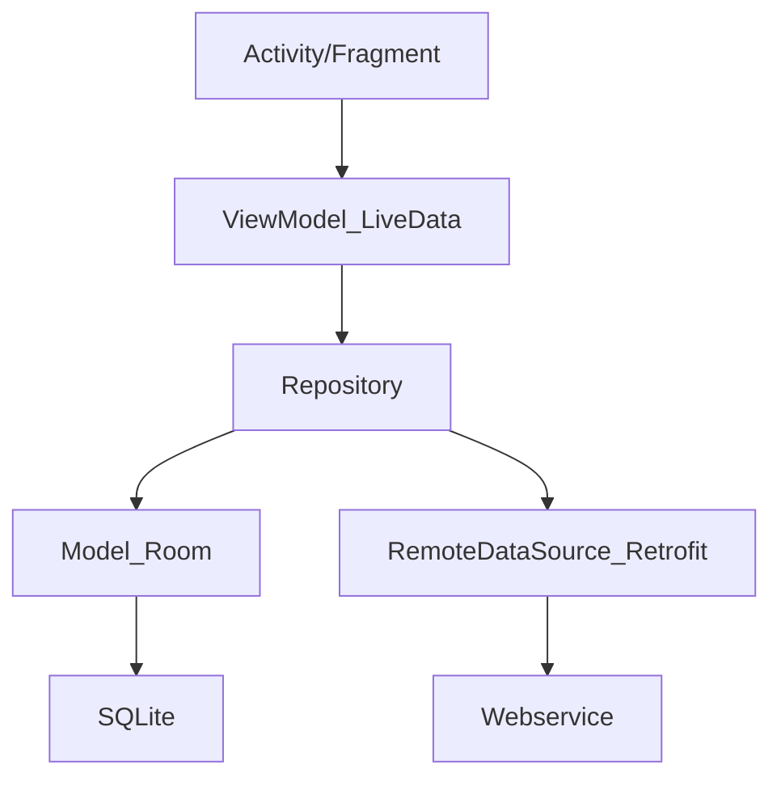

[TOC]

# Kotlin协程

本文链接：https://blog.csdn.net/feather_wch/article/details/132200864

## 协程：基本概念

### 线程和协程

1、线程和协程的区别关系
1. 线程是操作系统调度的，涉及上下文切换
1. 协程是语言层面的，可以在线程间自由切换

2、kotlin在不同语言中的区别
1. 有的语言协程可以脱离线程执行
1. Kotlin中不可以脱离线程，可以在线程间自由切换

3、协程真正的优点：(只是高效，轻量为什么不用Rxjava)？
1. 最大程度简化异步并发任务，用同步的代码写出异步的效果
1. 网络请求谁都能做，++++++++++++++++++++++

### 传统异步任务和协程对比

1、网络请求返回数据，为什么多1个包装类（中间层）?
1. 测试环境 登录返回{data:{}}，正式服务器返回了{data\:null}就会crash
1. 任何疑难杂症都可以用中间层

#### 传统细节

2、传统异步任务的执行流程
1.  thread->Retrofit->请求->返回值->Handler去处理
2.  弊端：代码很乱违背了人类的串行思维

#### Kotlin协程

```kotlin
    /***
     * 委托给CoroutineScope，但是没有实现，交给MainScpoe去实现。就拥有this
     */
    class MainActivity6 : AppCompatActivity() , CoroutineScope by MainScope()

    	launch(){} // 直接调用

        override fun onDestroy() {
            super.onDestroy()
            cancel() // 手动取消
        }

```


```kotlin
// 挂起函数，retrofit高级版本自动加判断会切线程。2.7+
suspend fun loginActionCoroutine()

```

1、kotlin协程的特点
1. 异步线程切换主线程不需要自己管了，挂起会去执行异步操作，操作完成后恢复主线程。

2、Retrofit关于协程的特殊处理
1. 是Retrofit看到suspend会切换到IO异步线程去处理，操作完成后恢复到原线程（原来是UI线程就是UI线程）


### Retrofit和协程

1. rxjava2.6遇到suspend关键字会自动切换到io线程（默认）
1. 主动在主线程，做耗时操作。也没事


### 挂起和恢复

协程：可以做到一行代码，两次线程切换。代码块线程到异步线程，异步线程到代码块线程。

挂起：暂停，挂起当前线程。保存当前协程局部信息。用于恢复
恢复：从协程挂起点恢复。

阻塞和挂起的区别
1. 阻塞后整个线程就进入了timed waiting状态
1. 阻塞再次点击会导致anr
2. 挂起的时候，线程还可以做其他事情。
2. 挂起不会导致anr


阻塞：类似安检的时候睡觉
挂起：类似安检的时候站到一边去

### 协程的层级：语言基础层，官方框架层
1. 语言基础：kotlin包，提供最基础api
2. 框架层：kotlinx，协程框架


#### 官方框架层

官方框架层 写需求：
```kotlin
GlobalScope.launch{
    
}
```

#### 语言基础层
语言基础层 写需求：
```kotlin
        // 1、协程体
        val suspendFun: suspend ()-> Float = suspend{
            delay(10000)
            123.456f
        }

        // 2、协程体执行结果交给Continuation
        //    最底层还是回调
        val continuation = suspendFun.createCoroutine(object: Continuation<Float>{
            override val context: CoroutineContext
                get() = Dispatchers.Main // 恢复后的线程

            override fun resumeWith(result: Result<Float>) {
                println(result) // 回调后执行 //操作result，可以打印
            }

        })

        // 3、协程体的管理者，激活，协程体的执行
        continuation.resume(Unit)
        // 底层
        // continuation.resumeWith(Result.success(value))
```

2、回调的Continuation和返回的Continuation的区别
1. 前者：协程体完成的回调，根据CoroutineContext选择恢复后执行的线程，执行resume()
1. 后者：协程体的管理者，管理者不resume不会激活，协程体的执行。
1. z协程体管理者触发协程体执行，协程体执行的结果会交给Continuation。


3、回调的Continuation内部实现
1. 用SafeContinuation =====> 包装模式

### 解决传统开发痛点

#### 多层回调

银行APP痛点，为了安全，一个账号登录需要顺序查询五六个接口。

Retrofit可以线程切换，就是发现suspend关键字后，会调用
```kotlin
    withContext(Dispatchers.IO) {
    }
```

进行线程切换

如果有多个请求的结果需要合并怎么办？

> 1. Select选择器
> 1. async()+await()

## 协程：启动
### launch
```kotlin
    // Job
    var job = launch {
        println("launch")
        delay(2000)
    }
    job.join() // 会等待launch执行完成
```
### async
获取到返回值
```kotlin
    // Deferred<T>
    var deferred = async {
        println("async")
        delay(5000)
        "获取到网络数据JSON"
    }
    println(deferred.await())
```
### withContext
## 协程：流程控制
### join
1. join会挂起当前协程体，并等待目标协程体执行完成
2. join必须在协程体内使用
3. 非阻塞
```kotlin
    var job1 = launch {
        requestUserName()
    }
    job1.join() // 挂起当前协程体，非阻塞
    var job2 = launch {
        requestUserInfo()
    }
    job2.join()
    println("查询结束")
```
====> 线程的join
1、线程的join会阻塞当前线程
2、join会不会释放锁？
1. 会释放线程锁(thread对象)，不会释放对象锁 
2. 底层是wait实现的
```java
synchronized(obj){
    thread.join(); //join不释放锁
}
synchronized(thread){
    thread.join(); //join释放锁
}
```
3、yield()让出cpu执行权，不会释放锁
4、park()会释放锁，并等待唤醒
5、sleep()阻塞，不会释放锁
#### 控制顺序
任务按顺序执行：
```kotlin
协程体1
协程体1.join()
协程体2
协程体2.join()
协程体3
协程体3.join()
```
任务并发执行：
```
协程体1
协程体2
协程体3
协程体1.join()
协程体2.join()
协程体3.join()
```
### await
挂起等待协程体的返回值：
```kotlin
    var deferred = async {
        println("async")
        requestUserName()
    }
    println(deferred.await())
```
### measureTimeMillis：执行时间 
1. 获取到总共的执行时间
2. 时间是并发执行的时间（500ms），不是顺序执行（500+500）
```kotlin
    var deferred1 = async {
        println("async")
        requestUserName()
    }
    var deferred2 = async {
        println("async")
        requestUserName()
    }
    val time = measureTimeMillis {
        deferred1.await()
        deferred2.await()
    }
    println(time)
```
```kotlin
public inline fun measureTimeMillis(block: () -> Unit): Long {
    val start = System.currentTimeMillis()
    block() // 执行前后计算时间点
    return System.currentTimeMillis() - start
}
```
### 调度前
1. 在遇到挂起方法前的代码都属于调度前
2. 调度前代码一定在协程体内代码执行前执行
```kotlin
```

## 协程：线程选择


GlobalScope.launch()采用默认default异步线程。

Dispatcher.Main：是安卓调度器 UI交互的轻量级任务，更新livedata
Default：适合cpu密集型（计算等）核心线程数+1（防止页缺失）数组排序，json大量解析等等
IO：为磁盘和网络IO处理。核心线程数x2


## 协程：启动模式
1、默认有启动模式：DEFAULT
```kotlin
launch(/*start = CoroutineStart.DEFAULT*/) {  // 默认参数
    delay(200)
}
// 调度时
DEFAULT -> block.startCoroutineCancellable(completion)
```
1. 可以取消
## 协程：异常
### exceptionhandler
1、为什么exceptionhandler只能给顶级协程，子协程不可以
## 协程：操作符
### map
### flatmap
2、flatmap和map的区别？什么是展平？
flatmap contact
flatmap merge
## 协程：并发
协程并发问题：
1. 原子类
2. channel
3. mutex
4. semaphore 参数0关闭 参数1等于mutex
如何不出现并发安全问题？
> 保证变量的不变性即可
```kotlin
    var i = 0
    val r = i + List(10000) {// List<Deffered>
        GlobalScope.async {
            delay(1000) // 每个操作耗时1000ms
            1
        }
    }
        .map { it.await() } // 转为List<Int>
        .sum()
    println(r) // 总共1000ms后，获取所有的综合结果。并发安全的
```
如何知道协程执行结束1-2-3
invokeOnCompletion
## 协程：原理


协程挂起和恢复

1.  一行代码两个线程
2.  左UI，右IO
3.  Kotlin：suspend
4.  UI线程切换到IO异步线程：挂起
5.  IO到UI：恢复当前作用域的UI线程

suspend关键字会被kotlin处理成Continuation， Continuation == Callback，里面都是成功和失败的回调

Continuation：保证后续代码的恢复功能

协程为什么不会阻塞任何线程？

> 代码和变量会拷贝出去，然后原有地方remove掉。方便恢复

为什么suspend方法外面需要suspend代码块包裹？

*   suspend方法参数有隐藏的continuation
*   suspend代码块等于构建了一个隐藏的continuation对象

### 状态机
状态模式解决回调地狱
拦截器包裹Continuation返回Continuation
三个状态：
suspend
resumed
undecided
源码实现核心机制：
invokeSuspend循环一次代表一次回调地狱
核心：
协程本质 = continuation + 状态机
外层方法如f0，内部三个suspend f1 f2 f3
f0是初始化状态机，后续反复三次进入f0
每次进入switch跳转到不同分支，执行不同方法
requestLoadUser(completion:Continuaiton)
completion.invokeSuspend【状态扭转】 ====> 是什么？
状态扭转什么意思？
### 非阻塞
核心：主线程发现是挂起函数直接return，子线程定时后重新执行相关方法。
状态机里面，根据状态，对应流程会执行
每次执行状态都会更新
startCoroutine不需要safeContinuation包裹，为什么？
> 已经明确了resume只会执行一次
### 挂起函数类型探究
```kotlin
suspend fun getLength(str:String):Int{
    delay(1000)
    return str.length
}
// 1、常规类型
var funType1:suspend (String)->Int = ::getLength
// 2、编译后的类型
//var funType2:suspend (String, Continuation<Int>)->Any? = ::getLength
println(funType1.invoke("feather"))
```
#### suspendCoroutine
该例子的as类型转换会报错，还要深入研究
```kotlin
suspend fun getLength(str:String):Int = suspendCoroutine<Int>{
    object :Thread(){
        override fun run() {
            super.run()
            it.resume(str.length)
        }
    }.start()
}
// 3、使用编译后类型，运行OK，证明无问题
var funType3:suspend (String, Continuation<Int>)->Any? = ::getLength as suspend(String, Continuation<Int>)->Any?
funType3.invoke("feather", object:Continuation<Int>{
    override fun resumeWith(result: Result<Int>) {
        println(result.getOrNull())
    }
    override val context: CoroutineContext
        get() = MainScope().coroutineContext
})
```
## 协程核心类和Api
CoroutineContext
-EmptyCoroutineContext
Continuation
-SafeContinuation
CoroutineScope
-GlobalScope
-MainScope
-lifecycleScope
-viewmodelScope
runBlocking
delay
launch
async
Job
```kotlin
public interface Job : CoroutineContext.Element
public interface Element : CoroutineContext
```
-Deferred
```kotlin
public interface Deferred<out T> : Job
```
架构：
结构化并发
### CoroutineScope

1、协程会面临的问题：
1. 某个协程任务出现了丢失和无法管理，会浪费内存。


2、协程任务的不可控 出现了【结构化并发】-CoroutineScope
1. 可取消协程，比线程好
2. 任务状态可以追踪
3. 出现了异常，可以发送信息

3、所有协程体都有CoroutineScope有什么用？
1. 会追踪所有协程
2. 可以取消所有管理的协程


4、launch最后一次参数给CoroutineScope增加了匿名扩展函数

5、withContext也有sc才能管理

CoroutineScope常见子类：
1. GlobalScope: 全局\顶级\进程作用域，绑定App进程。 测试中用。
2. MainScope: Activity。onDestory可以取消协程
3. viewModelScope: 继承ViewModel自动拥有，和ViewModel生命周期自动绑定，不需关心要取消
4. lifecycleScope: 绑定Activity或者Fragment生命周期 // 用得最多

CoroutineScope内部转交给CoroutineContext

大写的方法名是什么设计模式？
1. 可以算作简单的工厂设计模式

#### 委托
```kotlin
class MainActivity: CoroutineScope by MainScope(){} // =====> 类委托
内部拥有this：可以省略
```
##### 类委托
一个类将接口的实现委托给另一个对象
MainActivity将接口CoroutineScope的实现委托给MainScope()
### CoroutineStart: 启动模式
```kotlin
public enum class CoroutineStart {
    DEFAULT,
    LAZY,
    ATOMIC,
    UNDISPATCHED;
    public operator fun <T> invoke(block: suspend () -> T, completion: Continuation<T>): Unit =
        when (this) {
            DEFAULT -> block.startCoroutineCancellable(completion)
            ATOMIC -> block.startCoroutine(completion)
            UNDISPATCHED -> block.startCoroutineUndispatched(completion)
            LAZY -> Unit // will start lazily
        }
    public operator fun <R, T> invoke(block: suspend R.() -> T, receiver: R, completion: Continuation<T>): Unit =
        when (this) {
            DEFAULT -> block.startCoroutineCancellable(receiver, completion)
            ATOMIC -> block.startCoroutine(receiver, completion)
            UNDISPATCHED -> block.startCoroutineUndispatched(receiver, completion)
            LAZY -> Unit // will start lazily
        }
    public val isLazy: Boolean get() = this === LAZY
}
```
## 测试：runBlocking
适合学习和测试
```
fun main = runBlocking<Unit>{
}
```
1、runBlocking是阻塞的，协程是非阻塞的不冲突吗？
1. runBlocking阻塞的是主线程：需要等待所有子协程完成后，才会继续
2. 协程是非阻塞的
### 打印协程名称
VMOptions：
```
-Dkotlinx.coroutines.debug=on
```
```kotlin
println("${Thread.currentThread().name}")
```
```
main的第一行代码 main @coroutine#1
launch main @coroutine#2
async main @coroutine#3
launch2 main @coroutine#2
async2 main @coroutine#3
获取到网络数据JSON
main的第二行代码 main @coroutine#1
```


## 协程：面试题

### 你的APP网络模型是什么？

各个企业主流：Retrofit+OkHttp+RxJava+Glide

主流框架：

一些框架都是：协程+JetPack全家桶+mvvm

理想：协程+JetPack全家桶+mvvm+Retrofit+OkHttp+Glide

xxx未来五年 mvi + compose



### 为什么要有ViewModel层

为什么不直接View->Model层？

ViewModel管理所有的LiveData数据的状态的稳定性

横竖屏切换等操作，数据会消失

LiveData关联布局，产生DataBinding


