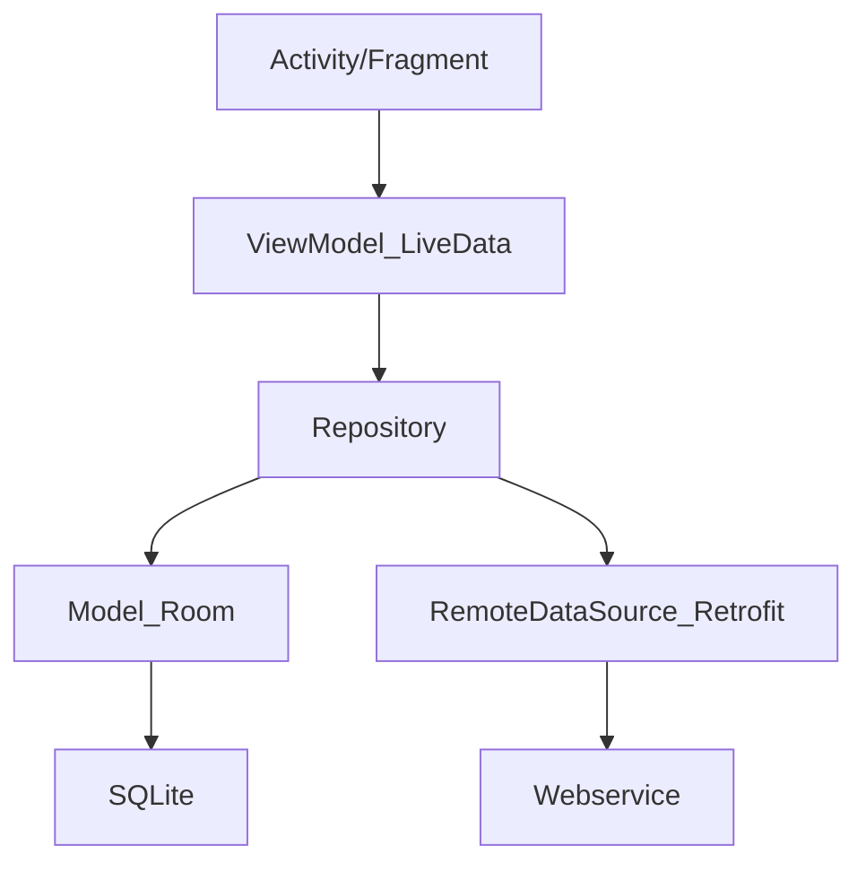

[TOC]

# Kotlin协程

## 线程和协程

1、线程和协程的区别关系
1. 线程是操作系统调度的，涉及上下文切换
1. 协程是语言层面的，可以在线程间自由切换

2、kotlin在不同语言中的区别
1. 有的语言协程可以脱离线程执行
1. Kotlin中不可以脱离线程，可以在线程间自由切换

3、协程真正的优点：(只是高效，轻量为什么不用Rxjava)？
1. 最大程度简化异步并发任务，用同步的代码写出异步的效果
1. 网络请求谁都能做，++++++++++++++++++++++

## 传统异步任务和协程对比

1、网络请求返回数据，为什么多1个包装类（中间层）?
1. 测试环境 登录返回{data:{}}，正式服务器返回了{data\:null}就会crash
1. 任何疑难杂症都可以用中间层

### 传统细节

2、传统异步任务的执行流程
1.  thread->Retrofit->请求->返回值->Handler去处理
2.  弊端：代码很乱违背了人类的串行思维

### Kotlin协程

```kotlin
    /***
     * 委托给CoroutineScope，但是没有实现，交给MainScpoe去实现。就拥有this
     */
    class MainActivity6 : AppCompatActivity() , CoroutineScope by MainScope()

    	launch(){} // 直接调用

        override fun onDestroy() {
            super.onDestroy()
            cancel() // 手动取消
        }

```


```kotlin
// 挂起函数，retrofit高级版本自动加判断会切线程。2.7+
suspend fun loginActionCoroutine()

```

1、kotlin协程的特点
1. 异步线程切换主线程不需要自己管了，挂起会去执行异步操作，操作完成后恢复主线程。

2、Retrofit关于协程的特殊处理
1. 是Retrofit看到suspend会切换到IO异步线程去处理，操作完成后恢复到原线程（原来是UI线程就是UI线程）


## Retrofit和协程

1. rxjava2.6遇到suspend关键字会自动切换到io线程（默认）
1. 主动在主线程，做耗时操作。也没事


## Kotlin协程
```kotlin
GlobalScope.launch（main）{
   异步请求：挂起函数，➕，withContext
   主线程更新ui
}
```
1. 可以做到一行代码，两次线程切换。代码块线程到异步线程，异步线程到代码块线程。


## 挂起和恢复

挂起：暂停，挂起当前线程。保存当前协程局部信息。用于恢复
恢复：从协程挂起点恢复。

阻塞和挂起的区别
1. 阻塞后整个线程就进入了timed waiting状态
1. 阻塞再次点击会导致anr
2. 挂起的时候，线程还可以做其他事情。
2. 挂起不会导致anr


阻塞：类似安检的时候睡觉
挂起：类似安检的时候站到一边去

## 线程的选择
GlobalScope.launch()采用默认default异步线程。


## 协程的层级：语言基础层，官方框架层
1. 语言基础：kotlin包，提供最基础api
2. 框架层：kotlinx，协程框架


### 官方框架层

官方框架层 写需求：
```kotlin
GlobalScope.launch{
    
}
```

### 语言基础层
语言基础层 写需求：
```kotlin
        // 1、协程体
        val suspendFun: suspend ()-> Float = suspend{
            delay(10000)
            123.456f
        }

        // 2、协程体执行结果交给Continuation
        //    最底层还是回调
        val continuation = suspendFun.createCoroutine(object: Continuation<Float>{
            override val context: CoroutineContext
                get() = Dispatchers.Main // 恢复后的线程

            override fun resumeWith(result: Result<Float>) {
                println(result) // 回调后执行 //操作result，可以打印
            }

        })

        // 3、协程体的管理者，激活，协程体的执行
        continuation.resume(Unit)
        // 底层
        // continuation.resumeWith(Result.success(value))
```

2、回调的Continuation和返回的Continuation的区别
1. 前者：协程体完成的回调，根据CoroutineContext选择恢复后执行的线程，执行resume()
1. 后者：协程体的管理者，管理者不resume不会激活，协程体的执行。
1. z协程体管理者触发协程体执行，协程体执行的结果会交给Continuation。


3、回调的Continuation内部实现
1. 用SafeContinuation =====> 包装模式


#### CoroutineScope

GlobalScope 全局，不用

MainScope需要自己取消

LifecycleScope    和lifecycle生命周期自动绑定，不需要关心取消

ViewModelScope 和ViewModel生命周期自动绑定，不需关心要取消

## 解决传统开发痛点

### 多层回调

银行APP痛点，为了安全，一个账号登录需要顺序查询五六个接口。

Retrofit可以线程切换，就是发现suspend关键字后，会调用
```kotlin
    withContext(Dispatchers.IO) {
    }
```

进行线程切换

如果有多个请求的结果需要合并怎么办？

> 1. Select选择器
> 1. async()+await()

### 协程挂起和恢复

1.  一行代码两个线程
2.  左UI，右IO
3.  Kotlin：suspend
4.  UI线程切换到IO异步线程：挂起
5.  IO到UI：恢复当前作用域的UI线程

suspend关键字会被kotlin处理成Continuation， Continuation == Callback，里面都是成功和失败的回调

Continuation：保证后续代码的恢复功能

协程为什么不会阻塞任何线程？

> 代码和变量会拷贝出去，然后原有地方remove掉。方便恢复

为什么suspend方法外面需要suspend代码块包裹？

*   suspend方法参数有隐藏的continuation
*   suspend代码块等于构建了一个隐藏的continuation对象

#### 状态机原理

1.  协程表面代码少，底层kotlin编译后更复杂，还有状态机模式

# 面试题

### 你的APP网络模型是什么？

各个企业主流：Retrofit+OkHttp+RxJava+Glide

主流框架：

一些框架都是：协程+JetPack全家桶+mvvm

理想：协程+JetPack全家桶+mvvm+Retrofit+OkHttp+Glide

xxx未来五年 mvi + compose



### 为什么要有ViewModel层

为什么不直接View->Model层？

ViewModel管理所有的LiveData数据的状态的稳定性

横竖屏切换等操作，数据会消失

LiveData关联布局，产生DataBinding


