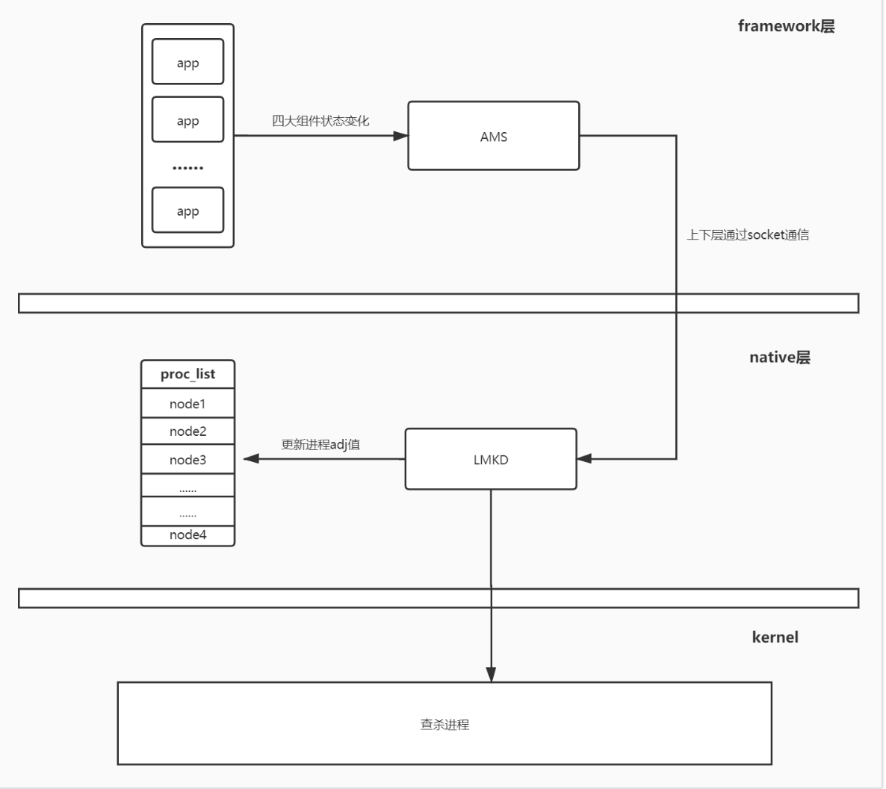

# AMS

1. AMS如何管理90多个服务？
1. 

## SystemServer启动AMS和ATMS


```java
//SystemServer的启动
    public static void main(String[] args) {
        new SystemServer().run();
    }
// 启动
    private void run() {
        // Binder线程池，线程数提升至31
        BinderInternal.setMaxThreads(sMaxBinderThreads);
        // 准备主线程
        Looper.prepareMainLooper();
        // 创建属于SystemServer的上下文
        crateSystemContext();
        // SystemServiceManager的初始化
        mSystemServiceManager = new SystemServiceManager(mSystemContext);
        // 启动服务
        startBootstrapServices(t);
        startCoreServices(t);
        startOtherServices(t);
        // Looper的loop
        Looper.loop();
    }
```

### ActivityManagerService
管理90个服务：需要管理类SystemServiceManager
```java
// 主题流程：
// 1. startService：反射构造，并且执行onStart，再ServiceManager.publish去发布
// 2. setSystemProcess：将各种服务addService到ServiceManager中
// 3. syytemReady
    private void startBootstrapServices(@NonNull TimingsTraceAndSlog t) {
        // 1、SystemServiceManager来启动ATMS
        ActivityTaskManagerService atm = mSystemServiceManager.startService(ActivityTaskManagerService.Lifecycle.class).getService();  // startService（1）
        // 启动AMS startService(2)
        mActivityManagerService = ActivityManagerService.Lifecycle.startService(mSystemServiceManager, atm);
        // startService: 两者区别是什么？
        // 底层都是SystemServiceManager的startService方法
        mActivityManagerService.setSystemServiceManager(mSystemServiceManager);
        mActivityManagerService.setInstaller(installer);

        // 2、核心内容，为app进程安排系统进程的以便后期监控
        mActivityManagerService.setSystemProcess();

    }

    private void startOtherServices(){
        // AMS的就绪
        mActivityManagerService.systemReady(() -> {
            // SystemServiceManager，管理的阶段状态
            mSystemServiceManager.startBootPhase(t, SystemService.PHASE_ACTIVITY_MANAGER_READY);
            
            // 捕获所有Crash
            mActivityManagerService.startObservingNativeCrashes();

            startSystemUi(context, windowManagerF);//SystemUI功能:界面上方的状态栏 status bar，下方的导航栏Navigation Bar，锁屏界面 Keyguard ，电源界面 PowerUI，近期任务界面 Recent Task 等等

        }, t);
    }
```
```java
// AMS构造
    public ActivityManagerService(Context systemContext, ActivityTaskManagerService atm) {
        // 1、使用SystemServer的上下文
        //// 系统上下文，是在SystemServer进程fork出来后通过createSystemContext()创建的，即与SystemServer进程是一样的
        mContext = systemContext;

        mFactoryTest = FactoryTest.getMode();
        // 2、系统进程的主线程 sCurrentActivityThread，这里是systemMain()中创建的ActivityThread对象。即也与SystemServer一样的。
        mSystemThread = ActivityThread.currentActivityThread();
        mUiContext = mSystemThread.getSystemUiContext();
        // 3、HandlerThread：子线程的Looper构造处理AMS消息的handle
        mHandlerThread = new ServiceThread(TAG,THREAD_PRIORITY_FOREGROUND, false /*allowIo*/);
        mHandlerThread.start();
        mHandler = new MainHandler(mHandlerThread.getLooper());//Handler
        // 5、UiHandler对应于Android中的Ui线程
        mUiHandler = mInjector.getUiHandler(this);

        mProcStartHandlerThread = new ServiceThread(TAG + ":procStart",THREAD_PRIORITY_FOREGROUND, false /* allowIo */);
        mProcStartHandlerThread.start();
        mProcStartHandler = new Handler(mProcStartHandlerThread.getLooper());

        mProcessList = mInjector.getProcessList(this);
        mProcessList.init(this, activeUids, mPlatformCompat);
        mLowMemDetector = new LowMemDetector(this); // 低内存检测
        mOomAdjuster = new OomAdjuster(this, mProcessList, activeUids); // OomAdj调整

		// 6、创建几种广播相关对象，前台广播、后台广播、offload广播队列。
        mFgBroadcastQueue = new BroadcastQueue(this, mHandler,"foreground", foreConstants, false);
        mBgBroadcastQueue = new BroadcastQueue(this, mHandler,"background", backConstants, true);
        mOffloadBroadcastQueue = new BroadcastQueue(this, mHandler,"offload", offloadConstants, true);
        mBroadcastQueues[0] = mFgBroadcastQueue;
        mBroadcastQueues[1] = mBgBroadcastQueue;
        mBroadcastQueues[2] = mOffloadBroadcastQueue;

        // 7、创建ActiveServices对象，管理 ServiceRecord
        mServices = new ActiveServices(this);
        // 8、创建ProviderMap对象，管理ContentProviderRecord
        mProviderMap = new ProviderMap(this);
        mPackageWatchdog = PackageWatchdog.getInstance(mUiContext);
        mAppErrors = new AppErrors(mUiContext, this, mPackageWatchdog);

        final File systemDir = SystemServiceManager.ensureSystemDir();


        //创建电池统计服务，并输出到制定目录
        mBatteryStatsService = new BatteryStatsService(systemContext, systemDir,BackgroundThread.get().getHandler());
        mBatteryStatsService.getActiveStatistics().readLocked();
        mBatteryStatsService.scheduleWriteToDisk();
        mOnBattery = DEBUG_POWER ? true : mBatteryStatsService.getActiveStatistics().getIsOnBattery();
        mBatteryStatsService.getActiveStatistics().setCallback(this);
        mOomAdjProfiler.batteryPowerChanged(mOnBattery);

       // adb shell dumpsys procstats 查看应用进程信息
        mProcessStats = new ProcessStatsService(this, new File(systemDir, "procstats"));
        mAppOpsService = mInjector.getAppOpsService(new File(systemDir, "appops.xml"), mHandler);
        mUgmInternal = LocalServices.getService(UriGrantsManagerInternal.class);
        mUserController = new UserController(this);

        mPendingIntentController = new PendingIntentController(
                mHandlerThread.getLooper(), mUserController, mConstants);

		// Intent防火墙，Google定义了一组规则，来过滤intent，如果触发了，则intent会被系统丢弃，且不会告知发送者
        mIntentFirewall = new IntentFirewall(new IntentFirewallInterface(), mHandler);

        // 得到ActivityTaskManagerService的对象，调用ATM.initialize
        mActivityTaskManager = atm;
        mActivityTaskManager.initialize(mIntentFirewall, mPendingIntentController,DisplayThread.get().getLooper()); // 初始化Init，传入ActivityManagerService的线程的Looper
        mAtmInternal = LocalServices.getService(ActivityTaskManagerInternal.class); // ATMInternal用于在attachApplication的时候，调用到这里面

        //启动一个线程专门跟进cpu当前状态信息，ams对当前cpu状态了如指掌，可以更加高效的安排其他工作
        mProcessCpuThread = new Thread("CpuTracker") {
            @Override
            public void run() {
                synchronized (mProcessCpuTracker) {
                    mProcessCpuInitLatch.countDown(); // ============================================>CountDownLatch AMS初始化CPU监控线程后才会去在start()中publish各种服务后继续执行。await+countdown
                    mProcessCpuTracker.init();
                }
                while (true) {
                    try {
                        try {
                            synchronized(this) {
                                final long now = SystemClock.uptimeMillis();
                                long nextCpuDelay = (mLastCpuTime.get()+MONITOR_CPU_MAX_TIME)-now;
                                long nextWriteDelay = (mLastWriteTime+BATTERY_STATS_TIME)-now;
                                //Slog.i(TAG, "Cpu delay=" + nextCpuDelay
                                //        + ", write delay=" + nextWriteDelay);
                                if (nextWriteDelay < nextCpuDelay) {
                                    nextCpuDelay = nextWriteDelay;
                                }
                                if (nextCpuDelay > 0) {
                                    mProcessCpuMutexFree.set(true);
                                    this.wait(nextCpuDelay);
                                }
                            }
                        } catch (InterruptedException e) {
                        }
                        updateCpuStatsNow();
                    } catch (Exception e) {
                        Slog.e(TAG, "Unexpected exception collecting process stats", e);
                    }
                }
            }
        };

        // 加入Watchdog的监控，监听进程，这个类每分钟调用一次监视器，如果进程没有任何返回就杀掉
        Watchdog.getInstance().addMonitor(this);
        Watchdog.getInstance().addThread(mHandler);

        // 保活这块相关代码
        updateOomAdjLocked(OomAdjuster.OOM_ADJ_REASON_NONE);
        try {
            Process.setThreadGroupAndCpuset(BackgroundThread.get().getThreadId(),Process.THREAD_GROUP_SYSTEM);
            Process.setThreadGroupAndCpuset(mOomAdjuster.mCachedAppOptimizer.mCachedAppOptimizerThread.getThreadId(),Process.THREAD_GROUP_SYSTEM);
        } catch (Exception e) {
            Slog.w(TAG, "Setting background thread cpuset failed");
        }

        // ActivityManagerInternal类的实现类
        mInternal = new LocalService(); // 用于后续ATMS把startProcess启动进程的任务交给AMS
        mPendingStartActivityUids = new PendingStartActivityUids(mContext);
    }
```

```java


//注册服务。
//1.首先将ActivityManagerService注册到ServiceManager中，
//2.其次将几个与系统性能调试相关的服务注册到ServiceManager。
//3.查询并处理ApplicationInfo。首先调用PackageManagerService的接口，查询包名为android的应用程序的ApplicationInfo信息，对应于framework-res.apk。然后以该信息为参数调用ActivityThread上installSystemApplicationInfo方法。
//4.创建并处理ProcessRecord。调用ActivityManagerService上的newProcessRecordLocked，创建一个ProcessRecord类型的对象，并保存该对象的信息
    public void setSystemProcess() {
        try {
            // 注册服务activity
            ServiceManager.addService(Context.ACTIVITY_SERVICE, this, /* allowIsolated= */ true,                    DUMP_FLAG_PRIORITY_CRITICAL | DUMP_FLAG_PRIORITY_NORMAL | DUMP_FLAG_PROTO);
			// 注册服务procstats，进程状态 
			ServiceManager.addService(ProcessStats.SERVICE_NAME, mProcessStats);
			// 注册服务meminfo，内存信息
			ServiceManager.addService("meminfo", new MemBinder(this),/* allowIsolated= */ false,                    DUMP_FLAG_PRIORITY_HIGH);
			// 注册服务gfxinfo，图像信息
			ServiceManager.addService("gfxinfo", new GraphicsBinder(this));
			// 注册服务dbinfo，数据库信息
			ServiceManager.addService("dbinfo", new DbBinder(this));
			if (MONITOR_CPU_USAGE) {
				//注册服务cpuinfo，cpu信息
				ServiceManager.addService("cpuinfo", new CpuBinder(this),
				/* allowIsolated= */ false, DUMP_FLAG_PRIORITY_CRITICAL);
				} 
			//注册服务permission和processinfo，权限和进程信息
			ServiceManager.addService("permission", new PermissionController(this));
			// 注册进程信息
			ServiceManager.addService("processinfo", new ProcessInfoService(this));
			// 注册缓存信息
			ServiceManager.addService("cacheinfo", new CacheBinder(this));
			ApplicationInfo info = mContext.getPackageManager().getApplicationInfo(
				"android", STOCK_PM_FLAGS | MATCH_SYSTEM_ONLY);
			mSystemThread.installSystemApplicationInfo(info, getClass().getClassLoader());
			synchronized (this) {
				// 创建ProcessRecord维护进程的相关信息
				ProcessRecord app = mProcessList.newProcessRecordLocked(info, info.processName,
				false,
				0,
				new HostingRecord("system"));
				app.setPersistent(true);
				app.pid = MY_PID;
				app.getWindowProcessController().setPid(MY_PID);
				app.maxAdj = ProcessList.SYSTEM_ADJ;
				app.makeActive(mSystemThread.getApplicationThread(), mProcessStats);
				addPidLocked(app);
				mProcessList.updateLruProcessLocked(app, false, null); 
                // >>>>>>>>>>>>>>>>>>>>>>>>>>>>>>>>OomAdj:进程优先级
				updateOomAdjLocked(OomAdjuster.OOM_ADJ_REASON_NONE); //手机进程杀死就与这个紧密相关
			}
        } catch (PackageManager.NameNotFoundException e) {
            throw new RuntimeException(
                    "Unable to find android system package", e);
        }
    }
```

### SystemService

如何实现多重继承？
1. 静态内部类实现SystemService接口 // ===================================> 接口

```java
//SystemService.java
    public void startService(@NonNull final SystemService service) {
        // Register it.
        mServices.add(service);
        // Start it.
        long time = SystemClock.elapsedRealtime();
        try {
            service.onStart(); //SystemService的onStart()
        } catch (RuntimeException ex) {
            throw new RuntimeException("Failed to start service " + service.getClass().getName()
                    + ": onStart threw an exception", ex);
        }
        warnIfTooLong(SystemClock.elapsedRealtime() - time, service, "onStart");
    }
// AMS
    public static final class Lifecycle extends SystemService {
        private final ActivityManagerService mService;
        private static ActivityTaskManagerService sAtm;

        public Lifecycle(Context context) {
            super(context);
            // AMS
            mService = new ActivityManagerService(context, sAtm);
        }

        public static ActivityManagerService startService(
                SystemServiceManager ssm, ActivityTaskManagerService atm) {
            sAtm = atm;
            return ssm.startService(ActivityManagerService.Lifecycle.class).getService();
        }

        @Override
        public void onStart() {
            // 启动AMS
            mService.start();
        }
    }
// AMS-启动
    private void start() {

        mProcessCpuThread.start();////启动 CPU 监控线程
    
        mBatteryStatsService.publish();//注册电池状态和权限管理服务
        mAppOpsService.publish(); // 
        LocalServices.addService(ActivityManagerInternal.class, mInternal);

        // 等待mProcessCpuInitLatch完成初始化后，释放锁，初始化期间禁止访问
        try {
            mProcessCpuInitLatch.await();
        } catch (InterruptedException e) { // =======================================> AMS的初始化
            Slog.wtf(TAG, "Interrupted wait during start", e);
            Thread.currentThread().interrupt();
            throw new IllegalStateException("Interrupted wait during start");
        }
    }
```

## ActivityTaskManagerService

```java
    public ActivityTaskManagerService(Context context) {
        mContext = context;
        mFactoryTest = FactoryTest.getMode();
        mSystemThread = ActivityThread.currentActivityThread();
        mUiContext = mSystemThread.getSystemUiContext();
        mLifecycleManager = new ClientLifecycleManager();  //28之后添加的对activity lifecycle的触发器
        mInternal = new LocalService();
        GL_ES_VERSION = SystemProperties.getInt("ro.opengles.version", GL_ES_VERSION_UNDEFINED);
        mWindowOrganizerController = new WindowOrganizerController(this);
        mTaskOrganizerController = mWindowOrganizerController.mTaskOrganizerController;
    }
```

初始化：
```java
//ActivityManagerService的构造方法方法里
mActivityTaskManager.initialize(mIntentFirewall, mPendingIntentController,DisplayThread.get().getLooper());

// ActivityTaskManagerService.java
    public void initialize(IntentFirewall intentFirewall, PendingIntentController intentController,
            Looper looper) {
        // 1、用AMS的Looper构造Handler
        mH = new H(looper); 
        mUiHandler = new UiHandler();
        mIntentFirewall = intentFirewall;
        // 2、初始化了ActivityStackSupervisor
        mStackSupervisor = createStackSupervisor();
        // 3、构造ActivityStartController：这是activity启动的处理类，这里管理者activity启动中用到的intent信息和flag标识，也和stack ，task有重要联系
        mActivityStartController = new ActivityStartController(this);
        setRecentTasks(new RecentTasks(this, mStackSupervisor));  //menu键，存放的是最近的任务
    }
```

## 启动App流程源码

1、Launcher点击图标/启动App涉及几个进程？五个
1. Launcher、ServiceManager、SystemServer、Zygote、App


2、启动Activity会判断目标进程是否存在
1. 存在：AMS直接去启动目标Activity即可
1. 不存在：通知Zygote去fork

3、Context.startActivity
```java
// ContextImpl.java frameworkds\base\core\java\android\app\ContextImpl.java
    public void startActivity(Intent intent) {
        startActivity(intent, null);
    }
    public void startActivity(Intent intent, Bundle options) {
        mMainThread.getInstrumentation().execStartActivity(
                getOuterContext(), mMainThread.getApplicationThread(), null,
                (Activity) null, intent, -1, options);
    }
// Instrumentation.java
    public ActivityResult execStartActivity(
        Context who, IBinder contextThread, IBinder token, String target,
        Intent intent, int requestCode, Bundle options) { // token = mMainThread.getApplicationThread(), 当前App的Binder对象
        IApplicationThread whoThread = (IApplicationThread) contextThread;

        // Binder 调用 ATMS 来启动 Activity
        int result = ActivityTaskManager.getService().startActivity(whoThread,
                    who.getBasePackageName(), who.getAttributionTag(), intent,
                    intent.resolveTypeIfNeeded(who.getContentResolver()), token,
                    target != null ? target.mEmbeddedID : null, requestCode, 0, null, options);
        // 检测启动结果
        checkStartActivityResult(result, intent); // 会检测权限、androidmanifest.xml等
    }
// ActivityTaskManager.java 获取ATMS的Bidner对象，先获取ServiceManager的Bidner对象
    public static IActivityTaskManager getService() {
        return IActivityTaskManagerSingleton.get();
    }
// ActivityTaskManager.java startActivity
    public final int startActivity(xxx) {
        return startActivityAsUser(xxx));
    }
    private int startActivityAsUser(xxx) {
        // 转换user app 栈
        // ActivityStartController.java 获取 ActivityStarter ==========================> 享元模式
        return getActivityStartController().obtainStarter(intent, "startActivityAsUser")
                .setCaller(caller)
                .setCallingPackage(callingPackage)
                .setCallingFeatureId(callingFeatureId)
                .setResolvedType(resolvedType)
                .setResultTo(resultTo)
                .setResultWho(resultWho)
                .setRequestCode(requestCode)
                .setStartFlags(startFlags)
                .setProfilerInfo(profilerInfo)
                .setActivityOptions(bOptions)
                .setUserId(userId)
                .execute();

    }
// ActivityStartController.java
    ActivityStarter obtainStarter(Intent intent, String reason) {
        return mFactory.obtain().setIntent(intent).setReason(reason);
    }
// ActivityStarter.java
    int execute() {
        try {
            int res;
            synchronized (mService.mGlobalLock) {
                // 执行请求
                res = executeRequest(mRequest);
            }
        } finally {
            onExecutionComplete();
        }
    }

    private int executeRequest(Request request) {
        // 1、创建出我们的目标 ActivityRecord对象，存到传入数组0索引上
        final ActivityRecord r = new ActivityRecord(mService, callerApp, callingPid, callingUid,
                callingPackage, callingFeatureId, intent, resolvedType, aInfo,
                mService.getGlobalConfiguration(), resultRecord, resultWho, requestCode,
                request.componentSpecified, voiceSession != null, mSupervisor, checkedOptions,
                sourceRecord);
        mLastStartActivityRecord = r;

        final ActivityStack stack = mRootWindowContainer.getTopDisplayFocusedStack();

		// 2、启动那些需要启动，但是一直没有来得及启动的Activitys（内部调用API最终也startActivityUnchecked）
        mController.doPendingActivityLaunches(false); 
         // 3、启动最后需要启动的activity，也就是当前activity
        mLastStartActivityResult = startActivityUnchecked(r, sourceRecord, voiceSession,
                request.voiceInteractor, startFlags, true /* doResume */, checkedOptions, inTask,
                restrictedBgActivity, intentGrants);

        if (request.outActivity != null) {
            request.outActivity[0] = mLastStartActivityRecord; // 放入数组0
        }

        return mLastStartActivityResult;
    }

// ActivityStarter.java
    private int startActivityUnchecked(xxx) {
        int result = START_CANCELED;
        result = startActivityInner(r, sourceRecord, voiceSession, voiceInteractor, startFlags, doResume, options, inTask, restrictedBgActivity, intentGrants);

        return result;
    }
// ActivityStarter.java
/**===============================================================
 * 1. 计算设置启动模式
 * 2. 计算出所在的栈
 * 3. 启动黑白屏
 * 4. 启动目标Activity
 * 5. 将Activity添加到ActivityStackSupervisor内部的Task列表中。
 * ==================================================================*/
    int startActivityInner(final ActivityRecord r, ActivityRecord sourceRecord, int startFlags, boolean doResume, ActivityOptions options, Task inTask, xxx) {
        // 0、初始化配置，mStartActivity、mLaunchMode等(各种变量赋值)
        setInitialState(r, options, inTask, doResume, startFlags, sourceRecord, voiceSession,
                voiceInteractor, restrictedBgActivity);

        // 1、计算要启动的Activity的task标志,也就是计算启动模式
        computeLaunchingTaskFlags();

        // 2、计算源Activity所在的Stack
        computeSourceStack();

        // 3、将mLaunchFlags设置给Intent，也就是设置启动模式
        mIntent.setFlags(mLaunchFlags);

        final Task reusedTask = getReusableTask();


        // 4、启动参数
        computeLaunchParams(r, sourceRecord, targetTask);

        // 5、获取目标Activity所在的栈，ActivityStack
        mTargetStack = getLaunchStack(mStartActivity, mLaunchFlags, targetTask, mOptions);

        // 创建启动黑白屏window
        final ActivityStack topStack = mRootWindowContainer.getTopDisplayFocusedStack();//显示的顶层栈。启动黑白屏用。
        mTargetStack.startActivityLocked(mStartActivity,
                topStack != null ? topStack.getTopNonFinishingActivity() : null, newTask,
                mKeepCurTransition, mOptions);

        // 启动 activity
        mRootWindowContainer.resumeFocusedStacksTopActivities(mTargetStack, mStartActivity, mOptions);
        mRootWindowContainer.updateUserStack(mStartActivity.mUserId, mTargetStack);

        // 将启动的Activity的任务，添加到SuperVisor最近的任务栈中
        mSupervisor.mRecentTasks.add(mStartActivity.getTask());

        return START_SUCCESS;
    }
// ActivityStarter 获取任务栈 >>>>>>>>>>>>>>>>>>>>>>>>>>>>>>>>>>>>>>>>>>
    private ActivityStack getLaunchStack(ActivityRecord r, int launchFlags, Task task, ActivityOptions aOptions) {
        final boolean onTop = (aOptions == null || !aOptions.getAvoidMoveToFront()) && !mLaunchTaskBehind;
        return mRootWindowContainer.getLaunchStack(r, aOptions, task, onTop, mLaunchParams,
                mRequest.realCallingPid, mRequest.realCallingUid);
    }
    // RootWindowContainer.java
    ActivityStack getLaunchStack(@Nullable ActivityRecord r,
            @Nullable ActivityOptions options, @Nullable Task candidateTask, boolean onTop) {
        return getLaunchStack(r, options, candidateTask, onTop, null /* launchParams */,
                -1 /* no realCallingPid */, -1 /* no realCallingUid */);
    }   
    ActivityStack getLaunchStack(@Nullable ActivityRecord r, xxx) {
        if (stack == null && r != null) {
            stack = r.getRootTask();
        }
        return stack;
    }
    ActivityStack getRootTask() {
        return task != null ? (ActivityStack) task.getRootTask() : null;
    }
// <<<<<<<<<<<<<<<<<<<<<<<<<<<<<<<<<<<<<<<<<< end 获取任务栈

// RootWindowContainer.java // frameworks/base/services/core/java/com/android/server/wm/
    // RootWindowContainer是窗口容器（WindowContainer）的根容器，管理了所有窗口容器。设备上所有的窗口（Window）、显示（Display）都是由它来管理的。
    // resumeFocusedStacksTopActivities会恢复对应任务栈顶部的Activity。这个方法会检查一些可见性相关的属性
    // 如果当前需要resume的activityStack 是可见的，这个时候才resume. 而可见性是由RootWindowContainer中的窗口控制的。
    boolean resumeFocusedStacksTopActivities(ActivityStack targetStack, ActivityRecord target, ActivityOptions targetOptions) {
        // 在目标Stack启动activity。该ActivityStack是ActivityStater解析出来的：mTargetStack = getLaunchStack(xxx)
        // 任务栈ActivityStack是Task子类，是WindowContainer子类
        boolean result = targetStack.resumeTopActivityUncheckedLocked(target, targetOptions);
        return result;
    }
// ActivityStack
    boolean resumeTopActivityUncheckedLocked(ActivityRecord prev, ActivityOptions options) {
        boolean result = resumeTopActivityInnerLocked(prev, options);
        return result;
    }
    private boolean resumeTopActivityInnerLocked(ActivityRecord prev, ActivityOptions options) {

        // 1、获取下一个Activity
        ActivityRecord next = topRunningActivity(true /* focusableOnly */);  

		// 2、停止当前的Activity
        if (mResumedActivity != null) {
            if (DEBUG_STATES) Slog.d(TAG_STATES,
                    "resumeTopActivityLocked: Pausing " + mResumedActivity);
            pausing |= startPausingLocked(userLeaving, false /* uiSleeping */, next);// 停止当前的Activity
        }
        if (pausing) {
            // 3、下一个ActivityRecord对应的进程没有启动
            if (!next.isProcessRunning()) {
                final boolean isTop = this == taskDisplayArea.getFocusedStack();
                // 4、启动进程流程，后面return。
                mAtmService.startProcessAsync(next, false /* knownToBeDead */, isTop,
                        isTop ? "pre-top-activity" : "pre-activity");
                        
            }
            return true;
        } 

       
		// 5、启动指定的Activity
        mStackSupervisor.startSpecificActivity(next, true, true);

        return true;
    }
// ActivityStack::resumeTopActivityUncheckedLocked() 中 topRunningActivity() 获取下一个要启动的Activity
    ActivityRecord topRunningActivity() {
        return topRunningActivity(false /* focusableOnly */);
    }
    ActivityRecord topRunningActivity(boolean focusableOnly) {
        if (focusableOnly) {
            return getActivity((r) -> r.canBeTopRunning() && r.isFocusable());
        } else {
            // 进入第二个分支
            return getActivity(ActivityRecord::canBeTopRunning);
        }
    }

// ActivityStack: 启动第二个Activity前需要调用当前Activity的onPause
    final boolean startPausingLocked(boolean userLeaving, boolean uiSleeping, ActivityRecord resuming) {
        // ATMS的LifecycleManager，处理事务（PauseActivityItem），
        mAtmService.getLifecycleManager().scheduleTransaction(prev.app.getThread(),
                        prev.appToken, PauseActivityItem.obtain(prev.finishing, userLeaving,
                                prev.configChangeFlags, pauseImmediately));

    }

// ActivityRecord获取到目标进程是否在运行
    boolean isProcessRunning() {
        WindowProcessController proc = app;
        if (proc == null) {
            // 解释：ATMS中没有查询到Process名称，或者，没有线程，都代表不在运行。
            proc = mAtmService.mProcessNames.get(processName, info.applicationInfo.uid);
        }
        return proc != null && proc.hasThread();
    }

// ===================================================================
// ActivityStackSupervisor.java 启动特定Activity
    void startSpecificActivity(ActivityRecord r, boolean andResume, boolean checkConfig) {
        // Is this activity's application already running?
        final WindowProcessController wpc = mService.getProcessController(r.processName, r.info.applicationInfo.uid);

        boolean knownToBeDead = false;
		// 进程已经创建的话，直接启动activity
        if (wpc != null && wpc.hasThread()) {
            realStartActivityLocked(r, wpc, andResume, checkConfig);
            return;
        }
        r.notifyUnknownVisibilityLaunchedForKeyguardTransition();

        final boolean isTop = andResume && r.isTopRunningActivity();
		//进程不存在的话，为app启动一个进程
        mService.startProcessAsync(r, knownToBeDead, isTop, isTop ? "top-activity" : "activity");
    }

    boolean realStartActivityLocked(ActivityRecord r, WindowProcessController proc,
            boolean andResume, boolean checkConfig) throws RemoteException {

        final Task task = r.getTask();
        final ActivityStack stack = task.getStack();

        try {


            try {

                /**
                   主要包含两个内容： 一个是 要处理的一系列的生命周期事件，还有一个是这个Client在执行完这一系列事件后最终的lifecycle状态一系列的事件是由callback 的列表控制，而最终的lifecycle状态则由mLifecycleStateRequest 控制
                */

                // 创建 clientTransaction 对象
                final ClientTransaction clientTransaction = ClientTransaction.obtain(proc.getThread(), r.appToken);

                final DisplayContent dc = r.getDisplay().mDisplayContent;
                // 添加LaunchActivityItem
                clientTransaction.addCallback(LaunchActivityItem.obtain(new Intent(r.intent),
                        System.identityHashCode(r), r.info,
                        mergedConfiguration.getGlobalConfiguration(),
                        mergedConfiguration.getOverrideConfiguration(), r.compat,
                        r.launchedFromPackage, task.voiceInteractor, proc.getReportedProcState(),
                        r.getSavedState(), r.getPersistentSavedState(), results, newIntents,
                        dc.isNextTransitionForward(), proc.createProfilerInfoIfNeeded(),
                        r.assistToken, r.createFixedRotationAdjustmentsIfNeeded()));

                // 最终目标状态：ResumeActivityItem
                final ActivityLifecycleItem lifecycleItem;
                if (andResume) {
					//需要Rusume的话，设置ResumeActivityItem到clientTransaction中
					lifecycleItem = ResumeActivityItem.obtain(dc.isNextTransitionForward());
                } else {
                    lifecycleItem = PauseActivityItem.obtain();
                }
                clientTransaction.setLifecycleStateRequest(lifecycleItem);

                // 获取生命周期管理类 ClientLifecycleManager，并执行事务
                mService.getLifecycleManager().scheduleTransaction(clientTransaction);

            } catch (RemoteException e) {
                // 失败重新启动，失败两次放弃
                if (r.launchFailed) {
                    // 第二次启动失败，finish activity
                    Slog.e(TAG, "Second failure launching "
                            + r.intent.getComponent().flattenToShortString() + ", giving up", e);
                    proc.appDied("2nd-crash");
                    r.finishIfPossible("2nd-crash", false /* oomAdj */);
                    return false;
                }
                // 第一次失败，重启进程并重试
                r.launchFailed = true;
                proc.removeActivity(r);
                throw e;
            }
        } finally {
            endDeferResume();
            proc.resumeConfigurationDispatch();
        }

        return true;
    }

// ActivityTaskManagerService.java 获取LifecycleManager
    private final ClientLifecycleManager mLifecycleManager;
    // SystemServer startBootstrapService时，构造ATMS实例，会构造ClientLifecycleManager
    public ActivityTaskManagerService(Context context) {
        mLifecycleManager = new ClientLifecycleManager();  //28之后添加的对activity lifecycle的触发器
    }
    ClientLifecycleManager getLifecycleManager() {
        return mLifecycleManager;
    }
// ClientLifecycleManager
    void scheduleTransaction(ClientTransaction transaction) throws RemoteException {
        final IApplicationThread client = transaction.getClient();
        transaction.schedule();
        if (!(client instanceof Binder)) {
            // 非Binder实例，可以安全回收
            // 用于局部调用的对象，会在transaction在客户端ActivityThread中执行完成后，回收
            transaction.recycle();
        }
    }

// 【IPC】>>>>>>>>>>>>>>>>>>>>>>>>>>>>>>>> 目标线程
// ClientTransaction
    // 通过 mClient 也就是IApplicationThread跨进程调用到应用进程
    public void schedule() throws RemoteException {
        mClient.scheduleTransaction(this); // 如目标的ApplicationThread
    }
// ActivityThread.java
public final class ActivityThread extends ClientTransactionHandler {
    // ActivityThread的Binder对象
    private class ApplicationThread extends IApplicationThread.Stub {
        @Override
        public void scheduleTransaction(ClientTransaction transaction) throws RemoteException {
            // 交给外部类ActivityThread处理
            ActivityThread.this.scheduleTransaction(transaction);
        }
    }
}
// 抽象类：定义了需要处理ClientTransaction的客户端，需要执行的操作。
public abstract class ClientTransactionHandler {

    // 处理事务
    void scheduleTransaction(ClientTransaction transaction) {
        // 1、预处理
        transaction.preExecute(this);
        // 2
        sendMessage(ActivityThread.H.EXECUTE_TRANSACTION, transaction);
    }
}

// 1、预处理 >>>>>>>>>>>>>>>>>>>>>>>>>>>>>>>>>>>>
    // LaunchActivityItem
    private List<ClientTransactionItem> mActivityCallbacks;  
    // ResumeActivityItem  
    private ActivityLifecycleItem mLifecycleStateRequest;
    public void preExecute(android.app.ClientTransactionHandler clientTransactionHandler) {
        if (mActivityCallbacks != null) {
            final int size = mActivityCallbacks.size();
            for (int i = 0; i < size; ++i) {
                mActivityCallbacks.get(i).preExecute(clientTransactionHandler, mActivityToken);
            }
        }
        if (mLifecycleStateRequest != null) {
            mLifecycleStateRequest.preExecute(clientTransactionHandler, mActivityToken);
        }
    }
    // LaunchActivityItem作为ClientTransactionItem实现了preExecute接口，执行了预处理操作，比如更新Process状态。
    public class LaunchActivityItem extends ClientTransactionItem {
        public void preExecute(ClientTransactionHandler client, IBinder token) {
            client.countLaunchingActivities(1);
            client.updateProcessState(mProcState, false);
            client.updatePendingConfiguration(mCurConfig);
        }
    }
// <<<<<<<<<<<<<<<<<<<<<<<<<<<<<<<<<<<<< 1、预处理

// ActivityThread.java
    void sendMessage(int what, Object obj) { // (ActivityThread.H.EXECUTE_TRANSACTION, transaction);
        sendMessage(what, obj, 0, 0, false); // 实现接口，发送消息
    }
    private void sendMessage(int what, Object obj, int arg1, int arg2, boolean async) {
        Message msg = Message.obtain(); // =======================================================================================> 享元模式
        msg.what = what;
        msg.obj = obj;
        if (async) { // async = false，默认是同步消息。
            msg.setAsynchronous(true); 
        }
        mH.sendMessage(msg);
    }
    final H mH = new H();
    class H extends Handler {
        public void handleMessage(Message msg) {
            switch (msg.what) {
                    case EXECUTE_TRANSACTION:
                    final ClientTransaction transaction = (ClientTransaction) msg.obj;
                    // 执行事务
                    mTransactionExecutor.execute(transaction);
                    break;
            }
        }
    }
    private final TransactionExecutor mTransactionExecutor = new TransactionExecutor(this);
// TransactionExecutor, ActivityThread的成员变量
    public void execute(ClientTransaction transaction) {
        executeCallbacks(transaction); // 执行LaunchActivityItem
        executeLifecycleState(transaction); // 执行ResumeActivityItem
    }
    public void executeCallbacks(ClientTransaction transaction) {
        final List<ClientTransactionItem> callbacks = transaction.getCallbacks();
        final int size = callbacks.size();
         //遍历 callbacks数组
        for (int i = 0; i < size; ++i) {
            //从 callbacks数组中取出item
            final ClientTransactionItem item = callbacks.get(i);

            //调用 launchActivityItem 的execute方法
            item.execute(mTransactionHandler, token, mPendingActions); // >> handleLaunchActivity
            item.postExecute(mTransactionHandler, token, mPendingActions);
        }
    }
    private void executeLifecycleState(ClientTransaction transaction) {
        // 获取ActivityLifecycleItem，这里获取的是我们之前添加的ResumeActivityItem
        final ActivityLifecycleItem lifecycleItem = transaction.getLifecycleStateRequest();
        // ResumeActivityItem的 getTargetState　是　ON_RESUME
        cycleToPath(r, lifecycleItem.getTargetState(), true, transaction); // >> handleStartActivity
        // 执行 ResumeActivityItem 的 execute
        lifecycleItem.execute(mTransactionHandler, token, mPendingActions); // >> handleResumeActivity
        lifecycleItem.postExecute(mTransactionHandler, token, mPendingActions);
    }
// 当前状态是ON_CREATE,目标状态是ON_RESUME
    private void cycleToPath(ActivityClientRecord r, int finish, boolean excludeLastState,
            ClientTransaction transaction) {
        final int start = r.getLifecycleState();//这里的start是ON_CREATE  ON_CREATE = 1;
       // 这里的 start 是 ON_CREATE,finish 是 ON_RESUME  ON_RESUME = 3;
       // mHelper是 TransactionExecutorHelper 类的对象，
       // 调用 getLifecyclePath 返回的 path 包含 ON_START 和 ON_RESUME
       // 这里是 Activity 执行 onStart 函数的关键所在  
        final IntArray path = mHelper.getLifecyclePath(start, finish, excludeLastState);
         // 执行path中的相关的生命周期函数
        performLifecycleSequence(r, path, transaction); // ==================================================================> 状态同步
    }

// 获取Lifecycle状态的路径。装填上ON_PUASE, ON_RESUME，根据会执行最新的状态，移除掉最后的ON_RESUME
    public IntArray getLifecyclePath(int start, int finish, boolean excludeLastState) {

        mLifecycleSequence.clear();
        if (finish >= start) {//走到此分支  3>=1
            if (start == ON_START && finish == ON_STOP) {
                // A case when we from start to stop state soon, we don't need to go
                // through the resumed, paused state.
                mLifecycleSequence.add(ON_STOP);
            } else {
                // just go there
                for (int i = start + 1; i <= finish; i++) {
                    //把　ON_START　和 ON_RESUME 添加到 mLifecycleSequence 中
                    mLifecycleSequence.add(i);
                }
            }
        } else { // finish < start, can't just cycle down
            if (start == ON_PAUSE && finish == ON_RESUME) {
                // Special case when we can just directly go to resumed state.
                mLifecycleSequence.add(ON_RESUME);
            } else if (start <= ON_STOP && finish >= ON_START) {
                // Restart and go to required state.

                // Go to stopped state first.
                for (int i = start + 1; i <= ON_STOP; i++) {
                    mLifecycleSequence.add(i);
                }
                // Restart
                mLifecycleSequence.add(ON_RESTART);
                // Go to required state
                for (int i = ON_START; i <= finish; i++) {
                    mLifecycleSequence.add(i);
                }
            } else {
                // Relaunch and go to required state

                // Go to destroyed state first.
                for (int i = start + 1; i <= ON_DESTROY; i++) {
                    mLifecycleSequence.add(i);
                }
                // Go to required state
                for (int i = ON_CREATE; i <= finish; i++) {
                    mLifecycleSequence.add(i);
                }
            }
        }

        // Remove last transition in case we want to perform it with some specific params.
        // 因为 excludeLastState 为 true,所以删除掉 ON_RESUME 状态
        if (excludeLastState && mLifecycleSequence.size() != 0) {
            mLifecycleSequence.remove(mLifecycleSequence.size() - 1);
        }

        return mLifecycleSequence;
    }
```

### WindowContainer和RootWindowContainer

1、WindowContainer是什么？
1. WindowContainer（窗口容器）是一个基本的抽象类，表示一个可包含窗口的容器。
1. 它可以是一个Activity、一个Task或一个Display区域等。
1. 每个WindowContainer可以包含多个子WindowContainer。


2、RootWindiowContainner是什么？
1. 是窗口容器的根容器，管理了所有窗口容器
1. 是WindowContainer的一个子类，表示整个系统的根容器。
1. 是所有其他WindowContainer的顶层容器。
1. 它负责管理整个窗口系统，包括显示区域、各个Display和相关的WindowContainer。

### 进程启动：发起Fork请求

```java
// ActivityStackSupervisor
mService.startProcessAsync(r, knownToBeDead, isTop, isTop ? "top-activity" : "activity");
// ActivityTaskManagerService
    void startProcessAsync(ActivityRecord activity, boolean knownToBeDead, boolean isTop, String hostingType) {
        try {
            // post消息，避免ATMS持有AMS的锁，导致死锁。 =======================================> 
            final Message m = PooledLambda.obtainMessage(ActivityManagerInternal::startProcess,
                    mAmInternal, activity.processName, activity.info.applicationInfo, knownToBeDead,
                    isTop, hostingType, activity.intent.getComponent());
            mH.sendMessage(m);
        } finally {
            Trace.traceEnd(TRACE_TAG_WINDOW_MANAGER);
        }
    }
// public abstract class ActivityManagerInternal {}
// AMS
    // 内部类实现
    public final class LocalService extends ActivityManagerInternal { // ============================================================> 面向对象，接口。静态内部类实现多重继承。ActivityManagerInternal只有抽象方法和public static final变量。不使用实现接口，而是静态内部类。为了让代码更聚集。
        public void startProcess(String processName, ApplicationInfo info, boolean knownToBeDead,boolean isTop, String hostingType, ComponentName hostingName) {
                synchronized (ActivityManagerService.this) {
                    // 调用AMS方法
                    startProcessLocked(processName, info, /*省略参数*/);
                }
        }
    }
// AMS
    final ProcessRecord startProcessLocked(String processName,
            ApplicationInfo info, /*省略参数*/) {
        return mProcessList.startProcessLocked(processName, info, /*省略参数*/);
    }
// ProcessList.java
    final ProcessRecord startProcessLocked(String processName, ApplicationInfo info,/*省略参数*/) {

        ProcessRecord app;
        if (!isolated) { // islated = false,非孤立的隔离的
            // ////////////////构造出ProcessRecord。
            app = getProcessRecordLocked(processName, info.uid, keepIfLarge);
           
        }

        // If this is a new package in the process, add the package to the list
        app.addPackage(info.packageName, info.longVersionCode, mService.mProcessStats);

        // 启动App进程
        final boolean success =
                startProcessLocked(app, hostingRecord, zygotePolicyFlags, abiOverride);
        return success ? app : null;
    }


    boolean startProcessLocked(ProcessRecord app, /*省略参数*/) {
        return startProcessLocked(/*省略参数*/);
    }
    boolean startProcessLocked(/*省略参数*/) {
            
            final Process.ProcessStartResult startResult = startProcess(/*省略参数*/);
            handleProcessStartedLocked(app, startResult.pid, startResult.usingWrapper,
                        startSeq, false);

            return app.pid > 0;
    }
    private Process.ProcessStartResult startProcess(/*省略参数*/) {
        final Process.ProcessStartResult startResult = Process.start(entryPoint,app.processName, /*省略参数*/);
        return startResult;
    }
// Process.java
    public static ProcessStartResult start(@NonNull final String processClass, /*省略参数*/) {
        return ZYGOTE_PROCESS.start(processClass, /*省略参数*/);
    }
    public static final ZygoteProcess ZYGOTE_PROCESS = new ZygoteProcess();
// ZygoteProcess.java
    public final Process.ProcessStartResult start(/*省略参数*/) {
        return startViaZygote(/*省略参数*/);
    }
    private Process.ProcessStartResult startViaZygote(/*省略参数*/){
        ArrayList<String> argsForZygote = new ArrayList<>();


        argsForZygote.add("--runtime-args");
        argsForZygote.add("--setuid=" + uid);
        argsForZygote.add("--setgid=" + gid);
        argsForZygote.add("--runtime-flags=" + runtimeFlags);
        argsForZygote.add("--target-sdk-version=" + targetSdkVersion);
        if (packageName != null) {
            argsForZygote.add("--package-name=" + packageName);
        }
        // 省略解析添加大量参数
        synchronized(mLock) { // 锁 ==========================> synchronized
            return zygoteSendArgsAndGetResult(openZygoteSocketIfNeeded(abi),
                                              zygotePolicyFlags,
                                              argsForZygote);
        }
    }
// 打开Zygote Socket通信 >>>>>>>>>>>>>>>>>>>>>>>>>>>>>>>>>>>>>>>>>>>>>>>>>>>>>
    private ZygoteState openZygoteSocketIfNeeded(String abi) throws ZygoteStartFailedEx {
			// 连接到Primary Zygote
            attemptConnectionToPrimaryZygote();

            if (primaryZygoteState.matches(abi)) {
                return primaryZygoteState;
            }

            if (mZygoteSecondarySocketAddress != null) {
                // Secondary Zygote
                attemptConnectionToSecondaryZygote();

                if (secondaryZygoteState.matches(abi)) {
                    return secondaryZygoteState;
                }
            }
    }
    // mZygoteSocketAddress
    private void attemptConnectionToPrimaryZygote() throws IOException {
        if (primaryZygoteState == null || primaryZygoteState.isClosed()) {
            primaryZygoteState = ZygoteState.connect(mZygoteSocketAddress, mUsapPoolSocketAddress);
        }
    }
    // mZygoteSecondarySocketAddress
    private void attemptConnectionToSecondaryZygote() throws IOException {
        if (secondaryZygoteState == null || secondaryZygoteState.isClosed()) {
            secondaryZygoteState =ZygoteState.connect(mZygoteSecondarySocketAddress,
                            mUsapPoolSecondarySocketAddress);
        }
    }
    // ZygoteProcess.ZygoteState
    private static class ZygoteState implements AutoCloseable {
        
        static ZygoteState connect(LocalSocketAddress zygoteSocketAddress, LocalSocketAddress usapSocketAddress){

            DataInputStream zygoteInputStream;
            BufferedWriter zygoteOutputWriter;
            final LocalSocket zygoteSessionSocket = new LocalSocket();

            // connect到ZygoteSocket服务器
            try {
                zygoteSessionSocket.connect(zygoteSocketAddress);
                zygoteInputStream = new DataInputStream(zygoteSessionSocket.getInputStream());
                zygoteOutputWriter =
                        new BufferedWriter(
                                new OutputStreamWriter(zygoteSessionSocket.getOutputStream()),
                                Zygote.SOCKET_BUFFER_SIZE);
            } catch (IOException ex) {
                try {
                    zygoteSessionSocket.close();
                } catch (IOException ignore) { }

                throw ex;
            }
            // 构建ZygoteState实例
            return new ZygoteState(zygoteSocketAddress, usapSocketAddress,
                                   zygoteSessionSocket, zygoteInputStream, zygoteOutputWriter,
                                   getAbiList(zygoteOutputWriter, zygoteInputStream));
        }
    }
// <<<<<<<<<<<<<<<<<<<<<<<<<<<<<<<<<<<<<<<<<<<<<<<<<<<<< 打开Zygote Socket通信 
    private Process.ProcessStartResult zygoteSendArgsAndGetResult(
            ZygoteState zygoteState, int zygotePolicyFlags, @NonNull ArrayList<String> args){

        // ZygoteState已经connect到Zygote服务器了
        return attemptZygoteSendArgsAndGetResult(zygoteState, msgStr);
    }
    private Process.ProcessStartResult attemptZygoteSendArgsAndGetResult(
            ZygoteState zygoteState, String msgStr) throws ZygoteStartFailedEx {
        try {
            final BufferedWriter zygoteWriter = zygoteState.mZygoteOutputWriter;
            final DataInputStream zygoteInputStream = zygoteState.mZygoteInputStream;

            // 1、将Zygote启动进程需要的信息和参数写入
            zygoteWriter.write(msgStr);
            zygoteWriter.flush();
            // 2、获取到Pid，进程id，进程id < 0代表fork失败
            Process.ProcessStartResult result = new Process.ProcessStartResult();
            result.pid = zygoteInputStream.readInt();  //
            result.usingWrapper = zygoteInputStream.readBoolean();

            if (result.pid < 0) {
                throw new ZygoteStartFailedEx("fork() failed");
            }

            return result; // 返回状态信息
        } catch (IOException ex) {
            zygoteState.close(); // 关闭资源
            throw new ZygoteStartFailedEx(ex);
        }
    }
```

#### Primary Zygote 和 Secondary Zygote

在Android操作系统中，Zygote是一个重要的进程，它是应用程序的孵化器，用于创建和启动新的应用进程。Zygote进程在系统启动时就会被创建，并一直运行在后台。

在Android中，存在两种类型的Zygote进程：Primary Zygote（首要Zygote）和Secondary Zygote（次要Zygote）。它们之间的区别如下：

1. Primary Zygote：
   - Primary Zygote是第一个被创建的Zygote进程，它负责创建和孵化大多数应用进程。
   - 它预加载并缓存了常用的系统类和资源，以提高应用进程的启动速度。
   - Primary Zygote通常运行在开机后的早期阶段，并持续运行直到设备关闭。

2. Secondary Zygote：
   - Secondary Zygote是在系统运行时动态创建的额外Zygote进程，用于处理特定类型的应用进程。
   - 它的目的是为了隔离不同类型的应用，提高安全性和性能。
   - Secondary Zygote在需要时被创建和销毁，根据应用的需求和类型。

attemptConnectionToPrimaryZygote和attemptConnectionToSecondaryZygote是与上述两种Zygote进程相关的函数或方法。它们的区别在于：
- attemptConnectionToPrimaryZygote是尝试与Primary Zygote建立连接的操作。
- attemptConnectionToSecondaryZygote是尝试与Secondary Zygote建立连接的操作。


### ZygoteServer.processOneCommand
```java
// ZygoteServer.java
Runnable runSelectLoop(String abiList) {
    while (true) {
        // Step 1：Poll机制，IO多路复用。没有事件到来就阻塞
        pollReturnValue = Os.poll(pollFDs, pollTimeoutMs); // ============>Poll
        // Step 2：处理 客户端发出连接请求ZygoteConnection newPeer = acceptCommandPeer(abiList);// 则创建ZygoteConnection对象,并添加到socketFDs。peers.add(newPeer); //  加入到peers和socketFDs，下一次也开始监听
        // Step 3：处理 数据处理请求
        ZygoteConnection connection = peers.get(pollIndex);
        final Runnable command = connection.processOneCommand(this); //
    }
}

// ZygoteConnection
    Runnable processOneCommand(ZygoteServer zygoteServer) {
        String[] args;
		// 1、获取socket 命令参数
        args = Zygote.readArgumentList(mSocketReader);
        // 2、Fork子进程，得到一个新的pid
        pid = Zygote.forkAndSpecialize(/*省略参数*/);

        try {
            if (pid == 0) {
                // 关闭Socket链接
                zygoteServer.setForkChild();
                zygoteServer.closeServerSocket();
                IoUtils.closeQuietly(serverPipeFd);
                serverPipeFd = null;
                // 3、处理子进程
                return handleChildProc(parsedArgs, childPipeFd, parsedArgs.mStartChildZygote);
            } else {
                // 父进程直接结束
                IoUtils.closeQuietly(childPipeFd);
                childPipeFd = null;
                handleParentProc(pid, serverPipeFd);
                return null;
            }
        } finally {
            IoUtils.closeQuietly(childPipeFd);
            IoUtils.closeQuietly(serverPipeFd);
        }
    }
// Zygote.java 2、fork出子进程 
    static int forkAndSpecialize(/*省略参数*/) {
        ZygoteHooks.preFork();

        // 静态调用com_android_internal_os_Zygote_nativeForkAndSpecialize
        int pid = nativeForkAndSpecialize(/*省略参数*/);

        // Set the Java Language thread priority to the default value for new apps.
        Thread.currentThread().setPriority(Thread.NORM_PRIORITY);

        ZygoteHooks.postForkCommon();
        return pid;
    }
// 3、处理子进程
    private Runnable handleChildProc(ZygoteArguments parsedArgs,FileDescriptor pipeFd, boolean isZygote) {
        closeSocket();
        Zygote.setAppProcessName(parsedArgs, TAG);
        if (!isZygote) {
                // App 进程的启动
            return ZygoteInit.zygoteInit(parsedArgs.mTargetSdkVersion,
                        parsedArgs.mDisabledCompatChanges,
                        parsedArgs.mRemainingArgs, null /* classLoader */);
        }
    }
// ZygoteInit.java-App程序的初始化
    public static final Runnable zygoteInit(int targetSdkVersion, long[] disabledCompatChanges,
            String[] argv, ClassLoader classLoader) {
        if (RuntimeInit.DEBUG) {
            Slog.d(RuntimeInit.TAG, "RuntimeInit: Starting application from zygote");
        }

        Trace.traceBegin(Trace.TRACE_TAG_ACTIVITY_MANAGER, "ZygoteInit");
        RuntimeInit.redirectLogStreams();

        RuntimeInit.commonInit();//初始化运行环境 
        ZygoteInit.nativeZygoteInit();//启动Binder ，方法在 androidRuntime.cpp中注册
        // 通过反射创建程序入口函数的 Method 对象，并返回 Runnable 对象
        return RuntimeInit.applicationInit(targetSdkVersion, disabledCompatChanges, argv,
                classLoader);
    }
```
```c++
// com_android_internal_os_Zygote.cpp
static jint com_android_internal_os_Zygote_nativeForkAndSpecialize(/*省略参数*/) {

    pid_t pid = ForkCommon(env, false, fds_to_close, fds_to_ignore, true);

    if (pid == 0) {
      SpecializeCommon(/*省略参数*/);
    }
    return pid;
}

static void SpecializeCommon(/*省略参数*/) {
  const char* process_name = is_system_server ? "system_server" : "zygote";
 
  if (selinux_android_setcontext(uid, is_system_server, se_info_ptr, nice_name_ptr) == -1) {
    fail_fn(CREATE_ERROR("selinux_android_setcontext(%d, %d, \"%s\", \"%s\") failed",
                         uid, is_system_server, se_info_ptr, nice_name_ptr));
  }
  // nice name rather than "app_process".
  if (nice_name.has_value()) {
    SetThreadName(nice_name.value());
  } else if (is_system_server) {
    SetThreadName("system_server");
  }

  // Unset the SIGCHLD handler, but keep ignoring SIGHUP (rationale in SetSignalHandlers).
  UnsetChldSignalHandler();

  env->CallStaticVoidMethod(gZygoteClass, gCallPostForkChildHooks, runtime_flags,
                            is_system_server, is_child_zygote, managed_instruction_set);

  // Reset the process priority to the default value.
  setpriority(PRIO_PROCESS, 0, PROCESS_PRIORITY_DEFAULT);
}
```

### App启动：ActivityThread main

```java
// ActivityThread.java
    public static void main(String[] args) {

        // 安装选择性的系统调用拦截
        AndroidOs.install();

        // 1、准备主线程Looper
        Looper.prepareMainLooper();

        // 2、实例化ActivityThread。
        ActivityThread thread = new ActivityThread();
        // 3、attach SystemServer调用attach传入的是true，应用进程传入false
        thread.attach(false, startSeq);

        if (sMainThreadHandler == null) {
            sMainThreadHandler = thread.getHandler();
        }

        if (false) {
            Looper.myLooper().setMessageLogging(new
                    LogPrinter(Log.DEBUG, "ActivityThread"));
        }

        // 4、一直循环，保障进程一直执行，如果退出，说明程序关闭
        Looper.loop();

        throw new RuntimeException("Main thread loop unexpectedly exited");
    }

// ActivityThread.java attach
    private void attach(boolean system, long startSeq) {
        sCurrentActivityThread = this;
        mSystemThread = system;
        // 应用的attach
        if (!system) {
            android.ddm.DdmHandleAppName.setAppName("<pre-initialized>",UserHandle.myUserId());
            RuntimeInit.setApplicationObject(mAppThread.asBinder());
            // 1、获取AMS的本地代理类
            final IActivityManager mgr = ActivityManager.getService();
            try {
                // 2、通过Binder调用AMS的attachApplication方法
                mgr.attachApplication(mAppThread, startSeq);
            } catch (RemoteException ex) {
                throw ex.rethrowFromSystemServer();
            }
            // 3、增加接近heap限制的GC Watcher
            BinderInternal.addGcWatcher(new Runnable() {
                @Override public void run() {
                    if (!mSomeActivitiesChanged) { // 已经在释放了，避免重复回调
                        return;
                    }
                    Runtime runtime = Runtime.getRuntime();
                    long dalvikMax = runtime.maxMemory();
                    long dalvikUsed = runtime.totalMemory() - runtime.freeMemory();
                    if (dalvikUsed > ((3*dalvikMax)/4)) {
                        mSomeActivitiesChanged = false;
                        // 需要释放一些Activity
                        ActivityTaskManager.getService().releaseSomeActivities(mAppThread);
                    }
                }
            });
        } else {
            // SystemServer attach，创建Context，创建Applicaiton，执行onCreate
            android.ddm.DdmHandleAppName.setAppName("system_process",UserHandle.myUserId());
            mInstrumentation = new Instrumentation();
            mInstrumentation.basicInit(this);
            ContextImpl context = ContextImpl.createAppContext(this, getSystemContext().mPackageInfo);
            mInitialApplication = context.mPackageInfo.makeApplication(true, null);
            mInitialApplication.onCreate();
        }

        // 为 ViewRootImpl 设置配置更新回调，
        //当系统资源配置（如：系统字体）发生变化时，通知系统配置发生变化
        ViewRootImpl.ConfigChangedCallback configChangedCallback= (Configuration globalConfig) -> {
            // 省略系统配置变化代码........................
        };
        ViewRootImpl.addConfigCallback(configChangedCallback);
    }

// AMS.java
    public final void attachApplication(IApplicationThread thread, long startSeq) {

        synchronized (this) {
        	//activity的binder 提供给ams
            attachApplicationLocked(thread, callingPid, callingUid, startSeq);
        }
    }
    private boolean attachApplicationLocked(@NonNull IApplicationThread thread,
            int pid, int callingUid, long startSeq) {
        //mProcessesReady这个变量在AMS的 systemReady 中被赋值为true，所以这里的normalMode也为true
        boolean normalMode = mProcessesReady || isAllowedWhileBooting(app.info);

        // 1、bindApplication
        thread.bindApplication(processName, /*省略参数*/);
        // 2、makeActive
        app.makeActive(thread, mProcessStats);

        ////上面说到，这里为true，去真正启动Activity
        if (normalMode) {
            try {
            	// 3、attachApplication，真正启动Activity
                didSomething = mAtmInternal.attachApplication(app.getWindowProcessController());
            } catch (Exception e) {
                Slog.wtf(TAG, "Exception thrown launching activities in " + app, e);
                badApp = true;
            }
        }

        return true;
    }
// ActivityTaskManagerService.java
    final class LocalService extends ActivityTaskManagerInternal {
        public boolean attachApplication(WindowProcessController wpc) throws RemoteException {
            synchronized (mGlobalLockWithoutBoost) {
                return mRootWindowContainer.attachApplication(wpc);
            }
        }
    }
// RootWindowContainer.java
    boolean attachApplication(WindowProcessController app) throws RemoteException {
        boolean didSomething = false;
        final PooledFunction c = PooledLambda.obtainFunction(
                // 调用mStackSupervisor.realStartActivityLocked
                RootWindowContainer::startActivityForAttachedApplicationIfNeeded, this,
                            PooledLambda.__(ActivityRecord.class), app,
                            rootTask.topRunningActivity());
        c.recycle();
        return didSomething;
    }
// ActivityStackSupervisor.java-等同正常StartActivity的流程
    boolean realStartActivityLocked(ActivityRecord r, xxx){
        // 1、创建clientTransaction 对象
        final ClientTransaction clientTransaction = ClientTransaction.obtain(xxx);
        // 2、设置Callback：LaunchActivityItem
        clientTransaction.addCallback(LaunchActivityItem.obtain(xxx));
        // 3、设置LifecycleState：ResumeActivityItem
        final ActivityLifecycleItem lifecycleItem = ResumeActivityItem.obtain(xxx);
        clientTransaction.setLifecycleStateRequest(lifecycleItem);
        // 4、发起事务：获取生命周期管理类 ClientLifecycleManager，并执行事务
        mService.getLifecycleManager().scheduleTransaction(clientTransaction);
        return true;
    }

```

## 任务栈

将需要启动的Activity添加到最近的任务栈中
```java
// ActivityStarter.java#startActivityInner():将启动的Activity的任务，添加到SuperVisor最近的任务栈中
    mSupervisor.mRecentTasks.add(mStartActivity.getTask());
// ActivityStackSupervioser.java
    RecentTasks mRecentTasks; // 最近的任务列表
// RecentTasks
    // List of all active recent tasks
    private final ArrayList<Task> mTasks = new ArrayList<>();
    void add(Task task) {
        // 添加到列表中
        mTasks.add(taskIndex, task);
    }
// Task
    class Task extends WindowContainer<WindowContainer> {
        final ArrayList<ActivityRecord> mExitingActivities = new ArrayList<>();
    }
// ActivityStack
class ActivityStack extends Task {
}
// ActivityRecord: 内部有自己所属的task
class ActivityRecord extends WindowToken implements WindowManagerService.AppFreezeListener {
    private Task task;              // the task this is in.
}
```

## 捕获Crash

AMS会捕获所有Native Crash：Socket+while()
```java
// 捕获所有crash
// ActivityManagerService.java
    public void startObservingNativeCrashes() {
        final NativeCrashListener ncl = new NativeCrashListener(this);
        ncl.start();
    }
// NativeCrashListener.java
    public void run() {
        final byte[] ackSignal = new byte[1];

        // socket创建的文件是0777的，被system:system拥有。selinux会限制只有crash_dump才可以访问该方法
        if (DEBUG) Slog.i(TAG, "Starting up"); // 
        {
            File socketFile = new File(DEBUGGERD_SOCKET_PATH);
            if (socketFile.exists()) {
                socketFile.delete();
            }
        }

        try {
            FileDescriptor serverFd = Os.socket(AF_UNIX, SOCK_STREAM, 0);
            final UnixSocketAddress sockAddr = UnixSocketAddress.createFileSystem(DEBUGGERD_SOCKET_PATH);
            Os.bind(serverFd, sockAddr);
            Os.listen(serverFd, 1);
            Os.chmod(DEBUGGERD_SOCKET_PATH, 0777);

            while (true) {
                FileDescriptor peerFd = null;
                try {
                    peerFd = Os.accept(serverFd, null /* peerAddress */);
                    if (peerFd != null) {
                        // the reporting thread may take responsibility for
                        // acking the debugger; make sure we play along.
                        consumeNativeCrashData(peerFd); // 消费native crash
                    }
                } catch (Exception e) {
                    Slog.w(TAG, "Error handling connection", e);
                } finally {
                    // Always ack crash_dump's connection to us.  The actual
                    // byte written is irrelevant.
                    if (peerFd != null) {
                        try {
                            Os.write(peerFd, ackSignal, 0, 1);
                        } catch (Exception e) {
                        }
                        try {
                            Os.close(peerFd);
                        } catch (ErrnoException e) {
                        }
                    }
                }
            }
        } catch (Exception e) {
            Slog.e(TAG, "Unable to init native debug socket!", e);
        }
    }

    // Read a crash report from the connection
    void consumeNativeCrashData(FileDescriptor fd) {
        if (MORE_DEBUG) Slog.i(TAG, "debuggerd connected");
        final byte[] buf = new byte[4096];
        final ByteArrayOutputStream os = new ByteArrayOutputStream(4096);

        try {
            StructTimeval timeout = StructTimeval.fromMillis(SOCKET_TIMEOUT_MILLIS);
            Os.setsockoptTimeval(fd, SOL_SOCKET, SO_RCVTIMEO, timeout);
            Os.setsockoptTimeval(fd, SOL_SOCKET, SO_SNDTIMEO, timeout);

            // The socket is guarded by an selinux neverallow rule that only
            // permits crash_dump to connect to it. This allows us to trust the
            // received values.

            // first, the pid and signal number
            int headerBytes = readExactly(fd, buf, 0, 8);
            if (headerBytes != 8) {
                // protocol failure; give up
                Slog.e(TAG, "Unable to read from debuggerd");
                return;
            }

            int pid = unpackInt(buf, 0);
            int signal = unpackInt(buf, 4);
            if (DEBUG) {
                Slog.v(TAG, "Read pid=" + pid + " signal=" + signal);
            }

            // now the text of the dump
            if (pid > 0) {
                final ProcessRecord pr;
                synchronized (mAm.mPidsSelfLocked) {
                    pr = mAm.mPidsSelfLocked.get(pid);
                }
                if (pr != null) {
                    // Don't attempt crash reporting for persistent apps
                    if (pr.isPersistent()) {
                        if (DEBUG) {
                            Slog.v(TAG, "Skipping report for persistent app " + pr);
                        }
                        return;
                    }

                    int bytes;
                    do {
                        // get some data
                        bytes = Os.read(fd, buf, 0, buf.length);
                        if (bytes > 0) {
                            if (MORE_DEBUG) {
                                String s = new String(buf, 0, bytes, "UTF-8");
                                Slog.v(TAG, "READ=" + bytes + "> " + s);
                            }
                            // did we just get the EOD null byte?
                            if (buf[bytes-1] == 0) {
                                os.write(buf, 0, bytes-1);  // exclude the EOD token
                                break;
                            }
                            // no EOD, so collect it and read more
                            os.write(buf, 0, bytes);
                        }
                    } while (bytes > 0);

                    final String reportString = new String(os.toByteArray(), "UTF-8");
                    (new NativeCrashReporter(pr, signal, reportString)).start(); // 报告NativeCrash
                }
            }
        } catch (Exception e) {
            Slog.e(TAG, "Exception dealing with report", e);
            // ugh, fail.
        }
    }

// 报告Native Crash
    class NativeCrashReporter extends Thread {
        ProcessRecord mApp;
        int mSignal;
        String mCrashReport;

        NativeCrashReporter(ProcessRecord app, int signal, String report) {
            super("NativeCrashReport");
            mApp = app;
            mSignal = signal;
            mCrashReport = report;
        }

        @Override
        public void run() {
            try {
                CrashInfo ci = new CrashInfo();
                ci.exceptionClassName = "Native crash";
                ci.exceptionMessage = Os.strsignal(mSignal);
                ci.throwFileName = "unknown";
                ci.throwClassName = "unknown";
                ci.throwMethodName = "unknown";
                ci.stackTrace = mCrashReport;

                // 抛给Application
                mAm.handleApplicationCrashInner("native_crash", mApp, mApp.processName, ci);
            } catch (Exception e) {
                Slog.e(TAG, "Unable to report native crash", e);
            }
        }
    }

// AMS.java
    void handleApplicationCrashInner(String eventType, ProcessRecord r, String processName,
            ApplicationErrorReport.CrashInfo crashInfo) {

        EventLogTags.writeAmCrash(Binder.getCallingPid(),
                UserHandle.getUserId(Binder.getCallingUid()), processName,
                r == null ? -1 : r.info.flags,
                crashInfo.exceptionClassName,
                crashInfo.exceptionMessage,
                crashInfo.throwFileName,
                crashInfo.throwLineNumber);

        FrameworkStatsLog.write(FrameworkStatsLog.APP_CRASH_OCCURRED,
                Binder.getCallingUid(),
                eventType,
                processName,
                Binder.getCallingPid(),
                (r != null && r.info != null) ? r.info.packageName : "",
                (r != null && r.info != null) ? (r.info.isInstantApp()
                        ? FrameworkStatsLog.APP_CRASH_OCCURRED__IS_INSTANT_APP__TRUE
                        : FrameworkStatsLog.APP_CRASH_OCCURRED__IS_INSTANT_APP__FALSE)
                        : FrameworkStatsLog.APP_CRASH_OCCURRED__IS_INSTANT_APP__UNAVAILABLE,
                r != null ? (r.isInterestingToUserLocked()
                        ? FrameworkStatsLog.APP_CRASH_OCCURRED__FOREGROUND_STATE__FOREGROUND
                        : FrameworkStatsLog.APP_CRASH_OCCURRED__FOREGROUND_STATE__BACKGROUND)
                        : FrameworkStatsLog.APP_CRASH_OCCURRED__FOREGROUND_STATE__UNKNOWN,
                processName.equals("system_server") ? ServerProtoEnums.SYSTEM_SERVER
                        : (r != null) ? r.getProcessClassEnum()
                                      : ServerProtoEnums.ERROR_SOURCE_UNKNOWN
        );

        final int relaunchReason = r == null ? RELAUNCH_REASON_NONE
                        : r.getWindowProcessController().computeRelaunchReason();
        final String relaunchReasonString = relaunchReasonToString(relaunchReason);
        if (crashInfo.crashTag == null) {
            crashInfo.crashTag = relaunchReasonString;
        } else {
            crashInfo.crashTag = crashInfo.crashTag + " " + relaunchReasonString;
        }

        addErrorToDropBox(
                eventType, r, processName, null, null, null, null, null, null, crashInfo);

        mAppErrors.crashApplication(r, crashInfo);
    }
// AppErrors.java

    void crashApplication(ProcessRecord r, ApplicationErrorReport.CrashInfo crashInfo) {
        final int callingPid = Binder.getCallingPid();
        final int callingUid = Binder.getCallingUid();

        final long origId = Binder.clearCallingIdentity();
        try {
            crashApplicationInner(r, crashInfo, callingPid, callingUid);
        } finally {
            Binder.restoreCallingIdentity(origId);
        }
    }

    void crashApplicationInner(ProcessRecord r, ApplicationErrorReport.CrashInfo crashInfo,
            int callingPid, int callingUid) {
        long timeMillis = System.currentTimeMillis();
        String shortMsg = crashInfo.exceptionClassName;
        String longMsg = crashInfo.exceptionMessage;
        String stackTrace = crashInfo.stackTrace;
        if (shortMsg != null && longMsg != null) {
            longMsg = shortMsg + ": " + longMsg;
        } else if (shortMsg != null) {
            longMsg = shortMsg;
        }

        if (r != null) {
            mPackageWatchdog.onPackageFailure(r.getPackageListWithVersionCode(),
                    PackageWatchdog.FAILURE_REASON_APP_CRASH);

            mService.mProcessList.noteAppKill(r, (crashInfo != null
                      && "Native crash".equals(crashInfo.exceptionClassName))
                      ? ApplicationExitInfo.REASON_CRASH_NATIVE
                      : ApplicationExitInfo.REASON_CRASH,
                      ApplicationExitInfo.SUBREASON_UNKNOWN,
                    "crash");
        }

        final int relaunchReason = r != null
                ? r.getWindowProcessController().computeRelaunchReason() : RELAUNCH_REASON_NONE;

        AppErrorResult result = new AppErrorResult();
        int taskId;
        synchronized (mService) {
            /**
             * If crash is handled by instance of {@link android.app.IActivityController},
             * finish now and don't show the app error dialog.
             */
            if (handleAppCrashInActivityController(r, crashInfo, shortMsg, longMsg, stackTrace,
                    timeMillis, callingPid, callingUid)) {
                return;
            }

            // Suppress crash dialog if the process is being relaunched due to a crash during a free
            // resize.
            if (relaunchReason == RELAUNCH_REASON_FREE_RESIZE) {
                return;
            }

            /**
             * If this process was running instrumentation, finish now - it will be handled in
             * {@link ActivityManagerService#handleAppDiedLocked}.
             */
            if (r != null && r.getActiveInstrumentation() != null) {
                return;
            }

            // Log crash in battery stats.
            if (r != null) {
                mService.mBatteryStatsService.noteProcessCrash(r.processName, r.uid);
            }

            AppErrorDialog.Data data = new AppErrorDialog.Data();
            data.result = result;
            data.proc = r;

            // If we can't identify the process or it's already exceeded its crash quota,
            // quit right away without showing a crash dialog.
            if (r == null || !makeAppCrashingLocked(r, shortMsg, longMsg, stackTrace, data)) {
                return;
            }

            final Message msg = Message.obtain();
            msg.what = ActivityManagerService.SHOW_ERROR_UI_MSG;

            taskId = data.taskId;
            msg.obj = data;
            mService.mUiHandler.sendMessage(msg);
        }

        int res = result.get();

        Intent appErrorIntent = null;
        MetricsLogger.action(mContext, MetricsProto.MetricsEvent.ACTION_APP_CRASH, res);
        if (res == AppErrorDialog.TIMEOUT || res == AppErrorDialog.CANCEL) {
            res = AppErrorDialog.FORCE_QUIT;
        }
        synchronized (mService) {
            if (res == AppErrorDialog.MUTE) {
                stopReportingCrashesLocked(r);
            }
            if (res == AppErrorDialog.RESTART) {
                mService.mProcessList.removeProcessLocked(r, false, true,
                        ApplicationExitInfo.REASON_CRASH, "crash");
                if (taskId != INVALID_TASK_ID) {
                    try {
                        mService.startActivityFromRecents(taskId,
                                ActivityOptions.makeBasic().toBundle());
                    } catch (IllegalArgumentException e) {
                        // Hmm...that didn't work. Task should either be in recents or associated
                        // with a stack.
                        Slog.e(TAG, "Could not restart taskId=" + taskId, e);
                    }
                }
            }
            if (res == AppErrorDialog.FORCE_QUIT) {
                long orig = Binder.clearCallingIdentity();
                try {
                    // Kill it with fire!
                    mService.mAtmInternal.onHandleAppCrash(r.getWindowProcessController());
                    if (!r.isPersistent()) {
                        mService.mProcessList.removeProcessLocked(r, false, false,
                                ApplicationExitInfo.REASON_CRASH, "crash");
                        mService.mAtmInternal.resumeTopActivities(false /* scheduleIdle */);
                    }
                } finally {
                    Binder.restoreCallingIdentity(orig);
                }
            }
            if (res == AppErrorDialog.APP_INFO) {
                appErrorIntent = new Intent(Settings.ACTION_APPLICATION_DETAILS_SETTINGS);
                appErrorIntent.setData(Uri.parse("package:" + r.info.packageName));
                appErrorIntent.addFlags(Intent.FLAG_ACTIVITY_NEW_TASK);
            }
            if (res == AppErrorDialog.FORCE_QUIT_AND_REPORT) {
                appErrorIntent = createAppErrorIntentLocked(r, timeMillis, crashInfo);
            }
            if (r != null && !r.isolated && res != AppErrorDialog.RESTART) {
                // XXX Can't keep track of crash time for isolated processes,
                // since they don't have a persistent identity.
                mProcessCrashTimes.put(r.info.processName, r.uid,
                        SystemClock.uptimeMillis());
            }
        }

        if (appErrorIntent != null) {
            try {
                mContext.startActivityAsUser(appErrorIntent, new UserHandle(r.userId));
            } catch (ActivityNotFoundException e) {
                Slog.w(TAG, "bug report receiver dissappeared", e);
            }
        }
    }
// ActivityTaskManagerService.java
        @Override
        public void onHandleAppCrash(WindowProcessController wpc) {
            synchronized (mGlobalLock) {
                mRootWindowContainer.handleAppCrash(wpc);
            }
        }
```

## Heap Limit-释放Activity

1、Low Memmory kill机制
1. 在AcitivytThread的attach方法中，如果是应用，会增加GC Wathcher。
1. 接近Heap limit时候，会通知ATMS释放一些Activity
```java
// ActivityThread.java attach
    // 增加接近heap限制的GC Watcher
    BinderInternal.addGcWatcher(new Runnable() {
        @Override public void run() {
                    if (!mSomeActivitiesChanged) { // 已经在释放了，避免重复回调
                        return;
                    }
                    Runtime runtime = Runtime.getRuntime();
                    long dalvikMax = runtime.maxMemory();
                    long dalvikUsed = runtime.totalMemory() - runtime.freeMemory();
                    if (dalvikUsed > ((3*dalvikMax)/4)) {
                        mSomeActivitiesChanged = false;
                        // 需要释放一些Activity
                        ActivityTaskManager.getService().releaseSomeActivities(mAppThread);
                    }
                }
        );
// ActivityTaskManagerService.java
    public void releaseSomeActivities(IApplicationThread appInt) {
        synchronized (mGlobalLock) {
            final long origId = Binder.clearCallingIdentity();
            try {
                final WindowProcessController app = getProcessController(appInt);
                app.releaseSomeActivities("low-mem");
            } finally {
                Binder.restoreCallingIdentity(origId);
            }
        }
    }
// WindowProcessController.java
    void releaseSomeActivities(String reason) {
        ArrayList<ActivityRecord> candidates = null;

        for (int i = 0; i < mActivities.size(); i++) {
            final ActivityRecord r = mActivities.get(i);

            // 条件判断，符合条件的加入
            // ...
            if (r.getParent() != null) {
                candidates.add(r);
            }
        }

        if (candidates != null) {
            // 按照Z-Order排序
            candidates.sort(WindowContainer::compareTo); // ActivityRecord继承自
            // 最少释放1个，最多释放candidates里面所有的
            int maxRelease = Math.max(candidates.size(), 1);
            do {
                final ActivityRecord r = candidates.remove(0);
                r.destroyImmediately(true /*removeFromApp*/, reason);
                --maxRelease;
            } while (maxRelease > 0);
        }
    }
// class ActivityRecord extends WindowToken
//                        class WindowToken extends WindowContainer<WindowState>
```

## Low Memory Kill

1、init进程会启动lmkd守护进程，执行lmk服务
```java
// init.rc
    start lmkd
// 紧密靠在一起，先启动lmkd
    # Start essential services.
    start servicemanager
    start hwservicemanager
    start vndservicemanager
```

2、LMK机制是什么？
1. 四大组件状态改变时，AMS会用socket通信，通知LMKD更改adj值
1. 内存不足时根据/proc/pid/oom_score_adj里面存放的值
1. 可以通过
1. kill进程


3、AMS中感知到四大组件变化，而更新OomAdj
```java
// AMS
    final boolean updateOomAdjLocked(ProcessRecord app, boolean oomAdjAll,
            String oomAdjReason) { // 触发被触发
        return mOomAdjuster.updateOomAdjLocked(app, oomAdjAll, oomAdjReason);
    }

// OomAdjuster
    boolean updateOomAdjLocked(ProcessRecord app, boolean oomAdjAll,
            String oomAdjReason) {

        boolean success = updateOomAdjLocked(app, cachedAdj, TOP_APP, false,
                SystemClock.uptimeMillis());
        return success;
    }
    private final boolean updateOomAdjLocked(ProcessRecord app, int cachedAdj,
            ProcessRecord TOP_APP, boolean doingAll, long now) {

        boolean success = applyOomAdjLocked(app, doingAll, now, SystemClock.elapsedRealtime());
        return success;
    }

    private final boolean applyOomAdjLocked(ProcessRecord app, boolean doingAll, long now,
            long nowElapsed) {
        boolean success = true;

        if (app.curAdj != app.setAdj) {
            // ProcessList更改OomAdj
            ProcessList.setOomAdj(app.pid, app.uid, app.curAdj);
        }

        return success;
    }

// ProcessList.java
    public static void setOomAdj(int pid, int uid, int amt) {

        long start = SystemClock.elapsedRealtime();
        ByteBuffer buf = ByteBuffer.allocate(4 * 4);
        buf.putInt(LMK_PROCPRIO);
        buf.putInt(pid);
        buf.putInt(uid);
        buf.putInt(amt);
        // Socket方式通知到LMKD修改 OomAdj的数值
        writeLmkd(buf, null);
        long now = SystemClock.elapsedRealtime();
        if ((now-start) > 250) {
            Slog.w("ActivityManager", "SLOW OOM ADJ: " + (now-start) + "ms for pid " + pid
                    + " = " + amt);
        }
    }

```

  


## ProcessRecord

关键信息：
1. IApplicationThread 用于AMS通过该对象，给App发送消息
1. processName：进程名
1. ApplicationInfo： xml解析出来的Application信息
1. pid 进程pid
1. uid：进程uid

1、ProcessRecord是什么时候创建的？
> ProcessList的startProcessLocked，会先创建App相关的ProcessRecord，再启动进程。

2、ProcessList存放了所有ProcessRecord
3、AMS管理ProcessRecord来管理各个进程

### ProcessList

```java
// ProcessList.java
final ArrayList<ProcessRecord> mLruProcesses = new ArrayList<ProcessRecord>();// 正在运行的app进程

// OomAdj，释放进程，Adj越小，被杀死概率越低。
    static final int SYSTEM_ADJ = -900; // 系统的直接-900

private final int[] mOomAdj = new int[] {
            FOREGROUND_APP_ADJ, VISIBLE_APP_ADJ, PERCEPTIBLE_APP_ADJ,
            PERCEPTIBLE_LOW_APP_ADJ, CACHED_APP_MIN_ADJ, CACHED_APP_LMK_FIRST_ADJ
    };
```

## ActivityRecord


## 如何管理App的Binder

