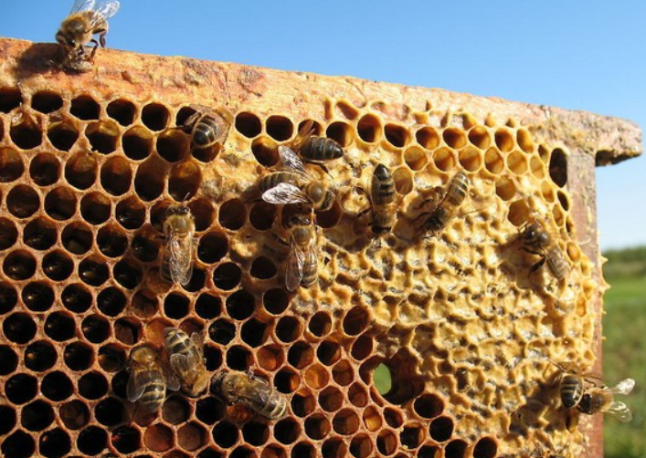

## hive

蜂箱、蜂房

  

`Bees produce honey in the hive` => 生产者、消费者
`a hive of activity：喧闹的场所` => Activity活动、四大组件

### 拼写接近

Live(生活、现场)

Dive(潜水、跳水)

Jive(支支吾吾)
> Don't jive me,tell me the truth.
> Don't lie to me, tell me the truth.

Drive(驾驶、推动)

Rive（撕裂）
> 古老而不常见，常用“tear”和“split”
> "The storm had such force that it could rive the ship's sails apart."=> 一场风暴非常强烈，以至于它能够将船帆劈开。

Give（给予）

Wive（娶妻）
> 古老动词，wife代表老婆

Hike（徒步旅行）

## fall off

fall: 下降、掉落
off：离开、分离

### 含义

减少：数量、强度、程度的逐渐减少
> 某方面从一个状态、程度，移开的结果
> "After the holiday season, customer traffic at the store tends to fall off, leading to a quiter period for the staff."

掉落：掉落，并离开本来的位置
> "As I was carrying the groceries【杂货】 into the house, a bag【袋子】 accidentally slipped【滑落】 from my hands and fell off the table.【从桌子上掉落】"
> "当我正拿着杂货走进屋子时，一个袋子不小心从我的手中滑落并从桌子上掉到了地上。"

衰退：从较好的状态向下移动，代表衰退和减弱
> "Over the years, the popularity of traditional print newspapers has fallen off as more people turn to digital sources for their news."

## wont

习惯、倾向、惯例
> 这个词在这个语境中通常用于正式或文学性的表达。
> 用法相对较少，更倾向于用`habit、custom`
> "He has a wont【习惯】 for rising early【早期】 and going for a jog【慢跑】 before work"

## endeavor

n/v 努力、尝试做某事, 强调付出努力去达成的目标

动词： "She will endeavor to complete the project ahead of schedule."
名词： "Their endeavors in the field of medical research have led to significant breakthroughs."

## Inventory

"Inventory" 是一个名词，表示存货、库存或清单。这个词的起源可以追溯到拉丁语中的 "inventarium"，它由 "invenire"（找到、发现）一词衍生而来。最初的含义是指通过清点或列举找到的物品，即一份详细的清单。

这个词在商业和管理领域中广泛使用，用于描述一个企业或机构所拥有的物品、商品或资源的列表。在日常生活中，"inventory" 也可以指个人或家庭拥有的物品的清单，如家庭用品、食品等。

因此，"inventory" 这个词的产生与对物品进行计数、记录和管理的需求有关。在商业和贸易活动中，了解和维护清晰的库存是有效经营的关键。

> “list goods on inventory”把货物列入清单
> “take inventory【清单】 every day” 每日盘点

## elevation

"Elevation" 是一个名词，它有几个相关的含义：

提高或提升： 在物理或地理上，"elevation" 可以指地面或物体相对于某一点的高度。
> "The elevation of the mountain peak is 2,000 meters."（这座山峰的海拔是2,000米。）

抬升或提拔： 在抽象的意义上，"elevation" 还可以表示精神、品质或道德上的提升。
> "His kindness and generosity are an elevation of his character."（他的善良和慷慨是他品格的提升。）

## bear up

鼓起勇气

bear：承受、人手
up：站起来、挺住

bear up：面对压力挑战和困难，继续雄起，就是要鼓起勇气，不要被打败

> She bears up in face of difficuties

## plight

困境

"Plight" 这个词的来源可以追溯到古英语中的 "pliht"，其意思是 "危险"、"困扰" 或 "局势"。这个词最初来自古英语的 "plihtan"，意为 "置于困境中" 或 "使陷入危险"。

随着时间的推移，"plight" 的含义逐渐演变，扩展到表示困境、状况、问题或境地。

> "The refugees【难民】 are in a desperate【绝望】 plight【困境】, lacking basic necessities."

## husk

皮、外壳
“corn husk”（玉米苞）
“coconut husk”（椰子外壳）

## Biome

生物学上术语：有个游戏【伊始之地】中有这个单词

## promptly

"Promptly" 是一个副词，表示迅速、敏捷、及时地完成某事。这个词通常用于描述在没有延迟或拖延的情况下，立即或迅速采取行动。

例如：

"He responded promptly to the email, addressing the issue within minutes."
（他立即回复了邮件，在几分钟内解决了问题。）

"Please arrive promptly at 9 AM for the meeting."
（请在上午9点准时参加会议。）

"Promptly" 用来强调及时性，强调事情的迅速执行，而不拖延。

