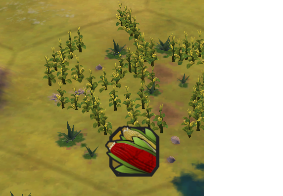

# 《文明6》

1、Maize
  

玉米

maize和corn的关系？
1. Maize英式英语，corn泛指一切鼓舞
2. corn美式英语和maize都是玉米

2、animal husbandry
> 1. husbandry:对资源的管理、照顾和利用
> 养殖业

3、astrology
> 占星术

4、 scout：侦查员

5、explorer：探险家、发现者

6、Tribal village：部落的村庄

7、melee strength：近战力量
> melee：法语单词，英语中演变为近战或混战

8、spread：v 传播 n 距离、传播范围

9、reconnaissance：军事术语，侦查行动

10、barbarian radier：野蛮+袭击者

11、plaguing this land
> 负面的，持续的，困扰、破坏和问题
> 此处翻译为：持续对该地区造成严重的影响

12、stronghold：军事上，堡垒要塞

13、our city continues to prosper：动词，繁荣兴盛

14、our people thrive：茁壮成长、繁荣、兴旺发达
> 更强调生长和成功，更注重持续发展和茁壮成长
> 不仅仅是短期的成功或繁荣

15、diplomatic relationship：外交关系

16、envoy：使者、代表、特使

17、over time：随着时间推移

18、have faith in：对魔忍有新人、信心、相信（强调乐观和信念的态度）

19、cultivate good relationships：发展关系

20、enacting new policies：指定、实施新政策

21、wait your decree：等待您的法令、命令、决定（文学或者古老用语，不常见）

22、civic：adj 城市的、公民的

23、give you an appreciation【理解、认识 understanding】 of the...

24、crops：粮食作物、蔬菜、水果、工业作物

25、embark：表示开始、踏上新的工程或建设项目

26、tune our production techniques：调整我们的生产技术（adjust）

27、are eligible【有资格、有条件】 to be granted【给予授予】 a promotion【晋升】

28、choose a patheon【一系列神的合集】 to worship【崇拜】

29、marsh【沼泽】、oasis【绿洲】、floodplain【泛滥平原】

30、prophet：先知

31、loyalty：忠诚

32、amenities：便利设施、服务

33、outpost：前哨站

34、a system of lords【君主】 and vassals【臣民】

35、amber：琥珀

36、stable：动物马厩

37、caravel：15~17世纪，三桅帆船
