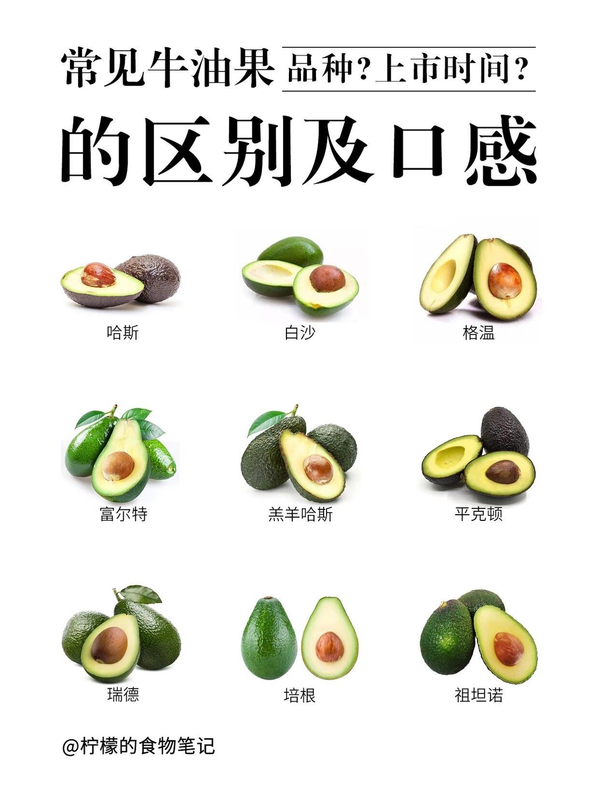
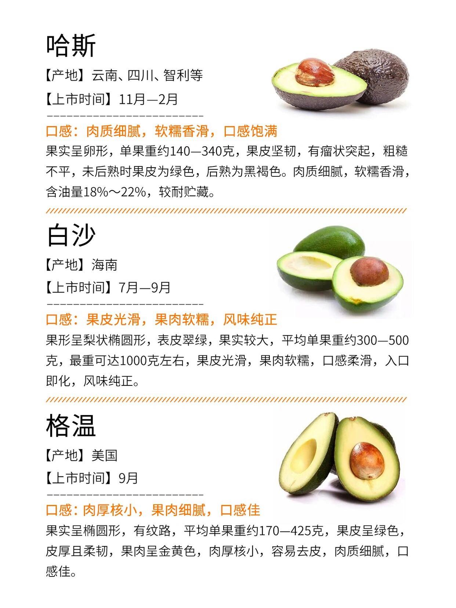
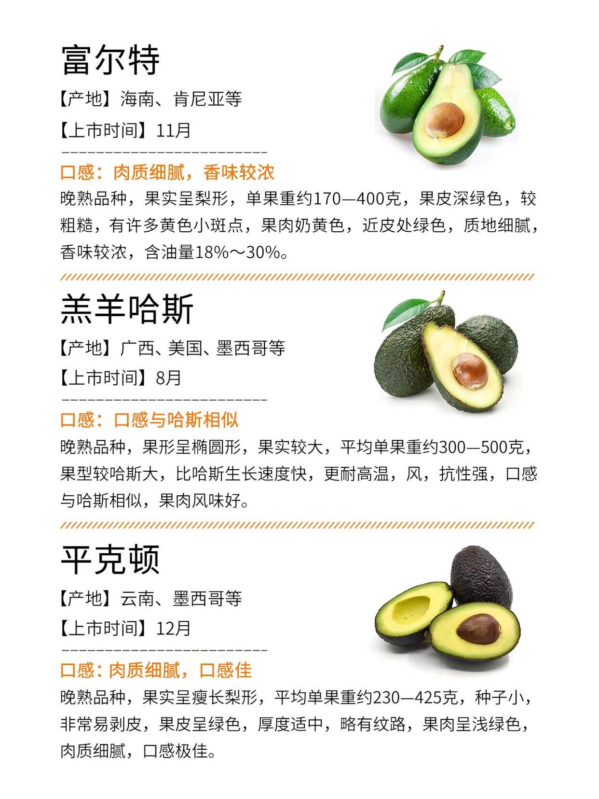
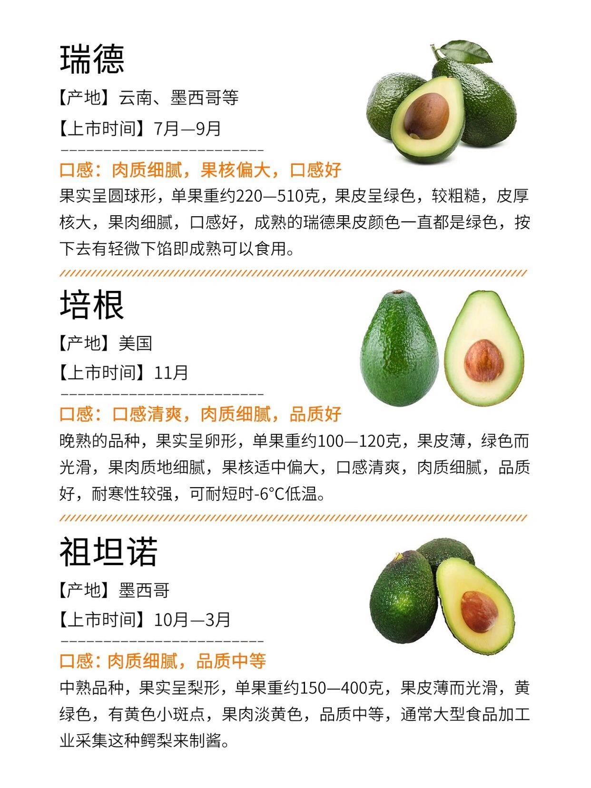

[TOC]

数量：15
1.11-1 16 (毛泽东食物)
1.10-6个 蛋糕相关
1.9-1 牛油果的成熟
1.8-1 文学百科
1.7-1 车厘子的由来
1.6-1 紫色
1.5-1 牛油果的食用量
1.4-1 云南牛油果
1.3-1 榴莲相关
1.2-1 牛油果相关
1.1-1（牛油果和榛子营养成分对比）

# 食物百科

## 1、牛油果的品种

  

  

  

  

## 2、榴莲品种

贵族：猫山王、苏丹王
平民：金枕
顶级贵族：黑刺D200 2斤800RMB

01泰国金枕
 泰国金枕是泰国最常见、最受欢迎的榴莲品种之一，也被称为金枕头或韶子。金枕头以其果实大、肉多且甜而闻名，初尝时有异味，而复尝时则清凉甜蜜，回味无穷。

02猫山王
猫山王是马来西亚特有的一种榴莲品种，因其产自猫山而得名。猫山王榴莲呈姜黄色，果肉细腻，带有凝脂般的质感，口感干爽而饱满，甘甜可口。外形、色泽、肉质近乎完美。
 

03泰国青尼
泰国青尼是一种个头呈蒸笼型的榴莲品种，果实中间肥大，头细底平，瓣槽较深，果蒂大而短，肉质细腻，呈深黄近杏黄色，产量丰富，口感甜润，核小且少。
 
04苏丹王
苏丹王是榴莲界的顶尖品种之一，被誉为仅次于猫山王的第二大榴莲品种。它以产量大、味道浓郁、果肉绵软而闻名。苏丹王的外表金黄色，肉质厚实，口感密实绵干，非常受欢迎。

05泰国甲仑
泰国甲仑是泰国最原始的榴莲品种之一，没有经过太多现代化的改良，口感浓郁，是泰国最原始的榴莲品种。

06红肉榴莲
红肉榴莲是马来西亚主流的榴莲品种，它具有高甜度和纯红肉的口感。它的果实呈金黄色，略偏红，并且带有草药的味道。
 
07泰国托曼尼
泰国托曼尼是一种榴莲品种，因其独特外形和香甜软糯的口感而闻名。它个头小，皮厚，种子大，无需开裂即可食用。经过成熟后，托曼尼榴莲的香味更加浓郁，纤维更少，特别香甜软糯。
 
08泰国长柄榴莲
泰国长柄榴莲因为果柄比其他品种要长而得名，这种榴莲的果柄长且圆，整颗榴莲也以圆形为主，皮青绿色，刺多而密，果核大，果肉少但细腻而味浓。
 
09红虾
红虾是榴莲中的一种品种，果肉呈橙红色，果刺稀疏，口感顺滑可口，苦甘味极浓。
 
10D198 金凤
榴莲有多个品种，其中D198金凤是一种外形小巧，核扁肉厚的榴莲品种，果肉偏黄白色，口感甜中带涩，带有淡淡的花香。

11干尧
干尧榴莲是马来西亚极品猫山王榴莲嫁接过去的，外形椭圆偏长形，有下巴，屁股尖有凸出来，颜色呈果肉胶状，全熟的果包很鲜艳的金黄色，口感冰淇淋般的柔滑口感，软糯香甜、细腻嫩滑。干尧榴莲的果柄很长。
 
12葫芦
葫芦是由它看似葫芦型的外表命名的，果体小，果壳偏黄，刺密而尖锐。果肉呈黄色，特点在于厚实而口感绵密顺滑。果核也是非常小，但是味道甜中略微偏苦。
 
13黑刺
黑刺榴莲是一种名贵的榴莲品种，被誉为“水果之王”。它的果实呈奶油状，非常甜，口感极佳。黑刺榴莲只适合在高原气候种植，产量极低。
 
14泰国谷夜套
泰国谷夜套是泰国榴莲的一种品种，果肉特别细腻，甜如蜜，核尖小，非常受食家的欢迎。它的价格相对较高，是品质最好的榴莲之一。
 
15XO
榴莲的品种有XO、马来西亚的XO榴莲、新加坡的XO榴莲、D24榴莲、薄薄的棕。其中，XO榴莲外形小巧，刺短，果肉呈现淡黄色，口感细腻柔软，微涩有苦味，就像法国白兰地。
 
16D24
榴莲的品种有很多，其中D24是一种外形小巧、颜色淡黄色的榴莲品种，果肉密集，色泽较浅。口感甜美，带有焦糖味和轻微的苦味。
 
17竹脚
竹脚是一种榴莲品种，颜色淡黄，特点是一排排的黄色颗粒状体。口感苦甜，榴莲味适中。
 
18坤宝
坤宝榴莲是一种非常漂亮的鲜橙颜色，具有浓郁的芳香和微苦的味道。它生长的树龄越大，产生的榴莲越苦甜。因此，坤宝榴莲被誉为“榴莲果之首”。
 
19甲必利榴莲
甲必利榴莲是一种呈圆形的榴莲，果实外表小巧玲珑，每个重0.5~1千克，非常适合作为榴莲糖心。它的口感非常甜美，同时带有一点苦味，非常适合饕客品尝。
 
20龟榴莲
龟榴莲是一种外观酷似小版本的榴莲，果实多堆积在树干的基部。其得名原因是因为这种榴莲的果实离地面非常低，甚至有乌龟都能咬上一口。

## 3、牛油果和云南孟连县

亚洲牛油果之都——孟连
孟连县属南亚热带气候，年均气温20.7摄氏度，年均降雨量为1733.4毫米，全年日照2183.5小时，部分地区属于喀斯特地貌，土壤蓄水能力较弱的地貌特点都满足了牛油果根系“需要水分但不能积水”的种植要求。

八年研发实践发现，云南省普洱市孟连县与“世界牛油果之都”墨西哥气候极为相似，有望成为“亚洲牛油果之都”。
 
“牛油果需要水，但是根部又不能积水，所以我们找来找去，就发现孟连这里的喀斯特地貌非常适合种种植，所以从选点到试种、推广，一直扎根在孟连，这里可能是全国牛油果最佳种植地。”普洱孟连的某牛油果农户说。
  
通过引种繁育，目前全县种植面积达19779亩。其中，2000亩牛油果已进入盛果期，预计明年总产量将达4000吨。
2007年，孟连傣族拉祜族佤族自治县开始试种牛油果。13年过去了，这“颗”牛油果实现了从枝头到餐桌，从孟连到全国。
 
牛油果是一种速生常绿阔叶乔木树种，能将土壤转化为黑褐色潮湿的有机质土壤，改善生态环境、保护水土流失，还能产生可观的经济效益外。
 
菜谱：牛油果烤鸡蛋
把牛油果切半，去核后打入鸡蛋，放入烤箱180度，烤15分钟，烤好后撒入海盐和胡椒粉，让你吃出西餐的经典味道。
 
刚收到的牛油果大多是青色的，还有点硬，千万不要放进冰箱冷藏，一旦未经催熟的鳄梨被冻硬后，就很难催熟了。可以在阴暗背光的地方放置几天，表皮变成黑红色，捏一捏有点软，这样就可以吃了。

## 4、牛油果的摄入量

1.牛油果脂肪含量高达15%，一个牛油果中大概就有 25 克脂肪热量相当高。
2.一颗牛油果的热量差不多是一杯珍珠奶茶的热量。
3.牛油果和牛油果油真的不是宝宝的最佳食物。
4.牛油果富含钾。肾功能异常的人，不建议摄入过多高钾食物，避免引起代谢异常。
5.喜欢其味道的可以适当吃一点，成人每天最好不要超过半个，婴幼儿能少吃则少吃吧。

## 5、车厘子的由来

车厘子（英文名：Cherries）是欧洲甜樱桃栽培品种。 
音译自英语单词Cherries（即樱桃），特指产于美国、加拿大、智利等美洲国家的个大皮厚樱桃。 
车厘子是上市最早的一种乔木果实，号称“百果第一枝”。 
落叶灌木果树，车厘子多呈暗红色，也有红、黄色，直径较大，新鲜的车厘子较硬，果柄较长。 
车厘子原产于美国、加拿大、智利等美洲国家，中国山东、安徽、江浙等省有引种。 
喜光、喜温、喜湿。其适宜在光照充足，年平均气温15℃左右，年降雨量700～1000毫米，土壤质地疏松，pH6～7的微酸性至中性或微弱碱性的砂质土壤中生长。 
车厘子鲜红的颜色除了因为铁离子，还因为含有丰富的花青素、原花青素、叶黄素和玉米黄质等多酚类抗氧化物，能够对抗细胞损伤、减少炎症，起到抗氧化、抗衰老、预防慢性病、促进整体健康的作用。车厘子的含糖量不高，升糖指数只有22，热量较低且不含钠，所以是糖尿病、高血压人群的较好选择。 

## 6、牛油果的采摘到成熟要多久？
未成熟的牛油果：采摘后，常温下7天成熟，放在只带或者呼吸物品中的密闭空间内2~6天成熟（乙烯浓度更高）
成熟的牛油果：常温3~5天，冷藏7~14天

## 7、蛋糕是什么时候诞生的？

如今英语中使用的“cake”一词，大约于英国13世纪时出现，来源于古北欧语“kaka”。
蛋糕的原始称呼是“甜的面包”，古罗马时代的食谱就记载了这种“甜的面包”的做法。

埃及人：历史上第一个蛋糕，和现在样子完全不一样，算是加了蜜糖的面包（埃及人发明了烘烤）
10世纪意大利人：10世纪左右砂糖成为流通的商品随贸易交流进入意大利，“蛋糕”才慢慢向如今的模样靠拢。
13世纪法国人：法国人奠定了现代蛋糕的基础，他们于13世纪时使用杏仁制作水果馅饼
17世纪：将鸡蛋加入了制作配方中，同时期又令奶油蛋糕成为流行风尚
19世纪：小苏打和发酵粉的出现，令烘焙业得以飞速发展，蛋糕的制作方式、形状和味道都发生了巨大的变化。

## 8、蛋糕分为多少种？

海绵蛋糕
戚风蛋糕
磅蛋糕（重油蛋糕）
乳酪蛋糕
慕斯蛋糕
天使蛋糕

## 9、拿破仑蛋糕和拿破仑到底是什么关系？

没有关系。拿破仑蛋糕的名字是“Mille-feuille”，在法语中意为“千层酥”。中文称其为“拿破仑蛋糕”是直译的英文名称“Napoleon”（英国）及“NapoleonSlice”（加拿大）；而英文名称实际来源于法语中“Napolitain”一词，该词将意大利那不勒斯的名字“Naples”变化为形容词意指“那不勒斯的”，而这种糕点酥皮的做法正好来自那不勒斯。

> 来源于“那不勒斯”（意大利）

## 10、戚风蛋糕是谁发明的？

著名的戚风蛋糕据说是1927年由一个叫作亨利·贝克的美国人发明的，当时他只卖给明星和著名的BrownDerbyRestaurant。1947年他把配方卖给了通用磨坊食品公司（GeneralMills,Inc.），1948年该公司在《BetterHomesandGardens》杂志上公开了配方并举办了戚风蛋糕大赛，令其风靡全球。戚风蛋糕的特别之处在于它将蛋黄和蛋白分开打发，并用植物油代替了传统的酥油，成品口感轻盈，是真正意义上的蛋糕新品种。

## 11、玛德琳蛋糕如何成为了传奇？

必须要感谢普鲁斯特在书中提到它。于是现在凡是讲到玛德琳蛋糕必然要提起普鲁斯特。坦白地说，即使没有普鲁斯特，这款口味纯朴、造型小巧的蛋糕也一样大受欢迎。其实大仲马在《厨艺字典》中也给了它多达3页篇幅的介绍。这款蛋糕来自**法国洛林地区**，不使用鲜奶油和果酱作为装饰，据说最初的制作者是一位名叫**玛德琳**的女孩。

## 12、天使蛋糕是什么？

天使蛋糕（angel cake，或angel food cake）于19世纪在美国开始流行起来。跟巧克力恶魔蛋糕（chocalate Devil's food cake）是相对的，但两者是完全不同类型的蛋糕。当时发明了泡打粉（baking powder），因此有许多新发明的蛋糕，天使蛋糕和巧克力恶魔蛋糕就是同时期出现的，后者大量添加可可粉和巧克力、牛油。
天使蛋糕与其他蛋糕很不相同，其棉花般的质地和颜色，是靠把硬性发泡的鸡蛋清、白糖和白面粉制成的。不含牛油、油脂，因而鸡蛋清的泡沫能更好地支撑蛋糕。

天使蛋糕需要专门的天使蛋糕烤具，通常是一个高身、圆筒状，中间有筒的容器。

天使蛋糕不含油脂，因此口味和材质都非常的轻。天使蛋糕很难用刀子切开，刀子很容易把蛋糕压下去，因此，通常使用叉子、锯齿形刀以及特殊的切具。

# 日常百科

## 1、紫色是如何提取的？

工业文明前，颜色的提取只能依靠天然染料。天然染料分为三类：植物性染料、矿物类染料和动物性染料。比起前两种来，动物性染料的获取更加困难，成本更高。

西方：
在19世纪以前，紫色染料主要提取自一种海螺的粘液，这种染色螺的腮下腺能分泌紫色素的前体和催化这种前体的酶，这些物质会随着染色骨螺的粘液排出体外，经过阳光暴晒，这些黏液就会变成紫色。
据说1万个海螺才能提炼出1克的紫色染料

东方：
在我国古代，紫色染料基本上都来自一种叫做“紫草”的植物，紫草根富含的植物色素可以固着在布匹上，但想要确保染在布匹上的紫不脱色，需要反复多次浸染固色。
繁复不说，紫草根的“产能”也很低，染液怕高温，只能在秋冬季节才能染出均匀靓丽的紫色。这样苛刻的出品条件，也决定了它的造价。
娇贵的紫色对织物的材质还很挑剔，一般的棉麻质地染出来的紫色是暗淡无光的，只有附着在丝绸之上，才能闪现出它的艳丽色泽。

# 文学百科

## 1、屠格涅夫

屠格涅夫(1818-1883)是俄罗斯文学史上最卓越的作家之一。尽管在政治上他没有达到革命民主主义的高度，是一位温和的自由主义启蒙家，但他坚决反对专制农奴制度及其残余，他的作品的主导倾向是爱国主义的，充满了人民性。

# 人物百科

## 2、毛主席喜欢吃的事物

毛氏红烧肉
扣肉
米粉肉（6块都不够吃）
肘子
水爆猪肚
辣子鸡丁
叫花鸡
小鱼油炸
炒龙肠
萝卜丝炒虾米
鱼头炖豆腐（胖头鱼）

