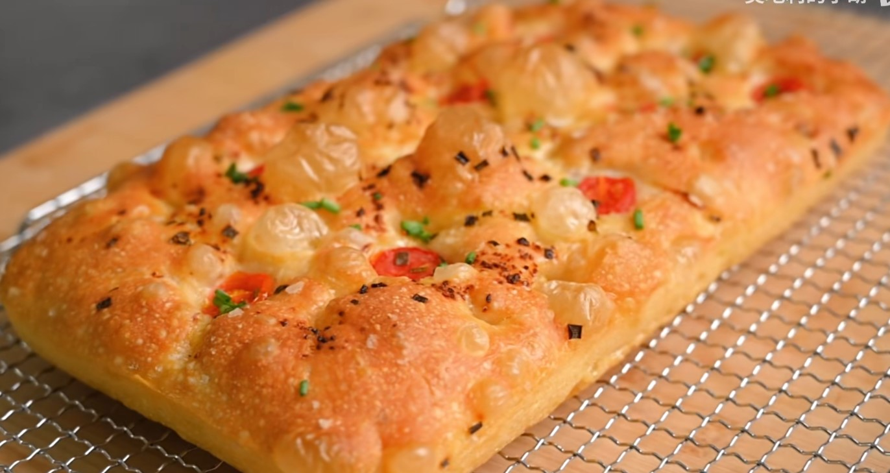
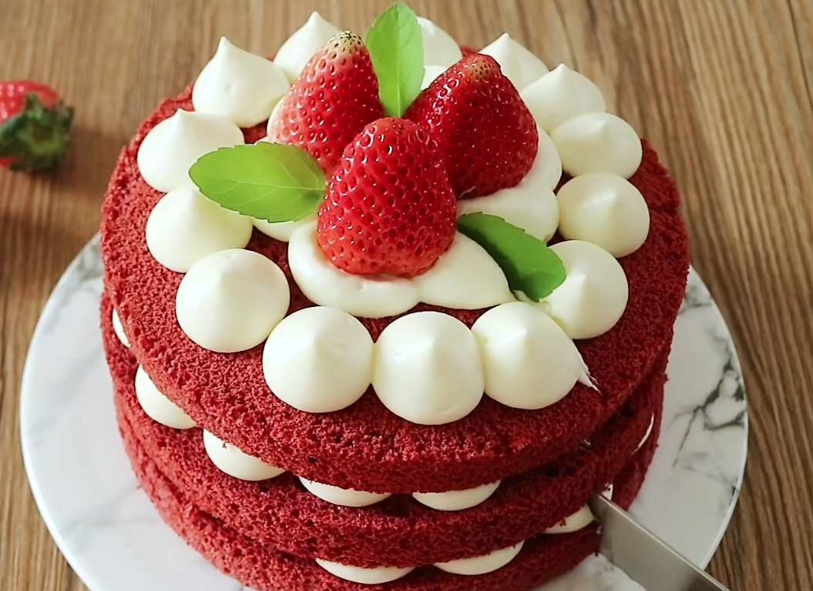
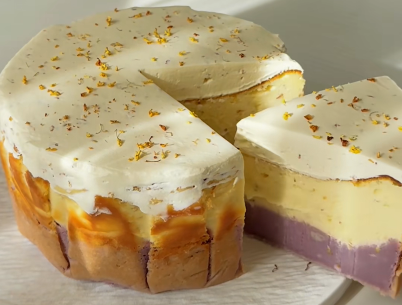
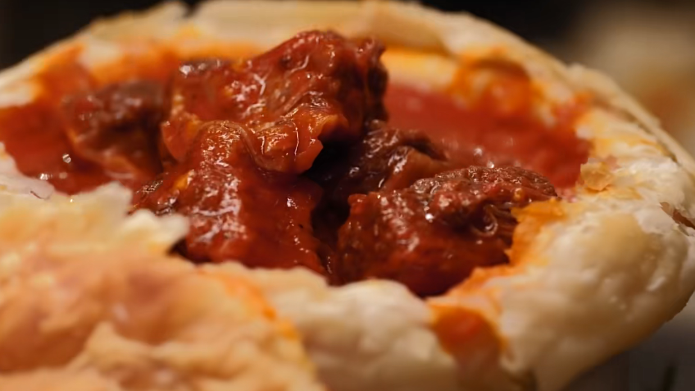

# 扬帆远航⛵️新食谱

[toc]

220-315

## 饮品
1. >椰椰烧仙草
2. 焦糖玛奇朵💕
3. 椰香甜酒拿铁💕
4. 椰香甜酒乌龙💕
5. 椰香奶绿💕
6. >焦糖燕麦抹茶拿铁
7. 抹茶厚椰芒芒
8. >多肉葡萄
9. 燕麦丝绒拿铁💕
10. 瑞幸丝绒拿铁💕
11. 单份意式浓缩
12. 双份意式浓缩
13. 🇺🇸美式咖啡
14. Lungo咖啡
15. >🇮🇹浓缩玛奇朵
16. 🇪🇸西班牙可塔朵/短笛拿铁
17. 🇦🇺🇳🇿馥芮白/澳白
18. 🇮🇹卡布奇诺
19. 拿铁咖啡
20. >冰意式咖啡
21. 冰卡布奇诺
22. 🇦🇺🇳🇿冰澳白
23. 🇮🇹意式阿芙佳朵💕
24. 🇬🇷希腊泡沫冰咖啡
25. 摩卡咖啡☕️
26. 椰椰洋打芒💕
27. 芒果奶昔
28. 山楂拿铁
29. 生椰青提
30. 椰云拿铁🥥
31. 厚乳拿铁
32. 厚乳生椰拿铁
33. 牛油果🥑酸奶奶昔
34. 烤奶💕
35. 米酒

## 鸡尾酒🍸
1. 百加得鸡尾酒
2. 得其利
3. >盐狗salty dog
4. 雪国Yukiguni
5. 破冰船ice breaker
6. 君度乌龙
7. 君度气泡美式
8. 君度乘橙
9. 西柚气泡君度💕
10. 姜汁气泡君度
11. >君度多多
12. 生椰君度
13. >B52轰炸机✈️
14. 柠檬糖🍋💕
15. >高潮orgasm
16. >百利咖啡冷萃
17. >百利清椰
18. >百利红丝绒椰子桶
19. >百利草莓🍓椰林飘香
20. >百利奶茶
21. >百利酸奶燕麦杯
22. >百利冰摩卡
23. >百利热巧
24. 百利酒香奶油阿芙佳朵
25. 百利酒香巧克利阿芙佳朵
26. >百利海盐焦糖芝士蛋糕风味阿芙佳朵
27. >百利甜草莓🍓奶油蛋糕
28. >百利甜春日樱花特调奶油蛋糕
29. >百利甜红丝绒奶油蛋糕
30. 椰林飘香🥥🍍
31. 椰子朗姆酒🥥
32. >迈泰MaiTai
33. >曼哈顿
34. >尼格罗尼
35. 冰块纯饮威士忌🥃
36. 威士忌highball
37. 威士忌酸🥃
38. >🇯🇵水割威士忌
39. 威士忌可乐桶
40. 威士忌姜啤/姜汁气泡
41. 苹果威士忌🍎
42. 蓝色玛格丽特
43. >paloma帕洛玛
44. 蓝色夏威夷
45. 🇯🇵长岛冰茶
46. 螺丝刀🍊
47. 黑俄罗斯
48. >血腥玛丽bloody marry
49. >沙滩性爱🏖
50. 边车sidecar
51. Balalaika巴拉莱卡
52. >教父🥃
53. >粉红佳人
54. Gimlet吉姆雷特
55. >🇸🇬新加坡司令
56. >古典鸡尾酒🥃
57. MintJulep薄荷朱莉普
58. >Sazerac萨泽拉克
59. >床第之间
60. 美人鱼mermaids
61. >白兰地亚历山大
62. >杰克玫瑰jackrose🌹
63. 君度可乐
64. 百香果气泡君度
65. 昼夜👿
66. 小青柠汁白朗姆
67. 小青柠汁龙舌兰
68. 金可乐💕
69. 🇩🇪热红酒🍷
70. 卡曼橘百香果SIMPLY FUN金酒
71. 卡曼橘百香果龙舌兰
72. 卡曼橘百香果威士忌🥃
73. 柠檬覆盆子Belvoir金酒
74. 柚子青柠莫吉托Belvior金酒👿

## 甜品
1. 椰椰烤布丁💕
2. 南瓜巴斯克🎃💕
3. >南瓜布丁🎃
4. 锡纸烤苹果🍎
5. 锡纸烤梨🍐
6. 蜂蜜坚果烤小布里/金文🧀💕
7. 卡仕达酱
8. >外交官奶油
9. 🇺🇸纽约芝士蛋糕
10. 轻乳酪蛋糕（马斯卡彭版）
11. 提拉米苏：火龙果
12. >提拉米苏：莓大莓小
13. >提拉米苏：百芒之中
14. >圣诞限定圣诞树蛋糕🎄
15. 圣诞限定圣诞树桩蛋糕🎄
16. 芒果酥
17. 电饭煲蛋糕🍰
18. 山姆青柠芝士蛋糕
19. >炙烤柠香芝士蛋糕🍰
20. >奥利奥蓝莓芝士蛋糕
21. 红薯巴斯克💕
22. 桂花芋泥巴斯克💕
23. 小岛流美舒芙蕾芝士蛋糕
24. >佛卡夏
25. >雪山乳酪包
26. 红丝绒蛋糕
27. >白宫总统红丝绒蛋糕
28. >柠檬巴巴露亚
29. >轻乳酪蛋糕
30. >圣诞曲奇
31. >紫米雪芙包
32. >冬日限定抹茶雪顶蛋糕
33. >肉桂苹果烤奶酥

## 中/东亚餐
1. 🇹🇭泰式香茅鸡💕
2. 🇹🇭泰式罗勒炒肉沫
3. 芒果泥炒包菜
4. 年糕排骨煲
5. 肉松拌饭
6. 🇰🇷韩式辣豆腐汤
7. 炒年糕
8. >🇹🇭泰式香兰叶包鸡
9. 🇰🇷韩式芝士排骨
10. 🇰🇷韩式芝士牛排/腊肠💕
11. 孜然猪肉
12. 番茄牛腩🍅💕
13. >板栗排骨焖饭🌰
14. 板栗五花肉焖饭🌰
15. 手抓饼酱香饼
16. >酱香排骨（豆瓣酱蒸排骨）
17. 牛排土豆💕
18. 酱香鸡腿
19. 酱焖豆腐
20. >酱香土豆炒腊肠
21. >云南百香果炖鸡
22. 牛排葱香炒饭
23. 🇰🇷韩式南瓜粥🎃
24. 牛排串烧烤🐮💕
25. 豆瓣酱洋葱炒蛋💕
26. 豆瓣酱炒花菜
27. 喼汁鸡翅
28. 腊肠羊肚菌焖饭💕
29. 滑鸡羊肚菌焖饭
30. 榴莲酥
31. 锡纸花甲💕
32. 孜然蒜香烤羊腿
33. 芝麻菜青酱意面💕
34. 葱油拌面💕
35. 阳春面💕
36. 民国美龄粥
37. >牛腩牛筋萝卜煲
38. 咸肉豆腐白菜煲
39. 青蒜炒咸肉
40. 铁锅炖大鹅
41. 清湯牛腩
42. 日式咖喱牛腩💕
43. 韩式牛腩💕
44. 紫苏焖排骨
45. 青椒辣子鸡
46. 青椒辣子牛
47. 葱油香菇蒸滑鸡
48. >肥牛香葱饼
49. 茶香排骨🍵
50. >🇹🇭泰式火山排骨
51. >豪华牛肋条🐮盖饭
52. 椰香咖喱大虾
53. 香菜菠萝烤牛肉🍍
54. 芒果酸奶咖喱鸡
55. >白灼牛肋条
56. >牛肋条汤
57. 小炒黄牛肉
58. 小炒扇贝肉
59. 新疆牛肉黑抓饭
60. >新疆皮辣红
61. >辣椒炒肉
62. 尖椒鸡💕
63. 尖椒牛🐂💕
64. 山姆葱香牛肋条💕
65. >湘菜灵魂-安东仔鸡
66. 湘菜灵魂-安东仔牛
67. >🇨🇳上海罗宋汤
68. 罗宋汤（鸡肉版）
69. 青椒炒香干
70. >毛豆鸡蛋
71. 罐焖牛肉
72. 黄豆酱炒娃娃菜
73. 小茴香叶蛋饼
74. 黄豆酱炒乌菜（腊肠）
75. 西芹炒虾仁
76. 宫保虾球
77. 干焅大明虾
78. 蜜汁酥皮虾
79. >锅包大虾
80. 三文鱼刺身
81. >茴香蒸鸡

## 西餐
1. 🇫🇷法式柠檬🍋纸包鱼
2. >🇮🇹意式柠檬🍋嫩煎鸡排
3. 黄芥末炖鸡💕
4. 黄芥末烤鸡💕
5. 黄芥末煎鸡
6. 芝士焗南瓜鸡丁🎃
7. >黄芥末烤羊排
8. 黄芥末慢烤法式鸭胸
9. 南瓜红烩饭🎃💕
10. 木乃伊香肠💕
11. 🇫🇷勃艮第红酒炖牛肉
12. 🇬🇧英式凝脂奶油💕
13. 黄芥末凉拌青瓜木耳
14. 柠檬黄芥末蜂蜜鸡丁💕
15. >🇮🇹意式黄芥末烤鸡腿
16. 🇮🇹番茄🍅奶酪焗鸡肉丸💕
17. 🇮🇹番茄🍅奶酪焗牛肉丸
18. 🇮🇹番茄🍅奶酪焗金枪鱼肉丸
19. 🇭🇺匈牙利炖牛肉💕
20. 🇫🇷羊肚菌奶油炖鸡❄️💕
21. 🇫🇷法式苹果炖鸡🐔
22. 蘑菇拉东炒面💕
23. 厚烤土豆💕
24. 🇫🇷🇧🇪Paindepices香料蛋糕🍞🍰
25. 🇫🇷🇧🇪黑啤🍺炖牛肉
26. >🇧🇷巴西烤肉
27. 🇮🇷伊朗姜黄炖鸡腿Khoresht Morgh💕2
28. 🇫🇷香煎法国银鳕鱼
29. 🇨🇳清蒸银鳕鱼
30. 🇦🇷阿根廷炸牛排
31. 🇹🇷土耳其阿达纳烤肉Adana💕
32. 🇸🇦阿拉伯烤鸡饭Kasba
33. >🇸🇦阿拉伯烤羊饭Kasba
34. 🇮🇱🇲🇦以色列/摩洛哥烤鸡塔吉锅Tagine
35. 🇲🇽墨西哥莎莎酱salsa
36. 🇲🇽墨西哥牛油果酱Guacamole
37. 🇲🇽墨西哥牛排塔可Taco
38. >🇮🇷伊朗菠菜蛋煎饼
39. 🇷🇸塞尔维亚肉沫土豆饼💕
40. >🇸🇳塞内加尔mafe
41. 🇹🇳突尼斯古斯古斯面
42. >🇪🇨厄瓜多尔ceviche柠檬凉拌虾🦐
43. 🇭🇷克罗地亚派
44. 🇶🇦卡塔尔沙威玛shawarma
45. >🏴󠁧󠁢󠁷󠁬󠁳󠁿威尔士兔子马芬
46. 🇵🇰巴基斯坦土豆饼
47. 🇳🇱荷兰宝贝松饼Dutch baby💕
48. 🇦🇺澳大利亚牛肉派Aussie beef pie
49. >🇶🇦卡塔尔MAJBOOS
50. MAJBOSS-鸡杂版
51. 🇲🇽鸡肉墨西哥卷饼chicken burrito
52. 🇮🇷伊朗牛肉豆角饭loobia polo
53. 🇮🇷伊朗羊小腿lamb shank
54. 🇺🇸工业风底特律披萨
55. 🇮🇳印度咖喱羊肉
56. >🇲🇽墨西哥炖辣肉beef chili
57. 🇺🇸感恩节鼠尾草蒜香烤鸡🌿🦃
58. >🇦🇪中东烤茄泥baba ghanoush
59. >🇦🇷阿根廷烤饺子🥟Empanada
60. >🇮🇷伊朗藏红花塔青tahchin
61. 🇫🇷法式洛林咸派
62. >🇹🇷土耳其披萨船turkish pide
63. 🇬🇧英国牧羊人派
64. 榴莲披萨
65. >🇮🇹意式玛格丽特披萨🍕(那不勒斯)
66. >🇺🇸美式墨西哥辣椒披萨
67. >🇺🇸三重芝士披萨
68. >🇫🇷法国火腿披萨
69. >🇮🇹意大利帕尔马火腿披萨
70. 🇺🇾🇫🇷红酒烩乌拉圭牛尾💕
71. 红酒烩排骨
72. 🇧🇷巴西椰奶虾🥥🦐
73. 🇦🇷阿根廷青酱牛排
74. 🇬🇧约克郡布丁（霍格沃兹版）
75. 🇲🇦摩洛哥速炒鹰嘴豆
76. 🇫🇷法式酥皮奶油蘑菇浓汤💕
77. >🇧🇷巴西芝士面包
78. 芥末虾球
79. 🇮🇹意式肉酱
80. >🇮🇹肉酱千层面
81. 🇬🇷希腊穆萨卡Moussaka
82. >🇧🇷巴西黑豆饭
83. 🇧🇷巴西coxinhas
84. >🇧🇷巴西烩饭
85. >🇧🇷巴西法罗法Farofa
86. 奶油番茄浓汤🍅
87. >🇺🇸三文鱼甜虾波奇饭
88. 绿豆蔻咖喱鸡
89. 金枪鱼肉酱
90. 油浸番茄
91. 法式龙虾浓汤
92. 布里欧修面包💕
93. 菠萝烤肋排

# 2023年末电子食谱

[TOC]

## 烘焙

### FOCACCIA-佛卡夏
> 意大利经典面包、免揉

|食材|比例|步骤|
|---|---|---|
|1、温水|320g|1）盆中+1|
|2、酵母粉|3g|2）+2，按顺序搅拌均匀|
|$~~~~~$盐|7g|硅胶铲搅拌至没有干面粉，盖盖静置30min|
|$~~~~~$橄榄油|12g|每面拉伸，翻面，盖盖静置30min|
|$~~~~~$高筋面粉|400g|折叠一次，盖盖静置30min，二次折叠，盖盖冷藏过夜|
|3、蒜蓉橄榄油||3）烤盘刷油，面团拉伸铺满，盖保鲜膜，21度静置1h至2倍大。+3淋上|
|4、烟熏海盐||4）+3撒上|
|5、小番茄||5）手抓出佛卡夏形状，+5|
|$~~~~~$小葱||预热230度烤箱，20~25min，出炉可补充葱花|

### APPLE CRUMBLE（肉桂苹果烤奶酥）

> 4人份，2人减半

|食材|比例|步骤|
|---|---|---|
|1、苹果（维纳斯甜度高）| 4个| 1、切成块
|2、柠檬| 半个| 2、+半个柠檬汁，擦黄皮
|3、糖| 10g| 3、+3。倒入烤盘铺匀，【备用】
|肉桂粉| 1大勺
|4、面粉| 150g| 4、拌匀
|糖| 70g
|坚果碎| 若干
|5、黄油| 90g| 5、4+5（切小块）用手揉捏搓散，直至沙粒感。铺平到烤盘上。180度40min（或者表面均匀上色）
|6、*香草冰淇淋| |6、1盘+1勺

### 布里欧修面包

> 2个450g吐司
> 吐司的天花板

|食材|比例|步骤|
|---|---|---|
|1、高筋面粉| 500g|  1、所有原料加入厨师机，快速搅拌至厚膜。
|糖| 75g
|盐| 7g
|鲜酵母| 15g
|橙皮| 1个
|蛋黄| 50g
|鸡蛋| 150g
|牛奶| 150g
|2、黄油| 150g| 2、先+1/2，慢速，差不多融合之后，+1/2，形成薄膜。揉搓光滑，28度发酵40min。分割成6个揉|圆盖布松弛20min。
|3、吐司模具450g| 2个| 3、一个擀长，捏边，卷起来。放入吐司模具32度1h-1.5h（盖盖），发酵至8~9分满，刷牛奶，剪刀快速剪一下，刀口挤一点黄油。上150度下190度中下层烤25min，最后5min盖上油布。出炉震动几下，倒出放凉。

## 甜点

### 雪山乳酪包

|食材|比例|步骤|
|---|---|---|
|1、高筋面粉 |300g|1、+1至揉面缸中，低速成团，中高速搅打6min|
|$~~~~~$砂糖|30g
|$~~~~~$酵母|3g
|$~~~~~$海盐|3g
|$~~~~~$炼乳|30g
|$~~~~~$牛奶|190~195g
|2、黄油（软化）|25g|2、+2中高速搅打8min；揉圆，发酵箱室温发酵1-1.5h；排气分割成6份。揉圆盖布静置15min；收口朝上擀至长方形，从宽方向卷起捏好收口，成圆柱，搓长至17-18cm；35度发酵40-50min|
|3、鸡蛋液||3、二发结束后，刷上+3|
|4、芝士片|6片|4、放上4。放入烤箱预热180度中层，15min；面包对半切开|
|5、奶油奶酪|150g|5、盆中+5混合，打软|
|$~~~~~$砂糖|15g|
|$~~~~~$海盐|1g|
|6、淡奶油|100g|6、分次+6打至7分发
|7、奶粉||7、面包抹上馅料，粘住，连接处抹上馅料。在奶粉中滚一圈。|

### 红丝绒蛋糕

  

> 6寸

|食材|比例|步骤|
|---|---|---|
|【蛋糕体】|
|1.低筋面粉| 40g| 1、混合筛入，可可粉可不加。
|红曲米粉| 6g
|*可可粉| 3g
|2.无盐黄油| 25g| 2、隔水融化
|3.温牛奶| 35g| 3、+3搅拌至乳化，筛入+1，搅拌匀
|4.蛋黄| 3个| 4、+4，搅匀，至面糊细腻有光泽，常温保存，避免凝固。
|5.蛋白| 3个| 5、5中速打发，有大泡时+1/3的6，细小泡+1/3的6，蛋白有纹路时+1/3的6。低速至干性发泡（短小直立尖角）
|柠檬汁| 1g
|6.细砂糖| 50g| 6、分三次将蛋白霜+蛋黄糊中，翻拌均匀。倒入6寸模具中，震动消泡，烤箱下层，上下火150度 45min。烤网震动，倒扣1h冷却。脱模后，分割成3层。
|【馅料】|
|7.奶油奶酪| 100g| 7、1.软化+2.打至顺滑+3打至发硬。放入裱花袋。
|细砂糖 |15g
|淡奶油| 100g
|8、草莓 |7个| 8、一层蛋糕一层馅料+草莓片，最上层裱花，放上3个草莓。装饰上薄荷叶。
|薄荷片| 3片

### 桂花芋泥巴斯克☑️💕

> 6寸

  

|食材|比例|步骤|
|---|---|---|
|1.芋头(蒸熟)| 300g |1、盆中+1，打成泥。 放入6寸模具底部铺平。**🤓太湿润了，可以少一半液态。也许是芋泥里面太多油了？**
|$~~$淡奶油| 100g
|$~~$牛奶| 80g
|$~~$炼乳| 45g
|$~~$紫薯粉| 6g
|2.奶油奶酪| 250g| 2、盆中+2打发均匀
|$~~$桂花蜜| 70g
|3.鸡蛋| 2个 |3、+3打匀。打入模具，烤箱，210度20min**盖上锡纸160°150min**。冷藏2h。**考虑可以冷冻2h**
|$~~$淡奶油| 180g
|$~~$玉米淀粉| 8g
|4.淡奶油| 100g| 4、打发涂抹到巴斯克顶部。
|$~~$桂花蜜| 10g

### 白宫总统红丝绒蛋糕

> 8寸，奥巴马夫人最爱
> 建议半糖

|食材|比例|操作|
|---|---|---|
|1、无盐黄油| 170g|   1）混合打发白
|$~~~~~$砂糖| 280g
|2、大鸡蛋| 4个|  2）+2，打散分次加入（温度不能太低）
|3、香草精| 5g| 3）+3
|$~~~~~$盐| 2.5g
|$~~~~~$苹果醋/柠檬汁| 5g
|4、可可粉| 12g| 4）+4，混合
|$~~~~~$红丝绒液| 50g
|$~~~~~$温水| 50g
|5、酪乳（白脱牛奶）|240ml| 5）+5，混合
|6、面粉| 350g| 6）+6，混合后分次筛入混合。正方形烤盘放纸，倒入，180度45min。晾凉后切下边缘，分切成2片。
|$~~~~~$小苏打| 6g
|7、奶酪霜：||  7）1软化+一半2打发，+3+4+一半2，打发至3倍大（超级蓬松）
|$~~~~$1.无盐黄油| 50g
|$~~~~$2.糖粉| 220g
|$~~~~$3.奶油奶酪| 225g
|$~~~~$4.香草精| 5g
|8、组装|| 8）一片蛋糕，抹上霜，一层蛋糕，抹上霜，周围抹面。表面裱花（波浪），擦上蛋糕碎屑

### 柠檬巴巴露亚蛋糕

|食材|比例|操作|
|---|---|---|
|1、柠檬黄皮| 7g| 1、小火加热到微微起泡，过滤掉柠檬皮
|$~~~~~$纯牛奶| 200g
|2、蛋黄| 2个| 2、打发至发白，+1搅拌均匀，倒回锅中，小火加热到微微发黏。
|$~~~~~$糖| 10g
|3、吉利丁片| 5g| 3、+3（泡好），搅拌融化，【3备用】
|4、淡奶油| 100g| 4、打发至浓稠酸奶状，加入【3】混合均匀。倒入两个杯子中，冷藏4h
|$~~~~~$糖| 8g

### 轻乳酪蛋糕

> 6寸戚风磨具

|食材|比例|操作|
|---|---|---|
|1.奶油奶酪| 100g| 1、软化
|2.牛奶| 80g| 2、+2（60度）搅拌均匀
|3.黄油| 25g| 3、+3搅拌至融化
|4.鸡蛋黄| 3个| 4、+4搅拌匀
|5.低筋面粉| 25g| 5、+5筛入，搅拌至没有干粉。过筛两遍。一个大容器+50度水，放入盖了保鲜膜的蛋黄糊。盖好保温。
|$~~~~~$玉米淀粉| 15g
|6.鸡蛋白| 3个| 6、打发至刚出现纹路，提起鸡尾状。将蛋白霜分三次加入蛋黄糊。翻拌匀。
|$~~~~~$细砂糖| 30g
|$~~~~~$柠檬汁| 几滴
|7.烤箱 || 180度预热。模具底部放纸，底部四周刷上油。高处倒入+6。烤盘中倒入热水，垫上纸后放上模具（避免漂浮）中下层。上火180下火150，10min；再上下火150，20min；再上下火130，30min。冷藏。

### 圣诞曲奇
|食材|比例|操作|
|---|---|---|
|1、黄油| 200g| 1、+1拌匀
|细砂糖| 100g
|2、牛奶| 50g| 2、分三次加入，打至蓬松发白
|3、低筋面粉| 250g| 3、筛入，拌匀
|杏仁粉| 50g
|盐| 2g
|4、红丝绒液| |4、分一部分+4
|5、烤箱|| 5、风炉模式160度预热。红色面糊挤出帽子。原味面糊挤出小熊形状。160度20min。
|6、*巧克力|| 6、白巧克力装饰小熊，黑巧克力挤出眼睛嘴巴。

### 紫米雪芙包

|食材|比例|操作|
|---|---|---|
|1、【冷藏发酵中种】|| 1、揉成面团，冬天室温发酵1h，再冷藏12h以上，看状态（打开是网状组织）
|高筋面粉| 175g
|鸡蛋| 50g
|水| 66g
|酵母| 2g
|2、【主面团】||2、1撕开+2，3挡成团，5挡揉出粗膜。
|高筋面粉| 75g
|奶粉| 15g
|糖| 30g
|酵母| 1g
|牛奶| 56g
|3、软黄油| 20g| 3、+3，揉出手套膜。室温松弛30min。分为80g面团6份。揉圆保鲜箱松弛15~20min
|盐| 3g
|4、紫米| 200g| 4、浸泡一夜，煮熟，
|5、糖| 25g| 5、趁热+5混合，分一半放凉。面团擀成圆形，加入馅料，收口捏紧。
|炼乳| 25g
|椰子油| 15g
|6、八角模具|| 6、放入6中，发酵至1.5倍大？不确定
|7、【雪芙皮】||7、搅匀，倒入裱花袋。挤到发酵好面团上。170度25~30min。
|黄油| 20g
|糖粉| 15g
|牛奶| 20g
|低筋面粉| 20g

### 冬日限定抹茶雪顶蛋糕

|食材|比例|操作|
|---|---|---|
|1、玉米油| 35g| 1、微波炉加热1min
|2、抹茶粉| 8g| 2、+2搅匀
|3、牛奶| 70g| 3、+3搅拌至充分乳化
|4、低筋面粉| 60g| 4、+4筛入，搅拌至无干粉
|5、鸡蛋黄| 4个| 5、+5搅拌匀
|6、蛋清(冷)| 4个| 6、分三次加入白糖，打发至有小弯钩的状态【八分发】。取1/3加入到蛋黄糊中，拌匀。蛋黄糊倒回蛋白中，翻拌匀。
|柠檬汁|
|糖| 30g
|7、烤盘28*28|| 7、倒入面糊，铺平，震出大气泡。预热好150度烤箱，30min。出炉震出空气，撕开油布（毛巾面）
|油布|
|8、【蛋糕夹心】|| 8、打发至硬挺状态，抹在蛋糕光面上，擀面杖辅助卷起来，紧一些。冷藏2h以上定型。切掉两头，分为4份。
|淡奶油| 150g
|白糖| 10g
|9、【淋面】|| 9、打发至浓稠，淋到蛋糕上。
|淡奶油| 100g
|白糖| 8g
|10、无花果干|| 10、装饰
|清香木

▶️湿性发泡,七分,蛋白挺立,尾部有鸡尾一样的弧度,蛋白细腻有光泽。
▶️中性发泡,八分,蛋白成小弯钩状态,蛋白有清晰的纹理。
▶️干性发泡,九分,蛋白成小尖角状态
▶️打发过度,十分,蛋白有点成豆腐渣状态

### 小嶋流美芝士蛋糕

> 既有舒芙蕾的云朵般轻盈口感
> 也有芝士蛋糕的浓郁顺滑

|食材|比例|操作|
|---|---|---|
|1、奶油奶酪| 80g| 1、碗中+1，热水浴，搅拌至充分融化。
|黄油 30g
|牛奶 100ml
|2、蛋黄| 3个| 2、+2搅拌均匀
|3、低筋面粉| 10g| 3、+3搅拌均匀，过筛，【蛋黄糊】
|玉米淀粉| 20g
|4、蛋清| 3个| 4、4打发，分多次加入白砂糖。至湿性发泡。【蛋白糊】取1/3和蛋黄糊翻拌匀，剩下混合翻拌匀。
|柠檬汁| 2ml
|白砂糖| 60g
|5、6寸模具|| 5、蛋糕糊倒入9分满。放到烤盘上，烤盘中倒入热水。上火180度，下火110度。烤30min。改为上火150度下火110度 60min。倒扣取出蛋糕，冰箱冷藏一夜。🆘【🟥是否需要考虑中下层开始烤？上层上色太快了🟥】
|油纸

## 亚洲菜
### 罐焖牛肉☑️

> 俄罗斯经典

  

|食材|比例|步骤|
|---|---|---|
|1、牛胸肉/牛窝肉/腰窝肉/牛腩||1、3cm小方块|
|2、西芹||2、+2，抓匀，腌制20min。平底锅+油，大火烧热，+1煎|
|$~~~~~$洋葱| 半个|
|$~~~~~$胡萝卜| 半个|
|$~~~~~$盐
|$~~~~~$红酒
|$~~~~~$白兰地/伏特加
|$~~~~~$香叶
|$~~~~~$黑胡椒碎
|$~~~~~$百里香|||
|3、黄油||3、+3小火+1煎，+2炒
|4、鸡汤、牛肉粉】黄汁粉||4、+4没过食材，小火炖2h or 高压锅30min（【留肉】【过滤留汤】）
|5、胡萝卜块|| 5、油炸5，至边上微微焦黄。【备用】
|$~~~~~$土豆块
|$~~~~~$芹菜
|6、黄油|| 6、小火+6煸香 9
|$~~~~~$蒜末
|7、洋葱|| 7、+7炒熟，+肉汤，+
|$~~~~~$西红柿|
|$~~~~~$番茄酱|
|8、盐||8、 +8调味，+肉，+配菜，熬到汁浓
|$~~~~~$糖
|$~~~~~$百里香
|9、黄油||9、 +9，增亮增香
|10.瓦罐||10、 瓦罐+牛肉+酥皮。180度 10min左右至金黄即可。
|$~~~~~$酥皮|

### 虾

#### 宫保虾球

> 流行，糖醋口
> 😄个人体验750g用这一份正好

|食材|比例|步骤|
|---|---|---|
|1、大虾| 750g| 1、去壳、开背、去虾线，不斩筋。碗中放水+3勺，清洗（更脆嫩，内部更有味道）。完全擦干水分
|盐| 2勺
|2、黄酒|| 2、虾+2
|白胡椒粉| 一点
|盐| 一小勺
|3、水淀粉|| 3、能拉成粗线（传统糊），抓匀。【浆】
|油| 1勺
|4、干淀粉|| 4、虾上浆，裹上干淀粉。油锅5成热（150~180度），炸定型后出锅（外表是白色的一点黄）。油需要过滤掉渣滓，避免炸黑。然后复炸（可以在炒菜的时候炸）
|5、白糖| 60g| 5、5拌匀
|米醋 |17g
|保宁醋（饺子醋）| 17g
|生抽|38g
|黄酒| 20g
|老抽| 3g
|白胡椒粉| 少许
|水| 30g
|6、大葱白| 若干| 6、+6（一点）【宫保汁，适用于一半虾，约375g，约10只】
|姜片| 若干
|蒜片| 若干
|7、水淀粉| 一碗| 7、+7少许
|8、青花椒|| 8、凉油下8，炸香，捞出
|9、干辣椒|| 9、+9炒香，+6（剩余）炒香，+【宫保汁】翻炒，大火，+7少许，熬浓稠，【尝味道】，看情况也可以烹醋（少点）。
|10、花生米|| 10、+虾翻炒，烹入炸虾热油翻炒，+10翻炒
|11、红油|| 11、淋11，翻炒几下，出锅

#### 干焅大明虾

> 开国第一宴

|食材|比例|步骤|
|---|---|---|
|1、大虾| |1、剪去虾枪，虾头，去掉虾囊，去虾腿，去一节虾尾分支，剪开虾背。凉油下虾，中火煎至两面变色，出锅【备用】
|2、葱白丝| |2、凉油，+2，冒泡，倒入+1
|姜丝
|3、矿泉水| 1勺| 3、+3 盖盖2min30s（底部有汤汁）
|黄酒| 2勺
|盐| 3g
|胡椒粉| 适量
|白砂糖| 20g
|4、白砂糖| 5g| 4、焅完+4，翻炒，摆盘
|5、香油| |4、锅底+2+4，收汁，淋上。+绿叶摆盘

#### 蜜汁酥皮虾

> 北京街头名菜，味道最好。
> 肉鲜嫩、外皮酥脆
> ☀️经验之谈：750g虾用3份

|食材|比例|步骤|
|---|---|---|
|1、白虾| |1、剪去虾脚、去虾枪、开虾背（蝴蝶虾的感觉）、去虾线、斩断虾筋、水冲洗一下
|2、大葱| |2、+2 抓匀，腌制
|姜|
|黄酒 |适量
|胡椒粉| 少点
|盐| 小勺
|3、【蜜汁-3份】| |3、中小火，熬化，可以存储4~5天。
|苹果醋| 45g
|米醋 |75g
|白醋| 15g
|冰糖| 50g
|白糖 |50g
|盐| 1小勺
|4、糖桂花| 20g| 4、关火+4
|蜂蜜| 20g
|5、油| |5、1虾肉蘸干淀粉，虾皮不能碰到。6~7成油热，炸虾，红彤彤捞出，高温复炸就捞出。油过滤。
|干淀粉
|6、干辣椒| |6、锅洗干净，过一下油，倒出。中火+6炒一下。倒入【3、蜜汁】大火炒出黏糊感，加入虾，翻几下。出锅，摆盘。
|葱末
|蒜末
|姜末
|7、*花花草草| |7、仰头，翘尾。

#### 锅包大虾

|食材|比例|步骤|
|---|---|---|
|1、大明虾| |1、去虾头（留着熬汤），去虾壳，留虾尾，开背去虾线，刀拍一下更松散，再斩断虾筋，再拍一下。摆好盘。
|2、盐| 一丢丢| 2、撒2
|胡椒粉| 一丢丢
|3、黄酒| |3、拍进去【不要抓匀会抓碎】
|柠檬汁|
|4、土豆淀粉| |4、泡2h。稀一点（锅包肉干一点），放入虾。
|5、白砂糖| 70g |5、搅匀【酱汁】，先放固体，再放液体。
|盐| 5g
|白醋| 70g
|生抽| 2g
|香油 |1g
|香菜茎| 若干
|6、油| |6、6~7成热，放入虾（糊不要太厚），飘起来，需要拖着下，避免沉下去变形。定型后取出。8成热，加入（红白相间最好。）
|7、葱丝| |7、底油+7，炒，加入虾。再加入【酱汁】翻几下。速度菜慢会导致回软。摆盘。
|姜丝
|胡萝卜丝
|蒜片

#### 西芹炒虾仁

|食材|比例|步骤|
|---|---|---|
|1、西芹| |1、削皮刀挂掉外层老皮，斜切成段。
|2、虾仁| |2、剥出虾仁，开背去虾线
|3、料酒| |3、+3腌制。油热炒虾仁。
|盐
|白胡椒粉
|4、姜| |4、+1炒+4炒
|蒜
|5、耗油| |5、要出锅时，+5翻炒。全程大火。

### 茴香蒸鸡【人民大会堂】

> 凉菜、热菜都可以

|食材|比例|步骤|
|---|---|---|
|1、三黄鸡| 800g| 1、洗净，去屁股，去脚趾，去翅尖
|2、盐| 3勺| 2、表面2勺搓均匀，肚子1勺
|3、大葱| 10g| 3、塞入肚子
|姜| 10g
|4、小茴香| 10g |4、撒在表面和肚子。腌制1夜，或者2~4h。水开后，中火，上鸡蒸40min。放冷后，鸡腿去骨，摆盘。
|花雕酒| 10g

### 黄豆酱

#### 黄豆酱炒白菜

1、油炒香2勺黄豆酱
2、+白菜丝炒匀
3、+耗油

#### 黄豆酱炒乌菜（腊肠）

1、油煎香腊肠【备用】
2、油炒香2勺黄豆酱
3、+白菜丝炒匀
4、+耗油，翻炒均匀

#### 黄豆酱蒸鱼

#### 黄豆酱炒青菜

#### 黄豆酱肉末茄子

### 米酒

|食材|比例|步骤|
|---|---|---|
|1、糯米| 500g| 1、浸泡一夜。加入电饭煲，水比煮米饭少一些，煮米
|2、米曲| 1包| 2、糯米放温，加入米曲搅拌，加一点温水。盖上保鲜膜
|3、发酵箱| |3、3x度，48小时

### 小茴香叶蛋饼

|食材|比例|步骤|
|---|---|---|
|1、小茴香| 1把| 1、去根切碎
|2、鸡蛋| 5个| 2、+2
|3、葱碎| |3、+3
|红椒碎|
|小米椒碎|
|4、盐| |4、+3拌匀。油热倒入煎好一面，翻面煎。定型后，打碎炒一下。
黑胡椒

## 西餐

### 绿豆蔻咖喱鸡 Cardamon Chicken Curry with Caramelized Butter

|食材|比例|步骤|
|---|---|---|
|1、鸡腿肉| 200g| 1、切一口大小块，抹满酸奶
|鸡胸肉| 200g|
|无糖酸奶| 120g
|2、无盐黄油| 60g| 2、2+3，小火加热，要沸腾时离火，避免烧焦
|3、香料A：|
|绿豆蔻| 4粒（2g）
|丁香| 4粒（0.4g）
|肉桂枝/桂皮| 1根
|月桂叶/香叶| 1片
|干辣椒 |2个
|小茴香| 1/2tsp（2g）
|4、白洋葱丝| 中等1个| 4、黄油变深冒泡时+4迅速翻炒
|5、大蒜末| 20g| 5、洋葱半透明时+5，炒至整体焦糖色。
|生姜末| 20g
|6、香料B：|| 6、+6翻炒匀，+1中火炒变色
|香菜籽粉| 1+1/3tsp（5.92ml=9.472g）
|姜黄粉| 2/3tsp（ 3.33ml=1.665g）
|Gram Masala| 2tsp（10g）
|盐| 1tsp（10g）
|7、炖煮：|| 7、+7，中大火煮开，小火盖盖炖煮20min。大火收汁浓稠。
|鲜奶油| 120g
|番茄罐头| 300g
|水| 400ml
|8、黑胡椒 |少许| 8、+8调味
|盐| 酌情

### 油浸小番茄

|食材|比例|步骤|
|---|---|---|
|1、小番茄 |1000g| 1、切片摆在烤盘上，预热120度。
|2、盐| 微量| 2、撒上2，120度热风1.5h（半干）-2.5h（全干）
|黑胡椒| 微量
|3、橄榄油| 300ml| 3、小火+3，炸香，离火冷却
|蒜片| 1整个
|迷迭香| 2枝
|4、玻璃瓶| |4、4中+1+3，油浸没小番茄，冷藏一夜

### 法式三文鱼酱(Rillettes de salmon)

> 柔滑，和脆皮法棍是绝配。
> 入口咸香、奶香
> 适合聚会、自己涂抹、很fresh

|食材|比例|步骤|
|---|---|---|
|1、白醋| 20g |1、开水+1
|盐| 3g
|2、三文鱼肉| 250g| 2、+2，煮4min，捞出。放凉后去皮。
|3、奶油奶酪| 40g| 3、盆+2压碎+3
|4、莳萝碎| 5g| 4、+4，搅拌均匀
|小葱碎| 3g
|小干葱碎| 15g
|5、盐| 适量| 5、+5拌匀，放入容器。冷藏30min。点缀上莳萝。
|黑胡椒| 适量
|柠檬汁| 半个

### 法式龙虾浓汤

> 破壁机只能打碎几下，不能太碎。或者用茶叶、咖啡滤纸进行过滤。

|食材|比例|步骤|
|---|---|---|
|1、波士顿龙虾| 500gx2只| 1、放尿
|2、盐| |2、清水+2，水开后煮龙虾。+1，最重的为准100g=1min。捞出龙虾，汤汁过滤备用。龙虾剥壳，取出完整大钳子。虾尾肉切大块，去掉虾腮虾胃。
|胡椒 
|香叶 |2片
|干白葡萄酒 |50ml
|3、橄榄油| |3、将虾壳煸焦香。
|4、洋葱块| 半个| 4、+4翻炒
|胡萝卜块| 半根
|西芹块| 1根
|黄油| 1块
|5、白兰地| 50ml| 5、+5点火燃烧，烧去酒精，留存香气。
|6、番茄膏| 1大勺| 6、+6翻炒均匀
|7、面粉| 1勺| 7、+7翻炒均匀
|8、干白葡萄酒| 50ml| 8、+8+足量汤汁
|9、大蒜 |几瓣| 9、+9盖盖，小火炖煮30min。加入破壁机打碎。过滤掉残渣。
|百里香| 1只
|盐 |少许
|胡椒| 少许
|10、淡奶油| 200ml| 10、+10煮开汤汁，煮到汤汁浓稠。加碎虾肉回锅。
|11、盐| |11、调味
|胡椒
|12、黄油| |12、黄油小火煎香大块虾肉。
|13、香草| |13、摆盘：放上龙虾肉，倒入龙虾浓汤，浇上淡奶油，摆上绿色几片香草。

### 托斯卡纳三文鱼

|食材|比例|步骤|
|---|---|---|
|1、三文鱼排| 2块| 1、彻底擦干表面水分。
|2、橄榄油| |2、起锅前（1）两面撒盐.充分热锅，热油，下（1）。耐心一会儿再翻面。
|盐
|3、黄油| 1块| 3、留底油，+3，
|4、洋葱碎| 半个| 4、煸炒4，
|大蒜碎 
|5、油浸番茄碎| 适量| 5、+5翻炒几下
|6、小番茄| 若干| 6、+6翻炒
|7、白葡萄酒| 小半碗| 7、+7煮开，去除酒精
|8、淡奶油| 150ml| 8、+8小火煮（不能大火）
|牛奶| 150ml
|9、盐| |9、+9调味
|黑胡椒
|10、菠菜| 1把| 10、+10，放上（1），将汤汁不断淋在表面，浓稠后，出锅。（汤汁可以搭配面包、意面等）

### 菠萝烤肋排

> 🪂注意：该酱料1000g就够了，不用更多

|食材|比例|步骤|
|---|---|---|
|1、伊利比亚猪肋排| 1000g| 1、背面花刀，撕掉筋膜
|2、盐| 1tsp(5ml)|  2、2混合，涂抹在肋排两面，锡纸包裹，腌制4h。烤箱上下火160度，放入烤90min
|大蒜粉| 1tbsp(15ml)
|辣椒粉| 1tsp
|甜椒粉| 1tsp
|黑胡椒粉| 1tsp
|红糖| 5tsp
|3、黄油| 1块| 3、锅热，炒香3
|洋葱碎| 30g
|大蒜碎| 30g
|4、番茄酱| 40g| 4、倒入+5，搅拌匀转小火
|伍斯特辣酱油| 15ml
|苹果醋| 15ml
|蜂蜜| 20ml
|水| 80ml
|甜椒粉| 5g
|5、菠萝碎| 50g| 5、+5，小火炒软烂。加入料理机打碎。刷在肋排两面，上下火220度，烤10min。

# 已做清单
1. 椰香甜酒拿铁💕
2. 椰香奶绿💕
3. 焦糖玛奇朵💕
4. 椰椰烤布丁💕
5. 燕麦丝绒拿铁💕
6. 🇹🇭泰式香茅鸡💕
7. 抹茶厚椰芒芒
8. 拿铁咖啡
9. 🇮🇹意式阿芙佳朵💕
10. 🇦🇺🇳🇿馥芮白/澳白
11. 得其利
12. 芒果泥炒包菜
13. 🇮🇹卡布奇诺
14. 椰香甜酒乌龙💕
15. 百加得鸡尾酒（粉红得其利）
16. 单份意式浓缩
17. 双份意式浓缩
18. 🇺🇸美式咖啡
19. 黄芥末炖鸡💕
20. 黄芥末烤鸡💕
21. 黄芥末煎鸡
22. 椰椰洋打芒💕
23. 生椰君度
24. 君度乘橙
25. 椰林飘香🥥🍍
26. 君度气泡美式
27. 蓝色玛格丽特💕
28. 年糕排骨煲💕
29. 🇯🇵长岛冰茶🍸
30. 冰块纯饮威士忌🥃
31. 威士忌可乐桶
32. 🇰🇷韩式辣豆腐汤💕
33. 炒年糕💕
34. 🇹🇭泰式罗勒炒肉沫💕
35. 螺丝刀🍊
36. 威士忌highball
37. 威士忌酸🥃
38. 苹果威士忌🍎💕
39. 黄芥末炖虾
40. 破冰船ice breaker
41. 西柚气泡君度💕
42. 西柚气泡朗姆
43. Balalaika巴拉莱卡
44. 君度可乐
45. 百香果气泡君度
46. 美人鱼
47. 🇰🇷韩式芝士排骨
48. 肉松拌饭
49. 君度乌龙
50. 黑俄罗斯
51. 芒果奶昔
52. 山楂拿铁
53. 边车sidecar
54. 百利酒香奶油阿芙佳朵
55. 孜然猪肉
56. 姜汁气泡君度
57. 冰卡布奇诺
58. 🇦🇺🇳🇿冰澳白
59. 🇪🇸西班牙可塔朵/短笛拿铁
60. 生椰青提
61. 昼夜👿
62. Lungo咖啡
63. 威士忌姜啤/姜汁气泡💕
64. MintJulep薄荷朱莉普💕
65. Gimlet吉姆雷特💕
66. 芝士焗南瓜鸡丁🎃
67. 青柠白朗姆
68. 柠檬糖🍋💕
69. 金可乐💕
70. 黄芥末慢烤法式鸭胸
71. 🇬🇷希腊泡沫冰咖啡
72. 板栗五花肉焖饭🌰
73. 椰云拿铁🥥
74. 蓝色夏威夷💕
75. 南瓜红烩饭🎃💕
76. 木乃伊香肠💕
77. 南瓜巴斯克🎃💕
78. 番茄牛腩🍅💕
79. 🇰🇷韩式芝士牛排/腊肠💕
80. 🇬🇧英式凝脂奶油💕
81. 手抓饼酱香饼
82. 🇫🇷勃艮第红酒炖牛肉
83. 牛排土豆💕
84. 蘑菇拉东炒面💕
85. 🇮🇹番茄🍅奶酪焗鸡肉丸💕
86. 瑞幸丝绒拿铁💕
87. 厚乳拿铁
88. 厚乳生椰拿铁
89. 酱香鸡腿
90. 酱焖豆腐
91. 牛排葱香炒饭
92. 🇰🇷韩式南瓜粥🎃
93. 🇫🇷羊肚菌奶油炖鸡❄️💕
94. 牛排串🥩烧烤💕
95. 厚烤土豆💕
96. 🇭🇺匈牙利炖牛肉💕
97. 锡纸烤苹果🍎
98. 雪国Yukiguni
99. 🇫🇷法式苹果炖鸡🐔
100. 🇮🇹番茄🍅奶酪焗牛肉丸
101. 🇮🇹番茄🍅奶酪焗金枪鱼肉丸
102. 蜂蜜坚果烤小布里🧀💕
103. 柠檬黄芥末蜂蜜鸡丁💕
104. 🇫🇷🇧🇪Paindepices香料蛋糕🍞🍰
105. 豆瓣酱洋葱炒蛋💕
106. 豆瓣酱炒花菜
107. 🇮🇷姜黄炖鸡腿Khoresht Morgh💕
108. 🇫🇷香煎法国银鳕鱼
109. 🇨🇳清蒸银鳕鱼
110. 🇫🇷法式柠檬🍋纸包鱼
111. 🇫🇷🇧🇪黑啤🍺炖牛肉
112. 轻乳酪蛋糕（马斯卡彭版）
113. 提拉米苏：火龙果
114. 喼汁鸡翅
115. 🇳🇱荷兰宝贝松饼Dutch baby💕
116. 🇸🇦阿拉伯烤鸡饭Kasba
117. 黄芥末凉拌青瓜木耳
118. 椰子朗姆酒🥥
119. 🇷🇸塞尔维亚肉沫土豆饼💕
120. 腊肠羊肚菌焖饭💕
121. 🇮🇷伊朗牛肉豆角饭loobia polo
122. 🇲🇽墨西哥莎莎酱salsa
123. 🇲🇽墨西哥牛油果酱Guacamole
124. 🇲🇽墨西哥牛排塔可Taco
125. 🇺🇸感恩节鼠尾草蒜香烤鸡🌿🦃
126. 🇦🇺澳大利亚牛肉派Aussie beef pie
127. 🇹🇷土耳其阿达纳烤肉Adana💕
128. 🇬🇧约克郡布丁（霍格沃兹版）
129. 🇮🇳印度咖喱羊肉
130. 🇫🇷法式酥皮奶油蘑菇浓汤💕
131. 锡纸烤梨🍐
132. 榴莲酥
133. 芒果酥
134. 🇫🇷法式洛林咸派
135. 🇶🇦卡塔尔沙威玛shawarma
136. 电饭煲蛋糕🍰
137. 🇩🇪热红酒🍷
138. 🇮🇱🇲🇦以色列/摩洛哥塔吉锅Tagine
139. 🇬🇧英国牧羊人派
140. 🇺🇾🇫🇷红酒烩乌拉圭牛尾💕
141. 🇲🇦摩洛哥速炒鹰嘴豆
142. 卡仕达酱
143. 🇺🇸纽约芝士蛋糕
144. 圣诞限定圣诞树桩蛋糕🎄
145. 🇺🇸工业风底特律披萨
146. 锡纸花甲💕
147. 🇮🇷伊朗羊小腿lamb shank
148. 山姆青柠芝士蛋糕💕
149. 红酒烩排骨
150. 孜然蒜香烤羊腿
151. 🇹🇳突尼斯古斯古斯面
152. 🇲🇽鸡肉墨西哥卷饼chicken burrito
153. 摩卡咖啡☕️
154. 🇦🇷阿根廷炸牛排
155. 葱油拌面💕
156. 阳春面💕
157. 榴莲披萨
158. 🇵🇰巴基斯坦土豆饼
159. 芝麻菜青酱意面💕
160. 法式芝麻菜青酱炒饭💕
161. 🇧🇷巴西椰奶虾🥥🦐
162. 滑鸡羊肚菌焖饭
163. 民国美龄粥
164. 芥末虾球💕
165. 奶油番茄浓汤🍅
166. 🇧🇷巴西coxinhas
167. 🇮🇹意式肉酱
168. 🇬🇷希腊穆萨卡Moussaka
169. 🇭🇷克罗地亚派
170. 红薯巴斯克💕
171. 青蒜炒咸肉
172. 清湯牛腩
173. 日式咖喱牛腩💕
174. 咸肉豆腐白菜煲
175. MAJIBOOS鸡杂版
176. 铁锅炖大鹅
177. 韩式牛腩💕
178. 🇦🇷阿根廷青酱牛排
179. 紫苏焖排骨
180. 牛油果🥑酸奶奶昔
181. 青椒辣子牛🐮
182. 青椒辣子鸡
183. 香菜菠萝烤牛肉🍍
184. 小炒黄牛肉💕
185. 新疆牛肉黑抓饭
186. 罗宋汤（鸡肉版）
187. 山姆葱香牛肋条💕
188. 烤奶💕
189. 罐焖牛肉
190. 桂花芋泥巴斯克💕
191. 尖椒鸡💕
192. 安东仔牛
193. 青椒炒香干
194. 小岛流美舒芙蕾芝士蛋糕❤️
195. 红丝绒蛋糕❤️
196. 小炒扇贝肉
197. 卡曼橘百香果SIMPLY FUN金酒❤️
198. 卡曼橘百香果龙舌兰
199. 卡曼橘百香果威士忌🥃
200. 柠檬覆盆子Belvoir金酒
201. 尖椒牛🐂💕
202. 绿豆蔻咖喱鸡
203. 茶香排骨🍵💕
204. 椰香咖喱大虾
205. 米酒
206. 黄豆酱炒娃娃菜
207. 小茴香叶蛋饼
208. 金枪鱼肉酱
209. 黄豆酱炒乌菜（腊肠）💕
210. 油浸番茄
211. 法式龙虾浓汤
212. 布里欧修面包
213. 三文鱼刺身（牛油果🥑）
214. 生腌三文鱼
215. 西芹炒虾仁
216. 芒果酸奶咖喱鸡
217. 宫保虾球
218. 蜜汁酥皮虾
219. 菠萝烤肋排
220. 干焅大明虾