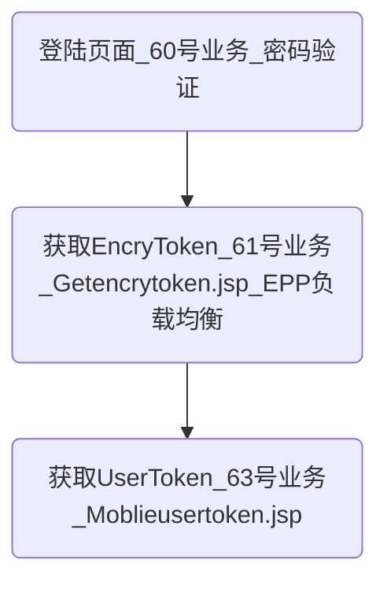

1、IPTV是什么？
>IPTV即交互式网络电视

2、EPG服务器是什么？
>IPTV的一个子系统，用于向用户提供节目等各方面服务。

## 登陆

3、登陆流程

4、EncryToken是什么？
>加密令牌 :业务管理平台为用户分配的临时身份证明,只用于认证加密。

5、负载均衡是什么？
>1. `负载均衡`是一种`网络技术`
>2. 将多个服务器以等价地位的方式组成一个服务器集合，将`服务器的负载`分摊到所有服务器上面。

6、EPG负载均衡
>1. 是指`用户`登录`EPG1`,`EPG1`会将用户信息交给一个总控的`Manager`，`Manager`通过判断进行负载均衡，然后将合适的服务器如`EPG3`的地址交给`EPG1`,`EPG1`将地址重定向到`EPG3`.

7、UserToken
>1. 用户令牌：用于表明用户的身份。
>2. `项目中多用于订购产品包等需要验证用户身份的情况`。

8、Token和Session
 >2. Session的状态是存储在服务器端，客户端只有session id；
 >1. 而Token的状态是存储在客户端

9、Token和Session的区别
>1. `Session`基于`Cookie`实现，`应用重启后丢失`。
>2. `Token`是为了防止`Cookie`被清除。
>3. 广义来说一切维护用户状态的技术都是session，
>4. 一切动态生成的服务端有能力鉴别真假而本身无涵义的字符串都是token

10、60/61号业务讲解
>1. 将用户`账号/密码`发送到服务器，验证是否有效。
>2. 走`61号`业务获取`EncryToken`，此时会进行`EPG`的负载均衡。
>3. `EncryToken`是用于后续的加密认证。

11、62/63号业务
>1. 带上`验证加密串`去获取`用户令牌`
>2. `验证加密串`：对`EncryToken、时间戳、随机字符串等`按照一定组合生成了一个字符串，然后通过`AES加密算法`进行加密，对加密后的结果用`Base64算法`转换为字符串。
>3. 其他会返回`EPG服务器新地址、特定请求的实际地址(搜索服务器等)、JSESSIONID`。

12、AES(高级加密标准)
> 是`对称密钥加密`中最流行的算法之一。

13、Base64的作用？
>Base64编码的作用：由于某些系统中只能使用ASCII字符。Base64就是用来将非ASCII字符的数据转换成ASCII字符的一种方法。

14、sessionID
>1. `Session`用于`解决Http协议中不能维持状态的问题`，`只存储于服务器，不进行网络传输，相对于Cookie更安全些`
>1. 第一次访问服务器会在服务器端生成一个session，有一个sessionid和它对应。
>2. tomcat生成的sessionid叫做jsessionid。

## 网络请求

1、项目网络请求的方法？
>1. 对`OKHttp`进行封装。
>2. 采用`线程池`-CachedThreadPool
>3. 接收到返回数据后`切换到UI`线程，回调给上层。
>* `Cookies`用于存放`JSESSIONID`

2、OkHttp3提供了Cookie的自动管理
>1. 客户端请求登陆后，服务端会返回带有唯一登陆认证信息Session的Response(存放在Cookie中)，如何实现在下次请求时自动放入呢？
>2. `OkHttp3`提供了`自动管理`
>3. 也可以手动添加。

3、转发和重定向的区别
1. 转发是服务器行为，重定向是客户端行为
2. 转发过程：客户浏览器发送http请求----》web服务器接受此请求--》调用内部的一个方法在容器内部完成请求处理和转发动作----》将目标资源发送给客户；在这里，转发的路径必须是同一个web容器下的url，其不能转向到其他的web路径上去，中间传递的是自己的容器内的request。在客户浏览器路径栏显示的仍然是其第一次访问的路径，也就是说客户是感觉不到服务器做了转发的。转发行为是浏览器只做了一次访问请求。
3. 重定向过程：客户浏览器发送http请求----》web服务器接受后发送302状态码响应及对应新的location给客户浏览器--》客户浏览器发现是302响应，则自动再发送一个新的http请求，请求url是新的location地址----》服务器根据此请求寻找资源并发送给客户。在这里location可以重定向到任意URL，既然是浏览器重新发出了请求，则就没有什么request传递的概念了。在客户浏览器路径栏显示的是其重定向的路径，客户可以观察到地址的变化的。重定向行为是浏览器做了至少两次的访问请求的。

## 播放
播放器初始化
1. 查询VOD/Channel/片花/时移/TVOD 播放等的URL ；
1. 播放器初始化
1. 播放器open
1. 播放器start
1. 播放器pause
1. 播放器resume
1. 播放器stop
1. 播放器seek跳转到具体位置

1. continuePlay
2. playerStart()
3. openPlayerToPlay
      1. 是否需要支持加密播放的URL
      2. 进行重定向
4. IBasePlayer.open url =

5. AbstractPlayer.class openInternal

## 升级策略

## 产品包订购

### 我的订购

## 首页海报

### 专题

## 预约(直播、影视、连续剧)

1、直播预约
> 1. 用户预约该节目单，等到达节目单时间，前5分钟的时候，服务端就会推送消息到客户端
> 1. 客户端弹窗提示。选择进入“消息中心”或者“直接播放”
> 1. 直接播放就是会进入TV详情页面，因为暂时节目单还没到，因此会播放当前正在播放的内容。等到了时间，就会继续播放。

1、直播进行预约
> 1. 调用预约接口，将直播的节目单的节目code，内容code, 还有电信code。媒体类型等十几个数据。
> 1. 预约成功：return 0
> 1. 预约失败：return 其他code和erro msg

## 消息推送

1、后台Service利用Socket和服务端进行长连接。

2、持续和服务端发送心跳包

3、Socket断线重连
> 1. 定时发送心跳包。
> 1. `socket.connect`会有异常`SocketTimeOutException`表示连接超时，因此进行重连。

4、如何和服务端通信
> 1. 发送数据：获取OutPutStream向里面`write`数据
> 1. 读取数据：获取InpuSTream，从中read数据。

5、获取到推送的消息
> 1. 服务端会通过该长连接向客户端发送消息
> 1. 客户端接收，按照事先规定的格式进行解析。

## DLNA

### 投屏

### 回甩

## 性能优化

### 布局优化

移除了四层过度绘制：
1. 给Activity设置了主题，并将背景设置为null。
1. Activity中主动调用getWindow().setBackgroundDrawable(null);消除默认Window背景
1. 原来项目中存在一个老旧的侧滑菜单。该菜单已经废弃却依然占据了一次过度绘制。因此将该侧滑菜单进行了移除。
1. 将MainFragment的背景设置为透明色。

#### 层级优化

将最多的17层布局，优化到了7层。
1. 用约束布局对所有页面进行优化。
1. 一些动态栏目，在一些局点上用不到，因此使用ViewStub进行优化。
1. 用include对通用UI进行了优化
1. 用merge标签配合include减少了布局层级。

### 代码优化
1. 移除了所有早前遗留内容里面的Hashtable
1. 用SparseArray在一定情况下替换了HashMap<Integer, Object>的情况。最早是在LayoutManager中看到SparseArray。按照评分排名存放节目信息的需求中，评分排名=key，节目信息Bean=value。
1. 移除了所有emnu
1. 在for循环里不再创建
1. 寻找到了所有Handler，都进行了内存泄露的保护
1. lint工具检查出，那些可以作为局部变量却用了成员变量的情况。
1. 避免错误的单例模式
1. 并不是无意义的的使用弱引用去解决内存泄露问题，因为可能会导致必须要做的重要任务，被略过了。

### 内存优化
1. 使用线程池进行优化，减少系统开销。
1. Bitmap优化
1. listview等列表优化，在滑动时禁止加载，避免了快速滑动的性能问题。

### 功耗优化

1. 将执行后后台任务的Service换为IntentService
1. Toast在后台时，不会在生效。

### 网络优化

1. 三级缓存

### 内存泄露优化
1. 一个第三方开源库，控件存储了Activity Context，并且在内部的静态数据集合上存储了控件，但是在Activity退出的时候，没有将这个静态的内部集合中的控件移除，最终导致了内存泄露10MB。

## 版本兼容适配

## 影视页面

## 即将上线、直播看什么

## 播放器相关

## 下载

## 换肤

## 数据缓存

## 参考资料
[OkHttp3简单的使用说明和Cookie自动化管理管理](https://blog.csdn.net/dmz1989/article/details/72903833)
