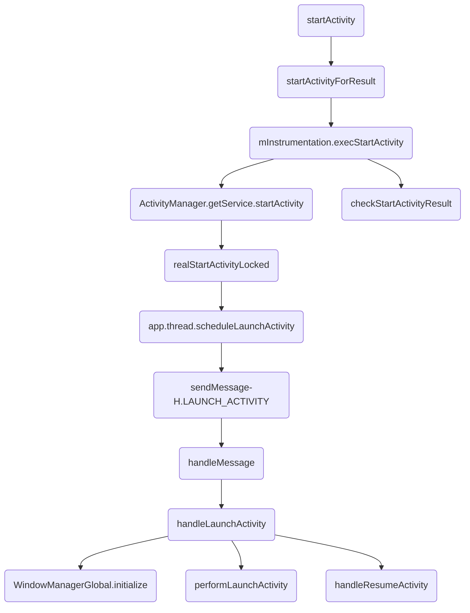
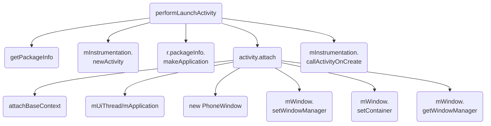
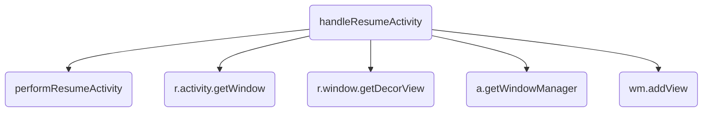
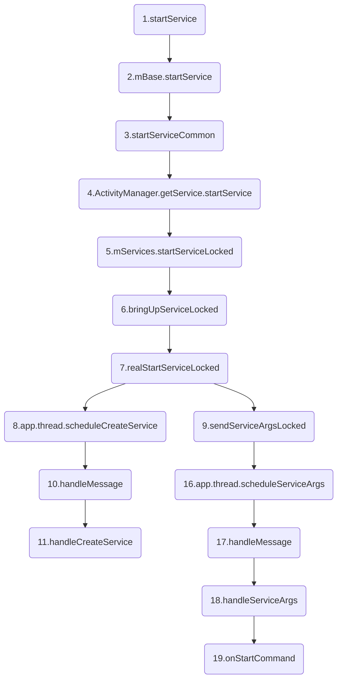
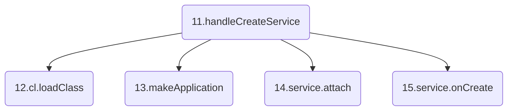
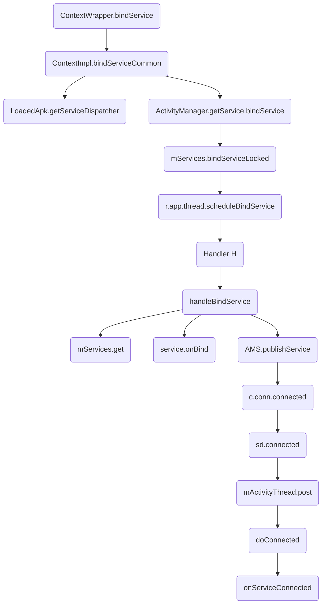
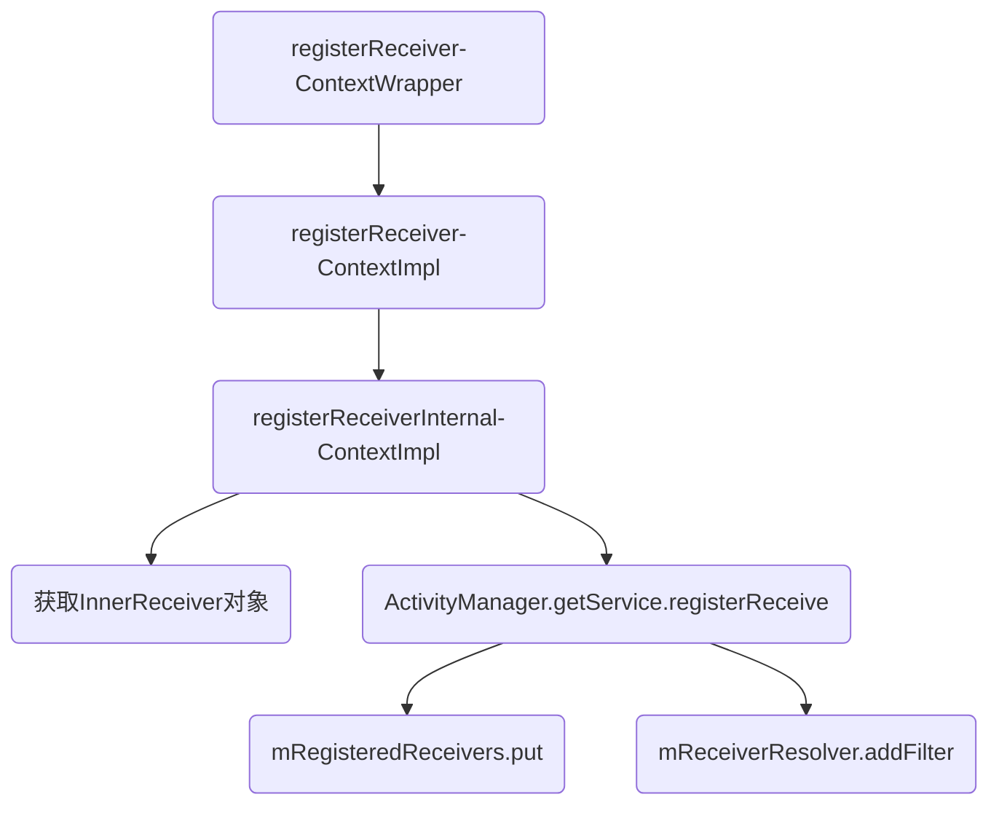
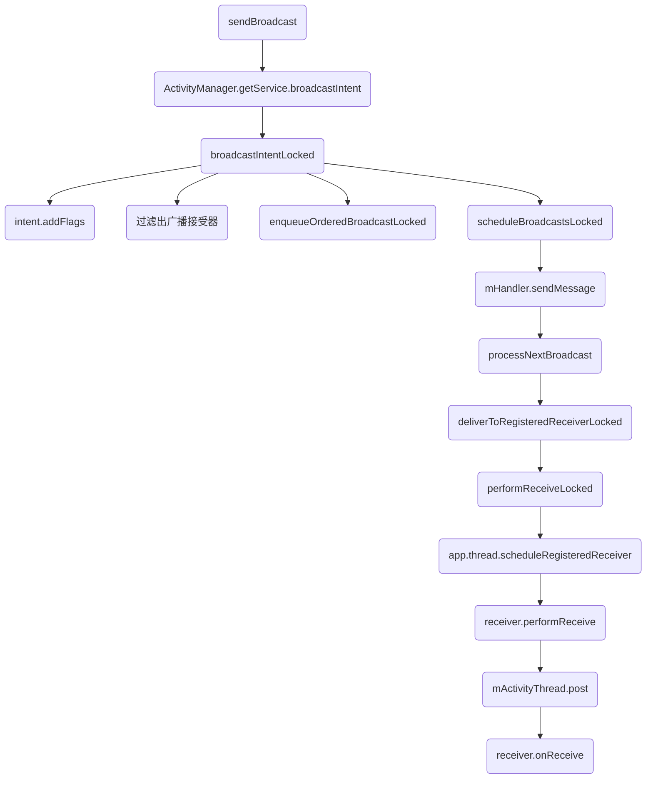
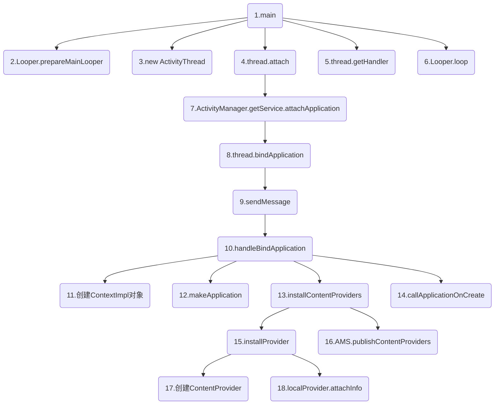
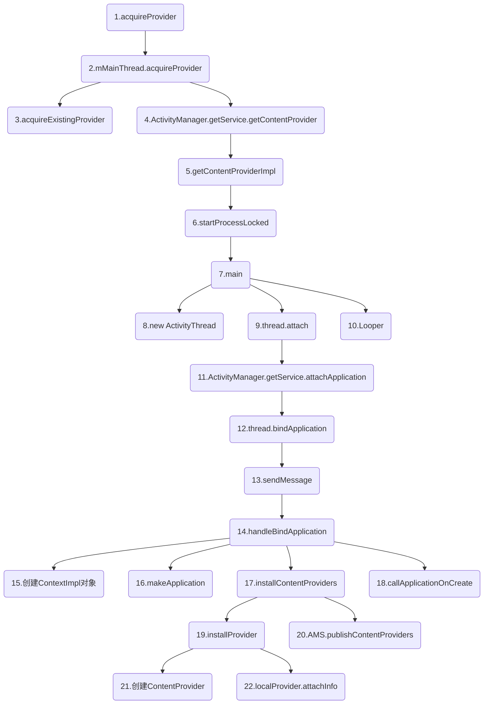

Android面试题之五大组件，包括Activity、Service、广播、ContentProvider和Fragment。

>本文是我一点点归纳总结的干货，但是难免有疏忽和遗漏，希望不吝赐教。
>转载请注明链接：https://blog.csdn.net/feather_wch/article/details/81136168

# Android面试题-五大组件
版本：2018/9/1-1(2323)

[TOC]

转载请注明链接：https://blog.csdn.net/feather_wch/article/details/50302185

Activity的原理详解。

>本文是我一点点归纳总结的干货，但是难免有疏忽和遗漏，希望不吝赐教。

# Acitivity原理详解(26)
版本：2018/9/1-1(18:16)

---

## 基本概念

1、四大组件的注册和调用方式
>1. Activity、Service、ContenProvider必须在`AndroidManifest`中注册
>2. `BroadcastReceiver`可以在`AndroidManifest`中注册，也可以`代码`中注册
>3. Activity、Service、ContenProvider的调用需要借助`Intent`
>4. `BroadcastReceiver`不需要借助`Intent`

2、Activity是什么？
>1. 一种`展示型组件`，用于展示界面，并且与用户进行交互。
>2. Activity的启动由`Intent`触发，`Intent`可分为隐式`Intent`和显式`Intent`
>3. 显式`Intent`需要明确指向一个`Activity`
>4. 隐式`Intent`可以指向一个或者多个`Activity`组件，也可能没有任何`Activity`处理该隐式`Intent`
>5. `Activity`具有特定的`启动模式`，也可以通过`finish`方法结束运行。

3、Activity启动流程中涉及的重要角色
>1. `Instrumentation：`监控应用与系统相关的交互行为。
>2. `ActivityManagerService`：组件管理的调度中心，基本上什么都不干，但是什么都管。
>3. `ActivityStarter`：`Activity启动的管理器`。处理`Intent和Flag`对`Activity启动`的影响。
>5. `ActivityStack`：管理任务栈中的Activity
>4. `ActivityStackSupervisor`:`管理任务栈`。是高版本才有的类，在`系统支持多屏后`，需要去管理多个`ActivityStack`
>6. `ActivityThread`：主线程/UI线程，完成四大组件相关工作以及APP各种主要的任务。

4、App的启动流程
>1. 图标点击：`Lancher进程`会通过Binder机制通知`ActivityManagerService`去进行Activity创建等相关工作。
>2. `AMS`会让ActivityStarter(启动管理器)处理`Intent和Flag`，然后以`Socket方式`去通知`Zygote进程`
>3. Zygote进程会进行孵化(虚拟机和资源的复制---以加快启动速度), 然后fork出新进程。
>4. `新进程`中会执行`ActivityThread`的main方法，main()中会创建`ActivityThread实例`，在RuntimeInit.zygoteInit()中会调用invokeStaticMain，其内部会执行ActivityThred的main()方法
>5. ActivityThread中会创建Looper，开启消息循环
>5. 最后会进行Activity生命周期的回调-onCreate、onStart等方法

5、ActivityThread的main()的流程
```java
public static void main(String[] args) {
    // 1. mainLooper
    Looper.prepareMainLooper();
    // 2. 创建ActivityThread，执行attach
    ActivityThread thread = new ActivityThread();
    thread.attach(false);
    // 3. Handler
    if (sMainThreadHandler == null) {
        sMainThreadHandler = thread.getHandler();
    }
    // 4. loop()
    Looper.loop();
}
```

## 状态

6、Activity的状态
>1. 三种`常驻状态`和`多个中间态`
>2. `Resumed(运行状态)`：activity处于前台，用户可以进行交互。
>3. `Paused(暂停状态)`: activity被部分遮挡，可见，不可交互。
>4. `Stopped(停滞状态)`：activity不可见，不可交互。

7、Activity的通信方式有哪些？
>1. BroadcastReceiver和LocalBroadcastReceiver
>2. EventBus
>3. startActivityForResult

## 启动流程

8、Activity的启动方法
```java
Intent intent = new Intent(MainActivity.this, Main2Activity.class);
startActivity(intent);
```

9、Activity的启动流程流程图和要点







>1. startActivity: 所有`startActivity()`方法最终会调用`startActivityForResult()`方法
>2. startActivityForResult: 内部执行`mInstrumentation.execStartActivity`.
>3. mInstrumentation.execStartActivity:`Instrucmentation用于监控应用和系统的交互行为`, 执行`4、5两步的方法`
>4. ActivityManager.getService.startActivity(): 获取到`AMS`并且执行`startActivity()`
>5. checkStartActivityResult()：检查启动Activity的结果，没有成功启动就会抛出异常,例如Activity没有注册
>6. realStartActivityLocked：AMS执行startActivity会经过`Activitystack`后执行到`ActivityStackSupervisor`的该方法。会执行` app.thread.scheduleLaunchActivity()`
>7. app.thread.scheduleLaunchActivity: app.thread是IApplicationThread这个Binder类型接口, 发送消息`H.LAUNCH_ACTIVITY`给Handler H处理。
>8. sendMessage-H.LAUNCH_ACTIVITY: 发送消息给Handler
>9. handleMessage: 会执行`handleLaunchActivity`
>10. handleLaunchActivity: 启动工作，主要进行`11、12、13三步的功能`
>11. WindowManagerGlobal.initialize() : 初始化`WM`
>12. performLaunchActivity：会进行`14、15、16、17、18五步的工作`
>13. handleResumeActivity：主要进行`25、26、27、28、29五步的功能`
>14. getPackageInfo: 从`ActivityClientRecord`中获取到待启动的Activity的组件信息
>15. mInstrumentation.newActivity: 使用类加载器创建Activity对象
>16. r.packageInfo.makeApplication: 通过`LoadedApk`的方法创建Applicayiton对象，该对象唯一，不会重复创建。
>17. activity.attach: 调用该方法前会先创建`ContexnImpl`对象，然后调用该方法去完成Window的创建并且建立Activity和Window的关联。主要进行`19、20、21、22、23、24 六步的工作`
>18. mInstrumentation.callActivityOnCreate: 调用Activity的`onCreate()`
>19. attachBaseContext(context): 建立Context和Activity的联系：本质就是将ContextImpl实例作为成员变量保存在Activity内部。
>20. mUiThread/mApplication: 将UI线程和application保存到Activity内部(`成员变量`)
>21. new PhoneWindow(this)： 创建Window(`PhoneWindow`)， 并进行初始化工作
>22. mWindow.setWindowManager： 给`Window`设置`WindowManager`---通过context.getSystemService从`WMS`中获取
>23. mWindow.setContainer(mParent.getWindow())： 将当前Window所处的容器设置为父Activity的Window
>24. mWindowManager = mWindow.getWindowManager()： 将`WM`变量作为成员变量保存到Activity内部
>25. performResumeActivity: 通过Instrucmentation调用onStart和onResume
>26. r.activity.getWindow(): 获取到Window(在Activity的attach方法中创建了PhoneWindow)
>27. r.window.getDecorView(): 创建DecorView，设置为不可见INVISIBLE, 并且Activity内部保存了DecorView
>28. a.getWindowManager(): 获取到WindowManager
>29. wm.addView(decor, l):  WM的addView方法将DecorView添加到Window中

### performLaunchActivity

10、Activitiy启动流程中performLaunchActivity的作用？(5种)
>1. 从ActivityClientRecord中获取到待启动的Activity的`组件信息`
>2. 使用类加载器`创建Activity对象`
>3. 通过LoadedApk的方法`创建Applicayiton对象`，该对象唯一，不会重复创建。
>4. 会创建`ContextImpl`并且建立Context和Activity的联系，以及创建`PhoneWindow`，建立Window和Activity的联系。
>5. 调用Activity的`onCreate()`

### activity.attach

11、Activitiy启动流程中activity.attach的作用？(6种)
>1. 建立`Context`与Activity的联系。
>2. 建立`UIThread/Application`与Activity的联系。
>3. 创建`Window(PhoneWindow对象)`，建立与Activity的联系。
>4. 给`Window`设置`父容器`为`父Activity的window`。
>5. 给`Window`设置`WindowManager`
>6. 建立`WindowManager`与Activity的联系。

### handleResumeActivity

12、Activity启动流程中handleResumeActivity的作用？(5种)
>1. 执行`onStart()、onResume()`---利用`Instrucmentation`
>2. 获取`Window`
>3. 创建`DecorView`、设置为不可见`INVISIBLE`、建立`DecorView`和Activity的联系。
>4. 获取Activity的`WindowManager`
>5. 调用`WindowManager.addView(decorView, ...)`将DecorView添加到WM中，完成显示的工作。

13、何时将DecorView设置为VISIBLE?并且显示出来？
> 1. 也是在handleResumeActivity中
> 1. 现将DecorView设置为不可见
> 1. wm.addView(): 将DecorView添加到Window总
> 1. 然后执行makeVisible让DecorView可见
```java
//ActivityThread.java
final void handleResumeActivity(IBinder token, ...) {
  //3. 创建DecorView，设置为不可见INVISIBLE
  View decor = r.window.getDecorView();
  decor.setVisibility(View.INVISIBLE);
  a.mDecor = decor; //Activity内部保存了DecorView
  //4. 获取到WindowManager
  ViewManager wm = a.getWindowManager();
  //5. WM的addView方法将DecorView添加到Window中
  wm.addView(decor, l);
  //6. 将DecorView设置为visible
  r.activity.makeVisible();
}
// Activity.java
void makeVisible() {
    //1. 还没有被加入window，执行addView()
    if (!mWindowAdded) {
        ViewManager wm = getWindowManager();
        wm.addView(mDecor, getWindow().getAttributes());
        mWindowAdded = true;
    }
    //2.已经添加到Window中，设置为可见
    mDecor.setVisibility(View.VISIBLE);
}
```

### 关系建立

14、如何创建Activity对象？
>1. `ActivityThread.java`中`performLaunchActivity()`方法内，通过`Instrucmentation`的`newActivity()`方法，通过类加载器进行创建。

15、如何创建Application对象？
>1. `ActivityThread.java`中`performLaunchActivity()`方法内，通过`LoadedApk`的`makeApplication()`方法创建Application对象。

16、如何建立Context/UIThread/Application/Window/WindowManager与Activity的联系？
>1. `activity的attach`方法中
>2. `attach()`在`ActivityThread`的`performLaunchActivity`中执行。

### 生命周期回调

17、onCreate在哪里被调用？
>1. performLaunchActivity通过`Instrumentation`调用

#### onStart、onResume
18、onStart、onResume在哪里被调用？
>1. `handleResumeActvity`中
>1. 会按照onRestart()->onStart()->onResume()去执行
```java
// ActivityThread.java
final void handleResumeActivity(IBinder token, ...) {
    // 0. 要通过token获取到Activity，app中activity很多，这样才能知道是那个Activity
    ActivityClientRecord r = mActivities.get(token);
    // 1. 进来的第一个任务，执行onStart()、onResume()
    r = performResumeActivity(token, clearHide, reason);
    // 其他工作
}
// ActivityThread.java
public final ActivityClientRecord performResumeActivity(IBinder token, ...) {
    // 0. 要通过token获取到Activity，app中activity很多，这样才能知道是那个Activity
    ActivityClientRecord r = mActivities.get(token);
    // 1. 调用activity的方法
    r.activity.performResume();
    //xxx
}
// Activity
final void performResume() {
    // 1. 看情况执行onRestart()，最后会执行start
    performRestart();
    // 2. 内部直接执行onResume()
    mInstrumentation.callActivityOnResume(this);
}
// Activity
final void performRestart() {
    // 1、看情况执行onRestart()
    mInstrumentation.callActivityOnRestart(this);
    // 2、mInstrumentation.callActivityOnStart(this)->onStart()方法
    performStart();
}
```


### startActivity源码

19、Activity的startActivity源码流程详解
```java
//Activity.java
//1. 所有`startActivity()`方法最终会调用`startActivityForResult()`方法：
public void startActivityForResult(Intent intent, int requestCode, Bundle options) {
    //2. 父亲不为Null
    if (mParent == null) {
        options = transferSpringboardActivityOptions(options);
        //3. Instrumentation的execStartActivity去启动Activity
        Instrumentation.ActivityResult ar =
                mInstrumentation.execStartActivity(
                        this, mMainThread.getApplicationThread(),//获取ApplicationThread
                        mToken, this,
                        intent, requestCode, options);
        ...
    } else {
        ...
    }
}

//Instrumentation.java
public ActivityResult execStartActivity(Context who, IBinder contextThread, IBinder token, Activity target, Intent intent, int requestCode, Bundle options) {
    ...省略...
    try {
        /**===============================================
         * 1.开启Activity
         *  1-获取到IActivityManager的Binder对象
         *  2-通过IPC让ActivityManagerService执行startActivity方法
         *===============================================*/
        int result = ActivityManager.getService() //Binder对象
                .startActivity(whoThread, ... ,options);
        /**===============================================
         *2. 检查启动Activity的结果
         * 没有成功启动就会抛出异常,例如Activity没有注册:
         *   Unable to find explicit activity class...have you declared this activity in your AndroidManifest.xml?"
         *===============================================*/
        checkStartActivityResult(result, intent);
    } catch (RemoteException e) {
        throw new RuntimeException("Failure from system", e);
    }
    return null;
}

/**
 * ActivityManagerService处理startActivity流程:
 * startActivity() -> startActivityAsUser -> ...
 * -> ActivityStack的resumeTopActivityUncheckedLocked() -> ...
 * -> ActivityStackSupervisor的`realStartActivityLocked方法`
 */
//ActivityManagerService.java
public final int startActivity(IApplicationThread caller, ...,Bundle bOptions) {
    return startActivityAsUser(caller, ...,UserHandle.getCallingUserId());
}

//ActivityStackSupervisor.java
final boolean realStartActivityLocked(ActivityRecord r, ProcessRecord app, boolean andResume, boolean checkConfig) throws RemoteException {
    ......
    //app.thread的类型为IApplicationThread
    /**============================================================
     * app.thread的类型为IApplicationThread(继承IInterface接口-Binder类型接口)
     * --内部包含大量Activity和Service启动/停止相关功能
     * --具体实现：ActivityThread(继承了ApplicationThreadNative)
     *    * ApplicationThreadNative继承Binder并且实现了IApplicationThread接口
     *      (ApplicationThreadNative和系统为AIDL文件生成的类的作用是一样的)
     *==============================================================*/
    app.thread.scheduleLaunchActivity(new Intent(r.intent), ... ,profilerInfo);
    ......
}

//ActivityThread.java的内部类：ApplicationThread
public final void scheduleLaunchActivity(Intent intent, IBinder token, ...,ProfilerInfo profilerInfo) {
    //1. 保存ActivityClientRecord需要的所有数据
    ActivityClientRecord r = new ActivityClientRecord();
    r.token = token;
    r.ident = ident;
    r.intent = intent;
    ...
    r.overrideConfig = overrideConfig;
    //2. 发送消息给Handler H处理
    sendMessage(H.LAUNCH_ACTIVITY, r);
}

//ActivityThread.java
private class H extends Handler {
    public static final int LAUNCH_ACTIVITY = 100;
    ......

    public void handleMessage(Message msg) {
        switch (msg.what) {
            case LAUNCH_ACTIVITY: {
                //1. 交给`ActivityThread`的`handleLaunchActivity`处理
                handleLaunchActivity(r, null, "LAUNCH_ACTIVITY");
            }
            break;
        }
    }
}

//ActivityThread.java
private void handleLaunchActivity(ActivityClientRecord r, Intent customIntent, String reason) {
    ......
    //0. 创建Activity前初始化WindowManagerGlobal
    WindowManagerGlobal.initialize();
    //1. 完成Activity对象的创建和启动过程
    Activity a = performLaunchActivity(r, customIntent);
    if (a != null) {
        //2. 调用Activity的onResume这一生命周期
        handleResumeActivity(r.token, ... ,reason);
    } else {
        //3. 如果出错，会finishActivity
        ActivityManager.getService().finishActivity(r.token, Activity.RESULT_CANCELED, null,
                Activity.DONT_FINISH_TASK_WITH_ACTIVITY);
    }
}

//ActivityThread.java
private Activity performLaunchActivity(ActivityClientRecord r, Intent customIntent) {
    //1. 从ActivityClientRecord中获取待启动的Activity的组件信息
    ActivityInfo aInfo = r.activityInfo;
    if (r.packageInfo == null) {
        r.packageInfo = getPackageInfo(aInfo.applicationInfo, r.compatInfo, Context.CONTEXT_INCLUDE_CODE);
    }
    ...
    //2. 通过Instrumentation的newActivity方法使用类加载器创建Activity对象
    Activity activity = null;
    java.lang.ClassLoader cl = appContext.getClassLoader();
    // 实现简单，就是通过类加载器来创建Activity对象
    activity = mInstrumentation.newActivity(cl, component.getClassName(), r.intent);
    ...
    /**============================================================
     * 3. 通过LoadedApk的makeApplication方法创建Application对象
     *  如果Application已经被创建，则不会重复创建-Application对象唯一
     *  1-内部是通过Instruction来完成，也是通过类加载器来实现
     *  2-Application创建好后，系统会通过Instruction的
     *    callApplicationOnCreate()来调用Application的onCreate()方法
     *============================================================*/
    Application app = r.packageInfo.makeApplication(false, mInstrumentation);
    if (localLOGV) Slog.v(
            TAG, r + ": app=" + app
                    + ", appName=" + app.getPackageName()
                    + ", pkg=" + r.packageInfo.getPackageName()
                    + ", comp=" + r.intent.getComponent().toShortString()
                    + ", dir=" + r.packageInfo.getAppDir());
    /**===============================================================
     *4. 创建ContextImpl对象并通过Activity的attach方法来完成一些重要的数据初始化
     * -ContextImpl是Context的具体实现，ContextImpl通过Activity的attach方法和Activity建立关联
     * -attach方法中Activity会完成Window的创建并且建立自己和Window的关联
     *===============================================================*/
    ContextImpl appContext = createBaseContextForActivity(r);
    if (activity != null) {
        CharSequence title = r.activityInfo.loadLabel(appContext.getPackageManager());
            ...
        activity.attach(appContext, this, getInstrumentation(), r.token,
                r.ident, app, r.intent, r.activityInfo, title, r.parent,
                r.embeddedID, r.lastNonConfigurationInstances, config,
                r.referrer, r.voiceInteractor, window, r.configCallback);
            ...
        //5. 调用Activity的onCreate方法——Activity完成了整个启动过程
        if (r.isPersistable()) {
            mInstrumentation.callActivityOnCreate(activity, r.state, r.persistentState);
        } else {
            mInstrumentation.callActivityOnCreate(activity, r.state);
        }
    }
    ...
    return activity;
}

//Activity.java
final void attach(Context context, ActivityThread aThread, ...) {
      //1. 建立Context和Activity的关联
      attachBaseContext(context);
      //2. 数据初始化: UI线程为当前线程, application等等
      mUiThread = Thread.currentThread();
      mApplication = application;
      ...
      //3. 创建Window(PhoneWindow)
      mWindow = new PhoneWindow(this);
      mWindow.setCallback(this);
      mWindow.setOnWindowDismissedCallback(this);
      mWindow.getLayoutInflater().setPrivateFactory(this);
      ...
      //4. 给Window设置WindowManager(从WindowManagerService获取)
      mWindow.setWindowManager(
                (WindowManager)context.getSystemService(Context.WINDOW_SERVICE), ...);
      //5. 当前Window的容器是父Activity的Window
      if (mParent != null) {
            mWindow.setContainer(mParent.getWindow());
      }
      //6. 将当前Window的WindowManager保存到Activity内部
      mWindowManager = mWindow.getWindowManager();
      mCurrentConfig = config;
}

//ActivityThread.java
final void handleResumeActivity(IBinder token, ...) {
  /**
   * 1. 调用生命周期：onStart和onResume---通过Instrucmentation
   */
  ActivityClientRecord r = performResumeActivity(token, clearHide);
  //2. 获取到Window(在Activity的attach方法中创建了PhoneWindow)
  r.window = r.activity.getWindow();
  //3. 创建DecorView，设置为不可见INVISIBLE
  View decor = r.window.getDecorView();
  decor.setVisibility(View.INVISIBLE);
  a.mDecor = decor; //Activity内部保存了DecorView
  //4. 获取到WindowManager
  ViewManager wm = a.getWindowManager();
  //5. WM的addView方法将DecorView添加到Window中
  wm.addView(decor, l);
  //6. 将DecorView设置为visible
  r.activity.makeVisible();
}

//ActivityThread.java
public final ActivityClientRecord performResumeActivity(IBinder token,boolean clearHide) {
  //1. 执行onStart和onRsume
  r.activity.performResume();
  ...
}

//Activity.java
final void performResume() {
  // 1. 通过Instrucmentation执行onStart()
  performRestart();
  // 2. 执行onResume方法
  mInstrumentation.callActivityOnResume(this);
}
```

### 启动模式的处理

20、启动模式的处理
>1. ActivityStarter中对`FLAG_ACTIVITY_SINGLE_TOP`等内容进行处理
>1. 比如`FLAG_ACTIVITY_SINGLE_TOP`就回去执行`onNewIntent()`

## 序列图：startActivity

21、startActivity
```sequence
Activity->Activity:1.startActivity
Activity->Activity:2.startActivityForResult
Activity->Activity:3.mInstrumentation.\nexecStartActivity
Activity->ActivityManagerService:【IPC】4.ActivityManager.\ngetService()
ActivityManagerService->ActivityManagerService:5.startActivity()
Activity->Activity:6.checkStartActivityResult
ActivityManagerService->ActivityStackSupervisor:7.realStartActivityLocked()
ActivityStackSupervisor->ActivityThread:【IPC】8.app.thread.\nscheduleLaunchActivity
ActivityThread->ActivityThread:9.sendMessage(H.LAUNCH_ACTIVITY)
ActivityThread->ActivityThread:10.Handler H
ActivityThread->ActivityThread:11.handleMessage()
ActivityThread->ActivityThread:12.handleLaunchActivity()
ActivityThread->ActivityThread:13.WindowManagerGlobal.\ninitialize()\n(12)
ActivityThread->ActivityThread:14.performLaunchActivity()\n(12)
ActivityThread->ActivityThread:15.handleResumeActivity()\n(12)
ActivityThread->ActivityThread:16.getPackageInfo()\n(14)
ActivityThread->ActivityThread:17.newActivity()\n(14)
ActivityThread->ActivityThread:18.makeApplication()\n(14)
ActivityThread->ActivityThread:19.createBaseContextForActivity()\n(14)
ActivityThread->ActivityThread:20.activity.attach()\n(14)
ActivityThread->ActivityThread:21.callActivityOnCreate()\n(14)
ActivityThread->ActivityThread:22.attachBaseContext()\n(20)
ActivityThread->ActivityThread:23.new PhoneWindow()\n(20)
ActivityThread->ActivityThread:24.mWindow.\nsetWindowManager()\n(20)
ActivityThread->ActivityThread:25.保存WM到Activity内部\n(20)
```
>13.创建Activity前初始化WindowManagerGlobal
>14.完成Activity对象的创建和启动过程
>15.调用Activity的onResume这一生命周期
>17.通过类加载器来创建Activity对象
>18.通过LoadedApk的makeApplication方法创建Application对象(唯一)，并会调用`onCreate()`
>19.创建ContextImpl，并调用attach
>20.关联了Context和Activity，并且创建Window加载WM等初始化工作
>21.调用Activity的onCreate方法

## 补充题

1、Activity是在哪里创建的？
> performLaunchActivity

2、Aplication在哪里创建的？
> performLaucnActivity

3、Context在哪里创建的？
> performLaunchActivity创建的ContextImpl

4、Widow(PhoneWindow)是哪里创建的？
> activity.attach()方法

5、DecorView是哪里创建的？
> handleResumeActivity中

6、何时将DecorView添加到了Window中？
> handleResumeActivity中执行`wm.addView(decorview)`

## 参考资料
1. [剖析Activity、Window、ViewRootImpl和View之间的关系](http://mp.weixin.qq.com/s/-5lyASIaSFV6wG3wfMS9Yg)

转载请注明链接: https://blog.csdn.net/feather_wch/article/details/50300853

详解Service的原理有帮助，请点个赞！

# Service原理详解

版本：2018/9/1-1(18:00)

---

## 基础(6)

1、Service是什么?
>1. 一种`服务型组件`，用于在后台执行一系列计算任务(处理网络事务、播放音乐、文件读写、或者与ContentProvider交互)。
>1. 没有界面的组件。
>1. Service具有两种状态：`启动状态`和`绑定状态`
>1. 本地Service运行在主线程(UI线程)中，因此不能进行耗时操作，需要创建子线程才可以。(BoradcastReceiver也是如此)

2、Service的两种状态
>1. 启动状态: 进行后台任务，`Service`本身运行在`主线程`，因此耗时操作需要在`新线程`中处理
>1. 绑定状态: 内部同样可以进行后台运算，但是此时`外界`可以很方便与`Service`通信

3、Service如何停止？
> 1. 如果是`启动状态`：stopService()或者Service的stopSelf()来停止。
> 1. 如果是`绑定状态`: unBindService()后，Service停止
> 1. 如果是`启动&绑定状态`：需要执行unBindeService()和stopService()或者Service的stopSelf()，才能真正停止。

4、Service的分类
>1. 本地服务：一般的Service
>2. 远程服务: 通过`android:process`属性，运行在独立进程中。

5、本地服务是什么？
>1. 该类服务依赖在主进程上而不是独立的进程，一定程度上节约资源。
>2. 本地服务因为在同一进程内，不需要IPC和AIDL进行交互。`bindService`也方便很多。
>3. 缺点：限制性大，`主进程`被杀死后，`服务便会终止`。
>4. 应用场景：需要依附某个进程的服务，比如音乐播放。

6、远程服务是什么？
>1. 该服务是`独立的进程`，进程名为`所在包名 + android:process指定的字符串`。
>2. 定义方式：用`android:process=".service"`
>3. 特点: 主进程被杀死后，该服务依然存在，不受其他进城影响，能为多个进程提供服务，具有灵活性。
>4. 会消耗更多资源，并且使用AIDL进行IPC比较麻烦，一般用于系统Service。
>5. 从Android 5.0开始，APP结束后会关闭相关进程树，因此相关的服务也会被杀死。

## 生命周期(4)

1、Service的生命周期

>1. 仅仅是`startService`：onCreate()->onStartCommand()->onDestory()
>2. 仅仅是`bindService`：onCreate()->onBind()->onUnbind（）->onDestory()
>3. 同时使用`startService`开启服务与`bindService`绑定服务：onCreate()->onStartCommand()->onBind()->onUnbind（）->onDestory()

2、Service生命周期的

|生命周期|解释|注意点|
|----|----|----|
|onCreate()|第一次启动时调用|适合只执行一次的操作|
|onStartCommand()|执行startService会调用|可能会多次调用，bindService不会调用|
|onBind()|执行bindSevice时调用|多次bindService不会导致调用多次|
|onUnbind()|执行unBindService()时调用|返回值会决定，再次bindService()会执行onBind()还是onRebind()|
|onDestory()|销毁|做一些清理工作|


3、onStartCommand()的返回值有什么用？
> 1. 返回`START_STICKY`时，如果Service因为内存不足，被系统杀掉后。如果有了多余内存，会尝试重新创建这个Service。
> 1. 并且会调用`onStartCommand()`，其中的Intent将会为null。为了那些循环的音乐播放器，天气预报之类的服务。
```java
// Service.java
public @StartResult int onStartCommand(Intent intent, @StartArgFlags int flags, int startId) {
    onStart(intent, startId);
    return mStartCompatibility ? START_STICKY_COMPATIBILITY : START_STICKY;
}
```

4、Service的unbindService生命周期

> 1. 客户端执行`unBindService()`后，回调`onUnBind()`方法，如果返回true，Service销毁。
> 1. onUnBind()如果返回false，判断是否调用了`stopSelf或者stopService`，调用则继续消息Service
> 1. 没有调用，则不会销毁。客户端再次调用`bindService()`, 会执行`onRebind()`
> 1. 销毁后，调用`bindService()`会执行`onBind()`进行绑定。

## 通信(4)

1、Activity与Service间的通信方式
>1. Activity调用Service的方法：Activity通过调用bindService，在ServiceConnection的onServiceConnected可以获取到Service的对象实例，然后就可以访问`Service`中的方法.
>1. Service去主动通知Activity的方法：可以通过`回调`来实现---在Activity的ServicConnection的onServiceConnected中去给Service设置实现的接口，该接口会在Service中被调用。
>2. 通过`广播`
>3. 通过`EventBus`

2、onBind()和onServiceConnected()实现通信
> 1-自定义Service，onBind()返回自定义的Binder
```java
class MyService extends Service {
    public IBinder onBind(Intent intent) {
        return new MyBinder();
    }
    class MyBinder extends Binder{
        MyService getService() {
            return MyService.this;
        }
    }
    public void method(){}
}
```
> 2-onServiceConnected()去接收Service
```java
class MyServiceConnection implements ServiceConnection {
    public void onServiceConnected(ComponentName name, IBinder service) {
        // 1、获取Sevice
        MyService myService = ((MyService.MyBinder)service).getService();
        // 2、调用其方法
        myService.method();
    }
    public void onServiceDisconnected(ComponentName name) {
    }
}
```

3、ServiceConnection的onServiceDisconnected什么时候会被调用？
> 1. 和Service连接意外中断。
> 1. 如因为内存不足，Service被意外释放掉。


4、用户解绑和终止Service会调用onServiceDisconnected吗？
> 不会


## 启动模式(21)

1、Service的启动方式有什么区别
>1. `startService`：Service与组件的生命周期无关，即使组件退出，Service依然存在。耗电，占内存。
>2. `bindService`：调用者退出后，Service也会退出。

2、startService
>1. Service无论调用多少次`startService`，`onCreate`只会调用一次，`onStartCommand`会调用相应次数。
>2. Service无论调用多少次`startService`，只存在`一个Service实例`
>3. 结束Service只需要调用一次`stopService或者stopSelf`
>4. Activity的退出并不会导致Service的退出---除非在onDestory里面调用stopService，但是`退出APP会导致Service的退出！`
>5. 系统资源不足的时候，服务可能会被`Kill`

3、bindService
>1. Service通过`bindService`启动，无论调用多少次，`onCreate`只会调用一次，且`onStartCommand`不会被调用。
>2. 如果调用`Service`的组件退出，如Activity，Service就会被停止。
>3. `bindService`开启的Service的通信比较方便，本地服务不需要AIDL和IPC，但是远程服务是需要AIDL和IPC的。

4、startService且同时bindService
>1. `onCreate`之调用一次。
>1. `startService`调用几次，`onStartCommand`会调用相同次数。
>1. `bindService`不会调用`onStartCommand`
>1. 调用`unBindService`不会停止`Service`，必须调用`stopService`和Service自身的`stopSelf`来停止。
>1. 如果想停止这种Service，`unBindeService`和`stopService`都需要调用，缺一不可。

5、同时开启和绑定有什么作用？
>1. 能让`Service`一直处于后台运行的状态，即使组件已经退出。
>2. 同时通过`bindService`能方便地与`Service`通信
>3. 相比于`广播`的方式，性能更高。

6、Service的注意点
>1. 手机发生旋转时，Activity的重新创建，会导致之前`bindService`建立的连接断开，`Service`会因为COntext的销毁而自动停止。

### startService流程

7、Service的启动方法
```java
Intent intent = new Intent(this, MyService.class);
startService(intent);
```
>1. Service有`启动状态`和`绑定状态`
>2. `两个状态可以共存`，Service可以既处于启动状态又处于绑定状态

8、Service的startService过程流程图和要点？

>1. startService(`ContextWrapper.java`):Activity层层继承自`ContextWrapper`;内部交由`ContextImpl`的`startService()`;典型的桥接模式
>2. mBase.startService(`ContextImpl.java`): 交给ContextImpl执行。
>3. startServiceCommon(`ContextImpl.java`): 通过`ActivityManagerService`启动服务;IPC
>4. startService(`ActivityManagerService.java`):通过`ActiveServices`进行后续工作---调用`mServices.startServiceLocked`。
>5. startServiceLocked(`ActiveServices.java`):  bringUpServiceLocked
>6. bringUpServiceLocked(`ActiveServices.java`)： realStartServiceLocked
>7. realStartServiceLocked(`ActiveServices.java`): 1、app.thread.scheduleCreateService 2、sendServiceArgsLocked
>8. app.thread.scheduleCreateService(`ActivityThread.java`):1. 创建Service 2. 发送消息`CREATE_SERVICE`给Handler H
>9. sendServiceArgsLocked(): 用Service的其他方法(如onStartCommand)-IPC通信
>10. handleMessage(`ActivityThread.java`): 处理消息
>11. handleCreateService(`ActivityThread.java`): 处理`第12、13、14、15 四步的工作`, 进行Service的创建工作
>16. 16.app.thread.scheduleServiceArgs: IPC让ActivityThread只去执行其他的生命周期回调。发送消息给Handler H
>17. 17.handleMessage: 调用`handleServiceArgs`
>18. 18.handleServiceArgs: 执行其他的生命周期，如`onStartCommand`
>19. 19.onStartCommand: Service的回调方法


>11. handleCreateService(`ActivityThread.java`): 处理`第12、13、14、15 四步的工作`
>12. cl.loadClass().newInstance(): 类加载器创建Service实例。
>13. packageInfo.makeApplication: 用`LoadedApk`创建`Application实例`
>14. service.attach： 创建ContextImpl建立Context和Service的联系。
>15. service.onCreate()： Service的onCreate(), 并且将Service对象存储到ActivityThread中的一个列表中

9、ActiveServices是什么？
>1. 辅助ActivityManagerService进行Service管理
>2. 包括：启动、绑定、停止等

10、ServiceRecord是什么？
>1. 描述一个Service记录，贯穿整个启动过程

11、ContextWrapper是什么？
>1. ContextWrapper是Context实现类ContextImpl的包装类
>2. Activity、Service等都是直接或者间接继承自`ContextWrapper`

12、ContextWrapper为什么是典型桥接模式？
> 见下面的`知识扩展部分`

13、桥接模式和代理模式的区别？
> 见下面的`知识扩展部分`

#### 源码解析

14、Service的启动过程源码详细分析
```java
   /**
     * ======================================
     * 1. Activty层层继承自ContextWrapper
     * 2. Activty的startService()方法来自于ContextWrapper
     * 3. ContextWrapper最终由mBase(ContextImpl)完成-典型桥接
     * ======================================
     */
    //ContextWrapper.java
    public ComponentName startService(Intent service) {
        //1. mBase就是Context的实现ContextImpl对象(也就是Activity创建时关联的对象)
        return mBase.startService(service);
    }

    //ContextImpl.java：直接调用startServiceCommon
    public ComponentName startService(Intent service) {
        warnIfCallingFromSystemProcess();
        return startServiceCommon(service, false, mUser);
    }

    //ContextImpl.java
    private ComponentName startServiceCommon(Intent service, boolean requireForeground, UserHandle user) {
        ......
        //1. 让`ActivityManagerService`启动一个Service服务
        ComponentName cn = ActivityManager.getService().startService(
                mMainThread.getApplicationThread(), service, ...省略...);
        ......
    }

    //ActivityManagerService.java
    public ComponentName startService(IApplicationThread caller, Intent service, ...) {
        /**====================================
         * 1. 通过mService(ActiveServices)完成后续过程
         * 2. ActiveServices是辅助AMS进行Service管理的类
         *     -包括：启动、绑定、停止
         * 3. `startServiceLocked`方法尾部会调用`startServiceInnerLocked`
         *=====================================*/
        res = mServices.startServiceLocked(caller, service, ...,userId);
    }

    //ActiveServices.java
    ComponentName startServiceInnerLocked(...,ServiceRecord r) {
        ......
        /**=========================================
         * ServiceRecord描述的是一个Service记录(贯穿整个启动过程)
         * 1. startServiceInnerLocked并没有完成具体启动工作，而是把后续任务交给了bringUpServiceLocked
         * 2. bringUpServiceLocked内部调用`realStartServiceLocked`
         * 3. realStartServiceLocked真正启动了Service
         *==========================================*/
        String error = bringUpServiceLocked(r, service.getFlags(), callerFg, false, false);
        ......
        return r.name;
    }

    //ActiveServices.java
    private final void realStartServiceLocked(ServiceRecord r, ProcessRecord app, boolean execInFg) {
        ......
        /**========================================================
         * 创建了Service对象，并且调用了onCreate()方法-IPC通信
         * 1. app.thread对象是IApplicationThread类型(Binder)
         * 2. 具体实现是ActivityThread(继承了ApplicationThreadNative)
         *========================================================*/
        app.thread.scheduleCreateService(r, r.serviceInfo, ......);
        ......
        //2. 用于调用Service的其他方法(如onStartCommand)-IPC通信
        sendServiceArgsLocked(r, execInFg, true);
        ......
    }

    //ActivityThread.java的内部类：ApplicationThread
    public final void scheduleCreateService(IBinder token, ...,int processState) {
        updateProcessState(processState, false);
        CreateServiceData s = new CreateServiceData();
        s.token = token;
        s.info = info;
        s.compatInfo = compatInfo;
        /**========================================
         *  1. 发送消息给Handler H处理
         *  2. H会接受消息，并且调用ActivityThread的handleCreateService
         *========================================*/
        sendMessage(H.CREATE_SERVICE, s);
    }

    /**====================================
     * 完成Service最终启动工作
     * //ActivityThread.java
     *=====================================*/
    private void handleCreateService(CreateServiceData data) {
        //1. 通过类加载器创建Service实例
        Service service = null;
        java.lang.ClassLoader cl = packageInfo.getClassLoader();
        service = (Service) cl.loadClass(data.info.name).newInstance();
        //2. 创建Application对象并调用其onCreate方法(Application是唯一的不会重复创建)
        Application app = packageInfo.makeApplication(false, mInstrumentation);
        //3. 创建ContextImpl对象并通过Service的attach方法建立两者关系(类似Activity的过程)
        ContextImpl context = ContextImpl.createAppContext(this, packageInfo);
        context.setOuterContext(service);
        service.attach(context, this, data.info.name, data.token, app, ActivityManager.getService());
        //4. 调用service的onCreate方法，并且将Service对象存储到ActivityThread中的一个列表中
        service.onCreate();
        mServices.put(data.token, service);
        ......
    }

    /**=============================================================
     * ActivityThread中还会通过handleServiceArgs方法调用Service的onStartCommand
     *=============================================================*/
    private void handleServiceArgs(ServiceArgsData data) {
        Service s = mServices.get(data.token);
        ......
        //1. Service的onStartCommand方法
        res = s.onStartCommand(data.args, data.flags, data.startId);
        ......
    }
```

### bindService流程

15、Service绑定流程图分析

>1. bindService(): 调用了ContextWrapper的该方法。
>2. bindServiceCommon(): ContextImpl的该方法，执行了`第3,4两步的工作`
>3. getServiceDispatcher(): 将客户端的ServiceConnection对象转换为`ServiceDispatcher内部类InnerConnection对象`，需要借助Binder才能让远程服务端调用自己的方法。
>4. ActivityManager.getService().bindService: 通过`AMS`执行bindService方法。
>5. mServices.bindServiceLocked(): 调用到`ActiveServices`的该方法。
>6. r.app.thread.scheduleBindService: 通过IPC去调用`ActivityThread内部类Application`的该方法。
>7. 本质都是通过Handler H的handleMessage()去进行处理
>8. handleBindService: 进行`第9、10、11 三步的任务`1.根据token取出Service 2.调用Service的onBind方法 3.通过IPC去告知客户端已经连接成功，并且执行onServiceConnected
>9. Service s = mServices.get(data.token): 利用token取出Service
>10. IBinder binder = s.onBind(data.intent): 知性Service的onBind方法
>11. ActivityManager.getService().publishService: Service在执行`onBind`后已经处于绑定状态，但是此时客户端并不知道，需要通过Binder去执行`ServiceConnection的onServiceConnected`方法。
>12. c.conn.connected: 调用`ServiceDispatcher.InnerConnection`的`connected()`【IPC】
>13. sd.connected： 调用LoadedApk.java的内部类ServiceDispatcher的方法
>14. mActivityThread.post: mActivityThread就是Handler H
>15. doConnected: 最终调用ServiceConnection的onServiceConnected方法

16、何时Service处于绑定状态(何时执行的onBind方法)？
>1. 执行到`ActivityThread`的`handlerBindService()`里，会获取到Service并且执行Service的onBind方法，此时就处于了绑定状态。

17、Service在ActivityThread中的存储？
>1. 服务端的ActivityThread通过ArrayMap存储了IBinder和Service的映射关系。
>2. key = IBinder, value = Service
>3. 在handleCreateService中创建好Service后，会将IBinder-Service的映射关系保存到Map中。
>4. AMS通过Binder去执行Service的任务比如执行Service的onBind方法，需要知道IBinder对应的是哪个Service，就利用到了ArrayMap存储的映射关系。

#### ServiceDispatcher

18、如何让远程服务端调用客户端的ServiceConnection中的方法？
>1. 无法直接让远程服务端使用
>2. 需要借助Binder才能让远程服务端毁掉自己的方法
>3. ServiceDispatcher的内部类InnerConnection就起到了Binder的作用
>4. ServiceDispatcher起到连接ServiceConnection和InnerConnection的作用

19、getServiceDispatcher的原理
>1. 使用ArrayMap来:存储应用当前活动的ServiceConnection和ServiceDispatcher的映射关系
>2. key = ServiceConnection, value = ServiceDispatcher
>3. 根据ServiceConnection去查询是否有对应的ServiceDispatcher，存在就直接返回ServiceDispatcher的InnerConnection。
>4. 不存在，就新建ServiceDispatcher，并将映射关系存放到Map中。

20、何时执行的ServiceConnection的onServiceConnected方法？
>1. AMS的publishService： 需要在Service进入绑定状态后，告知客户端已经完成连接。
>2. 【IPC】LoadedApk的ServiceDispatcher的connected方法
>3. 通过Handler H，最终在`ActivityThread`内部执行了onServiceConnected方法。

#### 源码解析

21、Service的绑定过程源码
```java
/**
 * ==============================================
 * 1. bindService最终也是调用的ContextWrapper的方法
 * 2. 与启动过程类似, mBase是ContextImpl最终会调用自身的bindServiceCommon方法
 * //ContextWrapper.java
 * =============================================
 */
public boolean bindService(Intent service, ServiceConnection conn, int flags) {
    return mBase.bindService(service, conn, flags);
}

//ContextImpl.java
private boolean bindServiceCommon(Intent service, ServiceConnection conn, int flags, Handler
        handler, UserHandle user) {
    /**======================================================================
     * 1. 将客户端的ServiceConnection对象转化为`ServiceDispatcher.InnerConnection`对象
     *  -ServiceConnection必须借助于Binder才能让远程服务端回调自己的方法
     *  -ServiceDispatcher的内部类InnerConnection就起到了Binder的作用
     *  -ServiceDispatcher起到连接ServiceConnection和InnerConnection的作用
     *======================================================================*/
    IServiceConnection sd;
    sd = mPackageInfo.getServiceDispatcher(conn, getOuterContext(), handler, flags);
    //2. 通过ActivityManagerService完成Service的绑定过程
    int res = ActivityManager.getService().bindService(... , service,...);
    ......
}

//LoadedApk.java
public final IServiceConnection getServiceDispatcher(ServiceConnection c, Context context, Handler handler, int flags) {
    /**================================
     * 1.mServices是ArrayMap:存储应用当前活动的ServiceConnection
     *    和ServiceDispatcher的映射关系
     *================================*/
    synchronized (mServices) {
        LoadedApk.ServiceDispatcher sd = null;
        //2. 获取`映射关系`的map
        ArrayMap<ServiceConnection, LoadedApk.ServiceDispatcher> map = mServices.get(context);
        if (map != null) {
            //3. 通过ServiceConnection去查询是否有ServiceDispatcher
            sd = map.get(c);
        }
        //4. 不存在ServiceDispatcher,新建ServiceDispatcher对象,
        if (sd == null) {
            sd = new ServiceDispatcher(c, context, handler, flags);
            if (map == null) {
                map = new ArrayMap<>();
                //6. 将该`映射关系`与Context放置到ArrayMap中
                mServices.put(context, map);
            }
            //5. key=ServiceConnection,value=ServiceDispatcher,建立映射关系
            map.put(c, sd);
        }
        //7. 返回ServiceDispatcher内部保存的InnerConnection
        return sd.getIServiceConnection();
    }
}

//ActivityManagerService.java
public int bindService(IApplicationThread caller, IBinder token, Intent service,...) {
    ......
    /**=========================
     * ActiveServices的方法：
     *  1. bindServiceLocked
     *  2. bringUpServiceLocked
     *  3. realStartServiceLocked
     *  4. 最后都是通过ActivityThread来完成Service实例的创建
     *      并且执行Services的onCreate方法
     *  * Service绑定与启动的不同在于会调用app.thread的scheduleBindService方法
     *      (在ActiveServices的requestServiceBindingLocked中调用)
     *============================*/
    return mServices.bindServiceLocked(caller, token, service,...);
}

//ActiveServices.java
private final boolean requestServiceBindingLocked(ServiceRecord r, IntentBindRecord i,...) {
    ......
    //ActivityThread内部类：`ApplicationThread`——中一系列`schedule`方法之一,最终通过Handler H进行中转，最终交给handleBindServices
    r.app.thread.scheduleBindService(r, i.intent.getIntent(), rebind, r.app.repProcState);
    ......
}

//ActivityThread
private void handleBindService(BindServiceData data) {
    //1. 根据token取出Service
    Service s = mServices.get(data.token);
    if (s != null) {
        if (!data.rebind) {
            /**================================
             * 2. 调用Service的onBind方法
             *  -此时Service就已经处于绑定状态，但此时客户端并不知道连接成功
             *  -因此必须调用客户端ServiceConnection中的onServiceConnected
             *=================================*/
            IBinder binder = s.onBind(data.intent);
            /**=======================================
             * 3. ActivityManagerService的publishService
             *  -1.会执行客户端ServiceConnection中的onServiceConnected
             *  -2.保证Service的onBind方法之调用一次(多次绑定同一个Service)
             *  -3.最终将具体任务交给ActiveServices的publishServiceLocked方法
             *========================================*/
            ActivityManager.getService().publishService(data.token, data.intent, binder);
        }
    }
    ......
}

//ActiveServices.java
void publishServiceLocked(ServiceRecord r, Intent intent, IBinder service) {
    ......
    /**===================================
     * 1. c是ConnectionRecord
     * 2. c.conn是ServiceDispatcher.InnerConnection
     * 3. service就是Service的onBind方法返回的Binder对象
     *==================================*/
    c.conn.connected(r.name, service, false);
    ......
}

//LoadedApk.java的内部类ServiceDispatcher的内部类InnerConnection
private static class InnerConnection extends IServiceConnection.Stub {
    ......

    public void connected(ComponentName name, IBinder service, boolean dead) {
        LoadedApk.ServiceDispatcher sd = mDispatcher.get();
        if (sd != null) {
            //1. 调用ServiceDispatcher的方法
            sd.connected(name, service, dead);
        }
    }
}

//LoadedApk.java的内部类: ServiceDispatcher
public void connected(ComponentName name, IBinder service, boolean dead) {
    /**=========================================================
     *1. mActivityThread是一个Handler，其实就是ActivityThread中的H
     *2. 最终RunConnection通过H的post方法从而运行在主线程中
     *3. 因此客户端ServiceConnection就是在主线程被回调
     *========================================================*/
    mActivityThread.post(new RunConnection(name, service, 0, dead));
}

//LoadedApk.java内部类ServiceDispatcher的内部类: RunConnection
private final class RunConnection implements Runnable {
    ......
    /**
     * =========================================================
     * 1. 本质调用ServiceDispatcher的doConnected
     * 2. ServiceDispatcher内部拥有客户端的ServiceConnection
     * ========================================================
     */
    public void run() {
        if (mCommand == 0) {
            doConnected(mName, mService, mDead);
        } else if (mCommand == 1) {
            doDeath(mName, mService);
        }
    }
}

//LoadedApk.java内部类: ServiceDispatcher
public void doConnected(ComponentName name, IBinder service, boolean dead) {
    ....
    if (service != null) {
        //1. 可以通过客户端的ServiceConnection调用onServiceConnected
        mConnection.onServiceConnected(name, service);
    }
}
```

## 知识扩展-Context中的桥接模式(7)

1、Context是典型的桥接模式

> 1. ContextImpl和ContextWrapper都是继承自`Context`，分别代表一个维度。
> 1. 第一个维度：ContextImpl是implementor，是具体实现的抽象接口。具体实现的是ActivityContext，ServiceContext。因为startActivity、sendBroadcast、startService这些方法有着各自不同的效果。
> 1. 第二维度：ContextWrapper就是Abstraction：持有一个`ContextImpl`的引用。其子类是Activity、Service，这个维度，是用于继承并且扩展和各自业务相关的方法。

2、为什么是桥接模式而不是代理模式？
> 1. 代理模式：一个类代表另一个类的功能。定义是为其他对象提供一种代理以控制对这个对象的访问。
> 1. 代理的优点：职责清晰，扩展性高。
> 1. 桥接模式：将抽象部分与实现部分分离，使它们都可以独立的变化。
> 1. Context中，ContextImpl可以独立变换，ContextWrapper(具体类Activity、Service)也都可以独立变换。

3、ContextImpl的具体实现
> 1. 通过ContextImpl的构造方法，构造不同的Context
> 1. 例如Application、Activity的Context
```java
// app Context
static ContextImpl createAppContext(ActivityThread mainThread, LoadedApk packageInfo) {
    ContextImpl context = new ContextImpl(null, mainThread, packageInfo, null, null, null, 0,
            null);
    return context;
}
// activity Context
static ContextImpl createActivityContext(ActivityThread mainThread,xxx) {
    ContextImpl context = new ContextImpl(null, mainThread, packageInfo, activityInfo.splitName,
            activityToken, null, 0, classLoader);
    return context;
}
// application Context
public Context createApplicationContext(ApplicationInfo application, int flags){
    // 常见ApplicationContext
    ContextImpl c = new ContextImpl(this, mMainThread, pi, null, mActivityToken,
                new UserHandle(UserHandle.getUserId(application.uid)), flags, null);
}
// package Context
public Context createPackageContext(String packageName, int flags){
    return createPackageContextAsUser(packageName, flags,
            mUser != null ? mUser : Process.myUserHandle());
}
public Context createPackageContextAsUser(String packageName, int flags, UserHandle user){
    ContextImpl c = new ContextImpl(this, mMainThread, pi, null, mActivityToken, user,
                flags, null);
}
// System Context
static ContextImpl createSystemContext(ActivityThread mainThread) {
    ContextImpl context = new ContextImpl(null, mainThread, packageInfo, null, null, null, 0,
            null);
    return context;
}
```

4、ActivityThread中如何创建Context的？
> 1-在startActivity的流程中，会在performLaunchActivity, 中创建Context。

```java
// ActivityThread.java
private Activity performLaunchActivity(ActivityClientRecord r, Intent customIntent) {
    // xxx
    ContextImpl appContext = createBaseContextForActivity(r);
}
private ContextImpl createBaseContextForActivity(ActivityClientRecord r) {

    ContextImpl appContext = ContextImpl.createActivityContext(
            this, r.packageInfo, r.activityInfo, r.token, displayId, r.overrideConfig);
    // xxx
    return appContext;
}
```
> 2-Application调用attach()中会创建Application的Context

```java
// ActivityThread.java
private void attach(boolean system) {
    ContextImpl context = ContextImpl.createAppContext(this, getSystemContext().mPackageInfo);
    // xxx
}
```
> 3- 其余还有一些Context会创建

```java
// ActivityThread.java
// 1、创建SystemContext
public ContextImpl getSystemContext() {
    synchronized (this) {
        if (mSystemContext == null) {
            mSystemContext = ContextImpl.createSystemContext(this);
        }
        return mSystemContext;
    }
}
// 2、创建SystemUiContext
public ContextImpl getSystemUiContext() {
    synchronized (this) {
        if (mSystemUiContext == null) {
            mSystemUiContext = ContextImpl.createSystemUiContext(getSystemContext());
        }
        return mSystemUiContext;
    }
}
```

5、ContextWrapper这个维度的作用？
> 1. Context分两个维度，第一个维度有多种ContextImpl实现，会去实现Actvity、Service、Application情况下的Context。
> 1. 第二维度：ContextWrapper，适用于让Activity、Service继承，去扩展各自其他方面的功能。

### 装饰者模式

6、ContextWrapper是装饰者模式？
> 1. 并不是，只是通过继承的方式扩充了一个方法。
> 1. 用于Activity、Service去和Context建立联系。
```java
public class ContextWrapper extends Context {
    Context mBase;

    public ContextWrapper(Context base) {
        mBase = base;
    }

    protected void attachBaseContext(Context base) {
        if (mBase != null) {
            throw new IllegalStateException("Base context already set");
        }
        mBase = base;
    }
}
```

### 组合模式

7、ContextImpl的不同种类的构造是组合模式吗?
> 1. 不是！
> 1. 只是通过“组合”这种技巧来实现比继承更好的实现方法。
> 1. 通过构造方法，组合不同的东西进去，就创建出ActivityContext、ApplicationContext

## 序列图: 启动流程(2)
1、Service的startService()
`AT: ActivityThread`
```sequence
AT[Service进程]->AT[Service进程]:null
Activity[客户端]->Activity[客户端]: 1.启动
Activity[客户端]->Activity[客户端]: 2.startService()\n-ContextWrapper
Activity[客户端]->Activity[客户端]: 3.mBase.startService()\n-ContextImpl
Activity[客户端]->ActivityManagerService: 【IPC】\n4.ActivityManager.getService()
ActivityManagerService->ActivityManagerService: 5.startService()
ActivityManagerService->ActiveServices: 6.mService.\nstartServiceLocked()
ActiveServices->ActiveServices: 7.bringUpServiceLocked()
ActiveServices->ActiveServices: 8.realStartServiceLocked()
ActiveServices->AT[Service进程]: 【IPC】9.app.thread.scheduleCreateService()-ApplicationThread的方法
AT[Service进程]->AT[Service进程]: 10.sendMessage\n(H.CREATE_SERVICE)
AT[Service进程]->AT[Service进程]: 11.handleCreateService()
AT[Service进程]->AT[Service进程]: 12.类加载器创建Service对象
AT[Service进程]->AT[Service进程]: 13.makeApplication
AT[Service进程]->AT[Service进程]: 14.service.attach(context...)
AT[Service进程]->AT[Service进程]: 15.service.onCreate();\nmServices.put()
ActiveServices->AT[Service进程]: 【IPC】16.sendServiceArgsLocked()
AT[Service进程]->AT[Service进程]: 17.handleServiceArgs()
AT[Service进程]->AT[Service进程]: 18.s.onStartCommand
```
>11.Handler H接受并且处理消息，最终调用handleCreateService()
>13.makeApplication(创建Application对象并调用onCreate()-若已经存在则不创建)
>14.创建ContextImpl并调用attach方法-建立ContextImpl和Service的联系
>15.service.onCreate()，并将Service添加到ActivityThread内部的Service列表中
>16.sendServiceArgsLocked()-内部最终调用Service的其他方法(onStartCommand等)

2、Service的bindService()
```sequence
ActivityThread[客户端]->Activity: 1.启动Activity
Activity->ContextImpl: 2.bindService()
ContextImpl->ContextImpl: 3.bindServiceCommon()
ContextImpl->ContextImpl: 4.mPackageInfo.\ngetServiceDispatcher
ContextImpl->AMS: 【IPC】5.ActivityManager.\ngetService()
AMS->AMS: 6.bindService()
AMS->ActiveServices: 7.mService.\nbindServiceLocked()
ActiveServices->ActiveServices: 8.requestServiceBindingLocked()
ActiveServices->ActiveServices: 9.realStartServiceLocked()
ActiveServices->ActivityThread[Service端]: 【IPC】10.app.thread.scheduleBindService()
ActivityThread[Service端]->ActivityThread[Service端]: 11.handleBindService()
ActivityThread[Service端]->ActivityThread[Service端]: 12.s.onBind(data.intent)
ActivityThread[Service端]->AMS: 【IPC】13.ActivityManager.\ngetService()
AMS->ActiveServices: 14.publishService()
ActiveServices->ActiveServices: 15.publishServiceLocked()
ActiveServices->ActivityThread[客户端]: 【IPC】16.c.conn.connected()
ActivityThread[客户端]->ActivityThread[客户端]: 17.mActivityThread.\npost()
ActivityThread[客户端]->ActivityThread[客户端]: 18.doConnected()
ActivityThread[客户端]->ActivityThread[客户端]: 19.mConnection.\nonServiceConnected
```
>2 最终是会调用ContextImpl的bindServiceCommon方法
>4.ServiceConnection需要借助binder才能让远程服务回调自己的方法(借助于ServiceDispatcher.InnerConnection)
>10.scheduleBindService会发送消息，最终由handleBindService处理
>12.调用Service的onBind方法-绑定成功
>13.绑定成功后需要通知客户端：最终调用客户端ServiceConnection中的onServiceConnected
>16.c.conn是ServiceDispatcher.InnerConnection(ServiceConnection的Binder中转对象)，最终调用ServiceDispatcher的connected
>17.mActivityThread就是ActivityThread的Hanlder H
>18.通过post最终运行在主线程
>19.调用客户端的onServiceConnected方法


## 面试题(8)

1、对一个Service多次调用startService会怎样?
> 1. onCreate()只会调用一次
> 1. onStartCommand()会调用多次(次数一致)
> 1. 只会有一个Service实例
> 1. 结束只需要调用一次`stopService或者stopSelf`

2、对一个Service多次调用bindService会怎样?
> 1. onCreate()只会调用一次.
> 1. onStartCommand不会被调用

3、Service中可以直接进行耗时操作?
> 1. 本地服务不可以！依附于当前主线程，会导致ANR。
> 1. 远程服务可以。因为处于不同进程。

4、使用startService()开启服务的流程?
> 1. 定义一个类继承自Service
> 1. AndroidManifest中配置该Service
> 1. 调用Context.startService(intent)启动该Service
> 1. 不使用时，调用stopService()或者Service自身的stopSelf()来停止

5、多个Activity可以绑定同一个Service
> 1. 如果所有的Activity都进行解绑，该Service会自动终止
> 1. 不需要去掉用stopService来停止。

6、onStartCommand的返回值有什么用?
> 返回的`START_STICKY`会在Service因为内存不足被杀死后，一旦有内存就会去重新创建。

7、使用bindService()去绑定Service的操作步骤。
> 1. 服务端，继承自Service，在onBind()中返回实现IBinder接口的实例对象，并提供公共方法。
> 1. 客户端，bindService()去绑定Service，并在ServiceConnection的onServiceConnected()的方法中接收该IBinder对象。

8、onStartCommand()什么时候不会被调用？
> 如果服务端Service没有返回`Binder`对象，就不会触发该方法。

9、如何实现一个应用没有界面和图标只有后台Service的需求？
> 1. 启动一个没有启动页面和图标的Activity然后去开启Service
> 2. AndroidManifest中有属性能设置。

10、如何在Service中启动一个Activity
> 1-需要添加Flag:`FLAG_ACTIVITY_NEW_TASK`---荣耀Play没有崩溃、红米Note3崩溃
```
android.util.AndroidRuntimeException: Calling startActivity() from outside of an Activity  context requires the FLAG_ACTIVITY_NEW_TASK flag. Is this really what you want?
```
> 2-给Activity设置:`android:excludeFromRecents=“true”`---在特定机型会出现最近任务列表有两个app的情况。也可以用于从最近任务列表中隐藏。

11、为什么在Service中启动Activity(不设置Flag)会崩溃？
> 1. 执行顺序：service.startActivity()->ContextWrapper.startActivity()->ContextImpl.startActivity()
> 2. 在ContextImpl.startActivity()中会对`FLAG_ACTIVITY_NEW_TASK`进行检查。
> 3. Activity不会出现该原因，是因为对startActivity进行了重写。

## 参考资料
1. [桥接模式](https://www.jianshu.com/p/af6b1b27f638)
1. [Service 启动和绑定解析](https://www.jianshu.com/p/5d73389f3ab2)
1. [Service](https://www.jianshu.com/p/e04c4239b07e)
1. [桥接模式和代理模式的区别](https://blog.csdn.net/see__you__again/article/details/51996797)
1. [代理模式与桥接模式 备忘](https://blog.csdn.net/agezhc/article/details/38735985)
1. [无界面Activity或者APP的实现](https://blog.csdn.net/cqx13763055264/article/details/80037162)
1. [Android 在Service中启动Activity的崩溃问题详解](https://blog.csdn.net/fang323619/article/details/74388804)

转载请注明链接：https://blog.csdn.net/feather_wch/article/details/50397199

BroadcastReceiver的基本知识和原理详解。

>本文是我一点点归纳总结的干货，但是难免有疏忽和遗漏，希望不吝赐教。

# BroadcastReceiver详解
版本：2018/9/1-1(18:16)

---

## 基础(10)

1、BroadcastReceiver是什么？
>1. 一种`消息型组件`，用于在不同组件甚至不同应用间传递消息
>2. `静态注册`: 在AndroidManifest中注册广播，会在`应用安装时被系统解析`，不需要启动应用就可以接收到相应广播(从Android 3.1开始默认不给不在运行的应用发送广播)
>3. `动态注册`: `Context.registerReceiver()`进行注册，`Context.unRegisterReceiver()`解除注册. 需要APP启动才能注册并且接收广播。
>4. 广播发送通过`Context`的一系列`send`方法完成
>5. `发送和接收`过程的匹配通过广播接收者的`intent-filter`来描述

### 分类

2、广播分为几种
> 1. 普通广播
> 1. 有序广播
> 1. 本地广播

### 有序广播

3、普通广播是什么？
>1. 调用`sendBroadcast()`发送

4、有序广播是什么？
>1. 调用`sendOrderedBroadcast()`发送
>2. 广播接收者会按照`priority优先级`从大到校进行排序
>3. `优先级`相同的广播，`动态注册`的广播优先处理
>4. 广播接收者还能对`广播`进行`截断和修改`

5、广播的发送和接收原理
>1. 继承BroadcastReceiver,在`onReceive()`中实现接收到广播后应该进行的操作。
>2. 通过`Binder机制`向`ActivityManagerService`注册广播。
>3. 通过`Binder机制`向`ActivityManagerService`发送广播。
>4. `ActivityManagerService`会查找符合`广播`条件(`IntentFilter/Permission`)的所有`BroadcastReceiver`, 并将这些广播接受器存放到队列中。
>5. 遍历队列中所有的`BroadcastReceiver`，并将`广播`发送给该接收器【IPC】。
>6. 最终通过Handler H回调其`onReceive()`方法。

### 本地广播

6、BroadcasReceiver和LocalBroadcastReceiver
>1. `BroadcasReceiver`是跨应用广播，利用`Binder机制`实现。
>2. `LocalBroadcastReceiver`是`应用内广播`，利用`Handler`实现。利用`IntentFilter`的`match`功能，提供消息的发布与接收，实现应用内通信，效率较高。

7、本地广播的优点
>1. 效率更改。
>2. 发送的广播不会离开我们的应用，不会泄露关键数据。
>3. 其他程序无法将广播发送到我们程序内部，不会有安全漏洞。

8、本地广播的使用
>1-自定义广播接收器，和一般广播一样。
```java
/**
 * 自定义广播接受器,用来处理登录广播
 */
private class LoginBroadcastReceiver extends BroadcastReceiver{
        @Override
        public void onReceive(Context context, Intent intent) {
            //处理我们具体的逻辑,更新UI
        }
}
```
>2-用LocalBroadcastManager去注册和解注册Receiver。自定义一个Action。
```java
// 自定义Action
public static final String LOGIN_ACTION = "com.example.action.LOGIN_ACTION";

//广播接收器
private LoginBroadcastReceiver mReceiver = new LoginBroadcastReceiver();

//注册广播方法
private void registerLoginBroadcast(){
        IntentFilter intentFilter = new IntentFilter(LoginActivity.LOGIN_ACTION);
        LocalBroadcastManager.getInstance(mContext).registerReceiver(mReceiver,intentFilter);
}

//取消注册
private void unRegisterLoginBroadcast(){
        LocalBroadcastManager.getInstance(mContext).unregisterReceiver(mReceiver);
}
```
>3-发送广播
```java
private void sendBroadcast(){
      //  发送广播，利用LocalBraodcastManager，Action和上面预定义的action一致
        LocalBroadcastManager.getInstance(this).sendBroadcast(
                new Intent(LOGIN_ACTION)
        );
}
```

9、LocalBroadcastManager原理
> 1. 内部采用Handler实现，使用的是MainLooper，因此不能有耗时操作。
> 1. 发送广播就是通过Handler发送一个Message实现的。

### 应用场景
10、广播的应用场景
> 1. 一个APP具有多个进程的多个组件之间发送广播
> 1. 不同APP直接发送广播

## 注册方式(8)

1、广播两种注册方式的区别
>1. `静态注册`：常驻系统，不受组件生命周期的影响，耗电，占内存。就算进程被杀死了，还能存在。
>2. `动态注册`：非常驻系统，组件结束，广播就结束。但是在组件结束前，一定要释放广播，避免内存泄露和崩溃。

2、静态注册实例
>静态注册：即使app被关闭，依然能接收广播，处于活动状态。
```java
<receiver android:name=".Receiver">
        <intent-filter>
            <action android:name="android.intent.action.AIRPLANE_MODE"></action>
        </intent-filter>
</receiver>
```

3、动态注册
> 1-自定义接收器
```java
    class MsgReceiver extends BroadcastReceiver{

        @Override
        public void onReceive(Context context, Intent intent) {
            // 1、通过Intent获得接收到的信息
            String msg = intent.getStringExtra("message");
            // 2、显示
            Toast.makeText(context, "接收到广播：" + msg, Toast.LENGTH_SHORT).show();
        }
    }
```
> 2-动态注册
```java
        /**===========================================
         *  动态注册Receiver
         *===========================================*/
        MsgReceiver msgReceiver = new MsgReceiver();
        IntentFilter intentFilter = new IntentFilter();
        // 指定Action
        intentFilter.addAction(Intent.ACTION_ANSWER);
        // 注册监听器
        registerReceiver(msgReceiver, intentFilter);
```
> 3-发送广播
```java
        Intent intent = new Intent();
        intent.setAction(Intent.ACTION_ANSWER);
        intent.putExtra("message", "文文是猪");
        sendBroadcast(intent);
```

4、广播的静态注册过程:
>1. 安装应用时由系统自动完成注册
>2. 具体是由`PMS(Package Manager Service)`来完成注册过程
>3. 本质其他`三大组件`的注册都是在安装时由`PMS`解析并注册


### 动态注册

5、广播动态注册的流程图

>1. registerReceiver: ContextWrapper.java, 层层调用
>2. registerReceiver: ContextImpl.java, 层层调用
>3. registerReceiverInternal: ContextImpl.java 进行下面`4、5的工作`
>4. mPackageInfo.getReceiverDispatcher/LoadedApk.ReceiverDispatcher : 获取到InnerReceiver对象
>5. ActivityManager.getService().registerReceiver(): 【IPC】调用AMS的registerReceiver方法，进行下面`6、7的工作`
>6. mRegisteredReceivers.put()： 将InnerReceiver对象进行存储(该对象与BroadcastReceiver对象相对应)
>7. (mReceiverResolver.addFilter(): 存储IntentFilter

6、为什么需要将BroadcastReceiver转换为IIntentReceiver？
>1. BroadcastReceiver作为组件不能直接进行IPC，需要进行中转
>2. IIntentReceiver是Binder接口，具体实现是LoadedApk.ReceiverDispatcher.InnerReceiver
>3. ReceiverDispatcher中同时保存了 BroadcastReceiver和InnerReceiver，接收广播时ReceiverDispatcher可以很方便调用BroadcastReceiver的onReceive()方法
>4. Service也有ServiceDispatcher和内部类InnerConnection(Binder接口)，原理相同

7、动态注册的本质是什么？
>1. 将BoradcastReceiver对应的Binder对象InnerReceiver存储到ActivityManagerService的Map中
>2. 将IntentFilter存储到AMS中

### 动态注册源码

8、广播的动态注册过程:
```java
/**
 * =================================
 * 1. 动态注册是从ContextWrapper的registerReceiver方法开始
 * 2. 之后直接交给ContextImpl完成
 * //ContextWrapper.java
 * =================================
 */
public Intent registerReceiver(BroadcastReceiver receiver, IntentFilter filter) {
    //1. mBase = ContextImpl
    return mBase.registerReceiver(receiver, filter);
}

//ContextImpl.java
public Intent registerReceiver(BroadcastReceiver receiver, IntentFilter filter,......) {
    return registerReceiverInternal(receiver, ......);
}

//ContextImpl.java
private Intent registerReceiverInternal(BroadcastReceiver receiver, ......) {
    IIntentReceiver rd = null;
    if (receiver != null) {
        if (mPackageInfo != null && context != null) {
            //1. 从mPackageInfo获取InnerReceiver对象
            rd = mPackageInfo.getReceiverDispatcher(receiver, context, scheduler, ......);
        } else {
            /**==============================================================================
             *2.从mPackageInfo获取IIntentReceiver对象
             * 1-采用IIntentReceiver而不是BroadcastReceiver是因为这是IPC过程
             * 2-BroadcastReceiver作为组件不能直接进行IPC，需要进行中转
             * 3-IIntentReceiver是Binder接口，具体实现是LoadedApk.ReceiverDispatcher.InnerReceiver
             * 4-ReceiverDispatcher中同时保存了 BroadcastReceiver和InnerReceiver，接收广播时ReceiverDispatcher
             *     可以很方便调用BroadcastReceiver的onReceive()方法
             * 5-可以发现Service也有ServiceDispatcher和内部类InnerConnection(Binder接口)，原理相同
             *===============================================================================*/
            rd = new LoadedApk.ReceiverDispatcher(receiver, context, scheduler, null, true)
                    .getIIntentReceiver();
        }
    }
    //3. 通过ActivityManagerService, 远程进行注册
    final Intent intent = ActivityManager.getService().registerReceiver(
            mMainThread.getApplicationThread(), mBasePackageName, rd, filter,
            broadcastPermission, userId, flags);
        ......
}

//ActivityManagerService.java：广播完成注册
public Intent registerReceiver(IApplicationThread caller, ...,IIntentReceiver receiver, ...) {
    ......
    //1. 存储远程的InnerReceiver对象(本地的BroadcastReceiver对应的对象)
    mRegisteredReceivers.put(receiver.asBinder(), rl);
    //2. 存储IntentFiler对象
    BroadcastFilter bf = new BroadcastFilter(filter, rl, callerPackage,
            permission, callingUid, userId, instantApp, visibleToInstantApps);
    rl.add(bf);
    mReceiverResolver.addFilter(bf);
    ......
}
```

## 广播发送(2)

1、广播发送/接收的流程图(普通广播)

>1. sendBroadcast: 调用顺序-Activity->ContextWrapper->ContextImpl
>2. ActivityManager.getService().broadcastIntent(......)： 直接向AMS发起一个异步请求用于发送广播
>3. broadcastIntentLocked: 进行`第4、5、6、7的工作`---添加标志位(不给已经停止的应用发送广播)、根据Intent-Fillter和Permission找到匹配的BroadcastReceiver、经过过滤后将
>4. intent.addFlags(Intent.FLAG_EXCLUDE_STOPPED_PACKAGES): 从Android 3.1开始默认不会给已经停止的应用发送广播。
>5. 根据intent-filter查找出匹配的广播接收者, 过滤出所有符合条件的BroadcastReceiver
>6. queue.enqueueOrderedBroadcastLocked: 会将满足条件的广播接收者都加入到BroadcastQueue中
>7. queue.scheduleBroadcastsLocked：会将广播发送到BroadcastQueue中的所有广播接收者中。
>8. mHandler.sendMessage: 发送消息
>9. processNextBroadcast: 取出广播并且发送给所有接收者。
>10. deliverToRegisteredReceiverLocked: 发送广播
>11. performReceiveLocked: 通过IPC发送给ActivityThread
>12. app.thread.scheduleRegisteredReceiver: 通过InnerReceiver实现广播的接收
>13. receiver.performReceive: ReceiverDispatcherd的performReceive方法，通过Handler H去投递一个Runnable
>14. mActivityThread.post： 通过Handler H 的post方法投递Runnable
>15. receiver.onReceive: 执行BroadcastReceiver的onReceive方法

### 源码

2、广播的发送和接收过程源码(普通广播为例):
>1. 通过`sendBroadcast`发送广播时，AMS会查找出匹配的广播接收者并将广播发送给它们处理
>2. 广播分为：普通广播、有序广播和粘性广播
```java
/**
 * ==================================================
 * 1. 广播的发送开始于ContextWrapper的sendBroadcast方法
 * 2. 最终会交给ContextImpl的sendBroadcast方法去处理
 * // ContextImpl.java
 * ==================================================
 */
public void sendBroadcast(Intent intent) {
    //1. 直接向AMS发起一个异步请求用于发送广播
    ActivityManager.getService().broadcastIntent(......);
    ......
}
//ActivityManagerService.java
public final int broadcastIntent(IApplicationThread caller, Intent intent, ......) {
    ....
    int res = broadcastIntentLocked(callerApp, ......);
}
//ActivityManagerService.java
final int broadcastIntentLocked(ProcessRecord callerApp, ......) {
    intent = new Intent(intent);
    /**==============================================================
     *1. 默认情况下广播不会发送给已经停止的应用(从Android 3.1开始)
     * Intent中新增两个标记:
     *  FLAG_EXCLUDE_STOPPED_PACKAGES-不包含已经停止应用
     *  FLAG_INCLUDE_STOPPED_PACKAGES-包含已经停止应用
     * -如果两个标记共存，则以FLAG_INCLUDE_STOPPED_PACKAGES为准
     * -停止状态为：1-应用安装后未运行 2-应用被手动或者其他应用强制停止
     *==============================================================*/
    intent.addFlags(Intent.FLAG_EXCLUDE_STOPPED_PACKAGES);
    ......
    /**================================================
     *2. 根据Intent-Fillter和Permission查找出匹配的广播接收者
     *3. 进过一系列过滤后，将满足条件的广播接收者添加到`BroadcastQueue`
     *4. BroadcastQueue就会将广播发送给相应的广播接收者
     *===============================================*/
    if ((receivers != null && receivers.size() > 0)
            || resultTo != null) {
        BroadcastQueue queue = broadcastQueueForIntent(intent);
        BroadcastRecord r = new BroadcastRecord(queue, intent, callerApp, ......);

       ......
        queue.enqueueOrderedBroadcastLocked(r);
        //4. BroadcastQueue就会将广播发送给相应的广播接收者
        queue.scheduleBroadcastsLocked();
    }
    ......
    return ActivityManager.BROADCAST_SUCCESS;
}
//BroadcastQueue.java
public void scheduleBroadcastsLocked() {
    //1. 发送消息，BroadcastQueue收到消息后会调用processNextBroadcast方法
    mHandler.sendMessage(mHandler.obtainMessage(BROADCAST_INTENT_MSG, this));
}
//BroadcastQueue.java
final void processNextBroadcast(boolean fromMsg) {
    synchronized (mService) {
        BroadcastRecord r;
        ......
        //1. 普通广播处理
        while (mParallelBroadcasts.size() > 0) {
            //2. 无序广播存储在mParallelBroadcasts中
            r = mParallelBroadcasts.remove(0);
            final int N = r.receivers.size();
            //3. 取出广播并发送给他们所有的接受者
            for (int i = 0; i < N; i++) {
                Object target = r.receivers.get(i);
                //4. 发送广播
                deliverToRegisteredReceiverLocked(r, (BroadcastFilter) target, false, i);
            }
            addBroadcastToHistoryLocked(r);
        }
        ......
    }
}
//BroadcastQueue.java
private void deliverToRegisteredReceiverLocked(BroadcastRecord r, BroadcastFilter filter, boolean ordered, int index) {
    performReceiveLocked(filter.receiverList.app, filter.receiverList.receiver, ......);
}
//BroadcastQueue.java
void performReceiveLocked(ProcessRecord app, IIntentReceiver receiver, ...) {
    ......
    //1. app.thread为ActivityThread,会调用其中方法
    app.thread.scheduleRegisteredReceiver(receiver, intent, resultCode, data, extras, ordered, sticky, sendingUser, app.repProcState);
}
//ActivityThread.java
public void scheduleRegisteredReceiver(IIntentReceiver receiver, Intent intent, ......) {
    updateProcessState(processState, false);
    //1. 通过`InnerReceiver`实现广播的接收, 内部会调用ReceiverDispatcher的performReceive方法
    receiver.performReceive(intent, resultCode, dataStr, extras, ordered, sticky, sendingUser);
}
//LoadedApk.java内部类ReceiverDispatcher
public void performReceive(Intent intent, int resultCode, String data, ......) {
    //1. 创建Args对象
    final Args args = new Args(intent, resultCode, data, extras, ordered, sticky, sendingUser);
    ......
    /**=========================================================
     * 2. 通过mActivityThread的post方法来执行args中的逻辑
     *   -mActivityThread是Handler(也就是ActivityThread中的Handler H)
     *   -Args中实现了Runnable接口-在广播接受线程中执行了onReceive方法
     *========================================================*/
    if (intent == null || !mActivityThread.post(args.getRunnable())) {
        ......
    }
}
//LoadedApk.java内部类ReceiverDispatcher.Args
final class Args extends BroadcastReceiver.PendingResult {
    .......

    public final Runnable getRunnable() {
        return () -> {
            //1. 执行了BroadcastReceiver的onReceive方法
            final BroadcastReceiver receiver = mReceiver;
            ......
            receiver.onReceive(mContext, intent);
            ......
        };
    }
}
```

## 序列图
1、广播的动态注册

```sequence
Activity->ContextImpl: 1.registerReceiver()
ContextImpl->ContextImpl: 2.registerReceiverInternal()
ContextImpl->ContextImpl: 3.mPackageInfo.getReceiverDispatcher()
ContextImpl->ContextImpl: 4.new LoadedApk.\nReceiverDispatcher().\ngetIIntentReceiver()
ContextImpl->ActivityManagerService: 5.ActivityManager.getService()
ActivityManagerService->ActivityManagerService: 6.registerReceiver()
ActivityManagerService->ActivityManagerService: 7.mRegisteredReceivers.\nput(receiver.asBinder());
ActivityManagerService->ActivityManagerService: 8.存储IntentFiler对象
```
>1.动态注册从ContextWrapper开始，之后直接交给ContextImpl完成
>3.已有，从mPackageInfo获取IIntentReceiver对象
>4.没有则新建IIntentReceiver对象，本质是为了IPC通信需要进行中转，ReceiverDispatcher中同时保存了 BroadcastReceiver和InnerReceiver
>7.存储远程的InnerReceiver对象(本地的BroadcastReceiver对应的对象)

2、广播的发送和接收

```sequence
ActivityThread[接收方]->ActivityThread[接收方]: null
Activity->Activity: 1.sendBroadcast()-\nContextImpl
Activity->ActivityManagerService: 【IPC】2.ActivityManager.\ngetService()
ActivityManagerService->ActivityManagerService: 3.broadcastIntent()
ActivityManagerService->ActivityManagerService: 4.broadcastIntentLocked()
ActivityManagerService->ActivityManagerService: 4-1.intent.addFlags()
ActivityManagerService->ActivityManagerService: 4-2.根据intent-filter查找出\n匹配的广播接收者
ActivityManagerService->ActivityManagerService: 4-3.将满足条件的广播接收者\n添加到BroadcastQueue
ActivityManagerService->BroadcastQueue: 4-4.queue.\nscheduleBroadcastsLocked()
BroadcastQueue->BroadcastQueue: 5.mHandler.sendMessage
BroadcastQueue->BroadcastQueue: 6.processNextBroadcast()
BroadcastQueue->BroadcastQueue: 6-1.mParallelBroadcasts.remove(0)
BroadcastQueue->BroadcastQueue: 6-2.r.receivers.get(i)遍历接收者
BroadcastQueue->BroadcastQueue: 6-3.deliverToRegisteredReceiverLocked()
BroadcastQueue->BroadcastQueue: 7.performReceiveLocked()
BroadcastQueue->ActivityThread[接收方]: 【IPC】8.app.thread.scheduleRegisteredReceiver()
ActivityThread[接收方]->ActivityThread[接收方]: LoadedApk的内部类:\nReceiverDispatcher中
ActivityThread[接收方]->ActivityThread[接收方]: 9.receiver.\nperformReceive()
ActivityThread[接收方]->ActivityThread[接收方]: 10.mActivityThread.\npost(args.getRunnable())
ActivityThread[接收方]->ActivityThread[接收方]: 11.receiver.\nonReceive();
```
>5.默认FLAG_EXCLUDE_STOPPED_PACKAGES-广播不会发送给已经停止的应用
>4-4.BroadcastQueue就会将广播发送给相应的广播接收者
>6.接收消息并且处理
>6-1.取出无序广播列表中的广播
>8.通过`InnerReceiver`实现广播的接收, 内部会调用ReceiverDispatcher的performReceive方法
>10.通过Hanlder H的post方法来执行args中的逻辑
>11.LoadedApk.java内部类ReceiverDispatcher的内部类Args，主要是执行BroadcastReceiver的接收方法

## 补充题
1、BroadcastReceiver的onReceive()方法可以进行耗时操作吗？
> 不可以，运行在主线程。

2、Broadcast的运行流程？
> 1. 注册流程
> 1. 发送接收流程

3、LocalBroadcastManager底层实现？
> 1. 用Handler实现
> 1. 采用的是主线程的Looper，因此是在主线程执行逻辑，不能执行耗时操作。

## 参考资料
1. [本地广播的使用——LocalBroadcast](https://blog.csdn.net/jarchie520/article/details/71434833)

转载请注明链接：https://blog.csdn.net/feather_wch/article/details/52035228

>本文是我一点点归纳总结的干货，但是难免有疏忽和遗漏，希望不吝赐教。

# ContentProvider详解
版本：2018/9/1-1(18:16)

---

## 基础

1、ContentProvider是什么？
>1. 一种`数据共享型组件`
>2. 内部需要实现`增删改查`四种操作
>3. 内部的`insert\delete\update\query`方法需要处理好线程同步，因为这些方法都在`Binder线程池`中调用

2、ContentProvider要点
> 1. ContentProvider所在进程启动时，就会同时启动并且发布到AMS中
> 2. ContentProvider的onCreate要先于Application的onCreate执行

### ContentResolver

3、ContentResolver的作用
> 1. 无法直接和ContentProvider交互，需要借助ContentResolver。
> 2. 通过该类，通过URI就能操作不同的ContentProvider中的数据

4、为什么要使用通过ContentResolver类从而与ContentProvider类进行交互，而不直接访问ContentProvider类？
> 1. 一款应用要使用多个ContentProvider，在ContentProvider类上增加 ContentResolver类对所有的ContentProvider进行统一管理。

5、ContentResolver的使用
```java
// 1、使用ContentResolver前，需要先获取ContentResolver
ContentResolver resolver =  getContentResolver();

// 2、设置ContentProvider的URI
Uri uri = Uri.parse("content://cn.scu.myprovider/user");

// 3、根据URI 操作 ContentProvider中的数据
// 此处是获取ContentProvider中 user表的所有记录
Cursor cursor = resolver.query(uri, null, null, null, "userid desc");
```

### ContentObserver

6、ContentObserver的作用？
> 当ContentProvider中数据发生改变后可以通知外界

## 启动

1、ContentProvider的启动流程
> 1. App启动时，会执行ActivityThread的main方法。
> 1. 会创建主线程的Looper的Handler。
> 1. 然后创建ActivityThread实例，并且执行`attach()`，最终会创建ContextImpl、Application、ContentProvider。
> 1. 并且依次执行ContentProvider的onCreate()和Application的onCreate()

>1. main: 进行`第2、3、4、5、6的工作`
>1. Looper.prepareMainLooper(): 准备主线程的Looper
>1. new ActivityThread(): 创建实例
>9. thread.attach: 一系列初始化工作
>1. thread.getHandler(): 获取Main线程的Handler
>10. Looper.loop(): Looper开启消息循环
>7. ActivityManager.getService().attachApplication(): 通过`AMS`进行处理---【IPC】
>8. thread.bindApplication(): 通过【IPC】又交给ContentProvider进程进行bindApplication操作
>9. sendMessage(H.BIND_APPLICATION): 发送`BIND_APPLICATION`
>10. handleBindApplication: 进行`11、12、13、14的工作`，主要是创建Application和COntentProvider
>15. ContextImpl.createAppContext: 创建ContextImpl对象
>16. makeApplication: 创建Application对象
>17. installContentProviders: 进行`17、18`，启动当前进程的ContentProvider并调用其onCreate方法
>18. callApplicationOnCreate： 调用Application的onCreate方法
>19. installProvider: 遍历当前进程的Provider列表，调用installProvider进行启动。进行`21、22`
>20. AMS.publishContentProviders: 将已经启动的ContentProvider保存在AMS的ProviderMap中 外部调用者就可以直接从AMS中获取ContentProvider
>21. 类加载器创建ContentProvider
>22. localProvider.attachInfo: 通过ContextProvider的方法调用了onCreate方法

2、ActivityThread.main()的源码
```java
public static void main(String[] args) {
    // 1、创建MainLooper
    Looper.prepareMainLooper();
    // 2、创建ActivityThread
    ActivityThread thread = new ActivityThread();
    // 3、thread.attach()->xxx->handleBindApplication()->创建ContentProvider
    thread.attach(false, startSeq);
    // 4、创建Handler
    if (sMainThreadHandler == null) {
         sMainThreadHandler = thread.getHandler();
    }
    // 5、loop()无限循环
    Looper.loop();
}
```

## 数据访问
1、ContentProvider的数据访问
> 1. ContentProvider启动后，外界就可以通过提供的接口进行增删改查
> 2. 外界无法直接访问`ContentProvider`，需要通过`AMS`根据`Uri`来获取对应的`ContentProvider`的Binder接口`IContentProvider`
> 3. 然后通过`IContentProvider`来访问其数据源
```java
/**
 * =============================================================================
 * 1. 其他应用通过AMS来访问指定的ContentProvider
 * 2. 通过AMS获得ContentProvider的Binder对象：IContentProvider
 * 3. IContentProvider的具体实现ContentProvider.Transport(继承自ContentProviderNative）
 * 以query为例: 最终会通过IPC调用到ContentProvider.Transport的query方法
 * //ContentProvider.java内部类: Transport
 * =============================================================================
 */
public Cursor query(String callingPkg, Uri uri, String[] projection, ......) {
    ......
    //1. 调用了ContentProvider的query方法
    Cursor cursor = ContentProvider.this.query(uri, projection, queryArgs, CancellationSignal.fromTransport(cancellationSignal));
    ......
}
```

## 数据解析

64、ContentProvider的数据访问解析
>1. 访问`ContentProvider`需要通过`ContentResolver`，这是一个抽象类
> 2. `Context的getContentResolver()`本质获取的是`ApplicationContentResolver`对象(ContextImpl的内部类)
> 3. 当`ContentProvider`所在进程未启动时，第一次访问会触发所在进程的启动和`ContentProvider`的创建。
> 4. 例如`ContentResolver.query()`方法，首先会获取`IContentProvider`对象，最终通过`acquireProvider`来获取`ContentProvider`

65、ContentProvider访问和创建的流程图

>1. acquireProvider：；直接调用`ActivityThread`的方法; 位于`ContextImpl.java的内部类：ApplicationContentResolver`
>2. mMainThread.acquireProvider: 进行`3、4`
>3. acquireExistingProvider(): 查询是否存在需要的ContentProvider，存在就直接返回
>4. ActivityManager.getService().getContentProvider: 发送请求让`AMS`启动需要的`ContentProvider`
>5. getContentProviderImpl: 调用`startProcessLocked`去启动ContentProvide所在进程，然后才会启动ContentProvider
>6. startProcessLocked: 1. 会先启动ContentProvider所在的进程，然后才会启动ContentProvider 2. 主要是通过Process的start方法来完成新进程的启动 3. 新进程启动后入口方法在ActivityThread的main方法
>7. main: 进行`第8、9、10三个工作`1.创建ActivityThread实例 2.初始化工作 3.Looper相关
>8. new ActivityThread(): 创建实例
>9. thread.attach: 一系列初始化工作
>10. Looper: Looper相关工作
>11. ActivityManager.getService().attachApplication(): 通过`AMS`进行处理---【IPC】
>12. thread.bindApplication(): 通过【IPC】又交给ContentProvider进程进行bindApplication操作
>13. sendMessage(H.BIND_APPLICATION): 发送`BIND_APPLICATION`
>14. handleBindApplication: 进行`15、16、17、18的工作`，主要是创建Application和COntentProvider
>15. ContextImpl.createAppContext: 创建ContextImpl对象
>16. makeApplication: 创建Application对象
>17. installContentProviders: 进行`19、20`，启动当前进程的ContentProvider并调用其onCreate方法
>18. callApplicationOnCreate： 调用Application的onCreate方法
>19. installProvider: 遍历当前进程的Provider列表，调用installProvider进行启动。进行`21、22`
>20. AMS.publishContentProviders: 将已经启动的ContentProvider保存在AMS的ProviderMap中 外部调用者就可以直接从AMS中获取ContentProvider
>21. 类加载器创建ContentProvider
>22. localProvider.attachInfo: 通过ContextProvider的方法调用了onCreate方法

### 源码

66、ContentProvider源码解析
```java
    //ContextImpl.java的内部类：ApplicationContentResolver
    protected IContentProvider acquireProvider(Context context, String auth) {
        //1. 直接调用`ActivityThread`的方法
        return mMainThread.acquireProvider(context, ContentProvider.getAuthorityWithoutUserId(auth), resolveUserIdFromAuthority(auth), true);
    }

    //ActivityThread.java
    public final IContentProvider acquireProvider(Context c, String auth, int userId, boolean stable) {
        //1. 查找是否已经存在需要的ContenProvider
        final IContentProvider provider = acquireExistingProvider(c, auth, userId, stable);
        if (provider != null) {
            //2. 存在就直接返回——ActivityThread通过mProviderMap来存储已经启动的ContentProvider
            return provider;
        }
        ContentProviderHolder holder = null;
        //3. 不存在就发送请求让`AMS`启动需要的`ContentProvider`
        holder = ActivityManager.getService().getContentProvider(getApplicationThread(), auth, userId, stable);
        ......
        //4. 最后修改引用计数
        holder = installProvider(c, holder, holder.info, true, holder.noReleaseNeeded, stable);
        return holder.provider;
    }

    //ActivityManagerService.java
    public final ContentProviderHolder getContentProvider(IApplicationThread caller, String name, int userId, boolean stable) {
        ...
        return getContentProviderImpl(caller, name, null, stable, userId);
    }

    //ActivityManagerService.java
    private ContentProviderHolder getContentProviderImpl(IApplicationThread caller, ...) {
        ContentProviderRecord cpr;
        ContentProviderConnection conn = null;
        ProviderInfo cpi = null;
        ......
        //1. 会先启动ContentProvider所在的进程，然后才会启动ContentProvider
        /**==================================================================
         * 1. 会先启动ContentProvider所在的进程，然后才会启动ContentProvider
         * 2. startProcessLocked中主要是通过Process的start方法来完成新进程的启动
         * 3. 新进程启动后入口方法在ActivityThread的main方法(个人认为这是ContentProvider的进程不是我们自己应用的)
         *==================================================================*/
        proc = startProcessLocked(cpi.processName,
                cpr.appInfo, false, 0, "content provider",
                new ComponentName(cpi.applicationInfo.packageName,
                        cpi.name), false, false, false);
        ......
        return cpr != null ? cpr.newHolder(conn) : null;
    }

    //ActivityThread.java
    public static void main(String[] args) {
        ...
        //1. 首先会创建ActivityThread实例
        ActivityThread thread = new ActivityThread();
        //2. 然后调用attach-进行一系列初始化
        thread.attach(false);
        //3. 然后开始消息循环
        Looper.prepareMainLooper();
        if (sMainThreadHandler == null) {
            sMainThreadHandler = thread.getHandler();
        }
        if (false) {
            Looper.myLooper().setMessageLogging(new LogPrinter(Log.DEBUG, "ActivityThread"));
        }
        Looper.loop();
        ...
    }

    //ActivityThread.java
    private void attach(boolean system) {
        ......
        //1. 将ApplicationThread对象传输给AMS(IPC)
        final IActivityManager mgr = ActivityManager.getService();
        mgr.attachApplication(mAppThread);
        ......
    }

    //ActivityManagerService.java
    public void attachApplication(IApplicationThread thread) {
        attachApplicationLocked(thread, callingPid);
    }

    //ActivityManagerService.java
    private boolean attachApplicationLocked(IApplicationThread thread, int pid) {
        ......
        thread.bindApplication(processName, appInfo, providers, ......);
        ......
    }

    //ActivityThread.java内部类：ApplicationThread
    public final void bindApplication(String processName, ApplicationInfo appInfo,......) {
        ......
        //1. 发送消息给Handler H(ActivityThread)
        sendMessage(H.BIND_APPLICATION, data);
    }
    //ActivityThread.java

    /**
     * ==============================================
     * -完成了Application的创建
     * -以及ContentProvider的创建
     * //ActivityThread.java
     * ================================================
     */
    private void handleBindApplication(AppBindData data) {
        ...
        //1. 创建ContextImpl对象和Instrumentation
        final ContextImpl instrContext = ContextImpl.createAppContext(this, pi);
        final ClassLoader cl = instrContext.getClassLoader();
        //Instrumentation
        mInstrumentation = (Instrumentation) cl.loadClass(data.instrumentationName.getClassName()).newInstance();
        final ComponentName component = new ComponentName(ii.packageName, ii.name);
        mInstrumentation.init(this, instrContext, appContext, component, data.instrumentationWatcher, data.instrumentationUiAutomationConnection);
        //2. 创建Application对象
        Application app = data.info.makeApplication(data.restrictedBackupMode, null);
        mInitialApplication = app;
        //3. 启动当前进程的ContentProvider并调用其onCreate方法
        if (!data.restrictedBackupMode) {
            if (!ArrayUtils.isEmpty(data.providers)) {
                installContentProviders(app, data.providers); //启动并且调用onCreate
                mH.sendEmptyMessageDelayed(H.ENABLE_JIT, 10 * 1000);
            }
        }
        //4. 调用Application的onCreate方法
        mInstrumentation.callApplicationOnCreate(app);
    }
    //ActivityThread.java
    private void installContentProviders(Context context, List<ProviderInfo> providers) {
        final ArrayList<ContentProviderHolder> results = new ArrayList<>();
        //1. 遍历当前进程的Provider列表
        for (ProviderInfo cpi : providers) {
            //2. 调用installProvider进行启动
            ContentProviderHolder cph = installProvider(context, null, cpi, ......);
            if (cph != null) {
                cph.noReleaseNeeded = true;
                results.add(cph);
            }
        }
        //2. 将已经启动的ContentProvider保存在AMS的ProviderMap中， 外部调用者就可以直接从AMS中获取ContentProvider
        ActivityManager.getService().publishContentProviders(getApplicationThread(), results);
        ......
    }
    //ActivityThread.java
    private ContentProviderHolder installProvider(Context context, ......) {
        ContentProvider localProvider = null;
        IContentProvider provider;
        ...
        //1. 通过类加载器完成了ContentProvider对象的创建
        final java.lang.ClassLoader cl = c.getClassLoader();
        localProvider = (ContentProvider) cl.loadClass(info.name).newInstance();
        provider = localProvider.getIContentProvider();
        if (provider == null) {
            return null;
        }
        //2. 通过ContextProvider方法调用了onCreate方法
        localProvider.attachInfo(c, info);
        ...
    }
```


## 序列图

73、ContentProvider的机制
```sequence
ContextImpl[使用者]->ContextImpl[使用者]: 1.getContentResolver().\nquery()
ContextImpl[使用者]->ContextImpl[使用者]: 2.acquireProvider()
ContextImpl[使用者]->ActivityThread: 3.mMainThread.\nacquireProvider()
ActivityThread->ActivityThread: 4.acquireExistingProvider()\n存在直接返回provider
ActivityThread->AMS: 【IPC】5.ActivityManager.\ngetService()
AMS->AMS: 6.getContentProvider()
AMS->AMS: 7.getContentProviderImpl()
AMS->AMS: 8.startProcessLocked()
AMS->ActivityThread[新]: 【新进程入口】9.main
ActivityThread[新]->ActivityThread[新]: 9-1.new ActivityThread()
ActivityThread[新]->ActivityThread[新]: 9-2.thread.\nattach(false)
ActivityThread[新]->ActivityThread[新]: 9-3.Looper.\nprepareMainLooper()
ActivityThread[新]->ActivityThread[新]: 10.attach()
ActivityThread[新]->AMS: 【IPC】11.ActivityManager.\ngetService()
AMS->AMS: 12.attachApplication()
AMS->AMS: 13.attachApplicationLocked()
AMS->ActivityThread[新]: 【IPC】14.thread.bindApplication()
ActivityThread[新]->ActivityThread[新]: 15.sendMessage\n(H.BIND_APPLICATION)
ActivityThread[新]->ActivityThread[新]: 16.handleBindApplication
ActivityThread[新]->ActivityThread[新]: 16-1.创建ContextImpl对象
ActivityThread[新]->ActivityThread[新]: 16-2.创建Instrumentation
ActivityThread[新]->ActivityThread[新]: 16-3.makeApplication()
ActivityThread[新]->ActivityThread[新]: 16-4.installContentProviders()
ActivityThread[新]->ActivityThread[新]: 16-5.mInstrumentation.\ncallApplicationOnCreate()
ActivityThread[新]->ActivityThread[新]: 17.installContentProviders()
ActivityThread[新]->ActivityThread[新]: 17-1.installProvider()
ActivityThread[新]->ActivityThread[新]: 18.localProvider.attachInfo()
ActivityThread[新]->AMS: 【IPC】17-2.ActivityManager.getService()
AMS->AMS: 19.publishContentProviders()

```
>1.获得ContextImpl的内部类：ApplicationContentResolver
>5.不存在ContentProvider让MAS启动需要的ContentProvider
>8.通过Process的start方法来完成新进程的启动
>9-1.首先会创建ActivityThread实例
>9-2.然后调用attach-进行一系列初始化
>9-3.然后开始消息循环
>12.将`ApplicationThread`传输给AMS
>15. 发送消息给Handler H
>16. 完成了Application的创建以及ContentProvider的创建
>16-3. makeApplication()创建Application对象
>16-4. 启动ContentProvider并调用onCreate方法
>16-5. 调用Application的onCreate方法
>17-1. 遍历当前进程的Provider列表并调用installProvider()
>18.创建ContentProvider对象,并调用onCreate方法
>19.将已经启动的ContentProvider保存在AMS的ProviderMap中，外部调用者就可以直接从AMS中获取ContentProvider

## 参考资料
1. [ContentProvider的基本使用](https://www.jianshu.com/p/ea8bc4aaf057)

转载请注明转载自：http://blog.csdn.net/feather_wch/article/details/79462351

# Fragment详解
版本: 2018/9/1-1

---

[TOC]

---


## Fragment基础

1、Fragment特点
>1. Activity界面的一部分，必须依赖Activity
>2. `Fragment`拥有自己的`生命周期`，可以在`Activity`内部被添加或者删除
>3. `Fragment`的生命周期只接受所在的`Activity`影响（`Activity`暂停，其`Fragment`也会暂停）
>4. `Fragment`在`Android 3.0`引入，低版本中需要采用`android-support-v4.jar`兼容包
>5. `Fragment`的可重用：多个`Activity`可以重用一个`Fragment`

### 生命周期

2、官方生命周期图


3、Fragment生命周期方法调用场景
|方法|解释|
|---|---|
|onAttach()|Fragment和Activity建立关联时调用(获取`Activity`传递的值)|
|onCreateView()|为`Fragment`创建View(加载布局)时调用|
|onActivityCreated()|`Activity`的`onCreate()`方法执行完毕后调用|
|onDestoryView()|`Fragment`的布局被移除时调用|
|onDetach()|`Fragment`和`Activity`解除关联的时候调用|

4、Fragment生命周期场景
|场景|生命周期调用顺序|
|---|---|
|Fragment被创建|onAttach()->onCreate()->onCreateView()->onActivityCreated()|
|Fragment可见|onStart()->onResume()|
|Fragment进入后台|onPause()->onStop()|
|Fragment被销毁/退出应用|onPause()->onStop()->onDestoryView()->onDestory()->onDetach()|
|屏幕灭掉/回到桌面|onPause()->onSaveInstanceState()->onStop()|
|屏幕解锁/回到应用|onStart()->onResume()|
|切换到其他Fragment|onPause()->onStop()->onDestoryView()|
|切换回本身Fragment|onCreateView()->onActivityCreated()->onStart()->onResume()|

5、Fragment和Activity生命周期对比图

> 1. 创建流程中：先执行Activity生命周期回调，再执行Fragment方法。
> 1. 销毁流程中：先执行Fragment生命周期回调，再执行Activity方法。

### 添加

#### 静态

6、Fragment的静态添加-在Activity的布局文件中添加
* Fragment
```java
//BlankFragment.java
public class BlankFragment extends Fragment {

    public BlankFragment() {
    }

    @Override
    public View onCreateView(LayoutInflater inflater, ViewGroup container,
                             Bundle savedInstanceState) {
        // 1. 加载布局，第三个参数必须为`false`，否则会加载两次布局并且抛出异常！！
        return inflater.inflate(R.layout.fragment_blank, container, false);
    }
}
```
```xml
//fragment的布局
<FrameLayout xmlns:android="http://schemas.android.com/apk/res/android"
    xmlns:tools="http://schemas.android.com/tools"
    android:layout_width="match_parent"
    android:layout_height="match_parent"
    tools:context="com.example.a6005001819.androiddeveloper.Fragment.BlankFragment">

    <!-- TODO: Update blank fragment layout -->
    <TextView
        android:layout_width="match_parent"
        android:layout_height="match_parent"
        android:text="@string/hello_blank_fragment" />

</FrameLayout>
```
* Activity
```java
//如一般Activity代码-直接省略
如果`Fragment`使用的是`support-v4`中的, Activity需要继承自`FragmentActivity`
```
* Activity的布局
```xml
//用fragment标签加载fragment
<?xml version="1.0" encoding="utf-8"?>
<LinearLayout xmlns:android="http://schemas.android.com/apk/res/android"
    android:layout_width="match_parent"
    android:layout_height="match_parent"
    android:orientation="vertical"
    tools:context="com.example.a6005001819.androiddeveloper.MainActivity">

    <fragment
      android:id="@+id/example_fragment"
        android:name="com.example.a6005001819.androiddeveloper.Fragment.BlankFragment"
        android:layout_width="match_parent"
        android:layout_height="match_parent"/>

</LinearLayout>
```

7、Fragment静态添加注意点
>1. 如果`Fragment`属于`android.support.v4.app.Fragment`，所用的`Activity`必须继承自`FragmentActivity`
>2. 如果`Fragment`属于`android.app.Fragment`，直接使用`Activity即可`

#### 动态

8、Fragment的动态添加
* Fragment代码不变
* Activity中进行动态添加
```java
public class MainJavaActivity extends Activity {

    @Override
    protected void onCreate(Bundle savedInstanceState) {
        super.onCreate(savedInstanceState);
        setContentView(R.layout.activity_main_java);

        //1. 获取FragmentManager
        FragmentManager fragmentManager = getFragmentManager();
        //2. 获取FragmentTransaction
        FragmentTransaction fragmentTransaction = fragmentManager.beginTransaction();
        //3. 创建Fragment
        BlankFragment blankFragment = new BlankFragment();
        //4. 将Fragment替换到Activity的布局中(Framelayout)
        fragmentTransaction.add(R.id.main_java_activity_container, blankFragment);
        fragmentTransaction.commit();
    }
}
```
```xml
<?xml version="1.0" encoding="utf-8"?>
<android.support.constraint.ConstraintLayout xmlns:android="http://schemas.android.com/apk/res/android"
    xmlns:tools="http://schemas.android.com/tools"
    android:layout_width="match_parent"
    android:layout_height="match_parent"
    tools:context="com.example.a6005001819.androiddeveloper.MainJavaActivity">

    <FrameLayout
        android:id="@+id/main_java_activity_container"
        android:layout_width="match_parent"
        android:layout_height="match_parent"></FrameLayout>

</android.support.constraint.ConstraintLayout>
```

#### 重复添加

9、Fragment的重复添加
>问题：`Fragment`的动态添加是在`onCreate()`中，当手机横竖屏切换，会导致多次调用`onCreate()`最终导致创建多个`Fragment`
>解决办法：在`onCreate()`检查`参数savedInstanceState`来确定是第一次运行还是恢复后运行
```java
//java版本
protected void onCreate(Bundle savedInstanceState) {
    super.onCreate(savedInstanceState);
    setContentView(R.layout.activity_main_java);

    if(savedInstanceState == null){
        //1. 获取FragmentManager(support-v4中用`getSupportFragmentManager`)
        FragmentManager fragmentManager = getFragmentManager();
        //2. 获取FragmentTransaction
        FragmentTransaction fragmentTransaction = fragmentManager.beginTransaction();
        //3. 创建Fragment
        BlankFragment blankFragment = new BlankFragment();
        //4. 将Fragment替换到Activity的布局中(Framelayout)
        fragmentTransaction.add(R.id.main_java_activity_container, blankFragment);
        fragmentTransaction.commit();

        Log.i("feather", "创建新的Fragment");
    }
}
```
```kotlin
//kotlin版本
override fun onCreate(savedInstanceState: Bundle?) {
    super.onCreate(savedInstanceState)
    setContentView(R.layout.activity_main_kotlin)

    if(savedInstanceState == null){
        fragmentManager.beginTransaction()
                .add(R.id.main_kotlin_activity_container, BlankFragment())
                .commit()
        Log.i("feather", "创建新的Fragment")
    }
}
```

### Fragment基础要点
10、Fragment中`onCreateView()`
>1. 内部加载布局的`inflate()`的第三个参数必须是`false`，否则会导致重复添加，抛出异常

11、Fragment需要传入参数该怎么做？
>1. 应该通过`setArguments(Bundle bundle)`方法添加
>2. 之后通过`onAttach()`中的`getArguments()`获得传进来的参数。
>3. 不建议通过给`Fragment`添加`带参数的构造函数`来传参数，这样`内存紧张`时被系统杀掉会导致`无法恢复数据`

12、Fragment中获取`Activity`对象
>1. 不应该！使用`getActivity()`获取
>2. 应该在`onAttach()`中将`Context对象`强转为`Activity对象`

13、Fragment不是一个View，而是和Activity一个层级

14、不能在`onSaveInstanceState()`后调用`commit()`
>1. onSaveInstanceState()在onPause()和onStop()之间调用。
>2. onRestoreInstanceState()在onStart()和onResume()之间调用。
>避免异常方法：
>1. 不要把Fragment事务放在异步线程的回调中，比如不要把Fragment事务放在AsyncTask的onPostExecute()---onPostExecute()可能会在onSaveInstanceState()之后执行。
>2. 无可奈何时使用commitAllowingStateLoss()-一般不推荐。


15、生命周期场景：Fragment1在Activity初始化时就添加
>1. Fragment的onAttach()->onCreate()->onCreateView()->onActivityCreated()->onStart()都是在Activity的onStart()中调用的。
>2. Fragment的onResume()在Activity的onResume()之后调用。

16、生命周期场景：15的情况下，点击一个Button执行replace将F1替换为F2(不加addToBackStack())
>1. F2.onAttach()->Activity.onAttachFragment()->F2.onCreate()->F1.onPause()~onDetach()->F2.onCreateView()~onResume()
>2. F1进行销毁并添加了F2

17、生命周期场景：15的情况下，点击一个Button执行replace将F1替换为F2(加addToBackStack())
>1. F1被替换只会调用`onDestoryView()`而不会调用后续生命周期。


### FragmentTransaction

18、FragmentTransaction的`replace()`方法
>1. 作用： 等于先`Remove`移除容器所有的`Fragment`，然后再`add一个Fragment`
>2. 在`replace()`前调用多次`add()`, 最终只有`replace()`的`Fragment`留存
```java
getSupportFragmentManager().beginTransaction()
                .add(R.id.fl_main, new ContentFragment(), null)
                .add(R.id.fl_main, new ContentFragment(), null)
                .add(R.id.fl_main, new ContentFragment(), null)
                .replace(R.id.fl_main, new ContentFragment(), null)
                .commit();
```

19、FragmentTransaction的`addToBackStack()`方法
>1. 将此次`事物`添加到后台堆栈，`按下“回退键”`不会退出该`Activity`而是回到上一个操作时的状态。
>2. `按下“回退键”`=执行了`add()`对应的`remove()`
>3. 加入`回退栈`，则用户点击返回按钮，会`回滚Fragment事务`
```java
getSupportFragmentManager().beginTransaction()
                    .add(R.id.fl_main, new ContentFragment(), null)
                    .addToBackStack(null) //1. 记录之前的add操作，回退会出现“白屏”，也就是回到`add`前的状态
                    .commit();
```

20、FragmentTransaction的`show()、hide()`方法
>1. `hide(fragment)`-隐藏一个存在的fragment
>2. `show(fragment)`-显示一个被隐藏过的fragment
>3. `hide()和show()`不会调用任何`生命周期方法`
>4. `Fragment`中重写`onHiddenChanged()`可以对`Fragment`的`hide、show`状态进行监听

21、FragmentTransaction的`attach()、detach()`方法
>1. `detach(fragment)`-分离fragment的UI视图
>2. `attach(fragment)`-重新关联一个Fragment(必须在`detach`后才能执行)
>3. 当Fragment被detach后，Fragment的生命周期执行完onDestroyView就终止---Fragment的实例并没有被销毁，只是UI界面被移除（和remove有区别）。
>4. 当Fragment被detach后，执行attach操作，会让Fragment从onCreateView开始执行，一直执行到onResume。

22、FragmentTransaction的`setCustomAnimations()`
>1. 给`Fragment`的`进入/退出`设置指定的动画资源
>2. `getSupportFragmentManager`不支持属性动画，仅支持`补间动画`。`getFragmentManager`支持`属性动画`。
>3. `setCustomAnimations`一定要放在add、remove...等操作之前。
```java
//1. 载入Fragment动画
getFragmentManager().beginTransaction()
  //1. 设置动画
  .setCustomAnimations(R.animator.enter_animator, R.animator.exit_animator)
    .add(R.id.main_java_activity_container,  new BlankFragment())
      .commit();
//2. 销毁Fragment时动画(support-v4中只能用)
getSupportFragmentManager().beginTransaction()
                    .setCustomAnimations(R.anim.enter_anim, R.anim.exit_anim)
                    .remove(getSupportFragmentManager().findFragmentById(R.id.fl_main))
                    .commit();
```
```xml
//动画：
// res/animator/enter_animator
<?xml version="1.0" encoding="utf-8"?>
<objectAnimator xmlns:android="http://schemas.android.com/apk/res/android"
    android:interpolator="@android:interpolator/accelerate_decelerate"
    android:valueFrom="-1280"
    android:valueTo="0"
    android:valueType="floatType"
    android:propertyName="X"
    android:duration="2000"  />

// res/animator/exit_animator
<?xml version="1.0" encoding="utf-8"?>
<objectAnimator xmlns:android="http://schemas.android.com/apk/res/android"
    android:interpolator="@android:interpolator/accelerate_decelerate"
    android:valueFrom="0"
    android:valueTo="1280"
    android:valueType="floatType"
    android:propertyName="X"
    android:duration="2000" />
```

23、FragmentTransaction的`addSharedElement(View sharedElement, String name)`
>1. 用于将`View`从一个`被删除的或隐藏`的`Fragment`映射到另一个`显示或添加的Fragment`上。
>2. 设置共享View，第二个参数name是这个共享元素的标识。
>3. 博客推荐： 使用SharedElement切换Fragment页面:https://www.jianshu.com/p/e9f63ead8bf5

24、FragmentTransaction的`commit()、commitAllowingStateLoss()、commitNow()、commitNowAllowingStateLoss()`
>1. `commit()`：安排一个事务的提交。
>2. `commitAllowingStateLoss()`：和commit一样，但是允许Activity的状态保存之后提交。
>3. `commitNow()`：同步的提交这个事务。（API_24添加）
>4. `commitNowAllowingStateLoss()`：和commitNow()一样，但是允许Activity的状态保存之后提交。（API_24添加）

### FragmentManager
25、FragmentManagerImpl是什么？
>1. 是`FragmentManager`的实现类
>2. `mAdded`是已经添加到Activity的Fragment的集合
>3. `mActive`不仅包含`mAdded`，还包含`虽然不在Activity中，但还在回退栈`中的Fragment。
```java
final class FragmentManagerImpl extends FragmentManager implements LayoutInflater.Factory2 {
    //1. 待加入的Fragment列表
    final ArrayList<Fragment> mAdded = new ArrayList<>();
    //2. 活跃的Fragment列表
    SparseArray<Fragment> mActive;
    //3. 回退栈
    ArrayList<BackStackRecord> mBackStack;
    //4. 通过ID查找Fragment
    public Fragment findFragmentById(int id) {...}
    //5. 通过tag查找Fragment
    public Fragment findFragmentByTag(String tag) {...}
    //6. 获得所有"待添加列表"中的Fragment
    public List<Fragment> getFragments() {...}
}
```

26、findFragmentById()
>1. 根据ID来找到对应的Fragment实例，主要用在静态添加fragment的布局中，因为静态添加的fragment才会有ID
>2. 会先从`mAdded(待添加列表)`中查找，没有找到就会从`mActive(活跃列表)`中查找

27、findFragmentByTag()
>1. 根据TAG找到对应的Fragment实例，主要用于在动态添加的fragment中，根据TAG来找到fragment实例
>2. 会先从`mAdded(待添加列表)`中查找，没有找到就会从`mActive(活跃列表)`中查找

28、getFragments()
>1. 返回`mAdded(待添加列表)`

29、popBackStack()的作用
>1. 进行`回退`功能，对应于`addToBackStack()`
>2. `void popBackStack(int id, int flags);`---根据Fragment的ID进行回退，ID可以通过Commit返回值获取
>3. `void popBackStack(String name, int flags);`---根据Tag进行回退
>5. `flags = 0`时，`参数指定的Fragment`以上的所有内容全部`出栈`
>6. `flags = POP_BACK_STACK_INCLUSIVE`时，`参数指定的Fragment`(包括该Fragment)以上的所有内容全部`出栈`
>7. `popBackStackImmediate()`相关所有函数，都是立即执行。而不是将`事务`插入队列后等待执行。

## DialogFragment

30、DialogFragment的作用和优缺点
>1. `DialogFragment`在`Android 3.0`提出，用于替代`Dialog`
>2. `优点：`旋转屏幕也能保留对话框状态
>3. `自定义对话框样式`: 继承`DialogFragment`并重写`onCreateView()`，该方法返回`对话框UI`
```java
//自定义DialogFragment
public class CustomDialogFragment extends DialogFragment{

    public View onCreateView(LayoutInflater inflater, @Nullable ViewGroup container, Bundle savedInstanceState) {
        //1. 消除标题
        getDialog().requestWindowFeature(Window.FEATURE_NO_TITLE);
        //2. 自定义样式
        View root = inflater.inflate(R.layout.fragment_blank, container);
        return root;
    }
}
//使用DialogFragment
CustomDialogFragment dialogFragment = new CustomDialogFragment();
dialogFragment.show(getFragmentManager(), "dialog");
```

## Fragment通信

31、EventBus是解决Fragment通信的终极解决方案
>1.` Fragment`通信涉及：Fragment向Activity传递数据、Activity向Fragment传递数据、Fragment之间床底数据
>2. `EventBus:` 一个Android事件发布/订阅轻量级框架---能够便捷、高效解决`Fragment所有通信问题`

### Fragment和Activity

32、Fragment调用Activity中的方法
> 1. getActivity()或者onAttach()中Context转为Activity
> 1. 用该Activity对象，调用Activity的对象方法。

33、Activity调用Fragment中的方法
> 1. Activity中直接用该Fragment对象去调用方法。
> 1. 用过接口回调

34、Fragment向Activity传递数据的方法
>1. 接口回调: 在`Fragment`中`定义接口`，并让`Activity实现该接口`
>2. FABridge: 以`注解`的形式免去了`接口回调`的各种步骤，github:(https://github.com/hongyangAndroid/FABridge)
```java
//接口回调实例
//1、Fragment中定义接口
public interface onFragmentInteractionListerner{
    void onItemClick(String msg);
}
//2、Activity实现接口
public class MainActivity extends Activity
   implements BlankFragment.onFragmentInteractionListerner{

   @Override
   protected void onCreate(Bundle savedInstanceState) {
       super.onCreate(savedInstanceState);
       setContentView(R.layout.activity_main_java);
       //1. Activity作为参数传入
       Fragment f = new Fragment(MainActivity.this);
    }
    //2. 操作从Fragment传递进来的数据
    public void onItemClick(String msg) {
        Log.i("feather", "Activity:" + msg);
    }
}
//3、Fragment中转换Context为接口
onFragmentInteractionListerner mInterface;
public BlankFragment(Context context) {
    mInterface = (onFragmentInteractionListerner) context;
}
//4、Fragment中调用方法进行数据传递
mInterface.onItemClick("data from fragment");
```

35、Activity向Fragment传递数据
>1. 通过`构造函数`传递数据(不推荐)
>2. 通过`参数`传递数据，在`Fragment`中`onAttach()`中`getArguments()`
>3. 在`Activity`中获取`Fragment`对象，直接调用`Fragment的方法`，通过`参数传递数据`

### Fragment之间

36、Fragment之间的通信
>1. 需要借助`Activity`进行数据通信
>1. Activity中通过FragmentManager的`findFragmentById`去获取Fragment

## Fragment与ViewPager
>ViewPager的基本使用：[请参考该链接](http://blog.csdn.net/feather_wch/article/details/79494748)

37、ViewPager介绍
>1. `ViewPager`常用于实现`Fragment的左右滑动切换`的效果
>2. `ViewPager`会缓存当前页相邻的界面，比如当滑动到第2页时，会初始化第1页和第3页的Fragment对象，且生命周期函数运行到onResume()。
>3. 通过`ViewPager的setOffscreenPageLimit(count)`设置离线缓存的界面个数。

38、Fragment的FragmentPagerAdapter的实现方法
```java
public class MyFragmentStatePagerAdapter extends FragmentStatePagerAdapter{
    //1. Fragment链表
    List<Fragment> fragmentList;
    //2. 构造
    public MyFragmentStatePagerAdapter(android.support.v4.app.FragmentManager fm, List<Fragment> list) {
        super(fm);
        fragmentList = list;
    }
    //3. 返回当前Position对应的Fragment
    @Override
    public Fragment getItem(int position) {
        return fragmentList.get(position);
    }
    //4. Fragment的总数量
    @Override
    public int getCount() {
        return fragmentList.size();
    }
}
```

### 懒加载

39、懒加载是什么
>1. `ViewPager`默认会`预加载`左右相邻的`Fragment`，但是在一些有耗时操作的情况下，需要`懒加载`-在打开相应`Fragment`时才加载数据
>2. `懒加载的实现思路`：用户不可见的界面，只初始化UI，但是不会做任何数据加载。等滑到该页，才会异步做数据加载并更新UI。

40、懒加载之Fragment的setUserVisibleHint()方法
>1. 懒加载需要依赖Fragment的setUserVisibleHint()方法
>2. 当Fragment变为`可见`时，需要调用`setUserVisibleHint(true)`
>3. 当Fragment变为`不可见`时，会调用`setUserVisibleHint(false)`

31、setUserVisibleHint()的调用时机
>1. `onAttach()`之前，调用`setUserVisibleHint(false)`。
>2. `onCreateView()`之前，如果该界面为当前页，则调用`setUserVisibleHint(true)`，否则调用`setUserVisibleHint(false)`。
>3. 界面变为可见时，调用setUserVisibleHint(true)。界面变为不可见时，调用setUserVisibleHint(false)。

42、懒加载Fragment的实现
>1、网络请求不涉及UI更新时直接重写`Fragment`的`setUserVisibleHint()`方法
```java
public void setUserVisibleHint(boolean isVisibleToUser) {
    Log.d("TAG", mTagName + " setUserVisibleHint() --> isVisibleToUser = " + isVisibleToUser);

    if (isVisibleToUser) {
        pullData();
    }
    super.setUserVisibleHint(isVisibleToUser);
}
```
>2、如果耗时请求涉及UI更新(请求好数据后结果UI还没有绑定好)，这种情况适合在`onStart()`通过`getUserVisibleHint()`判断.
```java
@Override
public void onStart() {
    super.onStart();
    Log.d("TAG", mTagName + " onStart()");

    ...

    if(getUserVisibleHint()) {
        pullData();
    }

}
```

### FragmentPagerAdapter

43、FragmentPagerAdapter的特点
> 1. Item销毁时，只是将其detach()和界面分离
> 1. 适合Fragment较少的情况，更占内存，但是反应速度会更快
> 1. destroyItem()源码
```java
public void destroyItem(@NonNull ViewGroup container, int position, @NonNull Object object) {
        //...
        this.mCurTransaction.detach((Fragment)object);
}
```

### FragmentStatePagerAdapter
44、FragmentStatePagerAdapter的特点
> 1. Item销毁时，会直接remove。
> 1. 不占内存，适合大量Fragment的情况。
> 1. destroyItem()源码
```java
public void destroyItem(@NonNull ViewGroup container, int position, @NonNull Object object) {
        //...
        this.mCurTransaction.remove(fragment);
}
```

## Fragment进阶
### Fragment源码分析
45、getFragmentManager()源码和逻辑分析
```java
//Activty.java
FragmentController mFragments = FragmentController.createController(new HostCallbacks());
public FragmentManager getFragmentManager() {
    //1. 调用FragmentController的方法
    return mFragments.getFragmentManager();
}
//FragmentController.java
public static final FragmentController createController(FragmentHostCallback<?> callbacks) {
    //2. 用callback(也就是HostCallbacks)创建对象
    return new FragmentController(callbacks);
}
//FragmentController.java
public FragmentManager getFragmentManager() {
    //3. 调用callback的方法
    return mHost.getFragmentManagerImpl();
}
//FragmentHostCallback.java-HostCallBacks的父类
final FragmentManagerImpl mFragmentManager = new FragmentManagerImpl();
FragmentManagerImpl getFragmentManagerImpl() {
    //4. 返回FragmentManagerImpl()
    return mFragmentManager;
}
```
>1. `FragmentManager`是一个`抽象类`，最终实现类是`FragmentManagerImpl`

46、beginTransaction()源码解析
```java
//FragmentManager.java的内部类FragmentManagerImpl的方法:
public FragmentTransaction beginTransaction() {
    //1. 返回BackStackRecord---保存了全部操作轨迹
    return new BackStackRecord(this);
}
```

47、`BackStackRecord`类是什么？
```java
final class BackStackRecord extends FragmentTransaction implements
        FragmentManager.BackStackEntry, FragmentManagerImpl.OpGenerator {

    //1. Op用于表示`某个操作`
    static final class Op {
        int cmd; //记录操作：add()或者remove()或者replace()等等
        Fragment fragment; //操作的Fragment对象
        int enterAnim;
        int exitAnim;
        int popEnterAnim;
        int popExitAnim;

        Op() {
        }

        Op(int cmd, Fragment fragment) {
            this.cmd = cmd;
            this.fragment = fragment;
        }
    }
    //2. BackStackRecord内部拥有Op类的链表
    ArrayList<Op> mOps = new ArrayList<>();
}
```
>1. `继承FragmentTransaction(事务)`---保存了整个事务的`全部操作轨迹`
>2. `实现BackStackEntry`---Fragment回退栈中的实体，因此在`popBackStack()`时能回退整个事务。
>3. `实现OpGenerator`---用于`UI线程`调度一个`add或pop`事务。
>4. 内部拥有表示`add`等操作的`Op`类的链表。

48、add()源码解析
```java
//BackStackRecord.java
public FragmentTransaction add(int containerViewId, Fragment fragment) {
    //1. OP_ADD作为参数传入
    doAddOp(containerViewId, fragment, null, OP_ADD);
    return this;
}
private void doAddOp(int containerViewId, Fragment fragment, String tag, int opcmd) {
    ...
    //2. 保存`容器ViewId`等信息到Fragment中
    fragment.mFragmentManager = mManager;
    fragment.mTag = tag;
    fragment.mContainerId = fragment.mFragmentId = containerViewId;
    ...
    //3. 创建Op并保存到链表中
    addOp(new Op(opcmd, fragment));
}
void addOp(Op op) {
    //3. 添加到链表中
    mOps.add(op);
    //4. Fragment的相关动画
    op.enterAnim = mEnterAnim;
    op.exitAnim = mExitAnim;
    op.popEnterAnim = mPopEnterAnim;
    op.popExitAnim = mPopExitAnim;
}
```

49、addToBackStack(“”)源码
```java
//BackStackRecord.java
public FragmentTransaction addToBackStack(String name) {
    ...
    //1. 设置为true，该变量在cmmoit中被使用
    mAddToBackStack = true;
    mName = name;
    return this;
}
```

50、commit()源码解析
```java
/**==============================*
 * 思路流程:
 *    1. 将“事务”添加到“回退栈”中
 *    2. 将“事务”添加到队列中
 *    3. 发起异步调度commit操作
 * //BackStackRecord.java
 *==============================*/
public int commit() {
    return commitInternal(false);
}

//BackStackRecord.java
int commitInternal(boolean allowStateLoss) {
    //1. 提交过会导致异常
    if (mCommitted) {
        throw new IllegalStateException("commit already called");
    }
    ...
    mCommitted = true;
    //2. `addToBackStack`设置的变量, 为true时将当前`事务`加入到`回退栈`中
    if (mAddToBackStack) {
        mIndex = mManager.allocBackStackIndex(this);
    } else {
        mIndex = -1;
    }
    //3. 将该`事务`加入到队列中
    mManager.enqueueAction(this, allowStateLoss);
    return mIndex;
}

//BackStackRecord.java
public int allocBackStackIndex(BackStackRecord bse) {
    synchronized (this) {
        ...
        //1. 将"事务"加入到"回退栈中"
        int index = mBackStackIndices.size();
        mBackStackIndices.add(bse);
        return index;
        ...
    }
}

//FragmentManager.java: 将`action`加入到 待定操作 的队列中
public void enqueueAction(OpGenerator action, boolean allowStateLoss) {
    synchronized (this) {
        ...
        if (mPendingActions == null) {
            mPendingActions = new ArrayList<>();
        }
        //1. 加入到待定操作的链表中
        mPendingActions.add(action);
        //2. 异步调度commit操作
        scheduleCommit();
    }
}

//FragmentManager.java
private void scheduleCommit() {
    synchronized (this) {
        //1. 准备"延期缓办"---延期事务不为null 且 延期事务不为空
        boolean postponeReady =
                mPostponedTransactions != null && !mPostponedTransactions.isEmpty();
        //2. 准备"即将发生"---待定操作不为null 且 待定操作数量为1
        boolean pendingReady = mPendingActions != null && mPendingActions.size() == 1;
        //3. 两者满足其中之一, 主线程中执行“待定操作”
        if (postponeReady || pendingReady) {
            mHost.getHandler().removeCallbacks(mExecCommit);
            mHost.getHandler().post(mExecCommit);
        }
    }
}

/**===============================
 * 异步调度commit流程:
 *   1. 遍历所有需要执行的事务
 *   2. 最终执行BackStackRecord的executeOps()执行所有操作
 * //FragmentManager.java
 *===============================*/
Runnable mExecCommit = new Runnable() {
    @Override
    public void run() {
        //1. 执行“待定操作”
        execPendingActions();
    }
};

//FragmentManager.java: 只能在“主线程”中调用
public boolean execPendingActions() {
    ...
    while (generateOpsForPendingActions(mTmpRecords, mTmpIsPop)) {
        //1. 将pendingActions中所有积压的"事务"全部执行
        removeRedundantOperationsAndExecute(mTmpRecords, mTmpIsPop);
    }
    ...
}
//FragmentManager.java
private void removeRedundantOperationsAndExecute(ArrayList<BackStackRecord> records, ArrayList<Boolean> isRecordPop) {
    ...
    executePostponedTransaction(records, isRecordPop);
    ...
    //1. 执行"事务列表"中范围(startIndex~endIndex)的所有事务
    executeOpsTogether(records, isRecordPop, startIndex, endIndex);
    ...
}

//FragmentManager.java
private void executeOpsTogether(ArrayList<BackStackRecord> records, ArrayList<Boolean> isRecordPop, int startIndex, int endIndex) {
    //1. 执行"事务列表"中所有事务(范围为startIndex~endIndex)
    executeOps(records, isRecordPop, startIndex, endIndex);
    ...
}
//FragmentManager.java
private static void executeOps(ArrayList<BackStackRecord> records, ArrayList<Boolean> isRecordPop, int startIndex, int endIndex) {
    //1. 遍历"事务"
    for (int i = startIndex; i < endIndex; i++) {
        final BackStackRecord record = records.get(i);
        final boolean isPop = isRecordPop.get(i);
        if (isPop) {
            record.bumpBackStackNesting(-1);
            //2. 执行Pop操作: 仅仅在所有事务最后执行add操作
            boolean moveToState = i == (endIndex - 1);
            record.executePopOps(moveToState);
        } else {
            //3. 执行操作
            record.bumpBackStackNesting(1);
            record.executeOps();
        }
    }
}
//BackStackRecord.java
void executeOps() {
    /**==============================================
     * 遍历事务的全部操作:
     *  1.add  2.remove 3.hide 4.show 5.detach 6.attach
     *===============================================*/
    final int numOps = mOps.size();
    for (int opNum = 0; opNum < numOps; opNum++) {
        final Op op = mOps.get(opNum);
        final Fragment f = op.fragment;
        if (f != null) {
            f.setNextTransition(mTransition, mTransitionStyle);
        }
        switch (op.cmd) {
            case OP_ADD:
                f.setNextAnim(op.enterAnim);
                mManager.addFragment(f, false);
                break;
            case OP_REMOVE:
                f.setNextAnim(op.exitAnim);
                mManager.removeFragment(f);
                break;
            case OP_HIDE:
                f.setNextAnim(op.exitAnim);
                mManager.hideFragment(f);
                break;
            case OP_SHOW:
                f.setNextAnim(op.enterAnim);
                mManager.showFragment(f);
                break;
            case OP_DETACH:
                f.setNextAnim(op.exitAnim);
                mManager.detachFragment(f);
                break;
            case OP_ATTACH:
                f.setNextAnim(op.enterAnim);
                mManager.attachFragment(f);
                break;
            case OP_SET_PRIMARY_NAV:
                mManager.setPrimaryNavigationFragment(f);
                break;
            case OP_UNSET_PRIMARY_NAV:
                mManager.setPrimaryNavigationFragment(null);
                break;
            default:
                throw new IllegalArgumentException("Unknown cmd: " + op.cmd);
        }
        if (!mReorderingAllowed && op.cmd != OP_ADD && f != null) {
            mManager.moveFragmentToExpectedState(f);
        }
    }
    if (!mReorderingAllowed) {
        // Added fragments are added at the end to comply with prior behavior.
        mManager.moveToState(mManager.mCurState, true);
    }
}
```

51、Fragment的7种状态
```java
static final int INVALID_STATE = -1;   // 作为null值的非法状态
static final int INITIALIZING = 0;     // 没有被create
static final int CREATED = 1;          // 已经create
static final int ACTIVITY_CREATED = 2; // Activity已经完成了create
static final int STOPPED = 3;          // 完全创建，还没start
static final int STARTED = 4;          // 已经create和start，还没有resume
static final int RESUMED = 5;          // 已经完成create,start和resume
```
>1. `Fragment的生命周期`就是`Fragment状态切换`的过程
>2. 若Fragment的`当前状态`小于`新状态`，就会进行`创建`、`唤醒`等过程
>3. 若Fragment的`当前状态`大于`新状态`，就会进行`暂停`、`彻底销毁`等过程

52、FragmentManager的addFragment()源码解析
```java
//BackStackRecord.java
void executeOps() {
    //1. 通过"FragmentManager"的addFragment()将Fragment添加到"待添加的列表"中
    switch (op.cmd) {
        case OP_ADD:
            f.setNextAnim(op.enterAnim);
            mManager.addFragment(f, false);
            break;
    }
    ...
    //2. 执行FragmentManager的方法，对Fragment进行状态切换
    mManager.moveToState(mManager.mCurState, true);
}

//FragmentManager.java
public void addFragment(Fragment fragment, boolean moveToStateNow) {
    //1. Fragment放置到"活跃的"Fragment列表中
    makeActive(fragment);
    //2. 将Fragment添加到待添加的Fragment列表(mAdded)中
    synchronized (mAdded) {
        mAdded.add(fragment);
    }
    ...
}

//FragmentManager.java
void moveToState(int newState, boolean always) {
    //1. FragmentManager的当前状态
    mCurState = newState;

    if (mActive != null) {
        //2. 遍历取出"待添加的Fragment"--执行onAttach()~onResume()的全部生命周期
        if (mAdded != null) {
            final int numAdded = mAdded.size();
            for (int i = 0; i < numAdded; i++) {
                Fragment f = mAdded.get(i);
                moveFragmentToExpectedState(f); //将Fragment跳转到预期状态
                ...
            }
        }
        //3. 遍历取出"活跃列表"中的Fragment -根据Fragment的状态决定是唤醒、终止还是彻底销毁
        final int numActive = mActive.size();
        for (int i = 0; i < numActive; i++) {
            Fragment f = mActive.valueAt(i);
            moveFragmentToExpectedState(f); //将Fragment跳转到预期状态
            ...
        }
        ...
    }
}

//FragmentManager.java
void moveFragmentToExpectedState(final Fragment f) {
    //1. 根据Fragment的旧状态和新状态, 进行操作, 最终Fragment达到预期状态
    moveToState(f, nextState, f.getNextTransition(), f.getNextTransitionStyle(), false);
    //2. 此前Fragment已经完成onCreate()~onResume()所有周期, mView(Fragment视图)一定不为空
    if (f.mView != null) {
        ...
        //3. Fragment的动画
        Animator anim = loadAnimator(f, f.getNextTransition(), true, f.getNextTransitionStyle());
        anim.setTarget(f.mView);
        anim.start();
    }
    //3. 根据mHiddenChanged,完成Fragment的show和hide
    if (f.mHiddenChanged) {
        completeShowHideFragment(f);
    }
}

//FragmentManager.java
void moveToState(Fragment f, int newState, int transit, int transitionStyle, boolean keepActive) {
    /**==============================================*
     * 1. Fragment状态 < 新状态 ： 表明Fragment需要去创建或者唤醒
     *================================================*/
    if (f.mState <= newState) {
        ...
        /**===============================
         *  switch中没有break，直接顺序执行
         *================================*/
        switch (f.mState) {
            /**=======================================*
             *  2. Fragment初始化: onAttach、onCreate()
             *========================================*/
            case Fragment.INITIALIZING:
                if (newState > Fragment.INITIALIZING) {
                    //1. Fragment执行onAttach()方法
                    f.onAttach(mHost.getContext());
                    //2. 没有父Fragment: 包含Fragment的Activity执行onAttachFragment
                    if (f.mParentFragment == null) {
                        mHost.onAttachFragment(f);
                    } else {
                        //3. 有父Fragment: 父Fragment执行onAttachFragment
                        f.mParentFragment.onAttachFragment(f);
                    }
                    ...
                    //4. 执行Fragment的onCreate()方法
                    f.performCreate(f.mSavedFragmentState);
                }
                /**=======================================*
                 *  3. Fragment创建: onCreateView()、onViewCreated()
                 *========================================*/
            case Fragment.CREATED:
                if (newState > Fragment.CREATED) {
                    //1. Fragment的onCreateView()-【创建了mView】
                    f.mView = f.performCreateView(f.performGetLayoutInflater(f.mSavedFragmentState), container, f.mSavedFragmentState);
                    //2. 将mView添加到父容器内, 根据mHidden隐藏
                    if (f.mView != null) {
                        f.mView.setSaveFromParentEnabled(false);
                        if (container != null) {
                            container.addView(f.mView);
                        }
                        if (f.mHidden) {
                            f.mView.setVisibility(View.GONE);
                        }
                        //3. Fragment的onViewCreated
                        f.onViewCreated(f.mView, f.mSavedFragmentState);
                        ...
                    }
                }
                //4. Fragment的onActivityCreated()
                f.performActivityCreated(f.mSavedFragmentState);
                ...
            case Fragment.ACTIVITY_CREATED:
                ...
            case Fragment.STOPPED:
                //1. onStart()和分发
                f.performStart();
            case Fragment.STARTED:
                //2. onResume()和分发
                f.performResume();
        }
    }
    /**==============================================*
     * 4. Fragment状态 > 新状态 : 表明Fragment需要停止或者彻底销毁
     *================================================*/
    else if (f.mState > newState) {
        switch (f.mState) {
            case Fragment.RESUMED:
                //1. onPause()和分发
                f.performPause();
                dispatchOnFragmentPaused(f, false);
            case Fragment.STARTED:
                //2. onStop()和分发
                f.performStop();
                dispatchOnFragmentStopped(f, false);
            case Fragment.STOPPED:
            case Fragment.ACTIVITY_CREATED:
                if (newState < Fragment.ACTIVITY_CREATED) {
                    //1. onDestoryView()和分发
                    f.performDestroyView();
                    dispatchOnFragmentViewDestroyed(f, false);
                    //3. Fragment销毁动画
                    anim = loadAnimator(f, transit, false, transitionStyle);
                    anim.setTarget(f.mView);
                    anim.start();
                    //4. 移除Fragment视图
                    f.mContainer.removeView(f.mView);
                }
            case Fragment.CREATED:
                if (newState < Fragment.CREATED) {
                    //1. 执行Fragment的onDestory(), 并分发
                    f.performDestroy();
                    dispatchOnFragmentDestroyed(f, false);
                    //2. 执行Fragment的onDetach(), 并分发
                    f.performDetach();
                    dispatchOnFragmentDetached(f, false);
                    //3. Fragment从"活跃列表"中移除
                    makeInactive(f);
                }
        }
    }
    ...
}
```

## 补充题

1、Fragment的常见问题，以及如何处理？
>1. `getActivity()空指针`：常见于进行异步操作的时候，此时如果`Fragment已经onDetach()`,就会遇到。解决办法：在`Fragment`里面使用一个`全局变量mActivity`，可能会导致内存泄露。但是比`崩溃`更好。
>2. `视图重叠`：主要是因为`Fragment`的`onCreate()`中没有判断`saveInstanceSate == null`，导致重复加载了同一个`Fragment`

## 额外收获
* SparseArray：
 >当使用HashMap(K, V),如果K为整数类型时,使用SparseArray的效率更高

* [进度条动画库-Lottie](https://www.jianshu.com/p/cae606f45c0b):
 >进度条动画库:Lottie(https://github.com/airbnb/lottie-android)实现
 >Lottie动画:(https://www.lottiefiles.com/)。
 >优点： 使用非常方便，只需要下载JSON动画文件，然后在XML中写入。

## 参考资料
1. [Frgament基本使用方法](https://www.jianshu.com/p/2bf21cefb763)
2. [FragmentTransaction详解](https://www.jianshu.com/p/5761ee2d3ea1)
3. [Fragment详解](http://blog.csdn.net/harvic880925/article/details/44927375)
4. [Android基础：Fragment看这篇就够了](https://www.jianshu.com/p/bb09c6f9c238?utm_campaign=maleskine&utm_content=note&utm_medium=seo_notes&utm_source=recommendation)
5. [ViewPager的使用](http://blog.csdn.net/feather_wch/article/details/79494748)
6. [Android优化方案之--Fragment的懒加载实现](http://blog.csdn.net/ljcitworld/article/details/77528585)
