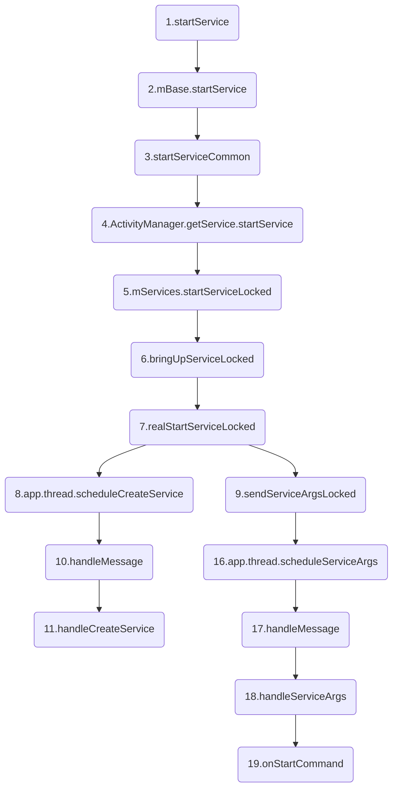
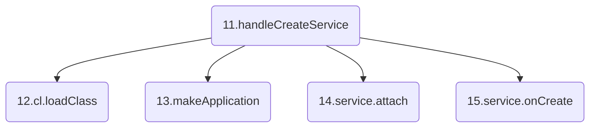
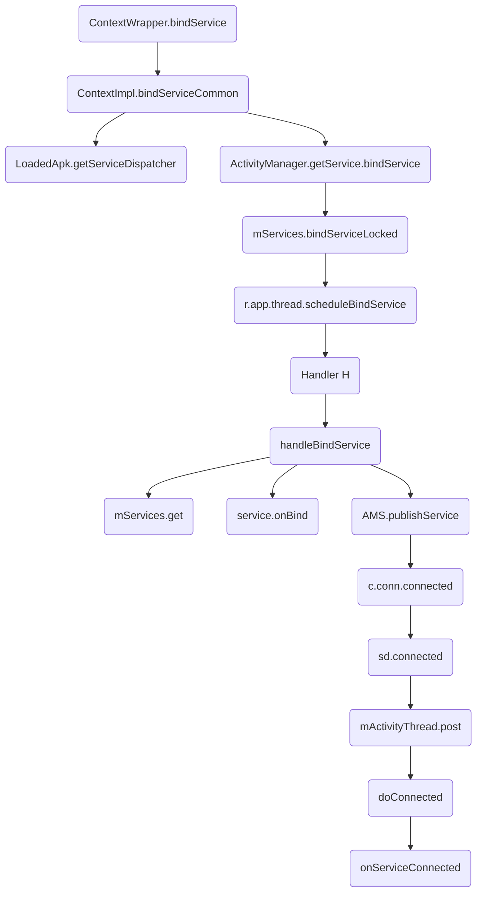
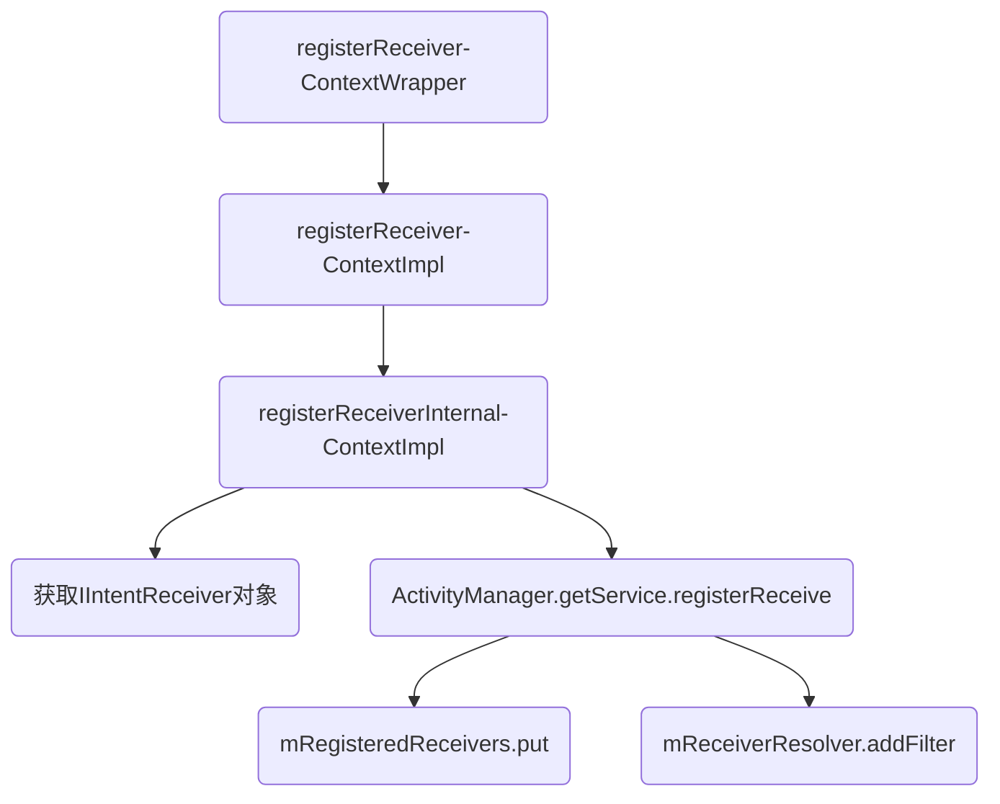
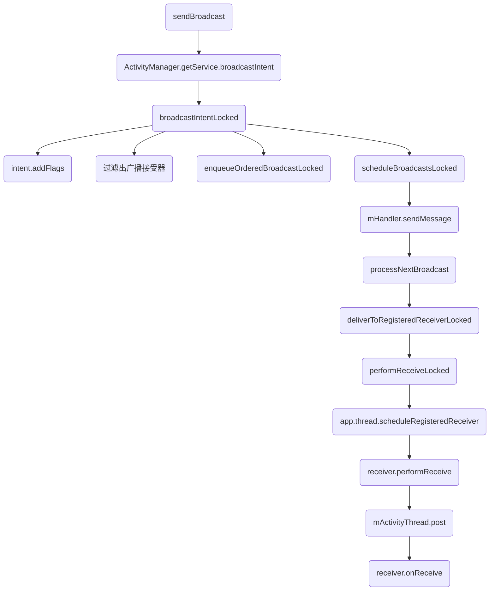
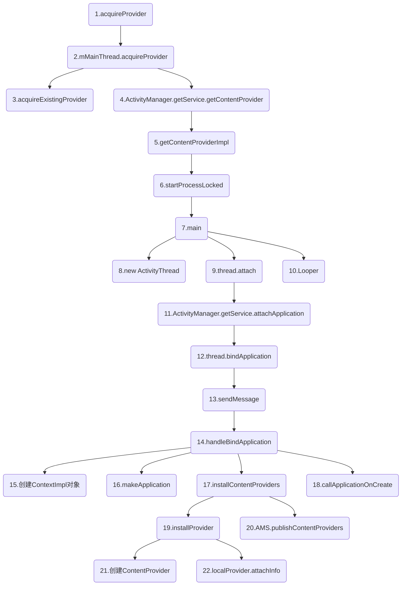

Android面试题之四大组件+Fragment，包括Activity、Service、广播、ContentProvider和Fragment。

>本文是我一点点归纳总结的干货，但是难免有疏忽和遗漏，希望不吝赐教。
>转载请注明链接：https://blog.csdn.net/feather_wch/article/details/81136168

# Android面试题-四大组件(73题)
版本：2018/8/30-1(1919)

[TOC]

1、四大组件的注册和调用方式
>1. Activity、Service、ContenProvider必须在`AndroidManifest`中注册
>2. `BroadcastReceiver`可以在`AndroidManifest`中注册，也可以`代码`中注册
>3. Activity、Service、ContenProvider的调用需要借助`Intent`
>4. `BroadcastReceiver`不需要借助`Intent`

## Service

18、Service是什么?
>1. 一种`计算型组件`，用于在后台执行一系列计算任务(处理网络事务、播放音乐、文件读写、或者与ContentProvider交互)。
>2. `Service`具有两种状态：`启动状态`和`绑定状态`
>3. 启动状态: 进行后台任务，`Service`本身运行在`主线程`，因此耗时操作需要在`新线程`中处理
>4. 绑定状态: 内部同样可以进行后台运算，但是此时`外界`可以很方便与`Service`通信
>5. `Service`的停止需要灵活采用`stopService和unBindService`才能完全停止

### 分类

19、Service的分类
>1. 本地服务
>2. 远程服务

20、本地服务是什么？
>1. 该类服务依赖在主进程上而不是独立的进程，一定程度上节约资源。
>2. 本地服务因为在同一进程内，不需要IPC和AIDL进行交互。`bindService`也方便很多。
>3. 缺点：限制性大，`主进程`被杀死后，`服务便会终止`。
>4. 应用场景：需要姨父某个进程的服务，比如音乐播放。

21、远程服务是什么？
>1. 该服务是`独立的进程`，进程名为`所在包名 + android:process指定的字符串`。
>2. 定义方式：用`android:process=".service"`
>3. 特点: 主进程被杀死后，该服务依然存在，不受其他进城影响，能为多个进程提供服务，具有灵活性。
>4. 会消耗更多资源，并且使用AIDL进行IPC比较麻烦，一般用于系统Service。
>5. 从Android 5.0开始，APP结束后会关闭相关进程树，因此相关的服务也会被杀死。

### 生命周期

22、Service的生命周期
>1. 仅仅是`startService`：onCreate()->onStartCommand()->onDestory()
>2. 仅仅是`bindService`：onCreate()->onBind()->onUnbind（）->onDestory()
>3. 同时使用`startService`开启服务与`bindService`绑定服务：onCreate()->onStartCommand()->onBind()->onUnbind（）->onDestory()

### 通信

23、Activity与Service间的通信方式
>1. Activity通过调用bindService，在ServiceConnection的onServiceConnected可以获取到Service的对象实例，然后就可以访问`Service`中的方法.(如果需要`Service`去主动通知`Activity`，可以通过`回调`来实现---在Activity的ServicConnection的onServiceConnected中去给Service设置实现的接口，该接口会在Service中被调用。)
>2. 通过`广播`
>3. 通过`EventBus`

### 启动模式

24、Service的启动方式有什么区别
>1. `startService`：Service与组件的生命周期无关，即使组件退出，Service依然存在。耗电，占内存。
>2. `bindService`：调用者退出后，Service也会退出。

25、startService
>1. Service无论调用多少次`startService`，`onCreate`只会调用一次，`onStartCommand`会调用相应次数。
>2. Service无论调用多少次`startService`，只存在`一个Service实例`
>3. 结束Service只需要调用一次`stopService或者stopSelf`
>4. Activity的退出并不会导致Service的退出---除非在onDestoyr里面调用stopService，但是`退出APP会导致Service1的退出！`
>5. 系统资源不足的时候，服务可能会被`Kill`

26、bindService
>1. Service通过`bindService`启动，无论调用多少次，`onCreate`只会调用一次，且`onStartCommand`不会被调用。
>2. 如果调用`Service`的组件退出，如Activity，Service就会被停止。
>3. `bindService`开启的Service的通信比较方便，不需要AIDL和IPC

27、startService且同时bindService
>1. `onCreate`之调用一次。
>1. `startService`调用几次，`onStartCommand`会调用相同次数。
>1. `bindService`不会调用`onStartCommand`
>1. 调用`unBindService`不会停止`Service`，必须调用`stopService`和Service自身的`stopSelf`来停止。
>1. 如果想停止这种Service，`unBindeService`和`stopService`都需要调用，缺一不可。

28、同时开启和绑定有什么作用？
>1. 能让`Service`一直处于后台运行的状态，即使组件已经退出。
>2. 同时通过`bindService`能方便地与`Service`通信
>3. 相比于`广播`的方式，性能更高。

29、Service的注意点
>1. 手机发生旋转时，Activity的重新创建，会导致之前`bindService`建立的连接断开，`Service`会因为COntext的销毁而自动停止。

#### startService流程

30、Service的启动方法
```java
Intent intent = new Intent(this, MyService.class);
startService(intent);
```
>1. Service有`启动状态`和`绑定状态`
>2. `两个状态可以共存`，Service可以既处于启动状态又处于绑定状态

31、Service的startService过程流程图和要点？

>1. startService(`ContextWrapper.java`):Activity层层继承自`ContextWrapper`;内部交由`ContextImpl`的`startSertvice()`;典型的桥接模式
>2. mBase.startService(`ContextImpl.java`): 交给ContextImpl执行。
>3. startServiceCommon(`ContextImpl.java`): 通过`ActivityManagerService`启动服务;IPC
>4. startService(`ActivityManagerService.java`):通过`ActiveServices`进行后续工作---调用`mServices.startServiceLocked`。
>5. startServiceLocked(`ActiveServices.java`):  bringUpServiceLocked
>6. bringUpServiceLocked(`ActiveServices.java`)： realStartServiceLocked
>7. realStartServiceLocked(`ActiveServices.java`): 1、app.thread.scheduleCreateService 2、sendServiceArgsLocked
>8. app.thread.scheduleCreateService(`ActivityThread.java`):1. 创建Service 2. 发送消息`CREATE_SERVICE`给Handler H
>9. sendServiceArgsLocked(): 用Service的其他方法(如onStartCommand)-IPC通信
>10. handleMessage(`ActivityThread.java`): 处理消息
>11. handleCreateService(`ActivityThread.java`): 处理`第12、13、14、15 四步的工作`, 进行Service的创建工作
>16. 16.app.thread.scheduleServiceArgs: IPC让ActivityThread只去执行其他的生命周期回调。发送消息给Handler H
>17. 17.handleMessage: 调用`handleServiceArgs`
>18. 18.handleServiceArgs: 执行其他的生命周期，如`onStartCommand`
>19. 19.onStartCommand: Service的回调方法


>11. handleCreateService(`ActivityThread.java`): 处理`第12、13、14、15 四步的工作`
>12. cl.loadClass().newInstance(): 类加载器创建Service实例。
>13. packageInfo.makeApplication: 用`LoadedApk`创建`Application实例`
>14. service.attach： 创建ContextImpling建立Context和Service的联系。
>15. service.onCreate()： Service的onCreate(), 并且将Service对象存储到ActivityThread中的一个列表中

32、ActiveServices是什么？
>1. 辅助ActivityManagerService进行Service管理
>2. 包括：启动、绑定、停止等

33、ServiceRecord是什么？
>1. 描述一个Service记录，官场整个启动过程

34、ContextWrapper是什么？
>1. ContextWrapper是Context实现类ContextImpl的包装类
>2. Activity、Service等都是直接或者间接继承自`ContextWrapper`

35、ContextWrapper为什么是典型桥接模式？

36、桥接模式和代理模式的区别？

##### 源码

37、Service的启动过程源码详细分析
```java
   /**
     * ======================================
     * 1. Activty层层继承自ContextWrapper
     * 2. Activty的startService()方法来自于ContextWrapper
     * 3. ContextWrapper最终由mBase(ContextImpl)完成-典型桥接
     * ======================================
     */
    //ContextWrapper.java
    public ComponentName startService(Intent service) {
        //1. mBase就是Context的实现ContextImpl对象(也就是Activity创建时关联的对象)
        return mBase.startService(service);
    }

    //ContextImpl.java：直接调用startServiceCommon
    public ComponentName startService(Intent service) {
        warnIfCallingFromSystemProcess();
        return startServiceCommon(service, false, mUser);
    }

    //ContextImpl.java
    private ComponentName startServiceCommon(Intent service, boolean requireForeground, UserHandle user) {
        ......
        //1. 让`ActivityManagerService`启动一个Service服务
        ComponentName cn = ActivityManager.getService().startService(
                mMainThread.getApplicationThread(), service, ...省略...);
        ......
    }

    //ActivityManagerService.java
    public ComponentName startService(IApplicationThread caller, Intent service, ...) {
        /**====================================
         * 1. 通过mService(ActiveServices)完成后续过程
         * 2. ActiveServices是辅助AMS进行Service管理的类
         *     -包括：启动、绑定、停止
         * 3. `startServiceLocked`方法尾部会调用`startServiceInnerLocked`
         *=====================================*/
        res = mServices.startServiceLocked(caller, service, ...,userId);
    }

    //ActiveServices.java
    ComponentName startServiceInnerLocked(...,ServiceRecord r) {
        ......
        /**=========================================
         * ServiceRecord描述的是一个Service记录(贯穿整个启动过程)
         * 1. startServiceInnerLocked并没有完成具体启动工作，而是把后续任务交给了bringUpServiceLocked
         * 2. bringUpServiceLocked内部调用`realStartServiceLocked`
         * 3. realStartServiceLocked真正启动了Service
         *==========================================*/
        String error = bringUpServiceLocked(r, service.getFlags(), callerFg, false, false);
        ......
        return r.name;
    }

    //ActiveServices.java
    private final void realStartServiceLocked(ServiceRecord r, ProcessRecord app, boolean execInFg) {
        ......
        /**========================================================
         * 创建了Service对象，并且调用了onCreate()方法-IPC通信
         * 1. app.thread对象是IApplicationThread类型(Binder)
         * 2. 具体实现是ActivityThread(继承了ApplicationThreadNative)
         *========================================================*/
        app.thread.scheduleCreateService(r, r.serviceInfo, ......);
        ......
        //2. 用于调用Service的其他方法(如onStartCommand)-IPC通信
        sendServiceArgsLocked(r, execInFg, true);
        ......
    }

    //ActivityThread.java的内部类：ApplicationThread
    public final void scheduleCreateService(IBinder token, ...,int processState) {
        updateProcessState(processState, false);
        CreateServiceData s = new CreateServiceData();
        s.token = token;
        s.info = info;
        s.compatInfo = compatInfo;
        /**========================================
         *  1. 发送消息给Handler H处理
         *  2. H会接受消息，并且调用ActivityThread的handleCreateService
         *========================================*/
        sendMessage(H.CREATE_SERVICE, s);
    }

    /**====================================
     * 完成Service最终启动工作
     * //ActivityThread.java
     *=====================================*/
    private void handleCreateService(CreateServiceData data) {
        //1. 通过类加载器创建Service实例
        Service service = null;
        java.lang.ClassLoader cl = packageInfo.getClassLoader();
        service = (Service) cl.loadClass(data.info.name).newInstance();
        //2. 创建Application对象并调用其onCreate方法(Application是唯一的不会重复创建)
        Application app = packageInfo.makeApplication(false, mInstrumentation);
        //3. 创建ContextImpl对象并通过Service的attach方法建立两者关系(类似Activity的过程)
        ContextImpl context = ContextImpl.createAppContext(this, packageInfo);
        context.setOuterContext(service);
        service.attach(context, this, data.info.name, data.token, app, ActivityManager.getService());
        //4. 调用service的onCreate方法，并且将Service对象存储到ActivityThread中的一个列表中
        service.onCreate();
        mServices.put(data.token, service);
        ......
    }

    /**=============================================================
     * ActivityThread中还会通过handleServiceArgs方法调用Service的onStartCommand
     *=============================================================*/
    private void handleServiceArgs(ServiceArgsData data) {
        Service s = mServices.get(data.token);
        ......
        //1. Service的onStartCommand方法
        res = s.onStartCommand(data.args, data.flags, data.startId);
        ......
    }
```

#### bindService流程

38、Service绑定流程图分析

>1. bindService(): 调用了ContextWrapper的该方法。
>2. bindServiceCommon(): ContextImpl的该方法，执行了`第3,4两步的工作`
>3. getServiceDispatcher(): 将客户端的ServiceConnection对象转换为`ServiceDispatcher内部类InnerConnection对象`，需要借助Binder才能让远程服务端调用自己的方法。
>4. ActivityManager.getService().bindService: 通过`AMS`执行bindService方法。
>5. mServices.bindServiceLocked(): 调用到`ActiveServices`的该方法。
>6. r.app.thread.scheduleBindService: 通过IPC去调用`ActivityThread内部类Application`的该方法。
>7. 本质都是通过Handler H的handleMessage()去进行处理
>8. handleBindService: 进行`第9、10、11 三步的任务`1.根据token取出Service 2.调用Service的onBind方法 3.通过IPC去告知客户端已经连接成功，并且执行onServiceConnected
>9. Service s = mServices.get(data.token): 利用token取出Service
>10. IBinder binder = s.onBind(data.intent): 知性Service的onBind方法
>11. ActivityManager.getService().publishService: Service在执行`onBind`后已经处于绑定状态，但是此时客户端并不知道，需要通过Binder去执行`ServiceConnection的onServiceConnected`方法。
>12. c.conn.connected: 调用`ServiceDispatcher.InnerConnection`的`connected()`【IPC】
>13. sd.connected： 调用LoadedApk.java的内部类ServiceDispatcher的方法
>14. mActivityThread.post: mActivityThread就是Handler H
>15. doConnected: 最终调用ServiceConnection的onServiceConnected方法

39、如何让远程服务端调用客户端的ServiceConnection中的方法？
>1. 无法直接让远程服务端使用
>2. 需要借助Binder才能让远程服务端毁掉自己的方法
>3. ServiceDispatcher的内部类InnerConnection就起到了Binder的作用
>4. ServiceDispatcher起到连接ServiceConnection和InnerConnection的作用

40、getServiceDispatcher的原理
>1. 使用ArrayMap来:存储应用当前活动的ServiceConnection和ServiceDispatcher的映射关系
>2. key = ServiceConnection, value = ServiceDispatcher
>3. 根据ServiceConnection去查询是否有对应的ServiceDispatcher，存在就直接返回ServiceDispatcher的InnerConnection。
>4. 不存在，就新建ServiceDispatcher，并将映射关系存放到Map中。

41、何时Service处于绑定状态(何时执行的onBind方法)？
>1. 执行到`ActivityThread`的`handlerBindService()`里，会获取到Service并且执行Service的onBind方法，此时就处于了绑定状态。

42、何时执行的ServiceConnection的onServiceConnected方法？
>1. AMS的publishService： 需要在Service进入绑定状态后，告知客户端已经完成连接。
>2. 【IPC】LoadedApk的ServiceDispatcher的connected方法
>3. 通过Handler H，最终在`ActivityThread`内部执行了onServiceConnected方法。

43、Service在ActivityThread中的存储？
>1. ActivityThread通过ArrayMap存储了IBinder和Service的映射关系。
>2. key = IBinder, value = Service
>3. 在handlerCreateService中创建好Service后，会将IBinder-Service的映射关系保存到Map中。
>4. AMS通过Binder去执行Service的任务比如执行Service的onBind方法，需要知道IBinder对应的是哪个Service，就利用到了ArrayMap存储的映射关系。

##### 源码

44、Service的绑定过程源码
```java
/**
 * ==============================================
 * 1. bindService最终也是调用的ContextWrapper的方法
 * 2. 与启动过程类似, mBase是ContextImpl最终会调用自身的bindServiceCommon方法
 * //ContextWrapper.java
 * =============================================
 */
public boolean bindService(Intent service, ServiceConnection conn, int flags) {
    return mBase.bindService(service, conn, flags);
}

//ContextImpl.java
private boolean bindServiceCommon(Intent service, ServiceConnection conn, int flags, Handler
        handler, UserHandle user) {
    /**======================================================================
     * 1. 将客户端的ServiceConnection对象转化为`ServiceDispatcher.InnerConnection`对象
     *  -ServiceConnection必须借助于Binder才能让远程服务端回调自己的方法
     *  -ServiceDispatcher的内部类InnerConnection就起到了Binder的作用
     *  -ServiceDispatcher起到连接ServiceConnection和InnerConnection的作用
     *======================================================================*/
    IServiceConnection sd;
    sd = mPackageInfo.getServiceDispatcher(conn, getOuterContext(), handler, flags);
    //2. 通过ActivityManagerService完成Service的绑定过程
    int res = ActivityManager.getService().bindService(... , service,...);
    ......
}

//LoadedApk.java
public final IServiceConnection getServiceDispatcher(ServiceConnection c, Context context, Handler handler, int flags) {
    /**================================
     * 1.mServices是ArrayMap:存储应用当前活动的ServiceConnection
     *    和ServiceDispatcher的映射关系
     *================================*/
    synchronized (mServices) {
        LoadedApk.ServiceDispatcher sd = null;
        //2. 获取`映射关系`的map
        ArrayMap<ServiceConnection, LoadedApk.ServiceDispatcher> map = mServices.get(context);
        if (map != null) {
            //3. 通过ServiceConnection去查询是否有ServiceDispatcher
            sd = map.get(c);
        }
        //4. 不存在ServiceDispatcher,新建ServiceDispatcher对象,
        if (sd == null) {
            sd = new ServiceDispatcher(c, context, handler, flags);
            if (map == null) {
                map = new ArrayMap<>();
                //6. 将该`映射关系`与Context放置到ArrayMap中
                mServices.put(context, map);
            }
            //5. key=ServiceConnection,value=ServiceDispatcher,建立映射关系
            map.put(c, sd);
        }
        //7. 返回ServiceDispatcher内部保存的InnerConnection
        return sd.getIServiceConnection();
    }
}

//ActivityManagerService.java
public int bindService(IApplicationThread caller, IBinder token, Intent service,...) {
    ......
    /**=========================
     * ActiveServices的方法：
     *  1. bindServiceLocked
     *  2. bringUpServiceLocked
     *  3. realStartServiceLocked
     *  4. 最后都是通过ActivityThread来完成Service实例的创建
     *      并且执行Services的onCreate方法
     *  * Service绑定与启动的不同在于会调用app.thread的scheduleBindService方法
     *      (在ActiveServices的requestServiceBindingLocked中调用)
     *============================*/
    return mServices.bindServiceLocked(caller, token, service,...);
}

//ActiveServices.java
private final boolean requestServiceBindingLocked(ServiceRecord r, IntentBindRecord i,...) {
    ......
    //ActivityThread内部类：`ApplicationThread`——中一系列`schedule`方法之一,最终通过Handler H进行中转，最终交给handleBindServices
    r.app.thread.scheduleBindService(r, i.intent.getIntent(), rebind, r.app.repProcState);
    ......
}

//ActivityThread
private void handleBindService(BindServiceData data) {
    //1. 根据token取出Service
    Service s = mServices.get(data.token);
    if (s != null) {
        if (!data.rebind) {
            /**================================
             * 2. 调用Service的onBind方法
             *  -此时Service就已经处于绑定状态，但此时客户端并不知道连接成功
             *  -因此必须调用客户端ServiceConnection中的onServiceConnected
             *=================================*/
            IBinder binder = s.onBind(data.intent);
            /**=======================================
             * 3. ActivityManagerService的publishService
             *  -1.会执行客户端ServiceConnection中的onServiceConnected
             *  -2.保证Service的onBind方法之调用一次(多次绑定同一个Service)
             *  -3.最终将具体任务交给ActiveServices的publishServiceLocked方法
             *========================================*/
            ActivityManager.getService().publishService(data.token, data.intent, binder);
        }
    }
    ......
}

//ActiveServices.java
void publishServiceLocked(ServiceRecord r, Intent intent, IBinder service) {
    ......
    /**===================================
     * 1. c是ConnectionRecord
     * 2. c.conn是ServiceDispatcher.InnerConnection
     * 3. service就是Service的onBind方法返回的Binder对象
     *==================================*/
    c.conn.connected(r.name, service, false);
    ......
}

//LoadedApk.java的内部类ServiceDispatcher的内部类InnerConnection
private static class InnerConnection extends IServiceConnection.Stub {
    ......

    public void connected(ComponentName name, IBinder service, boolean dead) {
        LoadedApk.ServiceDispatcher sd = mDispatcher.get();
        if (sd != null) {
            //1. 调用ServiceDispatcher的方法
            sd.connected(name, service, dead);
        }
    }
}

//LoadedApk.java的内部类: ServiceDispatcher
public void connected(ComponentName name, IBinder service, boolean dead) {
    /**=========================================================
     *1. mActivityThread是一个Handler，其实就是ActivityThread中的H
     *2. 最终RunConnection通过H的post方法从而运行在主线程中
     *3. 因此客户端ServiceConnection就是在主线程被回调
     *========================================================*/
    mActivityThread.post(new RunConnection(name, service, 0, dead));
}

//LoadedApk.java内部类ServiceDispatcher的内部类: RunConnection
private final class RunConnection implements Runnable {
    ......
    /**
     * =========================================================
     * 1. 本质调用ServiceDispatcher的doConnected
     * 2. ServiceDispatcher内部拥有客户端的ServiceConnection
     * ========================================================
     */
    public void run() {
        if (mCommand == 0) {
            doConnected(mName, mService, mDead);
        } else if (mCommand == 1) {
            doDeath(mName, mService);
        }
    }
}

//LoadedApk.java内部类: ServiceDispatcher
public void doConnected(ComponentName name, IBinder service, boolean dead) {
    ....
    if (service != null) {
        //1. 可以通过客户端的ServiceConnection调用onServiceConnected
        mConnection.onServiceConnected(name, service);
    }
}
```

## Broadcast

45、BroadcastReceiver是什么？
>1. 一种`消息型组件`，用于在不同组件甚至不同应用间传递消息
>2. `静态注册`: 在AndroidManifest中注册广播，会在`应用安装时被系统解析`，不需要启动应用就可以接收到相应广播(从Android 3.1开始默认不给不在运行的应用发送广播)
>3. `动态注册`: `Context.registerReceiver()`进行注册，`Context.unRegisterReceiver()`解除注册. 需要APP启动才能注册并且接收广播。
>4. 广播发送通过`Context`的一系列`send`方法完成
>5. `发送和接收`过程的匹配通过广播接收者的`intent-filter`来描述

### 分类

46、广播分为几种
>1. 普通广播
>2. 有序广播

47、普通广播是什么？
>1. 调用`sendBroadcast()`发送

48、有序广播是什么？
>1. 调用`sendOrderedBroadcast()`发送
>2. 广播接收者会按照`priority优先级`从大到校进行排序
>3. `优先级`相同的广播，`动态注册`的广播优先处理
>4. 广播接收者还能对`广播`进行`截断和修改`

49、广播的发送和接收原理
>1. 继承BroadcastReceiver,在`onReceive()`中实现接收到广播后应该进行的操作。
>2. 通过`Binder机制`向`ActivityManagerService`注册广播。
>3. 通过`Binder机制`向`ActivityManagerService`发送广播。
>4. `ActivityManagerService`会查找符合`广播`条件(`IntentFilter/Permission`)的所有`BroadcastReceiver`, 并将这些广播接受器存放到队列中。
>5. 遍历队列中所有的`BroadcastReceiver`，并将`广播`发送给该接收器【IPC】。
>6. 最终通过Handler H回调其`onReceive()`方法。

50、BroadcasReceiver和LocalBroadcastReceiver
>1. `BroadcasReceiver`是跨应用广播，利用`Binder机制`实现。
>2. `LocalBroadcastReceiver`是`应用内广播`，利用`Handler`实现。利用`IntentFilter`的`match`功能，提供消息的发布与接收，实现应用内通信，效率较高。

51、本地广播的优点
>1. 效率更改。
>2. 发送的广播不会离开我们的应用，不会泄露关键数据。
>3. 其他程序无法将广播发送到我们程序内部，不会有安全漏洞。

### 注册方式

52、广播两种注册方式的区别
>1. `静态注册`：常驻系统，不受组件生命周期的影响，耗电，占内存
>2. `动态注册`：非常驻系统，组件结束，广播就结束。但是在组件结束前，一定要释放广播，避免内存泄露和崩溃。

53、广播的静态注册过程:
>1. 安装应用时由系统自动完成注册
>2. 具体是由`PMS(Package Manager Service)`来完成注册过程
>3. 本质其他`三大组件`的注册都是在安装时由`PMS`解析并注册

#### 动态注册

54、广播动态注册的流程图

>1. registerReceiver: ContextWrapper.java, 层层调用
>2. registerReceiver: ContextImpl.java, 层层调用
>3. registerReceiverInternal: ContextImpl.java 进行下面`4、5的工作`
>4. mPackageInfo.getReceiverDispatcher/LoadedApk.ReceiverDispatcher : 获取到IIntentReceiver对象
>5. ActivityManager.getService().registerReceiver(): 【IPC】调用AMS的registerReceiver方法，进行下面`6、7的工作`
>6. mRegisteredReceivers.put()： 将InnerReceiver对象进行存储(该对象与BroadcastReceiver对象相对应)
>7. (mReceiverResolver.addFilter(): 存储IntentFilter

55、为什么需要将BroadcastReceiver转换为IIntentReceiver？
>1. BroadcastReceiver作为组件不能直接进行IPC，需要进行中转
>2. IIntentReceiver是Binder接口，具体实现是LoadedApk.ReceiverDispatcher.InnerReceiver
>3. ReceiverDispatcher中同时保存了 BroadcastReceiver和InnerReceiver，接收广播时ReceiverDispatcher可以很方便调用BroadcastReceiver的onReceive()方法
>4. Service也有ServiceDispatcher和内部类InnerConnection(Binder接口)，原理相同

56、动态注册的本质是什么？
>1. 将BoradcastReceiver对应的Binder对象InnerReceiver存储到ActivityManagerService的Map中
>2. 将IntentFilter存储到AMS中

##### 动态注册源码

57、广播的动态注册过程:
```java
/**
 * =================================
 * 1. 动态注册是从ContextWrapper的registerReceiver方法开始
 * 2. 之后直接交给ContextImpl完成
 * //ContextWrapper.java
 * =================================
 */
public Intent registerReceiver(BroadcastReceiver receiver, IntentFilter filter) {
    //1. mBase = ContextImpl
    return mBase.registerReceiver(receiver, filter);
}

//ContextImpl.java
public Intent registerReceiver(BroadcastReceiver receiver, IntentFilter filter,......) {
    return registerReceiverInternal(receiver, ......);
}

//ContextImpl.java
private Intent registerReceiverInternal(BroadcastReceiver receiver, ......) {
    IIntentReceiver rd = null;
    if (receiver != null) {
        if (mPackageInfo != null && context != null) {
            //1. 从mPackageInfo获取IIntentReceiver对象
            rd = mPackageInfo.getReceiverDispatcher(receiver, context, scheduler, ......);
        } else {
            /**==============================================================================
             *2.从mPackageInfo获取IIntentReceiver对象
             * 1-采用IIntentReceiver而不是BroadcastReceiver是因为这是IPC过程
             * 2-BroadcastReceiver作为组件不能直接进行IPC，需要进行中转
             * 3-IIntentReceiver是Binder接口，具体实现是LoadedApk.ReceiverDispatcher.InnerReceiver
             * 4-ReceiverDispatcher中同时保存了 BroadcastReceiver和InnerReceiver，接收广播时ReceiverDispatcher
             *     可以很方便调用BroadcastReceiver的onReceive()方法
             * 5-可以发现Service也有ServiceDispatcher和内部类InnerConnection(Binder接口)，原理相同
             *===============================================================================*/
            rd = new LoadedApk.ReceiverDispatcher(receiver, context, scheduler, null, true)
                    .getIIntentReceiver();
        }
    }
    //3. 通过ActivityManagerService, 远程进行注册
    final Intent intent = ActivityManager.getService().registerReceiver(
            mMainThread.getApplicationThread(), mBasePackageName, rd, filter,
            broadcastPermission, userId, flags);
        ......
}

//ActivityManagerService.java：广播完成注册
public Intent registerReceiver(IApplicationThread caller, ...,IIntentReceiver receiver, ...) {
    ......
    //1. 存储远程的InnerReceiver对象(本地的BroadcastReceiver对应的对象)
    mRegisteredReceivers.put(receiver.asBinder(), rl);
    //2. 存储IntentFiler对象
    BroadcastFilter bf = new BroadcastFilter(filter, rl, callerPackage,
            permission, callingUid, userId, instantApp, visibleToInstantApps);
    rl.add(bf);
    mReceiverResolver.addFilter(bf);
    ......
}
```

#### 广播发送

58、广播发送/接收的流程图(普通广播)

>1. sendBroadcast: 调用顺序-Activity->ContextWrapper->ContextImpl
>2. ActivityManager.getService().broadcastIntent(......)： 直接向AMS发起一个异步请求用于发送广播
>3. broadcastIntentLocked: 进行`第4、5、6、7的工作`---添加标志位(不给已经停止的应用发送广播)、根据Intent-Fillter找到匹配的BroadcastReceiver、经过过滤后将
>4. intent.addFlags(Intent.FLAG_EXCLUDE_STOPPED_PACKAGES): 从Android 3.1开始默认不会给已经停止的应用发送广播。
>5. 根据intent-filter查找出匹配的广播接收者, 过滤出所有符合条件的BroadcastReceiver
>6. queue.enqueueOrderedBroadcastLocked: 会将满足条件的广播接收者都加入到BroadcastQueue中
>7. queue.scheduleBroadcastsLocked：会将广播发送到BroadcastQueue中的所有广播接收者中。
>8. mHandler.sendMessage: 发送消息
>9. processNextBroadcast: 取出广播并且发送给所有接收者。
>10. deliverToRegisteredReceiverLocked: 发送广播
>11. performReceiveLocked: 通过IPC发送给ActivityThread
>12. app.thread.scheduleRegisteredReceiver: 通过InnerReceiver实现广播的接收
>13. receiver.performReceive: ReceiverDispatcherd的performReceive方法，通过Handler H去投递一个Runnable
>14. mActivityThread.post： 通过Handler H 的post方法投递Runnable
>15. receiver.onReceive: 执行BroadcastReceiver的onReceive方法

##### 源码

59、广播的发送和接收过程源码(普通广播为例):
>1. 通过`sendBroadcast`发送广播时，AMS会查找出匹配的广播接收者并将广播发送给它们处理
>2. 广播分为：普通广播、有序广播和粘性广播
```java
/**
 * ==================================================
 * 1. 广播的发送开始于ContextWrapper的sendBroadcast方法
 * 2. 最终会交给ContextImpl的sendBroadcast方法去处理
 * // ContextImpl.java
 * ==================================================
 */
public void sendBroadcast(Intent intent) {
    //1. 直接向AMS发起一个异步请求用于发送广播
    ActivityManager.getService().broadcastIntent(......);
    ......
}
//ActivityManagerService.java
public final int broadcastIntent(IApplicationThread caller, Intent intent, ......) {
    ....
    int res = broadcastIntentLocked(callerApp, ......);
}
//ActivityManagerService.java
final int broadcastIntentLocked(ProcessRecord callerApp, ......) {
    intent = new Intent(intent);
    /**==============================================================
     *1. 默认情况下广播不会发送给已经停止的应用(从Android 3.1开始)
     * Intent中新增两个标记:
     *  FLAG_EXCLUDE_STOPPED_PACKAGES-不包含已经停止应用
     *  FLAG_INCLUDE_STOPPED_PACKAGES-包含已经停止应用
     * -如果两个标记共存，则以FLAG_INCLUDE_STOPPED_PACKAGES为准
     * -停止状态为：1-应用安装后未运行 2-应用被手动或者其他应用强制停止
     *==============================================================*/
    intent.addFlags(Intent.FLAG_EXCLUDE_STOPPED_PACKAGES);
    ......
    /**================================================
     *2. 根据intent-filter查找出匹配的广播接收者
     *3. 进过一系列过滤后，将满足条件的广播接收者添加到`BroadcastQueue`
     *4. BroadcastQueue就会将广播发送给相应的广播接收者
     *===============================================*/
    if ((receivers != null && receivers.size() > 0)
            || resultTo != null) {
        BroadcastQueue queue = broadcastQueueForIntent(intent);
        BroadcastRecord r = new BroadcastRecord(queue, intent, callerApp, ......);

       ......
        queue.enqueueOrderedBroadcastLocked(r);
        //4. BroadcastQueue就会将广播发送给相应的广播接收者
        queue.scheduleBroadcastsLocked();
    }
    ......
    return ActivityManager.BROADCAST_SUCCESS;
}
//BroadcastQueue.java
public void scheduleBroadcastsLocked() {
    //1. 发送消息，BroadcastQueue收到消息后会调用processNextBroadcast方法
    mHandler.sendMessage(mHandler.obtainMessage(BROADCAST_INTENT_MSG, this));
}
//BroadcastQueue.java
final void processNextBroadcast(boolean fromMsg) {
    synchronized (mService) {
        BroadcastRecord r;
        ......
        //1. 普通广播处理
        while (mParallelBroadcasts.size() > 0) {
            //2. 无序广播存储在mParallelBroadcasts中
            r = mParallelBroadcasts.remove(0);
            final int N = r.receivers.size();
            //3. 取出广播并发送给他们所有的接受者
            for (int i = 0; i < N; i++) {
                Object target = r.receivers.get(i);
                //4. 发送广播
                deliverToRegisteredReceiverLocked(r, (BroadcastFilter) target, false, i);
            }
            addBroadcastToHistoryLocked(r);
        }
        ......
    }
}
//BroadcastQueue.java
private void deliverToRegisteredReceiverLocked(BroadcastRecord r, BroadcastFilter filter, boolean ordered, int index) {
    performReceiveLocked(filter.receiverList.app, filter.receiverList.receiver, ......);
}
//BroadcastQueue.java
void performReceiveLocked(ProcessRecord app, IIntentReceiver receiver, ...) {
    ......
    //1. app.thread为ActivityThread,会调用其中方法
    app.thread.scheduleRegisteredReceiver(receiver, intent, resultCode, data, extras, ordered, sticky, sendingUser, app.repProcState);
}
//ActivityThread.java
public void scheduleRegisteredReceiver(IIntentReceiver receiver, Intent intent, ......) {
    updateProcessState(processState, false);
    //1. 通过`InnerReceiver`实现广播的接收, 内部会调用ReceiverDispatcher的performReceive方法
    receiver.performReceive(intent, resultCode, dataStr, extras, ordered, sticky, sendingUser);
}
//LoadedApk.java内部类ReceiverDispatcher
public void performReceive(Intent intent, int resultCode, String data, ......) {
    //1. 创建Args对象
    final Args args = new Args(intent, resultCode, data, extras, ordered, sticky, sendingUser);
    ......
    /**=========================================================
     * 2. 通过mActivityThread的post方法来执行args中的逻辑
     *   -mActivityThread是Handler(也就是ActivityThread中的Handler H)
     *   -Args中实现了Runnable接口-在广播接受线程中执行了onReceive方法
     *========================================================*/
    if (intent == null || !mActivityThread.post(args.getRunnable())) {
        ......
    }
}
//LoadedApk.java内部类ReceiverDispatcher.Args
final class Args extends BroadcastReceiver.PendingResult {
    .......

    public final Runnable getRunnable() {
        return () -> {
            //1. 执行了BroadcastReceiver的onReceive方法
            final BroadcastReceiver receiver = mReceiver;
            ......
            receiver.onReceive(mContext, intent);
            ......
        };
    }
}
```

## ContentProvider

60、ContentProvider是什么？
>1. 一种`数据共享型组件`
>2. 内部需要实现`增删改查`四种操作
>3. 内部的`insert\delete\update\query`方法需要处理好线程同步，因为这些方法都在`Binder线程池`中调用

61、ContentProvider要点
> 1. ContentProvider所在进程启动时，就会同时启动并且发布到AMS中
> 2. ContentProvider的onCreate要先于Application的onCreate执行

### 启动

62、ContentProvider的启动流程
>1. `ActivityThread`的`main`方法为应用启动时的入口，`main`是静态方法——会创建`ActivityThread`的实例，并且创建`主线程`的`消息队列`
> 2. 然后会在`ActivityThread`的`attach()`方法中远程调用`AMS`的`attachApplication`方法并将`ApplicationThread`对象提供给`AMS`
> 3. `ApplicationThread`是Binder对象，Binder接口是`IApplicationThread`，主要用于`ActivityThread`和`AMS`之间的通信
> 4. `AMS`的`attachApplication`中会调用`ApplicationThread`的`bindApplication`方法(IPC过程),`bindApplication`的逻辑会通过`ActivityThread`中的`Handler H`切换到`ActivityThread`中的`handleBindApplication`去处理
> 5. `handleBindApplication`中会创建`Application`对象并且加载`ContentProvider`
> 6. 加载`ContentProvider`后，才会调用`Application`的`onCreate`方法

### 数据访问
63、ContentProvider的数据访问
> 1. ContentProvider启动后，外界就可以通过提供的接口进行增删改查
> 2. 外界无法直接访问`ContentProvider`，需要通过`AMS`根据`Uri`来获取对应的`ContentProvider`的Binder接口`IContentProvider`
> 3. 然后通过`IContentProvider`来访问其数据源
```java
/**
 * =============================================================================
 * 1. 其他应用通过AMS来访问指定的ContentProvider
 * 2. 通过AMS获得ContentProvider的Binder对象：IContentProvider
 * 3. IContentProvider的具体实现ContentProvider.Transport(继承自ContentProviderNative）
 * 以query为例: 最终会通过IPC调用到ContentProvider.Transport的query方法
 * //ContentProvider.java内部类: Transport
 * =============================================================================
 */
public Cursor query(String callingPkg, Uri uri, String[] projection, ......) {
    ......
    //1. 调用了ContentProvider的query方法
    Cursor cursor = ContentProvider.this.query(uri, projection, queryArgs, CancellationSignal.fromTransport(cancellationSignal));
    ......
}
```

### 数据解析

64、ContentProvider的数据访问解析
>1. 访问`ContentProvider`需要通过`ContentResolver`，这是一个抽象类
> 2. `Context的getContentResolver()`本质获取的是`ApplicationContentResolver`对象(ContextImpl的内部类)
> 3. 当`ContentProvider`所在进程未启动时，第一次访问会触发所在进程的启动和`ContentProvider`的创建。
> 4. 例如`query`方法，首先会获取`IContentProvider`对象，最终通过`acquireProvider`来获取`ContentProvider`

65、ContentProvider访问和创建的流程图

>1. acquireProvider：；直接调用`ActivityThread`的方法; 位于`ContextImpl.java的内部类：ApplicationContentResolver`
>2. mMainThread.acquireProvider: 进行`3、4`
>3. acquireExistingProvider(): 查询是否存在需要的ContentProvider，存在就直接返回
>4. ActivityManager.getService().getContentProvider: 发送请求让`AMS`启动需要的`ContentProvider`
>5. getContentProviderImpl: 调用`startProcessLocked`去启动ContentProvide所在进程，然后才会启动ContentProvider
>6. startProcessLocked: 1. 会先启动ContentProvider所在的进程，然后才会启动ContentProvider 2. 主要是通过Process的start方法来完成新进程的启动 3. 新进程启动后入口方法在ActivityThread的main方法
>7. main: 进行`第8、9、10三个工作`1.创建ActivityThread实例 2.初始化工作 3.Looper相关
>8. new ActivityThread(): 创建实例
>9. thread.attach: 一系列初始化工作
>10. Looper: Looper相关工作
>11. ActivityManager.getService().attachApplication(): 通过`AMS`进行处理---【IPC】
>12. thread.bindApplication(): 通过【IPC】又交给ContentProvider进程进行bindApplication操作
>13. sendMessage(H.BIND_APPLICATION): 发送`BIND_APPLICATION`
>14. handleBindApplication: 进行`15、16、17、18的工作`，主要是创建Application和COntentProvider
>15. ContextImpl.createAppContext: 创建ContextImpl对象
>16. makeApplication: 创建Application对象
>17. installContentProviders: 进行`19、20`，启动当前进程的ContentProvider并调用其onCreate方法
>18. callApplicationOnCreate： 调用Application的onCreate方法
>19. installProvider: 遍历当前进程的Provider列表，调用installProvider进行启动。进行`21、22`
>20. AMS.publishContentProviders: 将已经启动的ContentProvider保存在AMS的ProviderMap中 外部调用者就可以直接从AMS中获取ContentProvider
>21. 类加载器创建ContentProvider
>22. localProvider.attachInfo: 通过ContextProvider的方法调用了onCreate方法

#### 源码

66、ContentProvider源码解析
```java
    //ContextImpl.java的内部类：ApplicationContentResolver
    protected IContentProvider acquireProvider(Context context, String auth) {
        //1. 直接调用`ActivityThread`的方法
        return mMainThread.acquireProvider(context, ContentProvider.getAuthorityWithoutUserId(auth), resolveUserIdFromAuthority(auth), true);
    }

    //ActivityThread.java
    public final IContentProvider acquireProvider(Context c, String auth, int userId, boolean stable) {
        //1. 查找是否已经存在需要的ContenProvider
        final IContentProvider provider = acquireExistingProvider(c, auth, userId, stable);
        if (provider != null) {
            //2. 存在就直接返回——ActivityThread通过mProviderMap来存储已经启动的ContentProvider
            return provider;
        }
        ContentProviderHolder holder = null;
        //3. 不存在就发送请求让`AMS`启动需要的`ContentProvider`
        holder = ActivityManager.getService().getContentProvider(getApplicationThread(), auth, userId, stable);
        ......
        //4. 最后修改引用计数
        holder = installProvider(c, holder, holder.info, true, holder.noReleaseNeeded, stable);
        return holder.provider;
    }

    //ActivityManagerService.java
    public final ContentProviderHolder getContentProvider(IApplicationThread caller, String name, int userId, boolean stable) {
        ...
        return getContentProviderImpl(caller, name, null, stable, userId);
    }

    //ActivityManagerService.java
    private ContentProviderHolder getContentProviderImpl(IApplicationThread caller, ...) {
        ContentProviderRecord cpr;
        ContentProviderConnection conn = null;
        ProviderInfo cpi = null;
        ......
        //1. 会先启动ContentProvider所在的进程，然后才会启动ContentProvider
        /**==================================================================
         * 1. 会先启动ContentProvider所在的进程，然后才会启动ContentProvider
         * 2. startProcessLocked中主要是通过Process的start方法来完成新进程的启动
         * 3. 新进程启动后入口方法在ActivityThread的main方法(个人认为这是ContentProvider的进程不是我们自己应用的)
         *==================================================================*/
        proc = startProcessLocked(cpi.processName,
                cpr.appInfo, false, 0, "content provider",
                new ComponentName(cpi.applicationInfo.packageName,
                        cpi.name), false, false, false);
        ......
        return cpr != null ? cpr.newHolder(conn) : null;
    }

    //ActivityThread.java
    public static void main(String[] args) {
        ...
        //1. 首先会创建ActivityThread实例
        ActivityThread thread = new ActivityThread();
        //2. 然后调用attach-进行一系列初始化
        thread.attach(false);
        //3. 然后开始消息循环
        Looper.prepareMainLooper();
        if (sMainThreadHandler == null) {
            sMainThreadHandler = thread.getHandler();
        }
        if (false) {
            Looper.myLooper().setMessageLogging(new LogPrinter(Log.DEBUG, "ActivityThread"));
        }
        Looper.loop();
        ...
    }

    //ActivityThread.java
    private void attach(boolean system) {
        ......
        //1. 将ApplicationThread对象传输给AMS(IPC)
        final IActivityManager mgr = ActivityManager.getService();
        mgr.attachApplication(mAppThread);
        ......
    }

    //ActivityManagerService.java
    public void attachApplication(IApplicationThread thread) {
        attachApplicationLocked(thread, callingPid);
    }

    //ActivityManagerService.java
    private boolean attachApplicationLocked(IApplicationThread thread, int pid) {
        ......
        thread.bindApplication(processName, appInfo, providers, ......);
        ......
    }

    //ActivityThread.java内部类：ApplicationThread
    public final void bindApplication(String processName, ApplicationInfo appInfo,......) {
        ......
        //1. 发送消息给Handler H(ActivityThread)
        sendMessage(H.BIND_APPLICATION, data);
    }
    //ActivityThread.java

    /**
     * ==============================================
     * -完成了Application的创建
     * -以及ContentProvider的创建
     * //ActivityThread.java
     * ================================================
     */
    private void handleBindApplication(AppBindData data) {
        ...
        //1. 创建ContextImpl对象和Instrumentation
        final ContextImpl instrContext = ContextImpl.createAppContext(this, pi);
        final ClassLoader cl = instrContext.getClassLoader();
        //Instrumentation
        mInstrumentation = (Instrumentation) cl.loadClass(data.instrumentationName.getClassName()).newInstance();
        final ComponentName component = new ComponentName(ii.packageName, ii.name);
        mInstrumentation.init(this, instrContext, appContext, component, data.instrumentationWatcher, data.instrumentationUiAutomationConnection);
        //2. 创建Application对象
        Application app = data.info.makeApplication(data.restrictedBackupMode, null);
        mInitialApplication = app;
        //3. 启动当前进程的ContentProvider并调用其onCreate方法
        if (!data.restrictedBackupMode) {
            if (!ArrayUtils.isEmpty(data.providers)) {
                installContentProviders(app, data.providers); //启动并且调用onCreate
                mH.sendEmptyMessageDelayed(H.ENABLE_JIT, 10 * 1000);
            }
        }
        //4. 调用Application的onCreate方法
        mInstrumentation.callApplicationOnCreate(app);
    }
    //ActivityThread.java
    private void installContentProviders(Context context, List<ProviderInfo> providers) {
        final ArrayList<ContentProviderHolder> results = new ArrayList<>();
        //1. 遍历当前进程的Provider列表
        for (ProviderInfo cpi : providers) {
            //2. 调用installProvider进行启动
            ContentProviderHolder cph = installProvider(context, null, cpi, ......);
            if (cph != null) {
                cph.noReleaseNeeded = true;
                results.add(cph);
            }
        }
        //2. 将已经启动的ContentProvider保存在AMS的ProviderMap中， 外部调用者就可以直接从AMS中获取ContentProvider
        ActivityManager.getService().publishContentProviders(getApplicationThread(), results);
        ......
    }
    //ActivityThread.java
    private ContentProviderHolder installProvider(Context context, ......) {
        ContentProvider localProvider = null;
        IContentProvider provider;
        ...
        //1. 通过类加载器完成了ContentProvider对象的创建
        final java.lang.ClassLoader cl = c.getClassLoader();
        localProvider = (ContentProvider) cl.loadClass(info.name).newInstance();
        provider = localProvider.getIContentProvider();
        if (provider == null) {
            return null;
        }
        //2. 通过ContextProvider方法调用了onCreate方法
        localProvider.attachInfo(c, info);
        ...
    }
```

## Fragment
67、Fragment的常见问题，以及如何处理？
>1. `getActivity()空指针`：常见于进行异步操作的时候，此时如果`Fragment已经onDetach()`,就会遇到。解决办法：在`Fragment`里面使用一个`全局变量mActivity`，可能会导致内存泄露。但是比`崩溃`更好。
>2. `视图重叠`：主要是因为`Fragment`的`onCreate()`中没有判断`saveInstanceSate == null`，导致重复加载了同一个`Fragment`


## 序列图解析四大组件流程

68、Activity的启动
```sequence
Activity->Activity:1.startActivity
Activity->Activity:2.startActivityForResult
Activity->Activity:3.mInstrumentation.\nexecStartActivity
Activity->ActivityManagerService:【IPC】4.ActivityManager.\ngetService()
ActivityManagerService->ActivityManagerService:5.startActivity()
Activity->Activity:6.checkStartActivityResult
ActivityManagerService->ActivityStackSupervisor:7.realStartActivityLocked()
ActivityStackSupervisor->ActivityThread:【IPC】8.app.thread.\nscheduleLaunchActivity
ActivityThread->ActivityThread:9.sendMessage(H.LAUNCH_ACTIVITY)
ActivityThread->ActivityThread:10.Handler H
ActivityThread->ActivityThread:11.handleMessage()
ActivityThread->ActivityThread:12.handleLaunchActivity()
ActivityThread->ActivityThread:13.WindowManagerGlobal.\ninitialize()\n(12)
ActivityThread->ActivityThread:14.performLaunchActivity()\n(12)
ActivityThread->ActivityThread:15.handleResumeActivity()\n(12)
ActivityThread->ActivityThread:16.getPackageInfo()\n(14)
ActivityThread->ActivityThread:17.newActivity()\n(14)
ActivityThread->ActivityThread:18.makeApplication()\n(14)
ActivityThread->ActivityThread:19.createBaseContextForActivity()\n(14)
ActivityThread->ActivityThread:20.activity.attach()\n(14)
ActivityThread->ActivityThread:21.callActivityOnCreate()\n(14)
ActivityThread->ActivityThread:22.attachBaseContext()\n(20)
ActivityThread->ActivityThread:23.new PhoneWindow()\n(20)
ActivityThread->ActivityThread:24.mWindow.\nsetWindowManager()\n(20)
ActivityThread->ActivityThread:25.保存WM到Activity内部\n(20)
```
>13.创建Activity前初始化WindowManagerGlobal
>14.完成Activity对象的创建和启动过程
>15.调用Activity的onResume这一生命周期
>17.通过类加载器来创建Activity对象
>18.通过LoadedApk的makeApplication方法创建Application对象(唯一)，并会调用`onCreate()`
>19.创建ContextImpl，并调用attach
>20.关联了Context和Activity，并且创建Window加载WM等初始化工作
>21.调用Activity的onCreate方法

69、Service的启动
`AT: ActivityThread`
```sequence
AT[Service进程]->AT[Service进程]:null
Activity[客户端]->Activity[客户端]: 1.启动
Activity[客户端]->Activity[客户端]: 2.startService()\n-ContextWrapper
Activity[客户端]->Activity[客户端]: 3.mBase.startService()\n-ContextImpl
Activity[客户端]->ActivityManagerService: 【IPC】\n4.ActivityManager.getService()
ActivityManagerService->ActivityManagerService: 5.startService()
ActivityManagerService->ActiveServices: 6.mService.\nstartServiceLocked()
ActiveServices->ActiveServices: 7.bringUpServiceLocked()
ActiveServices->ActiveServices: 8.realStartServiceLocked()
ActiveServices->AT[Service进程]: 【IPC】9.app.thread.scheduleCreateService()-ApplicationThread的方法
AT[Service进程]->AT[Service进程]: 10.sendMessage\n(H.CREATE_SERVICE)
AT[Service进程]->AT[Service进程]: 11.handleCreateService()
AT[Service进程]->AT[Service进程]: 12.类加载器创建Service对象
AT[Service进程]->AT[Service进程]: 13.makeApplication
AT[Service进程]->AT[Service进程]: 14.service.attach(context...)
AT[Service进程]->AT[Service进程]: 15.service.onCreate();\nmServices.put()
ActiveServices->AT[Service进程]: 【IPC】16.sendServiceArgsLocked()
AT[Service进程]->AT[Service进程]: 17.handleServiceArgs()
AT[Service进程]->AT[Service进程]: 18.s.onStartCommand
```
>11.Handler H接受并且处理消息，最终调用handleCreateService()
>13.makeApplication(创建Application对象并调用onCreate()-若已经存在则不创建)
>14.创建ContextImpl并调用attach方法-建立ContextImpl和Service的联系
>15.service.onCreate()，并将Service添加到ActivityThread内部的Service列表中
>16.sendServiceArgsLocked()-内部最终调用Service的其他方法(onStartCommand等)

70、Service的绑定
```sequence
ActivityThread[客户端]->Activity: 1.启动Activity
Activity->ContextImpl: 2.bindService()
ContextImpl->ContextImpl: 3.bindServiceCommon()
ContextImpl->ContextImpl: 4.mPackageInfo.\ngetServiceDispatcher
ContextImpl->AMS: 【IPC】5.ActivityManager.\ngetService()
AMS->AMS: 6.bindService()
AMS->ActiveServices: 7.mService.\nbindServiceLocked()
ActiveServices->ActiveServices: 8.requestServiceBindingLocked()
ActiveServices->ActiveServices: 9.realStartServiceLocked()
ActiveServices->ActivityThread[Service端]: 【IPC】10.app.thread.scheduleBindService()
ActivityThread[Service端]->ActivityThread[Service端]: 11.handleBindService()
ActivityThread[Service端]->ActivityThread[Service端]: 12.s.onBind(data.intent)
ActivityThread[Service端]->AMS: 【IPC】13.ActivityManager.\ngetService()
AMS->ActiveServices: 14.publishService()
ActiveServices->ActiveServices: 15.publishServiceLocked()
ActiveServices->ActivityThread[客户端]: 【IPC】16.c.conn.connected()
ActivityThread[客户端]->ActivityThread[客户端]: 17.mActivityThread.\npost()
ActivityThread[客户端]->ActivityThread[客户端]: 18.doConnected()
ActivityThread[客户端]->ActivityThread[客户端]: 19.mConnection.\nonServiceConnected
```
>2 最终是会调用ContextImpl的bindServiceCommon方法
>4.ServiceConnection需要借助binder才能让远程服务回调自己的方法(借助于ServiceDispatcher.InnerConnection)
>10.scheduleBindService会发送消息，最终由handleBindService处理
>12.调用Service的onBind方法-绑定成功
>13.绑定成功后需要通知客户端：最终调用客户端ServiceConnection中的onServiceConnected
>16.c.conn是ServiceDispatcher.InnerConnection(ServiceConnection的Binder中转对象)，最终调用ServiceDispatcher的connected
>17.mActivityThread就是ActivityThread的Hanlder H
>18.通过post最终运行在主线程
>19.调用客户端的onServiceConnected方法

71、广播的动态注册

```sequence
Activity->ContextImpl: 1.registerReceiver()
ContextImpl->ContextImpl: 2.registerReceiverInternal()
ContextImpl->ContextImpl: 3.mPackageInfo.getReceiverDispatcher()
ContextImpl->ContextImpl: 4.new LoadedApk.\nReceiverDispatcher().\ngetIIntentReceiver()
ContextImpl->ActivityManagerService: 5.ActivityManager.getService()
ActivityManagerService->ActivityManagerService: 6.registerReceiver()
ActivityManagerService->ActivityManagerService: 7.mRegisteredReceivers.\nput(receiver.asBinder());
ActivityManagerService->ActivityManagerService: 8.存储IntentFiler对象
```
>1.动态注册从ContextWrapper开始，之后直接交给ContextImpl完成
>3.已有，从mPackageInfo获取IIntentReceiver对象
>4.没有则新建IIntentReceiver对象，本质是为了IPC通信需要进行中转，ReceiverDispatcher中同时保存了 BroadcastReceiver和InnerReceiver
>7.存储远程的InnerReceiver对象(本地的BroadcastReceiver对应的对象)

72、广播的发送和接收

```sequence
ActivityThread[接收方]->ActivityThread[接收方]: null
Activity->Activity: 1.sendBroadcast()-\nContextImpl
Activity->ActivityManagerService: 【IPC】2.ActivityManager.\ngetService()
ActivityManagerService->ActivityManagerService: 3.broadcastIntent()
ActivityManagerService->ActivityManagerService: 4.broadcastIntentLocked()
ActivityManagerService->ActivityManagerService: 4-1.intent.addFlags()
ActivityManagerService->ActivityManagerService: 4-2.根据intent-filter查找出\n匹配的广播接收者
ActivityManagerService->ActivityManagerService: 4-3.将满足条件的广播接收者\n添加到BroadcastQueue
ActivityManagerService->BroadcastQueue: 4-4.queue.\nscheduleBroadcastsLocked()
BroadcastQueue->BroadcastQueue: 5.mHandler.sendMessage
BroadcastQueue->BroadcastQueue: 6.processNextBroadcast()
BroadcastQueue->BroadcastQueue: 6-1.mParallelBroadcasts.remove(0)
BroadcastQueue->BroadcastQueue: 6-2.r.receivers.get(i)遍历接收者
BroadcastQueue->BroadcastQueue: 6-3.deliverToRegisteredReceiverLocked()
BroadcastQueue->BroadcastQueue: 7.performReceiveLocked()
BroadcastQueue->ActivityThread[接收方]: 【IPC】8.app.thread.scheduleRegisteredReceiver()
ActivityThread[接收方]->ActivityThread[接收方]: LoadedApk的内部类:\nReceiverDispatcher中
ActivityThread[接收方]->ActivityThread[接收方]: 9.receiver.\nperformReceive()
ActivityThread[接收方]->ActivityThread[接收方]: 10.mActivityThread.\npost(args.getRunnable())
ActivityThread[接收方]->ActivityThread[接收方]: 11.receiver.\nonReceive();
```
>5.默认FLAG_EXCLUDE_STOPPED_PACKAGES-广播不会发送给已经停止的应用
>4-4.BroadcastQueue就会将广播发送给相应的广播接收者
>6.接收消息并且处理
>6-1.取出无序广播列表中的广播
>8.通过`InnerReceiver`实现广播的接收, 内部会调用ReceiverDispatcher的performReceive方法
>10.通过Hanlder H的post方法来执行args中的逻辑
>11.LoadedApk.java内部类ReceiverDispatcher的内部类Args，主要是执行BroadcastReceiver的接收方法

73、ContentProvider的机制
```sequence
ContextImpl[使用者]->ContextImpl[使用者]: 1.getContentResolver().\nquery()
ContextImpl[使用者]->ContextImpl[使用者]: 2.acquireProvider()
ContextImpl[使用者]->ActivityThread: 3.mMainThread.\nacquireProvider()
ActivityThread->ActivityThread: 4.acquireExistingProvider()\n存在直接返回provider
ActivityThread->AMS: 【IPC】5.ActivityManager.\ngetService()
AMS->AMS: 6.getContentProvider()
AMS->AMS: 7.getContentProviderImpl()
AMS->AMS: 8.startProcessLocked()
AMS->ActivityThread[新]: 【新进程入口】9.main
ActivityThread[新]->ActivityThread[新]: 9-1.new ActivityThread()
ActivityThread[新]->ActivityThread[新]: 9-2.thread.\nattach(false)
ActivityThread[新]->ActivityThread[新]: 9-3.Looper.\nprepareMainLooper()
ActivityThread[新]->ActivityThread[新]: 10.attach()
ActivityThread[新]->AMS: 【IPC】11.ActivityManager.\ngetService()
AMS->AMS: 12.attachApplication()
AMS->AMS: 13.attachApplicationLocked()
AMS->ActivityThread[新]: 【IPC】14.thread.bindApplication()
ActivityThread[新]->ActivityThread[新]: 15.sendMessage\n(H.BIND_APPLICATION)
ActivityThread[新]->ActivityThread[新]: 16.handleBindApplication
ActivityThread[新]->ActivityThread[新]: 16-1.创建ContextImpl对象
ActivityThread[新]->ActivityThread[新]: 16-2.创建Instrumentation
ActivityThread[新]->ActivityThread[新]: 16-3.makeApplication()
ActivityThread[新]->ActivityThread[新]: 16-4.installContentProviders()
ActivityThread[新]->ActivityThread[新]: 16-5.mInstrumentation.\ncallApplicationOnCreate()
ActivityThread[新]->ActivityThread[新]: 17.installContentProviders()
ActivityThread[新]->ActivityThread[新]: 17-1.installProvider()
ActivityThread[新]->ActivityThread[新]: 18.localProvider.attachInfo()
ActivityThread[新]->AMS: 【IPC】17-2.ActivityManager.getService()
AMS->AMS: 19.publishContentProviders()

```
>1.获得ContextImpl的内部类：ApplicationContentResolver
>5.不存在ContentProvider让MAS启动需要的ContentProvider
>8.通过Process的start方法来完成新进程的启动
>9-1.首先会创建ActivityThread实例
>9-2.然后调用attach-进行一系列初始化
>9-3.然后开始消息循环
>12.将`ApplicationThread`传输给AMS
>15. 发送消息给Handler H
>16. 完成了Application的创建以及ContentProvider的创建
>16-3. makeApplication()创建Application对象
>16-4. 启动ContentProvider并调用onCreate方法
>16-5. 调用Application的onCreate方法
>17-1. 遍历当前进程的Provider列表并调用installProvider()
>18.创建ContentProvider对象,并调用onCreate方法
>19.将已经启动的ContentProvider保存在AMS的ProviderMap中，外部调用者就可以直接从AMS中获取ContentProvider

## 补充题
1、如何实现一个应用没有界面和图标只有后台Service的需求？
> 1. 启动一个没有启动页面和图标的Activity然后去开启Service
> 2. AndroidManifest中有属性能设置。

2、如何在Service中启动一个Activity
> 1-需要添加Flag:`FLAG_ACTIVITY_NEW_TASK`---荣耀Play没有崩溃、红米Note3崩溃
```
android.util.AndroidRuntimeException: Calling startActivity() from outside of an Activity  context requires the FLAG_ACTIVITY_NEW_TASK flag. Is this really what you want?
```
> 2-给Activity设置:`android:excludeFromRecents=“true”`---在特定机型会出现最近任务列表有两个app的情况。也可以用于从最近任务列表中隐藏。

3、为什么在Service中启动Activity(不设置Flag)会崩溃？
> 1. 执行顺序：service.startActivity()->ContextWrapper.startActivity()->ContextImpl.startActivity()
> 2. 在ContextImpl.startActivity()中会对`FLAG_ACTIVITY_NEW_TASK`进行检查。
> 3. Activity不会出现该原因，是因为对startActivity进行了重写。

## 参考和学习资料
1. [剖析Activity、Window、ViewRootImpl和View之间的关系](http://mp.weixin.qq.com/s/-5lyASIaSFV6wG3wfMS9Yg)
1. [Service 启动和绑定解析](https://www.jianshu.com/p/5d73389f3ab2)
1. [Service](https://www.jianshu.com/p/e04c4239b07e)
1. [桥接模式和代理模式的区别](https://blog.csdn.net/see__you__again/article/details/51996797)
1. [代理模式与桥接模式 备忘](https://blog.csdn.net/agezhc/article/details/38735985)
1. [无界面Activity或者APP的实现](https://blog.csdn.net/cqx13763055264/article/details/80037162)
1. [Android 在Service中启动Activity的崩溃问题详解](https://blog.csdn.net/fang323619/article/details/74388804)
