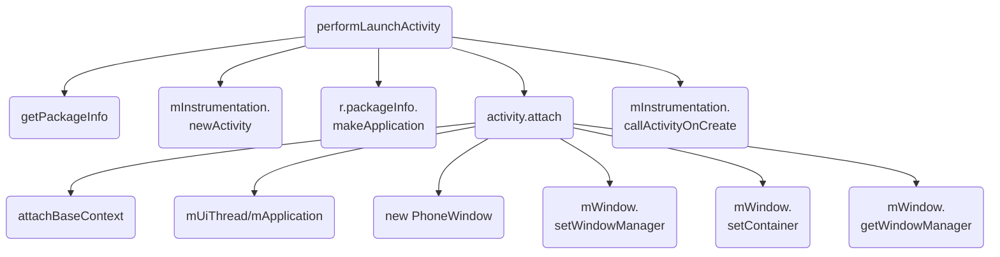
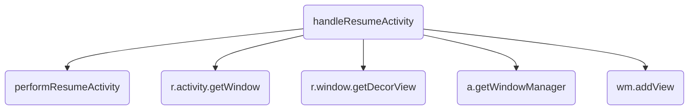

转载请注明链接：https://blog.csdn.net/feather_wch/article/details/50302185

Activity的原理详解。

>本文是我一点点归纳总结的干货，但是难免有疏忽和遗漏，希望不吝赐教。

# Acitivity原理详解(26)
版本：2018/9/1-1(18:16)

---

[TOC]

## 基本概念

1、四大组件的注册和调用方式
>1. Activity、Service、ContenProvider必须在`AndroidManifest`中注册
>2. `BroadcastReceiver`可以在`AndroidManifest`中注册，也可以`代码`中注册
>3. Activity、Service、ContenProvider的调用需要借助`Intent`
>4. `BroadcastReceiver`不需要借助`Intent`

2、Activity是什么？
>1. 一种`展示型组件`，用于展示界面，并且与用户进行交互。
>2. Activity的启动由`Intent`触发，`Intent`可分为隐式`Intent`和显式`Intent`
>3. 显式`Intent`需要明确指向一个`Activity`
>4. 隐式`Intent`可以指向一个或者多个`Activity`组件，也可能没有任何`Activity`处理该隐式`Intent`
>5. `Activity`具有特定的`启动模式`，也可以通过`finish`方法结束运行。

3、Activity启动流程中涉及的重要角色
>1. `Instrumentation：`监控应用与系统相关的交互行为。
>2. `ActivityManagerService`：组件管理的调度中心，基本上什么都不干，但是什么都管。
>3. `ActivityStarter`：`Activity启动的管理器`。处理`Intent和Flag`对`Activity启动`的影响。
>5. `ActivityStack`：管理任务栈中的Activity
>4. `ActivityStackSupervisor`:`管理任务栈`。是高版本才有的类，在`系统支持多屏后`，需要去管理多个`ActivityStack`
>6. `ActivityThread`：主线程/UI线程，完成四大组件相关工作以及APP各种主要的任务。

4、App的启动流程
>1. 图标点击：`Lancher进程`会通过Binder机制通知`ActivityManagerService`去进行Activity创建等相关工作。
>2. `AMS`会让ActivityStarter(启动管理器)处理`Intent和Flag`，然后以`Socket方式`去通知`Zygote进程`
>3. Zygote进程会进行孵化(虚拟机和资源的复制---以加快启动速度), 然后fork出新进程。
>4. `新进程`中会执行`ActivityThread`的main方法，main()中会创建`ActivityThread实例`，在RuntimeInit.zygoteInit()中会调用invokeStaticMain，其内部会执行ActivityThred的main()方法
>5. ActivityThread中会创建Looper，开启消息循环
>5. 最后会进行Activity生命周期的回调-onCreate、onStart等方法

5、ActivityThread的main()的流程
```java
public static void main(String[] args) {
    // 1. mainLooper
    Looper.prepareMainLooper();
    // 2. 创建ActivityThread，执行attach
    ActivityThread thread = new ActivityThread();
    thread.attach(false);
    // 3. Handler
    if (sMainThreadHandler == null) {
        sMainThreadHandler = thread.getHandler();
    }
    // 4. loop()
    Looper.loop();
}
```

## 状态

6、Activity的状态
>1. 三种`常驻状态`和`多个中间态`
>2. `Resumed(运行状态)`：activity处于前台，用户可以进行交互。
>3. `Paused(暂停状态)`: activity被部分遮挡，可见，不可交互。
>4. `Stopped(停滞状态)`：activity不可见，不可交互。

7、Activity的通信方式有哪些？
>1. BroadcastReceiver和LocalBroadcastReceiver
>2. EventBus
>3. startActivityForResult

## 启动流程

8、Activity的启动方法
```java
Intent intent = new Intent(MainActivity.this, Main2Activity.class);
startActivity(intent);
```

9、Activity的启动流程流程图和要点

```mermaid
graph TD;
    1(startActivity);
    2(startActivityForResult);
    3(mInstrumentation.execStartActivity);
    4(ActivityManager.getService.startActivity);
    5(checkStartActivityResult);
    6(realStartActivityLocked);
    7(app.thread.scheduleLaunchActivity);
    8(sendMessage-H.LAUNCH_ACTIVITY);
    9(handleMessage);
    10(handleLaunchActivity);
    11(WindowManagerGlobal.initialize);
    12(performLaunchActivity);
    13(handleResumeActivity);
    1-->2;
    2-->3;
    3-->4;
    3-->5;
    4-->6;
    6-->7;
    7-->8;
    8-->9;
    9-->10;
    10-->11;
    10-->12;
    10-->13;
```







>1. startActivity: 所有`startActivity()`方法最终会调用`startActivityForResult()`方法
>2. startActivityForResult: 内部执行`mInstrumentation.execStartActivity`.
>3. mInstrumentation.execStartActivity:`Instrucmentation用于监控应用和系统的交互行为`, 执行`4、5两步的方法`
>4. ActivityManager.getService.startActivity(): 获取到`AMS`并且执行`startActivity()`
>5. checkStartActivityResult()：检查启动Activity的结果，没有成功启动就会抛出异常,例如Activity没有注册
>6. realStartActivityLocked：AMS执行startActivity会经过`Activitystack`后执行到`ActivityStackSupervisor`的该方法。会执行` app.thread.scheduleLaunchActivity()`
>7. app.thread.scheduleLaunchActivity: app.thread是IApplicationThread这个Binder类型接口, 发送消息`H.LAUNCH_ACTIVITY`给Handler H处理。
>8. sendMessage-H.LAUNCH_ACTIVITY: 发送消息给Handler
>9. handleMessage: 会执行`handleLaunchActivity`
>10. handleLaunchActivity: 启动工作，主要进行`11、12、13三步的功能`
>11. WindowManagerGlobal.initialize() : 初始化`WM`
>12. performLaunchActivity：会进行`14、15、16、17、18五步的工作`
>13. handleResumeActivity：主要进行`25、26、27、28、29五步的功能`
>14. getPackageInfo: 从`ActivityClientRecord`中获取到待启动的Activity的组件信息
>15. mInstrumentation.newActivity: 使用类加载器创建Activity对象
>16. r.packageInfo.makeApplication: 通过`LoadedApk`的方法创建Applicayiton对象，该对象唯一，不会重复创建。
>17. activity.attach: 调用该方法前会先创建`ContexnImpl`对象，然后调用该方法去完成Window的创建并且建立Activity和Window的关联。主要进行`19、20、21、22、23、24 六步的工作`
>18. mInstrumentation.callActivityOnCreate: 调用Activity的`onCreate()`
>19. attachBaseContext(context): 建立Context和Activity的联系：本质就是将ContextImpl实例作为成员变量保存在Activity内部。
>20. mUiThread/mApplication: 将UI线程和application保存到Activity内部(`成员变量`)
>21. new PhoneWindow(this)： 创建Window(`PhoneWindow`)， 并进行初始化工作
>22. mWindow.setWindowManager： 给`Window`设置`WindowManager`---通过context.getSystemService从`WMS`中获取
>23. mWindow.setContainer(mParent.getWindow())： 将当前Window所处的容器设置为父Activity的Window
>24. mWindowManager = mWindow.getWindowManager()： 将`WM`变量作为成员变量保存到Activity内部
>25. performResumeActivity: 通过Instrucmentation调用onStart和onResume
>26. r.activity.getWindow(): 获取到Window(在Activity的attach方法中创建了PhoneWindow)
>27. r.window.getDecorView(): 创建DecorView，设置为不可见INVISIBLE, 并且Activity内部保存了DecorView
>28. a.getWindowManager(): 获取到WindowManager
>29. wm.addView(decor, l):  WM的addView方法将DecorView添加到Window中

### performLaunchActivity

10、Activitiy启动流程中performLaunchActivity的作用？(5种)
>1. 从ActivityClientRecord中获取到待启动的Activity的`组件信息`
>2. 使用类加载器`创建Activity对象`
>3. 通过LoadedApk的方法`创建Applicayiton对象`，该对象唯一，不会重复创建。
>4. 会创建`ContextImpl`并且建立Context和Activity的联系，以及创建`PhoneWindow`，建立Window和Activity的联系。
>5. 调用Activity的`onCreate()`

### activity.attach

11、Activitiy启动流程中activity.attach的作用？(6种)
>1. 建立`Context`与Activity的联系。
>2. 建立`UIThread/Application`与Activity的联系。
>3. 创建`Window(PhoneWindow对象)`，建立与Activity的联系。
>4. 给`Window`设置`父容器`为`父Activity的window`。
>5. 给`Window`设置`WindowManager`
>6. 建立`WindowManager`与Activity的联系。

### handleResumeActivity

12、Activity启动流程中handleResumeActivity的作用？(5种)
>1. 执行`onStart()、onResume()`---利用`Instrucmentation`
>2. 获取`Window`
>3. 创建`DecorView`、设置为不可见`INVISIBLE`、建立`DecorView`和Activity的联系。
>4. 获取Activity的`WindowManager`
>5. 调用`WindowManager.addView(decorView, ...)`将DecorView添加到WM中，完成显示的工作。

13、何时将DecorView设置为VISIBLE?并且显示出来？
> 1. 也是在handleResumeActivity中
> 1. 现将DecorView设置为不可见
> 1. wm.addView(): 将DecorView添加到Window总
> 1. 然后执行makeVisible让DecorView可见
```java
//ActivityThread.java
final void handleResumeActivity(IBinder token, ...) {
  //3. 创建DecorView，设置为不可见INVISIBLE
  View decor = r.window.getDecorView();
  decor.setVisibility(View.INVISIBLE);
  a.mDecor = decor; //Activity内部保存了DecorView
  //4. 获取到WindowManager
  ViewManager wm = a.getWindowManager();
  //5. WM的addView方法将DecorView添加到Window中
  wm.addView(decor, l);
  //6. 将DecorView设置为visible
  r.activity.makeVisible();
}
// Activity.java
void makeVisible() {
    //1. 还没有被加入window，执行addView()
    if (!mWindowAdded) {
        ViewManager wm = getWindowManager();
        wm.addView(mDecor, getWindow().getAttributes());
        mWindowAdded = true;
    }
    //2.已经添加到Window中，设置为可见
    mDecor.setVisibility(View.VISIBLE);
}
```

### 关系建立

14、如何创建Activity对象？
>1. `ActivityThread.java`中`performLaunchActivity()`方法内，通过`Instrucmentation`的`newActivity()`方法，通过类加载器进行创建。

15、如何创建Application对象？
>1. `ActivityThread.java`中`performLaunchActivity()`方法内，通过`LoadedApk`的`makeApplication()`方法创建Application对象。

16、如何建立Context/UIThread/Application/Window/WindowManager与Activity的联系？
>1. `activity的attach`方法中
>2. `attach()`在`ActivityThread`的`performLaunchActivity`中执行。

### 生命周期回调

17、onCreate在哪里被调用？
>1. performLaunchActivity通过`Instrumentation`调用

#### onStart、onResume
18、onStart、onResume在哪里被调用？
>1. `handleResumeActvity`中
>1. 会按照onRestart()->onStart()->onResume()去执行
```java
// ActivityThread.java
final void handleResumeActivity(IBinder token, ...) {
    // 0. 要通过token获取到Activity，app中activity很多，这样才能知道是那个Activity
    ActivityClientRecord r = mActivities.get(token);
    // 1. 进来的第一个任务，执行onStart()、onResume()
    r = performResumeActivity(token, clearHide, reason);
    // 其他工作
}
// ActivityThread.java
public final ActivityClientRecord performResumeActivity(IBinder token, ...) {
    // 0. 要通过token获取到Activity，app中activity很多，这样才能知道是那个Activity
    ActivityClientRecord r = mActivities.get(token);
    // 1. 调用activity的方法
    r.activity.performResume();
    //xxx
}
// Activity
final void performResume() {
    // 1. 看情况执行onRestart()，最后会执行start
    performRestart();
    // 2. 内部直接执行onResume()
    mInstrumentation.callActivityOnResume(this);
}
// Activity
final void performRestart() {
    // 1、看情况执行onRestart()
    mInstrumentation.callActivityOnRestart(this);
    // 2、mInstrumentation.callActivityOnStart(this)->onStart()方法
    performStart();
}
```


### startActivity源码

19、Activity的startActivity源码流程详解
```java
//Activity.java
//1. 所有`startActivity()`方法最终会调用`startActivityForResult()`方法：
public void startActivityForResult(Intent intent, int requestCode, Bundle options) {
    //2. 父亲不为Null
    if (mParent == null) {
        options = transferSpringboardActivityOptions(options);
        //3. Instrumentation的execStartActivity去启动Activity
        Instrumentation.ActivityResult ar =
                mInstrumentation.execStartActivity(
                        this, mMainThread.getApplicationThread(),//获取ApplicationThread
                        mToken, this,
                        intent, requestCode, options);
        ...
    } else {
        ...
    }
}

//Instrumentation.java
public ActivityResult execStartActivity(Context who, IBinder contextThread, IBinder token, Activity target, Intent intent, int requestCode, Bundle options) {
    ...省略...
    try {
        /**===============================================
         * 1.开启Activity
         *  1-获取到IActivityManager的Binder对象
         *  2-通过IPC让ActivityManagerService执行startActivity方法
         *===============================================*/
        int result = ActivityManager.getService() //Binder对象
                .startActivity(whoThread, ... ,options);
        /**===============================================
         *2. 检查启动Activity的结果
         * 没有成功启动就会抛出异常,例如Activity没有注册:
         *   Unable to find explicit activity class...have you declared this activity in your AndroidManifest.xml?"
         *===============================================*/
        checkStartActivityResult(result, intent);
    } catch (RemoteException e) {
        throw new RuntimeException("Failure from system", e);
    }
    return null;
}

/**
 * ActivityManagerService处理startActivity流程:
 * startActivity() -> startActivityAsUser -> ...
 * -> ActivityStack的resumeTopActivityUncheckedLocked() -> ...
 * -> ActivityStackSupervisor的`realStartActivityLocked方法`
 */
//ActivityManagerService.java
public final int startActivity(IApplicationThread caller, ...,Bundle bOptions) {
    return startActivityAsUser(caller, ...,UserHandle.getCallingUserId());
}

//ActivityStackSupervisor.java
final boolean realStartActivityLocked(ActivityRecord r, ProcessRecord app, boolean andResume, boolean checkConfig) throws RemoteException {
    ......
    //app.thread的类型为IApplicationThread
    /**============================================================
     * app.thread的类型为IApplicationThread(继承IInterface接口-Binder类型接口)
     * --内部包含大量Activity和Service启动/停止相关功能
     * --具体实现：ActivityThread(继承了ApplicationThreadNative)
     *    * ApplicationThreadNative继承Binder并且实现了IApplicationThread接口
     *      (ApplicationThreadNative和系统为AIDL文件生成的类的作用是一样的)
     *==============================================================*/
    app.thread.scheduleLaunchActivity(new Intent(r.intent), ... ,profilerInfo);
    ......
}

//ActivityThread.java的内部类：ApplicationThread
public final void scheduleLaunchActivity(Intent intent, IBinder token, ...,ProfilerInfo profilerInfo) {
    //1. 保存ActivityClientRecord需要的所有数据
    ActivityClientRecord r = new ActivityClientRecord();
    r.token = token;
    r.ident = ident;
    r.intent = intent;
    ...
    r.overrideConfig = overrideConfig;
    //2. 发送消息给Handler H处理
    sendMessage(H.LAUNCH_ACTIVITY, r);
}

//ActivityThread.java
private class H extends Handler {
    public static final int LAUNCH_ACTIVITY = 100;
    ......

    public void handleMessage(Message msg) {
        switch (msg.what) {
            case LAUNCH_ACTIVITY: {
                //1. 交给`ActivityThread`的`handleLaunchActivity`处理
                handleLaunchActivity(r, null, "LAUNCH_ACTIVITY");
            }
            break;
        }
    }
}

//ActivityThread.java
private void handleLaunchActivity(ActivityClientRecord r, Intent customIntent, String reason) {
    ......
    //0. 创建Activity前初始化WindowManagerGlobal
    WindowManagerGlobal.initialize();
    //1. 完成Activity对象的创建和启动过程
    Activity a = performLaunchActivity(r, customIntent);
    if (a != null) {
        //2. 调用Activity的onResume这一生命周期
        handleResumeActivity(r.token, ... ,reason);
    } else {
        //3. 如果出错，会finishActivity
        ActivityManager.getService().finishActivity(r.token, Activity.RESULT_CANCELED, null,
                Activity.DONT_FINISH_TASK_WITH_ACTIVITY);
    }
}

//ActivityThread.java
private Activity performLaunchActivity(ActivityClientRecord r, Intent customIntent) {
    //1. 从ActivityClientRecord中获取待启动的Activity的组件信息
    ActivityInfo aInfo = r.activityInfo;
    if (r.packageInfo == null) {
        r.packageInfo = getPackageInfo(aInfo.applicationInfo, r.compatInfo, Context.CONTEXT_INCLUDE_CODE);
    }
    ...
    //2. 通过Instrumentation的newActivity方法使用类加载器创建Activity对象
    Activity activity = null;
    java.lang.ClassLoader cl = appContext.getClassLoader();
    // 实现简单，就是通过类加载器来创建Activity对象
    activity = mInstrumentation.newActivity(cl, component.getClassName(), r.intent);
    ...
    /**============================================================
     * 3. 通过LoadedApk的makeApplication方法创建Application对象
     *  如果Application已经被创建，则不会重复创建-Application对象唯一
     *  1-内部是通过Instruction来完成，也是通过类加载器来实现
     *  2-Application创建好后，系统会通过Instruction的
     *    callApplicationOnCreate()来调用Application的onCreate()方法
     *============================================================*/
    Application app = r.packageInfo.makeApplication(false, mInstrumentation);
    if (localLOGV) Slog.v(
            TAG, r + ": app=" + app
                    + ", appName=" + app.getPackageName()
                    + ", pkg=" + r.packageInfo.getPackageName()
                    + ", comp=" + r.intent.getComponent().toShortString()
                    + ", dir=" + r.packageInfo.getAppDir());
    /**===============================================================
     *4. 创建ContextImpl对象并通过Activity的attach方法来完成一些重要的数据初始化
     * -ContextImpl是Context的具体实现，ContextImpl通过Activity的attach方法和Activity建立关联
     * -attach方法中Activity会完成Window的创建并且建立自己和Window的关联
     *===============================================================*/
    ContextImpl appContext = createBaseContextForActivity(r);
    if (activity != null) {
        CharSequence title = r.activityInfo.loadLabel(appContext.getPackageManager());
            ...
        activity.attach(appContext, this, getInstrumentation(), r.token,
                r.ident, app, r.intent, r.activityInfo, title, r.parent,
                r.embeddedID, r.lastNonConfigurationInstances, config,
                r.referrer, r.voiceInteractor, window, r.configCallback);
            ...
        //5. 调用Activity的onCreate方法——Activity完成了整个启动过程
        if (r.isPersistable()) {
            mInstrumentation.callActivityOnCreate(activity, r.state, r.persistentState);
        } else {
            mInstrumentation.callActivityOnCreate(activity, r.state);
        }
    }
    ...
    return activity;
}

//Activity.java
final void attach(Context context, ActivityThread aThread, ...) {
      //1. 建立Context和Activity的关联
      attachBaseContext(context);
      //2. 数据初始化: UI线程为当前线程, application等等
      mUiThread = Thread.currentThread();
      mApplication = application;
      ...
      //3. 创建Window(PhoneWindow)
      mWindow = new PhoneWindow(this);
      mWindow.setCallback(this);
      mWindow.setOnWindowDismissedCallback(this);
      mWindow.getLayoutInflater().setPrivateFactory(this);
      ...
      //4. 给Window设置WindowManager(从WindowManagerService获取)
      mWindow.setWindowManager(
                (WindowManager)context.getSystemService(Context.WINDOW_SERVICE), ...);
      //5. 当前Window的容器是父Activity的Window
      if (mParent != null) {
            mWindow.setContainer(mParent.getWindow());
      }
      //6. 将当前Window的WindowManager保存到Activity内部
      mWindowManager = mWindow.getWindowManager();
      mCurrentConfig = config;
}

//ActivityThread.java
final void handleResumeActivity(IBinder token, ...) {
  /**
   * 1. 调用生命周期：onStart和onResume---通过Instrucmentation
   */
  ActivityClientRecord r = performResumeActivity(token, clearHide);
  //2. 获取到Window(在Activity的attach方法中创建了PhoneWindow)
  r.window = r.activity.getWindow();
  //3. 创建DecorView，设置为不可见INVISIBLE
  View decor = r.window.getDecorView();
  decor.setVisibility(View.INVISIBLE);
  a.mDecor = decor; //Activity内部保存了DecorView
  //4. 获取到WindowManager
  ViewManager wm = a.getWindowManager();
  //5. WM的addView方法将DecorView添加到Window中
  wm.addView(decor, l);
  //6. 将DecorView设置为visible
  r.activity.makeVisible();
}

//ActivityThread.java
public final ActivityClientRecord performResumeActivity(IBinder token,boolean clearHide) {
  //1. 执行onStart和onRsume
  r.activity.performResume();
  ...
}

//Activity.java
final void performResume() {
  // 1. 通过Instrucmentation执行onStart()
  performRestart();
  // 2. 执行onResume方法
  mInstrumentation.callActivityOnResume(this);
}
```

### 启动模式的处理

20、启动模式的处理
>1. ActivityStarter中对`FLAG_ACTIVITY_SINGLE_TOP`等内容进行处理
>1. 比如`FLAG_ACTIVITY_SINGLE_TOP`就回去执行`onNewIntent()`

## 序列图：startActivity

21、startActivity
```sequence
Activity->Activity:1.startActivity
Activity->Activity:2.startActivityForResult
Activity->Activity:3.mInstrumentation.\nexecStartActivity
Activity->ActivityManagerService:【IPC】4.ActivityManager.\ngetService()
ActivityManagerService->ActivityManagerService:5.startActivity()
Activity->Activity:6.checkStartActivityResult
ActivityManagerService->ActivityStackSupervisor:7.realStartActivityLocked()
ActivityStackSupervisor->ActivityThread:【IPC】8.app.thread.\nscheduleLaunchActivity
ActivityThread->ActivityThread:9.sendMessage(H.LAUNCH_ACTIVITY)
ActivityThread->ActivityThread:10.Handler H
ActivityThread->ActivityThread:11.handleMessage()
ActivityThread->ActivityThread:12.handleLaunchActivity()
ActivityThread->ActivityThread:13.WindowManagerGlobal.\ninitialize()\n(12)
ActivityThread->ActivityThread:14.performLaunchActivity()\n(12)
ActivityThread->ActivityThread:15.handleResumeActivity()\n(12)
ActivityThread->ActivityThread:16.getPackageInfo()\n(14)
ActivityThread->ActivityThread:17.newActivity()\n(14)
ActivityThread->ActivityThread:18.makeApplication()\n(14)
ActivityThread->ActivityThread:19.createBaseContextForActivity()\n(14)
ActivityThread->ActivityThread:20.activity.attach()\n(14)
ActivityThread->ActivityThread:21.callActivityOnCreate()\n(14)
ActivityThread->ActivityThread:22.attachBaseContext()\n(20)
ActivityThread->ActivityThread:23.new PhoneWindow()\n(20)
ActivityThread->ActivityThread:24.mWindow.\nsetWindowManager()\n(20)
ActivityThread->ActivityThread:25.保存WM到Activity内部\n(20)
```
>13.创建Activity前初始化WindowManagerGlobal
>14.完成Activity对象的创建和启动过程
>15.调用Activity的onResume这一生命周期
>17.通过类加载器来创建Activity对象
>18.通过LoadedApk的makeApplication方法创建Application对象(唯一)，并会调用`onCreate()`
>19.创建ContextImpl，并调用attach
>20.关联了Context和Activity，并且创建Window加载WM等初始化工作
>21.调用Activity的onCreate方法

## 补充题

1、Activity是在哪里创建的？
> performLaunchActivity

2、Aplication在哪里创建的？
> performLaucnActivity

3、Context在哪里创建的？
> performLaunchActivity创建的ContextImpl

4、Widow(PhoneWindow)是哪里创建的？
> activity.attach()方法

5、DecorView是哪里创建的？
> handleResumeActivity中

6、何时将DecorView添加到了Window中？
> handleResumeActivity中执行`wm.addView(decorview)`

## 参考资料
1. [剖析Activity、Window、ViewRootImpl和View之间的关系](http://mp.weixin.qq.com/s/-5lyASIaSFV6wG3wfMS9Yg)
