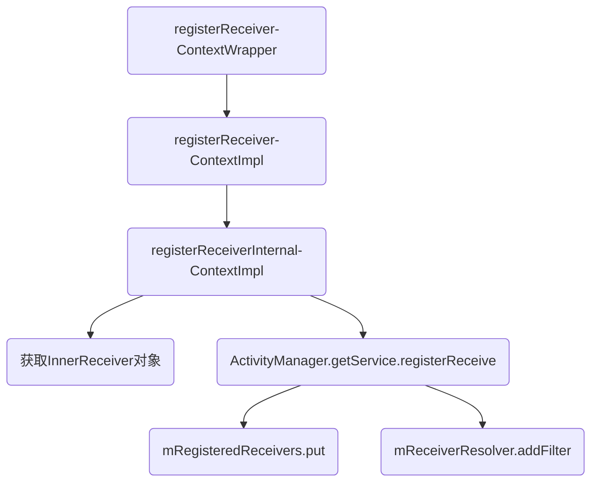
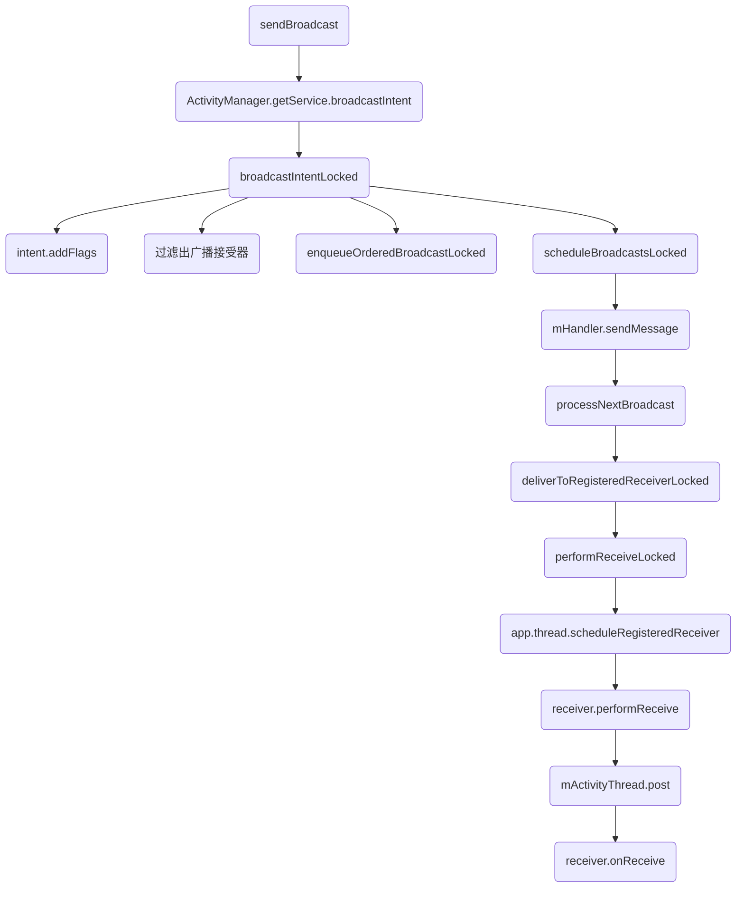

转载请注明链接：https://blog.csdn.net/feather_wch/article/details/50397199

BroadcastReceiver的基本知识和原理详解。

>本文是我一点点归纳总结的干货，但是难免有疏忽和遗漏，希望不吝赐教。

# BroadcastReceiver详解
版本：2018/9/1-1(18:16)

---

[TOC]

## 基础(10)

1、BroadcastReceiver是什么？
>1. 一种`消息型组件`，用于在不同组件甚至不同应用间传递消息
>2. `静态注册`: 在AndroidManifest中注册广播，会在`应用安装时被系统解析`，不需要启动应用就可以接收到相应广播(从Android 3.1开始默认不给不在运行的应用发送广播)
>3. `动态注册`: `Context.registerReceiver()`进行注册，`Context.unRegisterReceiver()`解除注册. 需要APP启动才能注册并且接收广播。
>4. 广播发送通过`Context`的一系列`send`方法完成
>5. `发送和接收`过程的匹配通过广播接收者的`intent-filter`来描述

### 分类

2、广播分为几种
> 1. 普通广播
> 1. 有序广播
> 1. 本地广播

### 有序广播

3、普通广播是什么？
>1. 调用`sendBroadcast()`发送

4、有序广播是什么？
>1. 调用`sendOrderedBroadcast()`发送
>2. 广播接收者会按照`priority优先级`从大到校进行排序
>3. `优先级`相同的广播，`动态注册`的广播优先处理
>4. 广播接收者还能对`广播`进行`截断和修改`

5、广播的发送和接收原理
>1. 继承BroadcastReceiver,在`onReceive()`中实现接收到广播后应该进行的操作。
>2. 通过`Binder机制`向`ActivityManagerService`注册广播。
>3. 通过`Binder机制`向`ActivityManagerService`发送广播。
>4. `ActivityManagerService`会查找符合`广播`条件(`IntentFilter/Permission`)的所有`BroadcastReceiver`, 并将这些广播接受器存放到队列中。
>5. 遍历队列中所有的`BroadcastReceiver`，并将`广播`发送给该接收器【IPC】。
>6. 最终通过Handler H回调其`onReceive()`方法。

### 本地广播

6、BroadcasReceiver和LocalBroadcastReceiver
>1. `BroadcasReceiver`是跨应用广播，利用`Binder机制`实现。
>2. `LocalBroadcastReceiver`是`应用内广播`，利用`Handler`实现。利用`IntentFilter`的`match`功能，提供消息的发布与接收，实现应用内通信，效率较高。

7、本地广播的优点
>1. 效率更改。
>2. 发送的广播不会离开我们的应用，不会泄露关键数据。
>3. 其他程序无法将广播发送到我们程序内部，不会有安全漏洞。

8、本地广播的使用
>1-自定义广播接收器，和一般广播一样。
```java
/**
 * 自定义广播接受器,用来处理登录广播
 */
private class LoginBroadcastReceiver extends BroadcastReceiver{
        @Override
        public void onReceive(Context context, Intent intent) {
            //处理我们具体的逻辑,更新UI
        }
}
```
>2-用LocalBroadcastManager去注册和解注册Receiver。自定义一个Action。
```java
// 自定义Action
public static final String LOGIN_ACTION = "com.example.action.LOGIN_ACTION";

//广播接收器
private LoginBroadcastReceiver mReceiver = new LoginBroadcastReceiver();

//注册广播方法
private void registerLoginBroadcast(){
        IntentFilter intentFilter = new IntentFilter(LoginActivity.LOGIN_ACTION);
        LocalBroadcastManager.getInstance(mContext).registerReceiver(mReceiver,intentFilter);
}

//取消注册
private void unRegisterLoginBroadcast(){
        LocalBroadcastManager.getInstance(mContext).unregisterReceiver(mReceiver);
}
```
>3-发送广播
```java
private void sendBroadcast(){
      //  发送广播，利用LocalBraodcastManager，Action和上面预定义的action一致
        LocalBroadcastManager.getInstance(this).sendBroadcast(
                new Intent(LOGIN_ACTION)
        );
}
```

9、LocalBroadcastManager原理
> 1. 内部采用Handler实现，使用的是MainLooper，因此不能有耗时操作。
> 1. 发送广播就是通过Handler发送一个Message实现的。

### 应用场景
10、广播的应用场景
> 1. 一个APP具有多个进程的多个组件之间发送广播
> 1. 不同APP直接发送广播

## 注册方式(8)

1、广播两种注册方式的区别
>1. `静态注册`：常驻系统，不受组件生命周期的影响，耗电，占内存。就算进程被杀死了，还能存在。
>2. `动态注册`：非常驻系统，组件结束，广播就结束。但是在组件结束前，一定要释放广播，避免内存泄露和崩溃。

2、静态注册实例
>静态注册：即使app被关闭，依然能接收广播，处于活动状态。
```java
<receiver android:name=".Receiver">
        <intent-filter>
            <action android:name="android.intent.action.AIRPLANE_MODE"></action>
        </intent-filter>
</receiver>
```

3、动态注册
> 1-自定义接收器
```java
    class MsgReceiver extends BroadcastReceiver{

        @Override
        public void onReceive(Context context, Intent intent) {
            // 1、通过Intent获得接收到的信息
            String msg = intent.getStringExtra("message");
            // 2、显示
            Toast.makeText(context, "接收到广播：" + msg, Toast.LENGTH_SHORT).show();
        }
    }
```
> 2-动态注册
```java
        /**===========================================
         *  动态注册Receiver
         *===========================================*/
        MsgReceiver msgReceiver = new MsgReceiver();
        IntentFilter intentFilter = new IntentFilter();
        // 指定Action
        intentFilter.addAction(Intent.ACTION_ANSWER);
        // 注册监听器
        registerReceiver(msgReceiver, intentFilter);
```
> 3-发送广播
```java
        Intent intent = new Intent();
        intent.setAction(Intent.ACTION_ANSWER);
        intent.putExtra("message", "文文是猪");
        sendBroadcast(intent);
```

4、广播的静态注册过程:
>1. 安装应用时由系统自动完成注册
>2. 具体是由`PMS(Package Manager Service)`来完成注册过程
>3. 本质其他`三大组件`的注册都是在安装时由`PMS`解析并注册


### 动态注册

5、广播动态注册的流程图

>1. registerReceiver: ContextWrapper.java, 层层调用
>2. registerReceiver: ContextImpl.java, 层层调用
>3. registerReceiverInternal: ContextImpl.java 进行下面`4、5的工作`
>4. mPackageInfo.getReceiverDispatcher/LoadedApk.ReceiverDispatcher : 获取到InnerReceiver对象
>5. ActivityManager.getService().registerReceiver(): 【IPC】调用AMS的registerReceiver方法，进行下面`6、7的工作`
>6. mRegisteredReceivers.put()： 将InnerReceiver对象进行存储(该对象与BroadcastReceiver对象相对应)
>7. (mReceiverResolver.addFilter(): 存储IntentFilter

6、为什么需要将BroadcastReceiver转换为IIntentReceiver？
>1. BroadcastReceiver作为组件不能直接进行IPC，需要进行中转
>2. IIntentReceiver是Binder接口，具体实现是LoadedApk.ReceiverDispatcher.InnerReceiver
>3. ReceiverDispatcher中同时保存了 BroadcastReceiver和InnerReceiver，接收广播时ReceiverDispatcher可以很方便调用BroadcastReceiver的onReceive()方法
>4. Service也有ServiceDispatcher和内部类InnerConnection(Binder接口)，原理相同

7、动态注册的本质是什么？
>1. 将BoradcastReceiver对应的Binder对象InnerReceiver存储到ActivityManagerService的Map中
>2. 将IntentFilter存储到AMS中

### 动态注册源码

8、广播的动态注册过程:
```java
/**
 * =================================
 * 1. 动态注册是从ContextWrapper的registerReceiver方法开始
 * 2. 之后直接交给ContextImpl完成
 * //ContextWrapper.java
 * =================================
 */
public Intent registerReceiver(BroadcastReceiver receiver, IntentFilter filter) {
    //1. mBase = ContextImpl
    return mBase.registerReceiver(receiver, filter);
}

//ContextImpl.java
public Intent registerReceiver(BroadcastReceiver receiver, IntentFilter filter,......) {
    return registerReceiverInternal(receiver, ......);
}

//ContextImpl.java
private Intent registerReceiverInternal(BroadcastReceiver receiver, ......) {
    IIntentReceiver rd = null;
    if (receiver != null) {
        if (mPackageInfo != null && context != null) {
            //1. 从mPackageInfo获取InnerReceiver对象
            rd = mPackageInfo.getReceiverDispatcher(receiver, context, scheduler, ......);
        } else {
            /**==============================================================================
             *2.从mPackageInfo获取IIntentReceiver对象
             * 1-采用IIntentReceiver而不是BroadcastReceiver是因为这是IPC过程
             * 2-BroadcastReceiver作为组件不能直接进行IPC，需要进行中转
             * 3-IIntentReceiver是Binder接口，具体实现是LoadedApk.ReceiverDispatcher.InnerReceiver
             * 4-ReceiverDispatcher中同时保存了 BroadcastReceiver和InnerReceiver，接收广播时ReceiverDispatcher
             *     可以很方便调用BroadcastReceiver的onReceive()方法
             * 5-可以发现Service也有ServiceDispatcher和内部类InnerConnection(Binder接口)，原理相同
             *===============================================================================*/
            rd = new LoadedApk.ReceiverDispatcher(receiver, context, scheduler, null, true)
                    .getIIntentReceiver();
        }
    }
    //3. 通过ActivityManagerService, 远程进行注册
    final Intent intent = ActivityManager.getService().registerReceiver(
            mMainThread.getApplicationThread(), mBasePackageName, rd, filter,
            broadcastPermission, userId, flags);
        ......
}

//ActivityManagerService.java：广播完成注册
public Intent registerReceiver(IApplicationThread caller, ...,IIntentReceiver receiver, ...) {
    ......
    //1. 存储远程的InnerReceiver对象(本地的BroadcastReceiver对应的对象)
    mRegisteredReceivers.put(receiver.asBinder(), rl);
    //2. 存储IntentFiler对象
    BroadcastFilter bf = new BroadcastFilter(filter, rl, callerPackage,
            permission, callingUid, userId, instantApp, visibleToInstantApps);
    rl.add(bf);
    mReceiverResolver.addFilter(bf);
    ......
}
```

## 广播发送(2)

1、广播发送/接收的流程图(普通广播)

>1. sendBroadcast: 调用顺序-Activity->ContextWrapper->ContextImpl
>2. ActivityManager.getService().broadcastIntent(......)： 直接向AMS发起一个异步请求用于发送广播
>3. broadcastIntentLocked: 进行`第4、5、6、7的工作`---添加标志位(不给已经停止的应用发送广播)、根据Intent-Fillter和Permission找到匹配的BroadcastReceiver、经过过滤后将
>4. intent.addFlags(Intent.FLAG_EXCLUDE_STOPPED_PACKAGES): 从Android 3.1开始默认不会给已经停止的应用发送广播。
>5. 根据intent-filter查找出匹配的广播接收者, 过滤出所有符合条件的BroadcastReceiver
>6. queue.enqueueOrderedBroadcastLocked: 会将满足条件的广播接收者都加入到BroadcastQueue中
>7. queue.scheduleBroadcastsLocked：会将广播发送到BroadcastQueue中的所有广播接收者中。
>8. mHandler.sendMessage: 发送消息
>9. processNextBroadcast: 取出广播并且发送给所有接收者。
>10. deliverToRegisteredReceiverLocked: 发送广播
>11. performReceiveLocked: 通过IPC发送给ActivityThread
>12. app.thread.scheduleRegisteredReceiver: 通过InnerReceiver实现广播的接收
>13. receiver.performReceive: ReceiverDispatcherd的performReceive方法，通过Handler H去投递一个Runnable
>14. mActivityThread.post： 通过Handler H 的post方法投递Runnable
>15. receiver.onReceive: 执行BroadcastReceiver的onReceive方法

### 源码

2、广播的发送和接收过程源码(普通广播为例):
>1. 通过`sendBroadcast`发送广播时，AMS会查找出匹配的广播接收者并将广播发送给它们处理
>2. 广播分为：普通广播、有序广播和粘性广播
```java
/**
 * ==================================================
 * 1. 广播的发送开始于ContextWrapper的sendBroadcast方法
 * 2. 最终会交给ContextImpl的sendBroadcast方法去处理
 * // ContextImpl.java
 * ==================================================
 */
public void sendBroadcast(Intent intent) {
    //1. 直接向AMS发起一个异步请求用于发送广播
    ActivityManager.getService().broadcastIntent(......);
    ......
}
//ActivityManagerService.java
public final int broadcastIntent(IApplicationThread caller, Intent intent, ......) {
    ....
    int res = broadcastIntentLocked(callerApp, ......);
}
//ActivityManagerService.java
final int broadcastIntentLocked(ProcessRecord callerApp, ......) {
    intent = new Intent(intent);
    /**==============================================================
     *1. 默认情况下广播不会发送给已经停止的应用(从Android 3.1开始)
     * Intent中新增两个标记:
     *  FLAG_EXCLUDE_STOPPED_PACKAGES-不包含已经停止应用
     *  FLAG_INCLUDE_STOPPED_PACKAGES-包含已经停止应用
     * -如果两个标记共存，则以FLAG_INCLUDE_STOPPED_PACKAGES为准
     * -停止状态为：1-应用安装后未运行 2-应用被手动或者其他应用强制停止
     *==============================================================*/
    intent.addFlags(Intent.FLAG_EXCLUDE_STOPPED_PACKAGES);
    ......
    /**================================================
     *2. 根据Intent-Fillter和Permission查找出匹配的广播接收者
     *3. 进过一系列过滤后，将满足条件的广播接收者添加到`BroadcastQueue`
     *4. BroadcastQueue就会将广播发送给相应的广播接收者
     *===============================================*/
    if ((receivers != null && receivers.size() > 0)
            || resultTo != null) {
        BroadcastQueue queue = broadcastQueueForIntent(intent);
        BroadcastRecord r = new BroadcastRecord(queue, intent, callerApp, ......);

       ......
        queue.enqueueOrderedBroadcastLocked(r);
        //4. BroadcastQueue就会将广播发送给相应的广播接收者
        queue.scheduleBroadcastsLocked();
    }
    ......
    return ActivityManager.BROADCAST_SUCCESS;
}
//BroadcastQueue.java
public void scheduleBroadcastsLocked() {
    //1. 发送消息，BroadcastQueue收到消息后会调用processNextBroadcast方法
    mHandler.sendMessage(mHandler.obtainMessage(BROADCAST_INTENT_MSG, this));
}
//BroadcastQueue.java
final void processNextBroadcast(boolean fromMsg) {
    synchronized (mService) {
        BroadcastRecord r;
        ......
        //1. 普通广播处理
        while (mParallelBroadcasts.size() > 0) {
            //2. 无序广播存储在mParallelBroadcasts中
            r = mParallelBroadcasts.remove(0);
            final int N = r.receivers.size();
            //3. 取出广播并发送给他们所有的接受者
            for (int i = 0; i < N; i++) {
                Object target = r.receivers.get(i);
                //4. 发送广播
                deliverToRegisteredReceiverLocked(r, (BroadcastFilter) target, false, i);
            }
            addBroadcastToHistoryLocked(r);
        }
        ......
    }
}
//BroadcastQueue.java
private void deliverToRegisteredReceiverLocked(BroadcastRecord r, BroadcastFilter filter, boolean ordered, int index) {
    performReceiveLocked(filter.receiverList.app, filter.receiverList.receiver, ......);
}
//BroadcastQueue.java
void performReceiveLocked(ProcessRecord app, IIntentReceiver receiver, ...) {
    ......
    //1. app.thread为ActivityThread,会调用其中方法
    app.thread.scheduleRegisteredReceiver(receiver, intent, resultCode, data, extras, ordered, sticky, sendingUser, app.repProcState);
}
//ActivityThread.java
public void scheduleRegisteredReceiver(IIntentReceiver receiver, Intent intent, ......) {
    updateProcessState(processState, false);
    //1. 通过`InnerReceiver`实现广播的接收, 内部会调用ReceiverDispatcher的performReceive方法
    receiver.performReceive(intent, resultCode, dataStr, extras, ordered, sticky, sendingUser);
}
//LoadedApk.java内部类ReceiverDispatcher
public void performReceive(Intent intent, int resultCode, String data, ......) {
    //1. 创建Args对象
    final Args args = new Args(intent, resultCode, data, extras, ordered, sticky, sendingUser);
    ......
    /**=========================================================
     * 2. 通过mActivityThread的post方法来执行args中的逻辑
     *   -mActivityThread是Handler(也就是ActivityThread中的Handler H)
     *   -Args中实现了Runnable接口-在广播接受线程中执行了onReceive方法
     *========================================================*/
    if (intent == null || !mActivityThread.post(args.getRunnable())) {
        ......
    }
}
//LoadedApk.java内部类ReceiverDispatcher.Args
final class Args extends BroadcastReceiver.PendingResult {
    .......

    public final Runnable getRunnable() {
        return () -> {
            //1. 执行了BroadcastReceiver的onReceive方法
            final BroadcastReceiver receiver = mReceiver;
            ......
            receiver.onReceive(mContext, intent);
            ......
        };
    }
}
```

## 序列图
1、广播的动态注册

```sequence
Activity->ContextImpl: 1.registerReceiver()
ContextImpl->ContextImpl: 2.registerReceiverInternal()
ContextImpl->ContextImpl: 3.mPackageInfo.getReceiverDispatcher()
ContextImpl->ContextImpl: 4.new LoadedApk.\nReceiverDispatcher().\ngetIIntentReceiver()
ContextImpl->ActivityManagerService: 5.ActivityManager.getService()
ActivityManagerService->ActivityManagerService: 6.registerReceiver()
ActivityManagerService->ActivityManagerService: 7.mRegisteredReceivers.\nput(receiver.asBinder());
ActivityManagerService->ActivityManagerService: 8.存储IntentFiler对象
```
>1.动态注册从ContextWrapper开始，之后直接交给ContextImpl完成
>3.已有，从mPackageInfo获取IIntentReceiver对象
>4.没有则新建IIntentReceiver对象，本质是为了IPC通信需要进行中转，ReceiverDispatcher中同时保存了 BroadcastReceiver和InnerReceiver
>7.存储远程的InnerReceiver对象(本地的BroadcastReceiver对应的对象)

2、广播的发送和接收

```sequence
ActivityThread[接收方]->ActivityThread[接收方]: null
Activity->Activity: 1.sendBroadcast()-\nContextImpl
Activity->ActivityManagerService: 【IPC】2.ActivityManager.\ngetService()
ActivityManagerService->ActivityManagerService: 3.broadcastIntent()
ActivityManagerService->ActivityManagerService: 4.broadcastIntentLocked()
ActivityManagerService->ActivityManagerService: 4-1.intent.addFlags()
ActivityManagerService->ActivityManagerService: 4-2.根据intent-filter查找出\n匹配的广播接收者
ActivityManagerService->ActivityManagerService: 4-3.将满足条件的广播接收者\n添加到BroadcastQueue
ActivityManagerService->BroadcastQueue: 4-4.queue.\nscheduleBroadcastsLocked()
BroadcastQueue->BroadcastQueue: 5.mHandler.sendMessage
BroadcastQueue->BroadcastQueue: 6.processNextBroadcast()
BroadcastQueue->BroadcastQueue: 6-1.mParallelBroadcasts.remove(0)
BroadcastQueue->BroadcastQueue: 6-2.r.receivers.get(i)遍历接收者
BroadcastQueue->BroadcastQueue: 6-3.deliverToRegisteredReceiverLocked()
BroadcastQueue->BroadcastQueue: 7.performReceiveLocked()
BroadcastQueue->ActivityThread[接收方]: 【IPC】8.app.thread.scheduleRegisteredReceiver()
ActivityThread[接收方]->ActivityThread[接收方]: LoadedApk的内部类:\nReceiverDispatcher中
ActivityThread[接收方]->ActivityThread[接收方]: 9.receiver.\nperformReceive()
ActivityThread[接收方]->ActivityThread[接收方]: 10.mActivityThread.\npost(args.getRunnable())
ActivityThread[接收方]->ActivityThread[接收方]: 11.receiver.\nonReceive();
```
>5.默认FLAG_EXCLUDE_STOPPED_PACKAGES-广播不会发送给已经停止的应用
>4-4.BroadcastQueue就会将广播发送给相应的广播接收者
>6.接收消息并且处理
>6-1.取出无序广播列表中的广播
>8.通过`InnerReceiver`实现广播的接收, 内部会调用ReceiverDispatcher的performReceive方法
>10.通过Hanlder H的post方法来执行args中的逻辑
>11.LoadedApk.java内部类ReceiverDispatcher的内部类Args，主要是执行BroadcastReceiver的接收方法

## 补充题
1、BroadcastReceiver的onReceive()方法可以进行耗时操作吗？
> 不可以，运行在主线程。

2、Broadcast的运行流程？
> 1. 注册流程
> 1. 发送接收流程

3、LocalBroadcastManager底层实现？
> 1. 用Handler实现
> 1. 采用的是主线程的Looper，因此是在主线程执行逻辑，不能执行耗时操作。

## 参考资料
1. [本地广播的使用——LocalBroadcast](https://blog.csdn.net/jarchie520/article/details/71434833)
