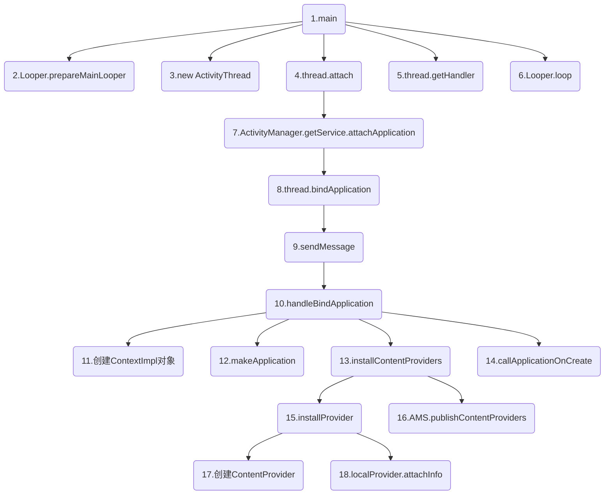
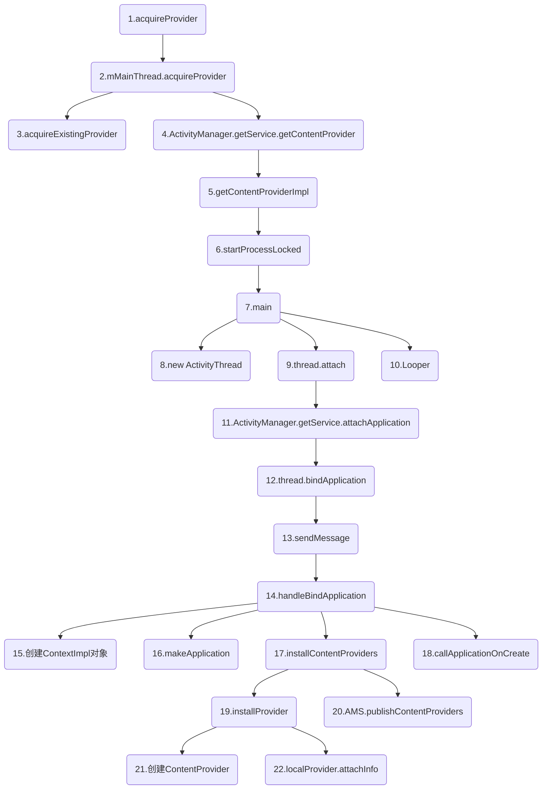

转载请注明链接：https://blog.csdn.net/feather_wch/article/details/52035228

>本文是我一点点归纳总结的干货，但是难免有疏忽和遗漏，希望不吝赐教。

# ContentProvider详解
版本：2018/9/1-1(18:16)

---

[TOC]


## 基础

1、ContentProvider是什么？
>1. 一种`数据共享型组件`
>2. 内部需要实现`增删改查`四种操作
>3. 内部的`insert\delete\update\query`方法需要处理好线程同步，因为这些方法都在`Binder线程池`中调用

2、ContentProvider要点
> 1. ContentProvider所在进程启动时，就会同时启动并且发布到AMS中
> 2. ContentProvider的onCreate要先于Application的onCreate执行

### ContentResolver

3、ContentResolver的作用
> 1. 无法直接和ContentProvider交互，需要借助ContentResolver。
> 2. 通过该类，通过URI就能操作不同的ContentProvider中的数据

4、为什么要使用通过ContentResolver类从而与ContentProvider类进行交互，而不直接访问ContentProvider类？
> 1. 一款应用要使用多个ContentProvider，在ContentProvider类上增加 ContentResolver类对所有的ContentProvider进行统一管理。

5、ContentResolver的使用
```java
// 1、使用ContentResolver前，需要先获取ContentResolver
ContentResolver resolver =  getContentResolver();

// 2、设置ContentProvider的URI
Uri uri = Uri.parse("content://cn.scu.myprovider/user");

// 3、根据URI 操作 ContentProvider中的数据
// 此处是获取ContentProvider中 user表的所有记录
Cursor cursor = resolver.query(uri, null, null, null, "userid desc");
```

### ContentObserver

6、ContentObserver的作用？
> 当ContentProvider中数据发生改变后可以通知外界

## 启动

1、ContentProvider的启动流程
> 1. App启动时，会执行ActivityThread的main方法。
> 1. 会创建主线程的Looper的Handler。
> 1. 然后创建ActivityThread实例，并且执行`attach()`，最终会创建ContextImpl、Application、ContentProvider。
> 1. 并且依次执行ContentProvider的onCreate()和Application的onCreate()

>1. main: 进行`第2、3、4、5、6的工作`
>1. Looper.prepareMainLooper(): 准备主线程的Looper
>1. new ActivityThread(): 创建实例
>9. thread.attach: 一系列初始化工作
>1. thread.getHandler(): 获取Main线程的Handler
>10. Looper.loop(): Looper开启消息循环
>7. ActivityManager.getService().attachApplication(): 通过`AMS`进行处理---【IPC】
>8. thread.bindApplication(): 通过【IPC】又交给ContentProvider进程进行bindApplication操作
>9. sendMessage(H.BIND_APPLICATION): 发送`BIND_APPLICATION`
>10. handleBindApplication: 进行`11、12、13、14的工作`，主要是创建Application和COntentProvider
>15. ContextImpl.createAppContext: 创建ContextImpl对象
>16. makeApplication: 创建Application对象
>17. installContentProviders: 进行`17、18`，启动当前进程的ContentProvider并调用其onCreate方法
>18. callApplicationOnCreate： 调用Application的onCreate方法
>19. installProvider: 遍历当前进程的Provider列表，调用installProvider进行启动。进行`21、22`
>20. AMS.publishContentProviders: 将已经启动的ContentProvider保存在AMS的ProviderMap中 外部调用者就可以直接从AMS中获取ContentProvider
>21. 类加载器创建ContentProvider
>22. localProvider.attachInfo: 通过ContextProvider的方法调用了onCreate方法

2、ActivityThread.main()的源码
```java
public static void main(String[] args) {
    // 1、创建MainLooper
    Looper.prepareMainLooper();
    // 2、创建ActivityThread
    ActivityThread thread = new ActivityThread();
    // 3、thread.attach()->xxx->handleBindApplication()->创建ContentProvider
    thread.attach(false, startSeq);
    // 4、创建Handler
    if (sMainThreadHandler == null) {
         sMainThreadHandler = thread.getHandler();
    }
    // 5、loop()无限循环
    Looper.loop();
}
```

## 数据访问
1、ContentProvider的数据访问
> 1. ContentProvider启动后，外界就可以通过提供的接口进行增删改查
> 2. 外界无法直接访问`ContentProvider`，需要通过`AMS`根据`Uri`来获取对应的`ContentProvider`的Binder接口`IContentProvider`
> 3. 然后通过`IContentProvider`来访问其数据源
```java
/**
 * =============================================================================
 * 1. 其他应用通过AMS来访问指定的ContentProvider
 * 2. 通过AMS获得ContentProvider的Binder对象：IContentProvider
 * 3. IContentProvider的具体实现ContentProvider.Transport(继承自ContentProviderNative）
 * 以query为例: 最终会通过IPC调用到ContentProvider.Transport的query方法
 * //ContentProvider.java内部类: Transport
 * =============================================================================
 */
public Cursor query(String callingPkg, Uri uri, String[] projection, ......) {
    ......
    //1. 调用了ContentProvider的query方法
    Cursor cursor = ContentProvider.this.query(uri, projection, queryArgs, CancellationSignal.fromTransport(cancellationSignal));
    ......
}
```

## 数据解析

64、ContentProvider的数据访问解析
>1. 访问`ContentProvider`需要通过`ContentResolver`，这是一个抽象类
> 2. `Context的getContentResolver()`本质获取的是`ApplicationContentResolver`对象(ContextImpl的内部类)
> 3. 当`ContentProvider`所在进程未启动时，第一次访问会触发所在进程的启动和`ContentProvider`的创建。
> 4. 例如`ContentResolver.query()`方法，首先会获取`IContentProvider`对象，最终通过`acquireProvider`来获取`ContentProvider`

65、ContentProvider访问和创建的流程图

>1. acquireProvider：；直接调用`ActivityThread`的方法; 位于`ContextImpl.java的内部类：ApplicationContentResolver`
>2. mMainThread.acquireProvider: 进行`3、4`
>3. acquireExistingProvider(): 查询是否存在需要的ContentProvider，存在就直接返回
>4. ActivityManager.getService().getContentProvider: 发送请求让`AMS`启动需要的`ContentProvider`
>5. getContentProviderImpl: 调用`startProcessLocked`去启动ContentProvide所在进程，然后才会启动ContentProvider
>6. startProcessLocked: 1. 会先启动ContentProvider所在的进程，然后才会启动ContentProvider 2. 主要是通过Process的start方法来完成新进程的启动 3. 新进程启动后入口方法在ActivityThread的main方法
>7. main: 进行`第8、9、10三个工作`1.创建ActivityThread实例 2.初始化工作 3.Looper相关
>8. new ActivityThread(): 创建实例
>9. thread.attach: 一系列初始化工作
>10. Looper: Looper相关工作
>11. ActivityManager.getService().attachApplication(): 通过`AMS`进行处理---【IPC】
>12. thread.bindApplication(): 通过【IPC】又交给ContentProvider进程进行bindApplication操作
>13. sendMessage(H.BIND_APPLICATION): 发送`BIND_APPLICATION`
>14. handleBindApplication: 进行`15、16、17、18的工作`，主要是创建Application和COntentProvider
>15. ContextImpl.createAppContext: 创建ContextImpl对象
>16. makeApplication: 创建Application对象
>17. installContentProviders: 进行`19、20`，启动当前进程的ContentProvider并调用其onCreate方法
>18. callApplicationOnCreate： 调用Application的onCreate方法
>19. installProvider: 遍历当前进程的Provider列表，调用installProvider进行启动。进行`21、22`
>20. AMS.publishContentProviders: 将已经启动的ContentProvider保存在AMS的ProviderMap中 外部调用者就可以直接从AMS中获取ContentProvider
>21. 类加载器创建ContentProvider
>22. localProvider.attachInfo: 通过ContextProvider的方法调用了onCreate方法

### 源码

66、ContentProvider源码解析
```java
    //ContextImpl.java的内部类：ApplicationContentResolver
    protected IContentProvider acquireProvider(Context context, String auth) {
        //1. 直接调用`ActivityThread`的方法
        return mMainThread.acquireProvider(context, ContentProvider.getAuthorityWithoutUserId(auth), resolveUserIdFromAuthority(auth), true);
    }

    //ActivityThread.java
    public final IContentProvider acquireProvider(Context c, String auth, int userId, boolean stable) {
        //1. 查找是否已经存在需要的ContenProvider
        final IContentProvider provider = acquireExistingProvider(c, auth, userId, stable);
        if (provider != null) {
            //2. 存在就直接返回——ActivityThread通过mProviderMap来存储已经启动的ContentProvider
            return provider;
        }
        ContentProviderHolder holder = null;
        //3. 不存在就发送请求让`AMS`启动需要的`ContentProvider`
        holder = ActivityManager.getService().getContentProvider(getApplicationThread(), auth, userId, stable);
        ......
        //4. 最后修改引用计数
        holder = installProvider(c, holder, holder.info, true, holder.noReleaseNeeded, stable);
        return holder.provider;
    }

    //ActivityManagerService.java
    public final ContentProviderHolder getContentProvider(IApplicationThread caller, String name, int userId, boolean stable) {
        ...
        return getContentProviderImpl(caller, name, null, stable, userId);
    }

    //ActivityManagerService.java
    private ContentProviderHolder getContentProviderImpl(IApplicationThread caller, ...) {
        ContentProviderRecord cpr;
        ContentProviderConnection conn = null;
        ProviderInfo cpi = null;
        ......
        //1. 会先启动ContentProvider所在的进程，然后才会启动ContentProvider
        /**==================================================================
         * 1. 会先启动ContentProvider所在的进程，然后才会启动ContentProvider
         * 2. startProcessLocked中主要是通过Process的start方法来完成新进程的启动
         * 3. 新进程启动后入口方法在ActivityThread的main方法(个人认为这是ContentProvider的进程不是我们自己应用的)
         *==================================================================*/
        proc = startProcessLocked(cpi.processName,
                cpr.appInfo, false, 0, "content provider",
                new ComponentName(cpi.applicationInfo.packageName,
                        cpi.name), false, false, false);
        ......
        return cpr != null ? cpr.newHolder(conn) : null;
    }

    //ActivityThread.java
    public static void main(String[] args) {
        ...
        //1. 首先会创建ActivityThread实例
        ActivityThread thread = new ActivityThread();
        //2. 然后调用attach-进行一系列初始化
        thread.attach(false);
        //3. 然后开始消息循环
        Looper.prepareMainLooper();
        if (sMainThreadHandler == null) {
            sMainThreadHandler = thread.getHandler();
        }
        if (false) {
            Looper.myLooper().setMessageLogging(new LogPrinter(Log.DEBUG, "ActivityThread"));
        }
        Looper.loop();
        ...
    }

    //ActivityThread.java
    private void attach(boolean system) {
        ......
        //1. 将ApplicationThread对象传输给AMS(IPC)
        final IActivityManager mgr = ActivityManager.getService();
        mgr.attachApplication(mAppThread);
        ......
    }

    //ActivityManagerService.java
    public void attachApplication(IApplicationThread thread) {
        attachApplicationLocked(thread, callingPid);
    }

    //ActivityManagerService.java
    private boolean attachApplicationLocked(IApplicationThread thread, int pid) {
        ......
        thread.bindApplication(processName, appInfo, providers, ......);
        ......
    }

    //ActivityThread.java内部类：ApplicationThread
    public final void bindApplication(String processName, ApplicationInfo appInfo,......) {
        ......
        //1. 发送消息给Handler H(ActivityThread)
        sendMessage(H.BIND_APPLICATION, data);
    }
    //ActivityThread.java

    /**
     * ==============================================
     * -完成了Application的创建
     * -以及ContentProvider的创建
     * //ActivityThread.java
     * ================================================
     */
    private void handleBindApplication(AppBindData data) {
        ...
        //1. 创建ContextImpl对象和Instrumentation
        final ContextImpl instrContext = ContextImpl.createAppContext(this, pi);
        final ClassLoader cl = instrContext.getClassLoader();
        //Instrumentation
        mInstrumentation = (Instrumentation) cl.loadClass(data.instrumentationName.getClassName()).newInstance();
        final ComponentName component = new ComponentName(ii.packageName, ii.name);
        mInstrumentation.init(this, instrContext, appContext, component, data.instrumentationWatcher, data.instrumentationUiAutomationConnection);
        //2. 创建Application对象
        Application app = data.info.makeApplication(data.restrictedBackupMode, null);
        mInitialApplication = app;
        //3. 启动当前进程的ContentProvider并调用其onCreate方法
        if (!data.restrictedBackupMode) {
            if (!ArrayUtils.isEmpty(data.providers)) {
                installContentProviders(app, data.providers); //启动并且调用onCreate
                mH.sendEmptyMessageDelayed(H.ENABLE_JIT, 10 * 1000);
            }
        }
        //4. 调用Application的onCreate方法
        mInstrumentation.callApplicationOnCreate(app);
    }
    //ActivityThread.java
    private void installContentProviders(Context context, List<ProviderInfo> providers) {
        final ArrayList<ContentProviderHolder> results = new ArrayList<>();
        //1. 遍历当前进程的Provider列表
        for (ProviderInfo cpi : providers) {
            //2. 调用installProvider进行启动
            ContentProviderHolder cph = installProvider(context, null, cpi, ......);
            if (cph != null) {
                cph.noReleaseNeeded = true;
                results.add(cph);
            }
        }
        //2. 将已经启动的ContentProvider保存在AMS的ProviderMap中， 外部调用者就可以直接从AMS中获取ContentProvider
        ActivityManager.getService().publishContentProviders(getApplicationThread(), results);
        ......
    }
    //ActivityThread.java
    private ContentProviderHolder installProvider(Context context, ......) {
        ContentProvider localProvider = null;
        IContentProvider provider;
        ...
        //1. 通过类加载器完成了ContentProvider对象的创建
        final java.lang.ClassLoader cl = c.getClassLoader();
        localProvider = (ContentProvider) cl.loadClass(info.name).newInstance();
        provider = localProvider.getIContentProvider();
        if (provider == null) {
            return null;
        }
        //2. 通过ContextProvider方法调用了onCreate方法
        localProvider.attachInfo(c, info);
        ...
    }
```


## 序列图

73、ContentProvider的机制
```sequence
ContextImpl[使用者]->ContextImpl[使用者]: 1.getContentResolver().\nquery()
ContextImpl[使用者]->ContextImpl[使用者]: 2.acquireProvider()
ContextImpl[使用者]->ActivityThread: 3.mMainThread.\nacquireProvider()
ActivityThread->ActivityThread: 4.acquireExistingProvider()\n存在直接返回provider
ActivityThread->AMS: 【IPC】5.ActivityManager.\ngetService()
AMS->AMS: 6.getContentProvider()
AMS->AMS: 7.getContentProviderImpl()
AMS->AMS: 8.startProcessLocked()
AMS->ActivityThread[新]: 【新进程入口】9.main
ActivityThread[新]->ActivityThread[新]: 9-1.new ActivityThread()
ActivityThread[新]->ActivityThread[新]: 9-2.thread.\nattach(false)
ActivityThread[新]->ActivityThread[新]: 9-3.Looper.\nprepareMainLooper()
ActivityThread[新]->ActivityThread[新]: 10.attach()
ActivityThread[新]->AMS: 【IPC】11.ActivityManager.\ngetService()
AMS->AMS: 12.attachApplication()
AMS->AMS: 13.attachApplicationLocked()
AMS->ActivityThread[新]: 【IPC】14.thread.bindApplication()
ActivityThread[新]->ActivityThread[新]: 15.sendMessage\n(H.BIND_APPLICATION)
ActivityThread[新]->ActivityThread[新]: 16.handleBindApplication
ActivityThread[新]->ActivityThread[新]: 16-1.创建ContextImpl对象
ActivityThread[新]->ActivityThread[新]: 16-2.创建Instrumentation
ActivityThread[新]->ActivityThread[新]: 16-3.makeApplication()
ActivityThread[新]->ActivityThread[新]: 16-4.installContentProviders()
ActivityThread[新]->ActivityThread[新]: 16-5.mInstrumentation.\ncallApplicationOnCreate()
ActivityThread[新]->ActivityThread[新]: 17.installContentProviders()
ActivityThread[新]->ActivityThread[新]: 17-1.installProvider()
ActivityThread[新]->ActivityThread[新]: 18.localProvider.attachInfo()
ActivityThread[新]->AMS: 【IPC】17-2.ActivityManager.getService()
AMS->AMS: 19.publishContentProviders()

```
>1.获得ContextImpl的内部类：ApplicationContentResolver
>5.不存在ContentProvider让MAS启动需要的ContentProvider
>8.通过Process的start方法来完成新进程的启动
>9-1.首先会创建ActivityThread实例
>9-2.然后调用attach-进行一系列初始化
>9-3.然后开始消息循环
>12.将`ApplicationThread`传输给AMS
>15. 发送消息给Handler H
>16. 完成了Application的创建以及ContentProvider的创建
>16-3. makeApplication()创建Application对象
>16-4. 启动ContentProvider并调用onCreate方法
>16-5. 调用Application的onCreate方法
>17-1. 遍历当前进程的Provider列表并调用installProvider()
>18.创建ContentProvider对象,并调用onCreate方法
>19.将已经启动的ContentProvider保存在AMS的ProviderMap中，外部调用者就可以直接从AMS中获取ContentProvider

## 参考资料
1. [ContentProvider的基本使用](https://www.jianshu.com/p/ea8bc4aaf057)
