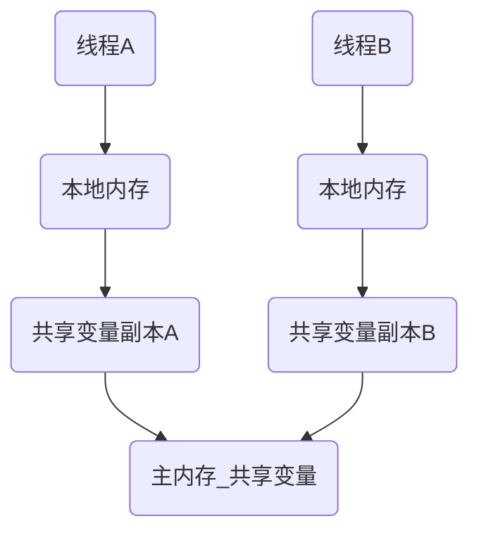
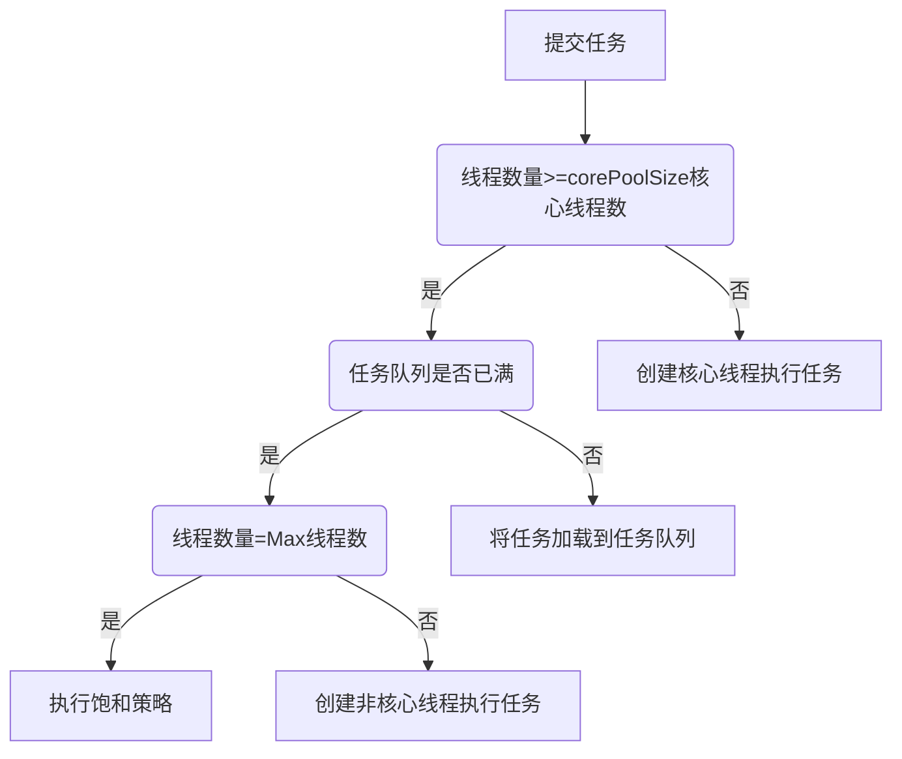

Android之多线程，包括线程、Java同步问题、阻塞队列、线程池、AsyncTask、HandlerThread、IntentService等内容。

>本文是我一点点归纳总结的干货，但是难免有疏忽和遗漏，希望不吝赐教。
>转载请注明链接：https://blog.csdn.net/feather_wch/article/details/79132183

有帮助的话请点个赞！万分感谢！

# Android多线程(99题)

2018/9/8(20:45)

[TOC]

## 问题汇总

---

## 线程(13)

1、什么是进程
>1. 系统分配资源的最小单位
>2. 进程就是程序运行的实体

2、什么是线程
>1. 系统调度的最小单位
>2. 一个进程中可以包含多个线程
>3. 线程拥有各自的计数器、堆栈和局部变量等属性，能够访问共享的内存变量

3、线程的好处
>1. 比进程的资源消耗要小，效率要更高
>2. 多线程的并发性能减少程序的响应时间
>3. 多线程能简化程序的结构，使程序便于理解和维护

4、线程的状态有哪些?

|状态|解释|备注|
|---|---|---|
|New|新创建状态|线程已被创建，还未调用start，做一些准备工作|
|Runnable|可运行状态|start之后进入，Runnable线程可能在运行也可能没有在运行，取决于系统分配的时间|
|Blocked|阻塞状态|线程被锁阻塞，暂时不活动|
|Waiting|等待状态|线程不运行任何代码，消耗最少的资源，直至调度器激活该线程|
|Timed Waiting|超时等待状态|与`Waiting`不同在于，可以在指定时间内返回|
|Terminated|终止状态|当前线程执行完毕：可能是run运行结束，或者出现未能捕获的异常导致线程终止|

5、线程如何从`新建状态`进入`可运行状态`？
>`Thread.start()`

6、线程如何从`可运行状态`到`阻塞状态`
>1. 线程在`请求锁`的时候会进入`阻塞状态`
>2. 线程一旦`得到锁`会返回到`可运行状态`

---

备注：
> 如下题目中的`Object.wait()`是指具体对象调用`wait等方法---someObject.wait()`，`Thread.join`是指具体线程调用该方法---`childThread.join()`

---

7、线程如何从`可运行状态`切换到`等待状态`
>1. 进入等待：`Object.wait()---当前线程进入等待状态（当前线程需要已经获得过锁，且调用后会失去锁）、Thread.join()---父线程会等待子线程`
>2. 退出：`Object.notify()和Object.notifyAll()`


8、线程如何从`可运行状态`切换到`超时等待状态`
>1. 进入：`Thread.sleep(long)、Thread.join(long)---让父线程等待子线程，子线程结束后父线程才继续执行、Object.wait(long)`
>2. 退出：`Object.notify()、Object.notifyAll()`或者`超时退出`

9、线程如何从`可运行状态`切换到`终止状态`
>1. 执行完毕
>2. 异常退出

10、Object.notify()、Object.notifyAll()之间的区别
>`Object.notify()`: 随机唤醒一个`wait线程`，调用该方法后只有一个线程会由`等待池`进入`锁池`。
>`Object.notifyAll()`: 会将`对象等待池`中的所有线程都进入`锁池`，进行竞争。竞争到的线程会继续执行，在释放掉`对象锁`后，锁池中的线程会继续开始竞争。（进入到锁池的线程，不会再进入等待池）

11、等待池和锁池是什么？
>1. `等待池`：线程调用`对象的wait`方法后，会释放该对象的锁，然后进入到`该对象的等待池中`。
>2. `锁池`：线程想要获得对象的锁，但是此时锁已经被其他线程拥有，这些线程就会进入到`该对象的锁池`中。

12、创建线程的三种方法
>1. 继承Thread，重写run方法
>2. 实现Runnable接口，并实现该接口的run方法
>3. 实现Callable接口(Executor框架中的内容，优势是能在任务结束后提供一个返回值，Runnable无法这样做)，重写call方法。
>4. 推荐第二种`Runnable接口`的方法，因为继承Thread没有必要。

13、终止线程的两种方法
>1. 调用`Thread.interrupted()`设置中断标志位，并通过`Thread.currentThread().isInterrupted()`检查标志位。缺点：被中断的线程不一定会终止
>2. 在`run()`方法中设置boolean标志位(需要`volatile`修饰为易变变量)：条件满足时跳出循环，run运行结束，thread安全终止

14、实现Callable接口创建多线程
> 1-实现Callable接口，重写run方法。
> 2-使用FutureTask进行包装，并且执行
```java
// 1、实现Callable接口，并用futureTask包装。
        FutureTask<Integer> futureTask = new FutureTask<>(new Callable<Integer>() {
            @Override
            public Integer call() throws Exception {
                // TODO sth，并返回结果。
                Integer result = 1;
                return result;
            }
        });
// 2、开启线程并且执行任务
        Thread thread = new Thread(futureTask);
        thread.start();

// 3、获取到线程执行的返回值
        Integer result = futureTask.get();
```

## 同步(8)
1、重入锁是什么？(3)
>1. 重入锁ReentrantLock在Java SE 5.0引入
>2. 该锁支持一个线程对资源的重复加锁
>3. 一个线程在锁住锁对象后，其他任何线程都无法进入Lock语句
```java
  val mLock = ReentrantLock()
  mLock.lock()
  try {
      //需要同步的操作
  }finally {
      mLock.unlock() //finally中进行解锁，避免死锁问题
  }
```

2、可重入锁的用途？
>1. `阻塞队列`就是使用`ReentrantLock`实现的。

3、条件对象/条件变量的作用(4)
>1. 用于管理那些获得锁却因部分条件不满足而无法正常工作的线程
>2. 可以通过`newCondition`获得锁`lock`的条件变量（`和ReentrantLock配合使用`）
>3. 条件对象调用`await`方法，当前线程就会阻塞并且放弃该锁
>4. `await`线程会进入`阻塞状态`，直到另一个线程，调用同一条件对象的`signalAll()`方法，之后等待的所有线程通过竞争条件去抢锁
```java
        //1. 可重入锁
            val mLock = ReentrantLock()
            mLock.lock()
        //2. 条件变量
            val condition = mLock.newCondition()
            try {
                while(条件不满足){
        //3. await进入Block状态
                    condition.await()
                }
        //4. 条件满足方会进行后续操作
                        //...
        //5. 操作完成后调用同一条件变量的signalAll去激活等待该条件的线程
                condition.signalAll()
            }finally {
                mLock.unlock() //finally中进行解锁，避免死锁问题
            }
```

4、synchronized同步方法(4)
>1. `Lock`和`condition`提供了高度的锁定控制，然而大多数情况下不需要这样麻烦
>2. 从Java 1.0开始，每个对象都有一个内部锁
>3. 当一个方法使用`synchronized`修饰，意味着线程必须获得内部锁，才能调用该方法
```java
synchronized public void doSth() throws InterruptedException{
    //1. 条件不满足，进入Block状态
    while(条件不满足){
        wait();
    }
    //2. 条件满足方会进行后续操作
        //...
    //3. 解除该锁，并通知所有阻塞的线程
    notifyAll();
}
```
>4. 备注：Kotlin学的不深，暂时没找到Kotlin中同步的方法，就用Java实现

5、同步代码块的使用(1)和问题(2)
>1. java中可以通过给一个Object对象上锁，来使用代码块
>2. 同步代码块非常脆弱不推荐
>3. 一般实现同步，最好使用`java.util.concurrent`包下提供的类，例如`阻塞队列`
```java
Object object = new Object();
synchronized (object){
    //进行处理, 不推荐使用
}
```

6、synchronized方法和synchronized同步代码块的区别？
>1. `用synchronized修饰符`修饰的方法就是`同步方法`
>2. `synchronized代码块`需要一个`对象锁`

7、死锁是什么？
>`死锁`是指`两个或者两个以上线程/进程`进行资源竞争时出现了阻塞现象，如果没有外力帮助，它们都将无法继续工作下去，此时系统处于`死锁状态`。

8、可能出现死锁的场景
>1. `可重入锁ReentrantLock`在`mLock.lock()`后如果出现异常，但是没有在`try-catch`的`finally`中没有执行`mLock.unLock()`就会导致死锁。
>2. `notify`比`notifyAll`更容易出现`死锁`

## Java中的volatile(13)
1、Java的堆内存是什么？(2)
>1. 堆内存用于存储`对象实例`
>2. 堆内存被所有线程所共享: 会存在内存可见性问题

2、 Java中的局部变量、方法定义的参数是否会被线程所共享？
>1. 局部变量、方法定义的参数则不会在线程间共享：不存在内存可见性问题，也不会受到内存模型影响，

3、Java内存模型的作用
>1. Java内存模型控制线程之间的通信，`决定了`一个线程对共享内存的写入何时对另一个线程可见。
>2. `定义了线程和主存之间的抽象关系：`
>     1. 线程之间的共享变量存储在`主存`中，每个线程都有一个`私有的本地内存`，本地内存中存储了该该线程贡献变量的副本，
>     2. `本地内存是Java内存模型中的抽象概念`，实际上并不存在，覆盖了`缓存、写缓存区、寄存器`等区域。

4、Java内存模型图


5、线程间共享变量的通信需要满足的步骤?(2)
>A、B线程之间数据通信，需要满足两个步骤：
>   1. 第一步线程A将本地更新过的共享数据刷新到主存中；
>   2. 第二步线程B到主存中读取已经刷新的最新共享数据

6、可见性是什么？
>1. 可见性是指线程修改的状态能否立即对另一个线程可见
>2. `volatile`修饰的变量，在发生变化后会立即更新到主存，已保证共享数据的可见性

7、volatile关键字的作用
>1. 能保证有序性：禁止指令重新排序，之前的指令不会在volatile之后执行，之后指令也不会在之前执行
>2. 保证可见性：更新的数据立即可见
>2. 不保证原子性

8、有序性是什么？(2)
>1. Java中`编译器和处理器`能对指令的顺序重新排序，可不会影响单个线程执行的正确性，却无法保证多线程并发的正确性。
>2. `保证多线程并发的正确性`就需要保证`有序性`

9、如何能保证有序性？(2)
>1.` volatile`能保证有序性
>2. `synchronized和Lock`也能保证有序性

10、原子性是什么？
>1. 对基本数据类型变量的赋值和读取是原子性操作-要么不执行，要么不会被中断。
```java
  x = 3; //原子操作
  y = x; //非原子操作：复制，并且存储
  x++;  //非原子操作: 读取x，自加，存储
```

11、如何保证操作的原子性？
>1. `java,util.concurrent.atomic`包中很多类使用高效的机器级别指令来保证操作的原子性
>2. `AtomicInteger`的`incrementAndGet/decrementAndGet()`提供原子性自加/自减-可以作为共享计数器而无需同步
>3. `AtomicBoolean、AtomicLong、AtomicReference`等类也都是原子性操作
>4. 原子性操作类应该由开发并发工具的程序员使用，而不是应用程序员使用

12、使用volatile的典型场景
>1. 状态标志：如线程run方法中通过标志位判断是否终止线程，就比使用synchonized要简单和高效(`通过synchronized也可以实现，但是该场景使用volatile性能更高`)
>2. 双重检查模式(DCL): 应用于单例模式的getInstance保证实例唯一。DLC资源利用率高，第一次加载反应稍慢，在高并发情况下有一定缺陷

13、部分场景下使用volatile取代synchronized的要点
>1. `synchronized`能提供同步保护，却会影响性能。一定场景下可以用`volatile`替换。
>2. `volatile`无法保证原子性，必须具备两个条件才可以替换
>3. 条件1:对变量的写操作不依赖于当前值(不能自增、自减)
>4. 条件2:该变量没有包含在具有其他变量的不等式中(例如,volatile a,b, 不等式a<b无法保证线程安全)
>5. 总结：变量独立于其他变量，也独立于自己本身之前的数值

## 阻塞队列(10)
1、什么是阻塞队列
>1. 阻塞队列常应用于生产者-消费者模型
>2. 阻塞队列需要满足1：队列中没有数据时，消费者端的所有线程全部自动阻塞(挂起)
>3. 阻塞队列需要满足2：队列中填满数据时，生产者端的所有线程都自动阻塞

2、阻塞队列(BlockingQueue)核心方法
>1. 放入数据：
>     1. offer(object)，可以存入，返回true；不可以存入，返回false。该方法不会阻塞当前线程
>     2. put(Object), 阻塞队列有空间，则存入；没有空间，当前线程阻塞，直至阻塞队列有空间存放数据。
>2. 获取数据：
>     1. poll(time):从阻塞队列中将首位对象取出。若不能取出，再等待time的时间。取不到就返回null
>     2. take():取走队列中首位数据。若队列为空，则当前线程阻塞，直到队列中有数据，并且返回该数据。
>     3. drainTo(): 一次性取走所有可用数据。无需多次加锁操作，提高效率。

3、Java中7种阻塞队列的要点
|种类|特点|备注|
|---|---|---|
|ArrayBlockingQueue   |数组组成的有界阻塞队列   |默认不保证线程公平地访问队列|
|LinkedBlockingQueue   |链表组成的有界阻塞队列   |若构造时不指定队列缓存区大小，默认无穷大。一旦生产速度>消费速度，会导致内存耗尽|
|PriorityBlockingQueue   |支持优先级排序的无界阻塞队列---默认升序排列   |能通过`compareTo`方法和构造参数`comparator`对元素排序，但无法保证同级元素的顺序   |
|DelayQueue   |延时获取元素的无界阻塞队列   |每个元素必须实现Delayed接口，创建时指定元素到期时间，元素到期后才能取出   |
|SynchronousQueue   |不存储元素的阻塞队列   |   |
|LinkedTransferQueue   | 链表存储的无界阻塞队列  |   |
|LinkedBlockingDeque   | 链表存储的双向阻塞队列  |可以从两端同时插入和删除，减少一半竞争   |

4、阻塞队列ArrayBlockingQueue实现原理
> 1. 内部维护一个Object类型的数组
> 2. lock所采用的可重入锁(ReentrantLock)

5、ArrayBlockingQueue的put()源码解析和要点
```java
/**
 *  存放数据
 *    1-有空间存放，就直接存入数据
 *    2-没有空间存放，当前线程阻塞到有多余空间，再存入
 */
public void put(E e) throws InterruptedException {
    Objects.requireNonNull(e);
    final ReentrantLock lock = this.lock;
    //1. 获取锁，并且是可中断的锁
    lock.lockInterruptibly();
    try {
        //2. 判断数组是否已满
        while (count == items.length){
            //3. 已满，条件变量(notFull)阻塞当前线程
            notFull.await();
        }
        //4. 未满，将元素插入数组
        enqueue(e);
    } finally {
        //5. 最后解锁
        lock.unlock();
    }
}
```

6、ArrayBlockingQueue的enqueue()源码解析和要点
```java
private void enqueue(E x) {
    //1. 在putIndex下标处放入元素
    final Object[] items = this.items;
    items[putIndex] = x;
    //2. 插入后若已经到数组尾部，则从头部开始(puIndex = 0)
    if (++putIndex == items.length) putIndex = 0;
    count++;
    //3. 解锁条件变量-notEmpty-唤醒正在等待获取元素的线程
    notEmpty.signal();
}
```

7、ArrayBlockingQueue的take()源码解析和要点
```java
/**
 *  取走队列中首位元素。
 *    1-队列为空，当前线程阻塞，直到队列中有数据，并且返回该数据
 */
public E take() throws InterruptedException {
    final ReentrantLock lock = this.lock;
    //1. 获得锁-可中断锁
    lock.lockInterruptibly();
    try {
        //2. 若队列为空，阻塞，直到队列中有数据
        while (count == 0)
            notEmpty.await();
        //3. 队列不为空，获取数据
        return dequeue();
    } finally {
        //4. 解锁
        lock.unlock();
    }
}
```

8、ArrayBlockingQueue的dequeue()源码解析和要点
```java
/**
 * 取出元素，仅仅在获得锁时被调用
 */
private E dequeue() {
    //1. 取出元素
    final Object[] items = this.items;
    @SuppressWarnings("unchecked")
    E x = (E) items[takeIndex];
    items[takeIndex] = null;
    if (++takeIndex == items.length) takeIndex = 0;
    count--;
    if (itrs != null)
        itrs.elementDequeued();
    //2. 激活等待notFull条件的线程
    notFull.signal();
    return x;
}
```

### 阻塞队列：消费者模型
9、非阻塞队列实现消费者模型源码：
```java
public class Main {
    private int queueSize = 10;
    private PriorityQueue<Integer> queue = new PriorityQueue(queueSize);
    public static void main(String args[]){
        Main main = new Main();
        Consumer consumer = main.new Consumer();
        consumer.start();
        Producer producer = main.new Producer();
        producer.start();
    }

    class Consumer extends Thread{
        @Override
        public void run() {
            while(true){
                synchronized (queue){
                    while(queue.size() == 0){
                        System.out.println("仓库中没有产品");
                        try {
                            queue.wait();
                        } catch (InterruptedException e) {
                            e.printStackTrace();
                            queue.notify();
                        }
                    }
                    Integer product = queue.poll();
                    System.out.println("消耗产品："+product);
                    queue.notify();
                }
            }
        }
    }

    class Producer extends Thread{
        int product = 0;
        @Override
        public void run() {
            while(true){
                synchronized (queue){
                    while(queue.size() == queueSize){
                        System.out.println("仓库已满");
                        try {
                            queue.wait();
                        } catch (InterruptedException e) {
                            e.printStackTrace();
                            queue.notify();
                        }
                    }
                    queue.offer(product);
                    System.out.println("生产产品："+product);
                    product++;
                    queue.notify();
                }
            }
        }
    }
}
```

10、阻塞队列实现消费者模型(核心代码)：
>使用阻塞队列就不需要处理锁，实现简单
```java
    private int queueSize = 10;
    private ArrayBlockingQueue<Integer> queue = new ArrayBlockingQueue(queueSize);

    class Consumer extends Thread{
        @Override
        public void run() {
            while(true){
                int product = -1;
                try {
                    product = queue.take();
                } catch (InterruptedException e) {
                    e.printStackTrace();
                }
                System.out.println("消耗产品："+product);
            }
        }
    }

    class Producer extends Thread{
        int product = 0;
        @Override
        public void run() {
            while(true){
                try {
                    queue.put(product);
                    System.out.println("生产产品："+product);
                    product++;
                } catch (InterruptedException e) {
                    e.printStackTrace();
                }
            }
        }
    }
}
```

## 线程池(16)
1、为什么需要线程池？
>1. 每个线程的创建/销毁都有一定开销，通过维护一定量的线程就可以减少这些开销。
>2. 线程`各自为政`，`难以控制管理`。

2、Executor框架的作用？
>1. Java 1.5开始提供`Executor`框架用于把任务提交和任务处理解耦
>2. 任务的提交：交给`Runnable`、`Callable`处理。
>3. 任务的处理：交给`Executor`框架。
>4. `Executor`框架核心是`ThreadPoolExecutor`-也就是线程池的核心实现类

3、ThreadPoolExecutor的作用
>1. `ThreadPoolExecutor`可以创建一个线程池

4、ThreadPoolExecutor构造方法的七个参数的作用？
|线程池参数|含义|作用|
|---|---|---|
|corePoolSize   |核心线程数   |默认线程数为0，若当前运行的线程数少于该值，则会创建新线程处理任务   |
|maximumPoolSize   |线程池允许创建的最大线程数   |若任务队列已满且线程数少于该值，则仍会创建新线程   |
|keepAliveTime   |非核心线程闲置的超时时间   |线程闲置时间若超过该时间则回收该线程。若任务很多，且执行时间都很短，提高该值可以提高线程利用率。`allowCoreThreadTimeOut`属性为True时，该值也会用于核心线程   |
|TimeUnit   |keepAliveTime的时间单位   |可以为DAYS\HOURS\MINUTES\SECONDS\MILLISECONDS   |
|workQueue|任务队列|若当前线程数>corePoolSize,将任务添加到任务队列。为`BlockingQueue`|
|ThreadFactory   |线程工厂   |可以用于给每个创建的线程设置名字。一般无需使用   |
|RejectedExecutionHandler   |饱和策略   |当任务队列和线程池都已满时，采用何种策略。默认是`AbordPolicy`-无法处理任务时，抛出异常   |

5、饱和策略有哪些？(4)
>1. `AbordPolicy`:无法处理任务时，抛出异常
>1. `CallerRunsPolicy`:调用者所在线程处理任务；
>2. `DiscardPolicy`:将不能执行的任务删除;
>3. `DiscardOldestPolicy`:丢弃队列最老的任务，并执行当前任务

6、线程池的处理流程和原理


7、进入任务队列中的任务会被如何处理？
>1. 任务队列中的任务，会在有核心/非核心线程空闲时，被取走并处理

8、线程池的4种常用种类
> 1. FixedThreadPool: 可重用固定线程数的线程池
> 2. CachedThreadPool: 根据需要创建线程的线程池
> 3. SingleThreadExecutor：使用单个工作线程的线程池
> 4. ScheduledThreadPool：能实现定时和周期性任务的线程池

9、FixedThreadPool的特点
> 1. `只有核心线程且数量固定(通过够早的参数指定)`，`没有非核心线程数`(corePoolSize = maximumPoolSize)
> 2. 多余的线程会被立即终止(keepAliveTime = 0L)
> 3. 任务队列使用`无界阻塞队列(LinkedBlockingDeque)`
> 4. 思路:当线程数达到corePoolSize时，就将任务存储在任务队列中，且等待空闲线程去执行

10、CachedThreadPool
> 1. `没有核心线程`(corePoolSize = 0)
> 2. `非核心线程无限`(maximumPoolSize = Integer.MAX_VALUE)
> 3. 空闲线程等待新任务时间为60s(keepAliveTime = 60L)
> 4. 阻塞队列采用`SynchronousQueue`-不存储元素的阻塞队列，每个线程插入操作必须等待另一个线程的移除操作，反之亦然。
> 5. 思路：每次提交的任务都会立即有线程去执行。线程一旦空闲，会等待60s。
> 6. 特点：适合大量需要立即处理，并且耗时较少的任务。

11、SingleThreadPool
> 1. `只有一个核心线程`，`没有非核心线程`(corePoolSize=maximumPoolSize=1)
> 2. 其余参数和`FixedThreadPool`一致
> 3. 流程：新提交的任务，若没有核心线程则创建并执行该任务，若核心线程正在处理任务则将新任务提交至阻塞队列中，等待处理。
> 4. 特点：保证所有任务都在一个线程中按顺序处理。

12、ScheduledThreadPool(定时和周期性任务)
> 1. 核心线程数由corePoolSize决定
> 2. 阻塞队列使用`无界`的`DelayedWorkQueue`，因此没有非核心线程(第二个参数无效0)
> 3. 每个要执行的任务被包装成`ScheduledFutureTask`，放入任务队列。等待线程执行
> 4. DelayedWorkQueue会对任务进行排序，最需要执行的放在最前方。
> 5. 不同：任务执行后，会更改`ScheduledFutureTask`的time变量为下次执行的时间，并放回到队列中

13、新建线程时，必须通过线程池提供(AsyncTask或者ThreadPoolExecutor), 不应该在应用中自行显式创建线程。

14、线程池创建的三种方法？
>1. Executors:
```java
ExecutorService cachedThreadPool = Executors.newCachedThreadPool();
```
>2. ThreadPoolExecutor:
```java
ExecutorService executorService = new ThreadPoolExecutor(xxx);
```
>3. 其他常见线程池如：ScheduledThreadPoolExecutor
```java
ScheduledThreadPoolExecutor mScheduledThreadPoolExecutor = new ScheduledThreadPoolExecutor(CORE_POOL_SIZE, sThreadFactory);
```

15、线程池的创建为什么不能使用Executors创建？
>1. `FixedThreadPool`和`SingleThreadPool`：允许的请求队列长度为`Integer.MAX_VALUE`,可能会堆积大量的请求，导致OOM。
>2. `CachedThreadPool`和`ScheduledThreadPool`：允许的创建线程数量为`Integer.MAX_VALUE`,可能会导致创建大量的线程，导致OOM。

16、ScheduledThreadPool会出现创建大量线程的问题反思
>1. `ScheduledThreadPool`构造方法里面的确将线程最大数设置为`Integer.MAX`
>2. 但是使用的`阻塞队列`是`DelayedWorkQueue`, 该队列是`无界队列（会自动扩容）`
>3. `根据线程池的处理流程`，永远不会出现`任务数 >= 核心线程数 + 任务队列总数`的情况，因此`根本是用不到 线程数最大为Integer.MAX这个参数`

## HandlerThread

68、HandlerThread是什么?(6)
>1. `Thread`中如果要使用`Handler`需要创建`Looper`等操作，比较繁琐。
>1. `HandlerThread`就是内部创建了`Looper`的`Thread`.
>1. 内部具有队列，任务会串行处理。(如果一个任务执行时间过长，会阻塞后续任务)
>2. 执行任务：外界需要通过`Hanlder`的消息方式来通知`HandlerThread`来执行一个具体任务
>3. 退出：`HandlerThread`的`run`方法是`无限循环`执行的，需要通过`HandlerThread`的`quit或quitSafely`方法来终止`线程的执行`
>4. 使用场景：`HandlerThread`典型使用场景是`IntentService`
```java
/**=============================
 *  创建并开启HandlerThread
 *==============================*/
        //创建一个线程,线程名字：handler-thread
        HandlerThread mHandlerThread = new HandlerThread( "handler-thread") ;
        //开启一个线程
        mHandlerThread.start();
/**===========================
 *  创建Handler并实现具体任务
 *============================*/
        //在这个线程中创建一个handler对象
        Handler handler = new Handler( mHandlerThread.getLooper() ){
            @Override
            public void handleMessage(Message msg) {
                super.handleMessage(msg);
                //这个方法是运行在 handler-thread 线程中的 ，可以执行耗时操作
                Log.d( "handler " , "消息： " + msg.what + "  线程： " + Thread.currentThread().getName()  ) ;
            }
        };
/**===========================
 *  开启任务的执行
 *=============================*/
        //在主线程给handler发送消息
        handler.sendEmptyMessage(1) ;
```

## IntentService
69、IntentService是什么?
>1. 是一种特殊`Service`
>1. 为`抽象类`,必须创建`子类`才可以使用`IntentService`
>1. 可用于执行后台耗时的任务，任务执行后会`自动停止`
>3. 具有`高优先级`(服务的原因),优先级比单纯的`线程`高很多，适合`高优先级`的后台任务，且不容易被系统杀死。
>4. 封装了`HandlerThread`和`Handler`

70、IntentService的原理解析
```java
public abstract class IntentService extends Service {
        private volatile Looper mServiceLooper;
        private volatile ServiceHandler mServiceHandler;
        ...省略...
        //IntentService第一次启动调用
        public void onCreate() {
            super.onCreate();
            //1. 创建一个HanlderThread
            HandlerThread thread = new HandlerThread("IntentService[" + mName + "]");
            thread.start();
            //2. 通过HanlderThread的Looper来构建Handler对象mServiceHandler
            mServiceLooper = thread.getLooper();
            mServiceHandler = new ServiceHandler(mServiceLooper);
        }
        //IntentService每次启动都会调用
        public int onStartCommand(Intent intent, int flags, int startId) {
            //3. 直接调用onStart
            onStart(intent, startId);
            return mRedelivery ? START_REDELIVER_INTENT : START_NOT_STICKY;
        }
        public void onStart(Intent intent, int startId) {
            //4. 通过mServiceHandler发送一个消息(该消息会在HanlderThread中处理)
            Message msg = mServiceHandler.obtainMessage();
            msg.arg1 = startId;
            msg.obj = intent;
            mServiceHandler.sendMessage(msg);
        }
        //ServiceHandler接收并处理onStart()方法中发送的Msg
        private final class ServiceHandler extends Handler {
            public ServiceHandler(Looper looper) {
                super(looper);
            }
            @Override
            public void handleMessage(Message msg) {
                //1. 直接在onHandleIntent中处理(由子类实现)
                onHandleIntent((Intent)msg.obj);
                /**=================================================
                 * 3. 尝试停止服务(会等待所有消息都处理完毕后，才会停止)
                 *   不能采用stopSelf()——会立即停止服务
                 *================================================*/
                stopSelf(msg.arg1); //会判断启动服务次数是否与startId相等
            }
        }
        //2. 该Intent与startService(intent)中的Intent完全一致
        protected abstract void onHandleIntent(Intent intent);

        public void onDestroy() {
            mServiceLooper.quit();
        }//销毁时会停止looper
}
```
>1. `IntentService`通过发送消息的方式向`HandlerThread`请求执行任务
>2. `HandlerThread`中的`looper`是顺序处理消息，因此有多个后台任务时，都会按照外界发起的顺序`排队执行`
>3. 启动流程：onCreate()->onStartCommand()->onStart()
>4. 消息处理流程：ServiceHandler.handleMessage()->onHandleIntent()

71、IntentService实例:
>1. 自定义LocalIntentService继承自IntentService
```java
public class LocalIntentService extends IntentService{
    public LocalIntentService(String name) {
        super(name);
    }
    @Override
    protected void onHandleIntent(@Nullable Intent intent) {
        String action = intent.getStringExtra("task_action");
        Log.d("IntentService", "receive task :" + action);
        SystemClock.sleep(3000); //即使第一个任务休眠，后续的任务也会等待其执行完毕
        if("com.example.action.TASK1".equals(action)){
            Log.d("IntentService", "handle task :" + action);
        }
    }
}
```
>2. 开启IntentService
```java
Intent service = new Intent(this, LocalIntentService.class);
service.putExtra("tast_action", "com.example.action.TASK1");
startService(service);
service.putExtra("tast_action", "com.example.action.TASK2");
startService(service);
service.putExtra("tast_action", "com.example.action.TASK3");
startService(service);
```

## 补充题
72、Thread的run()和start()的区别
>1. `start()`会让线程去排队(处于就绪状态)，之后会调用`run()`
>2. `run()`是线程需要执行的内容

73、Synchronized三种应用的锁是什么？
>* Java中每一个对象都可以作为锁，这是synchronized实现同步的基础：
>    1. 普通同步方法，锁是当前实例对象
>    2. 静态同步方法，锁是当前类的class对象
>    3. 同步方法块，锁是括号里面的对象

74、现在有T1、T2、T3三个线程，你怎样保证T2在T1执行完后执行，T3在T2执行完后执行？
>考察对Join是否熟悉：父线程会等待子线程运行结束
```java
Thread thread3 = new Thread(new Runnable() {
            @Override
            public void run() {
              /**
                * T2：T3等待T2执行完毕
                */
                Thread thread2 = new Thread(new Runnable() {
                    @Override
                    public void run() {
                       /**
                        * T1：T2等待T1执行完毕
                        */
                        Thread thread1 = new Thread(new Runnable() {
                            @Override
                            public void run() {
                                System.out.println("Thread 1 stopped");
                            }
                        });
                        thread1.start();
                        // T2等待T1执行完毕
                        thread1.join();

                        System.out.println("Thread 2 stopped");
                    }
                });
                thread2.start();
                //T3等待T1执行完毕
                thread2.join();

                System.out.println("Thread 3 stopped");
            }
});
thread3.start();

```

75、在Java中Lock接口比synchronized块的优势是什么？你需要实现一个高效的缓存，它允许多个用户读，但只允许一个用户写，以此来保持它的完整性，你会怎样去实现它？

76、在java中wait和sleep方法的不同？

77、用Java实现阻塞队列。

78、用Java写代码来解决生产者——消费者问题。

79、用Java编程一个会导致死锁的程序，你将怎么解决？

80、什么是原子操作，Java中的原子操作是什么？如何同步一个原子操作？

81、Java中的volatile关键是什么作用？怎样使用它？在Java中它跟synchronized方法有什么不同？

82、什么是竞争条件？你怎样发现和解决竞争？

83、你将如何使用thread dump？你将如何分析Thread dump？

84、为什么我们调用start()方法时会执行run()方法，为什么我们不能直接调用run()方法？

85、Java中你怎样唤醒一个阻塞的线程？

86、在Java中CycliBarriar和CountdownLatch有什么区别？

87、什么是不可变对象，它对写并发应用有什么帮助？

88、你在多线程环境中遇到的共同的问题是什么？你是怎么解决它的？

89、在java中绿色线程和本地线程区别？

90、线程与进程的区别？

91、什么是多线程中的上下文切换？

92、死锁与活锁的区别，死锁与馅饼的区别？

93、Java中用到的线程调度算法是什么？

94、在Java中什么是线程调度？

95、在线程中你怎么处理不可捕捉异常？

96、什么是线程组，为什么在Java中不推荐使用？

97、为什么使用Executor框架比使用应用创建和管理线程好？

98、在Java中Executor和Executors的区别？

99、如何在Windows和Linux上查找哪个线程使用的CPU时间最长？

## Java并发进阶


## 参考资料
1. [AsyncTask的缺陷和问题](http://blog.csdn.net/goodlixueyong/article/details/45895997)
1. [AsyncTask的解析](https://www.cnblogs.com/yanyojun/archive/2017/02/20/6414919.html)
1. [IntentService](ttps://www.jianshu.com/p/332b6daf91f0)
1. [volatile有什么用？如何解决的DLC问题？](https://blog.csdn.net/hxpjava1/article/details/55188908)
1. [Java并发编程深入理解-Synchronized和volatile原理](https://www.cnblogs.com/paddix/p/5367116.html)
2. [深入理解Synchronized](https://blog.csdn.net/shandian000/article/details/54927876/)
