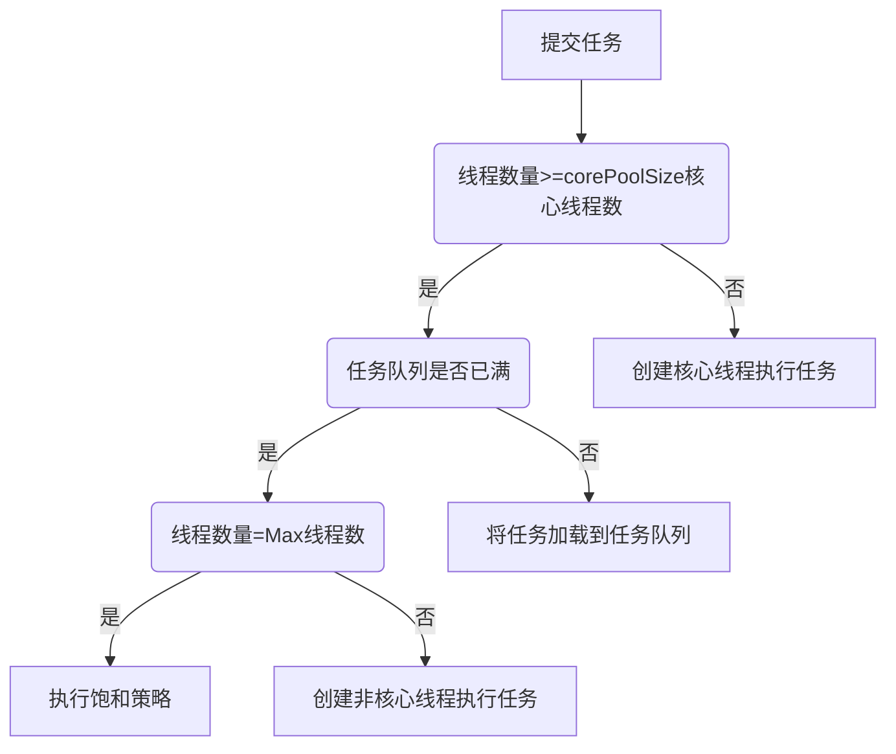

#   Android中的多线程

[TOC]

## 线程与进程
1、什么是进程
>1. 系统分配资源的最小单位
>2. 进程就是程序运行的实体

2、什么是线程
>1. 系统调度的最小单位
>2. 一个进程中可以包含多个线程
>3. 线程拥有各自的计数器、堆栈和局部变量等属性，能够访问共享的内存变量

3、线程的好处
>1. 比进程的资源消耗要小，效率要更高
>2. 多线程的并发性能减少程序的响应时间
>3. 多线程能简化程序的结构，使程序便于理解和维护

## 线程
4、线程的状态有哪些?

|状态|解释|备注|
|---|---|---|
|New|新创建状态|线程已被创建，还未调用start，做一些准备工作|
|Runnable|可运行状态|start之后进入，Runnable线程可能在运行也可能没有在运行，取决于系统分配的时间|
|Blocked|阻塞状态|线程被锁阻塞，暂时不活动|
|Waiting|等待状态|线程不运行任何代码，消耗最少的资源，直至调度器激活该线程|
|Timed Waiting|超时等待状态|与`Waiting`不同在于，可以在指定时间内返回|
|Terminated|终止状态|当前线程执行完毕：可能是run运行结束，或者出现未能捕获的异常导致线程终止|

5、创建线程的三种方法
>1. 继承Thread，重写run方法
>2. 实现Runnable接口，并实现该接口的run方法
>3. 实现Callable接口，重写call方法
>4. 推荐第二种`Runnable接口`的方法，因为继承Thread没有必要。

6、终止线程的两种方法
>1. 调用`Thread.interrupted()`设置中断标志位，并通过`Thread.currentThread().isInterrupted()`检查标志位。缺点：被中断的线程不一定会终止
>2. 在`run()`方法中设置boolean标志位(需要`volatile`修饰为易变变量)：条件满足时跳出循环，run运行结束，thread安全终止

## 同步
7、重入锁是什么？
>1. 重入锁ReentrantLock在Java SE 5.0引入
>2. 该锁支持一个线程对资源的重复加锁
>3. 一个线程在锁住锁对象后，其他任何线程都无法进入Lock语句
```java
  val mLock = ReentrantLock()
  mLock.lock()
  try {
      //需要同步的操作
  }finally {
      mLock.unlock() //finally中进行解锁，避免死锁问题
  }
```

8、条件对象/条件变量的作用
>1. 用于管理那些获得锁却因部分条件不满足而无法正常工作的线程
>2. 可以通过`newCondition`获得锁`lock`的条件变量
>3. 条件对象调用`await`方法，当前线程就会阻塞并且放弃该锁
>4. `await`线程会进入`阻塞状态`，直到另一个线程，调用同一条件对象的`signalAll()`方法，之后等待的所有线程通过竞争条件去抢锁
```java
        //1. 可重入锁
            val mLock = ReentrantLock()
            mLock.lock()
        //2. 条件变量
            val condition = mLock.newCondition()
            try {
                while(条件不满足){
        //3. await进入Block状态
                    condition.await()
                }
        //4. 条件满足方会进行后续操作
                        //...
        //5. 操作完成后调用同一条件变量的signalAll去激活等待该条件的线程
                condition.signalAll()
            }finally {
                mLock.unlock() //finally中进行解锁，避免死锁问题
            }
```

9、synchronized同步方法
>1. `Lock`和`condition`提供了高度的锁定控制，然而大多数情况下不需要这样麻烦
>2. 从Java 1.0开始，每个对象都有一个内部锁
>3. 当一个方法使用`synchronized`修饰，意味着线程必须获得内部锁，才能调用该方法
```java
synchronized public void doSth() throws InterruptedException{
    //1. 条件不满足，进入Block状态
    while(条件不满足){
        wait();
    }
    //2. 条件满足方会进行后续操作
        //...
    //3. 解除该锁，并通知所有阻塞的线程
    notifyAll();
}
```
>4. 备注：Kotlin学的不深，暂时没找到Kotlin中同步的方法，就用Java实现

10、同步代码块的使用和问题
>1. java中可以通过给一个Object对象上锁，来使用代码块
>2. 同步代码块非常脆弱不推荐
>3. 一般实现同步，最好使用`java.util.concurrent`包下提供的类，例如`阻塞队列`
```java
Object object = new Object();
synchronized (object){
    //进行处理, 不推荐使用
}
```

## Java中的volatile
11、 Java中的内存模型
>1. 堆内存被所有线程所共享: 会存在内存可见性问题
>2. 局部变量、方法定义的参数则不会再线程间共享：不存在内存可见性问题
>3. 线程共享的数据存在主存中，每个线程的本地内存中会存有这些共享数据的副本
>4. A、B线程之间数据通信，需要满足两个步骤：第一步线程A将本地更新过的共享数据刷新到主存中；第二步线程B到主存中读取已经刷新的最新共享数据

12、原子性是什么？
>1. 对基本数据类型变量的赋值和读取是原子性操作-要么不执行，要么不会被中断。
```java
  x = 3; //原子操作
  y = x; //非原子操作：复制，并且存储
  x++;  //非原子操作: 读取x，自加，存储
```
>2. `atomic`中很多类使用高效的机器级别指令来保证操作的原子性
>3. `AtomicInteger`的`incrementAndGet/decrementAndGet()`提供原子性自加/自减-可以作为共享计数器而无需同步
>4. `AtomicBoolean、AtomicLong、AtomicReference`等类也都是原子性操作
>5. 原子性操作类应该由开发并发工具的程序员使用，而不是应用程序员使用

13、可见性是什么？
>1. 可见性是指线程修改的状态能否立即对另一个线程可见
>2. `volatile`修饰的变量，在发生变化后会立即更新到主存，已保证共享数据的可见性

14、有序性是什么？
>1. Java中`编译器和处理器`能对指令的顺序重新排序，可不会影响单个线程执行的正确性，却无法保证多线程并发的正确性。`保证多线程并发的正确性`就需要保证`有序性`
>2.` volatile`能保证有序性
>3. `synchronized和Lock`也能保证有序性

15、volatile关键字的作用
>1. 能保证有序性：禁止指令重新排序，之前的指令不会在volatile之后执行，之后指令也不会在之前执行
>2. 保证可见性：更新的数据立即可见
>2. 不保证原子性

16、部分场景下使用volatile取代synchronized的要点
>1. `synchronized`能提供同步保护，却会影响性能。一定场景下可以用`volatile`替换
>2. `volatile`无法保证原子性，必须具备两个条件才可以替换
>3. 条件1:对变量的写操作不依赖于当前值(不能自增、自减)
>4. 条件2:该变量没有包含在具有其他变量的不等式中(例如,volatile a,b, 不等式a<b无法保证线程安全)
>5. 总结：变量独立于其他变量，也独立于自己本身之前的数值

17、使用volatile的典型场景
>1. 状态标志：如线程run方法中通过标志位判断是否终止线程，就比使用synchonized要简单和高效
>2. 双重检查模式(DCL): 应用于单例模式的getInstance保证实例唯一。DLC资源利用率高，第一次加载反应稍慢，在高并发情况下有一定缺陷

## 阻塞队列
18、什么是阻塞队列
>1. 阻塞队列常应用于生产者-消费者模型
>2. 阻塞队列需要满足：队列中没有数据时，消费者端的所有线程全部自动阻塞(挂起)
>3. 同时阻塞队列需要满足：队列中填满数据时，生产者端的所有线程都自动阻塞

19、阻塞队列(BlockingQueue)核心方法
>放入数据：
>1. offer(object)，可以存入，返回true；不可以存入，返回false。该方法不会阻塞当前线程
>2. put(Object), 阻塞队列有空间，则存入；没有空间，当前线程阻塞，直至阻塞队列有空间存放数据。
>获取数据：
>1. poll(time):从阻塞队列中将首位对象取出。若不能取出，再等待time的时间。取不到就返回null
>2. take():取走队列中首位数据。若队列为空，则当前线程阻塞，直到队列中有数据，并且返回该数据。
>3. drainTo(): 一次性取走所有可用数据。无需多次加锁操作，提高效率。

20、Java中7种阻塞队列的要点
|种类|特点|备注|
|---|---|---|
|ArrayBlockingQueue   |数组组成的有界阻塞队列   |默认不保证公平访问队列|
|LinkedBlockingQueue   |链表形式阻塞队列   |若构造时不指定队列缓存区大小，默认无穷大。一旦生产速度>消费速度，会导致内存耗尽|
|PriorityBlockingQueue   |支持优先级的无界队列，默认升序排列   |能通过`compareTo`方法和构造参数`comparator`对元素排序，但无法保证同级元素的顺序   |
|DelayQueue   |延时获取元素的无界阻塞队列   |每个元素必须实现Delayed接口，创建时指定元素到期时间，元素到期后才能取出   |
|SynchronousQueue   |不存储元素的阻塞队列   |   |
|LinkedTransferQueue   | 链表存储的Transfer队列  |   |
|LinkedBlockingDeque   | 链表双向阻塞队列  |可以从两端同时插入和删除，减少一半竞争   |

21、阻塞队列ArrayBlockingQueue实现原理
> 1. 内部维护一个Object类型的数组
> 2. lock所采用的可重入锁(ReentrantLock)

21、ArrayBlockingQueue的put()源码解析和要点
```java
/**
 *  存放数据
 *    1-有空间存放，就直接存入数据
 *    2-没有空间存放，当前线程阻塞到有多余空间，再存入
 */
public void put(E e) throws InterruptedException {
    Objects.requireNonNull(e);
    final ReentrantLock lock = this.lock;
    //1. 获取锁，并且是可中断的锁
    lock.lockInterruptibly();
    try {
        //2. 判断数组是否已满
        while (count == items.length){
            //3. 已满，条件变量(notFull)阻塞当前线程
            notFull.await();
        }
        //4. 未满，将元素插入数组
        enqueue(e);
    } finally {
        //5. 最后解锁
        lock.unlock();
    }
}
```

22、ArrayBlockingQueue的enqueue()源码解析和要点
```java
private void enqueue(E x) {
    //1. 在putIndex下标处放入元素
    final Object[] items = this.items;
    items[putIndex] = x;
    //2. 插入后若已经到数组尾部，则从头部开始(puIndex = 0)
    if (++putIndex == items.length) putIndex = 0;
    count++;
    //3. 解锁条件变量-notEmpty-唤醒正在等待获取元素的线程
    notEmpty.signal();
}
```

23、ArrayBlockingQueue的take()源码解析和要点
```java
/**
 *  取走队列中首位元素。
 *    1-队列为空，当前线程阻塞，直到队列中有数据，并且返回该数据
 */
public E take() throws InterruptedException {
    final ReentrantLock lock = this.lock;
    //1. 获得锁-可中断锁
    lock.lockInterruptibly();
    try {
        //2. 若队列为空，阻塞，直到队列中有数据
        while (count == 0)
            notEmpty.await();
        //3. 队列不为空，获取数据
        return dequeue();
    } finally {
        //4. 解锁
        lock.unlock();
    }
}
```

24、ArrayBlockingQueue的dequeue()源码解析和要点
```java
/**
 * 取出元素，仅仅在获得锁时被调用
 */
private E dequeue() {
    //1. 取出元素
    final Object[] items = this.items;
    @SuppressWarnings("unchecked")
    E x = (E) items[takeIndex];
    items[takeIndex] = null;
    if (++takeIndex == items.length) takeIndex = 0;
    count--;
    if (itrs != null)
        itrs.elementDequeued();
    //2. 激活等待notFull条件的线程
    notFull.signal();
    return x;
}
```

### 阻塞队列：消费者模型
25、非阻塞队列实现消费者模型源码：
```java
public class Main {
    private int queueSize = 10;
    private PriorityQueue<Integer> queue = new PriorityQueue(queueSize);
    public static void main(String args[]){
        Main main = new Main();
        Consumer consumer = main.new Consumer();
        consumer.start();
        Producer producer = main.new Producer();
        producer.start();
    }

    class Consumer extends Thread{
        @Override
        public void run() {
            while(true){
                synchronized (queue){
                    while(queue.size() == 0){
                        System.out.println("仓库中没有产品");
                        try {
                            queue.wait();
                        } catch (InterruptedException e) {
                            e.printStackTrace();
                            queue.notify();
                        }
                    }
                    Integer product = queue.poll();
                    System.out.println("消耗产品："+product);
                    queue.notify();
                }
            }
        }
    }

    class Producer extends Thread{
        int product = 0;
        @Override
        public void run() {
            while(true){
                synchronized (queue){
                    while(queue.size() == queueSize){
                        System.out.println("仓库已满");
                        try {
                            queue.wait();
                        } catch (InterruptedException e) {
                            e.printStackTrace();
                            queue.notify();
                        }
                    }
                    queue.offer(product);
                    System.out.println("生产产品："+product);
                    product++;
                    queue.notify();
                }
            }
        }
    }
}
```

26、阻塞队列实现消费者模型(核心代码)：
>使用阻塞队列就不需要处理锁，实现简单
```java
    private int queueSize = 10;
    private ArrayBlockingQueue<Integer> queue = new ArrayBlockingQueue(queueSize);

    class Consumer extends Thread{
        @Override
        public void run() {
            while(true){
                int product = -1;
                try {
                    product = queue.take();
                } catch (InterruptedException e) {
                    e.printStackTrace();
                }
                System.out.println("消耗产品："+product);
            }
        }
    }

    class Producer extends Thread{
        int product = 0;
        @Override
        public void run() {
            while(true){
                try {
                    queue.put(product);
                    System.out.println("生产产品："+product);
                    product++;
                } catch (InterruptedException e) {
                    e.printStackTrace();
                }
            }
        }
    }
}
```

## 线程池
27、什么是线程池？作用？
>1. 每个线程的创建/销毁都有一定开销，通过维护一定量线程的方法就可以减少这些开销，所以有`线程池`
>2. Java 1.5开始提供`Executor`框架用于把任务提交和任务处理解耦
>3. `Runnable`、`Callable`用于任务的提交
>4. `Executor`框架用于处理任务
>5. `Executor`框架核心是`ThreadPoolExecutor`-也就是线程池的核心实现类

28、ThreadPoolExecutor的作用
>1. `ThreadPoolExecutor`可以创建一个线程池
>2. 其构造方法最多有7个参数，作用如下图

|线程池参数|含义|作用|
|---|---|---|
|corePoolSize   |核心线程数   |若当前运行的线程数少于该值，则会创建新线程处理任务   |
|maximumPoolSize   |线程池允许创建的最大线程数   |若任务队列已满且线程数少于该值，则仍会创建新线程   |
|keepAliveTime   |非核心线程闲置的超时时间   |线程闲置时间若超过该时间则回收该线程。若任务很多，且执行时间都很短，提高该值可以提高线程利用率。`allowCoreThreadTimeOut`属性为True时，该值也会用于核心线程   |
|TimeUnit   |keepAliveTime的时间单位   |可以为DAYS\HOURS\MINUTES\SECONDS\MILLISECONDS   |
|workQueue|任务队列|若当前线程数>corePoolSize,将任务添加到任务队列。为`BlockingQueue`|
|ThreadFactory   |线程工厂   |可以用于给每个创建的线程设置名字。一般无需使用   |
|RejectedExecutionHandler   |饱和策略   |当任务队列和线程池都已满时，采用何种策略。默认是`AbordPolicy`-无法处理任务时，抛出异常   |
>3. 饱和策略参数：`CallerRunsPolicy`:调用者所在线程处理任务；`DiscardPolicy`:将不能执行的任务删除;`DiscardOldestPolicy`:丢弃队列最老的任务，并执行当前任务

29、线程池的处理流程和原理

>1. 任务队列中的任务，会在有核心/非核心线程空闲时，被取走并处理

30、线程池的4种常用种类
> 1. FixedThreadPool: 可重用固定线程数的线程池
> 2. CachedThreadPool: 根据需要创建线程的线程池
> 3. SingleThreadExecutor：使用单个工作线程的线程池
> 4. ScheduledThreadPool：能实现定时和周期性任务的线程池

31、FixedThreadPool的特点
> 1. 只有核心线程且数量固定，没有非核心线程数(corePoolSize=maximumPoolSize)
> 2. 多余的线程会被立即终止(keepAliveTime = 0L)
> 3. 任务队列使用无界阻塞队列(LinkedBlockingDeque)
> 4. 思路:当线程数达到corePoolSize时，就将任务存储在任务队列中，且等待空闲线程去执行

32、CachedThreadPool
> 1. 没有核心线程(corePoolSize = 0)
> 2. 非核心线程无限(maximumPoolSize = Integer.MAX_VALUE)
> 3. 空闲线程等待新任务时间为60s(keepAliveTime = 60L)
> 4. 阻塞队列采用`SynchronousQueue`-不存储元素的阻塞队列，每个线程插入操作必须等待另一个线程的移除操作，反之亦然。
> 5. 思路：每次提交的任务都会立即有线程去执行。线程一旦空闲，会等待60s。
> 6. 特点：适合大量需要立即处理，并且耗时较少的任务。

33、SingleThreadExecutor
> 1. 只有一个核心线程，没有非核心线程(corePoolSize=maximumPoolSize=1)
> 2. 其余参数和`FixedThreadPool`一致
> 3. 流程：新提交的任务，若没有核心线程则创建并执行该任务，若核心线程正在处理任务则将新任务提交至阻塞队列中，等待处理。
> 4. 特点：保证所有任务都在一个线程中按顺序处理。

34、ScheduledThreadPool(定时和周期性任务)
> 1. 核心线程数由corePoolSize决定
> 2. 阻塞队列使用无界的DelayedWorkQueue，因此没有非核心线程
> 3. 每个要执行的任务被包装成`ScheduledFutureTask`，放入任务队列。等待线程执行
> 4. DelayedWorkQueue会对任务进行排序，最需要执行的放在最前方。
> 5. 不同：任务执行后，会更改`ScheduledFutureTask`的time变量为下次执行的时间，并放回到队列中

## AsyncTask
35、AsyncTask是什么
> 1. Android系统的AsyncTask用于使得异步任务更加简单
> 2. AsyncTask是一个抽象的泛型类
> 3. 具有3个泛型参数：Params参数类型；Progress后台任务执行进度的类型；Result为返回结果的类型；不需要的参数用void即可
> 4. 具有4个核心方法：onPreExecute()、doInBackground(Params... params)、onProgresUpdate(Progress... value)、onPostExecute(Result result)
> 5. onPreExecute(): 主线程中，任务前的准备工作(对UI进行一些标记等)
> 6. doInBackground()：线程池中执行，在onPreExecute后执行耗时操作。过程中可以调用`publishProgress`更新进度
> 7. onProgresUpdate: 主线程中，调用`publishProgress`后，会将进度更新在UI上
> 8. onPostExecute: 主线程中，任务执行完成后的收尾工作，result值就是doInBackground最后返回的值

36、AysncTask Android3.0之前的特点
> 1. 内部的ThreadPoolExecutor：核心线程数5个，最大线程数量128，非核心线程等待时间1s，采用阻塞队列`LinkedBlockingQueue`容量为10.
> 2. 缺点：AynsncTask最多能同时容纳138个任务(128+10)，超过后会抛出`RejectedExecutionException`异常

37、AysncTask Android7.0版本
> 1. 在AysncTask中使用了线程池，在线程池中运行线程，并且又用到了阻塞队列
> 2. Android3.0及以上版本使用`SerialExecutor`作为默认的线程，会将任务串行的处理，保证一个时间段只有一个任务在执行。不会再出现之前的缺点。
> 3. Android 3.0之前的是并行处理的
> 4. 在3.0及以上版本中，也可以使用并行处理`asyncTask.executeOnExecutor(Asynctask.THREAD_POOL_EXECUTOR, "")`
> 5. THREAD_POOL_EXECUTOR就是采用以前的threadPoolExecutor，但核心线程数和最大线程数由CPU的核数计算得到，阻塞队列依旧是`LinkedBlockingQueue`且容量提升到`128`
> 6. 当然也可以在`.executeOnExecutor`中传入其他几种线程池

38、AysncTask的优点
> 优点：简单，快捷，过程可控

39、AysncTask的缺点
> 1. 生命周期：Activity中的AsyncTask不会随Acitivity的销毁而销毁。AsyncTask会一直运行到`doInBackground()`方法执行完毕，然后会执行`onPostExecute()`方法。如果Acitivity销毁时，没有执行`onCancelled()`，AysncTask在结束后操作UI时出现崩溃
> 2. 内存泄漏：如果AsyncTask被声明为Acitivity的非静态的内部类，会拥有Activity的引用。在Acitivity已经被销毁后，AsyncTask后台线程仍在执行，则会导致Acitivity无法被回收，造成内存泄漏。
> 3. 结果丢失: 屏幕旋转或Acitivity在后台被系统杀掉等情况下，Acitivity会重新创建。之前运行的AsyncTask持有的Acitivity引用会失效，导致更新UI的操作无效。
> 4. 并行还是串行：1.6之前，AsyncTask是串行的；在1.6至2.3版本，AsyncTask是并行的；在3.0及以上版本中，AsyncTask支持串行和并行(默认串行)-execute()方法就是串行执行，executeOnExecutor(Executor)就是并发执行

40、AysncTask的流程
<!--  -->
```sequence
AsyncTask->AsyncTask: 1.execute
AsyncTask->AsyncTask: 2.直接调用executeOnExecutor
AsyncTask->AsyncTask: 3.onPreExecute
AsyncTask->AsyncTask.THREAD_POLL_EXECUTOR: 4.executor.execute(mFuture)
AsyncTask.THREAD_POLL_EXECUTOR->AsyncTask.mFureTask(FutureTask): 5.run()
AsyncTask.mFureTask(FutureTask)->AsyncTask.mWorker(Callback): 6.call
AsyncTask.mWorker(Callback)->AsyncTask: 7.doInBackground
AsyncTask.mWorker(Callback)->AsyncTask: 8.postResult-发送出MSG:MESSAGE_POST_RESULT
AsyncTask->AsyncTask: 9.handleMessage
AsyncTask->AsyncTask: 10.finish()
AsyncTask->AsyncTask: 11.onCancelled/OnPostExecute

```

#参考资料
AsyncTask的缺陷和问题：http://blog.csdn.net/goodlixueyong/article/details/45895997
AsyncTask的解析：https://www.cnblogs.com/yanyojun/archive/2017/02/20/6414919.html
