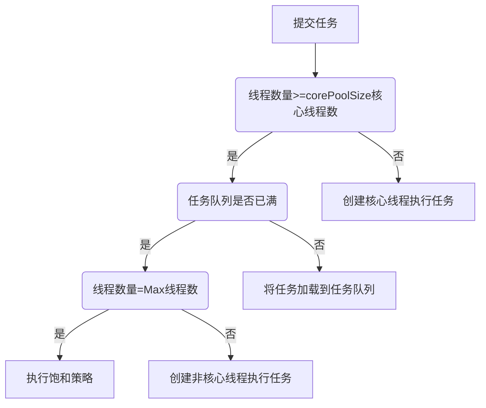

#Android知识点汇总大全
@Auhtor: feather
@Tel: QQ975559549

[TOC]

# View的事件体系(45题)
包括：View的滑动、事件分发和滑动冲突
链接：http://blog.csdn.net/feather_wch/article/details/78955689

## 1-View基础
1、什么是View
> 1. View是所有控件的基类
> 2. View有一个特殊子类ViewGroup，ViewGroup能包含一组View，但ViewGroup的本身也是View。
> 3. 由于View和ViewGourp的存在，意味着View可以是单个控件也可以是一组控件。这种结构形成了View树。

2、View的位置参数：top,left,right,bottom
>1. top-左上角的y轴坐标(全部是相对坐标，相对于父容器)
>2. left-左上角的x轴坐标
>3. right-右下角的x轴坐标
>4. bottom-右下角的y轴坐标
>5. 在View中获取这些成员变量的方法，是getLeft(),getRight(),getTop(),getBottom()即可

3、View从3.0开始新增的参数：x,y,translationX,translationY
>1. x,y是View当前左上角的坐标
>2. translationX,translationY是在滑动/动画后，View当前位置和View最原始位置的距离。
>3. 因此得出等式：x(View左上角当前位置) = left(View左上角初始位置) + translationX(View左上角偏移的距离)
>4. View平移时top、left等参数不变，改变的是x,y,tranlsationX和tranlsationY

4、MotionEvent包含的手指触摸事件
>1. ACTION_DOWN\MOVE\UP对应三个触摸事件。
>2. getX/getY能获得触摸点的坐标，相当于当前View左上角的(x,y)
>3. getRawX/getRawY，获得触摸点相当于手机左上角的(x,y)坐标

5、TouchSlop是什么？
>1. 是一个常量，是滑动的最小距离，低于该值则认为没有滑动。该值与设备相关。
>2. 通过`ViewConfiguration.get(getBaseContext()).scaledTouchSlop`能获得该值，在两次滑动距离小于该值时可以判断未滑动，以提高用户体验。

6、VelocityTracker的作用和使用
>作用： 速度追踪：手指滑动中水平和竖直方向的速度
>使用：
>1. 在View的onTouchEvent中追踪当前点击事情的速度
>2. 通过VelocityTracker的computeCurrentVelocity方法先计算速度
>3. 再获取VelocityTracker的xVelocity/yVelocity获取速度
>4. 速度是指：在给定时间内手机滑过的像素数，如果从右到左，就是负值(例如1000ms内速度为100，就是在1s内滑过100个像素)
>5. 使用完毕时需要调用clear和recycle方法进行清理并回收内存

7、VelocityTracker代码如下
```kotlin
        //追踪速度
        val velocityTracker = VelocityTracker.obtain()
        velocityTracker.addMovement(event)

        //获取当前速度，但必须在获取前进行速度计算
        velocityTracker.computeCurrentVelocity(1000)
        val xVelocity = velocityTracker.xVelocity
        val yVelocity = velocityTracker.yVelocity

        velocityTracker.clear()
        velocityTracker.recycle()
```

8、GestureDetector作用
>手势检测，用于检测用户的单机，滑动，长按，双击等行为。

9、GestureDetector的使用步骤
>1. 创建GestureDetector对象，并实现OnGestureListener接口
>2. 接管目标View的onTouchEvent方法
>3. 之后可以选择性实现OnGestureListener接口和OnDoubleTapListener中的方法

10、GestureDetector的使用代码
```
class CustomView @JvmOverloads constructor(
        context: Context, attrs: AttributeSet? = null, defStyleAttr: Int = 0
) : View(context, attrs, defStyleAttr) {

//创建GestureDetector对象，并实现OnGestureListener接口
    val mGestureDetector: GestureDetector
        get() = GestureDetector(myGestureListener)
    val myGestureListener = MyGestureListener()

//自定义类实现OnGestureListener接口
    class MyGestureListener: GestureDetector.OnGestureListener {
        override fun onShowPress(p0: MotionEvent?) {
            Log.i("CustomeView", "onShowPress")
        }

        override fun onSingleTapUp(p0: MotionEvent?): Boolean {
            Log.i("CustomeView", "onSingleTapUp")
            return true
        }

        override fun onDown(p0: MotionEvent?): Boolean {
            Log.i("CustomeView", "onDown")
            return true
        }

        override fun onFling(p0: MotionEvent?, p1: MotionEvent?, p2: Float, p3: Float): Boolean {
            Log.i("CustomeView", "onFling")
            return true
        }

        override fun onScroll(p0: MotionEvent?, p1: MotionEvent?, p2: Float, p3: Float): Boolean {
            Log.i("CustomeView", "onScroll")
            return true
        }

        override fun onLongPress(p0: MotionEvent?) {
            Log.i("CustomeView", "onLongPress")
        }
    }

//接管onTouchEvent方法
    override fun onTouchEvent(event: MotionEvent?): Boolean {
        return mGestureDetector.onTouchEvent(event)
    }
}
```

11、Scroller作用
>1. 通过View的scrollTo/scrollBy方法实现的滑动是瞬间完成，没有过渡效果导致用户体验很差。这就需要Scroller

12、坐标系的种类和区别
>1. 坐标系分为Android坐标系和视图View坐标系
>2. Android坐标系以屏幕左上角为原点，向右X轴为正半轴，向下Y轴为正半轴
>3. View坐标系是以当前视图的父视图的左上角作为原点建立的坐标系，方向和Android坐标系一致
>4. 触摸事件中getRawX()和getRawY()获得的就是Android坐标系的坐标
>5. 触摸事件中getX()和getY()获得的就是视图坐标系中的坐标

## 2-View的滑动

13、View滑动的三种方法：
>1. 通过View本身的scrollTo/scrollBy进行滑动
>2. 通过动画给View施加平移效果实现华东
>3. 通过改变View的LayoutParams是的View重新布局从而实现滑动

14、scrollTo和scrollBy
>1. View提供的scrollTo方法，实现了基于参数的绝对滑动——直接到新的x,y坐标处
>2. scrollBy内部是调用scrollTo，实现了基于当前位置的相对滑动

15、scrollTo/By内部的mScrollX和mScrollY的意义
>1. mScrollX的值，相当于手机屏幕相对于View左边缘向右移动的距离，手机屏幕向右移动时，mScrollX的值为正；手机屏幕向左移动(等价于View向右移动)，mScrollX的值为负。
>2. mScrollY和X的情况相似，手机屏幕向下移动，mScrollY为+正值；手机屏幕向上移动，mScrollY为-负值。
>3. mScrollX/Y是根据第一次滑动前的位置来获得的，例如：第一次向左滑动200(等于手机屏幕向右滑动200)，mScrollX = 200；第二次向右滑动50, mScrollX = 200 + （-50）= 150，而不是（-50）。

16、动画实现滑动的方法
>1. 可以通过传统动画或者属性动画的方式实现
>2. 传统动画需要通过设置fillAfter为true来保留动画后的状态(但是无法在动画后的位置进行点击操作，这方面还是属性动画好)
>3. 属性动画会保留动画后的状态，能够点击

17、改变布局参数实现滑动
>1. 通过父控件设置View在父控件的位置，但需要指定父布局的类型，不好
>2. 用ViewGroup的MariginLayoutParams的方法去设置margin

18、布局参数实现滑动代码如下：
```
//方法三：通过布局设置在父控件的位置。但是必须要有父控件, 而且要指定父布局的类型，不好的方法。
RelativeLayout.LayoutParams layoutParams = (RelativeLayout.LayoutParams) getLayoutParams();
layoutParams.leftMargin = getLeft() + offsetX;
layoutParams.topMargin = getTop() + offsetY;
setLayoutParams(layoutParams);

//方法四：用ViewGroup的MarginLayoutParams的方法去设置marign
// 相比于上面方法, 就不需要知道父布局的类型。
// 缺点：滑动到右侧控件会缩小
ViewGroup.MarginLayoutParams mlayoutParams = (ViewGroup.MarginLayoutParams) getLayoutParams();
mlayoutParams.leftMargin = getLeft() + offsetX;
mlayoutParams.topMargin = getTop() + offsetY;
setLayoutParams(mlayoutParams);
```

19、三种滑动方式的优缺点：
>1. scrollTo/scrollBy: 操作简单，适合对View内容的滑动
>2. 动画：操作简单，主要适用于没有交互的View和实现复杂的动画效果
>3. 改变参数布局：操作稍微复杂，适合有交互的View

## 3-弹性滑动
20、Scroller的用法：
```kotlin
//Scroller进行初始化
    val mScroller: Scroller
        get() = Scroller(context)
//滑动到X,Y
    fun smoothScrollTo(destX: Int, destY: Int){
        val deltaX = destX - scrollX
        val deltaY = destY - scrollY
        //1000ms内向坐标滑动
        mScroller.startScroll(scrollX, scrollY, deltaX, deltaY, 100)
        invalidate()
    }
//重载
    override fun computeScroll() {
        //Scroller判断是否执行完毕
        if(mScroller.computeScrollOffset()){
            //通过父控件进行当前视图的滑动
            (parent as View).scrollTo(mScroller.currX, mScroller.currY)
            //通过重绘来不断调用computeScroll
            invalidate()
        }
    }
```

21、Scroller方法要点解析
>1. 调用startScroll方法时，Scroller只是单纯的保存参数
>2. 之后的invalidate方法导致的View重绘
>3. View重绘之后draw方法会调用自己实现的computeScroll()，才真正实现了滑动

22、Scroller工作原理
>1. Scroller本身不能实现View的滑动，需要配合View的computeScroll方法实现弹性滑动
>2. 不断让View重绘，每一次重绘距离华东的开始时间有一个时间间隔，通过该时间可以得到View当前的滑动距离
>3. View的每次重绘都会导致View的小幅滑动，多次小幅滑动就组成了弹性滑动

23、通过动画实现弹性滑动

5、通过延时策略实现弹性滑动。
>1. 通过handler、View的postDelayed、或者线程的sleep方法。

## 4-View的事件分发机制

24、事件分发
>1. 点击事件的对象就是MotionEvent，因此事件的分发，就是MotionEvent的分发过程，
>2. 点击事件有三个重要方法来完成：dispatchTouchEvent、onInterceptTouchEvent和onTouchEvent

25、dispatchTouchEvent的作用
>1. 用于进行事件的分发
>2. 只要事件传给当前View，该方法一定会被调用
>3. 返回结果受到当前View的onTouchEvent和下级View的dispatchTouchEvent影响
>4. 表示是否消耗当前事件

26、onInterceptTouchEvent的作用
>1. 在dispatchTouchEvent的内部调用，用于判断是否拦截某个事件
>2.

27、onTouchEvent的作用
>1. 在dispatchTouchEvent的中调用，用于处理点击事件
>2. 返回结果表示是否消耗当前事件

28、事件的传递规则：
>1. 点击事件产生后，会先传递给根ViewGroup，并调用dispatchTouchEvent
>2. 之后会通过onInterceptTouchEvent判断是否拦截该事件，如果true，则表示拦截并交给该ViewGroup的onTouchEvent方法进行处理
>3. 如果不拦截，则当前事件会传递给子元素，调用子元素的dispatchTouchEvent，如此反复直到事件被处理

29、View处理事件的优先级
>1. 在View需要处理事件时，会先调用OnTouchListener的onTouch方法，并判断onTouch的返回值
>2. 返回true，表示处理完成，不会调用onTouchEvent方法
>3. 返回false，表示未完成，调用onTouchEvent方法进行处理
>4. 可见，onTouchEvent的优先级没有OnTouchListener高
>5. 平时常用的OnClickListener优先级最低，属于事件传递尾端

30、点击事件传递过程遵循如下顺序：
>1. Activity->Window->View->分发
>2. 如果View的onTouchEvent返回false，则父容器的onTouchEvent会被调用，最终可以传递到Activity的onTouchEvent

31、事件传递规则要点
>1. View一旦拦截事件，则整个事件序列都由它处理(ACTION_DOWN\UP等)，onInterceptTouchEvent不会再调用(因为默认都拦截了)
>2. 但是一个事件序列也可以通过特殊方法交给其他View处理(onTouchEvent)
>3. 如果View开始处理事件(已经拦截)，如果不消耗ACTIO_DOWN事件(onTouchEvent返回false)，则同一事件序列的剩余内容都直接交给父onTouchEvent处理
>4. View消耗了ACTION_DOWN，但不处理其他的事件，整个事件序列会消失(父onTouchEvent)不会调用。这些消失的点击事件最终会传给Activity处理。
>5. ViewGroup默认不拦截任何事件(onInterceptTouchEvent默认返回false)
>6. View没有onInterceptTouchEvent方法，一旦有事件传递给View，onTouchEvent就会被调用
>7. View的onTouchEvent默认都会消耗事件return true, 除非该View不可点击(clickable和longClickable同时为false)
>8. View的enable属性不影响onTouchEvent的默认返回值。即使是disable状态。
>9. onClick的发生前提是当前View可点击，并且收到了down和up事件
>10. 事件传递过程是由父到子，层层分发，可以通过requestDisallowInterceptTouchEvent让子元素干预父元素的事件分发(ACTION_DOWN除外)

32、Activity事件分发的过程
>1. 事件分发过程：Activity->Window->Decor View(当前界面的底层容器，setContentView的View的父容器)->View
>2. Activity的dispatchTouchEvent，会交给Window处理(`getWindow().superDispatchTouchEvent()`)，
>3. 返回true：事件全部结束
>4. 返回false：所有View都没有处理(onTouchEvent返回false)，则调用Activity的onTouchEvent

33、Window事件分发
>1. Window和superDispatchTouchEvent分别是抽象类和抽象方法
>2. Window的实现类是PhoneWindow
>3. PhoneWindow的`spuerDispatchTouchEvent()`直接调用`mDecor.spuerDispatchTouchEvent()`,也就是直接传给了DecorView

34、DecorView的事件分发
>1. DecorView继承自FrameLayout
>2. 作为setContentView的父View，事件会传递给顶层根View(一般都是ViewGroup)

35、根View的事件分发
>1. 顶层View调用dispatchTouchEvent
>2. 调用onInterceptTouchEvent方法
>3. 返回true，事件由当前View处理。如果有onTouchiListener，会执行onTouch，并且屏蔽掉onTouchEvent。没有则执行onTouchEvent。如果设置了onClickListener，会在onTouchEvent后执行onClickListener
>4. 返回false，不拦截，交给子View重复如上步骤。

36、ViewGroup的dispatchTouchEvent解析
>1. 当事件ACTION_DOWN || mFirstTouchTarget != null（不拦截事件并传递给子元素处理）时需要判断是否拦截——(也就是在ACTION_DOWN时才判断是否拦截，ACTION_DOWN无论是否拦截，都会导致后续都不需要判断了)
>2. 但是存在特殊情况(子View会通过requestDisallowInterceptTouchEvent设置FLAG_DISALLOW_INTERCEPT标志位)，一旦设置ViewGroup将只能拦截ACTION_DOWN
>3. 因为ACTION_DOWN到来时会重置状态，`FLAG_DISALLOW_INTERCEPT`也会被重置, 因此依旧总是调用自己的onInterceptTouchEvent方法(判断是否拦截)。

37、Viewgroup不拦截事件时，事件下发给子View处理的逻辑：
>1. 遍历所有子元素，并判断是否能接受点击事件，以及点击事件坐标是否在子元素内。
>2. 如果能接受点击事件，调用dispatchTransformedTouchEvent方法，内部就是调用了子元素的dispatchTouchEvent方法。

38、View对点击事件的处理过程(不包括ViewGroup)


## 5-View的滑动冲突
39、滑动冲突的三种场景
>1. 内层和外层滑动方向不一致：一个垂直，一个水平
>2. 内存和外层滑动方向一致：均垂直or水平
>3. 前两者层层嵌套

40、 滑动冲突处理原则
>1. 对于内外层滑动方向不同，只需要根据滑动方向来给相应控件拦截
>2. 对于内外层滑动方向相同，需要根据业务来进行事件拦截
>3. 前两者嵌套的情况，根据前两种原则层层处理即可。

41、 滑动冲突解决办法
>1. 外部拦截：在父容器进行拦截处理，需要重写父容器的onInterceptTouchEvent方法
>2. 内部拦截：父容器不拦截任何事件，事件都传递给子元素。子元素需要就处理，否则给父容器处理。需要配合`requestDisallowInterceprtTouchEvent`方法。

42、外部拦截法要点
>1. 父容器的`onInterceptTouchEvent`方法中处理
>2. ACTION_DOWN不拦截，一旦拦截会导致后续事件都直接交给父容器处理。
>3. ACTION_MOVE中根据情况进行拦截，拦截：return true，不拦截：return false（外部拦截核心）
>4. ACTION_UP不拦截，如果父控件拦截UP，会导致子元素接收不到UP进一步会让onClick方法无法触发。此外UP拦截也没什么用。

43、内部拦截法要点
>1. 子View的`dispatchTouchEvent`方法处理
>2. ACTION_DOWN，让父容器不拦截(也不能拦截，否则会导致后续事件都无法传递到子View)-`parent.requestDisallowInterceptTouchEvent(true)`
>3. ACTION_MOVE,如父容器需要该事件，则父容器拦截requestDisallowInterceptTouchEvent(false)
>4. ACTION_UP，无操作，正常执行

44、内部拦截Kotlin代码
```kotlin
class CustomHorizontalScrollView(context: Context,
                                 attrs: AttributeSet?,
                                 defStyleAttr: Int,
                                 defStyleRes: Int): HorizontalScrollView(context, attrs, defStyleAttr, defStyleRes){
  //构造器
    constructor(context: Context): this(context, null, 0, 0)
    constructor(context: Context, attrs: AttributeSet?): this(context, attrs, 0, 0)
    constructor(context: Context, attrs: AttributeSet?, defStyleAttr: Int): this(context, attrs, defStyleAttr, 0)

    var downX: Int = 0
    var downY: Int = 0
  //拦截处理
    override fun onInterceptTouchEvent(ev: MotionEvent): Boolean {
        var intercepted = super.onInterceptTouchEvent(ev)
        when(ev.action){
	//不拦截
            ACTION_DOWN -> {
                downX = ev.x.toInt()
                downY = ev.y.toInt()
                intercepted = false
            }
	//判断是否拦截
            ACTION_MOVE -> {
                val curX = ev.x.toInt()
                val curY = ev.y.toInt()
                //水平滑动进行拦截
                if(Math.abs(curX - downX) > Math.abs(curY - downY)){
                    intercepted = true
                }
            }
	//不拦截
            ACTION_UP -> intercepted = false
            else -> null
        }
        return intercepted
    }
}

```

45、外部拦截，自定义ScrollView
```kotlin
class CustomScrollView(context: Context,
                       attrs: AttributeSet?,
                       defStyleAttr: Int,
                       defStyleRes: Int): ScrollView(context, attrs, defStyleAttr, defStyleRes) {

    constructor(context: Context) : this(context, null, 0, 0)
    constructor(context: Context, attrs: AttributeSet?) : this(context, attrs, 0, 0)
    constructor(context: Context, attrs: AttributeSet?, defStyleAttr: Int) : this(context, attrs, defStyleAttr, 0)

    var lastX: Int = 0
    var lastY: Int = 0

    override fun dispatchTouchEvent(ev: MotionEvent): Boolean {

        val curX = ev.x.toInt()
        val curY = ev.y.toInt()

        when(ev.action){
            ACTION_DOWN -> {
                parent.requestDisallowInterceptTouchEvent(true)
            }
            ACTION_MOVE -> {
                //如果是水平滑动则交给父容器处理
                if(Math.abs(curX - lastX) > Math.abs(curY - lastY)){
                    parent.requestDisallowInterceptTouchEvent(false)
                }
            }
            ACTION_UP -> null
            else -> null
        }
        lastX = curX
        lastY = curY
        return super.dispatchTouchEvent(ev)
    }
}
```

# View的工作原理和自定义View(36题)
包括：View的三大流程、自定义View
链接：http://blog.csdn.net/feather_wch/article/details/79080571

## 1-ViewRoot和DecorView

1、ViewRoot是什么？
>1. ViewRoot对应于ViewRootImpl类
>2. 是连接WindowManager和DecorView的纽带
>3. View的三大流程(测量、布局、绘制)均通过ViewRoot完成
>4. Activity对象在ActivityThread中创建完毕后，会将DecorView添加到Window中，同时会创建ViewRootImpl，并将ViewRootImpl和DevorView建立关联
>过程代码如下：
>```Java
>root = new ViewRootImpl(view.getContext(), display)
>root.setView(view, wparams, panelParentView)
>```

2、ViewRoot如何完成View的三大流程？
>1. ViewRoot的`performTraversals()`开始View的绘制流程，依次调用`performMeasure()`、`performLayout()`和`performDraw()`
>2. performMeasure()最终执行父容器的measure()方法，并依此执行所有子View的measure方法。
>3. performLayout()和performDraw()同理

3、View三大流程的作用
>1. measure决定了View的宽/高，测量后可以通过`getMeasuredWidth/Height`来获得View测量后的宽/高，除特殊情况外该值等于View最终的宽/高
>2. layout决定了View的顶点坐标以及实际View的宽/高：完成后可以通过`getTop/Bottom/Left/Right`获取顶点坐标，并通过`getWidth/Height()`获得View的最终宽/高
>3. draw决定了View的显示，最终将View显示出来

4、DecorView的作用
>1. DecorView是顶级View，本质就是一个FrameLayout
>2. 包含了两个部分，标题栏和内容栏
>3. 内容栏id是content，也就是activity中setContentView所设置的部分，最终将布局添加到id为content的FrameLayout中
>4. 获取content：`ViewGroup content = findViewById(R.android.id.content)`
>5. 获取设置的View：`content.getChidlAt(0)`

## 2-MeasureSpec

5、MeasureSpec是什么？
>1. MeasureSpec是一种“测量规则”或者“测量说明书”，决定了View的测量过程
>2. View的MeasureSpec会根据自身的LayoutParamse和父容器的MeasureSpec生成。
>3. 最终根据View的MeasureSpec测量出View的宽/高(测量时数据并非最终宽高)

6、MeasureSpec要点解析
>1. MeasureSpec代表一个32位int值，高2位是SpecMode，低30位是SpecSize
>2. SpecMode是指测量模式
>3. SpecSize是指在某种测量模式下的大小
>4. 类MesaureSpec提供了用于SpecMode和SpecSize打包和解包的方法

7、测量模式SpecMode的类型
>1. UNSPECIFIED：父容器不对View有任何限制，一般用于系统内部
>2. EXACTLY：精准模式，View的最终大小就是SpecSize指定的值（对应于LayoutParams的match_parent和具体的数值）
>3. AT_MOST：最大值模式，大小不能大于父容器指定的值SpecSize(对应于wrap_content)

8、MeasureSpec和LayoutParams的对应关系
>1. View的MeasureSpec是需要通过`自身的LayoutParams`和`父容器`一起才能决定
>2. DecorView(顶级View)是例外，其本身MeasureSpec由`窗口尺寸`和`自身LayoutParams`共同决定
>3. MeasureSpec一旦确定，onMeasure中就可以确定View的测量宽/高

9、普通View的Measure的创建规则
>1. View本身布局参数为具体dp/px数值，模式：EXACTLY，尺寸：自身尺寸(不管父容器的MeasureSpec)
>2. View为match_parent， 模式：EXACTLY/AT_MOST由父容器MeasureSpec决定，尺寸：父容器目前可用大小
>3. View为wrap_content，模式：AT_MOST,尺寸：父容器可用尺寸(不能超过该尺寸)
>4. 当父容器为UNSPECIFIED时，View为具体数值时规则不变；其余match_parent/wrap_content，模式均为：UNSPECIFIED，尺寸：0
>5. UNSPECIFIED一般用于系统内部多次measure的情况，不需要关注该模式。

## 3-View的工作流程
10、View的工作流程以及具体的功能
>1. measure：测量——确定View的测量宽/高
>2. layout：布局——确定View的最终宽/高和四个顶点的位置
>3. draw：绘制——将View绘制到屏幕上

11、View工作流程的入口
>1. Activity调用startActivity方法，最终会调用ActivityThread的handleLaunchActivity方法
>2. handleLaunchActivity会调用performLauchActivity方法(会调用Activity的onCreate，并完成DecorView的创建)和handleResumeActivity方法
>3. handleResumeActivity方法会做四件事：performResumeActivity(调用activity的onResume方法)、getDecorView(获取DecorView)、getWindowManager(获取WindowManager)、WindowManager.addView(decor, 1)
>4. WindowManager.addView(decor, 1)本质是调用WindowManagerGlobal的addView方法。其中主要做两件事：1、创建ViewRootImpl实例 2、root.setView(decor, ....)将DecorView作为参数添加到ViewRoot中，这样就将DecorView加载到了Window中
>5. ViewRootImpl还有一个方法performTraveals方法，用于让ViewTree开始View的工作流程：其中会调用performMeasure/Layout/Draw()三个方法,分别对应于View的三大流程。

### 1-measure过程
12、View的measure过程及要点
>1. View的measure方法是final类型方法——表明该方法无法被重载
>2. View的measure方法会调用onMeasure方法，onMeasure会调用setMeasuredDimension方法设置View宽/高的测量值

13、View的onMeasure源码要点
```Java
protected void onMeasure(int widthMeasureSpec, int heightMeasureSpec) {
        //1. setMeasuredDimension方法设置View宽/高的测量值
        setMeasuredDimension(
                //2. 第一个参数是获得的测量宽/高(通过getDefaultSize获取)
                getDefaultSize(getSuggestedMinimumWidth(),  //3. 获取的建议最小的宽/高
                                    widthMeasureSpec),
                getDefaultSize(getSuggestedMinimumHeight(),
                                    heightMeasureSpec));
}
```
>1. setMeasuredDimension方法设置View宽/高的测量值（测量值通过getDefaultSize获取）
>2. getDefaultSize用于获取View的测量宽/高

14、View的getDefaultSize源码要点
>```java
>    //1. 获取View宽和高的测量值
>    public static int getDefaultSize(int size, int measureSpec) {
>        int result = size;
>        int specMode = MeasureSpec.getMode(measureSpec);
>        int specSize = MeasureSpec.getSize(measureSpec);
>
>        switch (specMode) {
>        //2. UNSPECIFIED模式时，宽/高为第一个参数也就是getSuggestedMinimumWidth()获取的建议最小值
>        case MeasureSpec.UNSPECIFIED:
>            result = size;
>            break;
>        //3. AT_MOST(wrap_content)和EXACTLY(match_parent/具体值dp等)这两个模式下，View宽高的测量值为当前View的MeasureSpec(测量规格)中指定的尺寸specsize
>        case MeasureSpec.AT_MOST:
>        case MeasureSpec.EXACTLY:
>            result = specSize;
>            break;
>        }
>        return result;
>    }
>```

15、View的getSuggestedMinimumWidth/Height()源码要点
```java
//获取建议的最小宽度
protected int getSuggestedMinimumWidth() {
        return (mBackground == null) ? mMinWidth : max(mMinWidth, mBackground.getMinimumWidth());
}
```
>1. 如果View没有背景，View的最小宽度就为`android:minWidth`这个参数指定的值(mMinWidth),没有指定则默认为0
>2. 如果View有背景，会从mMinWidth和背景的最小宽度中取最大值。
>3. 背景的最小宽度(getMinimumWidth())本质就是Drawable的原始宽度(ShapeDrawable无原始宽度,BitmapDrawable有原始宽度——图片的尺寸)

16、View的wrap_content和match_parent效果一致的原因分析
>1. 根据View的onMeasure方法中的getDefaultSize方法，我们可以发现在两种模式下，View的测量值等于该View的测量规格MeasureSpec中的尺寸。
>2. View的MeasureSpec本质是由自身的LayoutParams和父容器的MeasureSpec决定的。
>3. 当View为wrap_content时，该View的模式为AT_MOST，且尺寸specSize为父容器的剩余空间大小。
>4. 当View为match_parent时，该View的模式跟随父容器的模式(AT_MOST/EXACTLY), 且尺寸specSize为父容器的剩余空间大小。
>5. 因此getDefaultSize中无论View是哪种模式，最终测量宽/高均等于尺寸specSize，因此两种属性效果是完全一样的(View的大小充满了父容器的剩余空间)
>6. 除非给定View固定的宽/高，View的specSize才会等于该固定值。

17、自定义View需要重写onMeasure方法，并写明两种模式的处理方法
```java
    //1. 重写onMeasure，特殊处理wrap_content的情况
    protected void onMeasure(int widthMeasureSpec, int heightMeasureSpec) {
        super.onMeasure(widthMeasureSpec, heightMeasureSpec);
        int widthSpecMode = MeasureSpec.getMode(widthMeasureSpec);
        int widthSpecSize =  MeasureSpec.getSize(widthMeasureSpec);
        int heightSpecMode = MeasureSpec.getMode(heightMeasureSpec);
        int heightSpecSize =  MeasureSpec.getSize(heightMeasureSpec);

        if(widthSpecMode == MeasureSpec.AT_MOST && heightSpecMode == MeasureSpec.AT_MOST){
            //2. 均为wrap_content时, 将值设置为android:minWidth/Height属性指定的值
            setMeasuredDimension(mWidth, mHeight);
        }else if(widthSpecMode == MeasureSpec.AT_MOST){
            //3. 哪个为wrap_content哪个就用android:minXXX属性给定的最小值
            setMeasuredDimension(mWidth, heightSpecSize);
        }else if(heightSpecMode == MeasureSpec.AT_MOST){
            setMeasuredDimension(widthSpecSize, mHeight);
        }
    }
```

18、ViewGroup(抽象类)的measure流程
>1. ViewGroup没有onMeasure方法，只定义了measureChildren方法(onMeasure根据不同布局难以统一)
>2. measureChildren中遍历所有子元素并调用measureChild方法
>3. measureChild方法中会获取子View的MeasureSpec，然后调用子元素View的measure方法进行测量

19、getChildMeasureSpec获取子元素MeasureSpec的要点
>1. 子View的MeasureSpec是根据自身的LayoutParams和父容器SpecMode生成
>2. 当子View的布局参数为wrap_content，且父容器模式为AT_MOST时，效果与子元素布局为match_parent是一样的。因此当子View的布局参数为wrap_content时，需要指定默认的宽/高

20、LinearLayout的onMeasure()分析
>1. ViewGroup因为布局的不同，无法统一onMeasure方法，具体内容根据布局的不同而不同，这里直接以LinearLayout进行分析
>2. onMeasure会根据`orientation`选择measureVertical或者measureHorizontal进行测量
>3. measureVertical本质是遍历子元素，并执行子元素的measure方法，并获得子元素的总高度以及子元素在竖直方向上的margin等。
>4. 最终LinearLayout会测量自己的大小，在orientation的方向上，如果布局是match_parent或者具体数值，测量过程与View一致(高度为specSize)；如果布局是wrap_content，高度是所有子元素高度总和，且不会超过父容器的剩余空间，最终高度需要考虑在竖直方向上的padding

21、如何获取View的测量宽/高
>1. 在measure完成后，可以通过getMeasuredWidth/Height()方法，就能获得View的测量宽高
>2. 在一定极端情况下，系统需要多次measure，因此得到的值可能不准确，最好的办法是在onLayout方法中获得测量宽/高或者最终宽/高

22、如何在Activity启动时获得View的宽/高
>1. Activity的生命周期与View的measure不是同步运行，因此在onCreate/onStart/onResume均无法正确得到
>2. 若在View没有测量好时，去获得宽高，会导致最终结果为0
>3. 有四种办法去正确获得宽高

21、onWindowFocusChanged获得View的宽/高
```java
//1. View已经初始化完毕，可以获得宽高
    @Override
    public void onWindowFocusChanged(boolean hasFocus) {
        super.onWindowFocusChanged(hasFocus);
//2. Activity得到焦点和失去焦点均会调用一次(频繁onResume和onPause会导致频繁调用)
        if(hasFocus){
            int width = view.getMeasuredWidth();
            int height = view.getMeasuredHeight();
        }
    }
```

22、view.post(runnable)获得View的宽/高
```java
//1. 通过post将一个runnable投递到消息队列尾部
        view.post(new Runnable() {
            @Override
//2. 等到Looper调用次runnable时，View已经完成初始化
            public void run() {
                int width = view.getMeasuredWidth();
                int height = view.getMeasuredHeight();
            }
        });
```

23、ViewTreeObserver获得View的宽/高（Kotlin版）

``` Kotlin
    val observer = imageView.viewTreeObserver
	//1. 使用ViewTreeObserver的接口，可以再View树状态改变或者View树内部View的可见性改变时，onGlobalLayout会被毁掉
    observer.addOnGlobalLayoutListener(object :ViewTreeObserver.OnGlobalLayoutListener {
            //2. 能正确获取View宽/高
			override fun onGlobalLayout() {
			//3. 随着View树状态改变，会多次调用。因此需要移除监听器
                imageView.viewTreeObserver.removeGlobalOnLayoutListener(this)
                val width = imageView.measuredWidth
                val height = imageView.measuredHeight
            }
        })
```

---

24、view.measure()获得View的宽/高(Kotlin)
>1. mathc_parent的情况下是不可以的，因为需要知道parent的size，这里无法获取。
>2. 具体数值
``` Kotlin
        //1. 具体数值时(dp/px),让View重新测量
        val widthMeasureSpec = View.MeasureSpec.makeMeasureSpec(100, View.MeasureSpec.EXACTLY)
        val heightMeasureSpec = View.MeasureSpec.makeMeasureSpec(100, View.MeasureSpec.EXACTLY)
        imageView.measure(widthMeasureSpec, heightMeasureSpec)
        //2. 完成后就可以获得宽/高
        val width = imageView.width
        val height = imageView.height
```
>3. wrap_content
``` Kotlin
        //1. wrap_content,将specSize设置为30位二进制的最大值 (1 << 30) - 1,让View重新测量(在AT_MOST情况下是合理的)
        val widthMeasureSpec = View.MeasureSpec.makeMeasureSpec((1 shl 30) - 1, View.MeasureSpec.AT_MOST)
        val heightMeasureSpec = View.MeasureSpec.makeMeasureSpec((1 shl 30) - 1, View.MeasureSpec.AT_MOST)
        imageView.measure(widthMeasureSpec, heightMeasureSpec)
        //2. 完成后就可以获得宽/高
        val width = imageView.width
        val height = imageView.height
```

### 2-layout过程
25、View的layout过程
>1. 使用`layout`方法确定View本身的位置
>2. `layout`中调用`onLayout`方法确定所有子View的位置

26、View的layout()源码分析
>1. 调用setFrame()设置View四个定点位置(即初始化mLeft,mRight,mTop,mBottom的值)
>2. 之后调用onLayout确定子View位置，该方法类似于onMeasure，View和ViewGroup中均没有实现，具体实现与具体布局有关。

27、LinearLayout的onLayout方法
>1. 根据orientation选择调用layoutVertical或者layoutHorizontal
>2. layoutVertical中会遍历所有子元素并调用setChildFrame(里面直接调用子元素的layout方法)
>3. 层层传递下去完成了整个View树的layout过程
>4. setChildFrame中的宽/高实际就是子元素的测量宽/高(getMeasure...后直接传入)

28、View的测量宽高和最终宽高有什么区别？
>1. 等价于getMeasuredWidth和getWidth有什么区别
>2. getWidth = mRight - mLeft，结合源码测量值和最终值是完全相等的。
>3. 区别在于：测量宽高形成于measure过程，最终宽高形成于layout过程(赋值时机不同)
>4. 也有可能导致两者不一致：强行重写View的layout方法，在传参方面改变最终宽/高（虽然这样毫无实际意义）
>5. 某些情况下，View需要多次measure才能确定自己的测量宽高，在前几次测量中等到的值可能有最终宽高不一致。但是最终结果上，测量宽高=最终宽高

### 3-draw过程
29、draw的步骤
>1. 绘制背景(drawBackground(canvas))
>2. 绘制自己(onDraw)
>3. 绘制children(dispatchDraw)-遍历调用所有子View的draw方法
>4. 绘制装饰(如onDrawScollBars)

30、View特殊方法setWillNotDraw
>1. 若一个View不绘制任何内容，需要将该标志置为true，系统会进行相应优化
>2. 默认View不开启该标志位
>3. 默认ViewGroup开启该标志位
>4. 如果我们自定义控件继承自ViewGroup并且本身不进行绘制时，就可以开启该标志位
>5. 当该ViewGroup明确通过onDraw绘制内容时，就需要显式关闭WILL_NOT_DRAW标志位。

## 4-自定义View

31、自定义View的分类

|分类|实现方法|备注|
|---|---|---|
|1.继承View|重写onDraw()方法|需要支持`wrap_content`和`padding`|
|2.继承ViewGroup|需要处理ViewGroup的`测量`和`布局`|需要处理子元素的`测量`和`布局`过程|
|3.继承特定的View(TextView等)|扩展较容易实现|不需要支持`wrap_content`和`padding`|
|4.继承特定的ViewGroup(LinearLayout等)|方法2能实现的效果方法4都能实现|___|

32、自定义View要点
>1. View需要支持wrap_content
>2. View需要支持padding
>3. 尽量不要再View中使用Handler，View已经有post系列方法
>4. View如果有线程或者动画，需要及时停止(onDetachedFromWindow会在View被remove时调用)——避免内存泄露
>5. View如果有滑动嵌套情形，需要处理好滑动冲突

33、直接继承自View的实现步骤和方法：
>1. 重写onDraw，在onDraw中处理`padding`
>2. 重写onMeasure，额外处理`wrap_content `的情况
>3. 设定自定义属性attrs(属性相关xml文件，以及在onDraw中进行处理)

``` Kotlin
class CustomViewByView(context: Context, attrs: AttributeSet?, defStyleAttr: Int, defStyleRes: Int):
        View(context, attrs, defStyleAttr, defStyleRes){
    constructor(context: Context, attrs: AttributeSet, defStyleAttr: Int):this(context, attrs, defStyleAttr, 0)
    constructor(context: Context, attrs: AttributeSet):this(context, attrs, 0, 0)
    constructor(context: Context): this(context, null, 0, 0)

    var mColor = Color.RED

    init {
        //3. 自定义attrs中属性的获取
        val typedArray = context.obtainStyledAttributes(attrs, R.styleable.CustomViewByView)
        mColor = typedArray.getColor(R.styleable.CustomViewByView_circle_color, Color.RED)
        typedArray.recycle()
    }

    //1. 重写onDraw方法
    override fun onDraw(canvas: Canvas) {
        super.onDraw(canvas)
        val paint = Paint(Paint.ANTI_ALIAS_FLAG)
        paint.color = mColor //属性attrs给定的颜色
        //2. 需要处理padding
        val width = width - paddingLeft - paddingRight
        val height = height - paddingTop - paddingBottom
        canvas.drawCircle(paddingLeft + width.toFloat() / 2, paddingTop + height.toFloat() / 2,
                Math.min(width, height).toFloat() / 2, paint)
    }

    //3. 特别处理wrap_content的情况，给定一个最小值
    override fun onMeasure(widthMeasureSpec: Int, heightMeasureSpec: Int) {
        super.onMeasure(widthMeasureSpec, heightMeasureSpec)
        val widthSpecMode = MeasureSpec.getMode(widthMeasureSpec)
        val widthSpecSize = MeasureSpec.getSize(widthMeasureSpec)
        val heightSpecMode = MeasureSpec.getMode(heightMeasureSpec)
        val heightSpecSize = MeasureSpec.getSize(heightMeasureSpec)
        when{
            // 为wrap_content的边均使用最小值mMinWidth/mMinHeight
            widthSpecMode == MeasureSpec.AT_MOST && heightSpecMode == MeasureSpec.AT_MOST -> {
                setMeasuredDimension(minimumWidth, minimumHeight)
            }
            widthSpecMode == MeasureSpec.AT_MOST -> {
                setMeasuredDimension(minimumWidth, heightSpecSize)
            }
            heightSpecMode == MeasureSpec.AT_MOST -> {
                setMeasuredDimension(widthSpecSize, minimumHeight)
            }
        }
    }
}
```

34、自定义属性实现的步骤和源码
>1. 在values目录下定义一个属性文件`attrs_circle_view`，文件名可任意
>2. 在控件的布局中使用该属性（需要添加`xmlns:app="http://schemas.android.com/apk/res-auto"`）
>3. 在自定义View中处理自定义的属性

```xml
<com.example.a6005001819.androiddeveloper.CustomViewByView
    android:layout_width="wrap_content"
    android:layout_height="wrap_content"
    android:background="@color/colorPrimary"
    android:padding="30dp"
    android:minWidth="100dp"
    android:minHeight="100dp"
    app:circle_color="@color/colorAccent"/>
```
```xml
<?xml version="1.0" encoding="utf-8"?>
<resources>
    <declare-styleable name="CustomViewByView">
        <attr name="circle_color" format="color"/>
    </declare-styleable>
</resources>
```

35、自定义View：继承自ViewGroup
>1. 需要重写onMeasure方法，进行测量(测量子元素，测量自身-需要处理margin和padding)
>2. 必须实现onLayout方法，并且处理margin和padding属性
>3. 要支持margin功能，需要重写LayoutParmas相关方法
```Kotlin
class CustomViewByViewGroup(context: Context, attrs: AttributeSet?, defStyleAttr: Int, defStyleRes: Int):
        ViewGroup(context, attrs, defStyleAttr, defStyleRes){

    constructor(context: Context, attrs: AttributeSet, defStyleAttr: Int):this(context, attrs, defStyleAttr, 0)
    constructor(context: Context, attrs: AttributeSet):this(context, attrs, 0, 0)
    constructor(context: Context): this(context, null, 0, 0)

    /**
     * 1. 继承ViewGroup必须实现onLayout方法
     */
    override fun onLayout(changed: Boolean, left: Int, top: Int, right: Int, bottom: Int) {
        var childLeft = paddingLeft //需要处理padding
        for(i in 0 until childCount){
            val childView = getChildAt(i)
            if(childView.visibility != View.GONE){
                val childWidth = childView.measuredWidth

                //2. 额外处理margin属性
                val childLayoutParams = childView.layoutParams as MarginLayoutParams
                childLeft += childLayoutParams.leftMargin
                childView.layout(childLeft,
                        childLayoutParams.topMargin + paddingTop,
                        childLeft + childWidth,
                        childLayoutParams.topMargin  + paddingTop + childView.measuredHeight) //一定要根据margin处理好四个顶点坐标
                childLeft += childWidth + childLayoutParams.rightMargin
            }
        }
    }

    /**
     * 2. 定义ViewGroup的布局测量过程(也需要额外处理margin)
     */
    override fun onMeasure(widthMeasureSpec: Int, heightMeasureSpec: Int) {
        super.onMeasure(widthMeasureSpec, heightMeasureSpec)

        val widthSpecMode = MeasureSpec.getMode(widthMeasureSpec)
        val widthSpecSize = MeasureSpec.getSize(widthMeasureSpec)
        val heightSpecMode = MeasureSpec.getMode(heightMeasureSpec)
        val heightSpecSize = MeasureSpec.getSize(heightMeasureSpec)

        var measureWidth = 0
        var measureHeight = 0

        //2. 需要测量所有子View!
        measureChildren(widthMeasureSpec, heightMeasureSpec)

        //3. 本身宽高的模式均为wrap_content, 需要根据子View来获得
        if(widthSpecMode == MeasureSpec.AT_MOST && heightSpecMode == MeasureSpec.AT_MOST){
            for(i in 0 until childCount){
                val childView = getChildAt(i)
                measureWidth += childView.measuredWidth //测量出总宽度

                //6. 处理marigin
                val childLayoutParams = childView.layoutParams as MarginLayoutParams
                measureWidth += childLayoutParams.leftMargin + childLayoutParams.rightMargin

                val totalCurChildHeight = childView.measuredHeight + childLayoutParams.topMargin + childLayoutParams.bottomMargin
                if(totalCurChildHeight > measureHeight){
                    measureHeight = totalCurChildHeight //选取子View中高度最大的
                }
            }
            //7. 处理padding
            measureWidth += paddingLeft + paddingRight
            measureHeight += paddingTop + paddingBottom
            setMeasuredDimension(measureWidth, measureHeight)
        }
        //4. 仅有高度是wrap_content
        else if(heightSpecMode == MeasureSpec.AT_MOST){
            //获取所有子View最大的高度，宽度直接用给定的尺寸
            for(i in 0 until childCount){
                val childView = getChildAt(i)

                // 处理高度(wrap_content)上marigin
                val childLayoutParams = childView.layoutParams as MarginLayoutParams

                val totalCurChildHeight = childView.measuredHeight + childLayoutParams.topMargin + childLayoutParams.bottomMargin
                if(totalCurChildHeight > measureHeight){
                    measureHeight = totalCurChildHeight //选取子View中高度最大的
                }
            }
            measureHeight += paddingTop + paddingBottom //处理高度的padding
            setMeasuredDimension(widthSpecSize, measureHeight)
        }
        //5. 仅有宽度是wrap_content
        else if(widthSpecMode == MeasureSpec.AT_MOST){
            for(i in 0 until childCount){
                val childView = getChildAt(i)
                measureWidth += childView.measuredWidth

                //  处理宽度(wrap_content)上marigin
                val childLayoutParams = childView.layoutParams as MarginLayoutParams
                measureWidth += childLayoutParams.leftMargin + childLayoutParams.rightMargin
            }
            measureWidth += paddingLeft + paddingRight            //  处理宽度的padding
            setMeasuredDimension(measureWidth, heightSpecSize)//高度直接用给定的尺寸
        }
    }

    /**
     * 3. 要支持Margin功能，必须要重写方法，并实现自己LayoutParams
     */
    override fun generateDefaultLayoutParams() = MyLayoutParams(LayoutParams.WRAP_CONTENT, LayoutParams.WRAP_CONTENT)
    override fun generateLayoutParams(attrs: AttributeSet) = MyLayoutParams(context, attrs)
    override fun generateLayoutParams(p: LayoutParams): MyLayoutParams{
        when(p){
            is LayoutParams -> return MyLayoutParams(p)
            is MarginLayoutParams ->  return MyLayoutParams(p)
            else -> return MyLayoutParams(p)
        }
    }

    open class MyLayoutParams : MarginLayoutParams {
        constructor(c: Context, attrs: AttributeSet) : super(c, attrs)
        constructor(width: Int, height: Int) : super(width, height)
        constructor(p: ViewGroup.LayoutParams) : super(p) {}
        constructor(source: ViewGroup.MarginLayoutParams) : super(source)
    }
}
```

36、自定义View的思想
>面对陌生的自定义View的时候，需要掌握基本功：View的弹性滑动、滑动冲突、绘制原理。个人理解就是处理好三大流程：测量、布局和绘制。

# EventBus要点和源码分析(21题)

>总结EventBus的知识点
>分析EventBus源码的要点，包括：
>1. EventBus的构造源码
>2. 订阅者注册的源码
>3. 事件发送的源码
>4. 订阅者取消注册的源码

## 1-EventBus要点

1、事件总线的作用
>简化Activity、Fragment、Thread和Service之前的通信并且有更高的质量

2、EventBus作用和优缺点
>1. 针对android优化的发布-订阅事件总线。
>2. 开销小，相比于广播效率高(广播如果传递实体数据，需要序列化)
>3. 将发送者和接受者解耦

3、EventBus三要素
>1. Event事件
>2. SubScriber：事件订阅者。EventBus3.0开始可以指定任意事件处理方法，只需要添加一个注解@Subscribe并且指定线程模型(默认为POSTING)
>3. Publisher：事件发布者，直接调用EventBus的post(Object)方法

4、EventBus的四种线程模型
|ThreadMode|作用|备注|
|---|---|---|
|POSTING（默认）|哪个线程发布事件，处理函数就在哪个线程处理|事件处理时要避免执行耗时操作，会阻塞事件的传递，甚至导致ANR|
|MAIN|事件在UI线程中处理|避免耗时操作|
|BACKGROUND|若事件在UI线程发布，则事件在新线程处理；若事件在子线程发布，则直接在该线程处理|禁止UI操作|
|ASYNC|无论事件在哪发布，事件都在新子线程中处理|禁止UI操作|

5、EventBus3.0前的只能使用规定的消息处理方法(对应线程模型)
>1. onEvent
>2. onEventMainThread
>3. onEventBackgroundThread
>4. onEventAsync

6、EventBus的使用
>1. 自定义一个事件类，如：`class MsgEvent`
>2. 在需要订阅事件的地方注册事件：`EventBus.getDefault().register(this)`
>3. 发送事件：`EventBus.getDefault().post(msgEvent)`
>4. 处理事件
>```java
>    @Subscribe
    public void onEventMainThread(MsgEvent event)
    {
        ...
    }
    //Since EventBus 3.0
    @Subscribe (threadMode = ThreadMode.MAIN)
    public void customEventHandler(MsgEvent event)
    {
        ...
    }
>```
>5. 取消事件订阅：`EventBus.getDefault().unregister(this)`

7、ProGuard需要加入EventBus相关的混淆规则

8、EventBus的粘性事件
>是指发送事件后，再订阅该事件也可以接收到该事件(类似于粘性广播)

9、EventBus粘性事件的处理和发送
>```java
@Subscribe (threadMode = ThreadMode.MAIN, sticky = true)
public void customStickyEventHandler(MsgEvent event)
{
     ...
}
>```
>发送：
>
>```java
EventBus.getDefault().postSticky(new MsgEvent("粘性事件"));
>```

## 2-EventBus的构造

10、EventBus的构造方法
>```java
>    //1. 单例模式，双重检查
    public static EventBus getDefault() {
        if(defaultInstance == null) {
            Class var0 = EventBus.class;
            synchronized(EventBus.class) {
                if(defaultInstance == null) {
                    defaultInstance = new EventBus();
                }
            }
        }
        return defaultInstance;
    }
    //2. 建造者模式
    public EventBus() {
        this(DEFAULT_BUILDER);
    }
    private static final EventBusBuilder DEFAULT_BUILDER = new EventBusBuilder();
>```
>1. getDefault采用单例模式，使用双重检查(DLC)
>2. EventBus的构造方法里面，通过默认EvenBusBuilder进行构造(建造者模式)
>3. 我们可以通过构造一个EvenBusBuilder对EventBus进行配置

## 3-订阅者注册

11、EventBus的注册源码要点：
```java
    //EventBus的订阅者注册
    public void register(Object subscriber) {
        Class subscriberClass = subscriber.getClass();
        //1. 获取订阅者所有的需要订阅的方法(SubscriberMethod中保存了订阅方法的Method对象、线程模式、事件类型、优先级、是否粘性事件等属性)
        List subscriberMethods = this.subscriberMethodFinder.findSubscriberMethods(subscriberClass);
        synchronized(this) {
            Iterator var5 = subscriberMethods.iterator();

         //2. 遍历所有需要订阅的方法，并进行注册
            while(var5.hasNext()) {
                SubscriberMethod subscriberMethod = (SubscriberMethod)var5.next();
                this.subscribe(subscriber, subscriberMethod);
            }

        }
    }
```

12、EventBus注册的findSubscriberMethods源码要点
```java
    /**
     * 获取订阅者的所有订阅方法(onEventMainThread等等)
     */
    List<SubscriberMethod> findSubscriberMethods(Class<?> subscriberClass) {
        //1. 查找是否有缓存的订阅方法的集合
        List subscriberMethods = (List)METHOD_CACHE.get(subscriberClass);
        //2. 找到方法立即返回
        if(subscriberMethods != null) {
            return subscriberMethods;
        } else {
            //3. 选择采取何种方法查询订阅方法的集合(ignoreGeneratedIndex指是否忽略注解器生成的MyEventBusIndex，默认值false)
            if(this.ignoreGeneratedIndex) {
                subscriberMethods = this.findUsingReflection(subscriberClass);
            } else {
                //4. 默认通过单例模式获取默认的EventBus对象(ignoreGeneratedIndex=false)
                subscriberMethods = this.findUsingInfo(subscriberClass);
            }

            //5.获取订阅方法集合后，放入缓存中
            if(subscriberMethods.isEmpty()) {
                throw new EventBusException("Subscriber " + subscriberClass + " and its super classes have no public methods with the @Subscribe annotation");
            } else {
                //放入缓存
                METHOD_CACHE.put(subscriberClass, subscriberMethods);
                return subscriberMethods;
            }
        }
    }
```

13、EventBus注册的findUsingInfo源码要点
```
    private List<SubscriberMethod> findUsingInfo(Class<?> subscriberClass) {
        SubscriberMethodFinder.FindState findState = this.prepareFindState();
        findState.initForSubscriber(subscriberClass);

        for(; findState.clazz != null; findState.moveToSuperclass()) {
            //1. 获取订阅者信息(默认没有忽略注解器生成的MyEventBusIndex，下面会进行判断)
            findState.subscriberInfo = this.getSubscriberInfo(findState);
            //2. 判断是否配置了MyEventBusIndex，若配置了Info不为空
            if(findState.subscriberInfo != null) {
                //4. 通过订阅者信息获得订阅方法的相关信息
                SubscriberMethod[] array = findState.subscriberInfo.getSubscriberMethods();
                SubscriberMethod[] var4 = array;
                int var5 = array.length;

                for(int var6 = 0; var6 < var5; ++var6) {
                    SubscriberMethod subscriberMethod = var4[var6];
                    if(findState.checkAdd(subscriberMethod.method, subscriberMethod.eventType)) {
                        findState.subscriberMethods.add(subscriberMethod);
                    }
                }
            } else {
                //3. 没有配置MyEventBusIndex，会将订阅方法保存到findState中
                this.findUsingReflectionInSingleClass(findState);
            }
        }
        //5. 对findState进行回收处理并且返回订阅方法的List集合
        return this.getMethodsAndRelease(findState);
    }

```

14、EventBus注册的findUsingReflectionInSingleClass源码要点

```
    private void findUsingReflectionInSingleClass(SubscriberMethodFinder.FindState findState) {
        Method[] methods;
        try {
            //1. 通过反射来获得订阅者中的所有方法
            methods = findState.clazz.getDeclaredMethods();
        } catch (Throwable var12) {
            methods = findState.clazz.getMethods();
            findState.skipSuperClasses = true;
        }
        ...
        //2. 根据方法的类型、参数和注解找到订阅方法
        ...
        //3. 将找到的订阅方法的相关信息保存到findState中
        if(findState.checkAdd(method, eventType)) {
            ThreadMode threadMode = methodName1.threadMode();
            findState.subscriberMethods.add(new SubscriberMethod(method, eventType, threadMode, methodName1.priority(), methodName1.sticky()));
        }
        ...
    }
```

15、EventBus注册的subscribe(订阅者注册)源码要点
```java
    /**======================================================
     *  订阅者的注册
     *  @位于： EventBus的register()
     *  @本质思想：
     *    1. 将订阅者对象添加到[订阅者对象集合]中(根据订阅方法的优先级)-进行注册
     *        [订阅者对象集合]需要根据[事件类型]添加到[按事件类型分类的总订阅者对象集合]中(subscriptionsByEventType)
     *    2. 将事件类型添加到[事件类型集合]中
     *        [事件类型集合]需要根据[订阅者]添加到[按订阅者分类的总事件类型集合]中(typesBySubscriber)
     *    3. 对粘性事件进行额外处理
     *=======================================================*/
    private void subscribe(Object subscriber, SubscriberMethod subscriberMethod) {
        Class eventType = subscriberMethod.eventType;
        //1. 根据订阅者(subscriber)和订阅方法(subscriberMethod)创建一个订阅对象(Subscription)
        Subscription newSubscription = new Subscription(subscriber, subscriberMethod);
        //2. 根据事件类型(EventType)获取订阅对象集合
        CopyOnWriteArrayList subscriptions = (CopyOnWriteArrayList)this.subscriptionsByEventType.get(eventType);
        //3. 订阅对象集合为空，则重新创建集合，并将subscriptions根据事件类型eventType保存到subscriptionsByEventType集合中
        if(subscriptions == null) {
            subscriptions = new CopyOnWriteArrayList();
            this.subscriptionsByEventType.put(eventType, subscriptions);
        } else if(subscriptions.contains(newSubscription)) {
            //4. 判断订阅者是否已经被注册
            throw new EventBusException("Subscriber " + subscriber.getClass() + " already registered to event " + eventType);
        }

        int size = subscriptions.size();

        //5. 将订阅者对象添加到订阅者对象集合中
        for(int subscribedEvents = 0; subscribedEvents <= size; ++subscribedEvents) {
            if(subscribedEvents == size || subscriberMethod.priority > ((Subscription)subscriptions.get(subscribedEvents)).subscriberMethod.priority) {
                // 根据订阅方法的优先级进行注册
                subscriptions.add(subscribedEvents, newSubscription);
                break;
            }
        }

        //6. 通过subscriber获取事件类型集合(subscribedEvents)
        Object subscribedEvents = (List)this.typesBySubscriber.get(subscriber);
        if(subscribedEvents == null) {
            subscribedEvents = new ArrayList();
            //7. 事件类型集合为null，则新建，并根据订阅者subscriber将subscribedEvents存储到typesBySubscriber(Map集合)中
            this.typesBySubscriber.put(subscriber, subscribedEvents);
        }

        //8. 将eventType添加到subscribedEvent中
        ((List)subscribedEvents).add(eventType);

        //9. 如果是粘性事件，从stickyEvents事件保存队列中取出该事件类型的事件发送给当前订阅者
        if(subscriberMethod.sticky) {
            if(this.eventInheritance) {
                Set stickyEvent = this.stickyEvents.entrySet();
                Iterator var9 = stickyEvent.iterator();

                while(var9.hasNext()) {
                    Entry entry = (Entry)var9.next();
                    Class candidateEventType = (Class)entry.getKey();
                    if(eventType.isAssignableFrom(candidateEventType)) {
                        Object stickyEvent1 = entry.getValue();
                        this.checkPostStickyEventToSubscription(newSubscription, stickyEvent1);
                    }
                }
            } else {
                Object var14 = this.stickyEvents.get(eventType);
                this.checkPostStickyEventToSubscription(newSubscription, var14);
            }
        }

    }
```

## 4-事件的发送

16、EventBus的post方法的源码要点
```java
    public void post(Object event) {
        //1. PostingThreadState保存事件队列和线程状态信息
        EventBus.PostingThreadState postingState = (EventBus.PostingThreadState)this.currentPostingThreadState.get();
        //2. 获取事件队列
        List eventQueue = postingState.eventQueue;
        //3. 将当前事件插入事件队列
        eventQueue.add(event);
        if(!postingState.isPosting) {
            postingState.isMainThread = Looper.getMainLooper() == Looper.myLooper();
            postingState.isPosting = true;
            if(postingState.canceled) {
                throw new EventBusException("Internal error. Abort state was not reset");
            }

            try {
                //4. 处理事件队列中所有事件, 并移除该事件
                while(!eventQueue.isEmpty()) {
                    this.postSingleEvent(eventQueue.remove(0), postingState);
                }
            } finally {
                postingState.isPosting = false;
                postingState.isMainThread = false;
            }
        }
    }
```

17、EventBus事件发送的postSingleEvent源码要点
```java
    private void postSingleEvent(Object event, EventBus.PostingThreadState postingState) throws Error {
        Class eventClass = event.getClass();
        boolean subscriptionFound = false;
        //1. 表示是否向上查找事件的父类，默认为true(可以通过EventBuilder配置)
        if(this.eventInheritance) {
            //2. 找到所有父类事件，保存在List中
            List eventTypes = lookupAllEventTypes(eventClass);
            int countTypes = eventTypes.size();

            for(int h = 0; h < countTypes; ++h) {
                Class clazz = (Class)eventTypes.get(h);
                //3. 通过postSingleEventForEventType对事件逐一处理
                subscriptionFound |= this.postSingleEventForEventType(event, postingState, clazz);
            }
        } else {
            //4. 没有查找父类事件, 直接处理该事件
            subscriptionFound = this.postSingleEventForEventType(event, postingState, eventClass);
        }

        if(!subscriptionFound) {
            if(this.logNoSubscriberMessages) {
                Log.d(TAG, "No subscribers registered for event " + eventClass);
            }
            if(this.sendNoSubscriberEvent && eventClass != NoSubscriberEvent.class && eventClass != SubscriberExceptionEvent.class) {
                this.post(new NoSubscriberEvent(this, event));
            }
        }
    }
```

18、EventBus事件发送的postSingleEventForEventType源码要点
```java
    /**==============================
     *  按照事件类型post事件
     *==============================*/
    private boolean postSingleEventForEventType(Object event, EventBus.PostingThreadState postingState, Class<?> eventClass) {
        CopyOnWriteArrayList subscriptions;
        synchronized(this) {
            //1. 从[按事件类型分类的总订阅对象集合]中获取订阅对象集合(与该事件对应)
            subscriptions = (CopyOnWriteArrayList)this.subscriptionsByEventType.get(eventClass);
        }

        if(subscriptions != null && !subscriptions.isEmpty()) {
            Iterator var5 = subscriptions.iterator();

            //2. 遍历订阅对象集合，分别处理
            while(var5.hasNext()) {
                Subscription subscription = (Subscription)var5.next();
                //3. postingState获得事件和订阅对象
                postingState.event = event;
                postingState.subscription = subscription;
                boolean aborted = false;

                try {
                    //4. 对事件进行处理
                    this.postToSubscription(subscription, event, postingState.isMainThread);
                    aborted = postingState.canceled;
                } finally {
                    postingState.event = null;
                    postingState.subscription = null;
                    postingState.canceled = false;
                }

                if(aborted) {
                    break;
                }
            }

            return true;
        } else {
            return false;
        }
    }
```

19、EventBus事件发送的postToSubscription源码要点
```java
    /**==================================
     *        发送给订阅对象
     *  @要点：
     *     1. invokeSubscriber()-通过反射直接运行订阅的方法
     *     2. mainThreadPoster.enqueue()-是将订阅事件添加到主线程队列中
     *           类型为HandlerPoster，继承自Handler，通过Handler将订阅方法却环岛主线程执行。
     *     3. backgroundPoster.enqueue()-新开子线程处理
     *     4. asyncPoster.enqueue()-新开子线程处理
     *==================================*/
    private void postToSubscription(Subscription subscription, Object event, boolean isMainThread) {
        //1. 取出订阅方法的线程模式[subscription.subscriberMethod.threadMode]
        switch(subscription.subscriberMethod.threadMode) {
            //2. 根据模式分别处理
            case POSTING:
                //3. 与事件发布处在同一线程
                this.invokeSubscriber(subscription, event);
                break;
            case MAIN:
                //4. 在UI线程
                if(isMainThread) {
                    this.invokeSubscriber(subscription, event);
                } else {
                    this.mainThreadPoster.enqueue(subscription, event);
                }
                break;
            case BACKGROUND:
                //5. 事件发布处若在UI线程，则新开子线程处理。若在子线程，则在该线程处理
                if(isMainThread) {
                    this.backgroundPoster.enqueue(subscription, event);
                } else {
                    this.invokeSubscriber(subscription, event);
                }
                break;
            case ASYNC:
                //6. 无论是否在UI线程，均新开子线程处理
                this.asyncPoster.enqueue(subscription, event);
                break;
            default:
                throw new IllegalStateException("Unknown thread mode: " + subscription.subscriberMethod.threadMode);
        }

    }
```

## 5-订阅者取消注册

20、订阅者取消注册的unregister源码要点
```java
    public synchronized void unregister(Object subscriber) {
        //1. 通过订阅者(subscriber)从[按订阅者分类的 事件类型集合的总集合中]中获取相应[事件类型集合]
        List subscribedTypes = (List)this.typesBySubscriber.get(subscriber);
        if(subscribedTypes != null) {
            Iterator var3 = subscribedTypes.iterator();

            while(var3.hasNext()) {
                Class eventType = (Class)var3.next();
                //2. 通过[事件类型]在[订阅对象集合]中移除该订阅者的订阅对象
                this.unsubscribeByEventType(subscriber, eventType);
            }
            //3. [事件类型集合的总集合]中移除与订阅者相关的事件类型集合
            this.typesBySubscriber.remove(subscriber);
        } else {
            Log.w(TAG, "Subscriber to unregister was not registered before: " + subscriber.getClass());
        }
    }
```

21、订阅者取消注册的unsubscribeByEventType源码要点

```java
    private void unsubscribeByEventType(Object subscriber, Class<?> eventType) {
        //1. 通过事件类型获取订阅对象集合
        List subscriptions = (List)this.subscriptionsByEventType.get(eventType);
        if(subscriptions != null) {
            int size = subscriptions.size();

            for(int i = 0; i < size; ++i) {
                //2. 移除与订阅者(subscriber)相关的订阅对象
                Subscription subscription = (Subscription)subscriptions.get(i);
                if(subscription.subscriber == subscriber) {
                    subscription.active = false;
                    subscriptions.remove(i);
                    --i;
                    --size;
                }
            }
        }
    }
```

# IPC-进程间通信(62题)

>选取总结自《Android开发艺术探索》。
>文本包含两部分，1、对知识点就行归纳汇总 2、讲解IPC知识点

问题汇总：
1、什么是IPC？
>Inter-Process Communication(进程间通信)

2、进程间通信是什么？
>两个进程之间进行数据交换的过程

3、进程是什么？
>一般指一个执行单元,也是系统分配资源的最小单位。

4、线程是什么？
>是CPU调度的最小单元，而且是有限的系统资源。一个进程可以包含多个线程。

5、ANR导致的原因？如何避免？
>ANR-application not respongding是因为UI线程内部的耗时操作导致界面无响应。应该将耗时操作移到非UI线程即可。

6、什么时候需要用到多进程？
>比如：当前应用需要从其他应用获取数据

7、开启多进程模式的方法
>1. 给四大组件添加属性`android:process`
>2. 特殊方法：通过JNI在native层去fork一个新的进程。

8、activity的`android：process`属性`=":remote"`和`"com.example.remote"`的区别
>1. `:remote`是指在当前进程名前面加上当前的包名`com.example:remote`，且该进程是当前应用的私有进程，其他应用的组件不能和该进程跑在同一个进程内
>2. 后者是属于全局进程，其他应用可以通过ShareUID的方式和它跑在同一个进程中。

9、多进程会造成的问题：
>1. 静态成员和单例模式完全失效
>2. 线程同步机制完全失效
>3. SharedPreferences的可靠性下降(不支持两个进程同时读写)
>4. Application会多次创建

10、Serializable和Parcelable接口作用
>1. 可以完成对象的序列化过程
>2. 使用Intent和Binder传输数据时就需要Serializable或Parcelable
>3. 需要把对象持久化到存储设备，或者通过网络传给其他客户端。

11、Serializable接口的作用和使用
>1、Serializable接口为对象提供了标准的序列化和反序列化操作。
>1. 这个类实现Serializable接口
>2. 该类声明一个serialVersionUID(`private static final long serialVersionUID=8711368828010083044L`)。 甚至可以不申明ID，但是这个ID会对反序列化产生影响。

12、serialVersionUID的作用
>1、序列化后的数据的ID只有和当前类的ID相同才能正常被反序列化。
>2、可以手动设置ID为1L，这样会自动根据当前类结构去生成它的hash值

13、两个特别注意点：
>1、静态成员变量不属于对象，不会参与序列化过程
>2、用`transient`关键字标记的成员变量不会参与序列化过程。

14、java.io.ObjectOutputStream和ObjectInputStream用于对象序列化

15、系统中实现了Parcelable接口的类
>Intent、Bundle、Bitmap、List、Map
>里面的每个元素也都要可序列化

16、Parcelable和Serializable
>1. Serializable是java中的序列化接口，简单，但开销很大(需要大量IO操作)
>2. Parcelable是Android首推方法，使用麻烦，效率很高
>3. Parcelable主要用于内存序列化上
>4. Serializable适用于将对象序列化到存储设备或通过网络传输(Parcelable也可以只是较复杂)

17、Binder是什么？
>1. Binder是android的一个类，实现了IBinder接口
>2. IPC角度：Binder是android的一种跨进程通信方式
>3. Binder也可以看做一种虚拟的物理设备，设备驱动是/dev/binder，Linux中没有这种通信方式
>4. Android Framework角度：Binder是ServiceManager连接各种Manager(ActivityManager,WindowManager等)和相应ManagerService的桥梁
>5. Android应用层：Binder是客户端和服务端进行通信的媒介，当bindService的时候，服务端会返回一个包含了服务端业务调用的Binder对象，通过该对象，客户端可以获取服务端提供的服务和数据，服务包括普通服务和基于AIDL的服务。

18、Binder主要用在哪？
>1. Service
>2. AIDL
>3. Messenger(底层AIDL)

19、AIDL文件的本质作用
>AIDL文件的本质就是系统提供了一种快速实现Binder的工具。

20、通过AIDL快速实现Binder的步骤
>1. 新建Book.java(简单的类，没有实际功能，实现Parcelable接口)
>2. 新建Book.aidl需要有parcelable Book;
>3. 新建IBookManager.aidl,里面需要导入Book类`import xxx.Book;`
>4. 选择android studio的build中make project

21、AIDL工具快速实现的Binder中的四个要点
>1. 继承`IInterface`接口，本身也为接口
>2. 声明了两个IBookManager.aidl中定义的getBookList和addBook方法(并且用两个id标识这两个方法，用于标识在transact中客户端请求的是哪个方法)
>3. 声明一个内部类Stub，该Stub就是Binder类
>4. Stub的内部代理类Proxy，用于处理逻辑-客户端和服务端都位于一个进程时，方法调用不会走跨进程的transact过程，当位于不同进程时，方法调用走transact过程。

22、Binder注意点
>1. 客户端发起远程请求后，当前线程会被挂起直到服务器返回结果，因此不要在UI线程发起远程请求。
>2. 服务端的Binder方法运行在Binder的线程池中，所以Binder方法是否耗时都要采用同步方法实现。

23、Binder的工作流程：
>1. Client向Binder发起远程请求，Client同时挂起
>2. Binder向data(输入端对象)写入参数，并且通过Transact方法向服务端发起远程调用请求(RPC)
>3. Service端调用onTransact方法(运行在服务端线程池中)向reply(输出端对象)写入结果
>4. Binder获取reply数据，返回数据并且唤起Client

23、Android中的IPC方法(6种)
>1-Bundle
>2-文件共享
>3-Messenger
>4-AIDL
>5-ContentProvider
>6-Socket

24、通过AIDL自动生成Binder的java文件
1. 新建Book.java(简单的类，没有实际功能，实现Parcelable接口)
```java
public class Book implements Parcelable{
    public int bookId;

    public Book(int bookId){
        this.bookId = bookId;
    }
    private Book(Parcel in){
        bookId = in.readInt();
    }

    public static final Creator<Book> CREATOR = new Creator<Book>() {
        @Override
        public Book createFromParcel(Parcel in) {
            return new Book(in);
        }

        @Override
        public Book[] newArray(int size) {
            return new Book[size];
        }
    };

    @Override
    public int describeContents() {
        return 0;
    }

    @Override
    public void writeToParcel(Parcel parcel, int i) {
        parcel.writeInt(bookId);
    }
}
```
2. 新建Book.aidl
```java
package com.example.administrator.featherdemos.aidl;

parcelable Book;
```
3. 新建IBookManager.aidl
```java
package com.example.administrator.featherdemos.aidl;

//关键：导入Book.java
import com.example.administrator.featherdemos.aidl.Book;

interface IBookManager {
    List<Book> getBookList();
    void addBook(in Book book);
}
```
4. 选择android studio的build中make project
>系统就会自动生成对应java文件`IBookManager`，位于目录`app\build\generated\source\aidl\debug\包下`

25、Binder所在java文件要点如下:
>1. 继承`IInterface`接口，本身也为接口
>2. 声明了两个IBookManager.aidl中定义的getBookList和addBook方法(并且用两个id标识这两个方法，用于标识在transact中客户端请求的是哪个方法)
>3. 声明一个内部类Stub，该Stub就是Binder类
>4. Stub的内部代理类Proxy，用于处理逻辑-客户端和服务端都位于一个进程时，方法调用不会走跨进程的transact过程，当位于不同进程时，方法调用走transact过程。

26、Stub(Binder)解析
>1. DESCRIPTOR
>Binder的唯一标识,一般用类名表示
>2. asInterface(android.os.IBinder obj)
>将服务端Binder对象转换成客户端所需AIDL接口类型对象(xxx.aidl.IBookManager)。如果客户端和服务端位于同一进程，此方法返回就是服务端的Stub对象本身，否则返回系统封装后的Stub.proxy
>3. asBinder
>返回当前Binder对象
>4. onTransact(int code, android.os.Parcel data, android.os.Parcel reply, int flags)
>(1)运行在服务端的Binder线程池。
>(2)通过code确定Client请求的目标方法，从data中取得方法所需参数，执行目标方法。执行完毕后就向reply中写入返回值。
>(3)如果此方法返回false客户端就请求失败，我们可以用此来进行权限验证。
>5. Proxy的getBookList
>(1)运行在客户端。
>(2)创建方法所需的data(输入)、reply(输出)和list(返回)对象。把该方法的参数信息写入data，调用transact方法发起RPC远程过程调用请求，同时当前线程挂起。服务端的onTransact会被调用，到RPC过程返回后，当前线程继续执行，并从reply中取出RPC过程的返回结果，最后返回reply中的数据。
>6. Proxy的addBook
>运行在客户端。过程和getBookList类似，但是没有返回值。

27、Binder注意点
>1. 客户端发起远程请求后，当前线程会被挂起直到服务器返回结果，因此不要在UI线程发起远程请求。
>2. 服务端的Binder方法运行在Binder的线程池中，所以Binder方法是否耗时都要采用同步方法实现。

28、AIDL文件的本质就是系统提供了一种快速实现Binder的工具，仅此而已。

29、Binder的两个重要方法
>1. linkToDeath和unlinkToDeath。用于解决: 如果服务端异常终止，而会导致客户端调用失败，甚至可能客户端都不知道binder已经死亡，就会产生问题。
>2. linkToDeath作用给Binder设置一个死亡代理，当Binder会收到通知，还可以重新发起连接请求从而恢复连接。
>3. binder的isBinderAlive也可以判断Binder是否死亡。

## Android中的IPC方法
### 1-Bundle
30、Bundle的作用
>Bundle能携带数据-实现了Parcelable接口，常用于传递数据，如Acitivity、Service和Receiver都支持在Intent中通过Bundle传递数据。

31、Bundle在直接传递数据外的一个特殊使用场景。
> 场景：A进程在完成计算后需要启动B进程的一个组件并且将结果传递给B进程，但是这个结果不支持放入Bundle，因此无法通过Intent传输。
> 方案：A进程通过Intent启动进程B的service组件(如IntentService)进行计算，因为Service也在B进程中，目标组件就可以直接使用计算结果。

### 2-文件共享
32、文件共享的作用
>两个进程通过读/写同一个文件进行数据交换。也可以通过序列化在进程间传递对象。

33、文件共享的特点：
1. 通过序列化在进程间传递对象
2. 只适合同步要求不高的进程间通信
3. 要妥善处理并发读写问题，高并发情况下很容易出现数据丢失。

### 3-Messenger
34、Messenger是什么？
>1. 轻量级的IPC方案
>2. 底层实现是AIDL
>3. 一次处理一个请求，因此在服务端不考虑线程同步问题。

35、 Messenger的使用
>通过messenger在两个进程之间互相发送消息。
>客户端:
>1. 绑定并启动位于新进程的服务，通过msg发送消息
>2. 设置接受新进程服务发送来的消息
```java
public class MessengerActivity extends Activity {

    private static final String TAG = "MessengerActivity";

    private Messenger mMessenger;

    private ServiceConnection mServiceConnection = new ServiceConnection() {
        @Override
        public void onServiceConnected(ComponentName componentName, IBinder iBinder) {
            mMessenger = new Messenger(iBinder); //
            Message msg = Message.obtain(null, Constant.MSG_FROM_CLIENT);
            //bundle携带消息
            Bundle data = new Bundle();
            data.putString("msg", "This is Client!");
            //给msg绑定bundle
            msg.setData(data);

            //**将用于服务端回复的msger发送给服务端**
            msg.replyTo = mGetReplyMessenger;
            try {
                //发送消息
                mMessenger.send(msg);
            } catch (RemoteException e) {
                e.printStackTrace();
            }
        }

        @Override
        public void onServiceDisconnected(ComponentName componentName) {

        }
    };

    @Override
    protected void onCreate(Bundle savedInstanceState) {
        super.onCreate(savedInstanceState);
        setContentView(R.layout.activity_messenger);
        //绑定并启动服务
        Intent intent = new Intent(this, MessengerService.class);
        bindService(intent, mServiceConnection, Context.BIND_AUTO_CREATE);
    }

    @Override
    protected void onDestroy() {
        //解除服务
        unbindService(mServiceConnection);
        super.onDestroy();
    }

    /**-------------------
     *  接受Service回复消息
     * ------------------*/
    private final Messenger mGetReplyMessenger = new Messenger(new MessengerHandler());
    private static class MessengerHandler extends Handler{
        @Override
        public void handleMessage(Message msg) {
            switch (msg.what){
                case Constant.MSG_FROM_SERVICE:
                    Log.i(TAG, "recv msg from service:" + msg.getData().getString("reply"));
                    break;
                default:
                    super.handleMessage(msg);
                    break;
            }
        }
    }
}
```
>服务器端:
>接收消息，并通过client传送来的messenger回复消息。
```java
public class MessengerService extends Service {

    private static final String TAG = "MessengerService";
    private final Messenger mMessenger = new Messenger(new MessengerHandler());

    private static class MessengerHandler extends Handler{
        @Override
        public void handleMessage(Message msg) {
            switch (msg.what){
                case Constant.MSG_FROM_CLIENT:
                    //接收到Client消息
                    Log.i(TAG, "receive msg from client: " + msg.getData().getString("msg"));
                    /*---------------------------------------------
                    * 回复数据给Client
                    * --------------------------------------------*/
                    Messenger clientMessenger = msg.replyTo; //获取到服务器传来的msger
                    Message message = Message.obtain(null, Constant.MSG_FROM_SERVICE); //设置msg
                    Bundle bundle = new Bundle();
                    bundle.putString("reply", "This is Service!");
                    message.setData(bundle);
                    //发送消息
                    try {
                        clientMessenger.send(message);
                    } catch (RemoteException e) {
                        e.printStackTrace();
                    }

                    break;
                default:
                    super.handleMessage(msg);
            }
        }
    }

    public MessengerService() {
    }

    @Override
    public IBinder onBind(Intent intent) {
        return mMessenger.getBinder();
    }
}
```
>AndroidManifest中注册Service:
>`android:process=":remote"`代表另开一个Service进程。
```xml
<service
            android:name=".MessengerService"
            android:enabled="true"
            android:exported="true"
            android:process=":remote">
        </service>
```
### 4-AIDL
36、Messenger缺点：
>1. 以串行的方式处理客户端发送的消息，如果大量的消息同时发送到服务端，服务端仍然只能一个个处理，如果有大量的并发请求，Messenger就无法胜任。
>2. 如果需要跨进程调用服务端的方法，这种情形Messenger就无法做到。

37、 AIDL进程间通信流程
>1-服务端
>>1. 创建一个Service来监听客户端的连接请求。
>>2. 创建一个AIDL文件。
>>3. 将暴露给客户端的接口在该AIDL文件中声明。
>>4. 最后在Service中实现这个AIDL接口即可。
>
>2-客户端
>>1. 绑定服务端的Service
>>2. 将服务端返回的Binder对象转成AIDL接口所属的类型
>>3. 最后就可以调用AIDL中的方法。

38、AIDL实例
>1. 创建你需要的接口文件：ITuringManager.aidl(这里功能就是获取图灵机列表，以及增加一个图灵机)
```aidl
package com.example.administrator.featherdemos;

import com.example.administrator.featherdemos.TuringMachine;

interface ITuringManager {
    List<TuringMachine> getTuringMachineList();
    void addTuringMachine(in TuringMachine machine);
}
```
>2. 实现TuringMachine.java(也就是接口文件导入的类，需要实现Parcelable接口)：
```java
package com.example.administrator.featherdemos;
//import ....需要的包
public class TuringMachine implements Parcelable{
    int machineId;
    String description;

    protected TuringMachine(Parcel in) {
        machineId = in.readInt();
        description = in.readString();
    }

	public TuringMachine(int id, String description){
        this.machineId = id;
        this.description = description;
    }

    public static final Creator<TuringMachine> CREATOR = new Creator<TuringMachine>() {
        @Override
        public TuringMachine createFromParcel(Parcel in) {
            return new TuringMachine(in);
        }

        @Override
        public TuringMachine[] newArray(int size) {
            return new TuringMachine[size];
        }
    };

    @Override
    public int describeContents() {
        return 0;
    }

    @Override
    public void writeToParcel(Parcel parcel, int i) {
        parcel.writeInt(machineId);
        parcel.writeString(description);
    }
}
```
>3. 使用到的类(TuringMachine.java)需要一个对应aidl文件-TuringMachine.aidl:
```aidl
package com.example.administrator.featherdemos;

parcelable TuringMachine;
//ITuringMachine.aidl和TuringMachine.aidl需要在aidl文件夹下的包内
//TuringMachine.java要在java文件夹下的包内。
```
>4. 远程服务端-ITuringMachineManagerService.java
```java
public class ITuringMachineManagerService extends Service {

    /**
     * CopyOnWriteArrayList支持并发读/写：
     * 1. AIDL在服务端的Binder线程池中执行，因此当多个客户端同时连接的时候，会存在多个线程同时访问的情况。
     * 2. CopyOnWriteArrayList能进行自动的线程同步。
     */
    private CopyOnWriteArrayList<TuringMachine> mTuringMachineList = new CopyOnWriteArrayList<>();

    private Binder mBinder = new ITuringManager.Stub(){

        @Override
        public List<TuringMachine> getTuringMachineList() throws RemoteException {
            return mTuringMachineList;
        }

        @Override
        public void addTuringMachine(TuringMachine machine) throws RemoteException {
            mTuringMachineList.add(machine);
        }
    };

    public ITuringMachineManagerService() {
        mTuringMachineList.add(new TuringMachine(1, "Machine 1"));
        mTuringMachineList.add(new TuringMachine(2, "Machine 2"));
    }

    @Override
    public IBinder onBind(Intent intent) {
        return mBinder;
    }
}
```
>5. AndroidManifest中注册Service
```xml
<service
            android:name=".ITuringMachineManagerService"
            android:enabled="true"
            android:exported="true"
            android:process=":remote">
```
>6. 本地客户端
```java
public class TuringActivity extends AppCompatActivity {

    private static final String TAG = TuringActivity.class.getName();

    //Service连接：从服务端获取本地AIDL接口对象，并调用远程服务端的方法。
    private ServiceConnection mServiceConnection = new ServiceConnection() {
        @Override
        public void onServiceConnected(ComponentName componentName, IBinder iBinder) {
            //Binder的asInterface()将binder对象转换为客户端需要的AIDL接口对象
            ITuringManager iTuringManager = ITuringManager.Stub.asInterface(iBinder);
            try {
                //获取服务端的List
                ArrayList<TuringMachine> turingMachineArrayList
                        = (ArrayList<TuringMachine>) iTuringManager.getTuringMachineList();

                for(TuringMachine machine : turingMachineArrayList){
                    Log.i(TAG, "onServiceConnected: "+machine.getMachineId() + "-" + machine.getDescription());
                }
            } catch (RemoteException e){
                e.printStackTrace();
            }
        }

        @Override
        public void onServiceDisconnected(ComponentName componentName) {

        }
    };

    @Override
    protected void onCreate(Bundle savedInstanceState) {
        super.onCreate(savedInstanceState);
        setContentView(R.layout.activity_turing);

        //绑定远程服务端的 Service 并启动
        Intent intent = new Intent(this, ITuringMachineManagerService.class);
        bindService(intent, mServiceConnection, Context.BIND_AUTO_CREATE);
    }

    @Override
    protected void onDestroy() {
        unbindService(mServiceConnection); //解绑
        super.onDestroy();
    }
}
```

39、AIDL支持的数据类型
* 基本数据类型(int、long、char、boolean、double等)
* String和CharSequence
* List：只支持ArrayList，且里面所有元素必须是AIDL支持的数据。
* Map：只支持HashMap，且里面所有元素必须是AIDL支持的数据，包括key和value
* Parcelable：所有实现Parcelable接口的对象
* AIDL：所有AIDL接口都可以在AIDL中使用

40、AIDL中List只能用ArrayList，远程服务端为何使用了CopyOnWriteArrayList(并非继承自ArrayList)：
>Binder会根据List规范去访问数据，并且生成一个新的ArrayList传给客户端，因此没有违反数据类型的规定。
>ConcurrentHashMap也是类似功能

41、AIDL实例：如何使用观察者模式
>在AIDL基础上有如下步骤：
>1. 建立观察者接口(Observer)-ITMachineObserver.aidl
>2. 在ITuringManager.aidl中增加注册和解注册功能(register\unregister)
>3. 在服务端ITuringMachineManagerService中的binder对象里实现额外增加的注册和解注册功能。
>4. 在客户端中的binder对象里实现观察者接口中的更新方法。
>
>使用：
>1. 客户端中通过从服务端获得的Binder对象，调用register/unregister等方法
>2. 服务端中通过Client客户端注册的Observer去调用客户端Binder中的更新方法

42、AIDL观察者模式源码：
>1. ITMachineObserver.aidl
```aidl
package com.example.administrator.featherdemos;

import com.example.administrator.featherdemos.TuringMachine;

interface ITMachineObserver {
    void inform(in TuringMachine machine);
}
```
>2. ITuringManager.aidl
```aidl
package com.example.administrator.featherdemos;

import com.example.administrator.featherdemos.TuringMachine;
import com.example.administrator.featherdemos.ITMachineObServer;

interface ITuringManager {
    List<TuringMachine> getTuringMachineList();
    void addTuringMachine(in TuringMachine machine);
    void registerListener(in ITMachineObserver observer);
    void unregisterListener(in ITMachineObserver observer);
}
```
>3. ITuringMachineManagerService:
>只修改了private Binder mBinder = new ITuringManager.Stub()的内容
```java
public class ITuringMachineManagerService extends Service {

    /**
     * CopyOnWriteArrayList支持并发读/写：
     * 1. AIDL在服务端的Binder线程池中执行，因此当多个客户端同时连接的时候，会存在多个线程同时访问的情况。
     * 2. CopyOnWriteArrayList能进行自动的线程同步。
     */
    private CopyOnWriteArrayList<TuringMachine> mTuringMachineList = new CopyOnWriteArrayList<>();
    private CopyOnWriteArrayList<ITMachineObserver> mObserverList = new CopyOnWriteArrayList<>();

    private Binder mBinder = new ITuringManager.Stub(){

        @Override
        public List<TuringMachine> getTuringMachineList() throws RemoteException {
            return mTuringMachineList;
        }

        @Override
        public void addTuringMachine(TuringMachine machine) throws RemoteException {
            mTuringMachineList.add(machine);
            for(ITMachineObserver observer : mObserverList){
                observer.inform(machine);
            }
        }

        @Override
        public void registerListener(ITMachineObserver observer) throws RemoteException {
            mObserverList.add(observer);
        }

        @Override
        public void unregisterListener(ITMachineObserver observer) throws RemoteException {
            mObserverList.remove(observer);
        }
    };

    public ITuringMachineManagerService() {
        mTuringMachineList.add(new TuringMachine(1, "Old Machine 1949"));
        mTuringMachineList.add(new TuringMachine(2, "Old Machine 1949-2"));
    }

    @Override
    public IBinder onBind(Intent intent) {
        return mBinder;
    }
}

```
>4. TuringActivity:
>>1. private ITMachineObserver mITMachineObserver获得观察者的Binder对象，并实现接口方法
>>2. 调用iTuringManager.registerListener(mITMachineObserver)在服务端进行注册
```java
public class TuringActivity extends AppCompatActivity{

    private static final String TAG = TuringActivity.class.getName();

    //Service连接：从服务端获取本地AIDL接口对象，并调用远程服务端的方法。
    private ServiceConnection mServiceConnection = new ServiceConnection() {
        @Override
        public void onServiceConnected(ComponentName componentName, IBinder iBinder) {
            //Binder的asInterface()将binder对象转换为客户端需要的AIDL接口对象
            ITuringManager iTuringManager = ITuringManager.Stub.asInterface(iBinder);
            try {
                iTuringManager.addTuringMachine(new TuringMachine(10, "Machine 2008"));

                //获取服务端的List
                ArrayList<TuringMachine> turingMachineArrayList
                        = (ArrayList<TuringMachine>) iTuringManager.getTuringMachineList();

                for(TuringMachine machine : turingMachineArrayList){
                    Log.i(TAG, "onServiceConnected: "+machine.getMachineId() + "-" + machine.getDescription());
                }

                iTuringManager.registerListener(mITMachineObserver);

                iTuringManager.addTuringMachine(new TuringMachine(3, "New Machine 2018!"));
            } catch (RemoteException e){
                e.printStackTrace();
            }
        }

        @Override
        public void onServiceDisconnected(ComponentName componentName) {

        }
    };

    @Override
    protected void onCreate(Bundle savedInstanceState) {
        super.onCreate(savedInstanceState);
        setContentView(R.layout.activity_turing);

        //绑定远程服务端的 Service 并启动
        Intent intent = new Intent(this, ITuringMachineManagerService.class);
        bindService(intent, mServiceConnection, Context.BIND_AUTO_CREATE);
    }

    @Override
    protected void onDestroy() {
        unbindService(mServiceConnection); //解绑
        super.onDestroy();
    }

    private ITMachineObserver mITMachineObserver = new ITMachineObserver.Stub() {
        @Override
        public void inform(TuringMachine machine) throws RemoteException {
            Log.i(TAG, "inform: get a new machine-"+machine.getDescription());
        }
    };

}
```

43、AIDL观察中解除注册引发问题(RemoteCallbackList)
>1. 在onDestory时，我们可以解除在服务端的注册：
```java
@Override
    protected void onDestroy() {
        //确保远程服务的Binder任然存活，就进行unregister
        if(mRemoteITuringManager != null && mRemoteITuringManager.asBinder().isBinderAlive()){
            try {
                mRemoteITuringManager.unregisterListener(mITMachineObserver);
                Log.i(TAG, "onDestroy: unregister!");
            } catch (RemoteException e) {
                e.printStackTrace();
            }
        }
        unbindService(mServiceConnection); //解绑
        super.onDestroy();
    }
```
>2. 但在服务端却无法在列表中找到该`Observer`：因为已经是两个不同的对象了
>3. 对象的跨进程传输本身是反序列化的过程，而对象在服务端和客户端早已不是同一个对象。
>4. RemoteCallbackList
>系统专门提供用于删除跨进程Listener的接口。该类本身是一个泛型，支持任何AIDL接口。

44、RemoteCallbackList工作原理
>1. 内部有一个Map结构，key是Ibinder，value是Callback类型。该结构能保存所有AIDL回调。将Listener的信息存入CallBack：
```java
IBinder key = listener.asBinder();
Callback value = new Callback(key, cookie);
```
>2. 虽然每次跨进程Client的同一个对象，会在服务端生成多个对象。但是这些对象本身的Binder都是同一个。
>以Binder作为Key，这样Listener对应着唯一Binder。

45、使用RemoteCallbackList的流程和特点
>1. 客户端解注册，服务端会遍历所有listener，找出那个和解注册的listener具有相同Binder的listener，并删除。
>2. 客户端终止后，会自动移除客户端注册的所有listener
>3. 自动实现线程同步，无需额外操作。

46、RemoteCallbackList的使用
>1. Service服务端
```java
private RemoteCallbackList<ITMachineObserver> mObserverList = new RemoteCallbackList<>();
```
>2. 注册/解除注册
```java
@Override
        public void registerListener(ITMachineObserver observer) throws RemoteException {
            mObserverList.register(observer);
        }

        @Override
        public void unregisterListener(ITMachineObserver observer) throws RemoteException {
            Log.i("ITuringService", "unregisterListener: size-"+mObserverList.getRegisteredCallbackCount());
            mObserverList.unregister(observer);
            Log.i("ITuringService", "unregisterListener: size-"+mObserverList.getRegisteredCallbackCount());
        }
```
>3. 需要按照RemoteCallbackList的方法进行遍历。
```java
        @Override
        public void addTuringMachine(TuringMachine machine) throws RemoteException {
            mTuringMachineList.add(machine);

            final int count = mObserverList.beginBroadcast();
            //进行通知
            for (int i = 0; i < count; i++){
                mObserverList.getBroadcastItem(i).inform(machine);
            }
            mObserverList.finishBroadcast();
        }
```

47、AIDL的注意点
>1. Client客户端调用远程方法，该方法运行在服务端的Binder线程池中，Client会被挂起。
>2. 服务端的方法执行过于耗时，会导致Client长时间阻塞，若该线程是UI线程，会导致ANR。
>3. 客户端的onServiceConnected和onServiceDisconnected方法都运行在UI线程中，不可以进行耗时操作
>4. 服务端的方法本身就在服务端的Binder线程池中，所以服务端方法本身就可以执行大量耗时操作，不要再开线程进行异步操作。
>5. 远程方法因为运行在Binder线程池中，如果要操作UI要通过Handler切换到UI线程(服务端通过远程方法去操作Cilent客户端的控件)

48、Binder意外死亡的两种解决方法：
>1. 给Binder设置DeathRecipient监听，Binder死亡时回调binderDied
>2. 在onServiceDisconnected中重连远程服务。

49、Binder意外死亡的解决方法的区别
>1. onServiceDisconnected在客户端UI线程中被回调
>2. binderDied在客户端的Binder线程池中被回调(无法操作UI)

50、DeathRecipient处理Binder意外死亡的实现：
```java
//设置Binder死亡代理
    private IBinder.DeathRecipient mDeathRecipient = new IBinder.DeathRecipient(){

        @Override
        public void binderDied() {
            //远程服务端die，就不重新连接
            if(mRemoteITuringManager == null){
                return;
            }
            mRemoteITuringManager.asBinder().unlinkToDeath(mDeathRecipient, 0);
            mRemoteITuringManager = null;
            //重新绑定远程Service
            //绑定远程服务端的 Service 并启动
            Intent intent = new Intent(TuringActivity.this, ITuringMachineManagerService.class);
            bindService(intent, mServiceConnection, Context.BIND_AUTO_CREATE);
        }
    };
```
>客户端的onServiceConnected中:
```java
//Binder的asInterface()将binder对象转换为客户端需要的AIDL接口对象
ITuringManager iTuringManager = ITuringManager.Stub.asInterface(iBinder);

try {
       //设置死亡代理
       iBinder.linkToDeath(mDeathRecipient, 0); //这里！
} catch (RemoteException e) {
       e.printStackTrace();
}
```

51、onServiceDisconnected解决Binder死亡问题：
>onServiceDisconnected是ServiceConnection的内部方法，在服务端Service断开后就会调用。

52、AIDL中进行权限验证的方法
>1. 直接在onBind中进行权限验证，比如可以使用permission验证等等。如果验证不通过则bind服务就失败。
>2. 在服务端onTransact中验证
>验证失败直接返回false，可以通过uid和pid验证，这样就可以验证包名也可以和第一种方法一样，验证permission。

### 5-ContentProvider
53、ContentProvider是什么
>1. ContentProvider是Android中提供的专门用于不同应用间数据共享的方式。
>2. 底层实现是Binder，但是使用比AIDL简单很多，系统进行了封装。

54、ContentProvider的使用
系统预置了许多ContentProvider，比如通讯录信息、日程表信息等。访问这些数据，只需要通过`ContentResolver`的query、update、insert和delete方法。

55、自定义ContentProvider的步骤
>1. 继承ContentProvider
>2. 实现：onCreate-创建的初始化工作
>3. getType-返回url请求对应的MIME类型(媒体类型)，比如图片、视频等。不关注该类型，可以返回null或者`“*/*”`
>4. query-查数据
>5. insert-插入数据
>6. update-更新数据
>7. delete-删除数据

56、ContentProvider六种方法原理：
>1. 六种方法均运行在ContentProvider的进程中
>2. onCreate由系统回调并运行在主线程里
>3. 其余五种方法由外界回调，并运行在Binder线程池中

57、ContentProvider存储方式
>底层很像SQLite数据库，但是存储方式没有限制，可以使用数据，也可以使用普通文件，甚至可以采用内存中的对象存储数据。

58、ContentProvider实例
>1. 第一个app用于提供Provider功能，主要包含两个文件：DbOpenHelper和PetProvider两个文件（底层使用数据库存储数据）。
>2. 第二个app使用Provider提供的数据
>DbOpenHelper:
```java
public class DbOpenHelper extends SQLiteOpenHelper{

    private static final String DB_NAME = "pet_provider.db";
    public static final String PET_TABLE_NAME = "pet";
    public static final String MASTER_TABLE_NAME = "master";

    private static final int DB_VERSION = 1;

    private static final String CREATE_PET_TABLE = "create table if not exists "
            + PET_TABLE_NAME + "(_id integer primary key, name text)";
    private static final String CREATE_MASTER_TABLE = "create table if not exists "
            + MASTER_TABLE_NAME + "(_id integer primary key, name text, sex int)";

    public DbOpenHelper(Context context) {
        //创建数据库(name和版本)
        super(context, DB_NAME, null, DB_VERSION);
    }

    @Override
    public void onCreate(SQLiteDatabase sqLiteDatabase) {
        //创建数据库
        sqLiteDatabase.execSQL(CREATE_MASTER_TABLE);
        sqLiteDatabase.execSQL(CREATE_PET_TABLE);
    }

    @Override
    public void onUpgrade(SQLiteDatabase sqLiteDatabase, int oldVersion, int newVersion) {
       //TODO ignored
    }
}
```
>PetProvider:
>继承自ContentProvider：将表的uri和uricode相绑定，overide五种方法并底层使用数据库实现。
```java
public class PetProvider extends ContentProvider{
    private static final String TAG = PetProvider.class.getSimpleName();

    private SQLiteDatabase mDb;
    /**
     * privoder的数据访问通过uri来实现，因此自定义Provider也采用此方法：
     *   用UriMatcher将Content_Uri和code相关联,这样通过uri就能知道访问哪个数据库表
     */
    private static final String AUTHORITIES = "customPrivoderName";
    private static final String PET_CONTENT_URI = "content://"+AUTHORITIES+"/pet";
    private static final String MASTER_CONTENT_URI = "content://"+AUTHORITIES+"/master";
    private static final int PET_CONTENT_CODE = 0;
    private static final int MASTER_CONTENT_CODE = 1;
    private static final UriMatcher sUrilMatcher = new UriMatcher(UriMatcher.NO_MATCH);
    static{
        sUrilMatcher.addURI(AUTHORITIES, "pet", PET_CONTENT_CODE); //指明authorites+路径：pet和CODE对应
        sUrilMatcher.addURI(AUTHORITIES, "master", MASTER_CONTENT_CODE);
    }
    /**
     *  根据uri获得相应的table name
     */
    private String getTableName(Uri uri){
        String tableName = null;
        switch (sUrilMatcher.match(uri)){
            case PET_CONTENT_CODE:
                tableName = DbOpenHelper.PET_TABLE_NAME;
                break;
            case MASTER_CONTENT_CODE:
                tableName = DbOpenHelper.MASTER_TABLE_NAME;
                break;
            default:break;
        }
        return tableName;
    }
    @Override
    public boolean onCreate() {
        Log.i(TAG,"onCreate()");
        //创建数据库
        mDb = new DbOpenHelper(getContext()).getReadableDatabase();
        return true;
    }

    @Override
    public Cursor query(Uri uri, String[] projection, String selection, String[] selectionArgs, String sortOrder) {
        Log.i(TAG,"query():"+uri);
        String tableName = getTableName(uri);
        if(tableName == null){
            throw new IllegalArgumentException("Unsupported URI:" + uri);
        }
        return mDb.query(tableName, projection, selection, selectionArgs, null, null, sortOrder, null);
    }

    @Override
    public String getType(Uri uri) {
        Log.i(TAG,"getType()");
        return null;
    }

    @Override
    public Uri insert(Uri uri, ContentValues contentValues) {
        Log.i(TAG,"insert()");
        String tableName = getTableName(uri);
        if(tableName == null){
            throw new IllegalArgumentException("Unsupported URI:" + uri);
        }
        mDb.insert(tableName, null, contentValues);
        getContext().getContentResolver().notifyChange(uri, null);
        return uri;
    }

    @Override
    public int delete(Uri uri, String selection, String[] selectionArgs) {
        Log.i(TAG,"delete()");
        String tableName = getTableName(uri);
        if(tableName == null){
            throw new IllegalArgumentException("Unsupported URI:" + uri);
        }
        int count = mDb.delete(tableName, selection, selectionArgs);
        if(count > 0){
            getContext().getContentResolver().notifyChange(uri, null);
        }
        return count;
    }

    @Override
    public int update(Uri uri, ContentValues contentValues, String selection, String[] selectionArgs) {
        Log.i(TAG,"update()");
        String tableName = getTableName(uri);
        if(tableName == null){
            throw new IllegalArgumentException("Unsupported URI:" + uri);
        }
        int row = mDb.update(tableName, contentValues, selection, selectionArgs);
        if(row > 0){
            getContext().getContentResolver().notifyChange(uri, null);
        }
        return row;
    }
}
```
>AndroidMainifest权限:
```xml
        <!--自定义ContentProvider-->
        <provider
            android:authorities="customPrivoderName"
            android:name=".PetProvider"
            android:exported="true"
            >
        </provider>
```
>在客户端使用ContentProvider(增删改查):
>增：
```java
ContentValues values = new ContentValues();
values.put("_id", 1);
values.put("name", "dog");
getContentResolver().insert(uri, values);
```
>删：
```java
//删除
getContentResolver().delete(uri, "_id=?", new String[]{"2"});
```
>改：
```java
//更新
ContentValues values = new ContentValues();
values.put("_id", 3);
values.put("name", "fox");
getContentResolver().update(uri, values, "_id=?",new String[]{"1"});
```
>查找：
```java
Cursor petCursor = getContentResolver().query(uri, new String[]{"_id", "name"}, null, null, null);
if(petCursor != null){
   while(petCursor.moveToNext()){
       Log.i("MainActivity", ""+petCursor.getInt(0));
       Log.i("MainActivity", ""+petCursor.getString(1));
   }
   petCursor.close();
}
```


### 7、Socket

59、Sokcet就可以进行进程间通信

## Binder连接池

60、AIDL使用流程
>1. 创建一个Service和一个AIDL接口
>2. 创建一个Binder(自定义)继承自AIDL接口中的Stub类，并实现其中抽象方法
>3. 在Service的onBind方法中返回该Binder类的对象
>4. 客户端绑定Service
>5. 建立连接后就可以访问远程服务端的方法

61、大量业务模块都需要使用AIDL进行进程间通信，如何在不创建大量Service的情况下解决。
>1. 可以将所有的AIDL放在一个Service中管理。
>2. 服务端Service提供一个queryBinder接口，根据不同业务返回相应的Binder对象。
>3. 就是使用Binder池

## 选用合适的IPC方式

62、IPC各种方法的优缺点和适用场景：
|名称|优点|缺点|适用场景|
|---|---|---|---|
|Bundle|简单易用|只能传输Bundle支持的数据类型|四大组件间的进程间通信|
|文件共享|简单易用|不适合高并发场景，无法做到进程间的即时通信|无并发访问情形，交换简单数据实时性不高的场景|
|AIDL|功能强大，支持一对多并发通信，支持实时通信|适用稍复杂，需要处理好线程同步|一对多通信且有RPC需求|
|Messenger|功能一般，支持一对多串行通信，支持实时通信|不能很好处理高并发情形，不支持RPC，数据通过Message传输因此只能传输Bundle支持的数据类型|低并发的一对多即时通信，无RPC需求，或者无须要返回结果的RPC需求|
|ContentProvider|在数据源访问方面功能强大，支持一对多并发数据共享，可通过Call方法扩展其他操作|可以理解为受约束的AIDL，主要提供数据源的CRUD操作|一对多的进程间的数据共享|
|Socket|功能强大，可以通过网络传输字节流，支持一对多并发实时通信|实现细节稍微繁琐，不支持直接的RPC|网络数据交换|

# Android的Drawable(28题)
>包含：Drawable的层次，Drawable的分类，自定义Drawable

1、Drawable是什么？
> 1. 一种可以在Canvas上进行绘制的抽象的概念
> 2. 颜色、图片等都可以是一个Drawable
> 3. Drawable可以通过XML定义，或者通过代码创建
> 4. Android中Drawable是一个抽象类，每个具体的Drawable都是其子类

2、Drawable的优点
>1. 使用简单，比自定义View成本低
>2. 非图片类的Drawable所占空间小，能减小apk大小

3、Drawable的内部宽/高
> 1. 一般`getIntrinsicWidth/Height`能获得内部宽/高
> 2. 图片Drawable其内部宽高就是图片的宽高
> 3. 颜色Drawable没有内部宽高的概念
> 4. 内部宽高不等同于它的大小，一般Drawable没有大小概念(作为View背景时，会被拉伸至View的大小)

## Drawable的分类

4、BitmapDrawable的作用和使用
>表示一种图片，可以直接引用原始图片或者通过XML进行描述
```xml
<?xml version="1.0" encoding="utf-8"?>
<bitmap
    xmlns:android="http://schemas.android.com/apk/res/android"
    android:src="@color/colorPrimary"
    android:antialias="true"
    android:dither="true"
    android:filter="true"
    android:gravity="center"
    android:mipMap="false"
    android:tileMode="disabled"
    />
```

5、Bitmap的属性
|属性|作用|备注|
|---|---|---|
|android:src   |图片资源ID   |   |
|android:antialias   |图片抗锯齿-图片平滑，清晰度降低   |应该开启   |
|android:dither   | 开启抖动效果-用于高质量图片在低质量屏幕上保存较好的显示效果(不会失真)  |应该开启   |
|android:filter   | 开启过滤-在图片尺寸拉伸和压缩时保持较好的显示效果  |应该开启   |
|android:gravity   |图片小于容器尺寸时，对图片进行定位-选项之间用‘|’来组合使用   |   |
|android:mipMap   | 纹理映射-图像处理技术   | 默认false  |
|android:tileMode   |平铺模式-repeat单纯重复、mirror镜面反射、clamp图片四周像素扩散   | 默认disable关闭    |

6、gravity属性详情

|可选项|含义|
|---|---|
|top/bottom/left/right|将图片放在容器上/下/左/右，不改变图片大小|
|center_vertical/horizontal|垂直居中/水平居中，不改变图片大小|
|center|水平和垂直方向同时居中，不改变图片大小|
|fill_vertical/horizontal|垂直/水平方向填充容器|
|fill|水平和垂直方向同时填充容器|
|clip_vertical/horizontal|垂直/水平方向的裁剪-较少使用|

7、NinePatchDrawable(.9图片)的作用
> 1. 自动根据宽高进行缩放且不会失真
> 2. 实际使用，可以直接引用图片或者通过XML描述
```xml
<?xml version="1.0" encoding="utf-8"?>
<nine-patch
    xmlns:android="http://schemas.android.com/apk/res/android"
    android:src="@color/colorPrimary"
    android:antialias="true"
    android:dither="true"
    android:filter="true"
    android:gravity="center"
    android:mipMap="false"
    android:tileMode="disabled"
    />
```

8、ShapeDrawable的作用
> 1. 通过颜色构造的图形
> 2. 可以是纯色的图形
> 3. 也可以是有渐变效果的图形
> 4. `shape`标签创建的Drawable实体是`GradientDrawable`

9、ShapeDrawable的使用
```xml
<?xml version="1.0" encoding="utf-8"?>
<shape
    xmlns:android="http://schemas.android.com/apk/res/android"
    android:shape="rectangle">

    <corners
        android:radius="10dp"
        android:topLeftRadius="10dp"
        android:topRightRadius="10dp"
        android:bottomLeftRadius="10dp"
        android:bottomRightRadius="10dp"/>
    <gradient
        android:angle="45"
        android:centerX="30"
        android:centerY="30"
        android:centerColor="@color/colorAccent"
        android:endColor="@color/colorPrimary"
        android:startColor="@color/colorPrimaryDark"
        android:gradientRadius="20"
        android:type="linear"
        android:useLevel="true" />
    <padding
        android:left="10dp"
        android:top="10dp"
        android:right="10dp"
        android:bottom="10dp" />
    <size
        android:width="200dp"
        android:height="200dp" />
    <solid
        android:color="@color/colorPrimary"/>
    <stroke
        android:width="10dp"
        android:color="@color/colorAccent"
        android:dashWidth="5dp"
        android:dashGap="3dp"/>

</shape>
```

10、ShapeDrawable的属性介绍
|属性/标签|作用|备注|
|---|---|---|
|android:shape   |图形的形状：rectangle矩形、oval椭圆、line横线、ring圆环   | `corners`标签对应于矩形；line和ring通过`stroke`指定线的宽度和颜色; ring圆环有五个特殊的shape属性|
|`corners`标签   | 四个角的角度  |   |
|`gradient`标签   | 渐变效果-android:angle表示渐变角度，必须为45的倍数  | android:type指明渐变类型：linear线性，radial径向、sweep扫描  |
|`solid`标签   | 纯色填充  | 与gradient标签排斥  |
|`stroke`标签    | 描边  |  有描边线和虚线 |
|`size`标签   |  表示shape的固有大小，并非最终显示的大小 |  没有时getIntrinsicWidth返回-1；能指明Drawable的固有宽高，但如果作为View背景还是会被拉伸 |

11、LayerDrawable的作用
> 1. XML标签为`layer-list`
> 2. 层次化的Drawable合集
> 3. 可以包含多个`item`，每个item表示一个Drawable
> 4. item中可以通过`android:drawable`直接引用资源
> 5. `android:top`等表示Drawable相当于View上下左右的偏移量

12、LayerDrawable的使用(微信文本输入框)
```xml
<?xml version="1.0" encoding="utf-8"?>
<layer-list
    xmlns:android="http://schemas.android.com/apk/res/android">

    <item>
        <shape android:shape="rectangle">
            <solid
                android:color="#0ac39e"/>
        </shape>
    </item>

    <item
        android:bottom="6dp">
        <shape android:shape="rectangle">
            <solid
                android:color="#FFFFFF"/>
        </shape>
    </item>

    <item
        android:bottom="1dp"
        android:left="1dp"
        android:right="1dp">
        <shape android:shape="rectangle">
            <solid
                android:color="#FFFFFF"/>
        </shape>
    </item>

</layer-list>
```

13、StateListDrawable的作用
>1. 对应于`selector`标签
>2. 用于View根据状态选择不同的Drawable

14、StateListDrawable的使用和要点
```xml
<?xml version="1.0" encoding="utf-8"?>
<selector
    xmlns:android="http://schemas.android.com/apk/res/android"
    android:constantSize="false" //StateListDrawable的固有大小是否根据状态而改变，默认false=根据状态而改变
    android:dither="true"        //是否开启抖动-让高质量图片在低质量屏幕上依旧效果好，默认true开启
    android:variablePadding="false" //padding是否根据状态的改变而改变，不建议开启(false)
    >
    <item android:state_pressed="true"  //Button被按下后却没有松开的状态
        android:drawable="@color/colorAccent"/>
    <item android:state_focused="true"  //View获取了焦点
        android:drawable="@color/colorPrimary"/>
    <item android:state_selected="true" //用户选择了View
        android:drawable="@color/colorPrimary"/>
    <item android:state_checked="true" //用户选中了View，一般用于CheckBox这类在选中和没有选中状态之间切换的View
        android:drawable="@drawable/ic_launcher_background"/>
    <item android:state_enabled="true" //View处于可用状态
        android:drawable="@drawable/ic_launcher_foreground"/>
    <item android:drawable="#FFFFFF"/> //默认Drawable: 按顺序向下匹配，需要放在最下方，因为可以匹配任何状态
</selector>
```

15、LevelListDrawable的作用
>1. 对应于`level-list`标签
>2. 拥有多个item，每个item都有`maxLevel`和`minLevel`
>2. `Level`的范围为`0~10000`
>3. 给定level后，会按`从上至下`的顺序匹配，直到找到范围合适的Drawable，并返回
>4. item的level一定要降序或者升序
>5. 调用View的`getBackground`获得Drawable对象，并调用`setLevel`设置等级`level`
>6. ImageView的`setImageLevel()`能快速指定`src`引用的Drawable的`Level`
>7. LevelListDrawable是根据`level`改变，选择不同的Drawable，能用于实现进度条、音量调节等等

16、LevelListDrawable的使用
```xml
<?xml version="1.0" encoding="utf-8"?>
<level-list xmlns:android="http://schemas.android.com/apk/res/android">
    <item android:minLevel="0" android:maxLevel="10" android:drawable="@drawable/d1" />
    <item android:minLevel="11" android:maxLevel="20" android:drawable="@drawable/d2" />
    <item android:minLevel="21" android:maxLevel="30" android:drawable="@drawable/d3" />
    <item android:minLevel="31" android:maxLevel="40" android:drawable="@drawable/d4" />
</level-list>
```

17、TransitionDrawable的作用
>1. 对应于`transition`标签
>2. 实现两个Drawable之前的淡入淡出效果
>3. 获得背景的`TransitionDrawable`后，通过`startTransition`和`reverseTransition`方法实现效果和逆过程

18、TransitionDrawable的使用
```xml
<?xml version="1.0" encoding="utf-8"?>
<transition xmlns:android="http://schemas.android.com/apk/res/android">
    <item
        android:id="@+id/transition_drawable"
        android:drawable="@drawable/ic_launcher"
        android:top="10dp"    //四周的偏移量
        android:bottom="10dp"
        android:right="10dp"
        android:left="10dp"/>
    <item android:drawable="@drawable/ic_launcher_round" />
</transition>
```

19、InsetDrawable的作用和使用
>1. 对应`inset`标签
>2. 将其他Drawable内嵌到自身，并在四周留出间距
>3. View需要背景比自己实际区域要小的时候，可以使用`inset`，`layer-list`也可以实现该需求
```xml
<inset xmlns:android="http://schemas.android.com/apk/res/android"
    android:drawable="@drawable/ic_launcher"
    android:insetTop="10dp"
    android:insetBottom="10dp"
    android:insetLeft="10dp"
    android:insetRight="10dp">
</inset>
```

20、ScaleDrawable的作用
>1. 对应于`scale`标签
>2. 根据自己的等级`level`(0~10000)将指定的Drawable缩放到一定比例
>3. `android:scaleHeight="70%"`用于指定宽高的缩放比例=为原来的`30%`
>4. ScaleDrawable的`level`为0，不可见。为10000时，不缩放。
>5. 一般将`level`设置为`1`，就会按照属性指定的比例缩放。其他值也会改变缩放效果。
>6. `android:scaleGravity`属性和`gravity`属性完全一致

21、ScaleDrawable的使用
```xml
<scale xmlns:android="http://schemas.android.com/apk/res/android"
    android:drawable="@drawable/ic_launcher"
    android:scaleGravity="center"
    android:scaleHeight="70%"
    android:scaleWidth="70%">
</scale>
```

22、ClipDrawable的作用
>1. 对应于`clip`标签
>2. 根据自己当前的等级`level`(0~10000)来裁剪另一个Drawable
>3. 裁剪方向由`clipOrientation`和`gravity`属性共同控制
>4. `level`为0，Drawable不可见；10000表示不裁剪；为8000，表示裁减了2000；为1，表示裁剪了9999

23、ClipDrawable的gravity

|可选项|含义|
|---|---|
|top/bottom|将图片放在容器上/下。若为`垂直裁剪`，从另一头开始裁剪；若为`水平裁剪`，则从水平方向左/右两头开始裁剪|
|left/right|将图片放在容器左/右。若为`水平裁剪`，从另一头开始裁剪；若为`垂直裁剪`，则从垂直方向上/下两头开始裁剪|
|center_vertical/horizontal/center|垂直居中/水平居中/两个方向均居中。效果只与`clipOrientation`有关：水平裁剪，左右两头开始裁剪；垂直裁剪，上下两头开始裁剪|
|fill_vertical/horizontal|垂直/水平方向填充容器。gravity和orientation方向相同时，不裁剪；方向不同时，按照orientation的方向，从两头开始裁剪|
|fill|水平和垂直方向同时填充容器，没有裁剪效果|
|clip_vertical/horizontal|效果类似center_center|

24、AnimationDrawable的作用
>1. 对应于`animation-list`标签
>2. 用于实现`逐帧动画`效果
>3. `android:oneShot`决定是循环播放还是播放一次，false：循环播放
>4. `item`中设置一帧一帧的Drawable以及持续时间
>5. AnimationDrawable的`setOneShot(boolean flag)` 和`android:oneShot`配置一样
>6. `addFrame (Drawable frame, int duration)` 动态的添加一个图片进入该动画中
>7. `stop()和start()`用于停止和开始/继续播放，停止时会停留在当前一帧上

25、AnimationDrawable的使用
```xml
<?xml version="1.0" encoding="utf-8"?>
<animation-list xmlns:android="http://schemas.android.com/apk/res/android"
    android:oneshot="false">
    <item android:drawable="@drawable/shake_anim_01" android:duration="100"/>
    <item android:drawable="@drawable/shake_anim_02" android:duration="100"/>
    <item android:drawable="@drawable/shake_anim_03" android:duration="100"/>
    <item android:drawable="@drawable/shake_anim_04" android:duration="100"/>
    <item android:drawable="@drawable/shake_anim_05" android:duration="100"/>
    <item android:drawable="@drawable/shake_anim_06" android:duration="100"/>
    <item android:drawable="@drawable/shake_anim_07" android:duration="100"/>
    <item android:drawable="@drawable/shake_anim_08" android:duration="100"/>
    <item android:drawable="@drawable/shake_anim_09" android:duration="100"/>
    <item android:drawable="@drawable/shake_anim_10" android:duration="100"/>
</animation-list>
```
```kotlin
val imageview = findViewById<ImageView>(R.id.imaview)
(imageview.drawable as AnimationDrawable).start() //开始播放
```

27、ShapeDrawable的OvalShape、RectShape、ArcShape和PaintDrawable的作用和使用
> 1. 用于获得有`shape形状`的`drawable`(椭圆、长方形、扇形以及更为通用PaintDrawable-具有圆角和边界)
```java
        /**===================================================
         *  一个继承自ShapeDrawable更为通用的Drawable：具有圆角
         *====================================================*/
        PaintDrawable drawable3 = new PaintDrawable(Color.GREEN);
        drawable3.setCornerRadius(30);
        findViewById(R.id.textView3).setBackgroundDrawable(drawable3);

        /**============================================
         *   通过Shape构造出相应的ShapeDrawable
         *=============================================*/
        //椭圆形形状 : shape赋予ShapeDrawable
        OvalShape ovalShape = new OvalShape();
        ShapeDrawable drawable1 = new ShapeDrawable(ovalShape);
        drawable1.getPaint().setColor(Color.BLUE);
        drawable1.getPaint().setStyle(Paint.Style.FILL);
        findViewById(R.id.textView1).setBackgroundDrawable(drawable1);

        //矩形形状  : shape赋予ShapeDrawable
        RectShape rectShape = new RectShape();
        ShapeDrawable drawable2 = new ShapeDrawable(rectShape);
        drawable2.getPaint().setColor(Color.RED);
        drawable2.getPaint().setStyle(Paint.Style.FILL);
        findViewById(R.id.textView2).setBackgroundDrawable(drawable2);

        //扇形、扇面形状 : shape赋予ShapeDrawable
        //顺时针,开始角度30， 扫描的弧度跨度180
        ArcShape arcShape = new ArcShape(30, 180);
        ShapeDrawable drawable4 = new ShapeDrawable(arcShape);
        drawable4.getPaint().setColor(Color.YELLOW);
        drawable4.getPaint().setStyle(Paint.Style.FILL);
        findViewById(R.id.textView4).setBackgroundDrawable(drawable4);
```


26、其余Drawable及其功能

|Drwable分类|xml标签|功能|
|---|---|---|
|ColorDrawable|`color`|纯色Drawable|
|RotateDrawable|`rotate`|实现旋转效果|
|RippleDrawable|`ripple`|触摸反馈动画，Andorid 5.0推出|
|VectorDrawable|`vector`中使用`path`|【绘制静态图】使用矢量图SVG, 能绘制一张图就能适配不同分辨率, Android 5.0推出|
|AnimatedVectorDrawable|`animated-vector`|【动画矢量图】针对VectorDrawable来做动画， Android 5.0|
|AnimatedStateListDrawable|`animated-selector `|【动画型StateListDrawable】在View状态改变时，展示动画|

## 自定义Drawable

27、自定义Drawable
>1. 一般作为ImageView的图像来显示
>2. 另一个是作为View的背景
>3. 自定义Drawable主要就是实现`draw`方法
>4. `setAlpha`、`setColorFilter`、`getOpacity`也需要重写，但是模板固定
>5. 当自定义Drawable有固定大小时(比如绘制一张图片)，需要重写`getIntrinsicWidth()/getIntrinsicHeight()`方法(默认返回-1)，会影响到`View`的`wrap_content`布局
>6. 内部固定大小不等于Drawable的实际区域大小，`getBounds`能获得实际区域大小

28、自定义Drawable模板代码

```kotlin
class CustomDrawable(color: Int) : Drawable(){
    var mPaint: Paint
    init {
        mPaint = Paint(Paint.ANTI_ALIAS_FLAG)
        mPaint.color = color
    }
    override fun draw(canvas: Canvas) {
        val rect = bounds
        canvas.drawCircle(rect.exactCenterX(),
                rect.exactCenterY(),
                Math.min(rect.exactCenterX(), rect.exactCenterY()),
                mPaint)
    }

    override fun setAlpha(alpha: Int) {
        mPaint.alpha = alpha
        invalidateSelf()
    }
    override fun setColorFilter(colorFilter: ColorFilter?) {
        mPaint.colorFilter = colorFilter
        invalidateSelf()
    }
    override fun getOpacity(): Int {
        //not sure, so be safe
        return PixelFormat.TRANSLUCENT
    }
}
```

#Android动画深入分析(37题)

1、Android动画分为三种：
>1. View动画(Animation)
>2. 帧动画(属于View动画，但有区别)
>3. 属性动画

## View动画

2、 View动画的分类

|分类|XML标签|效果|
|---|---|---|
|TranslateAnimation|translate|移动View|
|ScaleAnimation|scale|放大或缩小View|
|RotateAnimation|rotate|旋转View|
|AlphaAnimation|alpha|改变透明度|

3、 View动画的使用
>1. 可以采用XML定义动画
>2. 也可以通过代码动态创建
>3. 建议使用XML方法创建，使得动画的可读性更好
>4. XML形式的View动画，需要在`res/anim/`目录下创建XML文件`custom.xml`

4、 View动画通过XML定义的源码和各属性要点
```xml
<?xml version="1.0" encoding="utf-8"?>
<set xmlns:android="http://schemas.android.com/apk/res/android"
    android:shareInterpolator="true"
    android:duration="2000" //持续时间
    android:fillAfter="true"> //动画后是否停留在结束位置
    <alpha
        android:fillAfter="true"
        android:dutaion="1000"  //动画持续时间
        android:fromAlpha="0.1" //初始透明度，1为不透明，0为完全透明
        android:toAlpha="1"/>

    <scale
        android:fromXScale="0.5" //水平方向缩放，从0.5放大至1.2
        android:toXScale="1.2"
        android:fromYScale="1.1" //垂直方向缩放，从1.1缩小至0.3
        android:toYScale="0.3"
        android:pivotX="0.5"     //轴点(X,Y)
        android:pivotY="0.6"/>

    <translate
        android:fromXDelta="10" //x的初始值
        android:toXDelta="120"  //x的结束值
        android:fromYDelta="0"
        android:toYDelta="100"/>

    <rotate
        android:dutaion="1000"
        android:fromDegrees="0" //旋转开始的角度
        android:toDegrees="180" //旋转结束的角度
        android:pivotY="0"   //根据轴点进行旋转
        android:pivotX="0"/>

</set>
```
>1. `android:duration`表示持续时间，set有duration属性，内部动画的`duration`全部以set的为准
>2. `set标签`没有duration时，内部的各种动画标签均以自身的`duration`为准
>3. `android:fillAfter`动画结束后，是否留在结束位置
>4. `scale`中的`(pivotX,pivotY)`是以该点坐标为中心进行缩放。无论坐标超过View本身的范围。
>5. `rotate`中的`(pivotX,pivotY)`是旋转的中心坐标，以此点进行旋转。

5、如何应用XML定义的动画
```java
val imageview = findViewById<ImageView>(R.id.imaview)
val animation = AnimationUtils.loadAnimation(this, R.anim.custom_animation)
imageview.startAnimation(animation)
```

6、代码动态定义动画的方法(ScaleAnimation为例)
```java
val scaleAnimation = ScaleAnimation(1f, 0.5f, 1f, 0.5f, 100f, 200f)
scaleAnimation.duration = 1000
imageview.startAnimation(scaleAnimation)
```

7、Animation可以调用`setAnimationListener()`设置过程监听：
```java
scaleAnimation.setAnimationListener(object: Animation.AnimationListener{
    override fun onAnimationRepeat(animation: Animation?) {
    }
    override fun onAnimationEnd(animation: Animation?) {
    }
    override fun onAnimationStart(animation: Animation?) {
    }
})
```

8、如何自定义View动画
>1. 自定义动画继承`Animation`
>2. 重写`initialize`-做一些初始化操作
>3. 重写`applyTransformation`-进行一定的矩阵变换即可，通常通过`Camera`简化矩阵转换过程

9、 帧动画的使用和注意点
>1. 帧动画就是`Drawable`中的`AnimationDrawable`，具体在Drawable相关知识点中有所总结
>2. 帧动画有可能出现`OOM`,因此图片不能太大

## View动画的特殊使用场景

10、LayoutAnimation的作用和使用步骤
>1. 作用于ViewGroup，为其每个子元素提供出场动画
>2. 定义布局动画，使用`layoutAnimation`标签, 并引用item动画
>3. 定义item动画(和一般View动画一样定义)
```xml
//布局动画：res/anim/layout_animation
<?xml version="1.0" encoding="utf-8"?>
<layoutAnimation xmlns:android="http://schemas.android.com/apk/res/android"
    android:delay="0.3"
    android:animationOrder="normal"
    android:animation="@anim/item_animation"/>
```
```xml
//item动画：res/anim/item_animation
<?xml version="1.0" encoding="utf-8"?>
<set xmlns:android="http://schemas.android.com/apk/res/android"
    android:shareInterpolator="true"
    android:duration="300"
    android:fillBefore="false">
    <alpha
        android:fromAlpha="0"
        android:toAlpha="1"/>
    <translate
        android:fromXDelta="500"
        android:toXDelta="0"/>
</set>
```
```xml
//ListView中使用
<ListView
    android:id="@+id/listview"
    android:layout_width="match_parent"
    android:layout_height="wrap_content"
    android:layoutAnimation="@anim/layout_animation">
</ListView>
```

11、LayoutAnimation要点
>1. `android:delay="0.3"`是指子元素动画延时开始的间隔。比如item动画时间为200ms，则每个子元素动画开始的间隔就是60ms.
>2. `android:animationOrder="normal"`动画的顺序：顺序、逆序和随机
>3. `  android:animation="@anim/item_animation"`引用子元素所采用的动画

12、LayoutAnimation通过代码使用的方法
```java
//1. Item的动画效果
val itemAnimation = AnimationUtils.loadAnimation(this, R.anim.item_animation)
//2. LayoutAnimation
val layoutAnimationController = LayoutAnimationController(itemAnimation)
layoutAnimationController.delay = 0.5f
layoutAnimationController.order = LayoutAnimationController.ORDER_NORMAL
//3. 给ListView设置LayoutAnimation
listview.layoutAnimation = layoutAnimationController
```

13、Acitivity切换动画
>1. 在Acitivty中调用`overridePendingTransition`实现
>2. `overridePendingTransition(R.anim.enter_anim, R.anim.exit_anim)`第一个参数，为新Acitivty进入时动画。第二个参数，为旧acitivty退出时动画。
>3. 必须紧挨着`startActivity()`或者`finish()`函数之后调用

14、Fragment的切换动画
>1. 通过`FragmentTransaction`的`setCustomAnimations()`方法设置
>2. 必须是`View`动画

## 属性动画
15、属性动画是什么
>1. API11提出的新特性
>2. 能对任何对象做动画，甚至没有对象
>3. 支持更多的动画效果
>4. 包含了`ValueAnimator`、`ObjectAnimator`、`AnimatorSet`等新概念
>5. `ObjectAnimator`继承自`ValueAnimator`，`AnimatorSet`是动画集合
>6. 实际开发中建议代码来实现，使用XML并不方便，难以确定一些属性的起始值

16、属性动画实例：移动
```java
//X轴平移一定距离
ObjectAnimator.ofFloat(imageView, "translationX", 100f).start()
```

17、属性动画实例：背景颜色变化
```kotlin
val colorAnim = ObjectAnimator.ofInt(imageview, "backgroundColor", -0x7f80, -0x7f7f01)
colorAnim.setDuration(1000)
colorAnim.setEvaluator(ArgbEvaluator())
colorAnim.repeatCount = ValueAnimator.INFINITE
colorAnim.repeatMode = ValueAnimator.REVERSE
colorAnim.start()
```

18、属性动画合集：平移、旋转、透明、缩放
```kotlin
val animatorSet = AnimatorSet()
animatorSet.playTogether(
        ObjectAnimator.ofFloat(imageview, "trasnlationX", 100f),
        ObjectAnimator.ofFloat(imageview, "trasnlationY", 200f),
        ObjectAnimator.ofFloat(imageview, "rotation", 0f, -90f),
        ObjectAnimator.ofFloat(imageview, "scaleX", 1f, 1.5f),
        ObjectAnimator.ofFloat(imageview, "alpha", 1f, 0.25f, 1f)
)
animatorSet.setDuration(5000).start()
```

19、XML中定义属性动画
* 需要在res文件夹中创建animator文件夹, 并创建XML文件
```xml
<?xml version="1.0" encoding="utf-8"?>
<set xmlns:android="http://schemas.android.com/apk/res/android"
    android:ordering="together" //表明动画集合中子动画是同时播放还是顺序播放
    >

    <objectAnimator  //对应ObjectAnimator
        android:propertyName="translationX" //属性名称
        android:duration="1000"        //持续时间
        android:valueFrom="200"        //属性起始值
        android:valueTo="500"          //属性结束值
        android:startOffset="10"       //动画的延迟时间，动画开始后，需要多少ms才真正播放动画
        android:repeatCount="10"       //动画的重复次数，默认0，-1为无限循环
        android:repeatMode="restart"   //动画的重复模式
        android:valueType="intType"    //表示propertyName所指属性的类型，但当属性表示颜色时不需要指定valueType
        />

    <animator //对应ValueAnimator
          //相比于objectAnimator缺少一个android:propertyName
        />

    <set> //对应set
        ...
    </set>
</set>
```

20、代码中使用XML中定义的属性动画
```kotlin
val set = AnimatorInflater.loadAnimator(this, R.animator.animator) as AnimatorSet
set.setTarget(listView)
set.start()
```

21、插值器是什么？
>1. 是TimeInterpolator，也叫时间插值器
>2. 作用是：根据时间流逝的百分比来计算出当前属性值改变的百分比
>3. 系统预置了：LinearInterpolator(匀速动画)、AccelerateDecelerateInterpolator(动画两头慢中间快)、DecelerateInterpolator(动画越来越慢)等等

22、估值器是什么?
>1. TypeEvaluator：类型估值算法，也称为估值器
>2. 作用: 根据当前属性改变的百分比来计算改变后的属性值
>3. 系统预置：IntEvaluator(针对整型属性)、FloatEvaluator(针对浮点型)、ArgbEvaluator(针对Color属性)
>4. TimeInterpolator和TypeEvaluator是实现非匀速动画的重要手段。

23、插值器和估值器的实例解析
>假设一种匀速动画，实现在40ms内，x属性实现从0到40的变换。
>题：当t=20ms时，x的值应该是多少？
>1. t=20ms时，时间流逝百分比为`50% = 20 / 40`，`线性插值器`的返回值和输入值一致，因此属性改变百分比为`50%`
>3. 属性改变百分比当前为`50%`,根据`整型估值器`(开始值 + 属性改变百分比 * (结束值 - 开始值))，最终得到改变后的属性值`20=0 + 0.5 * (40 - 0)`

24、属性动画要点
>1. 属性动画要求该属性必须要有`set/get`方法
>2. 插值器和估值器都可以自定义
>3. 插值器自定义需要实现`Interpolator`或者`TimeInterpolator`
>4. 估值器自定义需要实现`TypeEvaluator`接口
>5. `int/float/Color`以外的类型必须要自定义`类型估值算法`

25、属性动画监听器
>1. AnimatorListener(必须要实现四个接口)
```java
animator.addListener(new Animator.AnimatorListener() {
            @Override
            public void onAnimationStart(Animator animation) {
            }
            @Override
            public void onAnimationEnd(Animator animation) {
            }
            @Override
            public void onAnimationCancel(Animator animation) {
            }
            @Override
            public void onAnimationRepeat(Animator animation) {
            }
        });
```
>2. 此外提供AnimatorListenerAdapter用于选择性使用上面的方法
```java
animator.addListener(new AnimatorListenerAdapter() {
    @Override //只使用一个方法
    public void onAnimationStart(Animator animation) {
        super.onAnimationStart(animation);
    }
});
```
>3. AnimatorUpdateListener，用于监听整个过程，每一帧动画，都会调用一次
```java
animator.addUpdateListener(new ValueAnimator.AnimatorUpdateListener() {
    @Override
    public void onAnimationUpdate(ValueAnimator animation) {
    }
});
```

26、对任意属性做动画：View动画和属性动画区别
>1. View动画并不支持对控件宽高做动画, 即使进行放大，本质控件的文字等也会被拉伸
>2. 属性动画就可以给任意属性做动画

27、属性动画想要生效，必须满足两个条件
>1. 该属性需要有`set`和`get`方法
>2. `set`方法所做出的属性改变必须能通过UI等改变反映出来(`Button`的setWidth方法本质就不能改变空间的高度)

28、TextView/Button改变宽高的动画为什么不能生效？
>1. TextView以及子类的确有`getWidth/setWidth`方法，满足条件1，不满足条件2
>2. 源码中`getWidth=mRight-mLeft`的确是View的高度`android:layout_width`，该条满足`条件1`
>3. 而`setWidth`设置的是TextView的最大宽度和最小宽度，对应着`android:width`属性，并不是设置View的宽度，因此不满足`条件2`

29、官方针对属性动画生效的条件问题，提供三种解决办法
>1. 有权限的情况下，给对象加上`get/set`方法————一般难以做到，因为无权给SDK内部实现添加方法
>2. 用类来包装原始对象，间接为其提供`get/set`方法
>3. 采用`ValueAnimator`，监听动画过程，自己实现属性的改变

30、用一个类包装原始对象，间接提供get和set方法
```java
private class WrapperView{
    private View view;
    public WrapperView(View view){
        this.view = view;
    }
    public int getWidth(){
        return view.getLayoutParams().width;
    }
    public void setWidth(int width){
        view.getLayoutParams().width = width;
        view.requestLayout();
    }
}
```

31、采用ValueAnimator，监听动画过程，自己实现属性的改变
```kotlin
fun performAnimate(target: View, start: Int, end: Int){
    val valueAnimator = ValueAnimator.ofInt(1, 100)
    //1. 设置每一帧画面的监听器，并且更改属性
    valueAnimator.addUpdateListener(object : ValueAnimator.AnimatorUpdateListener{
        private val mEvaluator = IntEvaluator()
        override fun onAnimationUpdate(animation: ValueAnimator) {
            // 当前动画的进度值，整型， 0~100之间
            val currentValue = animation.animatedValue
            // 当前进度所占整个动画过程的比例
            val fraction = animation.getAnimatedFraction()
            // 直接调用整型估值器，最后将计算出的宽度设置给View
            target.layoutParams.width = mEvaluator.evaluate(fraction, start, end)
            target.requestLayout()
        }
    })
    //2. 开始动画
    valueAnimator.setDuration(500).start()
}
```

32、PropertyValuesHolder实现动画效果
>类似于AnimationSet的作用，将多种效果共同作用于对象。

```java
PropertyValuesHolder pvh1 = PropertyValuesHolder.ofFloat("translationY", 200);
PropertyValuesHolder pvh2 = PropertyValuesHolder.ofFloat("scaleX", 1f, 0, 1f);
PropertyValuesHolder pvh3 = PropertyValuesHolder.ofFloat("scaleY", 1f, 0, 1f);
ObjectAnimator.ofPropertyValuesHolder(imageView, pvh1, pvh2, pvh3).setDuration(1000).start();
```

33、ObjectAnimator.ofPropertyValuesHolder()解析
```java
public static ObjectAnimator ofPropertyValuesHolder(Object target,
        PropertyValuesHolder... values) {
    //1. 本质是创建ObjectAnimator对象，并将`PropertyValuesHolder`存入
    ObjectAnimator anim = new ObjectAnimator();
    anim.setTarget(target);
    anim.setValues(values);
    return anim;
}
```
>1. 本质是创建ObjectAnimator对象，并将`PropertyValuesHolder`存入
>2. ObjectAnimator.start()方法最底层本质就是通过`PropertyValuesHolder`的`setupValue`调用`get`方法，`setAnimatedValue方法`去`set`属性值

## 属性动画原理
34、属性动画为什么需要get/set方法？
>1. 属性动画通过传递给`set`的值不一样，并且越来越接近最终值，最终实现动画效果
>2. 如果动画时没有传递初始值，则需要通过`get`方法获取属性的初始值
>3. 如果初始值已经有了，则不需要`get`方法

35、ObjectAnimator的start()流程
>1. `start()`会先判断：若当前东、等待的动画和延迟的动画中有和当前动画相同的动画，就会取消相同的动画；最终调用父类`ValueAnimator`的`start()`
>3. `ValueAnimator`中属性动画需要运行在Looper线程中；最终会调用`AnimationHandler`的start方法，此AnimationHandler并不是Handler，而是Runnable
>5. 该Runnable中涉及JNI层的交互，最终是进入到ValueAnimatior的`doAnimationFrame`方法
>6. `doAnimationFrame`中最后调用`animationFrame()`方法，其内部调用`animateValue()`方法
>7. `animateValue()`中`calculateValue()`用于计算每帧动画所对应的属性值。
>8. 初始化时，若属性初始值没有提供，则调用`get`方法：`PropertyValuesHolder`中的`setupValue`,通过反射调用的`get`方法
>9. 当动画下一帧动画到来时，`PropertyValuesHolder`中的`setAnimatedValue方法`会将新的属性值设置给对象，通过反射调用其`set`方法

36、属性动画原理要点
>1. 属性动画需要运行在Looper线程中
>2. 初始化时，若没有提供属性初始值，`PropertyValuesHolder`的`setupValue`,通过反射调用的`get`方法
>3. 当动画下一帧动画到来时，`PropertyValuesHolder`的`setAnimatedValue方法`会通过反射调用其`set`方法，设置新的属性值

## 动画的注意事项
37、动画使用的7个注意点
>1. OOM：图片数量较多或者图片较大时容易出现OOM，且尽量避免帧动画
>2. 内存泄露：属性动画中无限循环动画，需要在Acitivty退出后及时停止，否则会导致Activity无法释放。验证后发现View动画并不存在此问题。
>3. 兼容性问题： 3.0以下系统上有兼容问题，需要适配
>4. View动画的问题：View动画并不是真正改变View的状态，可能会动画之后View的setVisibility(GONE)失效，需要调用`view.clearAnimation()`清除View动画后才能解决
>5. 不要使用px：要使用dp，px会导致不同设备上有不同效果
>6. 动画元素的交互：3.0后，属性动画点击事件会跟随View而移动，View动画会停留在原位置
>7. 硬件加速: 建议开启硬件加速，会提高动画的流畅性

# Android中的多线程(40题)

## 线程与进程
1、什么是进程
>1. 系统分配资源的最小单位
>2. 进程就是程序运行的实体

2、什么是线程
>1. 系统调度的最小单位
>2. 一个进程中可以包含多个线程
>3. 线程拥有各自的计数器、堆栈和局部变量等属性，能够访问共享的内存变量

3、线程的好处
>1. 比进程的资源消耗要小，效率要更高
>2. 多线程的并发性能减少程序的响应时间
>3. 多线程能简化程序的结构，使程序便于理解和维护

## 线程
4、线程的状态有哪些?

|状态|解释|备注|
|---|---|---|
|New|新创建状态|线程已被创建，还未调用start，做一些准备工作|
|Runnable|可运行状态|start之后进入，Runnable线程可能在运行也可能没有在运行，取决于系统分配的时间|
|Blocked|阻塞状态|线程被锁阻塞，暂时不活动|
|Waiting|等待状态|线程不运行任何代码，消耗最少的资源，直至调度器激活该线程|
|Timed Waiting|超时等待状态|与`Waiting`不同在于，可以在指定时间内返回|
|Terminated|终止状态|当前线程执行完毕：可能是run运行结束，或者出现未能捕获的异常导致线程终止|

5、创建线程的三种方法
>1. 继承Thread，重写run方法
>2. 实现Runnable接口，并实现该接口的run方法
>3. 实现Callable接口，重写call方法
>4. 推荐第二种`Runnable接口`的方法，因为继承Thread没有必要。

6、终止线程的两种方法
>1. 调用`Thread.interrupted()`设置中断标志位，并通过`Thread.currentThread().isInterrupted()`检查标志位。缺点：被中断的线程不一定会终止
>2. 在`run()`方法中设置boolean标志位(需要`volatile`修饰为易变变量)：条件满足时跳出循环，run运行结束，thread安全终止

## 同步
7、重入锁是什么？
>1. 重入锁ReentrantLock在Java SE 5.0引入
>2. 该锁支持一个线程对资源的重复加锁
>3. 一个线程在锁住锁对象后，其他任何线程都无法进入Lock语句
```java
  val mLock = ReentrantLock()
  mLock.lock()
  try {
      //需要同步的操作
  }finally {
      mLock.unlock() //finally中进行解锁，避免死锁问题
  }
```

8、条件对象/条件变量的作用
>1. 用于管理那些获得锁却因部分条件不满足而无法正常工作的线程
>2. 可以通过`newCondition`获得锁`lock`的条件变量
>3. 条件对象调用`await`方法，当前线程就会阻塞并且放弃该锁
>4. `await`线程会进入`阻塞状态`，直到另一个线程，调用同一条件对象的`signalAll()`方法，之后等待的所有线程通过竞争条件去抢锁
```java
        //1. 可重入锁
            val mLock = ReentrantLock()
            mLock.lock()
        //2. 条件变量
            val condition = mLock.newCondition()
            try {
                while(条件不满足){
        //3. await进入Block状态
                    condition.await()
                }
        //4. 条件满足方会进行后续操作
                        //...
        //5. 操作完成后调用同一条件变量的signalAll去激活等待该条件的线程
                condition.signalAll()
            }finally {
                mLock.unlock() //finally中进行解锁，避免死锁问题
            }
```

9、synchronized同步方法
>1. `Lock`和`condition`提供了高度的锁定控制，然而大多数情况下不需要这样麻烦
>2. 从Java 1.0开始，每个对象都有一个内部锁
>3. 当一个方法使用`synchronized`修饰，意味着线程必须获得内部锁，才能调用该方法
```java
synchronized public void doSth() throws InterruptedException{
    //1. 条件不满足，进入Block状态
    while(条件不满足){
        wait();
    }
    //2. 条件满足方会进行后续操作
        //...
    //3. 解除该锁，并通知所有阻塞的线程
    notifyAll();
}
```
>4. 备注：Kotlin学的不深，暂时没找到Kotlin中同步的方法，就用Java实现

10、同步代码块的使用和问题
>1. java中可以通过给一个Object对象上锁，来使用代码块
>2. 同步代码块非常脆弱不推荐
>3. 一般实现同步，最好使用`java.util.concurrent`包下提供的类，例如`阻塞队列`
```java
Object object = new Object();
synchronized (object){
    //进行处理, 不推荐使用
}
```

## Java中的volatile
11、 Java中的内存模型
>1. 堆内存被所有线程所共享: 会存在内存可见性问题
>2. 局部变量、方法定义的参数则不会再线程间共享：不存在内存可见性问题
>3. 线程共享的数据存在主存中，每个线程的本地内存中会存有这些共享数据的副本
>4. A、B线程之间数据通信，需要满足两个步骤：第一步线程A将本地更新过的共享数据刷新到主存中；第二步线程B到主存中读取已经刷新的最新共享数据

12、原子性是什么？
>1. 对基本数据类型变量的赋值和读取是原子性操作-要么不执行，要么不会被中断。
```java
  x = 3; //原子操作
  y = x; //非原子操作：复制，并且存储
  x++;  //非原子操作: 读取x，自加，存储
```
>2. `atomic`中很多类使用高效的机器级别指令来保证操作的原子性
>3. `AtomicInteger`的`incrementAndGet/decrementAndGet()`提供原子性自加/自减-可以作为共享计数器而无需同步
>4. `AtomicBoolean、AtomicLong、AtomicReference`等类也都是原子性操作
>5. 原子性操作类应该由开发并发工具的程序员使用，而不是应用程序员使用

13、可见性是什么？
>1. 可见性是指线程修改的状态能否立即对另一个线程可见
>2. `volatile`修饰的变量，在发生变化后会立即更新到主存，已保证共享数据的可见性

14、有序性是什么？
>1. Java中`编译器和处理器`能对指令的顺序重新排序，可不会影响单个线程执行的正确性，却无法保证多线程并发的正确性。`保证多线程并发的正确性`就需要保证`有序性`
>2.` volatile`能保证有序性
>3. `synchronized和Lock`也能保证有序性

15、volatile关键字的作用
>1. 能保证有序性：禁止指令重新排序，之前的指令不会在volatile之后执行，之后指令也不会在之前执行
>2. 保证可见性：更新的数据立即可见
>2. 不保证原子性

16、部分场景下使用volatile取代synchronized的要点
>1. `synchronized`能提供同步保护，却会影响性能。一定场景下可以用`volatile`替换
>2. `volatile`无法保证原子性，必须具备两个条件才可以替换
>3. 条件1:对变量的写操作不依赖于当前值(不能自增、自减)
>4. 条件2:该变量没有包含在具有其他变量的不等式中(例如,volatile a,b, 不等式a<b无法保证线程安全)
>5. 总结：变量独立于其他变量，也独立于自己本身之前的数值

17、使用volatile的典型场景
>1. 状态标志：如线程run方法中通过标志位判断是否终止线程，就比使用synchonized要简单和高效
>2. 双重检查模式(DCL): 应用于单例模式的getInstance保证实例唯一。DLC资源利用率高，第一次加载反应稍慢，在高并发情况下有一定缺陷

## 阻塞队列
18、什么是阻塞队列
>1. 阻塞队列常应用于生产者-消费者模型
>2. 阻塞队列需要满足：队列中没有数据时，消费者端的所有线程全部自动阻塞(挂起)
>3. 同时阻塞队列需要满足：队列中填满数据时，生产者端的所有线程都自动阻塞

19、阻塞队列(BlockingQueue)核心方法
>放入数据：
>1. offer(object)，可以存入，返回true；不可以存入，返回false。该方法不会阻塞当前线程
>2. put(Object), 阻塞队列有空间，则存入；没有空间，当前线程阻塞，直至阻塞队列有空间存放数据。
>获取数据：
>1. poll(time):从阻塞队列中将首位对象取出。若不能取出，再等待time的时间。取不到就返回null
>2. take():取走队列中首位数据。若队列为空，则当前线程阻塞，直到队列中有数据，并且返回该数据。
>3. drainTo(): 一次性取走所有可用数据。无需多次加锁操作，提高效率。

20、Java中7种阻塞队列的要点
|种类|特点|备注|
|---|---|---|
|ArrayBlockingQueue   |数组组成的有界阻塞队列   |默认不保证公平访问队列|
|LinkedBlockingQueue   |链表形式阻塞队列   |若构造时不指定队列缓存区大小，默认无穷大。一旦生产速度>消费速度，会导致内存耗尽|
|PriorityBlockingQueue   |支持优先级的无界队列，默认升序排列   |能通过`compareTo`方法和构造参数`comparator`对元素排序，但无法保证同级元素的顺序   |
|DelayQueue   |延时获取元素的无界阻塞队列   |每个元素必须实现Delayed接口，创建时指定元素到期时间，元素到期后才能取出   |
|SynchronousQueue   |不存储元素的阻塞队列   |   |
|LinkedTransferQueue   | 链表存储的Transfer队列  |   |
|LinkedBlockingDeque   | 链表双向阻塞队列  |可以从两端同时插入和删除，减少一半竞争   |

21、阻塞队列ArrayBlockingQueue实现原理
> 1. 内部维护一个Object类型的数组
> 2. lock所采用的可重入锁(ReentrantLock)

21、ArrayBlockingQueue的put()源码解析和要点
```java
/**
 *  存放数据
 *    1-有空间存放，就直接存入数据
 *    2-没有空间存放，当前线程阻塞到有多余空间，再存入
 */
public void put(E e) throws InterruptedException {
    Objects.requireNonNull(e);
    final ReentrantLock lock = this.lock;
    //1. 获取锁，并且是可中断的锁
    lock.lockInterruptibly();
    try {
        //2. 判断数组是否已满
        while (count == items.length){
            //3. 已满，条件变量(notFull)阻塞当前线程
            notFull.await();
        }
        //4. 未满，将元素插入数组
        enqueue(e);
    } finally {
        //5. 最后解锁
        lock.unlock();
    }
}
```

22、ArrayBlockingQueue的enqueue()源码解析和要点
```java
private void enqueue(E x) {
    //1. 在putIndex下标处放入元素
    final Object[] items = this.items;
    items[putIndex] = x;
    //2. 插入后若已经到数组尾部，则从头部开始(puIndex = 0)
    if (++putIndex == items.length) putIndex = 0;
    count++;
    //3. 解锁条件变量-notEmpty-唤醒正在等待获取元素的线程
    notEmpty.signal();
}
```

23、ArrayBlockingQueue的take()源码解析和要点
```java
/**
 *  取走队列中首位元素。
 *    1-队列为空，当前线程阻塞，直到队列中有数据，并且返回该数据
 */
public E take() throws InterruptedException {
    final ReentrantLock lock = this.lock;
    //1. 获得锁-可中断锁
    lock.lockInterruptibly();
    try {
        //2. 若队列为空，阻塞，直到队列中有数据
        while (count == 0)
            notEmpty.await();
        //3. 队列不为空，获取数据
        return dequeue();
    } finally {
        //4. 解锁
        lock.unlock();
    }
}
```

24、ArrayBlockingQueue的dequeue()源码解析和要点
```java
/**
 * 取出元素，仅仅在获得锁时被调用
 */
private E dequeue() {
    //1. 取出元素
    final Object[] items = this.items;
    @SuppressWarnings("unchecked")
    E x = (E) items[takeIndex];
    items[takeIndex] = null;
    if (++takeIndex == items.length) takeIndex = 0;
    count--;
    if (itrs != null)
        itrs.elementDequeued();
    //2. 激活等待notFull条件的线程
    notFull.signal();
    return x;
}
```

### 阻塞队列：消费者模型
25、非阻塞队列实现消费者模型源码：
```java
public class Main {
    private int queueSize = 10;
    private PriorityQueue<Integer> queue = new PriorityQueue(queueSize);
    public static void main(String args[]){
        Main main = new Main();
        Consumer consumer = main.new Consumer();
        consumer.start();
        Producer producer = main.new Producer();
        producer.start();
    }

    class Consumer extends Thread{
        @Override
        public void run() {
            while(true){
                synchronized (queue){
                    while(queue.size() == 0){
                        System.out.println("仓库中没有产品");
                        try {
                            queue.wait();
                        } catch (InterruptedException e) {
                            e.printStackTrace();
                            queue.notify();
                        }
                    }
                    Integer product = queue.poll();
                    System.out.println("消耗产品："+product);
                    queue.notify();
                }
            }
        }
    }

    class Producer extends Thread{
        int product = 0;
        @Override
        public void run() {
            while(true){
                synchronized (queue){
                    while(queue.size() == queueSize){
                        System.out.println("仓库已满");
                        try {
                            queue.wait();
                        } catch (InterruptedException e) {
                            e.printStackTrace();
                            queue.notify();
                        }
                    }
                    queue.offer(product);
                    System.out.println("生产产品："+product);
                    product++;
                    queue.notify();
                }
            }
        }
    }
}
```

26、阻塞队列实现消费者模型(核心代码)：
>使用阻塞队列就不需要处理锁，实现简单
```java
    private int queueSize = 10;
    private ArrayBlockingQueue<Integer> queue = new ArrayBlockingQueue(queueSize);

    class Consumer extends Thread{
        @Override
        public void run() {
            while(true){
                int product = -1;
                try {
                    product = queue.take();
                } catch (InterruptedException e) {
                    e.printStackTrace();
                }
                System.out.println("消耗产品："+product);
            }
        }
    }

    class Producer extends Thread{
        int product = 0;
        @Override
        public void run() {
            while(true){
                try {
                    queue.put(product);
                    System.out.println("生产产品："+product);
                    product++;
                } catch (InterruptedException e) {
                    e.printStackTrace();
                }
            }
        }
    }
}
```

## 线程池
27、什么是线程池？作用？
>1. 每个线程的创建/销毁都有一定开销，通过维护一定量线程的方法就可以减少这些开销，所以有`线程池`
>2. Java 1.5开始提供`Executor`框架用于把任务提交和任务处理解耦
>3. `Runnable`、`Callable`用于任务的提交
>4. `Executor`框架用于处理任务
>5. `Executor`框架核心是`ThreadPoolExecutor`-也就是线程池的核心实现类

28、ThreadPoolExecutor的作用
>1. `ThreadPoolExecutor`可以创建一个线程池
>2. 其构造方法最多有7个参数，作用如下图

|线程池参数|含义|作用|
|---|---|---|
|corePoolSize   |核心线程数   |若当前运行的线程数少于该值，则会创建新线程处理任务   |
|maximumPoolSize   |线程池允许创建的最大线程数   |若任务队列已满且线程数少于该值，则仍会创建新线程   |
|keepAliveTime   |非核心线程闲置的超时时间   |线程闲置时间若超过该时间则回收该线程。若任务很多，且执行时间都很短，提高该值可以提高线程利用率。`allowCoreThreadTimeOut`属性为True时，该值也会用于核心线程   |
|TimeUnit   |keepAliveTime的时间单位   |可以为DAYS\HOURS\MINUTES\SECONDS\MILLISECONDS   |
|workQueue|任务队列|若当前线程数>corePoolSize,将任务添加到任务队列。为`BlockingQueue`|
|ThreadFactory   |线程工厂   |可以用于给每个创建的线程设置名字。一般无需使用   |
|RejectedExecutionHandler   |饱和策略   |当任务队列和线程池都已满时，采用何种策略。默认是`AbordPolicy`-无法处理任务时，抛出异常   |
>3. 饱和策略参数：`CallerRunsPolicy`:调用者所在线程处理任务；`DiscardPolicy`:将不能执行的任务删除;`DiscardOldestPolicy`:丢弃队列最老的任务，并执行当前任务

29、线程池的处理流程和原理

>1. 任务队列中的任务，会在有核心/非核心线程空闲时，被取走并处理

30、线程池的4种常用种类
> 1. FixedThreadPool: 可重用固定线程数的线程池
> 2. CachedThreadPool: 根据需要创建线程的线程池
> 3. SingleThreadExecutor：使用单个工作线程的线程池
> 4. ScheduledThreadPool：能实现定时和周期性任务的线程池

31、FixedThreadPool的特点
> 1. 只有核心线程且数量固定，没有非核心线程数(corePoolSize=maximumPoolSize)
> 2. 多余的线程会被立即终止(keepAliveTime = 0L)
> 3. 任务队列使用无界阻塞队列(LinkedBlockingDeque)
> 4. 思路:当线程数达到corePoolSize时，就将任务存储在任务队列中，且等待空闲线程去执行

32、CachedThreadPool
> 1. 没有核心线程(corePoolSize = 0)
> 2. 非核心线程无限(maximumPoolSize = Integer.MAX_VALUE)
> 3. 空闲线程等待新任务时间为60s(keepAliveTime = 60L)
> 4. 阻塞队列采用`SynchronousQueue`-不存储元素的阻塞队列，每个线程插入操作必须等待另一个线程的移除操作，反之亦然。
> 5. 思路：每次提交的任务都会立即有线程去执行。线程一旦空闲，会等待60s。
> 6. 特点：适合大量需要立即处理，并且耗时较少的任务。

33、SingleThreadExecutor
> 1. 只有一个核心线程，没有非核心线程(corePoolSize=maximumPoolSize=1)
> 2. 其余参数和`FixedThreadPool`一致
> 3. 流程：新提交的任务，若没有核心线程则创建并执行该任务，若核心线程正在处理任务则将新任务提交至阻塞队列中，等待处理。
> 4. 特点：保证所有任务都在一个线程中按顺序处理。

34、ScheduledThreadPool(定时和周期性任务)
> 1. 核心线程数由corePoolSize决定
> 2. 阻塞队列使用无界的DelayedWorkQueue，因此没有非核心线程
> 3. 每个要执行的任务被包装成`ScheduledFutureTask`，放入任务队列。等待线程执行
> 4. DelayedWorkQueue会对任务进行排序，最需要执行的放在最前方。
> 5. 不同：任务执行后，会更改`ScheduledFutureTask`的time变量为下次执行的时间，并放回到队列中

## AsyncTask
35、AsyncTask是什么
> 1. Android系统的AsyncTask用于使得异步任务更加简单
> 2. AsyncTask是一个抽象的泛型类
> 3. 具有3个泛型参数：Params参数类型；Progress后台任务执行进度的类型；Result为返回结果的类型；不需要的参数用void即可
> 4. 具有4个核心方法：onPreExecute()、doInBackground(Params... params)、onProgresUpdate(Progress... value)、onPostExecute(Result result)
> 5. onPreExecute(): 主线程中，任务前的准备工作(对UI进行一些标记等)
> 6. doInBackground()：线程池中执行，在onPreExecute后执行耗时操作。过程中可以调用`publishProgress`更新进度
> 7. onProgresUpdate: 主线程中，调用`publishProgress`后，会将进度更新在UI上
> 8. onPostExecute: 主线程中，任务执行完成后的收尾工作，result值就是doInBackground最后返回的值

36、AysncTask Android3.0之前的特点
> 1. 内部的ThreadPoolExecutor：核心线程数5个，最大线程数量128，非核心线程等待时间1s，采用阻塞队列`LinkedBlockingQueue`容量为10.
> 2. 缺点：AynsncTask最多能同时容纳138个任务(128+10)，超过后会抛出`RejectedExecutionException`异常

37、AysncTask Android7.0版本
> 1. 在AysncTask中使用了线程池，在线程池中运行线程，并且又用到了阻塞队列
> 2. Android3.0及以上版本使用`SerialExecutor`作为默认的线程，会将任务串行的处理，保证一个时间段只有一个任务在执行。不会再出现之前的缺点。
> 3. Android 3.0之前的是并行处理的
> 4. 在3.0及以上版本中，也可以使用并行处理`asyncTask.executeOnExecutor(Asynctask.THREAD_POOL_EXECUTOR, "")`
> 5. THREAD_POOL_EXECUTOR就是采用以前的threadPoolExecutor，但核心线程数和最大线程数由CPU的核数计算得到，阻塞队列依旧是`LinkedBlockingQueue`且容量提升到`128`
> 6. 当然也可以在`.executeOnExecutor`中传入其他几种线程池

38、AysncTask的优点
> 优点：简单，快捷，过程可控

39、AysncTask的缺点
> 1. 生命周期：Activity中的AsyncTask不会随Acitivity的销毁而销毁。AsyncTask会一直运行到`doInBackground()`方法执行完毕，然后会执行`onPostExecute()`方法。如果Acitivity销毁时，没有执行`onCancelled()`，AysncTask在结束后操作UI时出现崩溃
> 2. 内存泄漏：如果AsyncTask被声明为Acitivity的非静态的内部类，会拥有Activity的引用。在Acitivity已经被销毁后，AsyncTask后台线程仍在执行，则会导致Acitivity无法被回收，造成内存泄漏。
> 3. 结果丢失: 屏幕旋转或Acitivity在后台被系统杀掉等情况下，Acitivity会重新创建。之前运行的AsyncTask持有的Acitivity引用会失效，导致更新UI的操作无效。
> 4. 并行还是串行：1.6之前，AsyncTask是串行的；在1.6至2.3版本，AsyncTask是并行的；在3.0及以上版本中，AsyncTask支持串行和并行(默认串行)-execute()方法就是串行执行，executeOnExecutor(Executor)就是并发执行

40、AysncTask的流程
<!--  -->
```sequence
AsyncTask->AsyncTask: 1.execute
AsyncTask->AsyncTask: 2.直接调用executeOnExecutor
AsyncTask->AsyncTask: 3.onPreExecute
AsyncTask->AsyncTask.THREAD_POLL_EXECUTOR: 4.executor.execute(mFuture)
AsyncTask.THREAD_POLL_EXECUTOR->AsyncTask.mFureTask(FutureTask): 5.run()
AsyncTask.mFureTask(FutureTask)->AsyncTask.mWorker(Callback): 6.call
AsyncTask.mWorker(Callback)->AsyncTask: 7.doInBackground
AsyncTask.mWorker(Callback)->AsyncTask: 8.postResult-发送出MSG:MESSAGE_POST_RESULT
AsyncTask->AsyncTask: 9.handleMessage
AsyncTask->AsyncTask: 10.finish()
AsyncTask->AsyncTask: 11.onCancelled/OnPostExecute

```

关键字：RemoteView、通知栏、桌面小部件
>本文包含RemoteView在通知栏和桌面小部件上的使用、RemoteViews的内部原理、RemoteViews的意义。
>所有知识点都以面试提问的形式总结。

#RemoteViews(20题)

1、RemoteViews是什么？
>1. 是一种远程View，表示一个View结构
>2. 可以在其他进程中显示，也提供了相应的基础操作
>3. Android中有两种使用场景: 通知栏、桌面小部件

2、RemoteViews在应用中的要点
>1. 通知栏开发中主要是通过`NotificationManager`的`notify`方法来实现，也支持自定义布局
>2. 桌面小部件主要是通过`AppWidgetProvider`来实现的，`AppWidgetProvider`本质上是一个广播
>3. 两个使用场景都是运行在系统的`SystemServer`进程中，为了跨进程更新界面，`RemoteViews`提供一些列`set`方法
>4. `RemoteViews`中支持的View类型是有限的

## RemoteViews在通知栏上的应用

3、系统默认样式通知栏实现(Android6.0版)：
```java
//1. 创建PendingIntent，用于点击通知栏跳转
val intent = Intent(this@MainActivity ,MainActivity::class.java)
val pendingIntent = PendingIntent.getActivity(this@MainActivity, 0,
        intent, PendingIntent.FLAG_UPDATE_CURRENT)
//2. 实例化Notification (By 建造者模式)
val notification = Notification.Builder(this)
        .setSmallIcon(R.mipmap.ic_launcher) //小图标
        .setContentTitle("通知标题")
        .setContentText("通知内容")
        .setWhen(System.currentTimeMillis()) //通知时间：默认为系统发出通知的当前时间，可以不设置
        .setContentIntent(pendingIntent)
        .build()
//3. 获取notificationManager实例
val notificationManager = getSystemService(Context.NOTIFICATION_SERVICE) as NotificationManager
//4. 通过notificationManager发送通知,id=1
notificationManager.notify(1, notification)
```

4、RemoteViews实现自定义通知：
```java
        //1. 通过自定义布局创建RemoteViews
        val remoteViews = RemoteViews(packageName, R.layout.layout_remoteview)
        //2. 设置远程的ImageView
        remoteViews.setImageViewResource(R.id.remote_imageview, //控件ID
                R.mipmap.ic_launcher)  //ImageView资源
        //3. 设置远程TextView
        remoteViews.setTextViewText(R.id.remote_textview, "RemoteView中自定义文本")
        //4. 设置远程Button的点击事件
        val remoteButtonPendingIntent = PendingIntent.getActivity(this@MainActivity,
                0,
                Intent(this@MainActivity ,Main2Activity::class.java),
                PendingIntent.FLAG_UPDATE_CURRENT)
        remoteViews.setOnClickPendingIntent(R.id.remote_button, remoteButtonPendingIntent)

        //5. 给自定义Notification设置RemoteViews和PendingIntent(点击效果)
        val intent = Intent(this@MainActivity ,MainActivity::class.java)
        val pendingIntent = PendingIntent.getActivity(this@MainActivity, 0,
                intent, PendingIntent.FLAG_UPDATE_CURRENT)
        val notification = Notification.Builder(this)
                .setContent(remoteViews)   //设置RemoteViews和PendingIntent
                .setContentIntent(pendingIntent)
                .setSmallIcon(R.mipmap.ic_launcher) //小图标
                .setWhen(System.currentTimeMillis()) //通知时间：默认为系统发出通知的当前时间，可以不设置
                .build()
        //6. 获取notificationManager实例
        val notificationManager = getSystemService(Context.NOTIFICATION_SERVICE) as NotificationManager
        //7. 通过notificationManager发送通知,id=1
        notificationManager.notify(1, notification)
```
布局:
```xml
<RelativeLayout
    xmlns:android="http://schemas.android.com/apk/res/android"
    android:layout_width="match_parent"
    android:layout_height="match_parent">
    <ImageView
        android:id="@+id/remote_imageview"
        android:layout_width="wrap_content"
        android:layout_height="match_parent"
        android:layout_alignParentRight="true"/>
    <TextView
        android:id="@+id/remote_textview"
        android:layout_width="wrap_content"
        android:layout_height="match_parent"
        android:gravity="clip_vertical"/>
    <Button
        android:id="@+id/remote_button"
        android:layout_width="wrap_content"
        android:layout_height="wrap_content"
        android:text="按钮"
        android:layout_toRightOf="@id/remote_textview"/>
</RelativeLayout>
```

## RemoteViews在桌面小部件上的应用

5、AppWidgetProvider是什么？
>1. 实现桌面小部件的类
>2. 直接继承自`BroadcastReceiver`
>3. 实际开发中直接当成`BroadcastReceiver`

6、AppWidgetProvider实现步骤
>1. 自定义`Widget`的布局(样式)
>2. 定义`Widget`的规格大小
>3. 实现`Widget`继承自`AppWidgetProvider`(本质是广播)
>4. `AndroidManifest`中进行注册
1. res/layout 中自定义小部件的布局`app_widget.xml`
```xml
<LinearLayout xmlns:android="http://schemas.android.com/apk/res/android"
    android:id="@+id/appwidget"
    android:layout_width="match_parent"
    android:layout_height="match_parent"
    android:background="#09C"
    android:padding="@dimen/widget_margin"
    android:orientation="horizontal">

    <TextView
        android:id="@+id/appwidget_text"
        android:layout_width="wrap_content"
        android:layout_height="wrap_content"
        android:layout_margin="8dp"
        android:background="#09C"
        android:contentDescription="@string/appwidget_text"
        android:text="@string/appwidget_text"
        android:textColor="#ffffff"
        android:textSize="12dp"
        android:textStyle="bold|italic" />

    <Button
        android:id="@+id/appwidget_button"
        android:layout_width="wrap_content"
        android:layout_height="match_parent"
        android:text="Button"
        android:gravity="center"/>
</LinearLayout>
```
2. res/xml中定义小部件的规格大小等`app_widget_info.xml`
```xml
<?xml version="1.0" encoding="utf-8"?>
<appwidget-provider xmlns:android="http://schemas.android.com/apk/res/android"
    android:initialKeyguardLayout="@layout/app_widget"
    android:initialLayout="@layout/app_widget"
    android:minHeight="40dp"
    android:minWidth="110dp"
    android:previewImage="@drawable/example_appwidget_preview"
    android:resizeMode="horizontal|vertical"
    android:updatePeriodMillis="86400000"
    android:widgetCategory="home_screen">
</appwidget-provider>
```
3. 实现小部件AppWidget继承自`AppWidgetProvider`
```java
public class AppWidget extends AppWidgetProvider {
    public static final String CLICK_ACTION = "com.example.action.CLICK";
    /**
     * 每次小部件更新时，都会调用一次该方法
     */
    @Override
    public void onUpdate(Context context, AppWidgetManager appWidgetManager, int[] appWidgetIds) {
        // 可能有多个widget被激活，因此全部更新
        for (int appWidgetId : appWidgetIds) {
            updateAppWidget(context, appWidgetManager, appWidgetId);
        }
    }
    /**
     * 更新Widget，被onUpdate调用
     */
    static void updateAppWidget(Context context, AppWidgetManager appWidgetManager, int appWidgetId) {
        //1. 构造RemoteViews(通过布局app_widget)，并给远程TextView设置值
        RemoteViews remoteViews = new RemoteViews(context.getPackageName(), R.layout.app_widget);
        remoteViews.setTextViewText(R.id.appwidget_text, "Hello");
        //2. 设置远程View的点击事件-getBroadcast获取广播
        Intent intent = new Intent();
        intent.setAction(CLICK_ACTION); //设置自定义ACTION
        PendingIntent pendingIntent = PendingIntent.getBroadcast(context, 0, intent, PendingIntent.FLAG_UPDATE_CURRENT);
        remoteViews.setOnClickPendingIntent(R.id.appwidget_button, pendingIntent);
        //3. 构造WidgetManager来更新部件
        appWidgetManager.updateAppWidget(appWidgetId, remoteViews);
    }
    /**
     * 接受广播并完成事件的分发: 分发给onEnable\onUpdate\onDeleted\onDisabled
     */
    @Override
    public void onReceive(Context context, Intent intent) {
        //1. 必须有, 完成事件的分发
        super.onReceive(context, intent);
        //2. 接收到自定义的ACTION
        if(intent.getAction().equals(CLICK_ACTION)){
            //3. 通过RemoteViews更新UI
            RemoteViews remoteViews = new RemoteViews(context.getPackageName(), R.layout.app_widget);
            remoteViews.setTextViewText(R.id.appwidget_text, "onReceive");
            AppWidgetManager appWidgetManager = AppWidgetManager.getInstance(context);
            ComponentName componentName = new ComponentName(context, AppWidget.class);
            appWidgetManager.updateAppWidget(componentName, remoteViews);
        }
    }
}
```
4. AndroidManifest.xml定义该小部件
```xml
<receiver android:name=".AppWidget">
            <intent-filter>
                //自定义的ACTION-点击事件
                <action android:name="com.example.action.CLICK"/>
                //AppWidget必须要有该Action
                <action android:name="android.appwidget.action.APPWIDGET_UPDATE" />
            </intent-filter>
            <meta-data
                android:name="android.appwidget.provider"
                android:resource="@xml/app_widget_info" />
</receiver>
```

7、Wdiget小部件的minWidth/minHeight的尺寸
|单元格个数(行或列)|对应设置大小(dp)(minWidth或minHeight)|
|---|---|
|1   |40dp   |
|2   |110dp   |
|3   |180dp   |
|4   |250dp   |
|...   |...   |
|n   |70 * n - 30   |

## PendingIntent

8、PendingIntent是什么？
>1. 表示一种pending状态的意图`Intent`-也就是指待定、等待、即将发生的意图
>2. PendingIntent就在将来的摸个不确定的时刻法圣
>3. Intent是立即发生
>4. PengdingIntent典型场景就是给RemoteViews添加单击事件(无法通过setOnClickListener的方式添加)
>5. PengdingIntent有三种待定意图：启动Activity、启动Service和发送广播

9、PengdingIntent的三种待定意图
|意图|方法|备注|
|---|---|---|
| Activity  | `getActivity(Context context, int requestCode, Intent intent, int flags)`  | 该意图发生时，等效于`Context.startActivity(Intent)`  |
| Service   | `getService(Context context, int requestCode, Intent intent, int flags)`  | 该意图发生时，等效于`Context.startService(Intent)`  |
| Braodcast   | `getBroadcast(Context context, int requestCode, Intent intent, int flags)`  | 该意图发生时，等效于`Context.startBroadcast(Intent)`  |

10、PendingIntent的匹配规则(何时两个PendingIntent相同)
>1. 匹配规则：当两个PendingIntent内部的`Intent`相同，并且`requestCode`(发送方请求码)相同，则两者为同一个`PendingIntent`.
>2. `requestCode`相同就是单纯的数值相同
>3. `Intent`的相同必须满足：两个Intent的`ComponentName`和`intent-filter`相同，则两者相同。因为`extras`不参与匹配过程，因此`extras`可以不同

11、Intent匹配规则中`ComponentName`是什么？
>1. `ComponentName`是指组件名，该类可以用于定义组件-如四大组件
>2. 通过给`Intent`设置`ComponentName`，可以进行如启动一个Activity等操作
```java
// 通过ComponentName启动Activity
ComponentName componentName=new ComponentName("com.hao.myapplication", "com.hao.myapplication.Main2Activity");
Intent intent = new Intent();
intent.setComponent(componentName);
startActivity(intent);
```

12、PendingIntent的flags参数的具体含义
|Flags|含义|备注|
|---|---|---|
| FLAG_ONE_SHOT  |当前的PengdingIntent只能被使用一次，然后被自动cancel，如果有后续相同PendingIntent，它们的`send`都会调用失败   |若通知栏消息被这样标记，则同类通知中只要有某一条消息被单击打开，其他以及后续的通知都将无法再单击打开  |
| FLAG_NO_CREATE   |当前PendingIntent不会主动创建：若当前PendingIntent之前不存在，则`三大方法`会直接返回null   |极少见，一般没什么用   |
| FLAG_CANCEL_CURRENT   |当前PendingIntent如果已经存在，则都`cancel`掉，然后会创建新的PendingIntent   |通知栏中只有最新的通知可以打开，之前弹出的通知均无法打开  |
| FLAG_UPDATE_CURRENT  |当前PendingIntent如果已经存在，则更新它们`Intent`中的`extras`  | 之前弹出的通知的PendingIntent都被更新，且都跟最新一条完全一致(包括extras)，所有消息都可以打开  |
>补充：通知栏消息的`manager.notify(1, notification)`中，如果ID一致，后续的通知都会直接替换前面的通知；如果ID不一致，且PendingIntent不匹配，则所有消息互不干扰；若PendingIntent匹配，则会根据上面的4种情况产生不同的结果。

## RemoteViews的内部机制
13、RemoteViews支持的所有布局和View有哪些？
| 类型                     | 详情                                                                                                                                          |
| ------------------------ | --------------------------------------------------------------------------------------------------------------------------------------------- |
| View(禁止任何自定义View) | Button/ImageButton/ImageView/TextView/ListView/GridView/ProgressBar/AnalogClock/StackView/AdapterViewFlipper/ViewFlipper/ViewStub/Chronometer |
| Layout                   | FrameLayout/LinearLayout/RelativeLayout/GridLayout                                                                                            |

14、RemoteViews内部原理分析
>1. `RemoteViews`会通过`Binder`传递到`SystemServer`进程(RemoteViews实现了`Parcelable`接口)
>2. 系统会根据`RemoteViews`中的包名等信息，去获取该应用的资源
>3. 会通过`LayoutInflater`去加载`RemoteViews`中的布局文件
>4. 对于`SystemServer`进程，加载好布局后，就是一个普通的View。然而对于我们的进程是一个`RemoteViews`
>5. 接着系统会对View进行UI刷新(提交的一系列set方法)
>6. `set方法`的操作不会立即执行，RemoteViews内部会记录所有的UI更新操作，在`RemoteViews`被加载之后才会执行
>7. 最终RemoteViews完成了在`SystemServer`进程中的显示。后续的UI更新，就是通过`NotificationManager`和`AppWidgetManager`提交到`SystemServer`进程中完成相应操作

15、RemoteViews的set等操作内部细节
> 1. 系统并没有通过`Binder`去支持`View`的跨进程访问
> 2. `RemoteViews`提供了一种`Action`的概念，`Action`实现了`Parcelable`接口
> 3. 系统将`RemoteViews`的一系列操作封装到`Action`对象中，并将`Action`跨进程传输到`SystemServer`进程，最后在远程进程中执行`Action`对象中的所有操作。
> 4. 每调用一次`set`方法，`RemoteViews`中就会添加对应的`Action`对象，最终会传到远程进程中。
> 5. 远程进程通过`RemoteViews`的apply方法进行View的更新操作(遍历所有Action对象，并调用其apply方法)

16、RemoteViews内部机制的优点
> 1. 不需要定义大量的`Binder`接口
> 2. 通过在远程进程中的批量操作，避免了大量的`IPC`操作，提高性能

## RemoteViews源码分析

17、RemoteViews的set方法源码要点
```java
    public void setTextViewText(int viewId, CharSequence text) {
        setCharSequence(viewId, // view的id
                     "setText", // 方法名
                         text);
    }
    public void setCharSequence(int viewId, String methodName, CharSequence value) {
        //1. 添加‘反射类型Action’对象
        addAction(new ReflectionAction(viewId, methodName, ReflectionAction.CHAR_SEQUENCE, value));
    }
    private void addAction(Action a) {
        //...
        //1. 添加Action到Action链表中
        if (mActions == null) {
            mActions = new ArrayList<Action>();
        }
        mActions.add(a); //添加action
        a.updateMemoryUsageEstimate(mMemoryUsageCounter); //更新内存使用状态
    }
```

18、RemoteViews的apply方法源码要点
```java
    public View apply(Context context, ViewGroup parent, OnClickHandler handler) {
        RemoteViews rvToApply = getRemoteViewsToApply(context);
        //1. 去加载RemoteViews中的布局文件
        View result = inflateView(context, rvToApply, parent);
        loadTransitionOverride(context, handler);
        //2. 通过performApply执行一些更新操作
        rvToApply.performApply(result, parent, handler);
        return result;
    }
    private void performApply(View v, ViewGroup parent, OnClickHandler handler) {
        if (mActions != null) {
            handler = handler == null ? DEFAULT_ON_CLICK_HANDLER : handler;
            final int count = mActions.size();
            //1. 遍历Actions链表，并执行Action的apply方法(真正操作View)
            for (int i = 0; i < count; i++) {
                Action a = mActions.get(i);
                a.apply(v, parent, handler);
            }
        }
    }
```
>1. 例如`AppWidgetManager`的`updateAppWidget`的内部实现中，是通过`RemoteViews`的`apply和reApply`加载或更新界面
> 2. apply: 加载布局并且更新界面
> 3. reApply：只会更新界面
> 4. 通知栏和桌面小部件初始化时会调用`apply`，后续更新都调用`reapply`

19、ReflectionAction源码解析：
```java
private final class ReflectionAction extends Action {
        //省略成员变量和parcelable相关方法
        //1. 构造方法
        ReflectionAction(int viewId, String methodName, int type, Object value) {
            this.viewId = viewId;
            this.methodName = methodName;
            this.type = type;
            this.value = value;
        }
        @Override
        //1. 反射动作，对View的操作，会以反射的方式调用
        public void apply(View root, ViewGroup rootParent, OnClickHandler handler) {
            final View view = root.findViewById(viewId);
            if (view == null) return;
            //2. 获取参数的类型(如String.class等等)
            Class<?> param = getParameterType();
            if (param == null) {
                throw new RemoteViews.ActionException("bad type: " + this.type);
            }
            //3. getMethod根据方法名来得到反射所需的Method对象
            try {
                //4. invoke给View设置上值value
                getMethod(view, this.methodName, param).invoke(view, wrapArg(this.value));
            } catch (RemoteViews.ActionException e) {
                throw e;
            } catch (Exception ex) {
                throw new RemoteViews.ActionException(ex);
            }
        }
        //...省略...
}
```
> 1. ReflectionAction使用反射实现
> 2. TextViewSizeAction就比较简单，没有使用反射来实现

20、RemoteViews中的PendingIntent的点击事件
| 分类                     | 作用 |
| ------------------------ | ---- |
| setOnClickPendingIntent  | 给普通View设置点击事件，禁止给(ListView、StackView)等集合中的View设置点击事件(开销太大)     |
| setPendingIntentTemplate/setOnClickFillIntent | 组合使用-用于给ListView等View中的item添加点击事件     |
