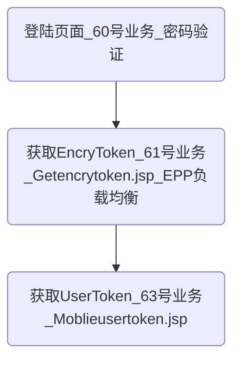

1、IPTV是什么？
>IPTV即交互式网络电视

2、EPG服务器是什么？
>IPTV的一个子系统，用于向用户提供节目等各方面服务。

## 登陆

3、登陆流程

4、EncryToken是什么？
>加密令牌 :业务管理平台为用户分配的临时身份证明,只用于认证加密。

5、负载均衡是什么？
>1. `负载均衡`是一种`网络技术`
>2. 将多个服务器以等价地位的方式组成一个服务器集合，将`服务器的负载`分摊到所有服务器上面。

6、EPG负载均衡
>1. 是指`用户`登录`EPG1`,`EPG1`会将用户信息交给一个总控的`Manager`，`Manager`通过判断进行负载均衡，然后将合适的服务器如`EPG3`的地址交给`EPG1`,`EPG1`将地址重定向到`EPG3`。

7、UserToken
>1. 用户令牌：用于表明用户的身份。
>2. `项目中多用于订购产品包等需要验证用户身份的情况`。

8、Token和Session
 >2. Session的状态是存储在服务器端，客户端只有session id；
 >1. 而Token的状态是存储在客户端

9、Token和Session的区别
>1. `Session`基于`Cookie`实现，`应用重启后丢失`。
>2. `Token`是为了防止`Cookie`被清除。
>3. 广义来说一切维护用户状态的技术都是session，
>4. 一切动态生成的服务端有能力鉴别真假而本身无涵义的字符串都是token

10、60/61号业务讲解
>1. 将用户`账号/密码`发送到服务器，验证是否有效。
>2. 走`61号`业务获取`EncryToken`，此时会进行`EPG`的负载均衡。
>3. `EncryToken`是用于后续的加密认证。

11、62/63号业务
>1. 带上`验证加密串`去获取`用户令牌`
>2. `验证加密串`：对`EncryToken、时间戳、随机字符串等`按照一定组合生成了一个字符串，然后通过`AES加密算法`进行加密，对加密后的结果用`Base64算法`转换为字符串。
>3. 其他会返回`EPG服务器新地址、特定请求的实际地址(搜索服务器等)、JSESSIONID`。

12、AES(高级加密标准)
> 是`对称密钥加密`中最流行的算法之一。

13、Base64的作用？
>Base64编码的作用：由于某些系统中只能使用ASCII字符。Base64就是用来将非ASCII字符的数据转换成ASCII字符的一种方法。

14、sessionID
>1. `Session`用于`解决Http协议中不能维持状态的问题`，`只存储于服务器，不进行网络传输，相对于Cookie更安全些`
>1. 第一次访问服务器会在服务器端生成一个session，有一个sessionid和它对应。
>2. tomcat生成的sessionid叫做jsessionid。

## 网络请求

1、项目网络请求的方法？
>1. 对`OKHttp`进行封装。
>2. 采用`线程池`-CachedThreadPool
>3. 接收到返回数据后`切换到UI`线程，回调给上层。
>* `Cookies`用于存放`JSESSIONID`

2、OkHttp3提供了Cookie的自动管理
>1. 客户端请求登陆后，服务端会返回带有唯一登陆认证信息Session的Response(存放在Cookie中)，如何实现在下次请求时自动放入呢？
>2. `OkHttp3`提供了`自动管理`
>3. 也可以手动添加。

## 升级策略

## 产品包订购

### 我的订购

## 首页海报

### 专题

## 预约(直播、影视、连续剧)

## 消息推送

## DLNA

### 投屏

### 回甩

## 性能优化

## 版本兼容适配

## 影视页面

## 即将上线、直播看什么

## 播放器相关

## 下载

## 换肤

## 数据缓存

## 参考资料
[OkHttp3简单的使用说明和Cookie自动化管理管理](https://blog.csdn.net/dmz1989/article/details/72903833)
