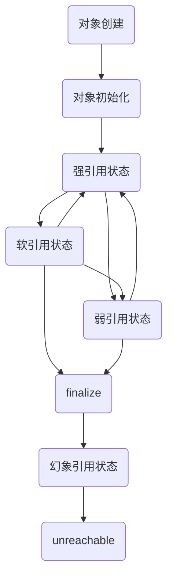

转载请注明链接：https://blog.csdn.net/feather_wch/article/details/82383183

>Java引用类型的知识点详解。
>1. 引用类型：强引用、软引用、弱引用、虚引用
>1. 对像生命周期和可达性状态
>1. 引用队列
1>. reachability fench(可达性栏杆)

# 引用类型

版本：2018/9/4-1(13:13)

---

[TOC]

## 问题汇总

1. 强引用、软引用、弱引用、幻想/虚引用有什么区别？具体的应用场景有哪些？
1. 不同引用类型的体现的本质区别是什么？
1. 强引用是什么？
1. 什么时候具有引用的对象可以被回收？
1. 软引用是什么？
1. 软引用有什么用？软引用的使用场景？
1. 弱引用是什么？
1. 弱引用有什么用？
1. 幻象引用/虚引用是什么？
1. 虚引用有什么用？虚引用的使用场景？
1. cleaner机制的特点
1. Java中5种可达性的级别
1. 强可达是什么？强引用状态？
1. 软可达是什么？软引用状态？
1. 弱可达是什么？弱引用状态？
1. 幻象可达/虚可达是什么？幻想引用状态？
1. 不可达状态？
1. 有哪些方法能达到强引用效果?
1. 【☆】Java对象会在该对象的方法执行完毕前被释放吗？何时会出现这种情况？
1. Reference.reachabilityFence(object)方法是干什么的？
1. 为什么需要Reachability Fence这种机制?
1. 直接只运行这个代码会出错吗?为什么？：Executors.newSingleThreadExecutor().submit()
1. reachabilityFence()方法的使用场景
1. 如何使用reachabilityFence()？

## 引用类型

1、不同引用类型的体现的本质区别是什么？
> 1. 体现的是对象不同的可达性状态
> 1. 以及对垃圾回收的影响。

3、强引用是什么？
> 1. 常见的对象引用
> 1. 只要对象有强引用，就表示该对象依然存活着。

4、什么时候具有引用的对象可以被回收？
> 1. 超过了引用的作用域
> 1. 强引用 = null

5、软引用是什么？
> 1. SoftReference
> 1. 相比于强引用要软一些，会去避免gc
> 1. 在内存不足时，出现oom前，会将软引用对象回收。

6、软引用有什么用？软引用的使用场景？
> 1. 常用于缓存
> 1. 内存足时能直接获取缓存；内存不足时会被释放。

7、弱引用是什么？
> 1. WeakReference
> 1. 不能豁免GC，提供了一种没有特殊约束的关系
> 1. 一个对象只有弱引用，会被直接GC。

8、弱引用有什么用？
> 1. 用于解决`内存泄露`

9、幻象引用/虚引用是什么？
> 1. PhantomReference
> 1. 不能通过该引用来访问对象。
> 1. 在对象finalize后，通过虚引用能做一些额外的工作。

10、虚引用有什么用？虚引用的使用场景？
> 1. 用于Java后来推出的Cleaner机制

11、cleaner机制的特点
> 1. 能作为清理工作的最后一道防线
> 1. 没有finalize的区别
> 1. 不建议去使用cleaner机制


## 生命周期和可达性状态

1、对象的生命周期以及可达性状态流程图。


2、Java中5种可达性的级别
>1. 强可达(Strong Reachable)
>1. 软可达(Soft Reachable)
>1. 弱可达(Weak Reachable)
>1. 幻象/虚可达(Phantom Reachable)
>1. 不可达(unreachable)

3、强可达、强引用状态？
> 对象有一个或者多个线程可以通过强引用就可以访问到

4、软可达、软引用状态？
> 只有通过软引用才可以访问到对象的状态

5、弱可达、弱引用状态？
> 1. 只能通过弱引用才可以访问到对象的状态
> 1. 无法通过软引用或者强引用访问到的状态
> 1. 弱引用一旦清除，就符合了finalize的条件

6、幻象可达/虚可达、幻想引用状态？
> 1. 没有强引用、软引用、弱引用
> 1. 并且已经finalize过后，只有虚引用指向该对象。

7、不可达状态？
> 对象可以被清除了

### 可达性状态的改变

8、Reference的get方法
> 1. 都是抽象类：java.lang.ref.Reference的子类
> 1. 提供了get方法。
> 1. 弱引用获取对象: `weakReference.get()`
> 1. 软引用获取对象: `softReference.get()`
> 1. 虚引用: `get()`无法获得原有地向，永远返回`null`

9、可达性状态可以改变吗?
> 可以！
> 1. 通过软引用、虚引用获得对象后，重新赋予`强引用`，此时就强行进入到了`强引用状态`

10、JVM垃圾回收会根据可达性状态进行回收
> 因为可能会更改可达性状态，所以JVM会进行二次确认。

11、为什么使用了弱引用还是出现了内存泄露？
> 1. 需要检查是否错误的保持了`强引用`
> 1. 比如赋值给`static 变量`

## 引用队列

1、引用队列是什么？有什么用？
> 1. ReferenceQueue, 引用队列
> 1. 在将各种类型的引用(如: 虚引用、弱引用、软引用)关联到对象时，可以选择是否关联`引用队列`
> 1. JVM会在特定时间将`引用`加入到`引用队列`中(不需要我们关心)
> 1. 作用：可以从队列中获取引用，并且执行后续的逻辑。

2、幻象引用/虚引用为什么一定要使用引用队列？
> 1. 虚引用在对象被finalize后，get方法只会返回null
> 1. 如果不使用`引用`队列，会导致`虚引用`完全没有用了。

3、引用队列的使用？(配合虚引用)
```java
Object object = new Object();
ReferenceQueue queue = new ReferenceQueue();
// 1. 创建虚引用。关联上引用队列。
PhantomReference reference = new PhantomReference(object, queue);
// 2. 去除强引用
object = null;
// 3. 触发GC
System.gc();

try {
    // 4. 从队列中取出对象的引用(本例中是虚引用)
    Reference ref = queue.remove(1000L);
    if(ref != null){
        // TODO somthing
        System.out.println("finalize后，进行清理工作。");
    }
} catch (InterruptedException e) {
    e.printStackTrace();
}
```

## 软引用的垃圾回收

1、软引用的垃圾回收的原理？
> 1. 软引用的垃圾回收，是在内存不足时，进行回收---本质不是这样。
> 1. 软引用`通常是在最后一次引用后保持一段时间`
> 1. 保持的时间是根据堆剩余空间计算的。

2、软引用只要内存充足就不会释放对象？
> 错误！
> 1. 是在最后一次引用后，保持一段时间，然后清除。

3、如何改变软引用释放的时间
> 1. 设置虚拟机参数
> 1. 但是这些行为都取决于JVM的实现，不要过于依赖这些参数。
```java
-XX:SoftRefLRUPolicyMSPerMB = 3000 // 3秒中
或者
-Xmx指定的最大值
```

## Reachability Fence(可达性栅栏)


1、有哪些方法能达到强引用效果?
> 1. 基本引用类型
> 1. 通过底层API---这就是所谓的设置Reachability Fence

2、为什么需要Reachability Fence这种机制?
> 1. 根据规范，一个对象没有强引用，则符合垃圾回收的标准。
> 1. 但是！如果有的对象，没有强引用，但是部分属性还需要被使用，就会导致问题。
> 1. Reachability Fence就是通过一些方法，在没有强引用时，告知JVM这些对象正在被使用，先不要进行GC。

3、Reachability Fence应对的问题
> 1. 例如：对象实例方法在执行完前，对象就已经被GC！
> 1. 例如：线程池-Executors.newSingleThreadExecutor().submit()
```java
public static void main(String[] args) {
    for (int i = 0; i < 2000; i++) {
        newSingleThreadPool();
    }
}
private static void newSingleThreadPool() {
    Executors.newSingleThreadExecutor().submit(new Runnable() {
        @Override
        public void run() {
            byte[] bytes = new byte[1024 * 1024 * 4];
            System.out.println(Thread.currentThread().getName());
        }
    });
}
```

4、Executors.newSingleThreadExecutor().submit()报错
```java
Exception in thread "main" java.util.concurrent.RejectedExecutionException: Task java.util.concurrent.FutureTask@543c6f6d rejected from java.util.concurrent.ThreadPoolExecutor@13eb8acf[Terminated, pool size = 0, active threads = 0, queued tasks = 0, completed tasks = 0]
	at java.util.concurrent.ThreadPoolExecutor$AbortPolicy.rejectedExecution(ThreadPoolExecutor.java:2047)
	at java.util.concurrent.ThreadPoolExecutor.reject(ThreadPoolExecutor.java:823)
	at java.util.concurrent.ThreadPoolExecutor.execute(ThreadPoolExecutor.java:1369)
	at java.util.concurrent.AbstractExecutorService.submit(AbstractExecutorService.java:112)
	at java.util.concurrent.Executors$DelegatedExecutorService.submit(Executors.java:678)
	at Main.newSingleThreadPool(Main.java:32)
	at Main.main(Main.java:28)
```

5、reachabilityFence()方法的使用场景
> 1. JDK中常用于`Excutors`、HTTP2客户端等经常会异步调用的情况。

6、如何使用reachabilityFence()？
> 1-Excutor的问题：
```java
Executors.newSingleThreadExecutor().submit(xxx);
// 调用这个方法，用于通知JVM，Excutor对象还不能回收
Reference.reachabilityFence(executor);
```
> 2-一般对象的设置
```java
Reference.reachabilityFence(object);
```

## 参考资料
1. [为什么一个对象的实例方法在执行完成之前其对象可以被GC回收?](https://www.zhihu.com/question/51244545)
