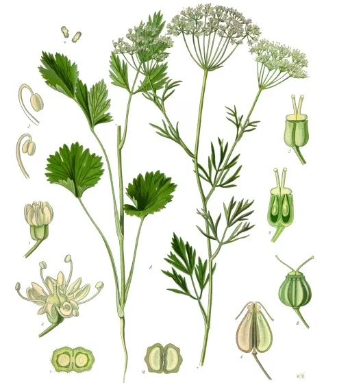
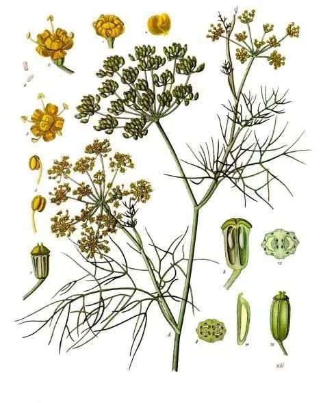
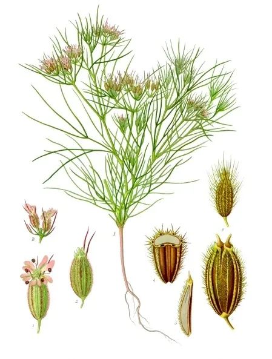
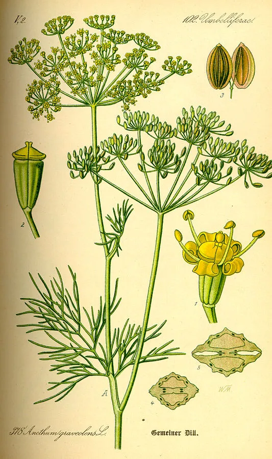

## 1、香草过冬
最低温度分区图
三区 零下40-34摄氏度：
> 薄荷，地面部分枯萎，根部休眠，等待春季发芽。9区以上常绿。
> 薰衣草：非常耐寒
> 法国龙艾
> 虾夷葱
四区 零下34-29摄氏度：百里香，盆栽要做好根部保暖才能顺利过冬
五区 零下29-23摄氏度：
> 鼠尾草：可以安全过冬
六区
七区 零下18-12摄氏度：
> 牛至：九区以上常绿
> 迷迭香：耐寒性较弱
八区 零下12-7摄氏度
九区 零下7-1摄氏度
十区

越冬含义：
1. 植物已经扎根
2. 植株有良好的木质化
3. 不是新栽种的植株

8区以下寒冷地区：需要春秋栽种，才能拙长成长，安全越冬

一年生植物不存在越冬

## 2、常用香草（一）
百里香：百搭，适合牛排
迷迭香：非常浓郁鲜明，适合味道大的如“迷迭香炖羊肉”、甜品、饮品
意大利芹：直叶，味道重一点，地中海菜、意大利菜，突出欧芹味道
荷兰芹：卷叶（又名“法香”），可以装饰，欧芹不会错
莳萝：像小茴香但不一样（小茴香饺子味道浓郁），莳萝气味香甜，小茴香气味草本。莳萝适合海鲜和味道清淡的，例如青口贝、三文鱼。适合装饰。
罗勒：甜罗勒和九层塔枝条紫色，九层塔味道辛辣浓郁适合亚洲料理（三杯鸡）、泰国菜等（名为Thai Basil）。罗勒适合意大利菜，青口贝、炖菜、玛格丽特披萨、青酱

## 3、香草和香料

香草：新鲜
香料：烘干的

迷迭香：知名意大利，【迷迭香烤鸡】
罗勒：需要非常新鲜、加热会变黑。很搭配西红柿

## 4、莳萝、小茴香、孜然

三者同属于伞形科，但莳萝是莳萝属（Anethum），小茴香是茴香属（Foeniculum），孜然是孜然芹属（Cuminum）

顶多算亲戚关系

### 5、大茴香 Anise

> 1. 学名Pimpinella anisum，即洋茴香，大茴香，欧洲大茴香
> 2. 作用：酿酒，比如苦艾酒
> 3. 国内大茴香会产生歧义，大茴香也可能指的是八角（大料）
>   

### 6、小茴香/茴香 Fennel
> 1. 学名Foeniculum Vulgare 即茴香，小茴香
> 2. 味道：清新，一丝丝甜
> 3. 食物：北方饺子、籽是印度和中东常见香料
>   

### 7、孜然芹/安息茴香 Cumin或Cummin

> 1. 学名Cuminum cyminum
> 2. 用途：孜然就是籽
>   

### 8、莳萝 Dill

> 1. 学名Anethum graveolens
> 1. 莳萝和小茴香区别：茴香发甜，莳萝味辛
> 1. 作用：鱼肉去腥
>   

## 9、九层塔

1. 九层塔比甜罗勒更耐寒一点
2. 九层塔和甜罗勒都更适合插条繁殖
3. 都适合初学者

## 10、紫苏

紫苏（Perilla frutescens (L.) Britt.）

是什么：
唇形科紫苏属的一年生直立草本植物
茎绿色或紫色

花期果期：
花期8~11月，果期8~12月

由来：
华佗有一次用一种紫色的草救了一群中毒的人，为记住这种草药，他便起名“紫舒”，后人称该药草为紫苏。 [7]

产地：
紫苏原产于中国， 在中国已有2000多年种植历史， 
分布范围广，中国各地均有栽培，在国外分布于不丹，印度，朝鲜等地。 

习性：
紫苏性喜温暖、湿润环境，较耐高温，在高温雨季生长旺盛，喜欢在排水良好的土壤中生长，排水不良会严重影响其产量和品质
种植紫苏时以向阳、土层深厚、疏松肥沃的砂质壤土为好； 

繁殖：
繁殖方式是种子繁殖，分直播和育苗移栽。 

药效：
《本草汇言》中记载紫苏具有解表散寒，行气宽中，安胎等功效，主治风寒感冒、胸闷呕吐、胎动不安等症状。 [11]紫苏内拥有特有的活性物质和营养成分，可作药用、食用、油用，作香料用等，经济价值较高，是一种多用途植物。 

花语：
[8]因紫苏的外表看起来不起眼，所以它的花语是平凡。 [13]

## 橄榄的由来

1、中国的橄榄
1. 别名青果，橄榄科橄榄属乔木植物
2. 2000年历史
3. 亚热带
4. 为青皮橄榄、黑皮橄榄
5. 味道：咸鲜味

2、地中海的橄榄
1. 油橄榄：木犀科木犀榄属的油料作物
1. 品种丰富：希腊的科洛尼亚、土耳其的安科拉、意大利的利古里亚和西班牙的皮卡罗蒂
2. 希腊的科洛尼亚的芳香气息
3. 意大利的利古里亚的苦味和辛辣味道

