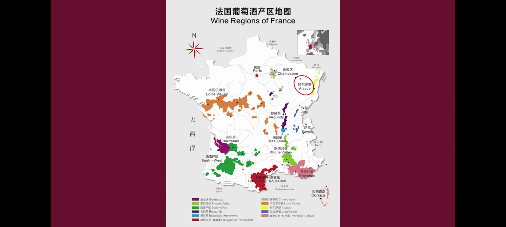

西拉子适合牛排🥩互相配合
意大利面肉酱+红酒
雷司令很轻盈不适合重口味，适合沙拉，奶酪，甜点。

白配白

rose葡萄酒适合番茄炒鸡蛋🍅

重口配红
清淡配白

甜白葡萄酒：甜的葡萄酒，对女生适合
贵腐酒：匈牙利。珍贵，用葡萄皮上的贵腐菌酿造而成。

“我看你蛮懂的 我不懂 你看像我这种 你觉得可以推荐什么酒”真诚就很棒！装逼就完蛋。

怎么开酒：
1. 挑完酒，去后台拿好了给你看。ok 没问题😁。直接在你面前开。
2. 会先在你的杯子里 倒一口酒。“先品一下，看看酒有没有坏。”酒到脖子了，代表漏气有蒸发了的。不然只有一口酒的空隙不会更多。可以说“这个怎么蒸发那么多，不行换一瓶”
3.塞子拿给你，可以闻一下，看看有没有酒坏的味道。一口可以喝一下，品酒（舌头卷起来），只是尝尝有没有坏。（纯酱油味，就可以要求换一个）
4. 服务员懂得会先给女士倒酒。再给你倒。谢谢一下就ok。

侍酒师：
喜欢果味重的，酒体饱满的，清淡一些的，甜一些的。

house
意思是都按照杯卖，而不是瓶。

再好的酒再怎么保存放一周都不行了。再久就酱油味的。
好酒只按瓶卖。

碰杯需要注意什么🍻：不要太猛，有的玻璃杯很容易碎。轻轻碰一下。

服务员帮忙倒酒：您好，有空可以帮忙倒一下酒吗？“我自己来就行 谢谢你”
红酒可以存吗：不可以存

红酒会不会坏：也不会馊掉就是酱油化了。

照顾女神
1. 给女生倒酒倒一点，视觉上最好看的（在酒肚子交界处即可）
2. 边倒边转，避免酒挂在瓶身，滴下来

发现女生拿的姿势是错的，怎么加分？：不要教人！这是表现自己，是不自信（站着的时候拿着底座）自己正确的做就行了。

怎么用红酒和女生聊天
1. 推荐一款酒：鳕鱼加白葡萄酒，甜点就雷司令
2. 黑皮诺（哦你想要喝法国勃艮第产区的）来挑选一个。作为话题开启聊。

【关键词复试】重复对方的话

知名产区
法国五大酒庄都在xxx
法国🇫🇷波尔多 bordeaux法文bourgogne
法国🇫🇷勃艮第 burgundy
是波尔多的但是没写，写了小村庄/酒庄说明更好
aoc都是波尔多的标法

美国🇺🇸加州 仙粉黛
澳洲 奔富 西拉子
德国🇩🇪 雷司令，甜白，贵腐酒。少
西班牙🇪🇸里奥哈产区 ，
意大利🇮🇹巴楼罗
新西兰🇳🇿白葡萄酒，偏冷，雷司令，长相思
阿根廷🇦🇷马尔贝克
智利🇨🇱中央山谷，有橡木桶，18个月以上的200，很浓郁。
加拿大🇨🇦ice wine 冰酒 甜酒很好喝（冷的地方容易出甜酒，越腐化甜度越高，冷的地方就容易酿甜酒）

  

🇫🇷产区
1. 阿尔萨斯：有琼瑶浆，灰比诺（白），雷司令
2. 波尔多（法国最著名）：各种葡萄按比例混合。（此勾兑非比勾兑）
酒瓶有肩膀，会有一些沉淀物，肩膀可以挡住。
下面有产区 梅多克
3. 勃艮第：酒瓶没有肩膀，没有沉淀物。黑比诺。博若莱新酒（佳美 葡萄品种，叫新酒是越新的约好喝，+鹅肝 很鲜美）
4. 香槟产区：
5. 麝香葡萄（适合晚收，11月份12，有点烂了）酿造甜酒
起泡，白，红，甜白（半甜，全甜）甜味是自然产生的

肩膀：
法国南部和勃艮第（皮薄 杂质少）的酒都没有肩膀。
波尔多所有酒（皮厚杂志多）都有肩膀

橡木桶：全世界两种
  

澳洲酒 不锈钢酿造+橡木片。
橡木味：更贵
有的酒：会标注有没有橡木桶

特级珍藏：橡木桶18个月以上。
珍藏级：12个月

西班牙分餐酒和上档次酒

法国🇫🇷AOC 不按欧洲来就按自己的要求来。
aoc比vdp餐酒好一些
aoc如果是里面小的产区可能中间不是o
